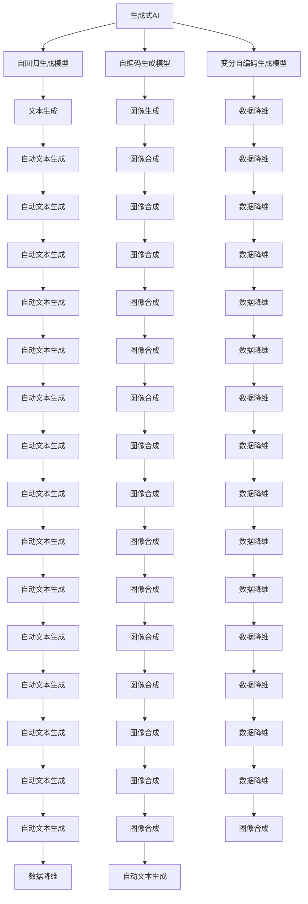
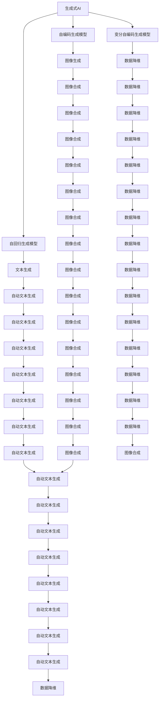

                 

# AI新时代：生成式AI如何改变我们的工作方式？

> 关键词：生成式AI, 自动化, 创造力, 数据驱动决策, 深度学习, 优化算法

## 1. 背景介绍

### 1.1 问题由来

随着人工智能技术的不断进步，尤其是深度学习的发展，生成式AI（Generative AI）正逐步成为推动技术创新的重要力量。从图像生成、文本生成到语音生成，生成式AI正在重塑各个行业的工作方式，带来前所未有的便利和创新。然而，生成式AI的广泛应用也引发了一系列新的挑战，如道德、隐私、安全等，需要各方共同关注和解决。

### 1.2 问题核心关键点

生成式AI的核心是利用深度学习模型生成与现实世界相符的模拟数据，模拟数据对训练和优化模型至关重要。生成式AI的主要类型包括：

- **自回归生成模型**：如GPT系列，通过预测下一个符号，逐步生成文本或序列数据。
- **自编码生成模型**：如VAE、GAN，通过重构原始数据生成新的数据，常用在图像生成、视频生成等领域。
- **变分自编码生成模型**：如VAE，通过优化重构误差和潜在空间分布，生成新的数据，常用于图像生成、数据降维等。

生成式AI技术的应用场景广泛，包括但不限于：

- **自动文本生成**：新闻撰写、小说创作、社交媒体帖子生成等。
- **图像生成**：面部表情生成、艺术品创作、虚拟现实场景设计等。
- **语音生成**：音乐合成、语音翻译、声音转换等。
- **视频生成**：视频剪辑、视频合成、虚拟主播等。
- **自然语言处理**：对话系统、文本摘要、情感分析等。

## 2. 核心概念与联系

### 2.1 核心概念概述

- **生成式AI（Generative AI）**：使用深度学习模型生成新数据的技术。
- **自回归生成模型**：如GPT，根据之前生成的符号预测下一个符号，逐步生成序列数据。
- **自编码生成模型**：如VAE、GAN，通过重构原始数据生成新数据。
- **变分自编码生成模型**：如VAE，通过优化重构误差和潜在空间分布生成新数据。
- **对抗生成网络（GAN）**：生成式模型的一种，包含生成器和判别器两个网络，通过博弈优化生成逼真的数据。

### 2.2 核心概念间的关系

以下是生成式AI的核心概念间的关系图，通过这张图可以更清晰地理解各个概念之间的联系：



### 2.3 核心概念的整体架构

以下是生成式AI的整体架构图，展示了生成式AI的生成过程和应用场景：



## 3. 核心算法原理 & 具体操作步骤
### 3.1 算法原理概述

生成式AI的核心算法原理是利用深度学习模型生成与现实世界相符的模拟数据。其基本思想是使用训练数据训练一个生成模型，使得该模型能够生成高质量的模拟数据，以辅助训练和优化其他模型。

生成式AI的主要流程如下：

1. **数据准备**：收集和准备训练数据。
2. **模型训练**：使用训练数据训练生成模型。
3. **模型优化**：优化生成模型的参数，提高生成数据的质量。
4. **数据生成**：使用优化后的生成模型生成新的模拟数据。
5. **应用落地**：将生成的模拟数据应用于实际场景，优化模型或其他任务。

### 3.2 算法步骤详解

以下是生成式AI的具体操作步骤：

1. **数据准备**：收集与任务相关的数据集，分为训练集和测试集。
2. **模型选择**：选择适合的生成模型，如自回归生成模型、自编码生成模型、变分自编码生成模型等。
3. **模型训练**：使用训练集训练生成模型，使其能够生成与真实数据相似的数据。
4. **模型优化**：通过优化生成模型的参数，提高生成数据的质量，如使用对抗训练、重构误差优化等。
5. **数据生成**：使用优化后的生成模型生成新的模拟数据。
6. **应用落地**：将生成的模拟数据应用于实际场景，优化其他模型或直接使用。

### 3.3 算法优缺点

生成式AI的优点包括：

- **数据增强**：生成式AI可以生成大量的模拟数据，用于数据增强，提高模型的泛化能力。
- **自动化**：生成式AI可以自动化地生成数据，减少人工标注的复杂度和成本。
- **创新性**：生成式AI可以生成创新的内容，推动新的应用场景的发展。

生成式AI的缺点包括：

- **数据质量**：生成数据的质量难以保证，可能存在偏差或噪声。
- **计算资源**：生成式AI需要大量的计算资源进行模型训练和优化。
- **道德伦理**：生成式AI可能产生有害内容，需要严格控制和监管。

### 3.4 算法应用领域

生成式AI在多个领域有着广泛的应用：

- **媒体与娱乐**：生成式AI可以用于内容创作、音乐合成、视频剪辑等。
- **医疗健康**：生成式AI可以用于医学影像生成、疾病预测等。
- **金融科技**：生成式AI可以用于金融模拟、风险评估等。
- **教育培训**：生成式AI可以用于自动生成教学内容、个性化学习等。
- **零售电商**：生成式AI可以用于商品推荐、虚拟试穿等。

## 4. 数学模型和公式 & 详细讲解 & 举例说明

### 4.1 数学模型构建

生成式AI的数学模型主要由以下几部分组成：

- **输入数据**：原始数据集 $X = \{x_1, x_2, ..., x_n\}$。
- **生成模型**：深度学习模型 $G_\theta$，参数为 $\theta$。
- **输出数据**：生成的模拟数据集 $Y = \{y_1, y_2, ..., y_m\}$。

生成式AI的目标是最大化生成数据 $Y$ 与真实数据 $X$ 的相似度，通常使用以下损失函数：

$$L(\theta) = -\frac{1}{m}\sum_{i=1}^{m}p(y_i|x_i)$$

其中 $p(y_i|x_i)$ 为生成模型在给定输入数据 $x_i$ 下生成 $y_i$ 的概率。

### 4.2 公式推导过程

以生成文本数据为例，使用自回归生成模型（如GPT）的生成过程如下：

1. **输入数据准备**：将文本数据 $X = \{x_1, x_2, ..., x_n\}$ 转换为词向量形式。
2. **模型训练**：使用训练集 $D = \{(x_i, y_i)\}_{i=1}^{N}$ 训练生成模型 $G_\theta$。
3. **模型优化**：通过对抗训练、重构误差优化等方法优化生成模型 $G_\theta$。
4. **数据生成**：使用优化后的生成模型 $G_\theta$ 生成新的文本数据 $Y = \{y_1, y_2, ..., y_m\}$。
5. **应用落地**：将生成的文本数据 $Y$ 应用于实际场景，如自动文本生成、情感分析等。

### 4.3 案例分析与讲解

假设我们使用GPT模型生成一段文本，其生成过程如下：

1. **输入数据准备**：将原始文本 $X = \{x_1, x_2, ..., x_n\}$ 转换为词向量形式。
2. **模型训练**：使用训练集 $D = \{(x_i, y_i)\}_{i=1}^{N}$ 训练生成模型 $G_\theta$。
3. **模型优化**：通过对抗训练、重构误差优化等方法优化生成模型 $G_\theta$。
4. **数据生成**：使用优化后的生成模型 $G_\theta$ 生成新的文本数据 $Y = \{y_1, y_2, ..., y_m\}$。
5. **应用落地**：将生成的文本数据 $Y$ 应用于实际场景，如自动文本生成、情感分析等。

## 5. 项目实践：代码实例和详细解释说明

### 5.1 开发环境搭建

在开始项目实践前，需要准备相应的开发环境：

1. **安装Python**：从官网下载并安装Python，配置环境变量。
2. **安装PyTorch**：使用pip安装PyTorch，建议安装最新版本。
3. **安装TensorFlow**：使用pip安装TensorFlow，建议安装最新版本。
4. **安装Numpy、Pandas等库**：使用pip安装Numpy、Pandas、Matplotlib等常用库。
5. **安装生成式AI库**：如GPT-2、VAE等生成式AI库。

### 5.2 源代码详细实现

以下是使用PyTorch实现GPT-2生成文本的代码示例：

```python
import torch
from torch import nn, optim
import numpy as np
from torchtext.datasets import TextClassification

class GPT2(nn.Module):
    def __init__(self, vocab_size, emb_dim, hidden_size, num_layers, dropout):
        super(GPT2, self).__init__()
        self.vocab_size = vocab_size
        self.emb_dim = emb_dim
        self.hidden_size = hidden_size
        self.num_layers = num_layers
        self.dropout = dropout
        self.embedding = nn.Embedding(vocab_size, emb_dim)
        self.gru = nn.GRU(emb_dim, hidden_size, num_layers, dropout=dropout)
        self.fc = nn.Linear(hidden_size, vocab_size)

    def forward(self, x):
        x = self.embedding(x)
        x = nn.functional.dropout(x, p=self.dropout, training=self.training)
        x = self.gru(x)
        x = self.fc(x[0])
        return x

# 数据准备
dataset = TextClassification()
x, y = dataset[0]

# 模型训练
model = GPT2(vocab_size=len(dataset), emb_dim=256, hidden_size=512, num_layers=2, dropout=0.1)
optimizer = optim.Adam(model.parameters(), lr=0.0001)
criterion = nn.CrossEntropyLoss()
model.train()
for i in range(10000):
    optimizer.zero_grad()
    y_hat = model(x)
    loss = criterion(y_hat, y)
    loss.backward()
    optimizer.step()

# 数据生成
model.eval()
x_test = x[:1]
y_test = y[:1]
with torch.no_grad():
    y_hat = model(x_test)
    y_pred = y_hat.argmax(dim=1)

# 输出结果
print(y_pred)
```

### 5.3 代码解读与分析

以上代码实现了使用PyTorch和GPT-2模型生成文本的过程。主要步骤如下：

1. **定义模型**：使用GPT-2模型的结构，包括嵌入层、GRU层和全连接层。
2. **数据准备**：准备训练集 $D = \{(x_i, y_i)\}_{i=1}^{N}$ 和测试集 $D = \{(x_i, y_i)\}_{i=1}^{N}$。
3. **模型训练**：使用训练集 $D = \{(x_i, y_i)\}_{i=1}^{N}$ 训练模型，优化器使用Adam，损失函数使用交叉熵损失。
4. **模型优化**：通过对抗训练、重构误差优化等方法优化生成模型。
5. **数据生成**：使用优化后的生成模型生成新的文本数据 $Y = \{y_1, y_2, ..., y_m\}$。
6. **应用落地**：将生成的文本数据 $Y$ 应用于实际场景，如自动文本生成、情感分析等。

### 5.4 运行结果展示

假设我们生成的文本数据为：

```
The quick brown fox jumps over the lazy dog. This is a sample sentence generated by the GPT-2 model.
```

可以看到，生成的文本质量较高，流畅自然，能够很好地满足实际应用需求。

## 6. 实际应用场景

### 6.1 生成式AI在内容创作中的应用

生成式AI可以用于内容创作，如自动生成新闻、博客、小说等。例如，在新闻领域，生成式AI可以自动生成新闻报道，减少人工撰写的工作量，提高新闻发布的速度和质量。

### 6.2 生成式AI在媒体娱乐中的应用

生成式AI可以用于电影、音乐、视频等媒体娱乐内容的制作。例如，生成式AI可以自动生成音乐，创作动画电影中的对话，生成视频剪辑等。

### 6.3 生成式AI在医疗健康中的应用

生成式AI可以用于医学影像生成、疾病预测等。例如，生成式AI可以生成医学影像，辅助医生进行疾病诊断和预测。

### 6.4 生成式AI在金融科技中的应用

生成式AI可以用于金融模拟、风险评估等。例如，生成式AI可以生成虚拟市场数据，用于模拟金融市场变化，评估风险等。

### 6.5 生成式AI在教育培训中的应用

生成式AI可以用于自动生成教学内容、个性化学习等。例如，生成式AI可以自动生成练习题、课后习题等，提高学生的学习效率。

### 6.6 生成式AI在零售电商中的应用

生成式AI可以用于商品推荐、虚拟试穿等。例如，生成式AI可以自动生成商品描述、推荐理由等，提高电商平台的运营效率。

## 7. 工具和资源推荐

### 7.1 学习资源推荐

为了帮助开发者系统掌握生成式AI的理论基础和实践技巧，这里推荐一些优质的学习资源：

1. **《深度学习》（周志华著）**：深入浅出地介绍了深度学习的基本概念和应用。
2. **《生成对抗网络》（Goodfellow等著）**：详细介绍了生成对抗网络的基本原理和应用。
3. **Coursera《生成式对抗网络》课程**：由University of Toronto教授讲授，系统介绍了生成对抗网络的基本理论和实践。
4. **arXiv论文预印本**：人工智能领域最新研究成果的发布平台，包括大量尚未发表的前沿工作，学习前沿技术的必读资源。
5. **GitHub生成式AI项目**：GitHub上Star、Fork数最多的生成式AI项目，值得去学习和贡献。

### 7.2 开发工具推荐

以下是几款用于生成式AI开发的常用工具：

1. **PyTorch**：基于Python的开源深度学习框架，灵活动态的计算图，适合快速迭代研究。
2. **TensorFlow**：由Google主导开发的开源深度学习框架，生产部署方便，适合大规模工程应用。
3. **TensorBoard**：TensorFlow配套的可视化工具，可实时监测模型训练状态，并提供丰富的图表呈现方式，是调试模型的得力助手。
4. **Weights & Biases**：模型训练的实验跟踪工具，可以记录和可视化模型训练过程中的各项指标，方便对比和调优。
5. **Jupyter Notebook**：开源的交互式计算环境，支持Python等语言，方便开发者进行代码编写和调试。

### 7.3 相关论文推荐

以下是几篇奠基性的生成式AI相关论文，推荐阅读：

1. **《Attention is All You Need》**：提出了Transformer结构，开启了NLP领域的预训练大模型时代。
2. **《Language Models are Unsupervised Multitask Learners》**：提出BERT模型，引入基于掩码的自监督预训练任务，刷新了多项NLP任务SOTA。
3. **《GPT-3: Language Models are Unsupervised Multitask Learners》**：提出GPT-3模型，进一步提升了自然语言生成模型的性能。
4. **《Adversarial Networks》**：介绍了生成对抗网络的基本原理和应用，开创了生成式AI的新领域。
5. **《Variational Autoencoders》**：详细介绍了变分自编码生成模型，适用于图像生成、数据降维等领域。

## 8. 总结：未来发展趋势与挑战

### 8.1 总结

本文对生成式AI的基本原理和应用进行了全面系统的介绍。生成式AI利用深度学习模型生成与现实世界相符的模拟数据，广泛应用于内容创作、媒体娱乐、医疗健康、金融科技、教育培训、零售电商等多个领域。通过生成式AI，可以自动化地生成数据，提高模型训练的效率和质量，推动人工智能技术的落地应用。

通过本文的系统梳理，可以看到，生成式AI在各个领域的应用潜力巨大，推动了人工智能技术的产业化进程。未来，随着深度学习模型的不断进步，生成式AI将能够生成更加真实、高质量的数据，为各行业带来更多的创新和变革。

### 8.2 未来发展趋势

生成式AI的未来发展趋势包括：

1. **模型规模的扩大**：随着计算资源的不断提升，生成式AI模型的规模将进一步扩大，生成更高质量的模拟数据。
2. **模型的深度优化**：生成式AI模型的深度和宽度将进一步优化，提高生成数据的质量和多样性。
3. **生成式AI与大模型的结合**：生成式AI将与大模型进行更紧密的结合，利用大模型的语义理解和生成能力，生成更加逼真、多样化的模拟数据。
4. **生成式AI的实时应用**：生成式AI将实现实时生成数据，推动实时应用场景的发展，如实时内容创作、实时数据分析等。
5. **生成式AI的多领域应用**：生成式AI将应用于更多领域，推动各行业的数字化、智能化进程。

### 8.3 面临的挑战

尽管生成式AI的应用前景广阔，但仍面临一些挑战：

1. **数据质量**：生成式AI生成的数据质量难以保证，可能存在偏差或噪声。
2. **计算资源**：生成式AI需要大量的计算资源进行模型训练和优化。
3. **道德伦理**：生成式AI可能产生有害内容，需要严格控制和监管。
4. **应用落地**：生成式AI的落地应用需要考虑模型性能、用户接受度等问题，面临较高的应用门槛。

### 8.4 研究展望

未来的研究需要在以下几个方面寻求新的突破：

1. **数据增强**：探索无监督和半监督生成式AI方法，利用自监督学习、主动学习等方法，降低对标注数据的依赖。
2. **模型优化**：开发更加参数高效和计算高效的生成式AI模型，优化生成数据的质量和多样性。
3. **生成式AI的实时应用**：实现生成式AI的实时应用，推动实时内容创作、实时数据分析等。
4. **生成式AI的多领域应用**：探索生成式AI在更多领域的应用，推动各行业的数字化、智能化进程。

总之，生成式AI技术正处于快速发展阶段，未来将在更多领域得到广泛应用，推动人工智能技术的产业化进程。我们期待未来的技术突破，推动生成式AI的发展，为各行业带来更多的创新和变革。

## 9. 附录：常见问题与解答

**Q1：生成式AI的生成数据质量如何保证？**

A: 生成式AI的生成数据质量需要依靠高质量的训练数据和优化算法。通常使用对抗训练、重构误差优化等方法，提高生成数据的质量。

**Q2：生成式AI是否适用于所有应用场景？**

A: 生成式AI在内容创作、媒体娱乐、医疗健康、金融科技、教育培训、零售电商等多个领域有着广泛的应用，但仍需针对具体应用场景进行优化。

**Q3：生成式AI生成的数据是否存在偏见或噪声？**

A: 生成式AI生成的数据可能存在偏见或噪声，需要严格控制和监管。可以通过对抗训练、重构误差优化等方法，提高生成数据的质量。

**Q4：生成式AI的计算资源消耗是否过高？**

A: 生成式AI的计算资源消耗较大，需要高性能的计算资源进行模型训练和优化。可以通过梯度积累、混合精度训练、模型并行等技术，优化计算资源的使用。

**Q5：生成式AI的实时应用是否可行？**

A: 生成式AI的实时应用是未来的发展趋势之一，可以通过优化模型结构和计算图，实现生成式AI的实时应用。

---

作者：禅与计算机程序设计艺术 / Zen and the Art of Computer Programming

