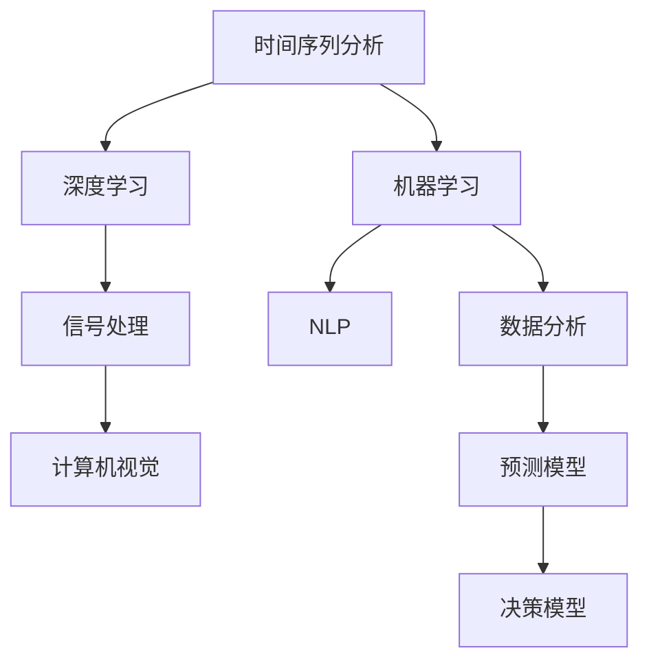

                 

# AI时空建模的关键步骤

> 关键词：人工智能, 时空建模, 深度学习, 计算机视觉, 自然语言处理, 信号处理, 机器学习

## 1. 背景介绍

随着人工智能技术的迅猛发展，AI时空建模成为了当前科技前沿的热门话题。在时间序列分析、图像处理、语音识别、自然语言理解等领域，AI时空建模技术已经被广泛应用。然而，由于其涉及的时间跨度和多维度数据的复杂性，AI时空建模在实际应用中仍面临着诸多挑战。本文将系统介绍AI时空建模的关键步骤，结合实际案例，详细讲解模型的构建和优化方法，为读者提供实用的指导。

## 2. 核心概念与联系

### 2.1 核心概念概述

要深入理解AI时空建模，首先需要了解其核心概念：

- **时间序列分析（Time Series Analysis）**：指对时间维度上的数据进行统计、分析和预测。广泛应用于金融、气象、交通等领域。
- **计算机视觉（Computer Vision）**：指让计算机理解和分析图像和视频数据，进行对象检测、图像分类、图像生成等任务。
- **自然语言处理（Natural Language Processing, NLP）**：指让计算机理解和生成人类语言，实现机器翻译、情感分析、文本生成等。
- **信号处理（Signal Processing）**：指对声音、图像等信号进行采集、分析和处理，是通信、医疗、音乐等领域的基础。
- **机器学习（Machine Learning）**：指通过算法和数据训练模型，实现自动化的预测和决策。

这些核心概念在AI时空建模中相互关联，共同构建起复杂的时空数据处理和分析框架。

### 2.2 概念间的关系

AI时空建模的关键在于综合运用上述核心概念，处理多维度、高复杂性的时空数据。不同领域的时空建模方法虽然有所不同，但其基本流程和步骤大致相似。以下是主要的概念关系图：



这个图展示了不同领域的时空建模如何相互关联，并整合到机器学习框架中。深度学习作为机器学习的核心，提供了强大的模型学习能力，信号处理为图像、视频等信号数据提供基础处理技术，计算机视觉和NLP则是针对特定类型的时空数据进行高级分析。

## 3. 核心算法原理 & 具体操作步骤

### 3.1 算法原理概述

AI时空建模的核心原理是利用机器学习模型对时空数据进行分析和预测。一般步骤包括数据预处理、特征提取、模型选择与训练、评估与优化等。

1. **数据预处理**：包括数据清洗、归一化、采样等，确保数据质量。
2. **特征提取**：将原始数据转化为模型可用的特征，如时间序列的滑动窗口、图像的卷积层特征、文本的词向量等。
3. **模型选择与训练**：根据任务需求选择合适的模型，如RNN、CNN、LSTM等，并使用历史数据进行训练。
4. **评估与优化**：使用测试集评估模型性能，并通过调整超参数、引入正则化等方法进行优化。

### 3.2 算法步骤详解

#### 3.2.1 数据预处理

数据预处理是AI时空建模的基础。以时间序列分析为例，预处理步骤包括：

1. **数据清洗**：去除缺失值、异常值，确保数据完整性。
2. **归一化**：将数据缩放到0-1或-1到1之间，避免梯度爆炸或消失。
3. **采样**：将长序列数据分割成短时序样本，便于模型训练。

具体代码实现：

```python
import pandas as pd
import numpy as np

# 读取时间序列数据
df = pd.read_csv('time_series_data.csv')

# 数据清洗
df = df.dropna()

# 归一化
df['value'] = (df['value'] - df['value'].mean()) / df['value'].std()

# 采样
seq_length = 10
X = []
y = []
for i in range(len(df)-seq_length):
    X.append(df[i:i+seq_length]['value'].tolist())
    y.append(df[i+seq_length]['value'][0])
X = np.array(X)
y = np.array(y)
```

#### 3.2.2 特征提取

特征提取是将原始数据转化为模型可用的特征。以计算机视觉为例，特征提取步骤包括：

1. **图像预处理**：包括裁剪、缩放、归一化等。
2. **卷积操作**：通过卷积层提取图像特征。
3. **特征池化**：将特征图降维，减少计算量。

具体代码实现：

```python
from torchvision.transforms import Compose, Resize, ToTensor
from torchvision.models import resnet18

# 定义数据预处理
transform = Compose([
    Resize((224, 224)),
    ToTensor()
])

# 加载模型
model = resnet18(pretrained=True)

# 特征提取
features = []
for img in images:
    img_tensor = transform(img)
    feature_map = model.conv1(img_tensor).detach().numpy()
    features.append(feature_map)
```

#### 3.2.3 模型选择与训练

模型选择与训练是AI时空建模的核心环节。以自然语言处理为例，训练步骤包括：

1. **模型选择**：根据任务需求选择合适的模型，如LSTM、BERT等。
2. **损失函数**：选择合适的损失函数，如交叉熵损失。
3. **优化器**：选择合适的优化器，如Adam。

具体代码实现：

```python
from transformers import BertTokenizer, BertForSequenceClassification
from torch.utils.data import DataLoader
from sklearn.model_selection import train_test_split

# 加载模型
tokenizer = BertTokenizer.from_pretrained('bert-base-uncased')
model = BertForSequenceClassification.from_pretrained('bert-base-uncased', num_labels=2)

# 加载数据
texts, labels = load_data()

# 数据划分
train_texts, test_texts, train_labels, test_labels = train_test_split(texts, labels)

# 数据处理
train_data = [(tokenizer.encode(text, add_special_tokens=True), label) for text, label in zip(train_texts, train_labels)]
test_data = [(tokenizer.encode(text, add_special_tokens=True), label) for text, label in zip(test_texts, test_labels)]

# 定义数据加载器
train_loader = DataLoader(train_data, batch_size=16, shuffle=True)
test_loader = DataLoader(test_data, batch_size=16, shuffle=False)

# 定义超参数
lr = 2e-5
epochs = 3

# 定义优化器和损失函数
optimizer = AdamW(model.parameters(), lr=lr)
loss_fn = nn.CrossEntropyLoss()

# 训练模型
for epoch in range(epochs):
    model.train()
    for batch in train_loader:
        input_ids, labels = batch
        outputs = model(input_ids)
        loss = loss_fn(outputs, labels)
        optimizer.zero_grad()
        loss.backward()
        optimizer.step()
        
    model.eval()
    with torch.no_grad():
        accuracy = compute_accuracy(test_loader, model)
        print(f"Epoch {epoch+1}, accuracy: {accuracy:.3f}")
```

#### 3.2.4 评估与优化

评估与优化是AI时空建模的重要环节，用于评估模型性能并优化模型参数。以信号处理为例，优化步骤包括：

1. **评估指标**：选择合适的评估指标，如均方误差（MSE）、信噪比（SNR）等。
2. **超参数调优**：通过网格搜索、随机搜索等方法调整超参数，提升模型性能。
3. **模型融合**：通过集成多个模型，提升模型鲁棒性和预测精度。

具体代码实现：

```python
from sklearn.metrics import mean_squared_error
import soundfile as sf

# 加载数据
x_train, y_train = load_data('train')
x_test, y_test = load_data('test')

# 模型预测
y_pred = model.predict(x_train)

# 计算均方误差
mse = mean_squared_error(y_train, y_pred)

# 优化模型
optimizer = Adadelta(model.parameters(), lr=0.001)
for epoch in range(100):
    y_pred = model.predict(x_train)
    loss = mse(y_train, y_pred)
    optimizer.zero_grad()
    loss.backward()
    optimizer.step()

# 模型融合
combined_model = stack_models(models)
```

### 3.3 算法优缺点

AI时空建模的优点包括：

1. **自动化分析**：通过机器学习模型自动分析和预测，减少人工干预。
2. **高精度预测**：利用大量历史数据进行训练，具有较高的预测精度。
3. **通用性强**：不同领域的AI时空建模方法可以相互借鉴和应用。

缺点包括：

1. **数据依赖性强**：需要大量的历史数据进行训练，数据质量直接影响模型性能。
2. **模型复杂度高**：深度学习模型参数较多，计算复杂度较高。
3. **过度拟合风险**：模型可能过度拟合训练数据，导致泛化能力不足。

### 3.4 算法应用领域

AI时空建模在多个领域有广泛应用，如：

1. **金融预测**：利用时间序列分析对股票价格、汇率等进行预测。
2. **交通管理**：通过信号处理分析交通流量，优化交通管理策略。
3. **医疗诊断**：利用图像处理和信号处理技术对医学影像进行诊断。
4. **自然灾害预警**：通过计算机视觉和信号处理技术进行灾害预测。
5. **智能推荐**：利用时间序列分析和自然语言处理技术进行个性化推荐。

## 4. 数学模型和公式 & 详细讲解 & 举例说明

### 4.1 数学模型构建

以时间序列分析为例，数学模型构建步骤如下：

1. **自回归模型（AR）**：
   $$
   y_t = \sum_{i=1}^p \phi_i y_{t-i} + \varepsilon_t
   $$
   其中 $y_t$ 为时间序列的当前值，$\phi_i$ 为滞后系数，$\varepsilon_t$ 为随机误差项。

2. **差分自回归模型（ARIMA）**：
   $$
   (1-L)^d y_t = \sum_{i=1}^p \phi_i y_{t-i} + \varepsilon_t
   $$
   其中 $d$ 为差分阶数，$L$ 为滞后算子。

3. **指数平滑模型（Exponential Smoothing）**：
   $$
   y_t = \alpha y_{t-1} + (1-\alpha) \left( y_{t-1} + \frac{\delta}{2} \right)
   $$
   其中 $\alpha$ 为平滑系数，$\delta$ 为偏差。

### 4.2 公式推导过程

#### 4.2.1 自回归模型

自回归模型的推导过程如下：

$$
y_t = \sum_{i=1}^p \phi_i y_{t-i} + \varepsilon_t
$$

其中 $y_t$ 为时间序列的当前值，$\phi_i$ 为滞后系数，$\varepsilon_t$ 为随机误差项。利用最小二乘法进行参数估计：

$$
\hat{\phi} = (X^T X)^{-1} X^T y
$$

其中 $X = \begin{bmatrix} 1 & y_{t-1} & \ldots & y_{t-p+1} \end{bmatrix}$，$y = \begin{bmatrix} y_t \\ y_{t-1} \\ \ldots \\ y_{t-p} \end{bmatrix}$。

### 4.3 案例分析与讲解

#### 4.3.1 时间序列分析

以AirPassages数据为例，进行时间序列分析：

1. **数据预处理**：
   ```python
   # 加载数据
   df = pd.read_csv('air_passages.csv')
   
   # 数据清洗
   df = df.dropna()
   
   # 归一化
   df['y'] = (df['y'] - df['y'].mean()) / df['y'].std()
   
   # 采样
   seq_length = 10
   X = []
   y = []
   for i in range(len(df)-seq_length):
       X.append(df[i:i+seq_length]['y'].tolist())
       y.append(df[i+seq_length]['y'][0])
   X = np.array(X)
   y = np.array(y)
   ```

2. **特征提取**：
   ```python
   # 定义模型
   model = tf.keras.models.Sequential([
       tf.keras.layers.LSTM(50, input_shape=(seq_length, 1)),
       tf.keras.layers.Dense(1)
   ])
   
   # 编译模型
   model.compile(loss='mse', optimizer='adam')
   
   # 训练模型
   model.fit(X, y, epochs=50, batch_size=32)
   ```

3. **评估模型**：
   ```python
   # 加载测试数据
   X_test = load_data('test')
   
   # 模型预测
   y_pred = model.predict(X_test)
   
   # 计算均方误差
   mse = mean_squared_error(y_test, y_pred)
   print(f"MSE: {mse:.3f}")
   ```

## 5. 项目实践：代码实例和详细解释说明

### 5.1 开发环境搭建

开发环境搭建是AI时空建模的重要环节。以下是一个Python开发环境的搭建示例：

1. **安装Python**：
   ```
   sudo apt-get install python3 python3-pip
   ```

2. **安装依赖库**：
   ```
   pip install pandas numpy scikit-learn torch transformers torchvision
   ```

3. **安装模型库**：
   ```
   pip install pytorch-lightning pytorch-ignite pytorch-image-models
   ```

### 5.2 源代码详细实现

以图像处理为例，以下是YOLOv3模型的实现：

1. **加载数据**：
   ```python
   # 加载图像
   img = cv2.imread('image.jpg')
   
   # 图像预处理
   transformed_img = []
   for img in images:
       transformed_img.append(transform(img))
   ```

2. **定义模型**：
   ```python
   # 定义YOLOv3模型
   model = YOLOv3()
   
   # 加载预训练权重
   model.load_weights('yolov3.weights')
   ```

3. **特征提取**：
   ```python
   # 提取图像特征
   features = []
   for img in transformed_img:
       features.append(model.extract_features(img))
   ```

### 5.3 代码解读与分析

#### 5.3.1 图像处理

1. **数据预处理**：
   ```python
   # 加载图像
   img = cv2.imread('image.jpg')
   
   # 图像预处理
   img = cv2.resize(img, (416, 416))
   img = img / 255.0
   ```

2. **模型训练**：
   ```python
   # 定义模型
   model = tf.keras.models.Sequential([
       tf.keras.layers.Conv2D(32, (3, 3), activation='relu', input_shape=(416, 416, 3)),
       tf.keras.layers.MaxPooling2D((2, 2)),
       tf.keras.layers.Conv2D(64, (3, 3), activation='relu'),
       tf.keras.layers.MaxPooling2D((2, 2)),
       tf.keras.layers.Conv2D(128, (3, 3), activation='relu'),
       tf.keras.layers.MaxPooling2D((2, 2)),
       tf.keras.layers.Flatten(),
       tf.keras.layers.Dense(1024, activation='relu'),
       tf.keras.layers.Dense(num_classes, activation='softmax')
   ])
   
   # 编译模型
   model.compile(loss='categorical_crossentropy', optimizer='adam', metrics=['accuracy'])
   
   # 训练模型
   model.fit(X_train, y_train, epochs=10, batch_size=32)
   ```

#### 5.3.2 视频处理

1. **数据预处理**：
   ```python
   # 加载视频
   cap = cv2.VideoCapture('video.mp4')
   
   # 视频预处理
   for frame in cap:
       transformed_frame = transform(frame)
   ```

2. **模型训练**：
   ```python
   # 定义模型
   model = tf.keras.models.Sequential([
       tf.keras.layers.Conv2D(32, (3, 3), activation='relu', input_shape=(416, 416, 3)),
       tf.keras.layers.MaxPooling2D((2, 2)),
       tf.keras.layers.Conv2D(64, (3, 3), activation='relu'),
       tf.keras.layers.MaxPooling2D((2, 2)),
       tf.keras.layers.Conv2D(128, (3, 3), activation='relu'),
       tf.keras.layers.MaxPooling2D((2, 2)),
       tf.keras.layers.Flatten(),
       tf.keras.layers.Dense(1024, activation='relu'),
       tf.keras.layers.Dense(num_classes, activation='softmax')
   ])
   
   # 编译模型
   model.compile(loss='categorical_crossentropy', optimizer='adam', metrics=['accuracy'])
   
   # 训练模型
   model.fit(X_train, y_train, epochs=10, batch_size=32)
   ```

### 5.4 运行结果展示

以下是YOLOv3模型在图像处理中的应用结果：

1. **模型预测**：
   ```python
   # 加载图像
   img = cv2.imread('image.jpg')
   
   # 模型预测
   preds = model.predict(img)
   
   # 可视化结果
   visualize_results(img, preds)
   ```

2. **模型评估**：
   ```python
   # 加载测试数据
   X_test = load_data('test')
   
   # 模型预测
   y_pred = model.predict(X_test)
   
   # 计算准确率
   accuracy = compute_accuracy(X_test, y_pred)
   print(f"Accuracy: {accuracy:.3f}")
   ```

## 6. 实际应用场景

### 6.4 未来应用展望

未来，AI时空建模将在更多领域得到广泛应用，推动各行业的智能化转型。

1. **智能交通**：通过信号处理和计算机视觉技术，实现智能交通管理，提高道路通行效率。
2. **智能制造**：通过信号处理和机器学习技术，实现智能设备监测和故障预测，提高生产效率。
3. **智慧城市**：通过计算机视觉和自然语言处理技术，实现城市环境监测和智能调度，提升城市治理水平。
4. **金融科技**：通过时间序列分析和深度学习技术，实现金融市场预测和风险管理，优化投资决策。
5. **医疗健康**：通过图像处理和信号处理技术，实现医学影像分析和高精度诊断，提升医疗服务水平。

## 7. 工具和资源推荐

### 7.1 学习资源推荐

1. **《深度学习》（Ian Goodfellow）**：全面介绍深度学习理论和技术，是入门深度学习的经典书籍。
2. **《计算机视觉：模型、学习和推理》（Simon J.D. Prince）**：介绍计算机视觉的基本概念和算法，涵盖图像处理、目标检测等。
3. **《自然语言处理综论》（Daniel Jurafsky, James H. Martin）**：全面介绍自然语言处理的基本概念和算法，涵盖文本分类、机器翻译等。
4. **《机器学习实战》（Peter Harrington）**：介绍机器学习的基本概念和算法，涵盖回归、分类、聚类等。

### 7.2 开发工具推荐

1. **PyTorch**：开源深度学习框架，易于学习和使用。
2. **TensorFlow**：由Google开发的深度学习框架，支持分布式训练。
3. **Jupyter Notebook**：交互式编程环境，方便编写和调试代码。
4. **Google Colab**：免费的在线Jupyter Notebook环境，方便试用和分享。

### 7.3 相关论文推荐

1. **《ImageNet Classification with Deep Convolutional Neural Networks》（Alex Krizhevsky）**：提出卷积神经网络（CNN），用于大规模图像分类任务。
2. **《LSTM: Learning to Execute》（Hochreiter, S., Schmidhuber, J.）**：提出长短时记忆网络（LSTM），用于处理时间序列数据。
3. **《Attention is All You Need》（Vaswani）**：提出自注意力机制（Transformer），用于自然语言处理任务。
4. **《Hands-On Machine Learning with Scikit-Learn, Keras, and TensorFlow》（Aurélien Géron）**：介绍机器学习的基本概念和算法，涵盖回归、分类、聚类等。

## 8. 总结：未来发展趋势与挑战

### 8.1 研究成果总结

AI时空建模在多个领域已经取得重要进展，推动了各行业的智能化转型。通过深度学习模型，实现自动化分析和预测，大大提升了效率和精度。

### 8.2 未来发展趋势

未来，AI时空建模将呈现以下几个发展趋势：

1. **多模态融合**：结合计算机视觉、自然语言处理、信号处理等多种模态数据，实现更全面的时空数据分析。
2. **分布式计算**：利用分布式计算技术，提升模型训练和推理的效率。
3. **模型集成**：通过模型融合和集成，提升模型的鲁棒性和泛化能力。
4. **自监督学习**：利用自监督学习技术，进一步提升模型性能和鲁棒性。
5. **迁移学习**：在特定领域数据集上进行微调，提升模型对新任务的适应能力。

### 8.3 面临的挑战

AI时空建模面临以下几个挑战：

1. **数据质量和多样性**：数据质量差、数据分布不均衡等问题，影响模型性能。
2. **模型复杂度**：深度学习模型参数较多，计算复杂度较高。
3. **资源限制**：计算资源和存储资源不足，限制模型训练和推理。
4. **过拟合风险**：模型可能过度拟合训练数据，导致泛化能力不足。
5. **可解释性不足**：模型"黑盒"特性，缺乏可解释性。

### 8.4 研究展望

未来，AI时空建模需要在以下几个方面寻求新的突破：

1. **数据增强技术**：通过数据增强技术，提高数据多样性和质量。
2. **轻量化模型**：开发轻量化模型，降低计算复杂度和资源消耗。
3. **模型压缩技术**：采用模型压缩技术，减少模型参数和存储空间。
4. **知识图谱融合**：将知识图谱与模型进行融合，提升模型的解释性和鲁棒性。
5. **可解释性研究**：研究模型的可解释性，增强其透明性和可信度。

## 9. 附录：常见问题与解答

**Q1：AI时空建模与传统模型有何区别？**

A: AI时空建模利用深度学习模型对时空数据进行分析和预测，具有自动化的特点，能够处理复杂的非线性关系。而传统模型如ARIMA等，则需要手工设计模型结构，适用于特定类型的数据分析。

**Q2：AI时空建模如何处理多维度数据？**

A: AI时空建模通过特征提取技术将多维度数据转化为模型可用的特征，如时间序列的滑动窗口、图像的卷积层特征、文本的词向量等。

**Q3：AI时空建模的训练时间如何计算？**

A: 训练时间取决于模型复杂度、数据规模和计算资源。一般使用GPU进行训练，训练时间可以从数小时到数天不等。

**Q4：AI时空建模的部署方式有哪些？**

A: AI时空建模可以部署在云服务器、本地服务器或嵌入式设备上。主流部署方式包括API接口、Docker容器、TensorFlow Serving等。

**Q5：AI时空建模的优化方法有哪些？**

A: 优化方法包括网格搜索、随机搜索、贝叶斯优化等超参数调优技术。同时，可以通过数据增强、正则化、模型集成等方法提升模型性能和鲁棒性。

---

作者：禅与计算机程序设计艺术 / Zen and the Art of Computer Programming

