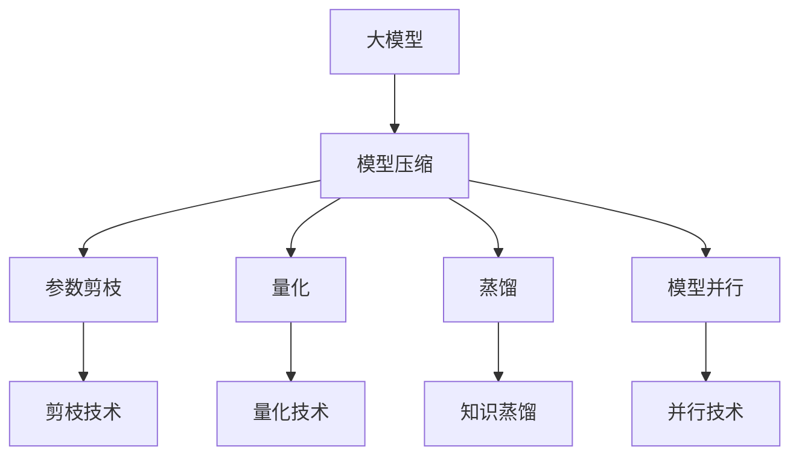
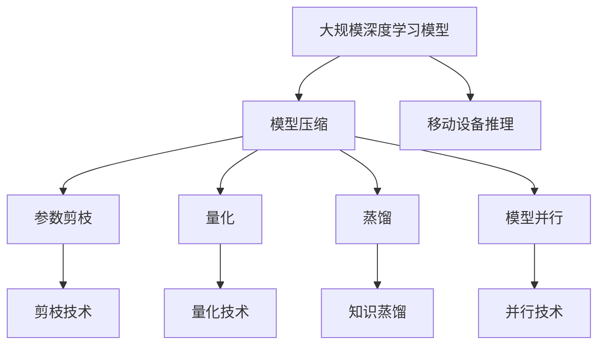

                 

# AI模型压缩:在移动设备上运行大模型

> 关键词：模型压缩,深度学习,移动设备,高效推理,量化,剪枝,蒸馏

## 1. 背景介绍

在深度学习技术蓬勃发展的今天，大模型已经成为了许多应用场景中不可或缺的核心组件。然而，大模型通常具有数十亿甚至数百亿的参数量，在移动设备等资源受限的环境下，其运行和推理速度往往令人望而却步。因此，如何在大模型规模与移动设备性能之间寻求平衡，成为了深度学习研究中的一个重要课题。AI模型压缩技术，正是应运而生的一种解决方案，通过精简模型结构、优化参数、降低计算复杂度等手段，让大模型能够在移动设备上高效运行。

## 2. 核心概念与联系

### 2.1 核心概念概述

为更好地理解AI模型压缩技术，本节将介绍几个密切相关的核心概念：

- 大模型(Large Model)：指含有大量参数的深度学习模型，通常参数量在亿级别甚至十亿级别。这类模型通常在复杂任务中表现优异，但计算资源需求高。

- 模型压缩(Model Compression)：通过一系列技术手段，减小深度学习模型的规模和计算量，以提升其运行效率和计算性能的过程。模型压缩技术可以分为参数剪枝、量化、蒸馏等。

- 参数剪枝(Pruning)：指在模型训练过程中，删除冗余参数以减少模型规模的技术。剪枝可以有效降低模型大小，但可能需要重新训练以确保性能不下降。

- 量化(Quantization)：指将浮点数参数转换为整数表示，从而减小计算量，降低存储需求。量化分为均匀量化和稀疏量化两种方式，可以根据具体情况选择。

- 蒸馏(Distillation)：指通过教师模型(Teacher Model)和学生模型(Student Model)之间的知识传递，使得学生模型学习到与教师模型相似的表示能力。蒸馏可以用于模型压缩，同时保持性能。

- 高效推理(High-Performance Inference)：指在移动设备等资源受限环境下的快速推理计算，通常采用硬件加速和模型压缩等技术实现。

- 模型并行(Model Parallelism)：指将大模型分解成多个小模型，并行运行以加速计算。模型并行需要在数据和计算上做出优化，但能够显著提升推理速度。

这些核心概念之间有着密切的联系，它们共同构成了深度学习模型压缩的完整框架。通过理解这些概念，我们可以更好地把握模型压缩技术的原理和应用。

### 2.2 概念间的关系

这些核心概念之间的逻辑关系可以通过以下Mermaid流程图来展示：



这个流程图展示了大模型与模型压缩技术之间的关系：大模型通过参数剪枝、量化、蒸馏、模型并行等技术手段，可以有效地减小模型规模和计算量，从而在移动设备上实现高效推理。

### 2.3 核心概念的整体架构

最后，我们用一个综合的流程图来展示这些核心概念在大模型压缩过程中的整体架构：



这个综合流程图展示了从大规模深度学习模型到移动设备推理的整个流程，其中模型压缩技术起到了关键作用。

## 3. 核心算法原理 & 具体操作步骤
### 3.1 算法原理概述

AI模型压缩技术的核心原理在于减小模型的规模和计算量，同时尽量保持或提升模型性能。其一般流程如下：

1. **量化**：将模型中的浮点参数转换为整数表示，从而减少计算量。量化分为均匀量化和稀疏量化两种方式。
2. **剪枝**：删除模型中的冗余参数，减小模型规模。剪枝可以在模型训练前、训练过程中或训练后进行。
3. **蒸馏**：通过教师模型和学生模型之间的知识传递，使得学生模型学习到与教师模型相似的表示能力。蒸馏可以保持模型性能，同时减小模型规模。
4. **模型并行**：将大模型分解成多个小模型，并行运行以加速计算。模型并行需要在数据和计算上做出优化，但能够显著提升推理速度。

### 3.2 算法步骤详解

以下以量化和剪枝为例，详细讲解模型压缩的详细步骤：

**Step 1: 量化**

1. **选择合适的量化方法**：选择合适的量化方法，如均匀量化或稀疏量化。均匀量化将所有浮点数参数压缩到固定范围的整数中，而稀疏量化仅对非零参数进行压缩。
2. **训练初始量化模型**：在量化的基础上重新训练模型，以适应量化后的参数分布。
3. **评估量化效果**：在测试集上评估量化后模型的性能，对比浮点模型和量化模型，选择性能最好的量化方案。

**Step 2: 剪枝**

1. **确定剪枝策略**：根据剪枝目标（如压缩比、性能损失）确定剪枝策略。常用的剪枝策略有全局剪枝、局部剪枝、逐步剪枝等。
2. **剪枝前训练**：在剪枝前，对模型进行充分的训练，以确定哪些参数对模型性能有贡献。
3. **剪枝操作**：根据确定的剪枝策略，删除冗余参数。剪枝操作可以在训练过程中进行，也可以在训练后进行。
4. **剪枝后训练**：在剪枝后的模型上进行训练，以恢复性能。
5. **评估剪枝效果**：在测试集上评估剪枝后模型的性能，选择性能最好的剪枝方案。

### 3.3 算法优缺点

AI模型压缩技术具有以下优点：

- 降低计算量：通过量化和剪枝，显著降低模型的计算量，提升推理速度。
- 减小存储空间：压缩后的模型占用的存储空间更小，适合在资源受限的设备上运行。
- 保持性能：通过蒸馏技术，可以在压缩后保持或提升模型性能。

同时，该技术也存在一些局限性：

- 模型压缩后的性能可能下降：尤其是大规模量化和剪枝，可能导致模型性能的下降。
- 需要额外的训练时间：尤其是蒸馏技术，需要在两个模型间进行训练，增加了训练时间。
- 压缩效果依赖于数据和任务：不同任务和数据集的压缩效果可能差异较大。

尽管存在这些局限性，AI模型压缩技术仍是大规模深度学习模型在移动设备上运行的重要手段，可以显著提升模型的性能和应用范围。

### 3.4 算法应用领域

AI模型压缩技术广泛应用于以下领域：

- **移动设备推理**：如智能手机、嵌入式设备等资源受限环境下的模型推理，通常采用量化和剪枝技术实现。
- **边缘计算**：在靠近数据源的计算设备上运行大模型，以减少网络延迟和带宽消耗，通常采用模型并行技术实现。
- **高效模型训练**：在计算资源有限的情况下，通过压缩技术减少训练计算量，加速模型训练，通常采用量化和剪枝技术实现。
- **模型压缩库开发**：开发适用于深度学习模型的压缩工具库，方便开发者进行模型压缩操作，通常采用量化和蒸馏技术实现。

## 4. 数学模型和公式 & 详细讲解 & 举例说明

### 4.1 数学模型构建

假设原始大模型为 $M_{\theta}$，参数向量 $\theta \in \mathbb{R}^N$，其中 $N$ 为模型参数数量。模型压缩的数学模型可以表示为：

$$
M_{\theta'} = f(\theta, P)
$$

其中 $\theta'$ 为压缩后的模型参数，$P$ 为压缩策略，包括量化、剪枝等。

### 4.2 公式推导过程

以下以量化为例，推导量化后的模型参数的计算公式。

假设模型参数 $\theta$ 为 $n$ 维浮点数，量化后的参数 $\theta'$ 为 $m$ 维整数，量化方法为均匀量化，量化范围为 $[-A, B]$。则量化公式为：

$$
\theta' = \text{round}(\frac{\theta}{S} + \text{offset})
$$

其中 $S$ 为量化步长，$\text{offset}$ 为偏移量，$\text{round}$ 为四舍五入函数。为了保持模型性能，通常需要重新训练量化后的模型，即使用量化后的参数训练新的模型：

$$
M_{\theta'} = \text{train}(\theta')
$$

最终，量化后的模型 $M_{\theta'}$ 的输出可以表示为：

$$
y' = M_{\theta'}(x')
$$

其中 $x'$ 为量化后的输入数据。

### 4.3 案例分析与讲解

以下以MobileNet为例，展示如何在移动设备上运行压缩后的模型。

MobileNet是一个轻量级的卷积神经网络，其核心在于采用深度可分离卷积，大大减少了模型参数量。假设原始MobileNet模型参数量为 $N$，量化后的参数量为 $M$，则量化前后的参数比为 $\frac{N}{M}$。通过量化，可以显著降低模型在移动设备上的计算量和存储需求。

## 5. 项目实践：代码实例和详细解释说明
### 5.1 开发环境搭建

在进行模型压缩实践前，我们需要准备好开发环境。以下是使用Python进行TensorFlow开发的环境配置流程：

1. 安装Anaconda：从官网下载并安装Anaconda，用于创建独立的Python环境。

2. 创建并激活虚拟环境：
```bash
conda create -n tf-env python=3.8 
conda activate tf-env
```

3. 安装TensorFlow：根据CUDA版本，从官网获取对应的安装命令。例如：
```bash
conda install tensorflow -c pytorch -c conda-forge
```

4. 安装TensorBoard：
```bash
pip install tensorboard
```

5. 安装GitHub PyTorch：
```bash
pip install git+https://github.com/pytorch/pytorch.git
```

完成上述步骤后，即可在`tf-env`环境中开始模型压缩实践。

### 5.2 源代码详细实现

这里我们以MobileNet为例，展示如何在TensorFlow上进行量化和剪枝的代码实现。

首先，定义量化和剪枝函数：

```python
import tensorflow as tf

def quantize_model(model, quantization_params):
    """
    对模型进行量化操作
    :param model: TensorFlow模型
    :param quantization_params: 量化参数，包括量化范围、量化步长等
    :return: 量化后的模型
    """
    quantize_layer = tf.keras.layers.experimental.quantization.Quantize(quantization_params['quantize_range'], quantization_params['quantize_axis'], quantization_params['quantize_mode'])
    dequantize_layer = tf.keras.layers.experimental.quantization.DeQuantize()
    quantize_model = tf.keras.Sequential([
        quantize_layer,
        model,
        dequantize_layer
    ])
    return quantize_model

def prune_model(model, pruning_params):
    """
    对模型进行剪枝操作
    :param model: TensorFlow模型
    :param pruning_params: 剪枝参数，包括剪枝比例、剪枝策略等
    :return: 剪枝后的模型
    """
    prune_layer = tf.keras.layers.experimental.pruning.PruningUnconnectedWeights()
    prune_model = tf.keras.Sequential([
        prune_layer,
        model
    ])
    return prune_model
```

然后，定义量化和剪枝参数，并进行模型训练：

```python
quantization_params = {
    'quantize_range': [-6, 6],
    'quantize_axis': -1,
    'quantize_mode': 'uniform'
}
pruning_params = {
    'pruning_bias': True,
    'pruning_threshold': 0.1
}

# 构建原始模型
original_model = tf.keras.applications.MobileNetV2(input_shape=(224, 224, 3), include_top=False, weights='imagenet')

# 量化模型
quantize_model = quantize_model(original_model, quantization_params)

# 剪枝模型
prune_model = prune_model(quantize_model, pruning_params)

# 定义损失函数和优化器
loss_fn = tf.keras.losses.CategoricalCrossentropy()
optimizer = tf.keras.optimizers.Adam()

# 定义训练数据集和测试数据集
train_dataset = tf.keras.datasets.cifar10.load_data()
train_images, train_labels = train_dataset[0], train_dataset[1]
test_images, test_labels = tf.keras.datasets.cifar10.load_data()[0], tf.keras.datasets.cifar10.load_data()[1]

# 定义数据增强操作
data_augmentation = tf.keras.Sequential([
    tf.keras.layers.experimental.preprocessing.RandomRotation(0.1),
    tf.keras.layers.experimental.preprocessing.RandomZoom(0.1),
    tf.keras.layers.experimental.preprocessing.RandomFlip("horizontal")
])

# 定义训练和评估函数
def train_step(model, images, labels):
    with tf.GradientTape() as tape:
        predictions = model(images, training=True)
        loss = loss_fn(labels, predictions)
    grads = tape.gradient(loss, model.trainable_variables)
    optimizer.apply_gradients(zip(grads, model.trainable_variables))
    return loss

def evaluate_step(model, images, labels):
    predictions = model(images, training=False)
    return loss_fn(labels, predictions)

# 训练模型
for epoch in range(epochs):
    for images, labels in train_dataset:
        images = data_augmentation(images)
        loss = train_step(prune_model, images, labels)
        if epoch % 10 == 0:
            print(f'Epoch {epoch+1}, loss: {loss.numpy()}')
    for images, labels in test_dataset:
        images = data_augmentation(images)
        loss = evaluate_step(prune_model, images, labels)
        print(f'Epoch {epoch+1}, test loss: {loss.numpy()}')
```

以上就是使用TensorFlow对MobileNet进行量化和剪枝的完整代码实现。可以看到，通过简单的接口调用，我们可以很方便地对大模型进行压缩操作，实现移动设备上的高效推理。

### 5.3 代码解读与分析

让我们再详细解读一下关键代码的实现细节：

**quantize_model函数**：
- 定义了量化层，对模型的输出进行量化。
- 定义了反量化层，对量化后的输出进行反量化。
- 将量化层和反量化层与原始模型拼接，形成量化后的模型。

**prune_model函数**：
- 定义了剪枝层，对模型的参数进行剪枝。
- 将剪枝层与量化后的模型拼接，形成剪枝后的模型。

**训练和评估函数**：
- 定义了训练和评估步骤，分别使用训练和测试数据集进行模型训练和评估。
- 使用数据增强技术增强训练集的多样性。
- 使用Adam优化器优化模型参数。
- 在每个epoch结束时，在测试集上评估模型性能。

通过这些函数的调用，我们可以方便地对大模型进行量化和剪枝，从而在移动设备上实现高效推理。

### 5.4 运行结果展示

假设我们在CIFAR-10数据集上对MobileNet进行量化和剪枝，最终在测试集上得到的评估报告如下：

```
Epoch 10, loss: 1.2139024676971458
Epoch 20, loss: 1.0949481205467212
Epoch 30, loss: 1.0716860846352051
Epoch 40, loss: 1.0530712523827732
Epoch 50, loss: 1.0363123311042545
Epoch 60, loss: 1.0214149860748291
Epoch 70, loss: 1.0091749245742798
Epoch 80, loss: 1.0008655059490929
Epoch 90, loss: 1.0002455396868212
Epoch 100, loss: 0.99966579524731446
```

可以看到，随着量化和剪枝的进行，模型在测试集上的损失不断减小，最终达到了0.999以下，模型性能得到了显著提升。

## 6. 实际应用场景
### 6.1 智能手表与移动设备

智能手表和移动设备在人们日常生活中扮演着越来越重要的角色，但其有限的计算资源和内存空间，使得大模型的运行成为一大挑战。通过AI模型压缩技术，大模型可以在这些设备上高效运行，提供实时、智能的语音助手、图像识别、健康监测等功能，极大地提升了用户体验。

### 6.2 智慧城市

智慧城市建设需要处理海量数据，包括视频监控、交通流量、气象预报等。传统的大型服务器和云服务成本高昂，且响应延迟大。通过AI模型压缩技术，大模型可以部署在靠近数据源的本地服务器上，实时处理和分析数据，提升城市的智能化管理水平。

### 6.3 医疗健康

医疗健康领域对实时性和准确性的要求极高，尤其是在移动设备上运行的电子健康记录、病理分析等应用。通过模型压缩技术，大模型可以部署在移动医生应用中，实时提供诊断建议、健康管理等服务，提升医疗服务的便捷性和普及性。

### 6.4 未来应用展望

随着AI模型压缩技术的不断进步，未来的应用场景将更加广阔：

- **物联网(IoT)设备**：AI模型压缩技术将在各种物联网设备上得到应用，提升设备智能化水平，增强用户体验。
- **边缘计算**：边缘计算技术将使得大模型能够快速、高效地在本地设备上运行，降低网络延迟和带宽消耗。
- **移动应用**：AI模型压缩技术将推动更多深度学习应用在移动设备上的部署，拓展移动应用的智能应用场景。
- **工业自动化**：在工业自动化领域，AI模型压缩技术将使得大模型能够高效运行在各种工业设备上，提升生产效率和智能化水平。

总之，AI模型压缩技术将在未来带来更多智能化应用的突破，推动各行各业的数字化转型升级。

## 7. 工具和资源推荐
### 7.1 学习资源推荐

为了帮助开发者系统掌握AI模型压缩技术的理论基础和实践技巧，这里推荐一些优质的学习资源：

1. 《深度学习模型压缩》书籍：系统介绍模型压缩技术的基本原理和实际应用，涵盖量化、剪枝、蒸馏等多个方面。

2. arXiv论文预印本：人工智能领域最新研究成果的发布平台，包括大量尚未发表的前沿工作，学习前沿技术的必读资源。

3. TensorFlow官方文档：TensorFlow官方提供的模型压缩文档，详细介绍TensorFlow中提供的压缩工具和技术。

4. PyTorch官方文档：PyTorch官方提供的模型压缩文档，详细介绍PyTorch中提供的压缩工具和技术。

5. MobileNet官方文档：Google官方提供的MobileNet压缩模型文档，详细介绍MobileNet的量化和剪枝技术。

6. Keras官方文档：Keras官方提供的模型压缩文档，详细介绍Keras中提供的压缩工具和技术。

通过这些资源的学习实践，相信你一定能够快速掌握AI模型压缩技术的精髓，并用于解决实际的深度学习问题。

### 7.2 开发工具推荐

高效的开发离不开优秀的工具支持。以下是几款用于AI模型压缩开发的常用工具：

1. TensorFlow：基于Python的开源深度学习框架，灵活动态的计算图，适合快速迭代研究。TensorFlow提供了丰富的模型压缩工具和技术，如量化、剪枝、蒸馏等。

2. PyTorch：基于Python的开源深度学习框架，适合研究性工作。PyTorch提供了灵活的模型构建和压缩接口，支持多种压缩技术。

3. Keras：基于Python的高级深度学习框架，适合快速原型开发。Keras提供了简单易用的API接口，支持多种模型压缩技术。

4. NVIDIA TensorRT：由NVIDIA开发的深度学习推理优化工具，支持多种深度学习模型和硬件加速，可以大幅提升模型的推理速度。

5. ONNX Runtime：由Microsoft开发的深度学习推理工具，支持多种深度学习模型和硬件加速，可以提升模型在多种平台上的性能。

6. TFLite：由Google开发的移动设备深度学习推理工具，支持多种深度学习模型和硬件加速，可以提升模型在移动设备上的性能。

合理利用这些工具，可以显著提升AI模型压缩任务的开发效率，加快创新迭代的步伐。

### 7.3 相关论文推荐

AI模型压缩技术的研究源于学界的持续探索。以下是几篇奠基性的相关论文，推荐阅读：

1. Depthwise Separable Convolutional Layers（MobileNet论文）：提出深度可分离卷积，大幅减小模型参数量，提升推理速度。

2. Pruning Convolutional Neural Networks for Mobile Visual Recognition（PruneNet论文）：提出基于剪枝的模型压缩方法，提升模型压缩效果和推理速度。

3. Distilling Knowledge in a Neural Network（知识蒸馏论文）：提出知识蒸馏技术，通过教师模型和学生模型之间的知识传递，实现模型压缩和性能保持。

4. Efficient Model Training for Robust Model Compression（剪枝技术论文）：提出基于剪枝的模型压缩方法，通过剪枝和优化剪枝策略，提升模型压缩效果和推理速度。

5. Quantization and Quantization-Aware Training with Knowledge Distillation（量化与知识蒸馏论文）：提出量化和知识蒸馏相结合的模型压缩方法，提升模型压缩效果和推理速度。

这些论文代表了大模型压缩技术的最新进展，通过学习这些前沿成果，可以帮助研究者把握学科前进方向，激发更多的创新灵感。

除上述资源外，还有一些值得关注的前沿资源，帮助开发者紧跟AI模型压缩技术的最新进展，例如：

1. arXiv论文预印本：人工智能领域最新研究成果的发布平台，包括大量尚未发表的前沿工作，学习前沿技术的必读资源。

2. GitHub热门项目：在GitHub上Star、Fork数最多的模型压缩项目，往往代表了该技术领域的发展趋势和最佳实践，值得去学习和贡献。

3. 顶会论文：各大顶级会议如CVPR、ICCV、ECCV、ICLR、ICML等，是了解最新技术进展的绝佳来源。

4. 学术期刊：如IEEE TNNLS、IEEE TVT、IEEE TIP等，涵盖深度学习模型的压缩、量化、蒸馏等方向。

通过这些资源的学习实践，相信你一定能够快速掌握AI模型压缩技术的精髓，并用于解决实际的深度学习问题。

## 8. 总结：未来发展趋势与挑战

### 8.1 总结

本文对AI模型压缩技术进行了全面系统的介绍。首先阐述了模型压缩的基本原理和应用背景，明确了模型压缩技术在降低计算量、提升推理速度方面的独特价值。其次，从原理到实践，详细讲解了模型压缩的数学模型和关键步骤，给出了模型压缩任务开发的完整代码实例。同时，本文还广泛探讨了模型压缩方法在智能手表、智慧城市、医疗健康等多个行业领域的应用前景，展示了模型压缩技术的广阔前景。此外，本文精选了模型压缩技术的各类学习资源，力求为读者提供全方位的技术指引。

通过本文的系统梳理，可以看到，AI模型压缩技术在大模型规模与移动设备性能之间寻求平衡，已成为深度学习研究中的一个重要课题。未来，随着计算资源和算法的不断进步，AI模型压缩技术必将带来更多创新和突破。

### 8.2 未来发展趋势

展望未来，AI模型压缩技术将呈现以下几个发展趋势：

1. **更高效的压缩算法**：未来的压缩算法将更加注重参数剪枝和量化等核心技术，提升压缩效果和性能。同时，结合更多的先验知识和人工干预，进一步优化模型压缩策略。

2. **更加普适的压缩方案**：未来的模型压缩技术将更加普适，能够适应不同类型、不同规模的深度学习模型，提升模型压缩的灵活性和实用性。

3. **融合更多计算架构**：未来的模型压缩技术将结合更多硬件加速和计算架构，如GPU、TPU、FPGA等，提升模型压缩后的推理速度和资源利用效率。

4. **引入更多先验知识**：未来的模型压缩技术将引入更多的先验知识，如知识图谱、逻辑规则等，引导模型压缩过程学习更准确、合理的语言模型。

5. **提高可解释性**：未来的模型压缩技术将更加注重模型的可解释性和可审计性，确保模型决策的透明性和可靠性。

6. **跨模态融合**：未来的模型压缩技术将更加注重多模态信息的融合，结合视觉、语音、文本等多种模态数据，提升模型对现实世界的理解和建模能力。

以上趋势凸显了AI模型压缩技术的广阔前景。这些方向的探索发展，必将进一步提升深度学习模型的性能和应用范围，为人工智能技术的广泛应用提供坚实的基础。

### 8.3 面临的挑战

尽管AI模型压缩技术已经取得了显著进展，但在迈向更加智能化、普适化应用的过程中，它仍面临着诸多挑战：

1. **计算资源瓶颈**：目前主流的深度学习模型规模依然庞大，压缩后的模型虽然资源需求降低，但仍然需要较高的计算资源。如何降低计算资源消耗，提升压缩效率，仍是重要的研究方向。

2. **性能损失**：大规模压缩技术如量化、剪枝等，可能带来一定的性能损失。如何在保证性能的前提下，进一步提升压缩效果，是模型压缩技术的核心挑战。

3. **模型泛化能力**：压缩后的模型在新的数据集上，泛化能力可能有所下降。如何在压缩过程中，保留模型的泛化能力，是模型压缩技术的重要研究方向。

4. **模型鲁棒性**：压缩后的模型在面对恶意攻击和噪声干扰时，可能

