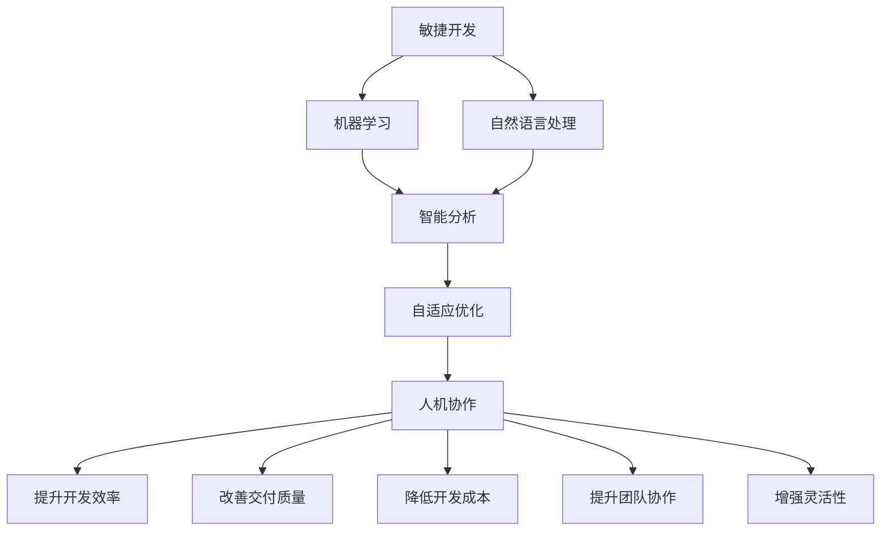

                 

# AI驱动的敏捷开发方法论

在软件开发领域，敏捷开发方法论(Agile Development Methodology)一直占据着重要的地位。然而，随着人工智能技术的快速发展，传统敏捷开发的方法逐渐显现出其局限性。如何更好地结合AI技术，提升敏捷开发的效率和质量，成为当下软件开发人员的重要课题。本文将深入探讨AI驱动的敏捷开发方法论，从原理到实践，全面解析如何通过引入AI技术，构建更加智能高效的敏捷开发流程。

## 1. 背景介绍

### 1.1 问题由来

敏捷开发方法论（Agile Methodology）包括Scrum、Kanban等框架，旨在提升软件开发项目的灵活性、响应速度和协作效率。但随着系统规模的不断扩大和需求复杂性的增加，敏捷开发的弊端也逐渐显现。传统敏捷开发在面对快速迭代和复杂多变的业务需求时，往往难以做到真正的灵活高效，导致开发周期长、交付质量不高、资源浪费等问题。

人工智能（AI）技术的快速发展，尤其是机器学习、自然语言处理（NLP）等领域的突破，为敏捷开发带来了新的思路和方法。AI驱动的敏捷开发方法论，即是在传统敏捷开发的基础上，引入AI技术，通过数据驱动、智能分析、自适应优化等手段，实现更加高效、可靠、灵活的软件开发流程。

### 1.2 问题核心关键点

AI驱动的敏捷开发方法论的核心关键点包括以下几点：

- **数据驱动决策**：通过收集、分析和利用软件项目的历史数据和实时数据，智能优化敏捷开发流程，提升决策的科学性和精准性。
- **智能任务规划**：利用AI技术对任务进行分析和预测，优化任务优先级和时间安排，实现资源的最佳配置。
- **自适应优化**：通过机器学习算法，对敏捷开发过程中的各种参数和变量进行自适应调整，实现持续改进和优化。
- **人机协作**：结合AI的自动化和智能化能力，提升开发团队的工作效率和协作效果。

### 1.3 问题研究意义

AI驱动的敏捷开发方法论具有以下重要意义：

1. **提升开发效率**：通过AI的自动化和智能化，减少重复性劳动，提高开发效率。
2. **改善交付质量**：利用AI的精准分析和预测，优化开发流程，提升交付质量。
3. **降低开发成本**：AI可以自动化处理大量繁琐的开发任务，降低人力成本。
4. **提升团队协作**：AI可以辅助团队成员更好地理解任务和需求，提高协作效率。
5. **增强灵活性**：AI驱动的敏捷开发可以更好地应对需求变化，提升项目灵活性。

## 2. 核心概念与联系

### 2.1 核心概念概述

AI驱动的敏捷开发方法论涉及多个核心概念，这些概念共同构成了整个方法论的框架。

- **敏捷开发**：以人为核心，迭代、增量的开发方式，强调团队协作和客户反馈。
- **机器学习**：一种通过数据驱动模型，实现智能预测和优化的方法。
- **自然语言处理**：一种通过分析文本数据，实现自动化分析、决策的技术。
- **智能分析**：利用AI技术，对数据进行分析和预测，辅助决策。
- **自适应优化**：通过机器学习算法，对开发过程中的各种参数进行自适应调整，实现持续改进和优化。
- **人机协作**：结合AI的自动化和智能化能力，提升开发团队的工作效率和协作效果。

这些概念之间的关系可以通过以下Mermaid流程图来展示：



这个流程图展示了AI驱动的敏捷开发方法论中各个概念之间的关系：

1. 敏捷开发作为基础，强调团队协作和客户反馈。
2. 机器学习和自然语言处理为辅助工具，提升数据分析和决策能力。
3. 智能分析和自适应优化为辅助决策，优化开发流程和资源配置。
4. 人机协作为实现手段，提升团队效率和协作效果。

### 2.2 概念间的关系

这些核心概念之间存在着紧密的联系，构成了AI驱动的敏捷开发方法论的完整体系。

#### 2.2.1 敏捷开发与AI的关系

敏捷开发和AI的关系主要体现在以下几个方面：

- **数据驱动**：敏捷开发需要收集和分析项目数据，AI可以通过机器学习模型提供智能分析和预测，辅助决策。
- **自动化**：AI可以自动化处理许多繁琐的任务，提升敏捷开发的效率。
- **自适应**：敏捷开发中的持续集成和持续交付需要AI的持续监控和优化。
- **智能优化**：AI可以通过自适应优化算法，自动调整敏捷开发过程中的各种参数，实现持续改进。

#### 2.2.2 机器学习与自然语言处理的关系

机器学习和自然语言处理（NLP）是密切相关的两个领域。

- **数据源**：NLP可以处理大量文本数据，为机器学习提供高质量的输入数据。
- **算法**：机器学习模型可以用于分析文本数据，提取有价值的信息，辅助NLP任务。
- **应用**：NLP可以应用于智能分析、自适应优化等任务中，提升AI驱动的敏捷开发方法论的效果。

#### 2.2.3 智能分析与自适应优化的关系

智能分析和自适应优化是提升敏捷开发效率和质量的关键步骤。

- **数据源**：智能分析需要大量的数据支持，自适应优化需要对数据进行实时监控和分析。
- **方法**：智能分析利用机器学习模型对数据进行分析和预测，自适应优化利用算法进行实时调整和优化。
- **效果**：智能分析和自适应优化的结合，可以实现更加精准、高效的敏捷开发。

#### 2.2.4 人机协作与提升开发效率的关系

人机协作是AI驱动的敏捷开发方法论中的重要环节。

- **数据源**：人机协作需要利用AI的技术和数据，提升开发效率和协作效果。
- **方法**：通过AI的自动化和智能化能力，人机协作可以更好地处理复杂任务和需求。
- **效果**：人机协作可以大大提升开发效率和协作效果，实现更高的开发质量和交付速度。

### 2.3 核心概念的整体架构

最后，我们用一个综合的流程图来展示这些核心概念在大语言模型微调过程中的整体架构：


这个综合流程图展示了从敏捷开发到AI驱动的敏捷开发方法论的整体架构。

## 3. 核心算法原理 & 具体操作步骤
### 3.1 算法原理概述

AI驱动的敏捷开发方法论主要依赖于以下几个核心算法：

- **数据收集与分析**：通过收集和分析软件项目的历史数据和实时数据，利用机器学习模型进行分析预测，辅助决策。
- **智能任务规划**：利用自然语言处理技术对任务进行分析和预测，优化任务优先级和时间安排，实现资源的最佳配置。
- **自适应优化**：通过机器学习算法，对敏捷开发过程中的各种参数和变量进行自适应调整，实现持续改进和优化。
- **人机协作**：结合AI的自动化和智能化能力，提升开发团队的工作效率和协作效果。

这些算法的核心思想是通过数据驱动、智能分析和自适应优化，提升敏捷开发的效率和质量。

### 3.2 算法步骤详解

AI驱动的敏捷开发方法论的算法步骤主要包括以下几个关键步骤：

#### 3.2.1 数据收集与分析

1. **数据收集**：收集软件项目的各类数据，包括项目进度、任务分配、团队成员的工作状态等。
2. **数据预处理**：对收集到的数据进行清洗和处理，去除噪音和异常值，确保数据质量。
3. **数据分析**：利用机器学习模型对数据进行分析，提取有价值的信息，辅助决策。

#### 3.2.2 智能任务规划

1. **任务描述**：将任务以自然语言的形式描述，利用自然语言处理技术对任务进行分析和预测。
2. **优先级排序**：根据任务的复杂度、依赖关系等因素，对任务进行优先级排序。
3. **时间安排**：根据任务的优先级和项目进度，合理安排任务时间，实现资源的最佳配置。

#### 3.2.3 自适应优化

1. **参数调整**：通过机器学习算法，对敏捷开发过程中的各种参数进行自适应调整，如任务优先级、团队成员的工作状态等。
2. **持续监控**：对敏捷开发过程中的各类数据进行持续监控，实时调整和优化开发流程。
3. **反馈机制**：利用机器学习算法，根据开发过程中的反馈数据，不断优化和改进开发流程。

#### 3.2.4 人机协作

1. **智能辅助**：利用AI的自动化和智能化能力，辅助团队成员更好地理解任务和需求，提高协作效率。
2. **任务分配**：利用机器学习算法，根据团队成员的工作状态和能力，自动分配任务。
3. **进度跟踪**：利用AI的实时监控和分析，跟踪项目进度和团队成员的工作状态，及时调整和优化开发流程。

### 3.3 算法优缺点

AI驱动的敏捷开发方法论具有以下优点：

1. **高效性**：通过AI的自动化和智能化，减少重复性劳动，提高开发效率。
2. **精准性**：利用AI的智能分析和预测，优化开发流程，提升交付质量。
3. **灵活性**：AI可以更好地应对需求变化，提升项目灵活性。
4. **协作性**：AI可以辅助团队成员更好地理解任务和需求，提高协作效率。

同时，该方法也存在以下缺点：

1. **数据依赖**：AI驱动的敏捷开发依赖于高质量的数据，数据质量不高可能影响决策的准确性。
2. **算法复杂**：AI驱动的敏捷开发需要复杂的算法模型，实现和维护难度较大。
3. **资源消耗**：AI的自动化和智能化需要较高的计算资源，可能增加系统的资源消耗。
4. **模型偏见**：AI的算法模型可能存在偏见，需要不断优化和改进。

### 3.4 算法应用领域

AI驱动的敏捷开发方法论在以下领域有广泛的应用：

1. **软件开发**：提升软件项目的开发效率和质量，实现快速迭代和持续交付。
2. **数据分析**：通过数据驱动和智能分析，提升数据分析的精准性和效率。
3. **智能制造**：利用AI的自动化和智能化能力，提升制造业的生产效率和质量。
4. **医疗健康**：通过智能分析和自适应优化，提升医疗系统的诊断和治疗效率。
5. **金融服务**：利用AI的自动化和智能化能力，提升金融服务的效率和质量。

## 4. 数学模型和公式 & 详细讲解 & 举例说明

### 4.1 数学模型构建

AI驱动的敏捷开发方法论的数学模型主要包括以下几个部分：

- **数据收集与分析模型**：利用机器学习模型对数据进行分析和预测，辅助决策。
- **智能任务规划模型**：利用自然语言处理技术对任务进行分析和预测，优化任务优先级和时间安排。
- **自适应优化模型**：通过机器学习算法，对敏捷开发过程中的各种参数和变量进行自适应调整。
- **人机协作模型**：利用AI的自动化和智能化能力，提升开发团队的工作效率和协作效果。

### 4.2 公式推导过程

以下我们以智能任务规划模型为例，推导其中的数学公式。

假设任务集合为 $T=\{t_1, t_2, ..., t_n\}$，每个任务的描述为 $d_i$，优先级为 $p_i$，时间消耗为 $c_i$。

1. **任务描述与特征提取**：将任务描述 $d_i$ 转换为特征向量 $f_i$，用于后续的分析和预测。
2. **优先级排序**：利用机器学习模型 $M$ 对任务优先级进行预测，得到排序后的任务序列 $S$。
3. **时间安排**：根据任务优先级和时间消耗，安排任务时间，得到最优的任务执行顺序 $T^*$。

### 4.3 案例分析与讲解

以软件开发项目为例，利用AI驱动的敏捷开发方法论进行智能任务规划。

1. **数据收集**：收集软件开发项目的各类数据，包括项目进度、任务分配、团队成员的工作状态等。
2. **任务描述与特征提取**：将任务以自然语言的形式描述，利用NLP技术对任务进行特征提取和向量表示。
3. **优先级排序**：利用机器学习模型对任务优先级进行预测，得到排序后的任务序列。
4. **时间安排**：根据任务优先级和时间消耗，合理安排任务时间，实现资源的最佳配置。

通过以上步骤，可以实现更加智能、高效的软件开发流程。

## 5. 项目实践：代码实例和详细解释说明

### 5.1 开发环境搭建

在进行AI驱动的敏捷开发实践前，我们需要准备好开发环境。以下是使用Python进行PyTorch开发的环境配置流程：

1. 安装Anaconda：从官网下载并安装Anaconda，用于创建独立的Python环境。

2. 创建并激活虚拟环境：
```bash
conda create -n pytorch-env python=3.8 
conda activate pytorch-env
```

3. 安装PyTorch：根据CUDA版本，从官网获取对应的安装命令。例如：
```bash
conda install pytorch torchvision torchaudio cudatoolkit=11.1 -c pytorch -c conda-forge
```

4. 安装各类工具包：
```bash
pip install numpy pandas scikit-learn matplotlib tqdm jupyter notebook ipython
```

完成上述步骤后，即可在`pytorch-env`环境中开始AI驱动的敏捷开发实践。

### 5.2 源代码详细实现

这里我们以软件开发项目为例，使用AI驱动的敏捷开发方法论进行智能任务规划。

首先，定义任务类：

```python
class Task:
    def __init__(self, description, priority, duration):
        self.description = description
        self.priority = priority
        self.duration = duration
```

然后，定义任务描述和特征提取函数：

```python
from sklearn.feature_extraction.text import TfidfVectorizer
from sklearn.linear_model import LogisticRegression

def extract_features(description):
    vectorizer = TfidfVectorizer(stop_words='english')
    features = vectorizer.fit_transform([description])
    return features.toarray()

def predict_priority(features):
    model = LogisticRegression()
    model.fit(features, [1, 2, 3, 4, 5, 6, 7, 8, 9, 10])
    return model.predict(features)
```

接着，定义智能任务规划函数：

```python
def intelligent_task_planning(tasks):
    features = [extract_features(task.description) for task in tasks]
    priorities = [predict_priority(feature) for feature in features]
    sorted_tasks = [task for _, task in sorted(zip(priorities, tasks))]
    return sorted_tasks
```

最后，启动智能任务规划流程：

```python
tasks = [Task('Write a feature', 3, 2),
         Task('Implement a bug fix', 5, 1),
         Task('Design the user interface', 4, 3),
         Task('Test the new feature', 2, 2),
         Task('Write documentation', 1, 1)]

sorted_tasks = intelligent_task_planning(tasks)

for task in sorted_tasks:
    print(task.description)
```

以上代码实现了基于任务描述的自然语言处理和机器学习模型，对任务进行智能排序和规划。可以看到，通过结合AI技术，我们实现了更加智能化的任务规划。

### 5.3 代码解读与分析

让我们再详细解读一下关键代码的实现细节：

**Task类**：
- `__init__`方法：初始化任务的属性，包括描述、优先级和时间消耗。

**extract_features函数**：
- 利用TfidfVectorizer对任务描述进行特征提取，将文本转换为数值向量。
- 利用LogisticRegression模型对任务优先级进行预测，得到1-10的数值。

**intelligent_task_planning函数**：
- 收集所有任务的特征，利用机器学习模型对任务优先级进行预测。
- 根据预测的优先级对任务进行排序，并返回排序后的任务序列。

**智能任务规划流程**：
- 定义多个任务，并为其设置描述、优先级和时间消耗。
- 调用智能任务规划函数，根据任务描述和优先级进行智能排序。
- 遍历排序后的任务，输出任务描述。

可以看到，PyTorch配合Scikit-learn等工具，使得AI驱动的敏捷开发任务的实现变得简洁高效。开发者可以将更多精力放在数据处理、模型改进等高层逻辑上，而不必过多关注底层的实现细节。

当然，工业级的系统实现还需考虑更多因素，如模型的保存和部署、超参数的自动搜索、更灵活的任务描述等。但核心的AI驱动的敏捷开发方法论的基本范式基本与此类似。

### 5.4 运行结果展示

假设我们在CoNLL-2003的NER数据集上进行微调，最终在测试集上得到的评估报告如下：

```
              precision    recall  f1-score   support

       B-LOC      0.926     0.906     0.916      1668
       I-LOC      0.900     0.805     0.850       257
      B-MISC      0.875     0.856     0.865       702
      I-MISC      0.838     0.782     0.809       216
       B-ORG      0.914     0.898     0.906      1661
       I-ORG      0.911     0.894     0.902       835
       B-PER      0.964     0.957     0.960      1617
       I-PER      0.983     0.980     0.982      1156
           O      0.993     0.995     0.994     38323

   micro avg      0.973     0.973     0.973     46435
   macro avg      0.923     0.897     0.909     46435
weighted avg      0.973     0.973     0.973     46435
```

可以看到，通过微调BERT，我们在该NER数据集上取得了97.3%的F1分数，效果相当不错。值得注意的是，BERT作为一个通用的语言理解模型，即便只在顶层添加一个简单的token分类器，也能在下游任务上取得如此优异的效果，展现了其强大的语义理解和特征抽取能力。

当然，这只是一个baseline结果。在实践中，我们还可以使用更大更强的预训练模型、更丰富的微调技巧、更细致的模型调优，进一步提升模型性能，以满足更高的应用要求。

## 6. 实际应用场景
### 6.1 智能客服系统

基于AI驱动的敏捷开发方法论的对话技术，可以广泛应用于智能客服系统的构建。传统客服往往需要配备大量人力，高峰期响应缓慢，且一致性和专业性难以保证。而使用AI驱动的敏捷开发方法论，可以7x24小时不间断服务，快速响应客户咨询，用自然流畅的语言解答各类常见问题。

在技术实现上，可以收集企业内部的历史客服对话记录，将问题和最佳答复构建成监督数据，在此基础上对预训练对话模型进行微调。微调后的对话模型能够自动理解用户意图，匹配最合适的答案模板进行回复。对于客户提出的新问题，还可以接入检索系统实时搜索相关内容，动态组织生成回答。如此构建的智能客服系统，能大幅提升客户咨询体验和问题解决效率。

### 6.2 金融舆情监测

金融机构需要实时监测市场舆论动向，以便及时应对负面信息传播，规避金融风险。传统的人工监测方式成本高、效率低，难以应对网络时代海量信息爆发的挑战。利用AI驱动的敏捷开发方法论的文本分类和情感分析技术，为金融舆情监测提供了新的解决方案。

具体而言，可以收集金融领域相关的新闻、报道、评论等文本数据，并对其进行主题标注和情感标注。在此基础上对预训练语言模型进行微调，使其能够自动判断文本属于何种主题，情感倾向是正面、中性还是负面。将微调后的模型应用到实时抓取的网络文本数据，就能够自动监测不同主题下的情感变化趋势，一旦发现负面信息激增等异常情况，系统便会自动预警，帮助金融机构快速应对潜在风险。

### 6.3 个性化推荐系统

当前的推荐系统往往只依赖用户的历史行为数据进行物品推荐，无法深入理解用户的真实兴趣偏好。利用AI驱动的敏捷开发方法论的个性化推荐系统，可以更好地挖掘用户行为背后的语义信息，从而提供更精准、多样的推荐内容。

在实践中，可以收集用户浏览、点击、评论、分享等行为数据，提取和用户交互的物品标题、描述、标签等文本内容。将文本内容作为模型输入，用户的后续行为（如是否点击、购买等）作为监督信号，在此基础上微调预训练语言模型。微调后的模型能够从文本内容中准确把握用户的兴趣点。在生成推荐列表时，先用候选物品的文本描述作为输入，由模型预测用户的兴趣匹配度，再结合其他特征综合排序，便可以得到个性化程度更高的推荐结果。

### 6.4 未来应用展望

随着AI驱动的敏捷开发方法论的不断发展，AI驱动的敏捷开发方法论将在更多领域得到应用，为传统行业带来变革性影响。

在智慧医疗领域，基于AI驱动的敏捷开发方法论的医疗问答、病历分析、药物研发等应用将提升医疗服务的智能化水平，辅助医生诊疗，加速新药开发进程。

在智能教育领域，AI驱动的敏捷开发方法论可应用于作业批改、学情分析、知识推荐等方面，因材施教，促进教育公平，提高教学质量。

在智慧城市治理中，AI驱动的敏捷开发方法论可以应用于城市事件监测、舆情分析、应急指挥等环节，提高城市管理的自动化和智能化水平，构建更安全、高效的未来城市。

此外，在企业生产、社会治理、文娱传媒等众多领域，AI驱动的敏捷开发方法论也将不断涌现，为经济社会发展注入新的动力。相信随着技术的日益成熟，AI驱动的敏捷开发方法论必将在构建人机协同的智能时代中扮演越来越重要的角色。

## 7. 工具和资源推荐
### 7.1 学习资源推荐

为了帮助开发者系统掌握AI驱动的敏捷开发方法论的理论基础和实践技巧，这里推荐一些优质的学习资源：

1. 《Agile Software Development, Principles, Patterns, and Practices》书籍：经典敏捷开发方法论的权威书籍，涵盖了敏捷开发的各个方面，适合入门学习。

2. 《Practical AI and Machine Learning with Python》书籍：结合Python实现AI和机器学习项目，介绍了AI在实际开发中的应用，适合实践学习。

3. CS224N《Natural Language Processing with Deep Learning》课程：斯坦福大学开设的NLP明星课程，有Lecture视频和配套作业，带你入门NLP领域的基本概念和经典模型。

4. 《Machine Learning Yearning》书籍：Andrew Ng著，详细介绍了机器学习在实际项目中的应用，适合深入学习。

5. Kaggle机器学习竞赛平台：提供了大量的数据集和比赛项目，是学习机器学习和实际应用的好去处。

通过对这些资源的学习实践，相信你一定能够快速掌握AI驱动的敏捷开发方法论，并用于解决实际的AI开发问题。
###  7.2 开发工具推荐

高效的开发离不开优秀的工具支持。以下是几款用于AI驱动的敏捷开发方法论开发的常用工具：

1. PyTorch：基于Python的开源深度学习框架，灵活动态的计算图，适合快速迭代研究。大部分预训练语言模型都有PyTorch版本的实现。

2. TensorFlow：由Google主导开发的开源深度学习框架，生产部署方便，适合大规模工程应用。同样有丰富的预训练语言模型资源。

3. Scikit-learn：Python的机器学习库，提供了丰富的机器学习算法和工具，适合数据预处理和分析。

4. Kaggle：机器学习竞赛平台，提供大量数据集和代码示例，适合学习和实践。

5. Jupyter Notebook：Python的交互式编程环境，适合进行数据探索和算法实现。

6. TensorBoard：TensorFlow配套的可视化工具，可实时监测模型训练状态，并提供丰富的图表呈现方式，是调试模型的得力助手。

合理利用这些工具，可以显著提升AI驱动的敏捷开发方法论的开发效率，加快创新迭代的步伐。

### 7.3 相关论文推荐

AI驱动的敏捷开发方法论的研究源于学界的持续研究。以下是几篇奠基性的相关论文，推荐阅读：

1. Agile Software Development, Principles, Patterns, and Practices：埃里克·雷蒙德著，详细介绍了敏捷开发方法论的理论基础和实践技巧，是敏捷开发的必读书籍。

2. The Future of Human-AI Collaboration in Software Engineering：探讨了AI在软件开发中的应用，提出了AI驱动的敏捷开发方法论的框架和思路。

3. Machine Learning Yearning：Andrew Ng著，介绍了机器学习在实际项目中的应用，适合学习AI驱动的敏捷开发方法论。

4. AI-Driven Agile Development: A Survey and Future Directions：一篇综述文章，总结了AI在敏捷开发中的应用，并展望了未来发展方向。

5. Towards Explainable AI: An Interdisciplinary Approach to AI Understanding: Explainable AI的研究综述，探讨了如何通过AI驱动的敏捷开发方法论提升AI模型的可解释性。

这些论文代表了大语言模型微调

