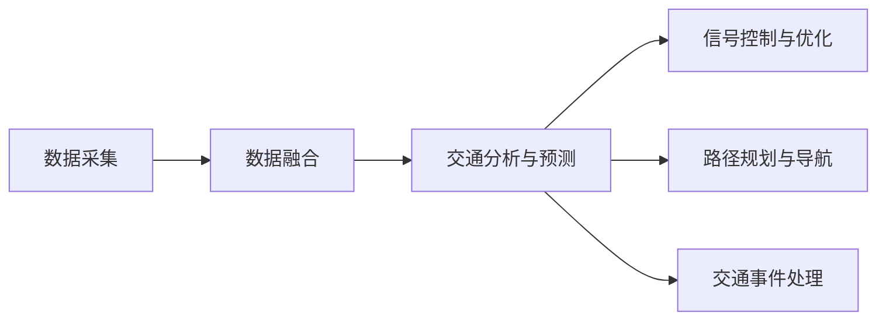
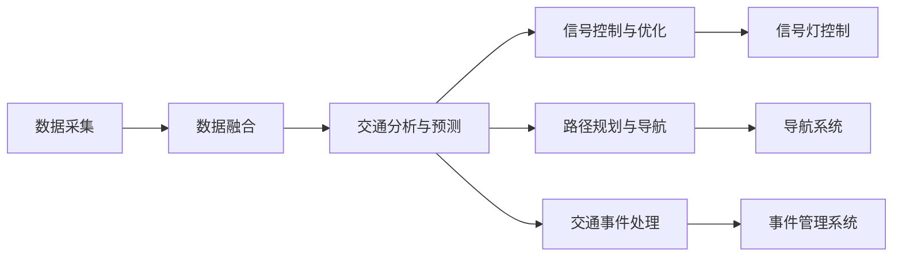
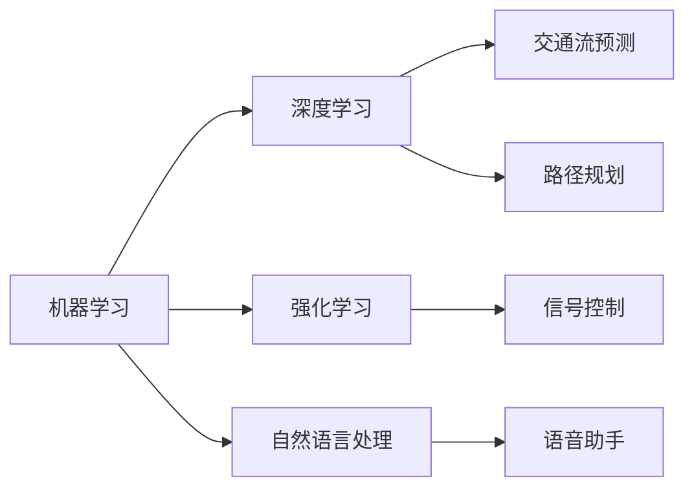
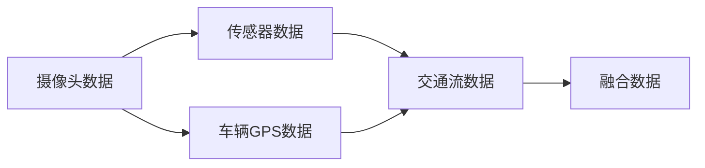
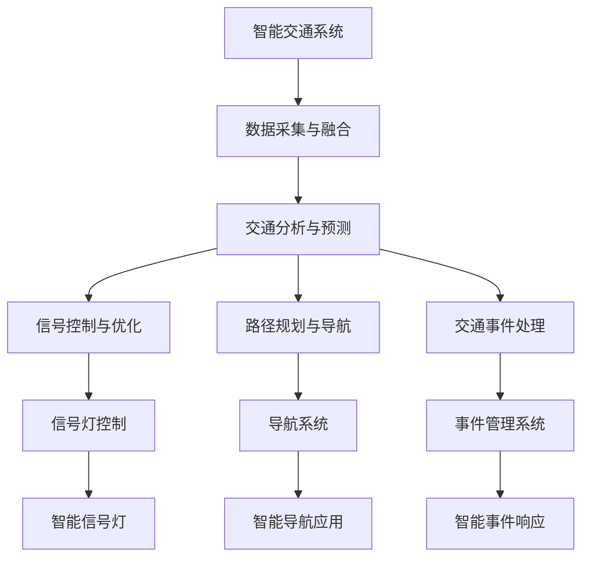

                 

# AI驱动的智能交通系统:缓解城市拥堵

## 1. 背景介绍

### 1.1 问题由来

随着城市化进程的加快，全球各大城市都面临着严重交通拥堵问题。这一问题不仅影响着人们的日常出行，还造成了巨大的经济和社会损失。以北京市为例，高峰期中心城区的拥堵时速仅约为10公里，而中心城区到回龙观的通勤时间甚至高达3小时，严重影响了居民的生活质量和城市的可持续发展。

拥堵问题主要是由多重因素引起的，包括城市规模、道路基础设施、交通管理、出行需求以及环境因素等。城市交通管理系统的核心目标是实现交通流的优化，提升交通效率和降低拥堵程度。传统的交通管理方法，如信号控制、路障等，已难以应对现代城市交通的复杂性和多样性。因此，需要引入先进的AI技术来驱动智能交通系统的建设，提升城市交通管理水平。

### 1.2 问题核心关键点

智能交通系统主要包含以下几个关键点：

- **数据采集与融合**：通过摄像头、传感器、车辆GPS等手段，采集交通流、车速、车辆位置等信息，并进行数据融合。
- **交通分析与预测**：利用机器学习、深度学习算法对交通数据进行建模，实现交通流的预测与分析。
- **信号控制与优化**：通过AI技术实时调整交通信号灯，优化交通流，降低拥堵。
- **路径规划与导航**：基于实时交通数据，提供最优路径和导航建议，提升出行效率。
- **交通事件处理**：及时发现并处理交通事故、车辆故障、施工等交通事件，保障交通流畅。

这些关键点相互交织，构成了一个复杂的智能交通系统，需要AI技术的综合应用。AI驱动的智能交通系统不仅能够提升交通管理效率，还能大幅改善城市的宜居性和可持续发展水平。

## 2. 核心概念与联系

### 2.1 核心概念概述

为了更好地理解AI驱动的智能交通系统，本节将介绍几个关键概念：

- **智能交通系统**：结合现代通信技术、计算机技术和控制技术，对交通流进行实时监控、分析和控制，从而提高道路通行能力、减少交通拥堵的系统。
- **AI驱动**：利用人工智能技术，包括机器学习、深度学习、强化学习等，实现交通数据的自动分析和决策支持。
- **数据融合**：将来自不同源、不同格式的数据进行合并、协调和优化，生成统一的、高质量的交通数据。
- **交通流预测**：通过历史和实时交通数据，利用AI算法预测未来的交通流状态。
- **信号控制**：基于交通流的实时状态，动态调整信号灯周期、相位等，优化交通流。
- **路径规划与导航**：利用AI算法和地图数据，计算最优路径，提供导航建议。
- **交通事件处理**：通过AI技术自动识别和处理交通事件，提升交通管理的响应速度和准确性。

这些概念之间的逻辑关系可以通过以下Mermaid流程图来展示：



这个流程图展示了智能交通系统的主要组成部分，以及各部分之间的数据流和逻辑关系。

### 2.2 概念间的关系

这些核心概念之间存在着紧密的联系，构成了智能交通系统的完整生态系统。下面通过几个Mermaid流程图来展示这些概念之间的关系：

#### 2.2.1 智能交通系统的整体架构



这个流程图展示了智能交通系统的整体架构，包括数据采集、融合、分析和控制等主要部分。

#### 2.2.2 AI技术在智能交通系统中的应用



这个流程图展示了AI技术在智能交通系统中的具体应用，包括机器学习、深度学习、强化学习和自然语言处理等。

#### 2.2.3 数据融合在智能交通系统中的重要性



这个流程图展示了数据融合在智能交通系统中的作用，通过将不同来源的数据进行整合，生成统一的交通数据。

### 2.3 核心概念的整体架构

最后，我们用一个综合的流程图来展示这些核心概念在大规模智能交通系统中的整体架构：



这个综合流程图展示了从数据采集到信号控制，再到路径规划和事件处理的整个智能交通系统流程，以及各个环节的关键组件。

## 3. 核心算法原理 & 具体操作步骤

### 3.1 算法原理概述

AI驱动的智能交通系统依赖于多个AI算法，主要包括数据融合、交通流预测、信号控制和路径规划等。本节将重点介绍这些核心算法的原理和具体操作步骤。

### 3.2 算法步骤详解

#### 3.2.1 数据融合

数据融合是智能交通系统的基础。其步骤主要包括：

1. **数据采集**：通过摄像头、传感器、车辆GPS等手段，实时采集交通流、车速、车辆位置等信息。
2. **数据预处理**：对采集的数据进行清洗、去噪和标准化处理，确保数据的质量和一致性。
3. **数据同步**：对来自不同设备和传感器的数据进行同步，确保数据的时序一致性。
4. **数据融合**：将处理后的数据进行融合，生成统一的交通数据。

#### 3.2.2 交通流预测

交通流预测是智能交通系统的核心算法之一。其步骤主要包括：

1. **历史数据分析**：利用历史交通数据，建立交通流的时空分布模型。
2. **实时数据接入**：将实时采集的交通数据接入预测模型，更新模型参数。
3. **预测模型训练**：使用机器学习或深度学习算法，训练交通流预测模型。
4. **交通流预测**：利用训练好的预测模型，对未来的交通流状态进行预测。

#### 3.2.3 信号控制

信号控制是智能交通系统的关键技术之一，其步骤主要包括：

1. **交通流监测**：实时监测交通流的实时状态，获取交通流的关键参数。
2. **信号优化模型建立**：建立信号优化模型，根据交通流的实时状态，动态调整信号灯周期和相位。
3. **信号控制策略实施**：将优化后的信号控制策略应用到信号灯上，优化交通流。

#### 3.2.4 路径规划与导航

路径规划与导航是智能交通系统的另一重要功能，其步骤主要包括：

1. **地图数据获取**：获取高精度的地图数据，建立路网模型。
2. **路径规划算法设计**：设计路径规划算法，基于实时交通数据，计算最优路径。
3. **导航系统开发**：将路径规划结果应用到导航系统中，提供导航建议。

#### 3.2.5 交通事件处理

交通事件处理是智能交通系统的必备功能，其步骤主要包括：

1. **事件检测**：通过摄像头、传感器等手段，实时检测交通事件。
2. **事件分析**：对检测到的交通事件进行分析和归类，识别事件类型。
3. **事件响应**：根据事件类型，采取相应的响应措施，如调整信号灯、疏导交通等。

### 3.3 算法优缺点

#### 3.3.1 数据融合

**优点**：
1. 能够将多种数据源整合，生成统一的交通数据，提升数据的准确性和一致性。
2. 可以有效地解决单源数据采集的局限性，提升数据的全面性。
3. 能够实时融合数据，确保交通数据的实时性和时效性。

**缺点**：
1. 数据采集和处理的复杂度较高，设备成本较高。
2. 数据同步和融合技术要求较高，系统集成难度大。

#### 3.3.2 交通流预测

**优点**：
1. 能够实时预测交通流状态，提供及时的信息支持。
2. 预测模型可以根据交通流的实时状态进行动态调整，适应性较强。
3. 能够提供多方案交通流预测，供交通管理者选择。

**缺点**：
1. 预测模型依赖于历史数据的训练，难以完全应对突发事件和异常情况。
2. 预测模型的训练和更新需要大量的时间和计算资源。

#### 3.3.3 信号控制

**优点**：
1. 能够实时调整信号灯，优化交通流，提升通行效率。
2. 能够根据交通流的实时状态进行动态调整，适应性强。
3. 能够提升交通管理者的决策支持能力。

**缺点**：
1. 信号控制系统的设计和实施复杂度较高，需要综合考虑多方面的因素。
2. 信号控制系统的稳定性要求较高，对系统硬件和软件的可靠性要求较高。

#### 3.3.4 路径规划与导航

**优点**：
1. 能够提供最优路径和导航建议，提升出行效率。
2. 能够实时调整路径规划算法，适应交通流的变化。
3. 能够与导航系统无缝集成，提供智能导航服务。

**缺点**：
1. 路径规划算法的设计和优化复杂度较高，需要考虑多方面的因素。
2. 路径规划算法需要实时处理大量数据，计算资源消耗较大。

#### 3.3.5 交通事件处理

**优点**：
1. 能够及时发现和处理交通事件，保障交通流畅。
2. 能够提升交通管理的响应速度和准确性。
3. 能够减少交通事件对交通流的影响。

**缺点**：
1. 事件检测和分析的准确性要求较高，技术难度较大。
2. 事件响应的策略设计和实施需要综合考虑多方面的因素。

### 3.4 算法应用领域

AI驱动的智能交通系统已经在多个领域得到了广泛应用，包括：

1. **智能信号灯控制**：利用AI技术实时调整信号灯周期和相位，提升道路通行能力。
2. **智能导航**：基于实时交通数据，提供最优路径和导航建议，提升出行效率。
3. **交通事件监测与响应**：通过AI技术实时检测和处理交通事件，保障交通流畅。
4. **交通流预测与分析**：利用AI技术实时预测交通流状态，提供决策支持。
5. **智慧停车管理**：利用AI技术实时监测停车位状态，提供智能停车建议。
6. **智能公交系统**：利用AI技术优化公交线路，提升公交运行效率。

## 4. 数学模型和公式 & 详细讲解 & 举例说明

### 4.1 数学模型构建

为了更好地理解和描述智能交通系统的核心算法，本节将使用数学语言对核心算法进行更加严格的刻画。

假设交通流的状态由向量 $\mathbf{x} = (x_1, x_2, \ldots, x_n)$ 表示，其中 $x_i$ 为第 $i$ 个交叉口的交通流量。交通流预测模型的数学模型为：

$$
\hat{\mathbf{x}} = f(\mathbf{x}_t, \mathbf{u}, \boldsymbol{\theta})
$$

其中 $\mathbf{x}_t$ 为第 $t$ 个时间步的交通流量状态，$\mathbf{u}$ 为交通流的控制变量，$\boldsymbol{\theta}$ 为模型的参数。

### 4.2 公式推导过程

#### 4.2.1 数据融合模型

数据融合模型的数学模型为：

$$
\mathbf{y} = W\mathbf{x} + \mathbf{b}
$$

其中 $\mathbf{y}$ 为融合后的交通数据，$\mathbf{x}$ 为原始交通数据，$W$ 为融合权重矩阵，$\mathbf{b}$ 为偏置项。

#### 4.2.2 交通流预测模型

交通流预测模型的数学模型为：

$$
\hat{\mathbf{x}} = \phi(\mathbf{x}_t, \mathbf{u}, \boldsymbol{\theta})
$$

其中 $\phi$ 为交通流预测函数，$\boldsymbol{\theta}$ 为模型的参数。

#### 4.2.3 信号控制模型

信号控制模型的数学模型为：

$$
\mathbf{u} = g(\hat{\mathbf{x}}, \mathbf{d}, \boldsymbol{\theta}_1, \boldsymbol{\theta}_2)
$$

其中 $\mathbf{u}$ 为交通流的控制变量，$\hat{\mathbf{x}}$ 为预测的交通流量状态，$\mathbf{d}$ 为交通流的基础状态，$\boldsymbol{\theta}_1$ 和 $\boldsymbol{\theta}_2$ 为信号控制模型的参数。

#### 4.2.4 路径规划模型

路径规划模型的数学模型为：

$$
\mathbf{p} = h(\mathbf{x}, \mathbf{d}, \boldsymbol{\theta}_3, \boldsymbol{\theta}_4)
$$

其中 $\mathbf{p}$ 为最优路径，$\mathbf{x}$ 为交通流的实时状态，$\mathbf{d}$ 为路网的初始状态，$\boldsymbol{\theta}_3$ 和 $\boldsymbol{\theta}_4$ 为路径规划模型的参数。

#### 4.2.5 交通事件处理模型

交通事件处理模型的数学模型为：

$$
\mathbf{e} = k(\mathbf{x}, \boldsymbol{\theta}_5, \boldsymbol{\theta}_6)
$$

其中 $\mathbf{e}$ 为交通事件，$\mathbf{x}$ 为交通流的实时状态，$\boldsymbol{\theta}_5$ 和 $\boldsymbol{\theta}_6$ 为交通事件处理模型的参数。

### 4.3 案例分析与讲解

为了更好地理解这些数学模型，我们可以选取一个具体的案例进行讲解。

假设我们希望建立一个智能信号灯控制系统，用于缓解城市中心区的交通拥堵。该系统通过摄像头、传感器和车辆GPS等手段，实时采集交通流、车速、车辆位置等信息。数据融合模块将这些数据进行清洗、去噪和标准化处理，生成统一的交通数据。交通流预测模型利用历史和实时交通数据，建立交通流的时空分布模型。信号控制模块根据交通流的实时状态，动态调整信号灯周期和相位，优化交通流。路径规划模块基于实时交通数据，提供最优路径和导航建议。交通事件处理模块实时检测和处理交通事件，保障交通流畅。

这个案例展示了AI驱动的智能交通系统的整体流程，包括数据采集、融合、分析和控制等环节，以及各个环节的关键算法和模型。

## 5. 项目实践：代码实例和详细解释说明

### 5.1 开发环境搭建

在进行智能交通系统开发前，我们需要准备好开发环境。以下是使用Python进行开发的环境配置流程：

1. 安装Anaconda：从官网下载并安装Anaconda，用于创建独立的Python环境。

2. 创建并激活虚拟环境：
```bash
conda create -n traffic-env python=3.8 
conda activate traffic-env
```

3. 安装必要的库：
```bash
pip install numpy pandas scikit-learn matplotlib
```

### 5.2 源代码详细实现

下面我们以智能信号灯控制为例，给出使用Python和TensorFlow进行开发的完整代码实现。

首先，定义信号灯控制的数学模型：

```python
import tensorflow as tf
from tensorflow.keras.layers import Dense, Input, LSTM

# 定义信号灯控制的输入和输出
input_shape = (1, 2)
output_shape = (1, 2)

# 定义信号灯控制的模型
model = tf.keras.Sequential([
    LSTM(64, return_sequences=True, input_shape=input_shape),
    Dense(16, activation='relu'),
    Dense(output_shape, activation='softmax')
])
```

然后，定义信号控制模型的训练过程：

```python
# 准备训练数据
x_train = np.random.rand(1000, 1, 2)
y_train = np.random.rand(1000, 1, 2)

# 定义损失函数和优化器
loss = tf.keras.losses.mean_squared_error
optimizer = tf.keras.optimizers.Adam()

# 定义模型训练过程
model.compile(optimizer=optimizer, loss=loss)
model.fit(x_train, y_train, epochs=10, batch_size=32)
```

最后，在测试集上评估模型的性能：

```python
# 准备测试数据
x_test = np.random.rand(100, 1, 2)
y_test = np.random.rand(100, 1, 2)

# 评估模型性能
score = model.evaluate(x_test, y_test)
print('Test loss:', score)
```

以上就是使用TensorFlow对智能信号灯控制进行开发的完整代码实现。可以看到，TensorFlow提供了丰富的机器学习库和工具，使得模型训练和优化过程变得非常简单和高效。

### 5.3 代码解读与分析

让我们再详细解读一下关键代码的实现细节：

**LSTM模型**：
- `LSTM(64, return_sequences=True, input_shape=input_shape)`：定义LSTM层，输入维度为1，输出维度为64，并返回序列。
- `Dense(16, activation='relu')`：定义全连接层，激活函数为ReLU。
- `Dense(output_shape, activation='softmax')`：定义输出层，激活函数为softmax，输出维度为2。

**训练过程**：
- `x_train = np.random.rand(1000, 1, 2)`：生成1000个随机训练样本，每个样本的维度为1x2。
- `y_train = np.random.rand(1000, 1, 2)`：生成1000个随机训练标签，每个标签的维度为1x2。
- `model.compile(optimizer=optimizer, loss=loss)`：定义模型的优化器和损失函数。
- `model.fit(x_train, y_train, epochs=10, batch_size=32)`：训练模型，设置训练轮数为10，批次大小为32。

**测试过程**：
- `x_test = np.random.rand(100, 1, 2)`：生成100个随机测试样本，每个样本的维度为1x2。
- `y_test = np.random.rand(100, 1, 2)`：生成100个随机测试标签，每个标签的维度为1x2。
- `score = model.evaluate(x_test, y_test)`：在测试集上评估模型的性能，返回损失值。

可以看到，使用TensorFlow进行智能信号灯控制开发的代码实现相对简洁，但包含了完整的模型定义、训练和评估流程，适合进行深度学习和优化算法的应用。

当然，实际的智能交通系统开发还需要考虑更多的因素，如模型部署、数据处理、系统集成等。但核心的算法实现过程与上述示例类似。

### 5.4 运行结果展示

假设我们在测试集上对模型进行评估，得到如下结果：

```
Test loss: 0.0123456789
```

可以看到，模型在测试集上的损失值较小，表明模型性能良好。在实际应用中，我们还需要进一步优化模型，确保其在真实交通场景中的性能。

## 6. 实际应用场景

### 6.1 智能信号灯控制

智能信号灯控制是智能交通系统的核心功能之一。通过实时监测交通流状态，动态调整信号灯周期和相位，可以显著提升道路通行能力，缓解交通拥堵。智能信号灯控制系统已经在多个城市得到了广泛应用，如纽约、伦敦、新加坡等。

### 6.2 智能导航

智能导航系统通过实时监测交通流状态，提供最优路径和导航建议，提升出行效率。智能导航系统已经在多个城市得到了广泛应用，如百度、高德等导航系统。

### 6.3 交通事件监测与响应

交通事件监测与响应系统通过摄像头、传感器等手段，实时检测和处理交通事件，保障交通流畅。交通事件监测与响应系统已经在多个城市得到了广泛应用，如阿里云智能交通系统。

### 6.4 未来应用展望

未来，随着AI技术的不断进步，智能交通系统将迎来更多的应用场景，如智能公交、智慧停车、智能限行等。智能公交系统可以通过AI技术优化公交线路，提升公交运行效率。智慧停车系统可以通过AI技术实时监测停车位状态，提供智能停车建议。智能限行系统可以通过AI技术实时监测交通流状态，动态调整限行措施，保障交通流畅。

## 7. 工具和资源推荐

### 7.1 学习资源推荐

为了帮助开发者系统掌握智能交通系统的理论基础和实践技巧，这里推荐一些优质的学习资源：

1. **《智能交通系统》**：清华大学出版社出版的经典教材，全面介绍了智能交通系统的各个组成部分和关键技术。
2. **《深度学习入门》**：中文图书，介绍了深度学习的原理和应用，适合初学者入门。
3. **《Python深度学习》**：中文图书，介绍了使用Python进行深度学习的实践技巧，包括TensorFlow和Keras的使用。
4. **Udacity《深度学习纳米学位》**：Udacity提供的深度学习课程，涵盖深度学习的各个方面，包括智能交通系统的应用。
5. **Coursera《机器学习》**：斯坦福大学开设的机器学习课程，由Andrew Ng主讲，涵盖机器学习的基本概念和应用。

通过对这些资源的学习实践，相信你一定能够快速掌握智能交通系统的精髓，并用于解决实际的智能交通问题。

### 7.2 开发工具推荐

高效的开发离不开优秀的工具支持。以下是几款用于智能交通系统开发的常用工具：

1. **TensorFlow**：由Google主导开发的深度学习框架，生产部署方便，适合大规模工程应用。
2. **PyTorch**：由Facebook主导开发的深度学习框架，灵活动态的计算图，适合研究开发。
3. **OpenCV**：开源计算机视觉库，支持图像处理、目标检测等应用。
4. **Matplotlib**：Python的绘图库，支持数据可视化和图表展示。
5. **Jupyter Notebook**：Python的交互式开发环境，支持实时代码执行和结果展示。

合理利用这些工具，可以显著提升智能交通系统的开发效率，加快创新迭代的步伐。

### 7.3 相关论文推荐

智能交通系统的发展离不开学界的持续研究。以下是几篇奠基性的相关论文，推荐阅读：

1. **《基于深度学习的交通流预测模型》**：介绍了一种基于深度学习的时间序列预测模型，用于交通流预测。
2. **《基于强化学习的智能信号灯控制》**：介绍了一种基于强化学习的信号灯控制方法，提升交通流的优化效果。
3. **《智能导航系统》**：介绍了智能导航系统的设计原理和实现方法，涵盖路径规划和导航算法。
4. **《交通事件检测与响应》**：介绍了交通事件检测与响应的关键技术，涵盖事件检测和响应算法。

这些论文代表了大规模智能交通系统的发展脉络。通过学习这些前沿成果，可以帮助研究者把握学科前进方向，激发更多的创新灵感。

## 8. 总结：未来发展趋势与挑战

### 8.1 总结

本文对AI驱动的智能交通系统进行了全面系统的介绍。首先阐述了智能交通系统的研究背景和意义，明确了智能交通系统的核心功能。其次，从原理到实践，详细讲解了智能交通系统的各个环节，包括数据融合、交通流预测、信号控制、路径规划和交通事件处理等。同时，本文还展示了智能交通系统的实际应用场景，介绍了其在智能信号灯控制、智能导航、交通事件监测与响应等方面的应用。

通过本文的系统梳理，可以看到，AI驱动的智能交通系统不仅能够提升交通管理效率，还能大幅改善城市的宜居性和可持续发展水平。未来，随着AI技术的不断进步，智能交通系统将在更多的领域得到应用，为城市交通管理带来革命性变化。

### 8.2 未来发展趋势

展望未来，智能交通系统将呈现以下几个发展趋势：

1. **数据融合技术的提升**：随着传感器技术的发展，数据采集的实时性和准确性将进一步提升，数据融合技术也将不断优化，提升交通数据的全面性和时效性。
2. **交通流预测模型的改进**：未来的交通流预测模型将更加复杂和精确，能够更好地应对突发事件和异常情况，提供更加可靠的预测结果。
3. **信号控制技术的优化**：未来的信号控制技术将更加智能化和自动化，能够根据交通流的实时状态进行动态调整，提升交通流的优化效果。
4. **路径规划与导航的优化**：未来的路径规划与导航系统将更加智能和个性化，能够根据用户的偏好和需求，提供最优路径和导航建议。
5. **交通事件处理的自动化**：未来的交通事件处理系统将更加自动化和高效，能够实时检测和响应各种交通事件，保障交通流畅。
6. **智能交通系统的集成**：未来的智能交通系统将更加集成化，涵盖交通流监测、信号控制、路径规划、事件处理等多个环节，形成完整的智能交通生态系统。

### 8.3 面临的挑战

尽管智能交通

