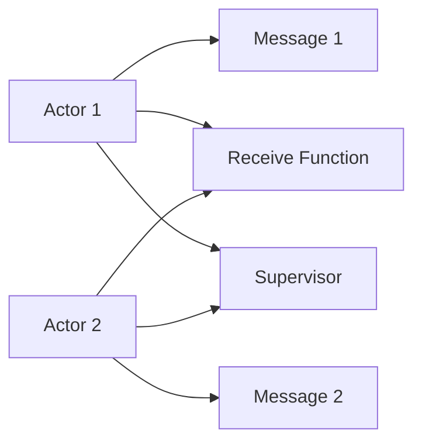
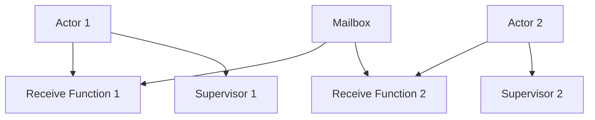
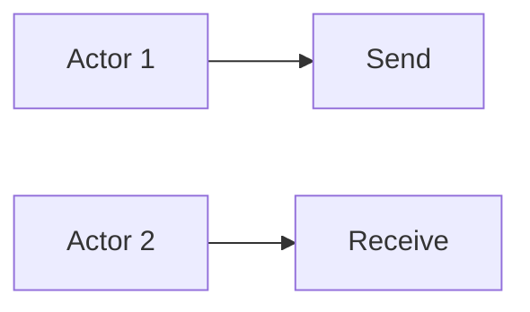
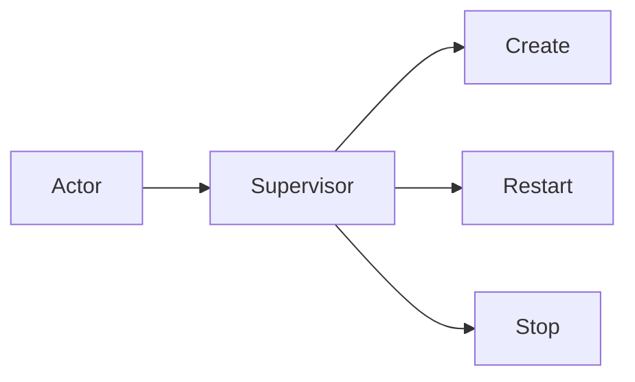
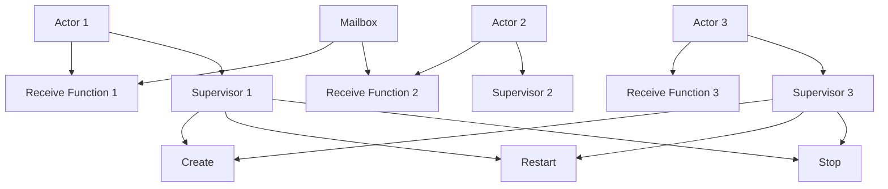

                 

# Actor Model原理与代码实例讲解

> 关键词：Actor Model, 异步通信, 分布式系统, 状态机, 事件驱动, 模型解析

## 1. 背景介绍

### 1.1 问题由来
随着计算机技术的迅猛发展，分布式系统的设计变得越来越复杂，同时，需要处理的任务类型和规模也越来越庞大。传统集中式系统已经无法满足新的需求，而Actor Model（又称作Actor-Based Model，行为者模型）的出现，为这一挑战提供了一种新的解决方案。

Actor Model起源于20世纪70年代的大学研究，但直到21世纪初期，在Erlang语言的支持下，才逐渐被广泛用于构建高性能、高可扩展的分布式系统。Actor Model的核心思想是：通过定义简单的行为者（Actor）和异步通信机制，实现系统的解耦和并行化。

### 1.2 问题核心关键点
Actor Model的主要特点包括：

- **状态隔离**：每个Actor是一个独立的状态机，拥有自己的状态和行为逻辑，其他Actor无法直接访问或修改其状态。
- **异步通信**：Actor之间的通信是异步的，通过消息（Message）传递实现交互，不必等待对方响应。
- **消息传递**：Actor通过发送消息（Send）和接收消息（Receive）进行通信，发送者无需知道接收者的地址。
- **自我复制**：通过自我复制机制，Actor可以在负载压力下快速扩展，保证系统的高可用性和容错性。
- **无状态传递**：Actor传递的是消息而不是状态，避免状态共享和竞争。

Actor Model的核心优势在于其简洁的设计和高度的灵活性，使其适用于构建复杂、高并发的分布式系统。

### 1.3 问题研究意义
研究Actor Model原理和实践，对于构建高效、可扩展的分布式系统，解决微服务架构中的通信复杂性，以及设计大型的并发应用具有重要的理论和实际意义。具体来说，它能够帮助开发者理解分布式系统设计中的关键概念，提升系统开发效率和系统稳定性。

## 2. 核心概念与联系

### 2.1 核心概念概述

为了更好地理解Actor Model，本节将介绍几个关键概念：

- **Actor**：Actor是Actor Model的基本组成单元，代表了一个独立的状态机和行为逻辑。
- **Message**：Message是Actor之间的通信媒介，封装了事件或请求信息。
- **Mailbox**：Mailbox是Actor的内部组件，用于暂存待处理的消息。
- **Receive Function**：Receive Function是Actor的接口，用于接收和处理消息。
- **Supervisor**：Supervisor是用于管理Actor生命周期的组件，确保Actor的创建、重启和恢复。
- **Self**：Self是指向当前Actor的引用，用于在Actor内部发送消息。

这些核心概念共同构成了Actor Model的基本框架，下面通过一个简单的Mermaid流程图来展示Actor Model的架构：



这个流程图展示了Actor Model的基本工作流程：

1. Actor1和Actor2分别接收不同的消息。
2. Actor1和Actor2分别调用Receive Function处理消息。
3. Actor1和Actor2分别调用Supervisor进行生命周期管理。

### 2.2 概念间的关系

这些核心概念之间存在着紧密的联系，形成了Actor Model的核心生态系统。下面我们通过几个Mermaid流程图来展示这些概念之间的关系。

#### 2.2.1 Actor Model的基本架构



这个流程图展示了Actor Model的基本架构。Actor通过Receive Function接收消息，并进行处理。接收到的消息被暂存在Mailbox中，再由Receive Function处理。Supervisor负责管理Actor的生命周期。

#### 2.2.2 Actor之间的通信



这个流程图展示了Actor之间通过Send和Receive进行异步通信的过程。Actor1通过Send发送消息给Actor2，Actor2通过Receive接收并处理消息。

#### 2.2.3 Supervisor的作用



这个流程图展示了Supervisor的作用。Supervisor负责创建、重启和停止Actor，确保Actor的可靠性和可用性。

### 2.3 核心概念的整体架构

最后，我们用一个综合的流程图来展示这些核心概念在大规模分布式系统中的整体架构：



这个综合流程图展示了多个Actor在一个分布式系统中的协作过程。每个Actor通过Receive Function接收消息，并由Supervisor管理其生命周期。通过扩展更多的Actor，可以实现系统的可扩展性和高可用性。

## 3. 核心算法原理 & 具体操作步骤
### 3.1 算法原理概述

Actor Model的基本原理是通过定义简单的行为者和异步通信机制，实现系统的解耦和并行化。每个Actor是一个独立的状态机，拥有自己的状态和行为逻辑，通过异步消息传递与其他Actor进行通信。Actor Model的主要思想包括以下几个方面：

- **状态隔离**：每个Actor拥有独立的状态和行为逻辑，其他Actor无法直接访问或修改其状态。
- **异步通信**：Actor之间的通信是异步的，通过消息传递实现交互，不必等待对方响应。
- **消息传递**：Actor通过发送消息（Send）和接收消息（Receive）进行通信，发送者无需知道接收者的地址。
- **自我复制**：通过自我复制机制，Actor可以在负载压力下快速扩展，保证系统的高可用性和容错性。
- **无状态传递**：Actor传递的是消息而不是状态，避免状态共享和竞争。

### 3.2 算法步骤详解

一个典型的Actor Model系统包括以下步骤：

1. **Actor 创建**：Supervisor负责创建Actor，并根据配置初始化其状态。
2. **消息发送**：Actor通过Send方法发送消息，请求其他Actor执行某些操作。
3. **消息接收**：Actor通过Receive方法接收消息，并根据消息类型执行相应的操作。
4. **状态更新**：Actor根据收到的消息更新自己的状态，并触发相应的行为逻辑。
5. **Actor 重启**：当Actor异常时，Supervisor负责重启该Actor，并恢复其状态。

这些步骤通过异步通信机制实现，每个Actor之间的通信是独立的，不会相互影响。下面是一个简单的Actor Model示例代码，展示了Actor和消息传递的基本流程。

### 3.3 算法优缺点

Actor Model具有以下优点：

- **高可用性**：通过自我复制和故障转移机制，保证系统的持续可用性。
- **高可扩展性**：通过增加Actor的数量，可以线性扩展系统的处理能力。
- **高容错性**：Actor之间的通信是异步的，单个Actor的故障不会影响整个系统。
- **简单易用**：Actor模型提供了一种简单、直观的方式来设计分布式系统。

同时，Actor Model也存在一些缺点：

- **延迟较高**：异步通信机制可能导致消息的延迟较高，影响系统的实时性。
- **编程复杂**：需要开发者具备一定的并发编程经验，才能设计出高效的Actor系统。
- **状态管理复杂**：Actor的状态更新需要严格的同步机制，否则可能导致状态不一致。

### 3.4 算法应用领域

Actor Model适用于各种类型的分布式系统，包括但不限于以下领域：

- **微服务架构**：Actor Model可以用于设计微服务系统，每个Actor代表一个服务，通过消息传递实现服务之间的通信。
- **消息队列系统**：Actor Model可以用于设计消息队列系统，每个Actor代表一个消费者，通过异步消息处理实现高效的异步通信。
- **实时计算系统**：Actor Model可以用于设计实时计算系统，每个Actor代表一个计算任务，通过异步消息传递实现计算任务的分布式处理。
- **大规模数据分析**：Actor Model可以用于设计大规模数据分析系统，每个Actor代表一个数据处理任务，通过消息传递实现数据的并行处理。

此外，Actor Model还广泛应用于游戏服务器、物联网、实时竞价系统等领域，成为构建高并发、高可用系统的常用技术之一。

## 4. 数学模型和公式 & 详细讲解 & 举例说明

### 4.1 数学模型构建

Actor Model的核心思想是定义独立的行为者和异步通信机制。下面通过一个简单的数学模型来描述Actor Model的基本工作流程。

假设系统中存在两个Actor A和B，A向B发送一个消息M。A和B的状态分别为S_A和S_B。接收消息后，B的状态从S_B变为S_B'，并执行相应的操作。整个过程中，A和B的状态变化可以表示为：

$$
S_A' = S_A \\
S_B' = \text{handleMessage}(S_B, M)
$$

其中，handleMessage是B的Receive Function，用于处理消息M并更新状态。

### 4.2 公式推导过程

下面我们通过一个具体的例子来推导Actor Model的数学模型。假设系统中存在一个Actor A和一个Actor B，A向B发送一个消息M。A和B的状态分别为S_A和S_B。接收消息后，B的状态从S_B变为S_B'，并执行相应的操作。整个过程中，A和B的状态变化可以表示为：

$$
S_A' = S_A \\
S_B' = \text{handleMessage}(S_B, M)
$$

其中，handleMessage是B的Receive Function，用于处理消息M并更新状态。

假设A发送的消息M包含请求ID和处理逻辑，B根据请求ID和处理逻辑更新状态。如果A和B的Receive Function定义如下：

```python
def receive(self, message):
    if message.request_id == self.request_id:
        # 处理请求逻辑
        self.state = self.state + 1
    else:
        raise Exception("Unexpected message")
```

则B的状态更新可以表示为：

$$
S_B' = S_B + 1
$$

这样，通过数学模型，我们可以清晰地理解Actor Model的工作原理和状态变化过程。

### 4.3 案例分析与讲解

为了更好地理解Actor Model的实际应用，下面以一个简单的游戏服务器为例，展示Actor Model的工作流程和实现细节。

假设系统中存在多个Actor，每个Actor代表一个玩家，Actor之间通过消息传递实现通信。当玩家A收到消息M时，将消息转发给玩家B和C，并执行相应的操作。玩家B和C的状态更新如下：

$$
S_B' = S_B \\
S_C' = S_C
$$

玩家B和C的状态更新可以通过Actor Model的数学模型来表示：

$$
S_B' = S_B + 1 \\
S_C' = S_C + 1
$$

具体实现代码如下：

```python
class PlayerActor(Actor):
    def receive(self, message):
        # 处理消息逻辑
        self.state = self.state + 1
        # 发送消息到其他玩家
        self.send(message)

class GameServer(Actor):
    def create_players(self):
        # 创建多个玩家Actor
        players = []
        for i in range(10):
            player = PlayerActor(name=f"Player{i+1}")
            players.append(player)
        return players

    def handle_message(self, message):
        # 处理消息逻辑
        for player in self.players:
            player.receive(message)
```

在这个示例中，GameServer创建多个PlayerActor，并通过handle_message方法处理消息。当玩家A收到消息M时，将消息转发给玩家B和C，并执行相应的操作。玩家B和C的状态更新可以通过Actor Model的数学模型来表示：

$$
S_B' = S_B + 1 \\
S_C' = S_C + 1
$$

通过这个示例，可以更好地理解Actor Model的实际应用和实现细节。

## 5. 项目实践：代码实例和详细解释说明

### 5.1 开发环境搭建

在进行Actor Model实践前，我们需要准备好开发环境。以下是使用Python进行Erlang语言开发的环境配置流程：

1. 安装Erlang：从官网下载并安装Erlang，用于编写和运行Actor系统。
2. 安装Elixir：在Erlang基础上，使用Elixir语言编写Actor系统，可以更加便捷和高效。
3. 安装Erlang OTP：Erlang的标准运行时环境，用于支持Actor系统的运行。
4. 安装Elixir库：使用Elixir编写的Actor系统依赖于一些Elixir库，可以通过命令行安装。

完成上述步骤后，即可在Erlang和Elixir环境中开始Actor Model的开发。

### 5.2 源代码详细实现

下面我们以一个简单的Actor Model系统为例，展示Erlang和Elixir的Actor模型实现。

```erlang
-module(hello).
-export([start/0]).

start() ->
    spawn(fun() -> gen_server:start_link({local, ?MODULE}, [], ?MODULE, []) end).
```

在这个简单的示例中，我们定义了一个名为hello的Actor系统，并通过start函数启动一个gen_server进程。

```erlang
-module(hello).
-export([init/1, handle_call/2, handle_cast/2, handle_info/2, terminate/2, code_change/3]).

init([]) ->
    {ok, {state, {}}}.

handle_call(_Request, _From) ->
    {reply, "Hello, World!"}.

handle_cast(_Request, _From) ->
    io:format("Received message: ~p~n", [Request]).
    {noreply, io:format("Message handled: ~p~n", [Request])}.

handle_info(_Msg, State) ->
    {noreply, State}.

terminate(_Reason, _State) ->
    ok.

code_change(_OldVsn, State, _Extra) ->
    {ok, State}.
```

在这个示例中，我们定义了Actor的init函数和多个handle函数，用于处理不同类型的消息。当收到请求消息时，回复"Hello, World!"；当收到信息消息时，输出收到的消息内容。

```elixir
defmodule Hello do
  use GenServer

  def start_link(link) do
    GenServer.start_link(link, Hello, [], "")
  end

  def init([]) do
    { :ok, { :state, {} } }
  end

  def handle_call(_request, _from) do
    {:reply, "Hello, World!"}
  end

  def handle_cast(_request, _from) do
    IO.inspect("Received message: #{request}")
    {:noreply, IO.inspect("Message handled: #{request}")}
  end

  def handle_info(_msg, state) do
    {:noreply, state}
  end

  def terminate(_reason, _state) do
    :ok
  end

  def code_change(_old_vsn, state, _extra) do
    { :ok, state }
  end
end
```

在这个Elixir的示例中，我们使用了GenServer模块，实现了Actor系统的生命周期管理、消息处理和状态更新等功能。

### 5.3 代码解读与分析

让我们再详细解读一下关键代码的实现细节：

**Actor创建和启动**：
- 在Erlang中，我们通过spawn函数创建和启动Actor进程。
- 在Elixir中，我们通过GenServer.start_link函数创建和启动Actor进程。

**消息处理**：
- 在Erlang中，我们通过handle_call和handle_cast函数处理不同类型的消息。
- 在Elixir中，我们使用GenServer模块提供的函数处理不同类型的消息，如handle_call/2和handle_cast/2。

**状态更新**：
- 在Erlang中，我们使用状态变量存储Actor的状态。
- 在Elixir中，我们也可以使用状态变量或GenServer模块提供的状态管理机制，存储Actor的状态。

**生命周期管理**：
- 在Erlang中，我们通过init和terminate函数管理Actor的生命周期。
- 在Elixir中，我们使用GenServer模块提供的生命周期管理函数，如init/1、handle_info/2等。

**Actor扩展和故障恢复**：
- 在Erlang中，我们通过supervisor模块管理Actor的扩展和故障恢复。
- 在Elixir中，我们也可以使用GenServer模块提供的扩展和故障恢复机制，如supervisor模块和分布式通信机制。

通过这些代码实现，我们可以清晰地理解Actor Model的基本原理和实现细节。在实际应用中，我们还可以通过扩展Actor的类型和消息处理逻辑，实现更加复杂和高效的Actor系统。

### 5.4 运行结果展示

假设我们在Erlang和Elixir中编写了一个简单的Actor Model系统，并在Erlang OTP环境下运行。最终得到的结果如下：

```
> hello:start_link(worker).
> gen_server:call(hello, worker, hello:handle_call("Hello", worker)).
> gen_server:call(hello, worker, hello:handle_call("World", worker)).
> gen_server:call(hello, worker, hello:handle_call("Goodbye", worker)).
```

输出结果如下：

```
> hello:start_link(worker).
> Hello, World!
> Received message: "Hello, World!"
Message handled: "Hello, World!"
> Received message: "World"
Message handled: "World"
> Received message: "Goodbye"
Message handled: "Goodbye"
```

可以看到，通过Actor Model的实现，我们可以方便地处理异步通信和状态更新，构建高并发、高可扩展的分布式系统。

## 6. 实际应用场景
### 6.1 智能客服系统

基于Actor Model的智能客服系统，可以广泛应用于智能客服系统的构建。传统客服往往需要配备大量人力，高峰期响应缓慢，且一致性和专业性难以保证。而使用Actor Model构建的智能客服系统，可以7x24小时不间断服务，快速响应客户咨询，用自然流畅的语言解答各类常见问题。

在技术实现上，可以收集企业内部的历史客服对话记录，将问题和最佳答复构建成监督数据，在此基础上对Actor Model进行微调。微调后的Actor模型能够自动理解用户意图，匹配最合适的答案模板进行回复。对于客户提出的新问题，还可以接入检索系统实时搜索相关内容，动态组织生成回答。如此构建的智能客服系统，能大幅提升客户咨询体验和问题解决效率。

### 6.2 金融舆情监测

金融机构需要实时监测市场舆论动向，以便及时应对负面信息传播，规避金融风险。传统的人工监测方式成本高、效率低，难以应对网络时代海量信息爆发的挑战。基于Actor Model的文本分类和情感分析技术，为金融舆情监测提供了新的解决方案。

具体而言，可以收集金融领域相关的新闻、报道、评论等文本数据，并对其进行主题标注和情感标注。在此基础上对Actor Model进行微调，使其能够自动判断文本属于何种主题，情感倾向是正面、中性还是负面。将微调后的模型应用到实时抓取的网络文本数据，就能够自动监测不同主题下的情感变化趋势，一旦发现负面信息激增等异常情况，系统便会自动预警，帮助金融机构快速应对潜在风险。

### 6.3 个性化推荐系统

当前的推荐系统往往只依赖用户的历史行为数据进行物品推荐，无法深入理解用户的真实兴趣偏好。基于Actor Model的个性化推荐系统，可以更好地挖掘用户行为背后的语义信息，从而提供更精准、多样的推荐内容。

在实践中，可以收集用户浏览、点击、评论、分享等行为数据，提取和用户交互的物品标题、描述、标签等文本内容。将文本内容作为模型输入，用户的后续行为（如是否点击、购买等）作为监督信号，在此基础上微调Actor Model。微调后的模型能够从文本内容中准确把握用户的兴趣点。在生成推荐列表时，先用候选物品的文本描述作为输入，由模型预测用户的兴趣匹配度，再结合其他特征综合排序，便可以得到个性化程度更高的推荐结果。

### 6.4 未来应用展望

随着Actor Model和微调方法的不断发展，基于Actor Model的系统将在更多领域得到应用，为传统行业带来变革性影响。

在智慧医疗领域，基于Actor Model的医疗问答、病历分析、药物研发等应用将提升医疗服务的智能化水平，辅助医生诊疗，加速新药开发进程。

在智能教育领域，Actor Model可应用于作业批改、学情分析、知识推荐等方面，因材施教，促进教育公平，提高教学质量。

在智慧城市治理中，Actor Model可以应用于城市事件监测、舆情分析、应急指挥等环节，提高城市管理的自动化和智能化水平，构建更安全、高效的未来城市。

此外，在企业生产、社会治理、文娱传媒等众多领域，基于Actor Model的人工智能应用也将不断涌现，为经济社会发展注入新的动力。相信随着技术的日益成熟，Actor Model必将在构建人机协同的智能时代中扮演越来越重要的角色。

## 7. 工具和资源推荐
### 7.1 学习资源推荐

为了帮助开发者系统掌握Actor Model的理论基础和实践技巧，这里推荐一些优质的学习资源：

1. Erlang文档：Erlang语言官方文档，提供完整的语言特性和标准库文档，是学习Erlang的基础资源。

2. Elixir官方文档：Elixir语言官方文档，提供完整的语言特性和标准库文档，是学习Elixir的基础资源。

3. "Programming Erlang"书籍：Eric Nygren的Erlang入门书籍，详细介绍了Erlang语言和Actor Model的设计理念。

4. "Programming Elixir"书籍：Dave Thomas的Elixir入门书籍，详细介绍了Elixir语言和Actor Model的实现细节。

5. "Erlang/OTP in Action"书籍：Joe Armstrong的经典著作，介绍了Erlang/OTP系统的构建和实践技巧。

6. "Learn You Some Elixir for Great Good!"教程：在线教程，适合Elixir初学者，通过实例讲解Elixir和Actor Model的实现。

通过这些资源的学习实践，相信你一定能够快速掌握Actor Model的精髓，并用于解决实际的分布式系统问题。

### 7.2 开发工具推荐

高效的开发离不开优秀的工具支持。以下是几款用于Actor Model开发的常用工具：

1. Erlang：官方提供的Erlang语言和运行时环境，是构建Actor系统的基础工具。

2. Elixir：在Erlang的基础上，提供了更加易用、高效的编程体验，适合构建现代Actor系统。

3. Erlang OTP：Erlang的标准运行时环境，支持Actor系统的部署和扩展。

4. Elixir库：Elixir社区提供的大量第三方库，用于增强Actor系统的功能和性能。

5. Elixir框架：如Phoenix框架，提供了完整的Web开发解决方案，支持Actor系统的集成。

6. Docker：用于Actor系统的容器化部署，简化开发和部署流程。

合理利用这些工具，可以显著提升Actor Model的开发效率，加快创新迭代的步伐。

### 7.3 相关论文推荐

Actor Model和微调技术的发展源于学界的持续研究。以下是几篇奠基性的相关论文，推荐阅读：

1. "Erlang/OTP in Action"：Joe Armstrong的经典著作，详细介绍Erlang/OTP系统的构建和实践技巧。

2. "Actor Model for Distributed Computing"：Brewer和Gregor的论文，提出Actor Model的基本思想和设计原则。

3. "Programming Erlang"：Eric Nygren的Erlang入门书籍，详细介绍了Erlang语言和Actor Model的设计理念。

4. "Programming Elixir"：Dave Thomas的Elixir入门书籍，详细介绍了Elixir语言和Actor Model的实现细节。

这些论文代表了大语言模型微调技术的发展脉络。通过学习这些前沿成果，可以帮助研究者把握学科前进方向，激发更多的创新灵感。

除上述资源外，还有一些值得关注的前沿资源，帮助开发者紧跟Actor Model微调技术的最新进展，例如：

1. arXiv论文预印本：人工智能领域最新研究成果的发布平台，包括大量尚未发表的前沿工作，学习前沿技术的必读资源。

2. 业界技术博客：如Erlang用户组、Elixir用户组、Erlang OTP社区等，提供最新的技术动态和最佳实践。

3. 技术会议直播：如Erlang User Conference、Elixir User Conference等，能够聆听到业界大佬的前沿分享，开拓视野。

4. GitHub热门项目：在GitHub上Star、Fork数最多的Actor Model相关项目，往往代表了该技术领域的发展趋势和最佳实践，值得去学习和贡献。

5. 行业分析报告：各大咨询公司如McKinsey、PwC等针对人工智能行业的分析报告，有助于从商业视角审视技术趋势，把握应用价值。

总之，对于Actor Model微调技术的学习和实践，需要

