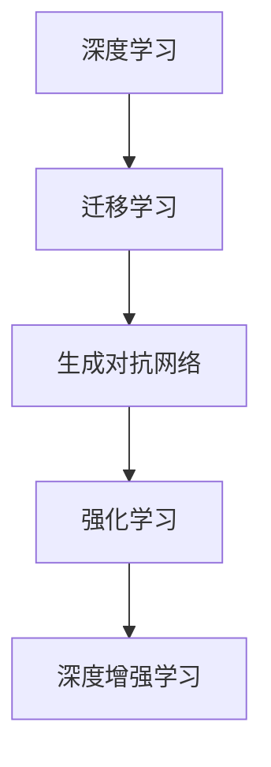
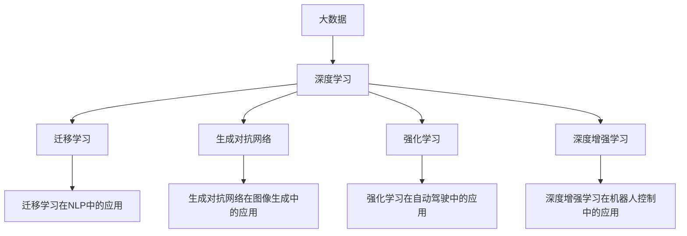

                 

# Andrej Karpathy：人工智能的未来发展挑战

## 1. 背景介绍

### 1.1 问题由来
Andrej Karpathy是斯坦福大学计算机科学与人工智能实验室的教授，也是OpenAI的创始人之一，在计算机视觉、深度学习和自动驾驶等领域有着丰富的研究和应用经验。近年来，他多次在公开场合发表演讲，探讨人工智能的未来发展趋势和面临的挑战。本文将基于他的一些观点，深入分析人工智能领域的研究现状和未来挑战。

### 1.2 问题核心关键点
Karpathy指出，尽管人工智能技术在图像识别、语音识别、自然语言处理等领域取得了显著进展，但仍然存在许多未解决的问题和挑战。这些问题主要集中在以下几个方面：

- **数据的获取与处理**：高质量、大样本量的数据是训练深度学习模型的基础。然而，数据获取和标注成本高昂，且数据质量难以保证。
- **模型的泛化能力**：尽管模型在训练集上表现优异，但在测试集上性能往往不如预期，泛化能力不足。
- **模型解释性**：深度学习模型通常被视为"黑箱"，难以解释其内部决策过程。
- **模型公平性和安全性**：模型可能学习到有偏见、有害的信息，给实际应用带来安全隐患。
- **人机交互**：如何让机器更好地理解和响应人类需求，提升用户体验。

### 1.3 问题研究意义
理解和解决这些挑战，对于推动人工智能技术的进步、提升其在实际应用中的可靠性与安全性具有重要意义。

## 2. 核心概念与联系

### 2.1 核心概念概述

为更好地理解人工智能未来的发展趋势，本节将介绍几个关键概念：

- **深度学习**：一种基于神经网络的机器学习技术，通过多层次的特征提取和抽象，实现对复杂数据的建模和预测。
- **迁移学习**：将一个领域学习到的知识，迁移到另一个相关领域中，用于解决新任务的学习方法。
- **生成对抗网络(GANs)**：由生成器和判别器两部分组成的网络结构，用于生成与训练数据相似的样本。
- **强化学习**：通过与环境互动，学习最优策略以最大化奖励的机器学习方法。
- **深度增强学习(Deep RL)**：结合深度学习和强化学习的技术，用于解决复杂的控制和决策问题。

这些概念在大数据、深度学习、机器学习等领域的最新进展中扮演了重要角色，代表了当前技术发展的主要方向。

### 2.2 概念间的关系

这些概念之间的逻辑关系可以通过以下Mermaid流程图来展示：



这个流程图展示了深度学习、迁移学习、生成对抗网络、强化学习和深度增强学习之间的关系：

- 深度学习作为基础技术，为迁移学习、生成对抗网络和强化学习提供了方法论和模型框架。
- 迁移学习利用深度学习的知识迁移能力，拓展了深度学习的应用边界。
- 生成对抗网络是一种特殊的深度学习结构，用于生成和合成新数据。
- 强化学习通过与环境互动，优化策略以最大化奖励。
- 深度增强学习结合深度学习和强化学习的优点，用于解决更加复杂的问题。

### 2.3 核心概念的整体架构

最后，我们用一个综合的流程图来展示这些核心概念在大数据、深度学习、机器学习等领域的整体架构：



这个综合流程图展示了大数据、深度学习、迁移学习、生成对抗网络、强化学习和深度增强学习在各个应用领域的整体架构。

## 3. 核心算法原理 & 具体操作步骤
### 3.1 算法原理概述

Karpathy认为，深度学习在未来将继续发展，但面临许多新的挑战和问题。以下是对深度学习未来发展的几个重要领域的概述：

**1. 多模态学习**
多模态学习指同时处理和分析多种不同类型的数据，如文本、图像、语音等。通过融合多种数据模态的信息，可以提升模型的鲁棒性和泛化能力。

**2. 自监督学习**
自监督学习通过无标签的数据进行训练，自动学习数据的潜在表示。这种学习方式可以大幅减少对标注数据的依赖，提高数据利用效率。

**3. 生成模型**
生成模型如GANs、变分自编码器(VAEs)等，可以用于数据增强、图像生成、自然语言生成等任务。生成模型能够学习数据的分布，生成高质量的合成数据，提升模型的性能。

**4. 强化学习**
强化学习用于训练机器人在复杂环境中的行为策略。在自动驾驶、游戏AI、机器人控制等领域，强化学习具有广泛应用前景。

**5. 深度增强学习**
深度增强学习结合深度学习和强化学习的优势，用于解决更加复杂的问题。例如在机器人控制、自动驾驶等任务中，深度增强学习能够更好地处理高维状态空间。

### 3.2 算法步骤详解

以下是深度学习技术在大规模应用中可能采取的步骤：

**1. 数据收集与预处理**
- 收集高质量、大样本量的数据集，并对其进行清洗、去重、标注等预处理。
- 采用数据增强技术，如图像旋转、裁剪、加噪声等，扩充数据集。

**2. 模型选择与设计**
- 根据任务特点选择适合的深度学习模型，如卷积神经网络、循环神经网络、Transformer等。
- 设计合适的模型结构，包括网络层数、激活函数、优化器等。

**3. 模型训练与优化**
- 使用合适的优化算法，如随机梯度下降、Adam等，进行模型训练。
- 调整超参数，如学习率、批大小、迭代次数等，进行模型优化。

**4. 模型评估与调优**
- 在验证集上评估模型性能，根据评估结果进行调优。
- 采用模型剪枝、量化、混合精度等技术，优化模型大小和性能。

**5. 模型部署与应用**
- 将训练好的模型部署到实际应用场景中，进行推理预测。
- 收集反馈数据，持续改进模型，实现持续学习。

### 3.3 算法优缺点

深度学习技术的优点：
- 能够处理复杂的数据结构，如图像、语音、文本等。
- 自动学习数据的特征表示，减少特征工程的工作量。
- 能够在大规模数据集上进行训练，提升模型的泛化能力。

深度学习技术的缺点：
- 对标注数据依赖性强，数据获取和标注成本高。
- 模型复杂度高，训练和推理时间长。
- 模型黑盒化，难以解释内部决策过程。

### 3.4 算法应用领域

深度学习技术在许多领域都得到了广泛应用，以下是几个典型的应用场景：

**1. 计算机视觉**
- 图像分类：如手写数字识别、物体识别等。
- 目标检测：如行人检测、物体跟踪等。
- 图像生成：如GANs生成逼真图像、风格迁移等。

**2. 自然语言处理**
- 机器翻译：如神经机器翻译(NMT)。
- 语言模型：如BERT、GPT等。
- 文本生成：如对话系统、新闻生成等。

**3. 语音识别**
- 语音识别：如智能语音助手、语音转文字等。
- 语音生成：如TTS系统、语音合成等。

**4. 自动驾驶**
- 感知与定位：如车道线检测、交通标志识别等。
- 决策与控制：如自动驾驶算法、路径规划等。

## 4. 数学模型和公式 & 详细讲解 & 举例说明

### 4.1 数学模型构建

以下是深度学习模型的基本数学模型构建：

假设输入为 $x$，输出为 $y$，模型参数为 $\theta$，模型损失函数为 $L(\theta)$。在训练过程中，通过前向传播和反向传播计算损失函数的梯度，更新模型参数。

**前向传播**：
$$
y = f_\theta(x)
$$

**损失函数**：
$$
L(\theta) = \frac{1}{N} \sum_{i=1}^N \ell(y_i, f_\theta(x_i))
$$

其中 $\ell$ 为损失函数，通常为均方误差、交叉熵等。

**反向传播**：
$$
\frac{\partial L}{\partial \theta} = \frac{1}{N} \sum_{i=1}^N \nabla_\theta \ell(y_i, f_\theta(x_i))
$$

### 4.2 公式推导过程

以下是深度学习模型中常见的反向传播公式推导：

**均方误差损失函数**：
$$
\ell(y, f_\theta(x)) = \frac{1}{2} (y - f_\theta(x))^2
$$

**交叉熵损失函数**：
$$
\ell(y, f_\theta(x)) = -\sum_{i=1}^C y_i \log f_\theta(x_i)
$$

其中 $y$ 为真实标签，$f_\theta(x)$ 为模型预测输出。

**梯度下降优化算法**：
$$
\theta \leftarrow \theta - \eta \nabla_\theta L(\theta)
$$

其中 $\eta$ 为学习率。

### 4.3 案例分析与讲解

以下是深度学习模型在图像分类任务中的应用案例分析：

假设输入为图像 $x$，输出为类别标签 $y$，模型参数为 $\theta$，损失函数为交叉熵。

**前向传播**：
$$
y = f_\theta(x) = \sigma(\sum_{i=1}^d w_i x_i + b)
$$

其中 $f_\theta(x)$ 为模型输出，$\sigma$ 为激活函数，$w$ 和 $b$ 为模型参数。

**损失函数**：
$$
L(\theta) = -\frac{1}{N} \sum_{i=1}^N \sum_{j=1}^C y_{ij} \log f_\theta(x_i)
$$

其中 $y_{ij}$ 为第 $i$ 个样本的第 $j$ 个类别的真实标签。

**反向传播**：
$$
\frac{\partial L}{\partial w_i} = -\frac{1}{N} \sum_{i=1}^N \sum_{j=1}^C x_{ij} \cdot (f_\theta(x_i) - y_{ij})
$$

其中 $\frac{\partial L}{\partial w_i}$ 为损失函数对 $w_i$ 的梯度。

## 5. 项目实践：代码实例和详细解释说明

### 5.1 开发环境搭建

以下是使用PyTorch搭建深度学习模型的环境配置流程：

1. 安装Anaconda：从官网下载并安装Anaconda，用于创建独立的Python环境。
2. 创建并激活虚拟环境：
```bash
conda create -n pytorch-env python=3.8 
conda activate pytorch-env
```

3. 安装PyTorch：根据CUDA版本，从官网获取对应的安装命令。例如：
```bash
conda install pytorch torchvision torchaudio cudatoolkit=11.1 -c pytorch -c conda-forge
```

4. 安装TensorBoard：
```bash
pip install tensorboard
```

5. 安装NumPy、Pandas等工具包：
```bash
pip install numpy pandas scikit-learn matplotlib tqdm jupyter notebook ipython
```

完成上述步骤后，即可在`pytorch-env`环境中开始深度学习模型的开发。

### 5.2 源代码详细实现

以下是使用PyTorch进行图像分类任务中卷积神经网络(CNN)的实现：

```python
import torch
import torch.nn as nn
import torchvision
import torchvision.transforms as transforms

# 定义模型
class CNN(nn.Module):
    def __init__(self):
        super(CNN, self).__init__()
        self.conv1 = nn.Conv2d(3, 64, 3, padding=1)
        self.relu1 = nn.ReLU()
        self.pool1 = nn.MaxPool2d(2, 2)
        self.conv2 = nn.Conv2d(64, 128, 3, padding=1)
        self.relu2 = nn.ReLU()
        self.pool2 = nn.MaxPool2d(2, 2)
        self.fc1 = nn.Linear(128 * 4 * 4, 512)
        self.relu3 = nn.ReLU()
        self.fc2 = nn.Linear(512, 10)

    def forward(self, x):
        x = self.conv1(x)
        x = self.relu1(x)
        x = self.pool1(x)
        x = self.conv2(x)
        x = self.relu2(x)
        x = self.pool2(x)
        x = x.view(-1, 128 * 4 * 4)
        x = self.fc1(x)
        x = self.relu3(x)
        x = self.fc2(x)
        return x

# 加载数据集
transform = transforms.Compose([
    transforms.Resize(224),
    transforms.ToTensor(),
    transforms.Normalize([0.485, 0.456, 0.406], [0.229, 0.224, 0.225])
])

train_data = torchvision.datasets.CIFAR10(root='./data', train=True, download=True, transform=transform)
train_loader = torch.utils.data.DataLoader(train_data, batch_size=64, shuffle=True)

test_data = torchvision.datasets.CIFAR10(root='./data', train=False, download=True, transform=transform)
test_loader = torch.utils.data.DataLoader(test_data, batch_size=64, shuffle=False)

# 初始化模型和优化器
model = CNN()
optimizer = torch.optim.Adam(model.parameters(), lr=0.001)

# 训练模型
for epoch in range(10):
    model.train()
    for i, (images, labels) in enumerate(train_loader):
        images, labels = images.to(device), labels.to(device)
        outputs = model(images)
        loss = nn.functional.cross_entropy(outputs, labels)
        optimizer.zero_grad()
        loss.backward()
        optimizer.step()
        if (i+1) % 100 == 0:
            print(f'Epoch {epoch+1}, Step {i+1}, Loss: {loss.item()}')

    model.eval()
    with torch.no_grad():
        correct = 0
        total = 0
        for images, labels in test_loader:
            images, labels = images.to(device), labels.to(device)
            outputs = model(images)
            _, predicted = torch.max(outputs.data, 1)
            total += labels.size(0)
            correct += (predicted == labels).sum().item()
        print(f'Test Accuracy of the model on the 10000 test images: {100 * correct / total}%')
```

### 5.3 代码解读与分析

以下是深度学习模型实现的关键代码解读：

**定义模型**：
- `__init__`方法：初始化模型的层和参数。
- `forward`方法：定义模型的前向传播过程。

**加载数据集**：
- `transform`：定义数据预处理流程，包括图像缩放、归一化等。
- `train_data`和`test_data`：加载CIFAR-10数据集。
- `train_loader`和`test_loader`：定义数据迭代器。

**初始化模型和优化器**：
- `model`：实例化定义的CNN模型。
- `optimizer`：设置Adam优化器，学习率为0.001。

**训练模型**：
- `model.train()`：设置模型为训练模式。
- `for`循环：遍历数据集。
- `model`：前向传播计算模型输出。
- `loss`：计算损失函数。
- `optimizer.zero_grad()`：重置梯度。
- `loss.backward()`：反向传播计算梯度。
- `optimizer.step()`：更新模型参数。
- `print`：输出损失和测试集准确率。

**测试模型**：
- `model.eval()`：设置模型为评估模式。
- `with torch.no_grad()`：关闭梯度计算。
- `correct`和`total`：计算测试集准确率。
- `predicted`：预测输出。
- `print`：输出测试集准确率。

## 6. 实际应用场景

### 6.1 智能驾驶

深度学习技术在智能驾驶领域有广泛应用，如自动驾驶、智能交通等。通过在车载传感器和摄像头上安装深度学习模型，系统可以实时分析道路环境和交通状况，实现自动驾驶、障碍物检测、路径规划等功能。

### 6.2 医疗影像诊断

深度学习技术在医疗影像诊断中也发挥了重要作用。通过训练深度神经网络，系统可以从医学影像中自动检测出肿瘤、病变等异常情况，提高诊断效率和准确率。

### 6.3 语音识别与翻译

深度学习技术在语音识别和翻译领域有显著进展。通过训练语音识别模型，系统可以实现实时语音转文本，进一步进行文本翻译。语音识别和翻译技术已经在智能助手、会议记录、跨语言通信等方面得到广泛应用。

### 6.4 游戏AI

深度学习技术在游戏AI领域也取得了重大进展。通过训练深度神经网络，系统可以实现实时决策、路径规划、目标检测等功能，显著提升游戏AI的智能水平。

## 7. 工具和资源推荐

### 7.1 学习资源推荐

为了帮助开发者系统掌握深度学习技术的理论基础和实践技巧，这里推荐一些优质的学习资源：

1. 《深度学习》(Deep Learning)：Ian Goodfellow等著，深度学习领域的经典教材，全面介绍了深度学习的基本概念和算法。
2. 《动手学深度学习》(Practical Deep Learning for Coders)：李沐等著，基于PyTorch实现，适合实战训练。
3. CS231n：斯坦福大学计算机视觉课程，涵盖了图像分类、目标检测等计算机视觉任务，适合入门学习。
4. CS224n：斯坦福大学自然语言处理课程，介绍了语言模型、文本分类等NLP任务，适合深入学习。
5. Kaggle：数据科学竞赛平台，提供大量真实世界的数据集和竞赛任务，适合实践训练。

### 7.2 开发工具推荐

高效的开发离不开优秀的工具支持。以下是几款用于深度学习模型开发的常用工具：

1. PyTorch：基于Python的开源深度学习框架，灵活动态，支持自动微分。
2. TensorFlow：由Google主导开发的深度学习框架，生产部署方便。
3. Keras：基于TensorFlow的高级API，简单易用，适合快速开发原型。
4. Jupyter Notebook：交互式笔记本，支持Python代码编写和实时显示结果。
5. TensorBoard：TensorFlow配套的可视化工具，可实时监测模型训练状态。

### 7.3 相关论文推荐

深度学习技术的研究源于学界的持续探索。以下是几篇奠基性的相关论文，推荐阅读：

1. AlexNet：ImageNet大规模视觉识别竞赛冠军，开创了深度学习在图像识别领域的应用。
2. VGGNet：多层次卷积神经网络结构，提升了图像识别的准确率。
3. GoogLeNet：Inception网络结构，实现了深度卷积神经网络的快速训练。
4. ResNet：残差网络结构，解决了深度神经网络中的梯度消失问题。
5. RNNs：循环神经网络，用于序列数据建模和处理。

这些论文代表了深度学习技术的发展脉络，通过学习这些前沿成果，可以帮助研究者把握学科前进方向，激发更多的创新灵感。

## 8. 总结：未来发展趋势与挑战

### 8.1 总结

本文对Andrej Karpathy在人工智能领域的观点进行了全面系统的介绍。首先阐述了人工智能技术在各个领域的应用现状和发展前景，明确了未来研究的方向和重点。其次，从原理到实践，详细讲解了深度学习的基本概念和实现方法，给出了深度学习模型开发的完整代码实例。同时，本文还广泛探讨了深度学习技术在实际应用中的挑战和解决策略，展示了其在多个领域的应用潜力。

通过本文的系统梳理，可以看到，深度学习技术在未来将继续蓬勃发展，推动人工智能技术的不断进步。但在发展过程中，也需要积极应对数据获取、模型泛化、可解释性、公平性等诸多挑战，才能实现人工智能技术的可持续发展。

### 8.2 未来发展趋势

展望未来，深度学习技术将呈现以下几个发展趋势：

1. 多模态学习。融合图像、语音、文本等多种数据模态，提升模型的鲁棒性和泛化能力。
2. 自监督学习。通过无标签数据进行预训练，减少对标注数据的依赖，提高数据利用效率。
3. 生成对抗网络。用于数据增强、图像生成、自然语言生成等任务，生成高质量的合成数据。
4. 强化学习。用于训练机器人在复杂环境中的行为策略，实现自动驾驶、游戏AI等功能。
5. 深度增强学习。结合深度学习和强化学习的优点，用于解决更加复杂的问题。

### 8.3 面临的挑战

尽管深度学习技术已经取得了显著进展，但在迈向更加智能化、普适化应用的过程中，仍然面临诸多挑战：

1. 数据获取与标注成本高。高质量、大样本量的数据是训练深度学习模型的基础，但数据获取和标注成本高昂。
2. 模型泛化能力不足。尽管模型在训练集上表现优异，但在测试集上性能往往不如预期，泛化能力不足。
3. 模型可解释性不足。深度学习模型通常被视为"黑盒"，难以解释其内部决策过程。
4. 模型公平性和安全性问题。模型可能学习到有偏见、有害的信息，给实际应用带来安全隐患。
5. 人机交互不足。如何让机器更好地理解和响应人类需求，提升用户体验。

### 8.4 研究展望

面对深度学习技术面临的诸多挑战，未来的研究需要在以下几个方面寻求新的突破：

1. 探索无监督和半监督学习。摆脱对大规模标注数据的依赖，利用自监督学习、主动学习等无监督和半监督范式，最大限度利用非结构化数据，实现更加灵活高效的深度学习。
2. 研究参数高效和计算高效的深度学习范式。开发更加参数高效的深度学习方法，在固定大部分预训练参数的情况下，只更新极少量的任务相关参数。同时优化深度学习模型的计算图，减少前向传播和反向传播的资源消耗，实现更加轻量级、实时性的部署。
3. 引入更多先验知识。将符号化的先验知识，如知识图谱、逻辑规则等，与深度学习模型进行巧妙融合，引导深度学习过程学习更准确、合理的深度学习模型。同时加强不同模态数据的整合，实现视觉、语音等多模态信息与文本信息的协同建模。
4. 结合因果分析和博弈论工具。将因果分析方法引入深度学习模型，识别出模型决策的关键特征，增强输出解释的因果性和逻辑性。借助博弈论工具刻画人机交互过程，主动探索并规避模型的脆弱点，提高系统稳定性。
5. 纳入伦理道德约束。在深度学习训练目标中引入伦理导向的评估指标，过滤和惩罚有偏见、有害的输出倾向。同时加强人工干预和审核，建立深度学习模型的监管机制，确保输出符合人类价值观和伦理道德。

这些研究方向的探索，必将引领深度学习技术迈向更高的台阶，为构建安全、可靠、可解释、可控的智能系统铺平道路。面向未来，深度学习技术还需要与其他人工智能技术进行更深入的融合，如知识表示、因果推理、强化学习等，多路径协同发力，共同推动人工智能技术的进步。

## 9. 附录：常见问题与解答

**Q1：深度学习对标注数据依赖性强，如何缓解这一问题？**

A: 可以通过无监督学习和半监督学习技术，利用非结构化数据进行预训练，减少对标注数据的依赖。例如，使用自监督学习任务，如自编码、对比学习等，在无标签数据上进行预训练，然后利用少量标注数据进行微调。

**Q2：深度学习模型复杂度高，训练和推理时间长，如何解决这一问题？**

A: 可以通过参数高效和计算高效的深度学习范式，如参数共享、模型压缩、剪枝、量化等技术，优化模型大小和性能。同时，可以采用分布式训练、GPU/TPU加速等技术，提升训练和推理速度。

**Q3：深度学习模型可解释性不足，如何解决这一问题？**

A: 可以通过模型可视化、可解释性分析等技术，提升深度学习模型的可解释性。例如，使用Shapley值、LIME等方法，对模型决策进行可视化解释，理解模型的内部机制。

**Q4：深度学习模型公平性和安全性问题如何解决？**

A: 可以通过公平性评估、对抗样本训练等技术，提高深度学习模型的公平性和安全性。例如，在训练过程中引入公平性约束，避免模型学习到有偏见的信息。同时，使用对抗样本生成技术，提升模型的鲁棒性，避免模型被恶意攻击。

**Q5：如何让深度学习模型更好地理解和响应人类需求？**

A: 可以通过多模态融合、情感分析、自然语言理解等技术，提升深度学习模型的人机交互能力。例如，在对话系统中，结合语音识别和自然语言理解技术，实现自然流畅的对话交互。

---

作者：禅与计算机程序设计艺术 / Zen and the Art of Computer Programming

