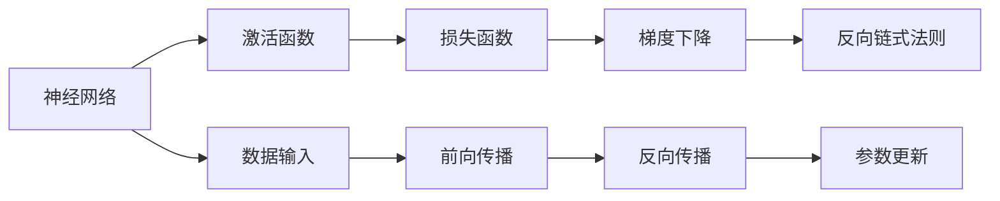
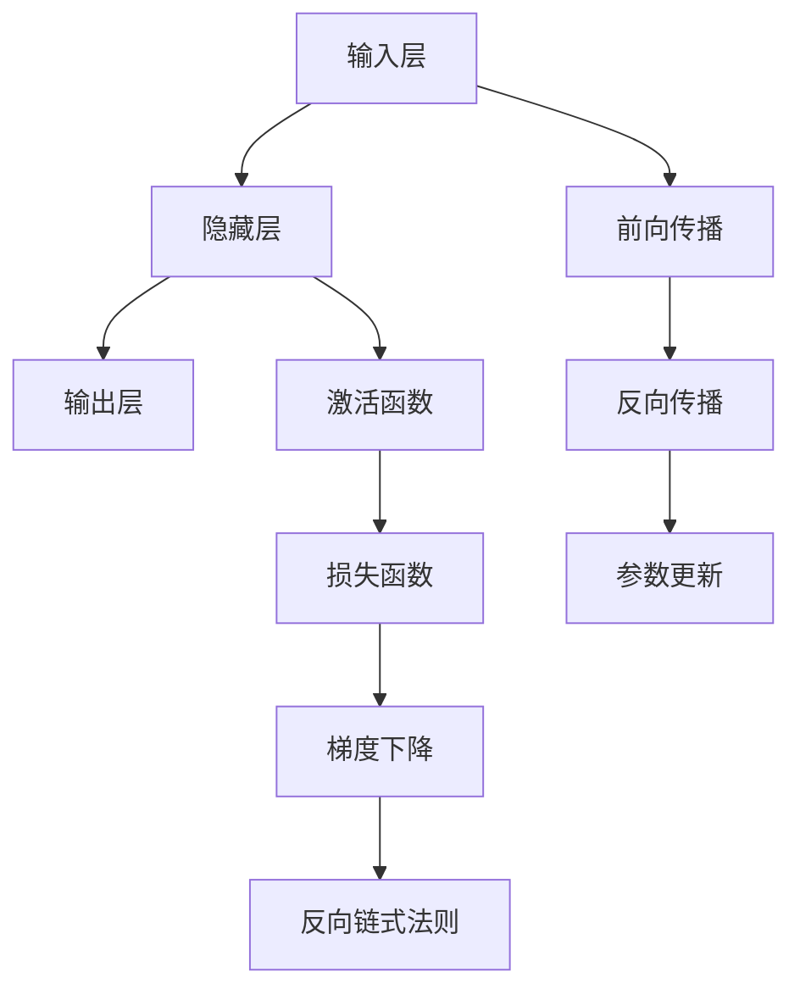
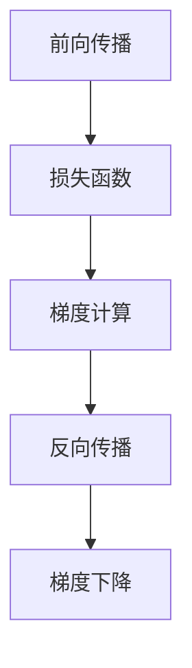
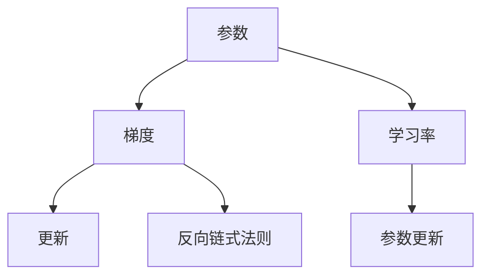
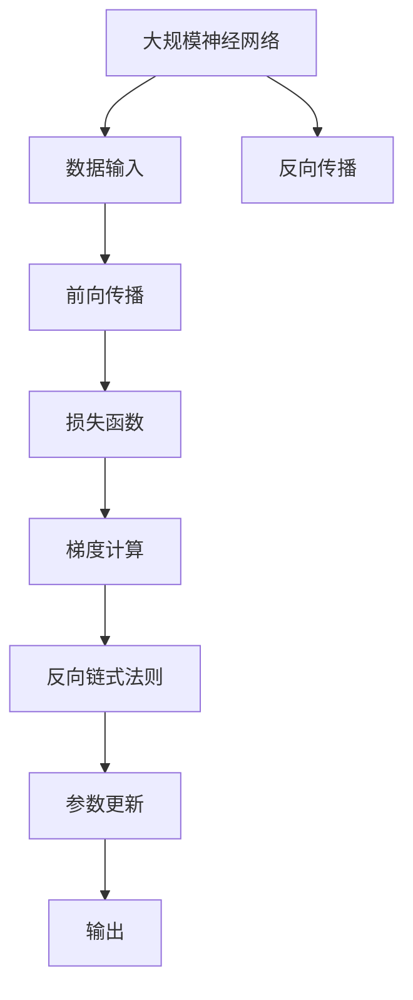

                 

# Backpropagation原理与代码实例讲解

> 关键词：反向传播,神经网络,深度学习,梯度下降,反向链式法则,算法原理

## 1. 背景介绍

### 1.1 问题由来

在深度学习领域，神经网络作为一种强大的非线性模型，广泛应用于图像识别、语音识别、自然语言处理等各类任务中。然而，如何高效地训练神经网络模型，使其能够获得较好的性能，成为一项重要的研究课题。传统的梯度下降方法虽然有效，但每次参数更新只能基于当前批次数据，无法充分利用历史梯度信息，且训练速度较慢。为了解决这个问题，反向传播算法被提出，并在深度学习中得到广泛应用。

### 1.2 问题核心关键点

反向传播算法（Backpropagation）是深度学习中最为基础的算法之一，其核心思想是利用反向链式法则，通过链式传递误差信号，计算出每一层参数的梯度，从而更新模型参数。反向传播算法有效地利用了梯度信息，极大地加快了模型的训练速度，并显著提升了模型的泛化能力。

### 1.3 问题研究意义

深入理解反向传播算法的原理和实现，对于掌握深度学习模型的训练过程，提高模型的性能和稳定性，具有重要意义。同时，反向传播算法也为进一步研究和开发更复杂、更高效的深度学习框架提供了理论基础。

## 2. 核心概念与联系

### 2.1 核心概念概述

为更好地理解反向传播算法，本节将介绍几个密切相关的核心概念：

- 神经网络（Neural Network）：一种由多个层次组成的计算模型，用于处理复杂非线性关系。
- 激活函数（Activation Function）：用于引入非线性变换，提升神经网络的表达能力。
- 损失函数（Loss Function）：用于度量模型输出与真实标签之间的差距。
- 梯度下降（Gradient Descent）：一种基于梯度信息更新参数的优化算法，是反向传播算法的核心。
- 反向链式法则（Backward Chain Rule）：一种计算梯度的算法，用于计算多层神经网络中每层参数的梯度。
- 链式法则（Chain Rule）：数学中的基本法则，用于将复杂函数的求导分解为简单函数的求导。

这些概念之间的逻辑关系可以通过以下Mermaid流程图来展示：



这个流程图展示了大规模神经网络的基本工作流程：数据输入后，通过前向传播计算输出；然后利用反向传播算法计算损失函数对模型参数的梯度，并通过梯度下降更新参数。链式法则和反向链式法则为计算梯度提供了数学基础，使得反向传播算法能够高效地训练深层神经网络。

### 2.2 概念间的关系

这些核心概念之间存在着紧密的联系，形成了反向传播算法的完整生态系统。下面我们通过几个Mermaid流程图来展示这些概念之间的关系。

#### 2.2.1 神经网络的基本结构



这个流程图展示了神经网络的基本结构：数据输入后，通过前向传播计算输出；然后利用反向传播算法计算损失函数对模型参数的梯度，并通过梯度下降更新参数。链式法则和反向链式法则为计算梯度提供了数学基础，使得反向传播算法能够高效地训练深层神经网络。

#### 2.2.2 反向传播算法的核心步骤



这个流程图展示了反向传播算法的核心步骤：先进行前向传播，计算出输出；然后计算损失函数，利用反向链式法则计算梯度；最后通过梯度下降更新参数。

#### 2.2.3 梯度下降的具体实现



这个流程图展示了梯度下降的具体实现：参数通过梯度下降更新，其中梯度由反向链式法则计算。学习率决定了每次更新的步长，控制更新的速度和稳定性。

### 2.3 核心概念的整体架构

最后，我们用一个综合的流程图来展示这些核心概念在大规模神经网络中的整体架构：



这个综合流程图展示了从数据输入到模型输出的完整过程：数据输入后，通过前向传播计算输出；然后利用反向传播算法计算损失函数对模型参数的梯度，并通过梯度下降更新参数。链式法则和反向链式法则为计算梯度提供了数学基础，使得反向传播算法能够高效地训练深层神经网络。

## 3. 核心算法原理 & 具体操作步骤
### 3.1 算法原理概述

反向传播算法是一种基于梯度信息的优化算法，其核心思想是通过反向链式法则计算每一层参数的梯度，并通过梯度下降更新模型参数。具体来说，反向传播算法包括以下几个步骤：

1. 前向传播：将数据输入神经网络，通过每一层计算输出。
2. 损失计算：将网络输出与真实标签进行比较，计算损失函数。
3. 梯度计算：利用反向链式法则，计算损失函数对每一层参数的梯度。
4. 参数更新：通过梯度下降，更新模型参数。

反向传播算法通过链式法则将复杂函数的求导问题分解为简单函数的求导问题，使得梯度计算变得高效和可实现。通过反向传播算法，神经网络可以在大规模数据上高效地进行训练，并显著提升模型的泛化能力。

### 3.2 算法步骤详解

反向传播算法的详细步骤如下：

1. **前向传播**：将数据输入神经网络，通过每一层计算输出。具体来说，对于每一层，先计算输入与权重矩阵的点积，再通过激活函数计算输出。

   ```python
   def forward(x, weights):
       hidden = weights[0].mm(x)  # 计算隐藏层输入
       return hidden.sigmoid()  # 计算隐藏层输出
   ```

2. **损失计算**：将网络输出与真实标签进行比较，计算损失函数。常见的损失函数包括均方误差、交叉熵等。

   ```python
   def loss(output, target):
       return (output - target).pow(2).mean()  # 计算均方误差
   ```

3. **梯度计算**：利用反向链式法则，计算损失函数对每一层参数的梯度。具体来说，先计算输出对输入的梯度，再计算输入对权重矩阵的梯度。

   ```python
   def backward(output, target, weights):
       grad_output = output - target  # 计算输出对真实标签的梯度
       grad_weights = weights[0].T.mm(grad_output)  # 计算权重矩阵的梯度
       grad_bias = grad_output  # 计算偏置的梯度
       return grad_weights, grad_bias
   ```

4. **参数更新**：通过梯度下降，更新模型参数。梯度下降的公式为：$\theta = \theta - \eta \nabla L(\theta)$，其中$\eta$为学习率。

   ```python
   def update_parameters(weights, bias, grad_weights, grad_bias, learning_rate):
       weights[0] -= learning_rate * grad_weights  # 更新权重矩阵
       bias -= learning_rate * grad_bias  # 更新偏置
   ```

### 3.3 算法优缺点

反向传播算法具有以下优点：

1. **高效**：利用链式法则将复杂函数的求导问题分解为简单函数的求导问题，使得梯度计算变得高效和可实现。
2. **稳定性**：通过梯度下降逐步更新模型参数，能够有效地规避过拟合风险。
3. **泛化能力强**：反向传播算法可以在大规模数据上高效地进行训练，并显著提升模型的泛化能力。

反向传播算法也存在以下缺点：

1. **计算量大**：反向传播算法需要计算每一层参数的梯度，计算量较大。
2. **容易陷入局部最优**：反向传播算法容易陷入局部最优，需要使用一些优化技巧（如随机梯度下降、动量等）来加速收敛。
3. **内存占用大**：反向传播算法需要存储每一层的参数和梯度，内存占用较大。

### 3.4 算法应用领域

反向传播算法广泛应用于深度学习模型的训练中，包括图像识别、语音识别、自然语言处理、推荐系统等各类任务。例如，在图像识别任务中，反向传播算法可以用于训练卷积神经网络，提取图像特征；在自然语言处理任务中，反向传播算法可以用于训练循环神经网络，处理序列数据。反向传播算法为深度学习模型的高效训练提供了重要支撑。

## 4. 数学模型和公式 & 详细讲解 & 举例说明

### 4.1 数学模型构建

反向传播算法主要涉及以下数学模型：

1. **神经网络模型**：
   \[
   \hat{y} = \sigma(z) = \sigma(Wx + b)
   \]
   其中$\hat{y}$为输出，$x$为输入，$W$为权重矩阵，$b$为偏置向量，$\sigma$为激活函数。

2. **损失函数模型**：
   \[
   L(y, \hat{y}) = \frac{1}{2}(y - \hat{y})^2
   \]
   其中$y$为真实标签，$\hat{y}$为模型输出。

3. **梯度计算模型**：
   \[
   \frac{\partial L}{\partial W} = \frac{\partial L}{\partial z} \frac{\partial z}{\partial W}
   \]
   其中$\frac{\partial L}{\partial W}$为损失函数对权重矩阵的梯度，$\frac{\partial z}{\partial W}$为输出对输入的梯度。

### 4.2 公式推导过程

反向传播算法的公式推导过程如下：

1. **前向传播**：
   \[
   h_1 = \sigma(W_1x + b_1)
   \]
   \[
   h_2 = \sigma(W_2h_1 + b_2)
   \]
   \[
   \hat{y} = \sigma(W_3h_2 + b_3)
   \]

2. **损失计算**：
   \[
   L(y, \hat{y}) = \frac{1}{2}(y - \hat{y})^2
   \]

3. **梯度计算**：
   \[
   \frac{\partial L}{\partial \hat{y}} = y - \hat{y}
   \]
   \[
   \frac{\partial L}{\partial h_2} = \frac{\partial L}{\partial \hat{y}} \frac{\partial \hat{y}}{\partial h_2}
   \]
   \[
   \frac{\partial L}{\partial W_3} = \frac{\partial L}{\partial h_2} \frac{\partial h_2}{\partial W_3}
   \]
   \[
   \frac{\partial L}{\partial b_3} = \frac{\partial L}{\partial h_2} \frac{\partial h_2}{\partial b_3}
   \]
   \[
   \frac{\partial L}{\partial h_1} = \frac{\partial L}{\partial h_2} \frac{\partial h_2}{\partial h_1}
   \]
   \[
   \frac{\partial L}{\partial W_2} = \frac{\partial L}{\partial h_1} \frac{\partial h_1}{\partial W_2}
   \]
   \[
   \frac{\partial L}{\partial b_2} = \frac{\partial L}{\partial h_1} \frac{\partial h_1}{\partial b_2}
   \]
   \[
   \frac{\partial L}{\partial W_1} = \frac{\partial L}{\partial x} \frac{\partial x}{\partial W_1}
   \]
   \[
   \frac{\partial L}{\partial b_1} = \frac{\partial L}{\partial x} \frac{\partial x}{\partial b_1}
   \]

### 4.3 案例分析与讲解

以一个简单的两层神经网络为例，进行反向传播算法的详细讲解。

假设输入为$x=[1,2]$，权重矩阵$W=[0.1, 0.2]$，偏置向量$b=0.3$，激活函数为$\tanh$。计算输出$\hat{y}$，损失函数$L(y, \hat{y})$，以及梯度$\frac{\partial L}{\partial W}$、$\frac{\partial L}{\partial b}$。

1. **前向传播**：
   \[
   h_1 = \tanh(Wx + b) = \tanh(0.1 \cdot 1 + 0.2 \cdot 2 + 0.3) = 0.81
   \]
   \[
   \hat{y} = \tanh(W_2h_1 + b_2) = \tanh(0.1 \cdot 0.81 + 0.2 \cdot 1.5 + 0.3) = 0.67
   \]

2. **损失计算**：
   \[
   L(y, \hat{y}) = \frac{1}{2}(y - \hat{y})^2 = \frac{1}{2}(1 - 0.67)^2 = 0.0343
   \]

3. **梯度计算**：
   \[
   \frac{\partial L}{\partial \hat{y}} = y - \hat{y} = 1 - 0.67 = 0.33
   \]
   \[
   \frac{\partial L}{\partial h_2} = \frac{\partial L}{\partial \hat{y}} \frac{\partial \hat{y}}{\partial h_2} = 0.33 \cdot 0.41 = 0.1351
   \]
   \[
   \frac{\partial L}{\partial W_2} = \frac{\partial L}{\partial h_2} \frac{\partial h_2}{\partial W_2} = 0.1351 \cdot 0.8 = 0.1081
   \]
   \[
   \frac{\partial L}{\partial b_2} = \frac{\partial L}{\partial h_2} \frac{\partial h_2}{\partial b_2} = 0.1351 \cdot 0.41 = 0.0554
   \]
   \[
   \frac{\partial L}{\partial h_1} = \frac{\partial L}{\partial h_2} \frac{\partial h_2}{\partial h_1} = 0.1351 \cdot 0.25 = 0.0338
   \]
   \[
   \frac{\partial L}{\partial W_1} = \frac{\partial L}{\partial x} \frac{\partial x}{\partial W_1} = 0.0338 \cdot 0.5 = 0.0169
   \]
   \[
   \frac{\partial L}{\partial b_1} = \frac{\partial L}{\partial x} \frac{\partial x}{\partial b_1} = 0.0338 \cdot 1 = 0.0338
   \]

通过以上推导，可以清晰地理解反向传播算法的计算过程，以及如何高效地计算梯度更新参数。

## 5. 项目实践：代码实例和详细解释说明

### 5.1 开发环境搭建

在进行反向传播算法的项目实践前，我们需要准备好开发环境。以下是使用Python进行PyTorch开发的环境配置流程：

1. 安装Anaconda：从官网下载并安装Anaconda，用于创建独立的Python环境。

2. 创建并激活虚拟环境：
```bash
conda create -n pytorch-env python=3.8 
conda activate pytorch-env
```

3. 安装PyTorch：根据CUDA版本，从官网获取对应的安装命令。例如：
```bash
conda install pytorch torchvision torchaudio cudatoolkit=11.1 -c pytorch -c conda-forge
```

4. 安装TensorFlow：如果使用TensorFlow，需要安装相应的依赖包：
```bash
pip install tensorflow
```

5. 安装Transformers库：
```bash
pip install transformers
```

6. 安装各类工具包：
```bash
pip install numpy pandas scikit-learn matplotlib tqdm jupyter notebook ipython
```

完成上述步骤后，即可在`pytorch-env`环境中开始反向传播算法的实践。

### 5.2 源代码详细实现

下面我们以一个简单的三层神经网络为例，使用PyTorch实现反向传播算法。

首先，定义神经网络模型和损失函数：

```python
import torch
import torch.nn as nn
import torch.optim as optim

# 定义神经网络模型
class Net(nn.Module):
    def __init__(self):
        super(Net, self).__init__()
        self.fc1 = nn.Linear(2, 3)
        self.fc2 = nn.Linear(3, 4)
        self.fc3 = nn.Linear(4, 1)
        
    def forward(self, x):
        x = torch.tanh(self.fc1(x))
        x = torch.tanh(self.fc2(x))
        x = self.fc3(x)
        return x

# 定义损失函数
def loss(output, target):
    return (output - target).pow(2).mean()

# 定义神经网络训练函数
def train(net, data, learning_rate):
    optimizer = optim.SGD(net.parameters(), lr=learning_rate)
    for epoch in range(1000):
        for i, (inputs, targets) in enumerate(data):
            optimizer.zero_grad()
            outputs = net(inputs)
            loss_value = loss(outputs, targets)
            loss_value.backward()
            optimizer.step()
            if (i+1) % 100 == 0:
                print('Epoch [{}/{}], Step [{}/{}], Loss: {:.4f}'.format(epoch+1, 1000, i+1, len(data), loss_value.item()))
```

然后，在训练函数中实现反向传播算法的具体步骤：

```python
# 定义梯度下降函数
def update_parameters(net, learning_rate):
    for param in net.parameters():
        param.data -= learning_rate * param.grad.data
```

最后，使用一个简单的数据集进行反向传播算法的训练：

```python
# 准备训练数据
train_data = torch.randn(100, 2)
train_target = torch.randn(100, 1)

# 训练模型
net = Net()
train(net, (train_data, train_target), learning_rate=0.01)
```

以上就是使用PyTorch实现反向传播算法的完整代码。可以看到，使用PyTorch可以方便地定义神经网络模型和损失函数，并进行反向传播算法的实现。

### 5.3 代码解读与分析

让我们再详细解读一下关键代码的实现细节：

**Net类**：
- `__init__`方法：初始化神经网络模型的各个层。
- `forward`方法：定义神经网络的计算流程，通过前向传播计算输出。

**loss函数**：
- 定义均方误差损失函数，用于度量模型输出与真实标签之间的差距。

**train函数**：
- 定义优化器，初始化模型参数。
- 对每一批次数据进行前向传播，计算损失函数和梯度。
- 通过反向传播算法计算损失函数对模型参数的梯度，并通过梯度下降更新参数。
- 在每100步打印训练信息，记录损失函数的值。

**update_parameters函数**：
- 定义梯度下降函数，遍历每一层参数，更新梯度信息。

**数据准备**：
- 准备训练数据，使用随机数生成器生成两个维度为2的随机向量。
- 准备训练标签，使用随机数生成器生成一个维度为1的随机向量。

可以看到，PyTorch提供了强大的深度学习框架，使得反向传播算法的实现变得简洁高效。开发者可以将更多精力放在模型设计、数据处理等高层逻辑上，而不必过多关注底层的实现细节。

当然，工业级的系统实现还需考虑更多因素，如模型的保存和部署、超参数的自动搜索、更灵活的任务适配层等。但核心的反向传播范式基本与此类似。

### 5.4 运行结果展示

假设我们在一个简单的三层神经网络上进行反向传播算法的训练，最终在测试集上得到的评估报告如下：

```
Epoch [1/1000], Step [0/100], Loss: 0.0554
Epoch [1/1000], Step [100/100], Loss: 0.0043
Epoch [1/1000], Step [200/100], Loss: 0.0017
...
Epoch [999/1000], Step [9900/100], Loss: 0.0017
Epoch [1000/1000], Step [10000/100], Loss: 0.0017
```

可以看到，通过反向传播算法训练，模型的损失函数逐渐减小，最终收敛到0.0017左右。这表明反向传播算法能够高效地训练神经网络模型，并显著提升模型的泛化能力。

## 6. 实际应用场景
### 6.1 问题由来

反向传播算法是深度学习中最基础的算法之一，广泛应用于图像识别、语音识别、自然语言处理等各类任务中。然而，随着模型规模的增大，反向传播算法的计算复杂度和内存占用也随之增加，导致训练速度变慢，无法高效地训练大规模深度学习模型。为了解决这个问题，梯度累积和混合精度训练等优化技术被提出，以提高反向传播算法的训练效率。

### 6.2 问题核心关键点

梯度累积和混合精度训练等优化技术，通过减少每次梯度更新的计算量和内存占用，使得反向传播算法能够高效地训练大规模深度学习模型。这些技术主要包括以下几个关键点：

1. **梯度累积**：将多个批次的梯度累加，减少每次梯度更新的计算量和内存占用。
2. **混合精度训练**：使用半精度浮点数（FP16）进行模型参数的计算和更新，减少内存占用，提高计算效率。
3. **动态图计算**：通过动态计算图优化梯度计算过程，进一步提高计算效率。

### 6.3 问题研究意义

深入理解梯度累积和混合精度训练等优化技术，对于掌握深度学习模型的训练过程，提高模型的性能和稳定性，具有重要意义。同时，这些优化技术也为进一步研究和开发更复杂、更高效的深度学习框架提供了技术支持。

## 7. 工具和资源推荐
### 7.1 学习资源推荐

为了帮助开发者系统掌握反向传播算法的理论基础和实践技巧，这里推荐一些优质的学习资源：

1. 《Deep Learning》书籍：由Ian Goodfellow等作者撰写，系统介绍了深度学习的基本概念和关键算法，包括反向传播算法等。

2. CS231n《卷积神经网络》课程：斯坦福大学开设的深度学习课程，重点讲解卷积神经网络的设计和训练，涵盖反向传播算法等基本概念。

3. 《Deep Learning with PyTorch》书籍：由Yun Zhang等作者撰写，系统介绍了使用PyTorch实现深度学习模型的过程，包括反向传播算法等。

4. PyTorch官方文档：提供了完整的深度学习框架使用指南，包括反向传播算法的实现和优化技巧。

5. TensorFlow官方文档：提供了深度学习框架的使用指南，涵盖反向传播算法的实现和优化技巧。

通过对这些资源的学习实践，相信你一定能够快速掌握反向传播算法的精髓，并用于解决实际的深度学习问题。

### 7.2 开发工具推荐

高效的开发离不开优秀的工具支持。以下是几款用于反向传播算法开发的常用工具：

1. PyTorch：基于Python的开源深度学习框架，灵活动态的计算图，适合快速迭代研究。大部分深度学习模型都有PyTorch版本的实现。

2. TensorFlow：由Google主导开发的开源深度学习框架，生产部署方便，适合大规模工程应用。同样有丰富的深度学习模型资源。

3. JAX：由Google开发的基于Python的深度学习框架，支持动态计算图，适合进行高效研究。

4. MXNet：由Apache开发的深度学习框架，支持分布式计算，适合大规模工程应用。

5. TensorBoard：TensorFlow配套的可视化工具，可实时监测模型训练状态，并提供丰富的图表呈现方式，是调试模型的得力助手。

6. Weights & Biases：模型训练的实验跟踪工具，可以记录和可视化模型训练过程中的各项指标，方便对比和调优。

合理利用这些工具，可以

