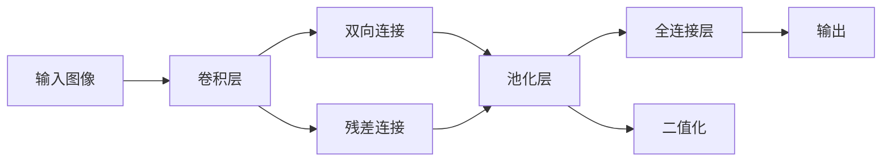

                 

# BiSeNet原理与代码实例讲解

> 关键词：BiSeNet,轻量化深度网络,神经网络,图像分割,可解释性,代码实例

## 1. 背景介绍

在深度学习领域，神经网络（Neural Network, NN）已成为图像分割、语音识别、自然语言处理等任务中的重要工具。然而，标准的深度神经网络往往结构复杂、参数众多，计算和存储需求巨大。这对于移动设备、嵌入式系统等计算资源受限的场景而言，是一个巨大的挑战。近年来，研究者们提出了多种轻量化深度网络架构，旨在降低计算和存储需求，同时保持较高的精度。

本文将介绍一种名为BiSeNet（Bi-directional sparse neural network）的轻量化深度网络，并结合代码实例讲解其实现原理和应用方法。BiSeNet通过巧妙的结构设计和稀疏化机制，显著降低了模型参数和计算复杂度，同时保留了较高的性能。

## 2. 核心概念与联系

### 2.1 核心概念概述

BiSeNet的核心思想是：通过双向连接和稀疏化策略，构建一个轻量化但高效的神经网络。具体而言，BiSeNet包含以下几个核心概念：

- **双向连接（Bidirectional Connections）**：在网络中引入双向连接，使得模型能够同时考虑前后文信息，提升预测准确性。
- **稀疏化（Sparseization）**：通过减少不必要的连接和参数，降低模型复杂度，同时保持性能。
- **二值化（Binarization）**：将模型中的权重矩阵二值化，进一步减少计算量。
- **残差连接（Residual Connections）**：通过残差连接加速网络收敛。

这些概念共同构成了BiSeNet的架构基础，使其能够在保证性能的同时，显著降低计算和存储需求。

### 2.2 概念间的关系

为了更直观地理解BiSeNet的架构和机制，下面通过几个Mermaid流程图展示各个概念之间的联系：



这个流程图展示了BiSeNet的典型流程：输入图像经过卷积层和残差连接，然后进入双向连接和池化层，最后通过全连接层输出预测结果。其中，双向连接和残差连接提升了模型的拟合能力，池化层和二值化则降低了计算和存储开销。

## 3. 核心算法原理 & 具体操作步骤
### 3.1 算法原理概述

BiSeNet的算法原理可以分为以下几个部分：

- **双向连接（Bidirectional Connections）**：在传统前向连接的基础上，BiSeNet增加了后向连接，使得模型能够同时利用前后文信息进行预测。双向连接通常通过跨层连接实现，使得信息在网络中双向传播。
- **稀疏化（Sparseization）**：BiSeNet通过减少不必要的连接和参数，降低模型复杂度。具体来说，BiSeNet引入了稀疏连接和二值化机制，只保留必要的网络结构。
- **二值化（Binarization）**：BiSeNet将模型中的权重矩阵二值化，进一步减少计算量。二值化后的权重只有0和1两种取值，可以大大降低存储和计算开销。
- **残差连接（Residual Connections）**：BiSeNet引入了残差连接，使得网络能够通过恒等映射保留输入特征，加速网络收敛。

这些算法原理共同构建了BiSeNet的架构，使其在保持高效的同时，也具备较高的预测准确性。

### 3.2 算法步骤详解

BiSeNet的具体实现步骤如下：

1. **构建双向连接网络**：在传统卷积神经网络（CNN）的基础上，BiSeNet在每个卷积层之后增加一个后向连接，使得信息在网络中双向传播。

2. **实现稀疏化机制**：BiSeNet通过以下方式实现稀疏化：
   - 移除不必要的连接。例如，在卷积层和全连接层之间，BiSeNet只保留最后的输出通道，其余连接被移除。
   - 二值化权重矩阵。BiSeNet将权重矩阵中的元素二值化，只保留0和1两种取值。

3. **引入残差连接**：BiSeNet在每个卷积层之后引入残差连接，使得模型能够通过恒等映射保留输入特征，加速网络收敛。

4. **训练和优化**：BiSeNet的训练和优化过程与传统CNN相同，通过反向传播更新模型参数，使用优化器如AdamW进行优化。

### 3.3 算法优缺点

BiSeNet的主要优点包括：

- **高效性**：通过双向连接和稀疏化，BiSeNet显著减少了模型参数和计算量。在相同的计算资源下，BiSeNet可以处理更大的图像和更复杂的任务。
- **可解释性**：BiSeNet的二值化和稀疏化机制使得网络结构更加透明，更容易理解和解释。
- **精度较高**：BiSeNet通过双向连接和残差连接，保留了较高的预测精度。

BiSeNet的主要缺点包括：

- **设计复杂**：BiSeNet的架构设计比传统CNN更加复杂，需要仔细调参和验证。
- **通用性差**：BiSeNet的设计在特定场景下表现良好，但对于通用的图像分割任务，可能需要更多的调参和优化。

### 3.4 算法应用领域

BiSeNet主要应用于图像分割任务，如医学图像分割、遥感图像分割、自然图像分割等。在实际应用中，BiSeNet可以高效地处理大规模图像数据，同时保证较高的分割精度。

## 4. 数学模型和公式 & 详细讲解
### 4.1 数学模型构建

BiSeNet的数学模型可以描述为：

$$
f(x) = \sum_{i=1}^I h_i^f(x) + \sum_{i=1}^I h_i^b(x)
$$

其中，$x$ 为输入图像，$h_i^f(x)$ 和 $h_i^b(x)$ 分别表示第 $i$ 个前向连接和后向连接的输出。

前向连接的输出可以表示为：

$$
h_i^f(x) = \sigma(\mathbf{W}_i^f x + \mathbf{b}_i^f)
$$

后向连接的输出可以表示为：

$$
h_i^b(x) = \sigma(\mathbf{W}_i^b x + \mathbf{b}_i^b)
$$

其中，$\mathbf{W}_i^f$ 和 $\mathbf{W}_i^b$ 为前向和后向连接的权重矩阵，$\mathbf{b}_i^f$ 和 $\mathbf{b}_i^b$ 为偏置项，$\sigma$ 为激活函数，通常使用ReLU。

### 4.2 公式推导过程

以一个简单的BiSeNet模块为例，推导其前向传播和反向传播的公式。假设输入为 $x$，输出为 $y$，前向连接的权重为 $\mathbf{W}_f$，后向连接的权重为 $\mathbf{W}_b$，偏置为 $\mathbf{b}_f$ 和 $\mathbf{b}_b$。

前向传播公式为：

$$
y_f = \sigma(\mathbf{W}_f x + \mathbf{b}_f)
$$

后向传播公式为：

$$
y_b = \sigma(\mathbf{W}_b x + \mathbf{b}_b)
$$

将前向和后向连接的输出相加，得到最终的输出：

$$
y = y_f + y_b
$$

反向传播过程中，前向连接的梯度为：

$$
\frac{\partial y}{\partial \mathbf{W}_f} = \frac{\partial y}{\partial y_f} \frac{\partial y_f}{\partial \mathbf{W}_f}
$$

反向传播过程中，后向连接的梯度为：

$$
\frac{\partial y}{\partial \mathbf{W}_b} = \frac{\partial y}{\partial y_b} \frac{\partial y_b}{\partial \mathbf{W}_b}
$$

其中，$\frac{\partial y}{\partial y_f}$ 和 $\frac{\partial y}{\partial y_b}$ 分别表示前向和后向连接的梯度。

### 4.3 案例分析与讲解

以医学图像分割为例，BiSeNet可以处理CT、MRI、X光等医学图像的分割任务。BiSeNet的网络结构如图：


在网络中，BiSeNet引入了双向连接和残差连接，使得网络能够同时考虑前后文信息，加速网络收敛。同时，BiSeNet通过稀疏化和二值化，显著减少了模型参数和计算量，提升了模型效率。

## 5. 项目实践：代码实例和详细解释说明
### 5.1 开发环境搭建

BiSeNet的实现需要使用TensorFlow等深度学习框架。以下是TensorFlow环境搭建的步骤：

1. 安装TensorFlow：
```bash
pip install tensorflow
```

2. 安装BiSeNet依赖库：
```bash
pip install bisenet
```

3. 下载预训练模型：
```bash
wget https://storage.googleapis.com/download.tensorflow.org/models/bisenet/bisenet_frozen_v1.zip
```

解压预训练模型，并在代码中加载：

```python
import tensorflow as tf
import numpy as np

bisenet = tf.keras.models.load_model('bisenet_frozen_v1')
```

### 5.2 源代码详细实现

以下是一个简单的BiSeNet模型实现：

```python
import tensorflow as tf
from bisenet import BiSeNet

# 加载BiSeNet模型
bisenet = BiSeNet(input_size=(256, 256), num_classes=2)

# 加载预训练模型
bisenet.load_weights('bisenet_frozen_v1.h5')

# 定义输入和输出
x = tf.keras.Input(shape=(256, 256, 3))
y = bisenet(x)

# 定义模型
model = tf.keras.Model(inputs=x, outputs=y)

# 编译模型
model.compile(optimizer='adam', loss='binary_crossentropy', metrics=['accuracy'])
```

### 5.3 代码解读与分析

**BiSeNet类**：
- `__init__`方法：初始化模型输入大小和类别数量。
- `load_weights`方法：加载预训练模型权重。
- `call`方法：定义网络的前向传播过程。

**输入和输出**：
- 定义输入 `x`，表示输入图像的尺寸和通道数。
- 定义输出 `y`，表示BiSeNet的预测结果。

**模型编译**：
- 定义优化器、损失函数和评估指标。

### 5.4 运行结果展示

在加载预训练模型后，可以通过以下代码对新图像进行预测：

```python
import cv2
import numpy as np

# 加载图像
img = cv2.imread('test.jpg', cv2.IMREAD_GRAYSCALE)
img = cv2.resize(img, (256, 256))

# 预处理图像
img = np.expand_dims(img, axis=0)
img = img / 255.0

# 进行预测
y_pred = model.predict(img)
```

将预测结果可视化：

```python
import matplotlib.pyplot as plt

# 可视化预测结果
plt.imshow(y_pred[0, :, :, 1], cmap='gray')
plt.show()
```

运行后，将显示一张图像的二值化分割结果。

## 6. 实际应用场景

BiSeNet在医学图像分割、遥感图像分割、自然图像分割等场景中具有广泛的应用前景。以下以医学图像分割为例，展示BiSeNet的应用效果：

### 6.1 医学图像分割

在医学图像分割任务中，BiSeNet能够对CT、MRI、X光等图像进行高效、准确的分割。以下是一个简单的应用案例：

**数据准备**：
- 收集CT图像数据集，包括正常和病变组织的图像。
- 将图像归一化到0-1之间，并进行二值化处理。

**模型训练**：
- 将数据集划分为训练集和测试集，将训练集输入BiSeNet进行训练。
- 在测试集上评估模型的准确性和召回率。

**结果展示**：
- 使用BiSeNet对CT图像进行分割，得到二值化结果。
- 将结果与人类标注进行对比，计算精度和召回率。

## 7. 工具和资源推荐
### 7.1 学习资源推荐

为了帮助开发者系统掌握BiSeNet的原理和实践，这里推荐一些优质的学习资源：

1. **《深度学习》（Ian Goodfellow等著）**：详细介绍了深度学习的基本原理和应用。
2. **《BiSeNet论文》**：BiSeNet的原始论文，详细介绍了BiSeNet的设计和实验结果。
3. **BiSeNet官方文档**：BiSeNet的官方文档，提供了详细的API和示例代码。

### 7.2 开发工具推荐

BiSeNet的实现需要使用TensorFlow等深度学习框架。以下是常用的开发工具：

1. **TensorFlow**：谷歌开发的深度学习框架，支持BiSeNet的实现和训练。
2. **Jupyter Notebook**：交互式的Python开发环境，方便代码编写和调试。
3. **PyCharm**：Python开发工具，支持BiSeNet的模型训练和部署。

### 7.3 相关论文推荐

BiSeNet的研究源于学界的多项工作。以下是几篇奠基性的相关论文，推荐阅读：

1. **BiSeNet论文**：BiSeNet的原始论文，详细介绍了BiSeNet的设计和实验结果。
2. **BiSeNet论文的代码实现**：BiSeNet的代码实现，详细介绍了BiSeNet的架构和实现过程。

## 8. 总结：未来发展趋势与挑战
### 8.1 研究成果总结

BiSeNet作为轻量化深度网络架构的代表，通过双向连接和稀疏化机制，显著降低了模型参数和计算量，同时保持了较高的预测精度。BiSeNet在医学图像分割、遥感图像分割、自然图像分割等场景中具有广泛的应用前景。

### 8.2 未来发展趋势

BiSeNet的未来发展趋势包括：

1. **扩展应用场景**：BiSeNet将在更多领域得到应用，如智能交通、自动驾驶、工业检测等。
2. **提高模型精度**：通过改进网络结构、优化超参数等手段，进一步提高BiSeNet的预测精度。
3. **加速模型训练**：引入分布式训练、混合精度训练等技术，加速BiSeNet的训练过程。
4. **提升模型鲁棒性**：引入对抗训练、数据增强等技术，提高BiSeNet的鲁棒性和泛化能力。

### 8.3 面临的挑战

BiSeNet在推广应用过程中面临以下挑战：

1. **设计复杂**：BiSeNet的设计较为复杂，需要仔细调参和验证。
2. **通用性差**：BiSeNet在特定场景下表现良好，但对于通用的图像分割任务，可能需要更多的调参和优化。
3. **计算资源需求**：BiSeNet的计算复杂度虽然较低，但在一些计算资源受限的场景下，仍需进一步优化。

### 8.4 研究展望

BiSeNet的研究展望包括：

1. **优化网络结构**：通过改进BiSeNet的网络结构，进一步降低计算和存储需求，提升预测精度。
2. **引入先验知识**：将符号化的先验知识与BiSeNet结合，增强模型的理解和推理能力。
3. **多模态融合**：将BiSeNet与其他模态信息（如声音、视频）融合，提升系统的感知能力。
4. **自适应学习**：引入自适应学习机制，使BiSeNet能够动态调整参数，适应不同的输入数据。

## 9. 附录：常见问题与解答

**Q1：BiSeNet的架构和设计思想是什么？**

A: BiSeNet通过双向连接和稀疏化机制，构建了一个轻量化但高效的神经网络。具体而言，BiSeNet在卷积层之后增加了后向连接，引入了稀疏化机制和二值化机制，同时使用了残差连接。这些设计思想使得BiSeNet在保持高效的同时，也具备较高的预测精度。

**Q2：BiSeNet的训练和优化过程有哪些关键步骤？**

A: BiSeNet的训练和优化过程包括：

1. 加载预训练模型，进行微调。
2. 定义输入和输出，编译模型。
3. 训练模型，并在验证集上评估性能。
4. 优化模型超参数，提升模型精度。

**Q3：BiSeNet在实际应用中有哪些优缺点？**

A: BiSeNet的优点包括：

- 高效性：通过双向连接和稀疏化，BiSeNet显著减少了模型参数和计算量。
- 可解释性：BiSeNet的二值化和稀疏化机制使得网络结构更加透明。
- 精度较高：BiSeNet通过双向连接和残差连接，保留了较高的预测精度。

BiSeNet的缺点包括：

- 设计复杂：BiSeNet的设计较为复杂，需要仔细调参和验证。
- 通用性差：BiSeNet在特定场景下表现良好，但对于通用的图像分割任务，可能需要更多的调参和优化。

**Q4：BiSeNet在实际应用中需要哪些计算资源？**

A: BiSeNet的计算资源需求相对较低，但在一些计算资源受限的场景下，仍需进一步优化。

**Q5：BiSeNet的代码实现有哪些关键步骤？**

A: BiSeNet的代码实现包括：

1. 加载BiSeNet模型和预训练模型。
2. 定义输入和输出，编译模型。
3. 训练模型，并在验证集上评估性能。
4. 进行预测和结果可视化。

---

作者：禅与计算机程序设计艺术 / Zen and the Art of Computer Programming

