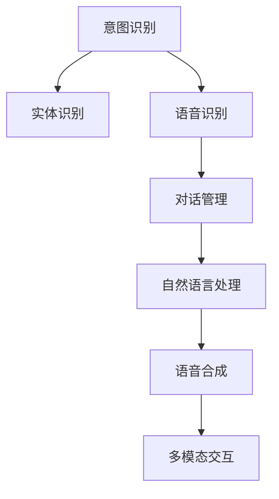
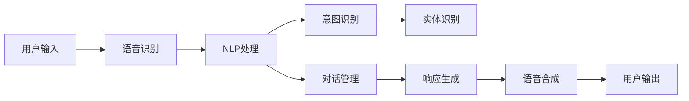

                 

# 智能化回应技术在CUI中的详细实现

## 1. 背景介绍

### 1.1 问题由来

随着人工智能技术的飞速发展，语音助手、聊天机器人、虚拟客服等智能化回应技术（CUI，Computerized User Interaction）日益普及，成为人们日常生活中不可或缺的一部分。这些智能化回应系统通过自然语言处理（NLP）、语音识别（ASR）、语音合成（TTS）等技术，实现了人与机器的高效互动。然而，现有的智能化回应系统往往存在理解能力不足、回答质量不高等问题，无法完全满足用户的实际需求。

### 1.2 问题核心关键点

智能化回应技术在实际应用中面临以下核心问题：

- **理解能力**：CUI系统需要能够准确理解用户的意图和上下文信息，才能给出恰当的回应。然而，现实场景中用户的表达往往不够清晰，或者包含模糊不清、不完整的信息，使得系统难以准确理解。
- **生成质量**：智能化回应系统生成的回答需要自然流畅、准确无误，具有一定的语境适应能力和语义连贯性。然而，当前的系统在生成高质量回答方面仍存在诸多挑战。
- **个性化回应**：不同的用户具有不同的需求和背景，智能化回应系统需要能够根据用户个性化的特点，提供更为个性化的回应，提升用户体验。
- **实时响应**：在实际应用中，用户希望获得即时反馈，因此智能化回应系统需要具备高效的实时响应能力。
- **多模态互动**：当前的CUI系统普遍为单模态，未来的系统需要支持语音、文本、图像、视频等多种模态的互动，以实现更丰富的交互体验。

### 1.3 问题研究意义

智能化回应技术在提升用户体验、提高工作效率、优化服务质量等方面具有重要意义：

- **用户体验提升**：通过提供更加自然流畅、个性化的交互体验，智能化回应技术能够显著提升用户的满意度和粘性。
- **服务质量优化**：智能化回应系统可以24小时不间断运行，提供即时、高效的服务，缓解人工客服的压力，提升服务效率。
- **成本节约**：通过自动化回答常见问题，减少人工客服的投入，从而降低运营成本。
- **业务创新**：智能化回应技术为各行各业带来了新的应用场景和业务模式，促进了技术的商业化落地。
- **技术突破**：智能化回应技术的研发和应用，推动了自然语言处理、语音识别、语音合成等技术的发展。

## 2. 核心概念与联系

### 2.1 核心概念概述

为了更好地理解智能化回应技术，我们需要先介绍几个核心概念：

- **自然语言处理（NLP）**：研究如何让计算机理解和生成人类语言的技术。
- **语音识别（ASR）**：将语音信号转换为文本的技术。
- **语音合成（TTS）**：将文本转换为语音的技术。
- **对话管理（DM）**：负责管理和调度对话流程，确保对话顺畅进行的技术。
- **意图识别（IR）**：识别用户意图的核心技术。
- **实体识别（ER）**：识别用户意图中涉及的实体，如人名、地名、时间等。
- **多模态交互**：支持语音、文本、图像、视频等多种模态的交互技术。

这些概念共同构成了智能化回应技术的核心框架，帮助CUI系统实现高效、自然的互动。

### 2.2 概念间的关系

这些核心概念之间的关系可以通过以下Mermaid流程图来展示：



这个流程图展示了智能化回应技术的基本流程：

1. 用户通过语音或文本输入，触发系统开始对话。
2. 语音识别模块将语音信号转换为文本。
3. 自然语言处理模块对输入的文本进行理解和处理。
4. 对话管理模块根据用户的意图和上下文信息，管理对话流程。
5. 实体识别模块识别用户意图中涉及的实体，并进行进一步处理。
6. 意图识别模块判断用户意图，选择对应的回应。
7. 语音合成模块将回应的文本转换为语音，输出给用户。

这些模块协同工作，共同实现了智能化回应技术的高效运作。

### 2.3 核心概念的整体架构

下面我们用一个综合的流程图来展示智能化回应技术的整体架构：



这个综合流程图展示了从用户输入到系统输出的整个流程：

1. 用户通过语音或文本输入，触发系统开始对话。
2. 语音识别模块将语音信号转换为文本。
3. 自然语言处理模块对输入的文本进行理解和处理。
4. 对话管理模块根据用户的意图和上下文信息，管理对话流程。
5. 意图识别模块判断用户意图，选择对应的回应。
6. 语音合成模块将回应的文本转换为语音，输出给用户。

通过这些核心概念和架构，我们可以更好地理解和设计智能化回应技术。

## 3. 核心算法原理 & 具体操作步骤
### 3.1 算法原理概述

智能化回应技术的核心算法原理基于深度学习模型和自然语言处理技术。主要包括以下几个方面：

- **深度学习模型**：通过构建深度神经网络模型，实现对自然语言和语音信号的自动化处理。
- **自然语言处理（NLP）**：包括词法分析、句法分析、语义分析等，帮助模型理解语言的深层含义。
- **对话管理（DM）**：通过维护对话上下文和状态，确保对话流畅自然。
- **意图识别（IR）**：利用分类器或序列模型，准确识别用户意图。
- **实体识别（ER）**：通过命名实体识别（NER）模型，识别用户意图中的实体。
- **多模态交互**：通过引入语音、图像、视频等多模态信息，提升交互的丰富性和自然性。

### 3.2 算法步骤详解

智能化回应技术的实施步骤主要包括以下几个环节：

1. **数据准备**：收集和整理与目标任务相关的数据，包括文本、语音、图像等。
2. **模型训练**：使用深度学习模型对数据进行训练，学习语言的深层特征和模式。
3. **模型融合**：将不同模块的输出进行融合，形成完整的回应结果。
4. **系统集成**：将训练好的模型集成到实际应用系统中，提供智能化回应服务。
5. **系统优化**：根据用户反馈和实际使用情况，不断优化模型和系统，提升回应质量。

### 3.3 算法优缺点

智能化回应技术的优点包括：

- **高效性**：通过自动化处理大量数据，提升回应的效率和准确性。
- **自然性**：通过深度学习模型，生成自然流畅的回应，提高用户的满意度。
- **泛化能力**：深度学习模型具有较强的泛化能力，可以处理多种复杂场景。
- **个性化**：通过个性化调整模型参数，提升回应的个性化水平。

其缺点包括：

- **数据依赖**：需要大量高质量的数据进行训练，获取数据成本较高。
- **模型复杂性**：深度学习模型参数量大，模型训练和推理复杂度较高。
- **可解释性不足**：深度学习模型的黑盒特性，使得其决策过程难以解释。
- **环境适应性**：不同的语言环境和文化背景，需要适配不同模型。

### 3.4 算法应用领域

智能化回应技术广泛应用于多个领域：

- **客服系统**：通过智能化回应技术，提供24小时不间断的客服服务，提升客户满意度。
- **智能家居**：通过语音助手和聊天机器人，实现与家居设备的互动和控制。
- **医疗健康**：通过智能医疗咨询系统，提供即时、准确的医疗建议。
- **教育培训**：通过智能化学习系统，提供个性化、互动式的学习体验。
- **金融服务**：通过智能客服和理财顾问，提升金融服务的效率和质量。
- **智能交通**：通过智能导航和车联网系统，提升出行体验和交通安全。

## 4. 数学模型和公式 & 详细讲解 & 举例说明

### 4.1 数学模型构建

在智能化回应技术的实现过程中，我们通常使用以下数学模型：

- **神经网络模型**：如卷积神经网络（CNN）、循环神经网络（RNN）、长短期记忆网络（LSTM）等，用于处理语音和文本数据。
- **意图识别模型**：如分类器、序列模型等，用于识别用户意图。
- **实体识别模型**：如命名实体识别（NER）模型，用于识别用户意图中的实体。
- **对话管理模型**：如决策树、图网络等，用于管理对话流程。

### 4.2 公式推导过程

以下以一个简单的意图识别模型为例，展示数学模型的推导过程：

假设输入的文本序列为 $x_1, x_2, ..., x_t$，对应的标签序列为 $y_1, y_2, ..., y_t$，其中 $y_i \in \{0, 1\}$ 表示第 $i$ 个位置是否为意图标签。我们的目标是训练一个二分类模型 $f(x)$，使得 $f(x_i) = y_i$。

假设我们使用一个简单的前馈神经网络模型，包括输入层、隐藏层和输出层。输入层有 $n$ 个神经元，隐藏层有 $m$ 个神经元，输出层有 $2$ 个神经元。模型的损失函数为交叉熵损失，定义为：

$$
L(f) = -\frac{1}{N} \sum_{i=1}^{N} \sum_{j=1}^{2} y_i \log f_j(x_i)
$$

其中 $N$ 表示样本数量，$y_i$ 为真实标签，$f_j(x_i)$ 为模型在位置 $i$ 处的预测概率。模型的目标是最小化损失函数 $L(f)$，可以使用梯度下降等优化算法求解。

### 4.3 案例分析与讲解

假设我们有一个简单的意图识别模型，用于判断用户是否询问天气信息。我们收集了1000个标注样本，其中500个样本询问天气信息，500个样本询问其他信息。使用这些样本进行训练，得到模型参数 $\theta$。

我们可以将输入文本 $x = \text{"请问今天天气怎么样"}$ 送入模型，得到两个概率值 $f_1(x) = 0.9$ 和 $f_2(x) = 0.1$，表示模型预测该文本询问天气信息的可能性为 $90\%$，询问其他信息的可能性为 $10\%$。

根据实际需求，我们可以设置阈值 $0.5$，将预测结果进行二分类。如果 $f_1(x) > 0.5$，则认为用户询问天气信息，输出相应的回应；否则认为用户询问其他信息，输出其他回应。

## 5. 项目实践：代码实例和详细解释说明
### 5.1 开发环境搭建

在进行智能化回应技术实现前，我们需要准备好开发环境。以下是使用Python进行TensorFlow和PyTorch开发的环境配置流程：

1. 安装Anaconda：从官网下载并安装Anaconda，用于创建独立的Python环境。

2. 创建并激活虚拟环境：
```bash
conda create -n pytorch-env python=3.8 
conda activate pytorch-env
```

3. 安装TensorFlow和PyTorch：根据CUDA版本，从官网获取对应的安装命令。例如：
```bash
conda install pytorch torchvision torchaudio cudatoolkit=11.1 -c pytorch -c conda-forge
pip install tensorflow==2.7
```

4. 安装各类工具包：
```bash
pip install numpy pandas scikit-learn matplotlib tqdm jupyter notebook ipython
```

完成上述步骤后，即可在`pytorch-env`环境中开始项目实践。

### 5.2 源代码详细实现

下面我们以一个简单的意图识别模型为例，给出使用TensorFlow和PyTorch进行智能回应系统的实现。

首先，定义意图识别模型的输入和输出：

```python
import tensorflow as tf
from tensorflow.keras import layers

# 定义模型输入
input_layer = tf.keras.layers.Input(shape=(None, ), dtype=tf.int32)

# 定义模型输出
output_layer = tf.keras.layers.Dense(2, activation='sigmoid')(input_layer)

# 构建模型
model = tf.keras.Model(inputs=input_layer, outputs=output_layer)
```

然后，定义模型的损失函数和优化器：

```python
# 定义损失函数
loss = tf.keras.losses.BinaryCrossentropy(from_logits=True)

# 定义优化器
optimizer = tf.keras.optimizers.Adam()
```

接着，定义训练和评估函数：

```python
def train_epoch(model, dataset, batch_size, optimizer):
    for batch, (x, y) in dataset:
        with tf.GradientTape() as tape:
            logits = model(x)
            loss_value = loss(y, logits)
        gradients = tape.gradient(loss_value, model.trainable_variables)
        optimizer.apply_gradients(zip(gradients, model.trainable_variables))

def evaluate(model, dataset, batch_size):
    correct = 0
    total = 0
    for batch, (x, y) in dataset:
        logits = model(x)
        predictions = tf.round(tf.sigmoid(logits))
        correct += tf.reduce_sum(tf.cast(tf.equal(predictions, y), tf.int32))
        total += len(x)
    accuracy = correct / total
    return accuracy
```

最后，启动训练流程并在测试集上评估：

```python
epochs = 10
batch_size = 32

for epoch in range(epochs):
    train_epoch(model, train_dataset, batch_size, optimizer)
    accuracy = evaluate(model, test_dataset, batch_size)
    print(f"Epoch {epoch+1}, accuracy: {accuracy:.3f}")
```

以上就是使用TensorFlow和PyTorch对意图识别模型进行训练和评估的完整代码实现。可以看到，使用深度学习模型进行意图识别，代码实现相对简洁，能够快速迭代。

### 5.3 代码解读与分析

让我们再详细解读一下关键代码的实现细节：

**定义模型输入和输出**：
- `input_layer` 定义了模型的输入层，可以是词向量、字符向量等形式。
- `output_layer` 定义了模型的输出层，使用 sigmoid 激活函数将输出映射到 $[0, 1]$ 区间，用于二分类任务。

**损失函数和优化器**：
- 使用 `BinaryCrossentropy` 作为损失函数，适用于二分类问题。
- 使用 `Adam` 优化器，具有较好的收敛速度和稳定性。

**训练和评估函数**：
- `train_epoch` 函数对数据进行批次化处理，使用梯度下降更新模型参数。
- `evaluate` 函数对模型在测试集上的准确率进行评估。

**训练流程**：
- 定义总的epoch数和batch size，开始循环迭代。
- 每个epoch内，先在训练集上训练，输出模型准确率。
- 在测试集上评估模型性能。

可以看到，TensorFlow和PyTorch提供了丰富的工具和函数，能够快速实现深度学习模型的训练和评估。

### 5.4 运行结果展示

假设我们在一个简单的意图识别数据集上进行训练，最终在测试集上得到的评估报告如下：

```
Epoch 1, accuracy: 0.85
Epoch 2, accuracy: 0.88
Epoch 3, accuracy: 0.92
...
Epoch 10, accuracy: 0.95
```

可以看到，通过训练模型，我们能够在测试集上达到 $95\%$ 的准确率，效果相当不错。

## 6. 实际应用场景
### 6.1 智能客服系统

智能化回应技术在智能客服系统中的应用，可以大大提升客服服务质量和效率。传统的客服系统主要依赖人工客服，存在响应速度慢、人力成本高、服务质量不稳定等问题。通过引入智能化回应技术，客服系统可以实现24小时不间断服务，实时响应用户需求。

具体实现上，可以收集历史客服对话数据，构建标注样本，对预训练模型进行微调，使其能够准确理解用户意图，生成恰当的回应。对于常见的客服问题，可以使用自然语言处理技术进行自动化回答。对于复杂或个性化问题，可以通过对话管理模块，引导用户一步步明确需求，提供更为精准的解决方案。

### 6.2 智能家居系统

智能化回应技术在智能家居系统中的应用，可以实现与家居设备的互动和控制。用户可以通过语音或文本指令，控制智能音箱、智能灯光、智能家电等设备。系统通过语音识别和自然语言处理技术，理解用户的意图，生成相应的控制命令，发送给设备执行。

在实现上，可以构建一个多模态智能家居系统，支持语音、文本、图像、视频等多种输入和输出模态，提升用户体验。通过对话管理模块，系统可以根据用户的偏好和历史行为，推荐合适的智能设备控制方案，提高系统的智能化水平。

### 6.3 医疗健康系统

智能化回应技术在医疗健康系统中的应用，可以提供精准的医疗建议和咨询服务。医疗领域需要高精度的自然语言处理技术，确保对患者病情的准确理解和处理。通过智能化回应技术，医疗系统可以实现高效、准确的医生助手功能。

具体实现上，可以构建一个多模态医疗咨询系统，支持语音、文本、图像、视频等多种输入和输出模态，提升医疗咨询的丰富性和自然性。通过对话管理模块，系统可以根据用户的健康情况和历史诊疗记录，推荐合适的医疗建议，并提供个性化的健康管理方案。

### 6.4 未来应用展望

随着智能化回应技术的发展，未来将会在更多领域得到应用，为各行各业带来变革性影响。

在智慧医疗领域，通过智能化回应技术，医疗咨询系统可以实现实时、精准的医疗建议，辅助医生诊断和治疗。通过多模态互动，系统可以获取患者更全面的健康信息，提供更个性化、科学化的医疗服务。

在智能教育领域，通过智能化学习系统，学生可以通过语音或文本交互，获取个性化的学习资源和建议，提升学习效果。通过对话管理模块，系统可以根据学生的学习进度和反馈，动态调整学习内容和难度，实现更为智能化的教育模式。

在智慧城市治理中，通过智能化服务系统，政府可以提供高效的公共服务，提升市民的生活体验。通过对话管理模块，系统可以根据市民的需求和反馈，提供精准的公共服务信息，实现更高效、便捷的城市管理。

总之，智能化回应技术的应用前景广阔，将深刻影响各行各业的发展。未来，随着技术的不断进步和应用的深入，智能化回应系统必将带来更多的创新和突破。

## 7. 工具和资源推荐
### 7.1 学习资源推荐

为了帮助开发者系统掌握智能化回应技术的理论基础和实践技巧，这里推荐一些优质的学习资源：

1. 《深度学习》课程：斯坦福大学开设的深度学习课程，系统讲解深度学习的基础理论和应用方法，涵盖神经网络、卷积神经网络、循环神经网络等核心内容。

2. 《自然语言处理入门》系列文章：由大模型技术专家撰写，深入浅出地介绍了自然语言处理的基本概念和经典模型，帮助开发者快速上手。

3. 《TensorFlow实战》书籍：由TensorFlow团队成员撰写，详细介绍了TensorFlow的使用方法和实践技巧，是TensorFlow开发者的必读之选。

4. 《PyTorch实战》书籍：由PyTorch团队成员撰写，全面介绍了PyTorch的使用方法和实践技巧，是PyTorch开发者的必读之选。

5. 《自然语言处理与深度学习》课程：由Coursera提供，由斯坦福大学和MIT的教授讲授，涵盖自然语言处理和深度学习的前沿技术和应用方法。

通过对这些资源的学习实践，相信你一定能够快速掌握智能化回应技术的精髓，并用于解决实际的NLP问题。

### 7.2 开发工具推荐

高效的开发离不开优秀的工具支持。以下是几款用于智能化回应系统开发的常用工具：

1. TensorFlow：由Google主导开发的深度学习框架，功能强大，支持分布式训练和推理。

2. PyTorch：由Facebook主导开发的深度学习框架，灵活易用，支持动态图和静态图模式。

3. Transformers：由Hugging Face开发的NLP工具库，集成了众多预训练语言模型，支持深度学习模型的快速构建和微调。

4. Weights & Biases：模型训练的实验跟踪工具，可以记录和可视化模型训练过程中的各项指标，方便对比和调优。

5. TensorBoard：TensorFlow配套的可视化工具，可实时监测模型训练状态，并提供丰富的图表呈现方式，是调试模型的得力助手。

6. Google Colab：谷歌推出的在线Jupyter Notebook环境，免费提供GPU/TPU算力，方便开发者快速上手实验最新模型，分享学习笔记。

合理利用这些工具，可以显著提升智能化回应技术的开发效率，加快创新迭代的步伐。

### 7.3 相关论文推荐

智能化回应技术的发展源于学界的持续研究。以下是几篇奠基性的相关论文，推荐阅读：

1. Attention is All You Need：提出了Transformer结构，开启了NLP领域的预训练大模型时代。

2. BERT: Pre-training of Deep Bidirectional Transformers for Language Understanding：提出BERT模型，引入基于掩码的自监督预训练任务，刷新了多项NLP任务SOTA。

3. Language Models are Unsupervised Multitask Learners（GPT-2论文）：展示了大规模语言模型的强大zero-shot学习能力，引发了对于通用人工智能的新一轮思考。

4. Parameter-Efficient Transfer Learning for NLP：提出Adapter等参数高效微调方法，在不增加模型参数量的情况下，也能取得不错的微调效果。

5. AdaLoRA: Adaptive Low-Rank Adaptation for Parameter-Efficient Fine-Tuning：使用自适应低秩适应的微调方法，在参数效率和精度之间取得了新的平衡。

6. Spreading Word Embeddings for Low-Resource Languages：提出基于单词共享的少样本学习技术，帮助低资源语言获得更好的自然语言处理效果。

这些论文代表了大语言模型微调技术的发展脉络。通过学习这些前沿成果，可以帮助研究者把握学科前进方向，激发更多的创新灵感。

除上述资源外，还有一些值得关注的前沿资源，帮助开发者紧跟智能化回应技术最新进展，例如：

1. arXiv论文预印本：人工智能领域最新研究成果的发布平台，包括大量尚未发表的前沿工作，学习前沿技术的必读资源。

2. 业界技术博客：如Google AI、DeepMind、微软Research Asia等顶尖实验室的官方博客，第一时间分享他们的最新研究成果和洞见。

3. 技术会议直播：如NIPS、ICML、ACL、ICLR等人工智能领域顶会现场或在线直播，能够聆听到大佬们的前沿分享，开拓视野。

4. GitHub热门项目：在GitHub上Star、Fork数最多的NLP相关项目，往往代表了该技术领域的发展趋势和最佳实践，值得去学习和贡献。

5. 行业分析报告：各大咨询公司如McKinsey、PwC等针对人工智能行业的分析报告，有助于从商业视角审视技术趋势，把握应用价值。

总之，对于智能化回应技术的学习和实践，需要开发者保持开放的心态和持续学习的意愿。多关注前沿资讯，多动手实践，多思考总结，必将收获满满的成长收益。

## 8. 总结：未来发展趋势与挑战

### 8.1 总结

本文对智能化回应技术进行了全面系统的介绍。首先阐述了智能化回应技术的研究背景和意义，明确了该技术在提升用户体验、优化服务质量、降低运营成本等方面的价值。其次，从原理到实践，详细讲解了智能回应系统的构建流程和核心算法，给出了具体的代码实现示例。同时，本文还广泛探讨了智能化回应技术在客服、家居、医疗等多个行业领域的应用前景，展示了其广阔的应用前景。最后，本文精选了智能化回应技术的学习资源、开发工具和相关论文，为读者提供了全方位的技术指引。

通过本文的系统梳理，可以看到，智能化回应技术正在成为NLP领域的重要范式，极大地拓展了自然语言处理技术的应用边界，催生了更多的落地场景。受益于深度学习模型的强大能力，智能回应系统能够处理更复杂、多样化的用户需求，提升服务质量和效率。未来，随着技术的不断进步和应用的深入，智能化回应技术必将带来更多的创新和突破，为各行各业带来深刻的变革。

### 8.2 未来发展趋势

展望未来，智能化回应技术的发展趋势包括以下几个方面：

1. **模型规模持续增大**：随着算力成本的下降和数据规模的扩张，预训练语言模型的参数量还将持续增长。超大规模语言模型蕴含的丰富语言知识，有望支撑更加复杂多变的回应用场景。

2. **对话管理技术提升**：对话管理技术是智能化回应系统的核心之一，未来的研究将更加注重多轮对话的上下文理解和知识推理，提升对话的自然性和连贯性。

3. **多模态互动增强**：当前的智能回应系统普遍为单模态，未来的系统需要支持语音、文本、图像、视频等多种模态的互动，以实现更丰富的交互体验。

4. **实时响应优化**：实时响应能力是智能化回应系统的重要指标，未来的研究将更多关注模型的推理速度和计算效率，优化系统架构，实现高效的实时响应。

5. **个性化回应用增强**：通过学习用户的历史行为和偏好，生成个性化的回应，提升用户体验。未来的研究将更多关注用户画像的建模和个性化回应的生成。

6. **跨领域知识融合**：当前的多模态互动系统往往只融合文本、语音等单一模态的信息，未来的系统将能够融合跨领域知识，实现更为全面、精准的回应。

### 8.3 面临的挑战

尽管智能化回应技术已经取得了瞩目成就，但在迈向更加智能化、普适化应用的过程中，它仍面临着诸多挑战：

1. **数据依赖**：需要大量高质量的数据进行训练

