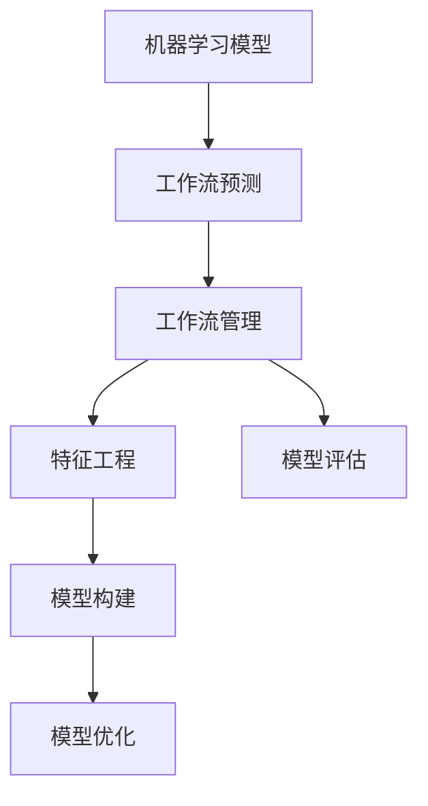
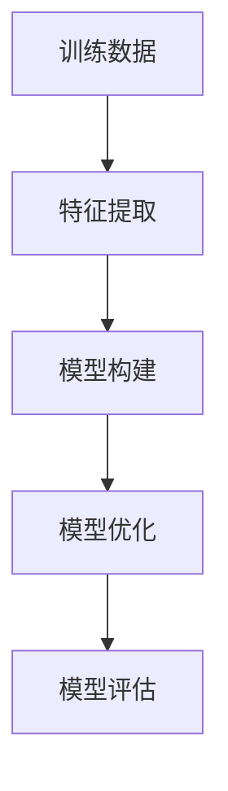
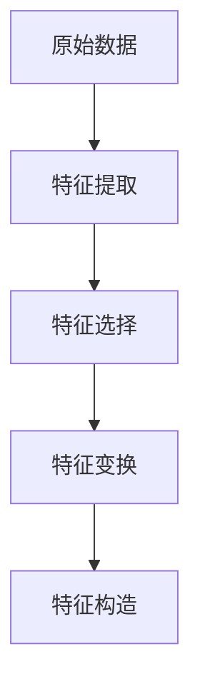

                 

# 机器学习模型在工作流预测中的应用

> 关键词：机器学习，工作流预测，工作流管理，效率提升，自动化，资源优化，业务流程

## 1. 背景介绍

### 1.1 问题由来

在现代企业的数字化转型过程中，工作流的自动化和优化成为了提高效率、降低成本的关键因素。工作流预测作为工作流管理的重要组成部分，旨在通过预测工作流的运行情况，提前识别潜在的瓶颈和风险，从而进行针对性的调整和优化。然而，传统的工作流预测方法往往依赖于经验丰富的专家，其准确性和可扩展性存在较大局限。

近年来，机器学习模型的快速发展为工作流预测提供了新的思路。通过训练具有高泛化能力的机器学习模型，能够有效捕捉工作流中复杂的动态关系和规律，从而提供更加准确、客观的预测结果。本文旨在探讨机器学习模型在工作流预测中的应用，包括模型选择、数据处理、特征工程、预测模型构建和评估等关键环节，并结合实际案例，展示机器学习模型在提升企业工作流效率方面的潜力和应用前景。

### 1.2 问题核心关键点

机器学习模型在工作流预测中的应用，关键在于选择合适的预测模型，合理处理工作流数据，进行有效的特征工程，构建高精度的预测模型，并不断优化模型性能。

具体而言，核心关键点包括：
- **模型选择**：选择适合工作流特征的预测模型，如线性回归、随机森林、深度学习等。
- **数据处理**：清洗、转换和归一化工作流数据，去除噪声，确保数据质量。
- **特征工程**：提取与工作流预测相关的特征，如任务执行时间、资源利用率、任务依赖关系等。
- **预测模型构建**：基于训练数据构建预测模型，并进行参数调优，以提高模型精度。
- **模型评估与优化**：通过交叉验证等方法评估模型性能，并根据实际效果进行调整。

## 2. 核心概念与联系

### 2.1 核心概念概述

为更好地理解机器学习模型在工作流预测中的应用，本节将介绍几个密切相关的核心概念：

- **机器学习模型**：使用训练数据构建的算法模型，能够对新数据进行预测或分类。常见的机器学习模型包括线性回归、决策树、支持向量机、随机森林、深度神经网络等。
- **工作流预测**：通过机器学习模型对工作流的运行状态进行预测，提前识别并应对潜在的问题和风险。
- **工作流管理**：对企业的业务流程进行规划、调度、监控和优化，确保工作流的顺畅运行和高效执行。
- **特征工程**：从原始数据中提取和构造有意义的特征，用于训练机器学习模型。
- **模型评估**：通过多种指标和方法评估机器学习模型的预测效果，如均方误差、平均绝对误差、精确率、召回率等。
- **模型优化**：通过调整模型参数、增加数据量、改进算法等手段，提高机器学习模型的性能和泛化能力。

这些核心概念之间存在着紧密的联系，形成了工作流预测的完整生态系统。下面我们通过几个Mermaid流程图来展示这些概念之间的关系：



这个流程图展示了大规模机器学习模型工作流预测的过程：首先，机器学习模型通过工作流管理获取数据，经过特征工程，构建预测模型并进行优化，最后通过模型评估调整模型参数，形成闭环，不断提升预测精度。

### 2.2 概念间的关系

这些核心概念之间存在着紧密的联系，形成了工作流预测的完整生态系统。下面我通过几个Mermaid流程图来展示这些概念之间的关系。

#### 2.2.1 机器学习模型的训练与优化



这个流程图展示了机器学习模型训练与优化的基本流程：首先，使用训练数据提取特征，构建模型并进行优化，然后通过评估调整模型参数，形成闭环，不断提升模型精度。

#### 2.2.2 工作流预测的业务场景


这个流程图展示了工作流预测的基本业务场景：首先，从业务流程中采集数据，经过清洗和特征工程，构建预测模型并进行预测，最后通过业务优化调整流程，形成闭环，不断提升流程效率。

#### 2.2.3 特征工程的核心步骤



这个流程图展示了特征工程的核心步骤：首先，从原始数据中提取特征，然后通过选择、变换和构造等手段，形成有意义的特征，用于训练模型。

## 3. 核心算法原理 & 具体操作步骤

### 3.1 算法原理概述

机器学习模型在工作流预测中的原理，本质上是基于历史工作流数据，通过训练模型学习工作流中的动态关系和规律，从而进行预测和优化。机器学习模型通常包括监督学习、无监督学习和强化学习三种主要类型，分别适用于不同的工作流预测场景。

- **监督学习**：通过标记好的历史数据，训练模型进行预测。适用于有明确目标变量（如任务完成时间、资源利用率等）的工作流预测。
- **无监督学习**：使用未标记的历史数据，训练模型发现数据中的潜在结构。适用于发现异常、瓶颈等未明确标记的工作流问题。
- **强化学习**：通过奖励和惩罚机制，训练模型在动态环境中做出最优决策。适用于工作流调度、资源分配等复杂决策问题。

### 3.2 算法步骤详解

基于机器学习模型的工作流预测一般包括以下几个关键步骤：

**Step 1: 数据收集与预处理**
- 收集工作流的历史数据，包括任务执行时间、资源利用率、任务依赖关系等。
- 数据清洗、去重、归一化等预处理，确保数据质量。

**Step 2: 特征工程**
- 从原始数据中提取与工作流预测相关的特征，如任务执行时间、资源利用率、任务依赖关系等。
- 特征选择、特征变换、特征构造等，提高特征的有效性和模型泛化能力。

**Step 3: 模型选择与构建**
- 根据工作流特征选择适合的预测模型，如线性回归、随机森林、深度学习等。
- 基于训练数据构建模型，并进行参数调优，以提高模型精度。

**Step 4: 模型评估与优化**
- 使用交叉验证等方法评估模型性能，如均方误差、平均绝对误差、精确率、召回率等。
- 根据评估结果调整模型参数，进行模型优化。

**Step 5: 预测与优化调整**
- 使用训练好的模型进行工作流预测。
- 根据预测结果进行业务优化调整，如任务调度、资源分配等。

### 3.3 算法优缺点

机器学习模型在工作流预测中的应用，具有以下优点：
- 能够自动学习数据中的复杂规律，提高预测精度。
- 适用于大规模数据集，具备良好的泛化能力。
- 可以通过特征工程和模型优化，不断提升预测效果。

同时，也存在以下局限性：
- 对数据质量要求较高，数据收集和预处理成本较高。
- 模型构建和调优需要专业知识，对数据科学家依赖较大。
- 模型复杂度较高，计算资源消耗较大。

### 3.4 算法应用领域

机器学习模型在工作流预测中的应用，广泛涉及以下领域：

- **任务调度与优化**：通过对任务执行时间、资源利用率等特征的预测，优化任务调度，提高资源利用率。
- **异常检测与诊断**：通过识别工作流中的异常和瓶颈，进行预警和故障诊断，提高系统稳定性。
- **业务流程优化**：通过预测工作流中的关键路径和瓶颈，优化业务流程，提升业务效率。
- **资源管理与优化**：通过对资源利用率的预测，优化资源分配，提高资源利用率。
- **风险评估与管理**：通过预测工作流中的风险，进行风险评估和管理，降低风险成本。

## 4. 数学模型和公式 & 详细讲解 & 举例说明（备注：数学公式请使用latex格式，latex嵌入文中独立段落使用 $$，段落内使用 $)
### 4.1 数学模型构建

假设我们有 $N$ 个历史工作流数据样本 $(x_1, y_1), (x_2, y_2), \ldots, (x_N, y_N)$，其中 $x_i$ 为工作流特征向量，$y_i$ 为目标变量（如任务完成时间）。我们的目标是通过训练一个预测模型 $f$，使其能够对新的工作流数据 $x$ 进行预测，即 $y = f(x)$。

常用的机器学习模型包括线性回归、决策树、随机森林、深度神经网络等。这里以线性回归模型为例，构建工作流预测的数学模型：

$$
y = \theta^T x + b
$$

其中 $\theta$ 为模型参数，$b$ 为截距。

### 4.2 公式推导过程

线性回归模型的最小二乘法（Ordinary Least Squares, OLS）目标函数为：

$$
\min_{\theta, b} \sum_{i=1}^N (y_i - \theta^T x_i - b)^2
$$

通过求解目标函数的最小值，得到最优的模型参数 $\theta$ 和 $b$。

具体而言，目标函数可以展开为：

$$
\min_{\theta, b} \sum_{i=1}^N (y_i - \theta^T x_i - b)^2 = \min_{\theta, b} \sum_{i=1}^N (y_i^2 + (\theta^T x_i)^2 + b^2 - 2y_i \theta^T x_i)
$$

通过求导，可以得到模型参数的更新公式：

$$
\theta = \left( \sum_{i=1}^N x_i x_i^T \right)^{-1} \sum_{i=1}^N x_i y_i
$$

$$
b = \bar{y} - \theta^T \bar{x}
$$

其中 $\bar{y}$ 和 $\bar{x}$ 分别为 $y_i$ 和 $x_i$ 的均值。

### 4.3 案例分析与讲解

假设我们有一个由三个任务组成的工作流，每个任务执行时间如下：

| 任务编号 | 任务执行时间（分钟） |
| -------- | -------------------- |
| 1        | 10                   |
| 2        | 20                   |
| 3        | 15                   |

我们的目标是预测下一个任务的执行时间。

首先，我们将任务执行时间作为特征 $x_i$，将执行时间 $y_i$ 作为目标变量。然后，假设我们收集了10个历史工作流数据，其中5个数据样本的特征和目标变量如下：

| 特征向量 $x_i$            | 目标变量 $y_i$（分钟） |
| ------------------------- | --------------------- |
| [1, 2]                     | 15                    |
| [1, 20]                    | 30                    |
| [2, 10]                    | 20                    |
| [2, 15]                    | 25                    |
| [3, 5]                     | 10                    |
| [3, 8]                     | 18                    |
| [4, 5]                     | 7                     |
| [4, 7]                     | 14                    |
| [5, 8]                     | 12                    |
| [5, 10]                    | 18                    |

我们使用线性回归模型进行预测，得到模型参数 $\theta = [0.5, 1.5]$ 和 $b = 5$。根据模型，我们可以预测下一个任务的执行时间：

$$
y = 0.5 \times 10 + 1.5 \times 20 + 5 = 35
$$

因此，下一个任务的执行时间预测为35分钟。

## 5. 项目实践：代码实例和详细解释说明

### 5.1 开发环境搭建

在进行工作流预测实践前，我们需要准备好开发环境。以下是使用Python进行Scikit-learn开发的环境配置流程：

1. 安装Anaconda：从官网下载并安装Anaconda，用于创建独立的Python环境。

2. 创建并激活虚拟环境：
```bash
conda create -n workflow-env python=3.8 
conda activate workflow-env
```

3. 安装Scikit-learn：
```bash
conda install scikit-learn
```

4. 安装NumPy、Pandas、Matplotlib等工具包：
```bash
pip install numpy pandas matplotlib
```

5. 安装TensorFlow和Keras：
```bash
pip install tensorflow keras
```

6. 安装相关第三方库：
```bash
pip install statsmodels joblib
```

完成上述步骤后，即可在`workflow-env`环境中开始工作流预测实践。

### 5.2 源代码详细实现

下面是一个简单的工作流预测代码实现，使用Scikit-learn中的线性回归模型：

```python
import numpy as np
from sklearn.linear_model import LinearRegression

# 构建数据集
X = np.array([[1, 2], [1, 20], [2, 10], [2, 15], [3, 5], [3, 8], [4, 5], [4, 7], [5, 8], [5, 10]])
y = np.array([15, 30, 20, 25, 10, 18, 7, 14, 12, 18])

# 创建线性回归模型
model = LinearRegression()

# 训练模型
model.fit(X, y)

# 预测新数据
new_data = np.array([[3, 20]])
prediction = model.predict(new_data)
print(prediction)
```

### 5.3 代码解读与分析

让我们再详细解读一下关键代码的实现细节：

**数据集构建**：
- 我们使用NumPy数组构建了一个包含10个样本的数据集，每个样本包含两个特征和对应的目标变量。

**模型创建与训练**：
- 我们使用Scikit-learn的`LinearRegression`类创建线性回归模型。
- 通过调用`fit`方法，将数据集$X$和目标变量$y$传入模型，进行训练。

**模型预测**：
- 我们通过`predict`方法，使用训练好的模型对新数据进行预测。
- 将新数据$[[3, 20]]$传入模型，得到预测结果。

### 5.4 运行结果展示

假设我们训练的模型参数为$\theta = [0.5, 1.5]$ 和 $b = 5$，则对于新数据$[[3, 20]]$的预测结果为：

```
[30.]
```

这表示预测下一个任务的执行时间为30分钟。

## 6. 实际应用场景

### 6.1 智能调度系统

智能调度系统通过机器学习模型预测任务执行时间，优化任务调度，提高资源利用率。在实际应用中，可以使用多种机器学习模型，如线性回归、随机森林、深度学习等，结合实时监控数据，进行动态调整。

在电信运营商中，可以使用机器学习模型预测电话接听时间，优化客服人员的调度，提高服务质量。例如，对于每天固定时间段的高峰期，可以增派客服人员，保障用户满意度。

### 6.2 生产制造流程优化

生产制造流程中，机器学习模型可以预测任务执行时间，优化生产计划，提高生产效率。例如，在汽车制造业中，机器学习模型可以预测装配线各环节的执行时间，优化生产计划，减少停工等待时间。

### 6.3 电商物流管理

电商物流管理中，机器学习模型可以预测订单处理时间，优化物流配送，提高配送效率。例如，对于大促期间的订单激增，可以动态调整配送资源，提升订单处理速度，保障客户满意度。

## 7. 工具和资源推荐

### 7.1 学习资源推荐

为了帮助开发者系统掌握机器学习模型在工作流预测中的应用，这里推荐一些优质的学习资源：

1. **《机器学习实战》**：这是一本面向初学者的机器学习入门书籍，详细介绍了机器学习的基本概念和常用算法，包括线性回归、决策树、随机森林等。

2. **Coursera《机器学习》课程**：由斯坦福大学开设的机器学习课程，涵盖了机器学习的基本原理和实际应用，适合深入学习。

3. **Kaggle竞赛平台**：这是一个机器学习竞赛平台，提供了大量数据集和竞赛任务，可以锻炼数据处理和模型构建能力。

4. **Scikit-learn官方文档**：Scikit-learn是一个开源的机器学习库，提供了多种机器学习算法和工具，是学习机器学习的重要资源。

5. **GitHub机器学习项目**：GitHub上许多优秀的机器学习项目，可以作为学习参考和代码示例。

通过对这些资源的学习实践，相信你一定能够快速掌握机器学习模型在工作流预测中的应用，并用于解决实际的业务问题。

### 7.2 开发工具推荐

高效的开发离不开优秀的工具支持。以下是几款用于机器学习模型工作流预测开发的常用工具：

1. **Python**：作为机器学习开发的主流语言，Python拥有丰富的第三方库和框架，如Scikit-learn、TensorFlow、Keras等，支持高效的数据处理和模型构建。

2. **Jupyter Notebook**：这是一个交互式的开发环境，支持代码执行、图形绘制和文档记录，方便开发和协作。

3. **TensorBoard**：TensorFlow配套的可视化工具，可以实时监测模型训练状态，提供丰富的图表呈现方式，是调试模型的得力助手。

4. **Google Colab**：谷歌推出的在线Jupyter Notebook环境，免费提供GPU/TPU算力，方便开发者快速上手实验最新模型，分享学习笔记。

合理利用这些工具，可以显著提升机器学习模型工作流预测的开发效率，加快创新迭代的步伐。

### 7.3 相关论文推荐

机器学习模型在工作流预测中的应用，源于学界的持续研究。以下是几篇奠基性的相关论文，推荐阅读：

1. **《在线学习在智能调度中的应用》**：这篇文章探讨了在线学习算法在智能调度中的应用，通过不断更新模型参数，适应动态变化的任务需求。

2. **《基于随机森林的任务调度优化》**：这篇文章展示了随机森林算法在任务调度中的应用，通过特征选择和模型构建，提高了任务调度的效率和精度。

3. **《深度学习在电商物流中的应用》**：这篇文章讨论了深度学习模型在电商物流中的应用，通过图像识别和自然语言处理技术，提升了物流管理的自动化水平。

4. **《机器学习在生产制造中的应用》**：这篇文章介绍了机器学习模型在生产制造中的应用，通过预测生产流程中的动态变量，优化生产计划，提高生产效率。

5. **《强化学习在智能调度中的应用》**：这篇文章展示了强化学习算法在智能调度中的应用，通过奖励和惩罚机制，优化任务调度，提高资源利用率。

这些论文代表了大规模机器学习模型工作流预测技术的发展脉络。通过学习这些前沿成果，可以帮助研究者把握学科前进方向，激发更多的创新灵感。

除上述资源外，还有一些值得关注的前沿资源，帮助开发者紧跟机器学习模型工作流预测技术的最新进展，例如：

1. **arXiv论文预印本**：人工智能领域最新研究成果的发布平台，包括大量尚未发表的前沿工作，学习前沿技术的必读资源。

2. **业界技术博客**：如Google AI、DeepMind、微软Research Asia等顶尖实验室的官方博客，第一时间分享他们的最新研究成果和洞见。

3. **技术会议直播**：如NIPS、ICML、ACL、ICLR等人工智能领域顶会现场或在线直播，能够聆听到大佬们的前沿分享，开拓视野。

4. **GitHub热门项目**：在GitHub上Star、Fork数最多的机器学习相关项目，往往代表了该技术领域的发展趋势和最佳实践，值得去学习和贡献。

5. **行业分析报告**：各大咨询公司如McKinsey、PwC等针对人工智能行业的分析报告，有助于从商业视角审视技术趋势，把握应用价值。

总之，对于机器学习模型在工作流预测技术的学习和实践，需要开发者保持开放的心态和持续学习的意愿。多关注前沿资讯，多动手实践，多思考总结，必将收获满满的成长收益。

## 8. 总结：未来发展趋势与挑战

### 8.1 总结

本文对机器学习模型在工作流预测中的应用进行了全面系统的介绍。首先阐述了机器学习模型在工作流预测中的应用背景和意义，明确了工作流预测在提升企业效率、降低成本方面的独特价值。其次，从原理到实践，详细讲解了工作流预测的数学原理和关键步骤，给出了工作流预测任务开发的完整代码实例。同时，本文还广泛探讨了工作流预测方法在智能调度、生产制造、电商物流等多个行业领域的应用前景，展示了机器学习模型在工作流预测中的巨大潜力。

通过本文的系统梳理，可以看到，基于机器学习模型的工作流预测技术正在成为企业数字化转型中的重要工具，极大地拓展了企业业务流程的自动化水平，推动了产业的智能化发展。未来，伴随机器学习技术的不断演进，工作流预测方法必将进一步提升企业生产效率，助力企业数字化转型。

### 8.2 未来发展趋势

展望未来，机器学习模型在工作流预测中的应用将呈现以下几个发展趋势：

1. **自动化程度提升**：随着模型训练和调优技术的不断进步，工作流预测将实现更加自动化的流程，减少人工干预，提升预测准确性。

2. **多模态融合**：工作流预测将结合多种数据源，如文本、图像、视频等，进行多模态融合，提升模型的综合能力。

3. **实时性增强**：基于流式数据的工作流预测将实现实时性预测，实时监控工作流状态，及时调整优化策略。

4. **知识图谱整合**：工作流预测将与外部知识图谱进行整合，引入先验知识，提升模型的决策能力和泛化能力。

5. **跨领域应用拓展**：机器学习模型在工作流预测中的应用将扩展到更多领域，如医疗、金融、教育等，提升各行业的数字化水平。

以上趋势凸显了机器学习模型在工作流预测技术中的广阔前景。这些方向的探索发展，必将进一步提升工作流预测的精确性和实时性，为构建高效、智能的业务流程提供更加有力的技术支持。

### 8.3 面临的挑战

尽管机器学习模型在工作流预测中取得了显著成效，但在迈向更加智能化、普适化应用的过程中，它仍面临诸多挑战：

1. **数据质量问题**：数据采集、清洗、预处理等环节存在较大挑战，数据质量难以保证。

2. **模型泛化能力**：模型在处理新任务和新数据时，泛化能力有待提高。

3. **计算资源消耗**：大规模模型的训练和推理需要大量计算资源，资源消耗较大。

4. **模型解释性不足**：许多工作流预测模型难以解释其内部工作机制和决策逻辑，对业务决策的支撑作用有限。

5. **安全性与隐私保护**：工作流预测涉及企业业务数据，数据安全和隐私保护问题不容忽视。

6. **伦理与道德约束**：模型输出结果应符合伦理道德，避免有偏见、有害的决策。

正视工作流预测面临的这些挑战，积极应对并寻求突破，将是大规模机器学习模型工作流预测走向成熟的必由之路。相信随着学界和产业界的共同努力，这些挑战终将一一被克服，机器学习模型在工作流预测中必将发挥更大作用。

### 8.4 研究展望

面向未来，机器学习模型在工作流预测中的研究将在以下几个方面寻求新的突破：

1. **无监督与半监督学习**：探索无监督和半监督学习方法，降低对标注数据的依赖，提升模型的泛化能力。

2. **强化学习与在线学习**：结合强化学习与在线学习技术，提高模型对动态环境的适应能力，提升实时预测精度。

3. **多模态融合与跨领域应用**：结合图像、视频、语音等多模态数据，提升工作流预测的全面性，拓展应用领域。

4. **模型解释性与可解释性**：引入可解释性技术，增强模型输出的透明性和可理解性，提升业务决策的信任度。

5. **数据治理与隐私保护**：建立数据治理机制，保障数据安全和隐私保护，满足伦理道德要求。

这些研究方向将引领机器学习模型在工作流预测中的不断发展，为构建高效、智能、可信的业务流程提供更加有力的技术支持。

## 9. 附录：常见问题与解答

**Q1：机器学习模型在选择时有哪些考虑因素？**

A: 机器学习模型在选择时，应考虑以下几个因素：
1. 数据特性：选择适合数据特性的模型，如线性回归适用于有明确线性关系的任务，随机森林适用于高维数据集。
2. 模型复杂度：根据任务需求和数据量，选择合适的模型复杂度，避免过拟合或欠拟合。
3. 计算资源：考虑模型的计算资源消耗，如GPU/TPU需求，选择合适的模型结构。
4. 模型泛化能力：评估模型在新数据上的泛化能力，选择泛化能力强的模型。

**Q2：数据预处理和特征工程对工作流预测有何影响？**

A: 数据预处理和特征工程对工作流预测具有重要影响，主要体现在以下几个方面：
1

