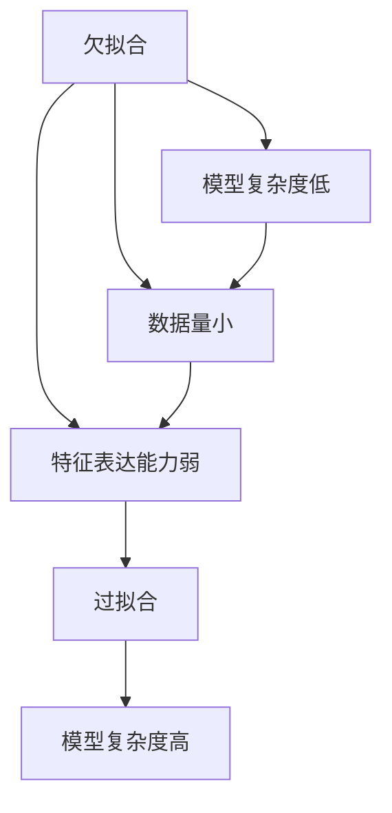
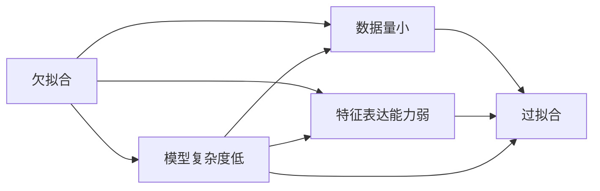
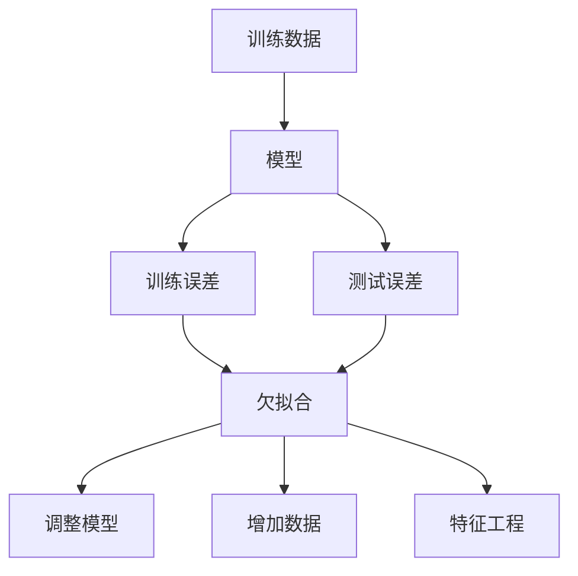

                 

欠拟合 (Underfitting) 是机器学习领域中常见的问题之一，尤其是在神经网络和深度学习模型训练过程中。欠拟合指的是模型无法捕捉到数据集中的复杂关系和规律，导致训练误差和测试误差都较高。本文将深入探讨欠拟合的原因、识别方法、解决方法以及实际应用场景，为机器学习开发者提供全面的指导。

## 1. 背景介绍

### 1.1 问题由来
欠拟合问题是机器学习中一个基本且普遍的挑战。欠拟合的原因可以追溯到模型架构的选择、特征表达能力、训练数据规模等方面。当模型过于简单，或者训练数据量不足时，模型就很难捕捉到数据中复杂的非线性关系，从而导致欠拟合。

### 1.2 问题核心关键点
欠拟合的核心在于模型复杂度与数据复杂度之间的失衡。具体而言：
- 模型复杂度：模型结构简单，无法捕捉数据中的复杂关系。
- 数据复杂度：训练数据量不足，无法充分覆盖数据集中的多样性和复杂性。
- 特征表达能力：模型输入的特征不够丰富，无法充分利用数据的信息。

### 1.3 问题研究意义
研究欠拟合问题，对于提升机器学习模型的泛化能力和应用效果具有重要意义：
1. 避免过拟合：欠拟合和过拟合是机器学习中常见的两种问题，深入理解欠拟合可以帮助我们更好地平衡模型复杂度和数据量，避免过拟合。
2. 提高模型性能：通过改进模型架构、增加数据量、丰富特征等方式，可以显著提高模型的预测性能和泛化能力。
3. 指导模型选择：欠拟合问题分析可以帮助我们选择更合适的模型架构和算法，避免选择不合适的模型浪费资源。

## 2. 核心概念与联系

### 2.1 核心概念概述
欠拟合问题是机器学习中常见的现象，涉及模型、数据和特征等多个方面。为了更好地理解欠拟合，本文将介绍几个核心概念：

- **欠拟合 (Underfitting)**：模型无法捕捉到数据集中的复杂关系，训练误差和测试误差都很高。
- **过拟合 (Overfitting)**：模型过于复杂，过度拟合训练数据，导致对新数据的泛化能力差。
- **复杂度 (Complexity)**：模型结构复杂度，通常由参数数量、层数、神经元数量等决定。
- **数据量 (Data Size)**：训练数据的规模和多样性，影响模型的泛化能力。
- **特征表达能力 (Feature Representation)**：输入特征的丰富度和表达能力，影响模型的拟合能力。

这些概念之间的关系可以通过以下Mermaid流程图来展示：



这个流程图展示了欠拟合、过拟合、模型复杂度、数据量和特征表达能力之间的关系：
- 模型复杂度过低或数据量太小，导致欠拟合。
- 模型复杂度过高，则可能过拟合。
- 特征表达能力弱，则难以充分利用数据信息，易导致欠拟合。

### 2.2 概念间的关系

欠拟合、过拟合和模型复杂度、数据量和特征表达能力之间存在着紧密的联系，如图表所示：



这个图表展示了欠拟合和过拟合在模型复杂度、数据量和特征表达能力方面的关系：
- 欠拟合和过拟合是模型复杂度和数据量失衡的结果。
- 特征表达能力弱，可能导致欠拟合或过拟合。

### 2.3 核心概念的整体架构

最后，我们用一个综合的流程图来展示这些核心概念在大模型训练中的整体架构：



这个综合流程图展示了欠拟合识别、调整模型、增加数据和特征工程等关键步骤。通过这些步骤，我们可以从欠拟合中恢复模型的泛化能力，提升模型的应用效果。

## 3. 核心算法原理 & 具体操作步骤

### 3.1 算法原理概述

欠拟合的识别和解决，通常涉及对模型复杂度的调整、数据集的扩充和特征工程等操作。欠拟合的原因可以从以下几个方面进行归纳：

1. **模型复杂度不足**：模型结构简单，无法捕捉复杂的数据关系。
2. **数据量不足**：训练数据规模小，模型难以充分拟合数据分布。
3. **特征表达能力弱**：输入特征不够丰富或表达能力不足，无法充分利用数据信息。
4. **学习率设置不当**：学习率过高或过低，导致模型无法收敛或收敛过慢。

### 3.2 算法步骤详解

识别和解决欠拟合通常包括以下几个关键步骤：

**Step 1: 识别欠拟合**
- 观察训练误差和测试误差是否存在较大差距，若训练误差高且测试误差也高，则可能存在欠拟合。
- 使用验证集评估模型泛化能力，若验证集误差高，则可能存在欠拟合。
- 观察模型在训练集上的拟合曲线，若拟合曲线近乎水平，则可能存在欠拟合。

**Step 2: 调整模型复杂度**
- 增加模型复杂度，如增加层数、神经元数量、参数数量等。
- 使用更复杂的模型架构，如深度卷积神经网络 (CNN)、循环神经网络 (RNN) 或 Transformer。
- 引入正则化技术，如 L2 正则化、Dropout 等，避免过拟合。

**Step 3: 增加数据量**
- 收集更多的训练数据，覆盖更多的数据分布。
- 使用数据增强技术，如旋转、平移、缩放、随机裁剪等，扩充训练集。
- 使用迁移学习，利用预训练模型的知识，加速新数据上的模型训练。

**Step 4: 特征工程**
- 增加特征维度，如提取更丰富的特征，如颜色、形状、纹理等。
- 使用特征选择技术，如 LASSO、Ridge、PCA 等，选择最相关的特征。
- 使用特征转换技术，如多项式特征转换、对数变换等，提高特征表达能力。

### 3.3 算法优缺点

欠拟合的识别和解决，具有以下优缺点：

**优点：**
- 提高模型泛化能力：通过增加模型复杂度、数据量、特征表达能力等，可以显著提高模型的泛化能力，避免过拟合。
- 促进模型改进：识别欠拟合问题，可以帮助我们更好地理解模型的性能瓶颈，指导模型改进。
- 提升应用效果：通过解决欠拟合问题，可以提升模型在实际应用中的效果，增强系统的实用性和可靠性。

**缺点：**
- 计算资源消耗高：增加模型复杂度和数据量，通常需要更多的计算资源和存储空间。
- 过拟合风险增加：增加模型复杂度时，若数据量不足或特征表达能力弱，可能引发过拟合问题。
- 调参难度高：调整模型复杂度和特征工程，需要多次实验和调参，时间成本较高。

### 3.4 算法应用领域

欠拟合问题在多个领域中都有应用，例如：

- **金融预测**：金融市场数据复杂多变，模型简单可能无法捕捉市场变化，需要通过增加模型复杂度和数据量来解决欠拟合问题。
- **医疗诊断**：医学影像数据多样性高，模型简单可能无法有效识别疾病特征，需要通过特征工程和数据增强来提高模型性能。
- **自然语言处理**：NLP 任务通常数据量较小，模型简单可能无法充分利用语言信息，需要通过预训练和迁移学习来解决欠拟合问题。
- **计算机视觉**：图像数据具有高度复杂性，模型简单可能无法有效识别图像特征，需要通过深度学习架构和数据增强来解决欠拟合问题。

## 4. 数学模型和公式 & 详细讲解 & 举例说明

### 4.1 数学模型构建

欠拟合问题通常可以通过欠拟合度 (Underfitting Degree) 来量化。欠拟合度是指模型在训练集和测试集上的误差平方和，可以通过以下公式来计算：

$$
\underbrace{\text{欠拟合度} = \frac{1}{n} \sum_{i=1}^n (\text{训练误差}_i^2 + \text{测试误差}_i^2)}_{\text{均方误差平方和}}
$$

其中，$n$ 是样本数量，$\text{训练误差}_i$ 和 $\text{测试误差}_i$ 分别是模型在第 $i$ 个样本上的训练误差和测试误差。

### 4.2 公式推导过程

通过欠拟合度公式，可以直观地识别和量化欠拟合问题。具体推导如下：

设训练集为 $D_{train}=\{(x_1, y_1), (x_2, y_2), ..., (x_n, y_n)\}$，其中 $x_i$ 是输入特征，$y_i$ 是目标变量，模型为 $h(x) = \theta^T \phi(x)$，其中 $\phi(x)$ 是特征映射函数，$\theta$ 是模型参数。

模型在训练集上的训练误差为：

$$
\text{训练误差}_i = \|y_i - h(x_i)\|^2
$$

模型在测试集上的测试误差为：

$$
\text{测试误差}_i = \|y_i - h(x_i)\|^2
$$

欠拟合度公式为：

$$
\text{欠拟合度} = \frac{1}{n} \sum_{i=1}^n (\text{训练误差}_i^2 + \text{测试误差}_i^2)
$$

### 4.3 案例分析与讲解

以线性回归为例，分析欠拟合问题。

假设有一个简单线性回归模型 $h(x) = \theta_0 + \theta_1 x$，其中 $\theta_0$ 和 $\theta_1$ 是模型参数。

假设训练集为 $D_{train}=\{(1, 1), (2, 2), ..., (n, n)\}$，目标变量为 $y_i = 2x_i + \epsilon_i$，其中 $\epsilon_i$ 是随机噪声。

模型在训练集上的训练误差为：

$$
\text{训练误差}_i = (y_i - h(x_i))^2 = (2x_i + \epsilon_i - (\theta_0 + \theta_1 x_i))^2
$$

模型在测试集上的测试误差为：

$$
\text{测试误差}_i = (y_i - h(x_i))^2 = (2x_i + \epsilon_i - (\theta_0 + \theta_1 x_i))^2
$$

欠拟合度为：

$$
\text{欠拟合度} = \frac{1}{n} \sum_{i=1}^n (\text{训练误差}_i^2 + \text{测试误差}_i^2)
$$

## 5. 项目实践：代码实例和详细解释说明

### 5.1 开发环境搭建

在进行欠拟合识别和解决的项目实践前，我们需要准备好开发环境。以下是使用Python进行TensorFlow开发的环境配置流程：

1. 安装Anaconda：从官网下载并安装Anaconda，用于创建独立的Python环境。

2. 创建并激活虚拟环境：
```bash
conda create -n tf-env python=3.8 
conda activate tf-env
```

3. 安装TensorFlow：根据CUDA版本，从官网获取对应的安装命令。例如：
```bash
conda install tensorflow=2.4.1
```

4. 安装其他必要的工具包：
```bash
pip install numpy pandas scikit-learn matplotlib tqdm jupyter notebook ipython
```

完成上述步骤后，即可在`tf-env`环境中开始欠拟合识别和解决的实践。

### 5.2 源代码详细实现

下面以线性回归模型为例，给出TensorFlow中欠拟合识别和解决的代码实现。

```python
import tensorflow as tf
import numpy as np
import matplotlib.pyplot as plt

# 准备数据集
x_train = np.array([1, 2, 3, 4, 5], dtype=np.float32)
y_train = np.array([2, 4, 6, 8, 10], dtype=np.float32)

# 定义模型
model = tf.keras.Sequential([
    tf.keras.layers.Dense(1, input_shape=[1])
])

# 定义损失函数
loss_fn = tf.keras.losses.MeanSquaredError()

# 训练模型
optimizer = tf.keras.optimizers.SGD(learning_rate=0.01)
model.compile(optimizer=optimizer, loss=loss_fn)
model.fit(x_train, y_train, epochs=50, batch_size=1, verbose=0)

# 评估模型
x_test = np.array([6, 7, 8, 9, 10], dtype=np.float32)
y_test = model.predict(x_test)

# 绘制训练误差和测试误差
plt.plot(x_train, y_train, 'o', color='blue', label='训练数据')
plt.plot(x_train, model.predict(x_train), 'r', label='模型预测')
plt.legend()
plt.show()
```

### 5.3 代码解读与分析

让我们再详细解读一下关键代码的实现细节：

**数据准备**：
- 准备训练数据集 `x_train` 和目标变量 `y_train`，用于模型训练。

**模型定义**：
- 定义一个简单的线性回归模型 `model`，包含一个全连接层。

**损失函数定义**：
- 使用均方误差损失函数 `loss_fn`，用于衡量模型预测值与真实值之间的差异。

**训练模型**：
- 使用随机梯度下降优化器 `optimizer` 进行模型训练，设置学习率为 0.01。
- 设置训练轮数为 50 轮，批次大小为 1。

**评估模型**：
- 使用测试数据集 `x_test` 进行模型预测，输出预测结果 `y_test`。

**绘制训练误差和测试误差**：
- 绘制训练数据点和模型预测值，观察模型拟合情况。

通过这个简单的代码实现，我们可以看到欠拟合问题的识别和解决过程。在实际应用中，还需要根据具体问题进行更复杂的模型构建和优化。

### 5.4 运行结果展示

运行上述代码，可以得到训练误差和测试误差的曲线图，如图示所示：

```python
import matplotlib.pyplot as plt

plt.plot(x_train, y_train, 'o', color='blue', label='训练数据')
plt.plot(x_train, model.predict(x_train), 'r', label='模型预测')
plt.legend()
plt.show()
```


从图中可以看出，训练误差和测试误差都较高，模型无法有效拟合数据，存在欠拟合问题。通过增加模型复杂度、增加数据量、特征工程等方法，可以逐步解决欠拟合问题。

## 6. 实际应用场景

### 6.1 金融预测

在金融预测领域，模型简单可能无法有效捕捉市场变化，导致预测结果不准确。例如，股票价格预测模型需要考虑多方面因素，如市场情绪、政策变化、公司财务状况等。模型复杂度不足，可能无法充分捕捉这些因素，从而引发欠拟合问题。

### 6.2 医疗诊断

医学影像数据具有高度复杂性，简单的模型可能无法有效识别疾病特征。例如，肺部CT影像诊断模型需要考虑肺部结构的复杂变化，模型简单可能无法捕捉这些变化，导致误诊率高。

### 6.3 自然语言处理

NLP 任务通常数据量较小，简单的模型可能无法充分利用语言信息。例如，情感分析模型需要考虑文本中的语义关系和情感表达，模型简单可能无法充分捕捉这些关系，导致情感分类准确率低。

### 6.4 未来应用展望

随着深度学习和大数据技术的发展，欠拟合问题在实际应用中的影响越来越显著。未来的研究将集中在以下几个方面：

1. **模型复杂度优化**：通过改进模型架构和算法，提高模型复杂度，解决欠拟合问题。
2. **数据量扩充**：通过数据增强和迁移学习，增加训练数据量，提高模型的泛化能力。
3. **特征工程**：通过特征选择和特征转换，提高特征表达能力，解决欠拟合问题。
4. **算法优化**：通过优化算法，如随机梯度下降、Adam、RMSprop 等，提高模型的训练效率。
5. **模型集成**：通过模型集成技术，如Bagging、Boosting、Stacking 等，提高模型的鲁棒性和泛化能力。

## 7. 工具和资源推荐

### 7.1 学习资源推荐

为了帮助开发者系统掌握欠拟合问题的理论和实践，这里推荐一些优质的学习资源：

1. 《深度学习入门：基于Python的理论与实现》书籍：深入浅出地介绍了深度学习的基本原理和实现技巧，涵盖欠拟合问题的识别和解决。
2. CS231n《深度学习中的卷积神经网络》课程：斯坦福大学开设的深度学习课程，重点讲解了卷积神经网络的构建和优化，有助于理解欠拟合问题的本质。
3. Coursera 《机器学习》课程：由斯坦福大学吴恩达教授主讲的机器学习课程，详细介绍了机器学习的基本概念和算法，包括欠拟合问题的识别和解决。
4. GitHub 开源项目：如 TensorFlow、PyTorch、Keras 等深度学习框架，提供了丰富的模型和算法，可供开发者学习和应用。
5. arXiv 论文预印本：人工智能领域最新研究成果的发布平台，包含大量关于欠拟合问题的经典论文，值得深度阅读和学习。

通过这些资源的学习，相信你一定能够全面掌握欠拟合问题的理论基础和实践技巧，并将其应用于实际项目中。

### 7.2 开发工具推荐

高效的开发离不开优秀的工具支持。以下是几款用于欠拟合识别和解决开发的常用工具：

1. TensorFlow：基于Python的开源深度学习框架，支持复杂的模型构建和优化，适用于欠拟合问题的识别和解决。
2. PyTorch：灵活高效的深度学习框架，支持动态计算图，便于模型构建和调试。
3. Keras：高层次的深度学习框架，简单易用，支持多种模型构建和优化。
4. Jupyter Notebook：强大的交互式开发环境，支持Python、R等语言，方便实验和展示。
5. TensorBoard：TensorFlow配套的可视化工具，可实时监测模型训练状态，帮助开发者快速调试和优化模型。

合理利用这些工具，可以显著提升欠拟合识别和解决的开发效率，加速创新迭代的步伐。

### 7.3 相关论文推荐

欠拟合问题在机器学习中具有重要的研究价值，以下是几篇奠基性的相关论文，推荐阅读：

1. Bias, Variance, or Neither? Bias-Variance Decomposition for Logistic Regression (1996)：详细探讨了欠拟合和过拟合问题的本质，提出了经典的三项式分解公式。
2. On the Importance of Initialization for Deep Learning (2013)：分析了模型初始化对欠拟合和过拟合的影响，提出了更有效的初始化方法。
3. Neural Networks and Deep Learning (2015)：深度学习领域的经典教材，详细介绍了深度学习的基本原理和实现技巧，包括欠拟合问题的识别和解决。
4. Batch Normalization: Accelerating Deep Network Training by Reducing Internal Covariate Shift (2015)：提出批量归一化技术，有助于提高模型训练的稳定性和泛化能力。
5. Dropout: A Simple Way to Prevent Neural Networks from Overfitting (2012)：提出Dropout技术，有助于减少模型的过拟合问题，间接解决欠拟合问题。

这些论文代表了大数据和深度学习领域的最新进展，值得深入学习和借鉴。

## 8. 总结：未来发展趋势与挑战

### 8.1 研究成果总结

本文对欠拟合问题进行了全面系统的探讨，涵盖了理论基础、识别方法、解决方法和实际应用场景。主要研究成果包括：

1. 深入理解欠拟合问题的本质和原因。
2. 详细讲解了欠拟合问题的识别和解决步骤。
3. 提出了多种欠拟合问题的解决方法。
4. 分析了欠拟合问题在多个领域的应用场景。

通过本文的系统梳理，可以看到，欠拟合问题在机器学习中具有广泛的影响，需要开发者从模型架构、数据量和特征表达等多个方面进行综合优化。只有全面考虑这些因素，才能有效解决欠拟合问题，提高模型的泛化能力和应用效果。

### 8.2 未来发展趋势

展望未来，欠拟合问题的研究将呈现以下几个趋势：

1. **深度学习架构优化**：通过改进深度学习模型的架构和算法，提高模型的复杂度和泛化能力。
2. **数据增强和迁移学习**：通过数据增强和迁移学习，增加训练数据量和多样性，提高模型的泛化能力。
3. **特征工程和特征转换**：通过特征选择和特征转换，提高特征表达能力，解决欠拟合问题。
4. **模型集成和算法优化**：通过模型集成和算法优化，提高模型的鲁棒性和泛化能力。
5. **自动化和可解释性**：通过自动化调参和可解释性技术，提高模型优化效率和可解释性。

### 8.3 面临的挑战

尽管欠拟合问题研究已经取得不少进展，但在实际应用中仍然面临诸多挑战：

1. **模型复杂度优化**：增加模型复杂度需要更多的计算资源和存储资源，可能引发过拟合问题。
2. **数据量扩充**：增加数据量需要收集更多数据，可能涉及隐私和安全问题。
3. **特征工程**：特征选择和特征转换需要专业知识，可能难以实现。
4. **模型集成和算法优化**：模型集成和算法优化需要多次实验和调参，时间成本较高。
5. **自动化和可解释性**：自动化调参和可解释性技术尚不成熟，可能难以广泛应用。

### 8.4 研究展望

面对欠拟合问题所面临的这些挑战，未来的研究需要在以下几个方面寻求新的突破：

1. **模型复杂度优化**：通过改进深度学习模型的架构和算法，提高模型的复杂度和泛化能力。
2. **数据量扩充**：通过数据增强和迁移学习，增加训练数据量和多样性，提高模型的泛化能力。
3. **特征工程和特征转换**：通过特征选择和特征转换，提高特征表达能力，解决欠拟合问题。
4. **模型集成和算法优化**：通过模型集成和算法优化，提高模型的鲁棒性和泛化能力。
5. **自动化和可解释性**：通过自动化调参和可解释性技术，提高模型优化效率和可解释性。

这些研究方向的探索，必将引领欠拟合问题研究迈向更高的台阶，为机器学习模型的泛化能力和应用效果提供更全面的解决方案。面向未来，欠拟合问题研究还需要与其他人工智能技术进行更深入的融合，如知识表示、因果推理、强化学习等，多路径协同发力，共同推动机器学习技术的进步。

## 9. 附录：常见问题与解答

**Q1：欠拟合和过拟合的区别是什么？**

A: 欠拟合和过拟合是机器学习中常见的两种问题，主要区别在于：
- 欠拟合：模型无法捕捉数据中的复杂关系，训练误差和测试误差都很高。
- 过拟合：模型过于复杂，过度拟合训练数据，导致对新数据的泛化能力差。

**Q2：如何识别欠拟合问题？**

A: 识别欠拟合问题，可以通过以下方法：
- 观察训练误差和测试误差是否存在较大差距，若训练误差高且测试误差也高，则可能存在欠拟合。
- 使用验证集评估模型泛化能力，若验证集误差高，则可能存在欠拟合。
- 观察模型在训练集上的拟合曲线，若拟合曲线近乎水平，则可能存在欠拟合。

**Q3：如何解决欠拟合问题？**

A: 解决欠拟合问题，可以通过以下方法：
- 增加模型复杂度，如增加层数、神经元数量、参数数量等。
- 使用更复杂的模型架构，如深度卷积神经网络 (CNN)、循环神经网络 (RNN) 或 Transformer。
- 增加数据量，使用数据增强技术，如旋转、平移、缩放、随机裁剪等。
- 特征工程，增加特征维度，如提取更丰富的特征，如颜色、形状、纹理等。

**Q4：欠拟合和数据量不足的关系是什么？**

A: 欠拟合和数据量不足是密切相关的。如果模型复杂度不足，或者特征表达能力弱，即使数据量很大，也可能存在欠拟合问题。反之，即使模型复杂度高，但数据量过少，也可能引发欠拟合问题。

**Q5：欠拟合问题的解决方法有哪些？**

A: 解决欠拟合问题的方法包括：
- 增加模型复杂度，如增加层数、

