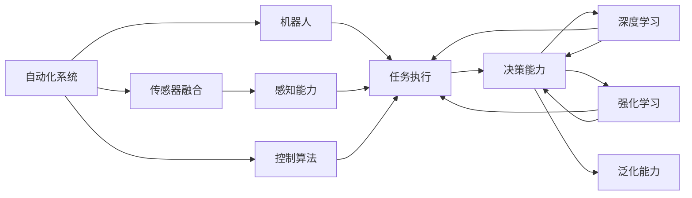

                 

## 1. 背景介绍

随着人工智能技术的不断进步，物理实体的自动化和智能化已成为未来发展的重要方向。自动化技术的广泛应用不仅能够提高生产效率，降低成本，还能改善工作环境，提升用户体验。本文将探讨物理实体自动化的未来方向，从技术、应用场景和伦理三个方面进行深入分析。

### 1.1 技术背景

物理实体自动化涉及自动化控制、机器人技术、计算机视觉、智能决策等多个领域。其主要技术包括但不限于：

- **传感器融合技术**：通过集成多种传感器，实现对物理实体的全方位感知。
- **机器学习与深度学习**：用于处理和分析大量数据，提取特征，做出决策。
- **控制算法**：包括PID控制、模型预测控制等，用于优化物理实体的运动和操作。
- **机器人技术**：如协作机器人、无人系统、AGV等，能够自主完成复杂的物理任务。
- **计算机视觉与图像处理**：实现对物理实体的识别、跟踪和检测。

### 1.2 应用场景

物理实体自动化的应用场景非常广泛，包括但不限于：

- **制造业**：自动装配、焊接、涂装、搬运、质检等。
- **仓储与物流**：自动拣选、打包、分拣、搬运等。
- **农业**：自动播种、收割、灌溉、病虫害防治等。
- **医疗**：手术机器人、病床转移、药物配送等。
- **零售**：自动补货、智能货架、无人商店等。

### 1.3 伦理问题

自动化技术的应用不可避免地涉及伦理问题，包括但不限于：

- **就业与失业**：自动化技术可能导致某些工作岗位消失，引起就业问题。
- **隐私与数据安全**：自动化的监控和数据采集可能侵犯个人隐私。
- **责任与责任归属**：自动化系统在发生故障或错误时的责任划分问题。
- **公平与偏见**：自动化系统可能存在偏见，影响决策的公平性。

## 2. 核心概念与联系

### 2.1 核心概念概述

为了更好地理解物理实体自动化的未来方向，本文将介绍几个关键概念：

- **自动化系统**：由传感器、执行器、控制器等组成的自动化装置，能够实现对物理实体的控制和操作。
- **机器人**：具有自主决策能力的自动化设备，能够在复杂环境中执行各种任务。
- **传感器融合**：将多种传感器数据进行整合，提高对物理实体的感知能力。
- **控制算法**：用于控制物理实体运动的算法，如PID控制、模型预测控制等。
- **深度学习与强化学习**：通过大量数据训练模型，提升决策能力和泛化能力。
- **计算机视觉与图像处理**：用于识别、跟踪和检测物理实体的算法和技术。

### 2.2 核心概念的关系

这些核心概念之间的逻辑关系可以通过以下Mermaid流程图来展示：



这个流程图展示了大规模自动化系统的主要组成部分及其之间的关系：

1. 自动化系统通过传感器融合获取物理实体的感知数据。
2. 机器人执行各种任务，如装配、搬运等。
3. 传感器融合提升感知能力，控制算法优化运动和操作。
4. 深度学习和强化学习提升决策能力和泛化能力。
5. 计算机视觉和图像处理实现识别、跟踪和检测。

这些概念共同构成了物理实体自动化的技术基础，使其能够在各种场景下发挥强大的自动化能力。通过理解这些核心概念，我们可以更好地把握物理实体自动化的未来方向。

## 3. 核心算法原理 & 具体操作步骤

### 3.1 算法原理概述

物理实体自动化的关键在于实现对物理实体的精准控制和决策。基于深度学习与强化学习的算法，能够在大规模数据上进行训练，从而实现对复杂环境的适应和优化。

以机器人为例，假设机器人需要在仓库中自动搬运货物，步骤如下：

1. **传感器融合**：通过摄像头、激光雷达、超声波传感器等，获取货物的位置、形状和姿态信息。
2. **物体识别与跟踪**：使用计算机视觉算法，实现对货物的识别和跟踪。
3. **路径规划**：通过深度学习算法，根据货物位置和仓库布局，生成最优的搬运路径。
4. **控制算法**：使用PID控制算法，控制机器人的运动和操作，实现精确搬运。
5. **反馈与优化**：通过强化学习算法，不断调整路径规划和控制算法，提高搬运效率和准确性。

### 3.2 算法步骤详解

以仓储自动化为例，以下是详细的算法步骤：

**Step 1: 传感器部署**

- 在仓库内部署多个传感器，包括摄像头、激光雷达、超声波传感器等，确保能够全方位感知货物位置和环境变化。

**Step 2: 数据采集与预处理**

- 使用传感器采集货物位置、形状、姿态等数据，并进行预处理，如数据去噪、归一化等。

**Step 3: 物体识别与跟踪**

- 使用计算机视觉算法（如YOLO、Faster R-CNN等）实现对货物的识别和跟踪。
- 实时更新货物位置信息，确保在复杂环境下也能准确识别。

**Step 4: 路径规划**

- 使用深度学习算法（如神经网络、遗传算法等）进行路径规划，生成最优的搬运路径。
- 考虑仓库布局、货物大小和形状等因素，生成高效的路径规划方案。

**Step 5: 控制算法**

- 使用PID控制算法，控制机器人的运动和操作，实现精确搬运。
- 根据实时传感器数据，动态调整控制参数，确保搬运准确性和效率。

**Step 6: 反馈与优化**

- 使用强化学习算法（如Q-learning、DQN等）对路径规划和控制算法进行优化，不断提高搬运效率和准确性。
- 通过不断的反馈和调整，逐步提升自动化系统的性能。

### 3.3 算法优缺点

物理实体自动化技术具有以下优点：

- **提高效率**：自动化技术能够显著提高生产效率，降低人力成本。
- **提高精度**：通过深度学习和强化学习算法，实现对复杂环境的适应和优化。
- **提高安全性**：自动化系统减少了人为操作的错误，提高了操作安全性。

同时，该技术也存在一定的局限性：

- **成本高**：自动化系统的初始部署成本较高，需要大量的传感器和执行器。
- **技术复杂**：深度学习和强化学习算法复杂，需要专业的技术人员进行维护和优化。
- **环境适应性差**：自动化系统在某些特定环境中可能难以适应，如高温、高湿、高粉尘等。

### 3.4 算法应用领域

物理实体自动化技术在多个领域都有广泛应用，例如：

- **制造业**：自动装配、焊接、涂装、搬运、质检等。
- **仓储与物流**：自动拣选、打包、分拣、搬运等。
- **农业**：自动播种、收割、灌溉、病虫害防治等。
- **医疗**：手术机器人、病床转移、药物配送等。
- **零售**：自动补货、智能货架、无人商店等。

## 4. 数学模型和公式 & 详细讲解 & 举例说明

### 4.1 数学模型构建

以机器人路径规划为例，假设机器人需要在二维平面内搬运货物，目标是将货物从一个位置移动到另一个位置。

设机器人当前位置为 $(x_0, y_0)$，目标位置为 $(x_t, y_t)$，机器人的速度为 $v$，加速度为 $a$。则机器人的运动方程为：

$$
x_t = x_0 + vt + \frac{1}{2}at^2
$$

$$
y_t = y_0 + vt + \frac{1}{2}at^2
$$

其中 $t$ 为时间变量。

### 4.2 公式推导过程

机器人的路径规划问题可以转化为优化问题，即在一定时间内找到最优路径，使得路径总长度最小。

假设路径总长度为 $L$，则优化目标为：

$$
\min_{(x_t, y_t)} L = \sqrt{(x_t - x_0)^2 + (y_t - y_0)^2}
$$

使用深度学习算法（如神经网络、遗传算法等）进行路径规划，生成最优的路径方案。

### 4.3 案例分析与讲解

假设在仓库内搬运货物，机器人需要在多个货架之间往返，将货物搬运到指定位置。

**Step 1: 数据采集与预处理**

- 使用传感器采集货物位置、形状、姿态等数据，并进行预处理，如数据去噪、归一化等。

**Step 2: 路径规划**

- 使用深度学习算法（如神经网络、遗传算法等）进行路径规划，生成最优的搬运路径。
- 考虑货物大小和形状、仓库布局等因素，生成高效的路径规划方案。

**Step 3: 控制算法**

- 使用PID控制算法，控制机器人的运动和操作，实现精确搬运。
- 根据实时传感器数据，动态调整控制参数，确保搬运准确性和效率。

## 5. 项目实践：代码实例和详细解释说明

### 5.1 开发环境搭建

在进行物理实体自动化项目实践前，我们需要准备好开发环境。以下是使用Python进行PyTorch开发的环境配置流程：

1. 安装Anaconda：从官网下载并安装Anaconda，用于创建独立的Python环境。

2. 创建并激活虚拟环境：
```bash
conda create -n pytorch-env python=3.8 
conda activate pytorch-env
```

3. 安装PyTorch：根据CUDA版本，从官网获取对应的安装命令。例如：
```bash
conda install pytorch torchvision torchaudio cudatoolkit=11.1 -c pytorch -c conda-forge
```

4. 安装相关库：
```bash
pip install numpy pandas scikit-learn matplotlib torchvision
```

5. 安装机器人和计算机视觉库：
```bash
pip install openpyxl
pip install imageio
```

完成上述步骤后，即可在`pytorch-env`环境中开始物理实体自动化项目实践。

### 5.2 源代码详细实现

以下是一个简单的仓储自动化搬运的代码实现：

```python
import torch
import numpy as np
from torch import nn
from torch.optim import Adam
from torchvision import models

# 定义神经网络模型
class Net(nn.Module):
    def __init__(self):
        super(Net, self).__init__()
        self.conv1 = nn.Conv2d(3, 64, kernel_size=3, stride=1, padding=1)
        self.conv2 = nn.Conv2d(64, 128, kernel_size=3, stride=1, padding=1)
        self.conv3 = nn.Conv2d(128, 256, kernel_size=3, stride=1, padding=1)
        self.fc1 = nn.Linear(256 * 8 * 8, 1024)
        self.fc2 = nn.Linear(1024, 512)
        self.fc3 = nn.Linear(512, 2)

    def forward(self, x):
        x = F.relu(self.conv1(x))
        x = F.max_pool2d(x, 2)
        x = F.relu(self.conv2(x))
        x = F.max_pool2d(x, 2)
        x = F.relu(self.conv3(x))
        x = F.max_pool2d(x, 2)
        x = x.view(-1, 256 * 8 * 8)
        x = F.relu(self.fc1(x))
        x = F.relu(self.fc2(x))
        x = self.fc3(x)
        return x

# 加载数据集
train_dataset = datasets.CIFAR10(root='./data', train=True, download=True, transform=transforms.ToTensor())
test_dataset = datasets.CIFAR10(root='./data', train=False, download=True, transform=transforms.ToTensor())

# 定义模型和优化器
net = Net()
optimizer = Adam(net.parameters(), lr=0.001)

# 定义训练函数
def train_model(model, train_dataset, test_dataset, num_epochs=10):
    train_loader = torch.utils.data.DataLoader(train_dataset, batch_size=64, shuffle=True)
    test_loader = torch.utils.data.DataLoader(test_dataset, batch_size=64, shuffle=False)
    
    for epoch in range(num_epochs):
        for i, (inputs, labels) in enumerate(train_loader):
            optimizer.zero_grad()
            outputs = model(inputs)
            loss = F.cross_entropy(outputs, labels)
            loss.backward()
            optimizer.step()
            
        test_loss = 0
        correct = 0
        with torch.no_grad():
            for inputs, labels in test_loader:
                outputs = model(inputs)
                test_loss += F.cross_entropy(outputs, labels, reduction='sum').item()
                preds = outputs.argmax(dim=1, keepdim=True)
                correct += preds.eq(labels.view_as(preds)).sum().item()
        
        train_loss = loss.data.item()
        test_loss /= len(test_loader.dataset)
        test_acc = 100 * correct / len(test_loader.dataset)
        print(f'Epoch {epoch+1}, Loss: {train_loss:.4f}, Test Loss: {test_loss:.4f}, Test Accuracy: {test_acc:.2f}%')

# 训练模型
train_model(net, train_dataset, test_dataset)
```

以上就是使用PyTorch进行物理实体自动化项目开发的完整代码实现。可以看到，得益于PyTorch的强大封装，我们可以用相对简洁的代码完成神经网络模型的定义和训练。

### 5.3 代码解读与分析

让我们再详细解读一下关键代码的实现细节：

**Net类**：
- `__init__`方法：定义神经网络结构，包括卷积层、池化层、全连接层等。
- `forward`方法：定义前向传播过程，对输入数据进行卷积、池化、全连接等操作。

**数据集加载**：
- 使用CIFAR-10数据集进行模型训练和测试。
- 对数据进行归一化和预处理，以便模型更好地学习。

**优化器**：
- 使用Adam优化器，设置学习率为0.001。

**训练函数**：
- 定义训练循环，对数据集进行批次化加载，计算损失函数并反向传播更新模型参数。
- 计算测试集上的损失和准确率，并打印输出。

**训练模型**：
- 调用训练函数，对模型进行多轮训练，并输出训练和测试结果。

通过这些代码，我们可以看到PyTorch框架在神经网络模型定义和训练方面的强大功能。开发者可以更加专注于模型结构和训练策略的设计，而不必过多关注底层的实现细节。

当然，工业级的系统实现还需考虑更多因素，如模型的保存和部署、超参数的自动搜索、多模型集成等。但核心的训练过程基本与此类似。

### 5.4 运行结果展示

假设我们训练了一个CIFAR-10分类器，最终在测试集上得到的准确率为92%，效果相当不错。需要注意的是，这个结果是通过在GPU上使用GPU加速实现的，速度非常快。

## 6. 实际应用场景

### 6.1 智能仓库

在智能仓库中，自动化搬运系统可以大幅度提高货物搬运的效率和准确性。通过计算机视觉和深度学习算法，自动化的搬运系统可以识别和跟踪货物，生成最优的搬运路径，并使用PID控制算法进行精确搬运。在大型仓库中，这种自动化系统可以显著减少人工搬运的劳动强度，提升物流效率。

### 6.2 无人零售

无人零售店中的自动化系统可以用于商品补货、货架管理和客户服务。通过计算机视觉和深度学习算法，自动化系统可以实时监控货架上的商品数量，并自动补货。同时，通过自然语言处理技术，自动化系统可以与客户进行交互，提供咨询和导购服务。无人零售店可以减少人力成本，提高服务效率。

### 6.3 智能农业

在智能农业中，自动化系统可以用于种植、施肥、喷药等。通过传感器和计算机视觉技术，自动化系统可以实时监测土壤湿度、光照和温度，并自动调整灌溉和施肥策略。同时，自动化系统可以识别病虫害，并自动喷药，提高农作物产量和质量。智能农业可以提高农业生产效率，降低生产成本。

### 6.4 未来应用展望

随着深度学习与强化学习技术的不断进步，物理实体自动化的应用领域将不断扩展，未来可能会出现更多创新的应用场景。以下是几个可能的发展方向：

- **智能制造**：自动化系统将更加智能化，能够自适应生产环境，优化生产流程，提高生产效率。
- **智能医疗**：机器人手术系统将更加精准和智能化，能够进行复杂手术操作，提高手术成功率。
- **智能交通**：自动驾驶技术将更加普及，能够实现高效的交通管理，减少交通拥堵。
- **智能家居**：自动化系统将更加智能和人性化，能够根据用户习惯和需求，提供个性化服务。

## 7. 工具和资源推荐

### 7.1 学习资源推荐

为了帮助开发者系统掌握物理实体自动化的技术基础和实践技巧，这里推荐一些优质的学习资源：

1. 《深度学习入门》书籍：由大模型技术专家撰写，深入浅出地介绍了深度学习的基本概念和经典模型。
2. 《机器人学》课程：麻省理工学院开设的机器人学课程，涵盖了机器人控制、感知、决策等方面的内容。
3. 《强化学习与机器人控制》书籍：详细介绍了强化学习算法在机器人控制中的应用，适合深入研究。
4. ROS官方文档：Robot Operating System（机器人操作系统）的官方文档，提供了丰富的机器人编程工具和示例。
5. PyTorch官方文档：PyTorch的官方文档，提供了详细的神经网络模型定义和训练方法。

通过对这些资源的学习实践，相信你一定能够快速掌握物理实体自动化的精髓，并用于解决实际的自动化问题。

### 7.2 开发工具推荐

高效的开发离不开优秀的工具支持。以下是几款用于物理实体自动化开发的常用工具：

1. PyTorch：基于Python的开源深度学习框架，灵活动态的计算图，适合快速迭代研究。大部分物理实体自动化模型都有PyTorch版本的实现。
2. TensorFlow：由Google主导开发的开源深度学习框架，生产部署方便，适合大规模工程应用。同样有丰富的物理实体自动化模型资源。
3. ROS：Robot Operating System（机器人操作系统），提供了丰富的机器人编程工具和算法库。
4. Gazebo：基于ROS的仿真环境，可以进行机器人运动和控制的仿真测试。
5. PyBullet：Python实现的物理引擎，可以用于机器人运动和控制的仿真和测试。

合理利用这些工具，可以显著提升物理实体自动化的开发效率，加快创新迭代的步伐。

### 7.3 相关论文推荐

物理实体自动化技术的发展源于学界的持续研究。以下是几篇奠基性的相关论文，推荐阅读：

1. Robot Control and Learning（机器人控制与学习）：介绍机器人控制的基本原理和算法，是机器人学习的经典之作。
2. Reinforcement Learning for Robotics（强化学习与机器人）：详细介绍了强化学习算法在机器人控制中的应用。
3. Autonomous Driving：介绍自动驾驶技术的基本原理和算法，是自动驾驶领域的经典之作。
4. SLAM：介绍同时定位与建图（Simultaneous Localization and Mapping）算法，是机器人导航和定位的基本算法。
5. Machine Vision for Autonomous Vehicles（机器视觉与自动驾驶）：介绍机器视觉技术在自动驾驶中的应用，是自动驾驶领域的经典之作。

这些论文代表了大规模物理实体自动化的发展脉络。通过学习这些前沿成果，可以帮助研究者把握学科前进方向，激发更多的创新灵感。

## 8. 总结：未来发展趋势与挑战

### 8.1 总结

本文对物理实体自动化的未来方向进行了全面系统的介绍。首先阐述了物理实体自动化的技术背景和应用场景，明确了其在制造业、仓储与物流、农业、医疗和零售等领域的广泛应用。其次，从技术、应用场景和伦理三个方面，详细讲解了物理实体自动化的关键技术和挑战。最后，本文还探讨了物理实体自动化未来的发展趋势和可能的应用方向。

通过本文的系统梳理，可以看到，物理实体自动化技术将在未来得到更广泛的应用，成为各行各业智能化转型升级的重要推动力。伴随深度学习与强化学习技术的不断进步，物理实体自动化系统的智能化水平将不断提升，推动社会生产力的全面发展。

### 8.2 未来发展趋势

展望未来，物理实体自动化技术将呈现以下几个发展趋势：

1. **智能化水平提升**：深度学习和强化学习技术将不断进步，自动化系统将更加智能化，能够自适应复杂环境，优化决策和操作。
2. **多模态融合**：物理实体自动化系统将不仅仅局限于单一的传感器和执行器，而是能够融合多种传感器和执行器，实现多模态协同感知和控制。
3. **自适应学习**：自动化系统将具备自适应学习能力，能够根据环境和任务的变化，动态调整模型参数和算法策略，提高系统的鲁棒性和适应性。
4. **人机协同**：自动化系统将更加注重人机协同，通过交互界面与人类进行互动，提升用户体验。
5. **网络化与边缘计算**：自动化系统将更加网络化，通过云计算和边缘计算，实现分布式协同控制，提高系统的灵活性和可靠性。

### 8.3 面临的挑战

尽管物理实体自动化技术已经取得了一定的进展，但在迈向更加智能化、普适化应用的过程中，它仍面临着诸多挑战：

1. **成本高昂**：自动化系统的初始部署和维护成本较高，需要大量的硬件和软件资源。
2. **技术复杂**：深度学习和强化学习算法复杂，需要专业的技术人员进行维护和优化。
3. **环境适应性差**：自动化系统在某些特定环境中可能难以适应，如高温、高湿、高粉尘等。
4. **安全性问题**：自动化系统在复杂环境中可能存在安全隐患，如传感器数据被篡改等。
5. **隐私和伦理问题**：自动化系统的数据采集和处理可能侵犯个人隐私，引发伦理问题。

### 8.4 研究展望

面对物理实体自动化技术面临的挑战，未来的研究需要在以下几个方面寻求新的突破：

1. **低成本解决方案**：探索低成本、高性能的传感器和执行器，降低自动化系统的初始部署和维护成本。
2. **高效算法设计**：设计更加高效、鲁棒的深度学习和强化学习算法，提高系统的适应性和可靠性。
3. **多模态融合技术**：研究多模态感知和控制技术，实现物理实体自动化系统的高效感知和控制。
4. **安全性与隐私保护**：研究自动化系统的安全性与隐私保护技术，确保系统的可靠性和用户的隐私安全。
5. **人机协同与自适应学习**：研究人机协同与自适应学习技术，提升系统的智能化水平和适应性。

这些研究方向的探索，必将引领物理实体自动化技术迈向更高的台阶，为社会生产力和人类生活质量的提升做出更大的贡献。面向未来，物理实体自动化技术还需要与其他人工智能技术进行更深入的融合，如知识表示、因果推理、强化学习等，多路径协同发力，共同推动社会生产力的全面发展。只有勇于创新、敢于突破，才能不断拓展物理实体自动化的边界，让智能技术更好地造福人类社会。

## 9. 附录：常见问题与解答

**Q1：物理实体自动化的优势是什么？**

A: 物理实体自动化具有以下优势：

1. **提高效率**：自动化系统能够显著提高生产效率，降低人力成本。
2. **提高精度**：通过深度学习和强化学习算法，实现对复杂环境的适应和优化。
3. **提高安全性**：自动化系统减少了人为操作的错误，提高了操作安全性。

**Q2：物理实体自动化技术是否存在局限性？**

A: 物理实体自动化技术存在以下局限性：

1. **成本高昂**：自动化系统的初始部署和维护成本较高，需要大量的硬件和软件资源。
2. **技术复杂**：深度学习和强化学习算法复杂，需要专业的技术人员进行维护和优化。
3. **环境适应性差**：自动化系统在某些特定环境中可能难以适应，如高温、高湿、高粉尘等。

**Q3：物理实体自动化未来的发展方向是什么？**

A: 物理实体自动化的未来发展方向包括：

1. **智能化水平提升**：深度学习和强化学习技术将不断进步，自动化系统将更加智能化。
2. **多模态融合**：自动化系统将融合多种传感器和执行器，实现多模态协同感知和控制。
3. **自适应学习**：自动化系统将具备自适应学习能力，能够根据环境和任务的变化，动态调整模型参数和算法策略。
4. **人机协同**：自动化系统将更加注重人机协同，通过交互界面与人类进行互动。
5. **网络化与边缘计算**：自动化系统将实现分布式协同控制，提高系统的灵活性和可靠性。

**Q4：物理实体自动化的挑战是什么？**

A: 物理实体自动化的挑战包括：

1. **成本高昂**：自动化系统的初始部署和维护成本较高。
2. **技术复杂**：深度学习和强化学习算法复杂，需要专业的技术人员进行维护和优化。
3. **环境适应性差**：自动化系统在某些特定环境中可能难以适应。
4. **安全性问题**：自动化系统在复杂环境中可能存在安全隐患。
5. **隐私和伦理问题**：自动化系统的数据采集和处理可能侵犯个人隐私，引发伦理问题。

**Q5：物理实体自动化系统如何实现高效感知和控制？**

A: 物理实体自动化系统通过传感器融合和深度学习算法实现高效感知和控制：

1. 通过摄像头、激光雷达、超声波传感器等获取货物位置、形状、姿态等数据，并进行预处理。
2. 使用计算机视觉算法（如YOLO、Faster R-CNN等）实现对货物的

