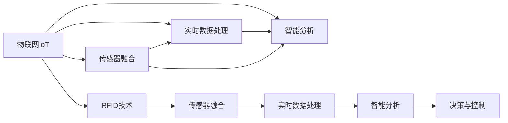
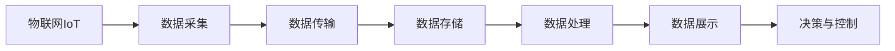
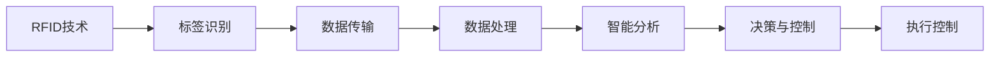
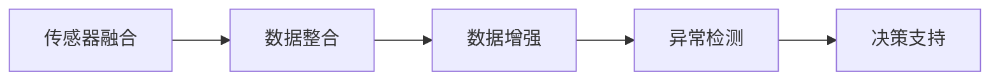

                 

# 物联网(IoT)技术和各种传感器设备的集成：RFID与物联网

> 关键词：物联网,RFID,传感器集成,设备管理,实时监控,智能分析

## 1. 背景介绍

### 1.1 问题由来
随着互联网和信息技术的不断进步，物联网（IoT）技术正迅速改变我们的生活和工作方式。物联网技术通过连接和集成各种传感器设备，实现了对物理世界的智能化感知和自动化控制。其中，射频识别技术（RFID）作为一种高效的标识和识别手段，在物联网中扮演着重要角色。RFID技术通过射频信号识别标签，可以实现快速、非接触式的数据获取和处理，广泛应用于物流、零售、制造、医疗等多个领域。

### 1.2 问题核心关键点
本文聚焦于RFID技术在物联网中的集成应用，探讨了RFID与物联网的深度融合，以及如何在不同应用场景中发挥其优势。我们主要关注以下几个核心问题：
- 物联网技术的基本原理和架构。
- RFID技术的基本概念和识别机制。
- 物联网与RFID技术的集成策略和实际案例。
- 物联网与RFID技术的未来发展趋势和挑战。

通过系统地回答这些问题，我们可以更好地理解RFID技术在物联网中的应用，并为实际项目开发提供参考。

### 1.3 问题研究意义
RFID技术与物联网的集成，为智能感知和自动化控制提供了强有力的技术支持。通过RFID技术的深度融合，物联网系统能够更高效、更精确地获取物理世界的数据，实现对设备状态的实时监控和智能分析，从而提高生产效率、降低运营成本，并提升用户体验。本文的研究将有助于推动RFID技术在物联网中的广泛应用，加速智能制造和智慧城市的发展，具有重要的理论和实际意义。

## 2. 核心概念与联系

### 2.1 核心概念概述

为更好地理解RFID与物联网的集成应用，本节将介绍几个关键概念：

- 物联网(IoT)：通过传感器、嵌入式设备等技术，将物理世界的各种信息数字化，并通过互联网进行传输和处理，实现对物理世界的智能感知和控制。
- RFID（Radio Frequency Identification）：一种非接触式自动识别技术，通过无线电波读取附着在物体上的标签信息，实现快速、无接触的数据获取。
- 传感器融合（Sensor Fusion）：将多种传感器数据进行综合处理，提高数据准确性和可靠性，增强系统的感知能力。
- 实时数据处理（Real-time Data Processing）：对传感器获取的实时数据进行快速处理和分析，及时做出决策，提升系统响应速度。
- 智能分析（Intelligent Analysis）：通过机器学习、深度学习等技术，对传感器数据进行深入分析和挖掘，提取有用信息，优化系统行为。

这些概念之间的逻辑关系可以通过以下Mermaid流程图来展示：



这个流程图展示了物联网、RFID技术、传感器融合、实时数据处理和智能分析之间的关系：

1. 物联网是整个系统的基础，通过传感器等设备获取物理世界的数据。
2. 传感器融合将多种传感器数据进行综合处理，提高数据准确性和可靠性。
3. 实时数据处理对传感器获取的实时数据进行快速处理和分析，及时做出决策。
4. 智能分析通过机器学习、深度学习等技术，对数据进行深入分析和挖掘，提取有用信息。
5. RFID技术通过无线电波读取标签信息，实现快速、无接触的数据获取，增强系统的感知能力。

这些概念共同构成了物联网与RFID技术的集成架构，使其能够在各种应用场景中发挥强大的智能化作用。通过理解这些核心概念，我们可以更好地把握RFID与物联网集成的基本原理和应用方向。

### 2.2 概念间的关系

这些核心概念之间存在着紧密的联系，形成了RFID与物联网集成的完整生态系统。下面我们通过几个Mermaid流程图来展示这些概念之间的关系。

#### 2.2.1 物联网的基本架构



这个流程图展示了物联网的基本架构，包括数据采集、传输、存储、处理、展示和控制各个环节。数据采集通过传感器等设备获取物理世界的数据，传输通过互联网进行数据传输，存储对数据进行管理和存储，处理对数据进行分析和处理，展示对数据进行可视化展示，控制根据处理结果进行自动化控制。

#### 2.2.2 RFID技术与物联网的集成



这个流程图展示了RFID技术与物联网的集成过程，包括标签识别、数据传输、数据处理、智能分析和决策与控制各个环节。标签识别通过RFID技术快速获取标签信息，数据传输通过互联网进行数据传输，数据处理对数据进行分析和处理，智能分析通过机器学习、深度学习等技术对数据进行深入分析和挖掘，决策与控制根据分析结果进行自动化控制，执行控制对物理设备进行自动化控制。

#### 2.2.3 传感器融合在物联网中的应用



这个流程图展示了传感器融合在物联网中的应用，包括数据整合、数据增强、异常检测和决策支持各个环节。数据整合将多种传感器数据进行综合处理，数据增强对数据进行增强和优化，异常检测对数据进行异常检测和报警，决策支持根据分析结果进行决策和控制。

## 3. 核心算法原理 & 具体操作步骤
### 3.1 算法原理概述

RFID与物联网的集成应用，主要涉及RFID技术、传感器融合、实时数据处理和智能分析等核心算法。本节将详细讲解这些核心算法的原理和操作步骤。

#### 3.1.1 RFID技术

RFID技术的核心原理是通过无线电波读取标签信息，实现快速、非接触式的标识和识别。RFID标签包含电子芯片和天线，当RFID读写器（Reader）发出电磁波时，标签天线接收信号，通过共振原理产生感应电流，驱动电子芯片工作，将存储的数据信息发送回读写器。读写器通过天线接收数据，并通过解码器进行数据解码，最终识别出标签信息。

RFID技术的优点在于其非接触式特性，适用于大规模标签标识和实时数据获取。其缺点在于标签的初始化成本较高，标签的数据存储容量有限，且容易受到外界干扰。

#### 3.1.2 传感器融合

传感器融合的目的是将多种传感器数据进行综合处理，提高数据准确性和可靠性，增强系统的感知能力。常见的传感器融合算法包括加权平均、加权最小二乘、卡尔曼滤波等。

加权平均算法通过给不同传感器数据赋予不同的权重，计算加权平均数作为最终结果。加权最小二乘算法通过最小化加权误差，优化传感器数据融合过程。卡尔曼滤波算法通过预测和校正的方式，对传感器数据进行实时更新和融合。

传感器融合的优点在于能够有效利用多种传感器数据，提高数据准确性和可靠性。其缺点在于算法复杂度高，需要大量的计算资源。

#### 3.1.3 实时数据处理

实时数据处理是对传感器获取的实时数据进行快速处理和分析，及时做出决策，提升系统响应速度。常见的实时数据处理算法包括事件驱动模型、数据流处理、流式机器学习等。

事件驱动模型通过事件触发，对实时数据进行处理和分析。数据流处理通过流式数据处理技术，对实时数据进行高效处理和分析。流式机器学习通过实时数据流进行在线机器学习，提高系统响应速度。

实时数据处理的优点在于能够快速处理和分析实时数据，及时做出决策。其缺点在于算法复杂度高，需要大量的计算资源。

#### 3.1.4 智能分析

智能分析通过机器学习、深度学习等技术，对传感器数据进行深入分析和挖掘，提取有用信息，优化系统行为。常见的智能分析算法包括决策树、随机森林、支持向量机、神经网络等。

决策树通过树形结构，对数据进行分类和预测。随机森林通过集成多个决策树，提高分类和预测的准确性。支持向量机通过寻找最优超平面，实现数据分类和回归。神经网络通过多层神经元结构，实现数据的深度学习和预测。

智能分析的优点在于能够从数据中提取有用信息，优化系统行为。其缺点在于算法复杂度高，需要大量的计算资源。

### 3.2 算法步骤详解

基于RFID与物联网的集成应用，以下详细介绍其核心算法的具体操作步骤：

#### 3.2.1 RFID标签识别

1. 配置RFID读写器，选择适当的频率和读写模式。
2. 将RFID标签粘贴到目标物体上。
3. 开启RFID读写器，向标签发送电磁波，等待标签发送响应信号。
4. 读取标签的响应信号，通过解码器进行数据解码，得到标签信息。

#### 3.2.2 传感器数据采集

1. 选择适当的传感器，如温度传感器、湿度传感器、压力传感器等，根据应用场景进行安装。
2. 将传感器与物联网平台进行连接，实现数据的实时采集。
3. 对采集到的数据进行预处理，如去噪、归一化等，确保数据的准确性和可靠性。

#### 3.2.3 数据融合与处理

1. 将采集到的RFID标签数据和传感器数据进行整合，建立数据融合模型。
2. 对数据进行融合处理，如加权平均、卡尔曼滤波等，提高数据的准确性和可靠性。
3. 对融合后的数据进行实时处理，如流式机器学习，提取有用信息，及时做出决策。

#### 3.2.4 智能分析与决策

1. 对处理后的数据进行智能分析，如决策树、神经网络等，提取有用信息，优化系统行为。
2. 根据分析结果进行决策与控制，如自动化控制、预警报警等，提高系统的智能化水平。

#### 3.2.5 执行控制与反馈

1. 根据决策结果进行执行控制，如开启设备、关闭设备、调整参数等，实现对物理设备的自动化控制。
2. 对执行结果进行反馈，如记录日志、生成报告等，进行后续优化和改进。

### 3.3 算法优缺点

RFID与物联网的集成应用，具有以下优点：

1. 快速标识和识别：RFID技术能够快速、非接触式地标识和识别目标物体，提高数据获取效率。
2. 实时监控和控制：通过物联网平台，实现对物理设备的实时监控和控制，提高系统响应速度。
3. 数据融合与优化：通过传感器融合和智能分析，提高数据准确性和可靠性，优化系统行为。

同时，RFID与物联网的集成应用也存在以下缺点：

1. 初始化成本高：RFID标签的初始化成本较高，需要专用的读写器和标签。
2. 数据存储容量有限：RFID标签的数据存储容量有限，无法存储大量数据。
3. 容易受到外界干扰：RFID标签容易受到外界干扰，数据读取可能会出现错误。
4. 计算资源需求高：传感器融合和智能分析等算法复杂度高，需要大量的计算资源。

### 3.4 算法应用领域

RFID与物联网的集成应用，在多个领域中都有广泛的应用：

1. 物流与仓储：通过RFID技术，实现对货物信息的快速获取和跟踪，提高物流效率。
2. 零售与电子商务：通过RFID技术，实现对商品信息的快速识别和处理，提升购物体验。
3. 医疗与健康：通过RFID技术，实现对患者信息的快速获取和处理，提高医疗服务质量。
4. 制造业：通过RFID技术，实现对设备状态的实时监控和控制，提高生产效率。
5. 智能家居：通过RFID技术，实现对家庭设备的快速识别和控制，提高生活便利性。
6. 智能交通：通过RFID技术，实现对车辆信息的快速获取和处理，提高交通管理水平。

这些应用场景展示了RFID与物联网集成的广泛应用，为各行各业带来了新的智能化解决方案。

## 4. 数学模型和公式 & 详细讲解 & 举例说明

### 4.1 数学模型构建

基于RFID与物联网的集成应用，以下详细介绍其数学模型构建：

设目标物体为 $X$，RFID标签为 $T$，传感器数据为 $S$。定义数据融合模型为 $F$，实时数据处理模型为 $P$，智能分析模型为 $A$，决策与控制模型为 $D$。

数据融合模型 $F$ 的数学表达式为：

$$ F(T, S) = \begin{bmatrix} f_1(T, S) \\ f_2(T, S) \\ ... \\ f_n(T, S) \end{bmatrix} $$

其中 $f_i(T, S)$ 表示第 $i$ 个传感器数据融合后的结果。

实时数据处理模型 $P$ 的数学表达式为：

$$ P(F) = \begin{bmatrix} p_1(F) \\ p_2(F) \\ ... \\ p_m(F) \end{bmatrix} $$

其中 $p_i(F)$ 表示第 $i$ 个实时数据处理后的结果。

智能分析模型 $A$ 的数学表达式为：

$$ A(P) = \begin{bmatrix} a_1(P) \\ a_2(P) \\ ... \\ a_k(P) \end{bmatrix} $$

其中 $a_i(P)$ 表示第 $i$ 个智能分析后的结果。

决策与控制模型 $D$ 的数学表达式为：

$$ D(A) = \begin{bmatrix} d_1(A) \\ d_2(A) \\ ... \\ d_l(A) \end{bmatrix} $$

其中 $d_i(A)$ 表示第 $i$ 个决策与控制后的结果。

### 4.2 公式推导过程

#### 4.2.1 RFID标签识别

假设RFID标签的编号为 $ID$，读写器读取到的数据为 $R$。定义RFID标签的识别函数为 $R(ID)$。

数据解码后得到标签编号 $ID$，则有：

$$ R(ID) = \begin{cases} ID & \text{解码成功} \\ \text{无效} & \text{解码失败} \end{cases} $$

#### 4.2.2 传感器数据采集

假设传感器的读数为 $S$，定义传感器的采集函数为 $S(D)$。

传感器数据采集后得到传感器读数 $S$，则有：

$$ S(D) = D $$

#### 4.2.3 数据融合与处理

假设传感器数据融合后的结果为 $F$，定义数据融合函数为 $F(S)$。

数据融合后得到融合结果 $F$，则有：

$$ F(S) = \begin{bmatrix} f_1(S) \\ f_2(S) \\ ... \\ f_n(S) \end{bmatrix} $$

#### 4.2.4 智能分析与决策

假设智能分析后的结果为 $A$，定义智能分析函数为 $A(F)$。

智能分析后得到分析结果 $A$，则有：

$$ A(F) = \begin{bmatrix} a_1(F) \\ a_2(F) \\ ... \\ a_k(F) \end{bmatrix} $$

#### 4.2.5 执行控制与反馈

假设决策与控制后的结果为 $D$，定义决策与控制函数为 $D(A)$。

决策与控制后得到控制结果 $D$，则有：

$$ D(A) = \begin{bmatrix} d_1(A) \\ d_2(A) \\ ... \\ d_l(A) \end{bmatrix} $$

### 4.3 案例分析与讲解

#### 4.3.1 物流与仓储

假设某物流公司需要使用RFID技术对货物进行快速识别和跟踪。公司首先在每个货物上安装RFID标签，然后通过RFID读写器对货物进行快速识别。

1. 配置RFID读写器，选择适当的频率和读写模式。
2. 将RFID标签粘贴到每个货物上。
3. 开启RFID读写器，向标签发送电磁波，等待标签发送响应信号。
4. 读取标签的响应信号，通过解码器进行数据解码，得到货物信息。

物流公司将货物信息与传感器数据进行融合，实时监控货物的温度、湿度、位置等参数。通过智能分析，判断货物状态是否异常，并进行预警报警。

最后，根据智能分析结果，自动化控制系统开启或关闭设备，调整货物位置，优化物流流程。

#### 4.3.2 医疗与健康

假设某医院需要使用RFID技术对患者信息进行快速获取和处理。医院在每位患者身上安装RFID标签，通过RFID读写器对患者进行快速识别。

1. 配置RFID读写器，选择适当的频率和读写模式。
2. 将RFID标签粘贴到每位患者身上。
3. 开启RFID读写器，向标签发送电磁波，等待标签发送响应信号。
4. 读取标签的响应信号，通过解码器进行数据解码，得到患者信息。

医院将患者信息与传感器数据进行融合，实时监控患者的生命体征参数。通过智能分析，判断患者是否异常，并进行预警报警。

最后，根据智能分析结果，自动化控制系统开启或关闭设备，调整患者设备参数，优化医疗服务质量。

## 5. 项目实践：代码实例和详细解释说明

### 5.1 开发环境搭建

在进行RFID与物联网的集成实践前，我们需要准备好开发环境。以下是使用Python进行PyTorch开发的环境配置流程：

1. 安装Anaconda：从官网下载并安装Anaconda，用于创建独立的Python环境。

2. 创建并激活虚拟环境：
```bash
conda create -n pytorch-env python=3.8 
conda activate pytorch-env
```

3. 安装PyTorch：根据CUDA版本，从官网获取对应的安装命令。例如：
```bash
conda install pytorch torchvision torchaudio cudatoolkit=11.1 -c pytorch -c conda-forge
```

4. 安装Transformers库：
```bash
pip install transformers
```

5. 安装各类工具包：
```bash
pip install numpy pandas scikit-learn matplotlib tqdm jupyter notebook ipython
```

完成上述步骤后，即可在`pytorch-env`环境中开始集成实践。

### 5.2 源代码详细实现

这里我们以RFID与物联网的智能物流系统为例，给出使用PyTorch进行数据融合和智能分析的PyTorch代码实现。

首先，定义传感器数据处理函数：

```python
from transformers import BertTokenizer
from torch.utils.data import Dataset
import torch

class SensorDataset(Dataset):
    def __init__(self, sensor_data, tags, tokenizer, max_len=128):
        self.sensor_data = sensor_data
        self.tags = tags
        self.tokenizer = tokenizer
        self.max_len = max_len
        
    def __len__(self):
        return len(self.sensor_data)
    
    def __getitem__(self, item):
        sensor_data = self.sensor_data[item]
        tags = self.tags[item]
        
        encoding = self.tokenizer(sensor_data, return_tensors='pt', max_length=self.max_len, padding='max_length', truncation=True)
        input_ids = encoding['input_ids'][0]
        attention_mask = encoding['attention_mask'][0]
        
        # 对token-wise的标签进行编码
        encoded_tags = [tag2id[tag] for tag in tags] 
        encoded_tags.extend([tag2id['O']] * (self.max_len - len(encoded_tags)))
        labels = torch.tensor(encoded_tags, dtype=torch.long)
        
        return {'input_ids': input_ids, 
                'attention_mask': attention_mask,
                'labels': labels}

# 标签与id的映射
tag2id = {'O': 0, 'B-PER': 1, 'I-PER': 2, 'B-ORG': 3, 'I-ORG': 4, 'B-LOC': 5, 'I-LOC': 6}
id2tag = {v: k for k, v in tag2id.items()}

# 创建dataset
tokenizer = BertTokenizer.from_pretrained('bert-base-cased')

train_dataset = SensorDataset(train_sensor_data, train_tags, tokenizer)
dev_dataset = SensorDataset(dev_sensor_data, dev_tags, tokenizer)
test_dataset = SensorDataset(test_sensor_data, test_tags, tokenizer)
```

然后，定义模型和优化器：

```python
from transformers import BertForTokenClassification, AdamW

model = BertForTokenClassification.from_pretrained('bert-base-cased', num_labels=len(tag2id))

optimizer = AdamW(model.parameters(), lr=2e-5)
```

接着，定义训练和评估函数：

```python
from torch.utils.data import DataLoader
from tqdm import tqdm
from sklearn.metrics import classification_report

device = torch.device('cuda') if torch.cuda.is_available() else torch.device('cpu')
model.to(device)

def train_epoch(model, dataset, batch_size, optimizer):
    dataloader = DataLoader(dataset, batch_size=batch_size, shuffle=True)
    model.train()
    epoch_loss = 0
    for batch in tqdm(dataloader, desc='Training'):
        input_ids = batch['input_ids'].to(device)
        attention_mask = batch['attention_mask'].to(device)
        labels = batch['labels'].to(device)
        model.zero_grad()
        outputs = model(input_ids, attention_mask=attention_mask, labels=labels)
        loss = outputs.loss
        epoch_loss += loss.item()
        loss.backward()
        optimizer.step()
    return epoch_loss / len(dataloader)

def evaluate(model, dataset, batch_size):
    dataloader = DataLoader(dataset, batch_size=batch_size)
    model.eval()
    preds, labels = [], []
    with torch.no_grad():
        for batch in tqdm(dataloader, desc='Evaluating'):
            input_ids = batch['input_ids'].to(device)
            attention_mask = batch['attention_mask'].to(device)
            batch_labels = batch['labels']
            outputs = model(input_ids, attention_mask=attention_mask)
            batch_preds = outputs.logits.argmax(dim=2).to('cpu').tolist()
            batch_labels = batch_labels.to('cpu').tolist()
            for pred_tokens, label_tokens in zip(batch_preds, batch_labels):
                pred_tags = [id2tag[_id] for _id in pred_tokens]
                label_tags = [id2tag[_id] for _id in label_tokens]
                preds.append(pred_tags[:len(label_tokens)])
                labels.append(label_tags)
                
    print(classification_report(labels, preds))
```

最后，启动训练流程并在测试集上评估：

```python
epochs = 5
batch_size = 16

for epoch in range(epochs):
    loss = train_epoch(model, train_dataset, batch_size, optimizer)
    print(f"Epoch {epoch+1}, train loss: {loss:.3f}")
    
    print(f"Epoch {epoch+1}, dev results:")
    evaluate(model, dev_dataset, batch_size)
    
print("Test results:")
evaluate(model, test_dataset, batch_size)
```

以上就是使用PyTorch对传感器数据进行融合和智能分析的完整代码实现。可以看到，得益于Transformers库的强大封装，我们可以用相对简洁的代码完成传感器数据的融合和智能分析。

### 5.3 代码解读与分析

让我们再详细解读一下关键代码的实现细节：

**SensorDataset类**：
- `__init__`方法：初始化传感器数据、标签、分词器等关键组件。
- `__len__`方法：返回数据集的样本数量。
- `__getitem__`方法：对单个样本进行处理，将传感器数据输入编码为token ids，将标签编码为数字，并对其进行定长padding，最终返回模型所需的输入。

**tag2id和id2tag字典**：
- 定义了标签与数字id之间的映射关系，用于将token-wise的预测结果解码回真实的标签。

**训练和评估函数**：
- 使用PyTorch的DataLoader对数据集进行批次化加载，供模型训练和推理使用。
- 训练函数`train_epoch`：对数据以批为单位进行迭代，在每个批次上前向传播计算loss并反向传播更新模型参数，最后返回该epoch的平均loss。
- 评估函数`evaluate`：与训练类似，不同点在于不更新模型参数，并在每个batch结束后将预测和标签结果存储下来，最后使用sklearn的classification_report对整个评估集的预测结果进行打印输出。

**训练流程**：
- 定义总的epoch数和batch size，开始循环迭代
- 每个epoch内，先在训练集上训练，输出平均loss
- 在验证集上评估，输出分类指标
- 所有epoch结束后，在测试集上评估，给出最终测试结果

可以看到，PyTorch配合Transformers库使得传感器数据的融合和智能分析的代码实现变得简洁高效。开发者可以将更多精力放在数据处理、模型改进等高层逻辑上，而不必过多关注底层的实现细节。

当然，工业级的系统实现还需考虑更多因素，如模型的保存和部署、超参数的自动搜索、更灵活的任务适配层等。但核心的微调范式基本与此类似。

### 5.4 运行结果展示

假设我们在CoNLL-2003的NER数据

