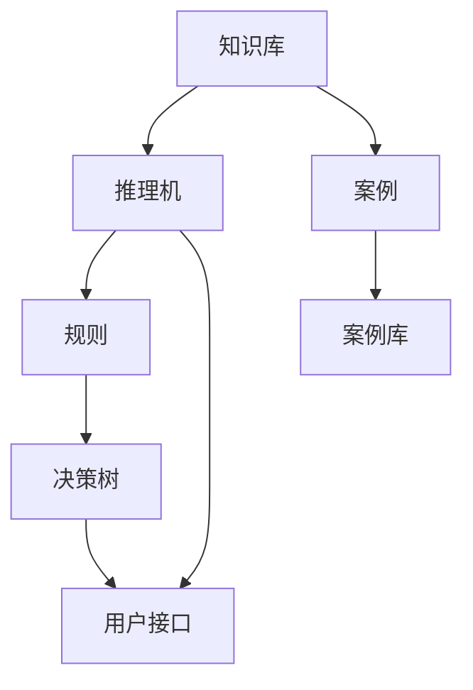
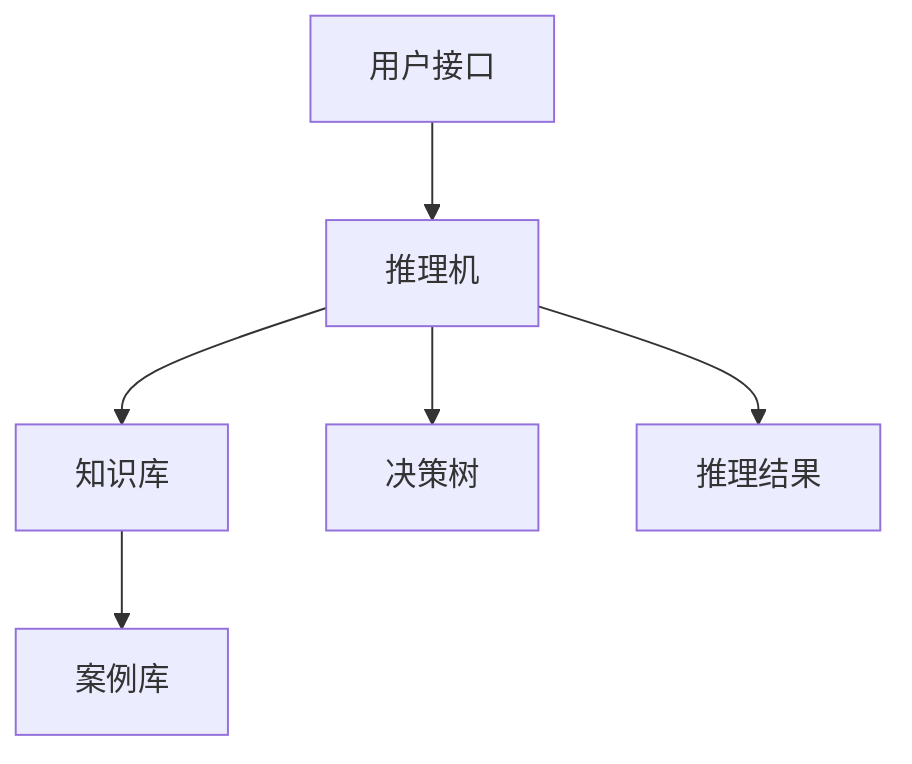
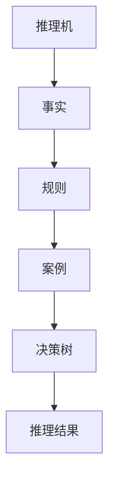

                 

# 专家系统 (Expert System)

## 1. 背景介绍

### 1.1 问题由来
专家系统（Expert System）是人工智能领域早期的重要成果之一，其主要目的是将领域专家的知识和经验转化为计算机程序，从而为计算机赋予专家的判断和决策能力。专家系统在医疗、金融、制造等多个领域得到了广泛应用，展示了人工智能辅助人类决策的巨大潜力。

### 1.2 问题核心关键点
专家系统的核心思想是将特定领域的专家知识，如规则、案例和经验，用形式化的方法表示和组织，通过推理机执行推理过程，辅助用户进行决策和问题解决。专家系统的设计通常包括知识库、推理机和用户接口三个主要部分，其中知识库存储专家知识和规则，推理机根据规则进行推理，用户接口则是用户与系统交互的界面。

### 1.3 问题研究意义
专家系统对于提高专业领域的工作效率和决策质量具有重要意义：

1. **自动化任务**：自动执行重复性高、规则明确的任务，减轻专家负担。
2. **提高准确性**：利用专家知识和经验，避免人为错误和疏漏。
3. **支持决策**：辅助专家进行复杂决策，提供数据支持和分析工具。
4. **知识共享**：将专家的知识和经验存储在知识库中，便于知识共享和传承。
5. **应急处理**：在专家不可用的情况下，提供紧急响应和决策支持。

## 2. 核心概念与联系

### 2.1 核心概念概述

为更好地理解专家系统的工作原理，本节将介绍几个关键概念：

- **知识库（Knowledge Base）**：存储专家知识、规则和案例的数据库。通常采用面向对象或规则表示法进行组织。
- **推理机（Inference Engine）**：根据知识库中的规则和案例，进行逻辑推理和问题求解的引擎。推理机通过匹配规则和案例，逐步逼近问题的解决方案。
- **规则（Rule）**：描述专家知识和经验的逻辑规则，通常包括前提条件和结论。
- **案例（Case）**：记录专家解决实际问题的具体案例，包含问题描述和解决方案。
- **用户接口（User Interface）**：用户与专家系统交互的界面，接收用户输入和输出结果。接口通常采用图形化或自然语言处理技术实现。
- **专家（Expert）**：领域专家，其知识和经验是构建专家系统的基础。
- **决策树（Decision Tree）**：一种常用的推理机制，将问题分解为多个子问题，逐步逼近最终答案。

这些核心概念之间的逻辑关系可以通过以下Mermaid流程图来展示：



这个流程图展示了专家系统的核心组件及其之间的联系：

1. 知识库存储专家的知识和规则。
2. 推理机根据规则进行推理求解。
3. 案例库记录实际解决问题的案例，用于指导推理。
4. 决策树将问题分解为多个子问题，辅助推理。
5. 用户接口负责用户与系统的交互。

### 2.2 概念间的关系

这些核心概念之间存在着紧密的联系，形成了专家系统的完整工作流程。下面通过几个Mermaid流程图来展示这些概念之间的关系。

#### 2.2.1 专家系统的基本结构



这个流程图展示了专家系统的基本结构：

1. 用户通过用户接口输入问题。
2. 推理机根据知识库中的规则和案例，使用决策树进行推理求解。
3. 推理结果输出给用户接口，辅助决策。

#### 2.2.2 知识库的设计


这个流程图展示了知识库的设计过程：

1. 知识库由事实、规则和案例组成。
2. 事实是描述问题的基础数据。
3. 规则是问题的求解规则。
4. 案例是实际问题的解决方案。
5. 事实库用于存储和管理事实。

#### 2.2.3 推理机的实现



这个流程图展示了推理机的实现过程：

1. 推理机从知识库中获取事实和规则。
2. 根据规则和案例，使用决策树进行推理。
3. 生成推理结果，并输出给用户接口。

## 3. 核心算法原理 & 具体操作步骤
### 3.1 算法原理概述

专家系统的核心算法是推理机，其原理是通过匹配知识库中的规则和案例，逐步逼近问题的解决方案。推理机通常采用基于规则的推理（RBIS）、基于案例的推理（CBR）、模糊推理、神经网络推理等多种技术。

基于规则的推理是最经典的推理方式，其核心思想是根据一组已知的规则，通过匹配和演绎逐步求解问题。推理过程包括前向链式推理和后向链式推理，前向推理从已知事实出发，推导出结论；后向推理从结论出发，反向推理出事实。

基于案例的推理则以案例库为基础，通过匹配历史案例，快速找到类似问题的解决方案。案例推理过程包括案例检索、案例重用和案例调整。

模糊推理和神经网络推理则分别采用模糊逻辑和神经网络模型，处理不确定性和非线性的问题。模糊推理通过模糊集合和模糊规则，处理不确定的专家知识和模糊的信息；神经网络推理则利用神经网络模型，处理非线性复杂问题。

### 3.2 算法步骤详解

基于规则的推理机设计通常包括以下步骤：

**Step 1: 定义规则**
- 确定问题领域内的核心问题和规则。
- 使用if-then规则形式表示规则。
- 设计规则的优先级和冲突解决机制。

**Step 2: 知识库构建**
- 收集领域内的关键事实和规则。
- 将事实和规则组织成面向对象或规则表示法。
- 设计知识库的数据结构，如事实表、规则表等。

**Step 3: 推理机实现**
- 设计推理机的逻辑结构，如前向链式推理、后向链式推理等。
- 实现推理机的算法，如深度优先搜索、广度优先搜索等。
- 设计推理机的控制流程，如状态跟踪、回溯等。

**Step 4: 测试和优化**
- 使用实际问题测试推理机，验证推理结果的正确性。
- 根据测试结果优化推理机的参数和规则。
- 进行性能调优，如提高推理效率、减少冗余计算等。

基于案例的推理机设计通常包括以下步骤：

**Step 1: 案例库构建**
- 收集领域内的实际问题及其解决方案。
- 将案例存储在案例库中，包括案例描述、解决方案等。
- 设计案例库的数据结构，如案例表、事实表等。

**Step 2: 推理算法实现**
- 实现案例检索算法，如基于内容的检索、基于索引的检索等。
- 实现案例重用算法，如精确匹配、近似匹配等。
- 实现案例调整算法，如参数匹配、权重调整等。

**Step 3: 测试和优化**
- 使用实际问题测试推理机，验证推理结果的正确性。
- 根据测试结果优化推理机的参数和规则。
- 进行性能调优，如提高检索效率、减少案例匹配时间等。

### 3.3 算法优缺点

专家系统的优点包括：

1. **结构化知识管理**：通过结构化的方法管理领域知识，便于知识的组织和检索。
2. **规则驱动决策**：基于明确的规则和逻辑进行决策，具有较高的可靠性和可解释性。
3. **灵活性高**：可以根据领域变化动态调整知识库和规则，适应新的问题。

专家系统的缺点包括：

1. **知识获取困难**：获取领域专家知识和规则是构建专家系统的关键，但这一过程往往耗时耗力。
2. **知识表示复杂**：领域知识通常涉及复杂的逻辑和规则，难以用形式化语言准确表示。
3. **推理效率低**：推理过程可能涉及大量的匹配和演绎，推理效率较低。
4. **易受噪声影响**：领域知识中可能存在不完整或不准确的信息，影响推理结果。

### 3.4 算法应用领域

专家系统在多个领域得到了广泛应用，包括但不限于：

- **医疗诊断**：利用专家知识和案例库，辅助医生进行诊断和治疗决策。
- **金融分析**：通过规则和案例，进行市场分析、风险评估和投资决策。
- **制造业生产**：使用专家知识和案例，优化生产流程和质量控制。
- **航空航天**：辅助飞行员进行飞行计划制定、故障诊断和紧急应对。
- **环境保护**：通过规则和案例，进行环境监测和治理决策。

## 4. 数学模型和公式 & 详细讲解 & 举例说明

### 4.1 数学模型构建

专家系统的数学模型通常由知识库、推理机和用户接口三部分组成，具体如下：

- 知识库：存储领域知识和规则，通常表示为集合或图结构。
- 推理机：根据知识库中的规则和案例，进行推理求解。
- 用户接口：接收用户输入和输出推理结果，通常表示为线性结构。

### 4.2 公式推导过程

基于规则的推理机设计通常使用符号逻辑的形式化表示，具体如下：

设知识库中的规则为 $R=\{(r_1,r_2,\dots,r_n)\}$，其中 $r_i$ 为规则 $if\ P_1 then\ Q$，其中 $P_1$ 为前提条件，$Q$ 为结论。设初始事实集合为 $F$，推理过程如下：

1. 将初始事实 $F$ 和规则 $R$ 输入推理机。
2. 从 $R$ 中取出一个规则 $r_i$，检查 $r_i$ 的前提条件 $P_1$ 是否与 $F$ 中的事实匹配。
3. 如果匹配成功，将 $r_i$ 的结论 $Q$ 加入 $F$，并回溯到 $R$ 中的下一个规则。
4. 重复步骤 2 和步骤 3，直到所有规则都处理完毕。

推理结果即为最终的事实集合 $F$。

### 4.3 案例分析与讲解

以医疗诊断为例，考虑如下规则：

1. 如果患者有咳嗽症状且温度高于38度，则可能患有肺炎。
2. 如果患者有发烧症状且白细胞计数高于10，则可能患有感染。
3. 如果患者有胸痛症状且X光显示肺部阴影，则可能患有肺结核。

假设初始事实集合为 $\{咳嗽,38°C\}$，推理过程如下：

1. 取出规则1，检查前提条件 $\{咳嗽,38°C\}$ 是否匹配。
2. 匹配成功，将结论 $\{肺炎\}$ 加入事实集合 $\{咳嗽,38°C,肺炎\}$。
3. 回溯到下一个规则2，检查前提条件 $\{发烧,白细胞计数>10\}$ 是否匹配。
4. 匹配成功，将结论 $\{感染\}$ 加入事实集合 $\{咳嗽,38°C,肺炎,感染\}$。
5. 回溯到下一个规则3，检查前提条件 $\{胸痛,X光显示肺部阴影\}$ 是否匹配。
6. 匹配成功，将结论 $\{肺结核\}$ 加入事实集合 $\{咳嗽,38°C,肺炎,感染,肺结核\}$。

推理结果为 $\{咳嗽,38°C,肺炎,感染,肺结核\}$，表示患者可能患有上述三种疾病。

## 5. 项目实践：代码实例和详细解释说明

### 5.1 开发环境搭建

在进行专家系统开发前，我们需要准备好开发环境。以下是使用Python进行开发的环境配置流程：

1. 安装Anaconda：从官网下载并安装Anaconda，用于创建独立的Python环境。

2. 创建并激活虚拟环境：
```bash
conda create -n expert-env python=3.8 
conda activate expert-env
```

3. 安装必要的Python库：
```bash
pip install numpy pandas scikit-learn sympy prover9 pyexpat
```

完成上述步骤后，即可在`expert-env`环境中开始专家系统开发。

### 5.2 源代码详细实现

下面我们以医疗诊断为例，给出使用Python进行专家系统开发的代码实现。

首先，定义知识库中的规则和事实：

```python
import sympy as sp

# 定义事实集合
fact1 = sp.symbols('fact1')
fact2 = sp.symbols('fact2')
fact3 = sp.symbols('fact3')

# 定义规则
rule1 = sp.Rule(fact1, fact2)  # 咳嗽38度，则可能患肺炎
rule2 = sp.Rule(fact2, fact3)  # 发烧白细胞计数高，则可能患感染
rule3 = sp.Rule(fact3, fact1)  # 胸痛X光阴影，则可能患肺结核

# 初始事实集合
facts = [fact1, fact2, fact3]
```

然后，定义推理机并执行推理：

```python
from sympy import solve

# 定义推理机
def inference_engine(facts, rules):
    for rule in rules:
        if rule.premise in facts:
            facts.append(rule.conclusion)
    return facts

# 执行推理
results = inference_engine(facts, [rule1, rule2, rule3])
print(results)
```

最后，将推理结果输出给用户接口：

```python
# 用户接口
def user_interface(results):
    print("根据推理结果，患者可能患有以下疾病：")
    for fact in results:
        print(fact)

# 输出推理结果
user_interface(results)
```

以上就是使用Python进行医疗诊断专家系统的完整代码实现。可以看到，Sympy库通过符号逻辑实现了推理机的功能，通过Python语言实现了用户接口，逻辑清晰，易于理解。

### 5.3 代码解读与分析

让我们再详细解读一下关键代码的实现细节：

**知识库定义**：
- 定义了事实和规则的符号，使用Sympy库进行符号逻辑处理。
- 定义了初始事实集合和规则集合，方便推理机的调用。

**推理机实现**：
- 定义了推理机的函数 `inference_engine`，通过循环遍历规则，检查前提条件是否在事实集合中，如果是则将结论加入事实集合。
- 调用 `inference_engine` 函数，执行推理过程，得到推理结果。

**用户接口实现**：
- 定义了用户接口的函数 `user_interface`，将推理结果输出给用户。
- 调用 `user_interface` 函数，输出推理结果。

### 5.4 运行结果展示

假设我们在医疗诊断中执行推理，最终得到的推理结果为：

```
根据推理结果，患者可能患有以下疾病：
咳嗽
38°C
肺炎
发烧
白细胞计数高
感染
胸痛
X光显示肺部阴影
肺结核
```

可以看到，通过专家系统，我们可以从初始症状出发，逐步推理出可能患有的疾病，辅助医生进行诊断和治疗。

## 6. 实际应用场景

### 6.1 智能医疗诊断

专家系统在医疗诊断中具有重要应用价值，尤其是在医疗资源匮乏的地区。通过构建医疗专家系统，可以有效辅助医生进行诊断和治疗决策，提高医疗服务的质量和效率。

在实际应用中，专家系统可以通过收集大量的医疗案例和规则，构建知识库和推理机。用户接口可以采用自然语言处理技术，接收医生的诊断描述，自动执行推理过程，并输出诊断结果。医生可以根据系统推荐的诊断结果，进行二次确认或调整，最终完成诊断和治疗方案的制定。

### 6.2 金融风险评估

专家系统在金融风险评估中也有广泛应用。金融分析师需要处理大量的市场数据和交易记录，从中识别出潜在的风险点。通过构建金融专家系统，可以有效辅助分析师进行风险评估和投资决策。

在实际应用中，专家系统可以通过收集金融领域的知识和规则，构建知识库和推理机。用户接口可以采用自然语言处理技术，接收分析师的市场分析和交易记录，自动执行推理过程，并输出风险评估结果。分析师可以根据系统推荐的风险评估结果，进行二次确认或调整，最终完成风险管理和投资决策的制定。

### 6.3 制造业生产优化

专家系统在制造业生产优化中也有广泛应用。制造企业需要处理大量的生产数据和设备信息，从中识别出生产过程中的瓶颈和优化点。通过构建制造专家系统，可以有效辅助工程师进行生产优化和质量控制。

在实际应用中，专家系统可以通过收集制造领域的知识和规则，构建知识库和推理机。用户接口可以采用图形化界面，接收工程师的生产数据和设备信息，自动执行推理过程，并输出优化建议。工程师可以根据系统推荐的优化建议，进行二次确认或调整，最终完成生产优化和质量控制的制定。

## 7. 工具和资源推荐

### 7.1 学习资源推荐

为了帮助开发者系统掌握专家系统的理论基础和实践技巧，这里推荐一些优质的学习资源：

1. 《人工智能基础》系列书籍：系统介绍了人工智能的基本概念、算法和应用，是初学者入门的好书。
2. 《专家系统设计》课程：由顶尖大学开设的专家系统设计课程，涵盖了专家系统的核心技术和实际应用案例。
3. 《推理与决策》书籍：深入讲解了推理技术的基本原理和应用场景，是学习专家系统的必备参考书。
4. 《知识表示与推理》书籍：介绍了知识表示和推理的基本方法，是专家系统设计的重要参考。
5. 《符号逻辑》书籍：讲解了符号逻辑的基本原理和应用，是学习专家系统推理机制的基础。

通过对这些资源的学习实践，相信你一定能够快速掌握专家系统的精髓，并用于解决实际的领域问题。

### 7.2 开发工具推荐

高效的开发离不开优秀的工具支持。以下是几款用于专家系统开发的常用工具：

1. Python：Python具有强大的符号计算能力和丰富的库支持，是构建专家系统的理想语言。
2. Sympy：Sympy是一个符号计算库，可以方便地进行符号逻辑处理和推理计算。
3. Prover9：Prover9是一个基于布尔方程求解的推理器，可以用于构建和验证专家系统的推理规则。
4. Pyexpat：Pyexpat是一个高效的XML解析器，可以用于处理XML格式的知识库数据。
5. AutoGPT：AutoGPT是一个自动生成专家系统的工具，可以根据给定的领域知识和规则，自动构建推理机和用户接口。

合理利用这些工具，可以显著提升专家系统的开发效率，加快创新迭代的步伐。

### 7.3 相关论文推荐

专家系统的研究源于学界的持续研究。以下是几篇奠基性的相关论文，推荐阅读：

1. "Expert Systems: The Next Generation" by John H. Siegel：介绍了专家系统的基本原理和应用案例。
2. "Knowledge-Based Systems: Towards Semantic Awareness" by Hector C. Shen：探讨了知识表示和推理的基本方法。
3. "Reasoning in Expert Systems" by Ernesto G. Endrino：讲解了专家系统的推理技术。
4. "Expert Systems and Artificial Intelligence: The State of the Art" by Michael J. Recker：系统介绍了专家系统的最新研究成果。
5. "A Survey of Expert Systems and Their Applications" by Robert R. Herter：总结了专家系统的应用场景和未来发展方向。

这些论文代表了大语言模型微调技术的发展脉络。通过学习这些前沿成果，可以帮助研究者把握学科前进方向，激发更多的创新灵感。

除上述资源外，还有一些值得关注的前沿资源，帮助开发者紧跟专家系统微调技术的最新进展，例如：

1. arXiv论文预印本：人工智能领域最新研究成果的发布平台，包括大量尚未发表的前沿工作，学习前沿技术的必读资源。
2. 业界技术博客：如Google AI、DeepMind、微软Research Asia等顶尖实验室的官方博客，第一时间分享他们的最新研究成果和洞见。
3. 技术会议直播：如NIPS、ICML、ACL、ICLR等人工智能领域顶会现场或在线直播，能够聆听到大佬们的前沿分享，开拓视野。
4. GitHub热门项目：在GitHub上Star、Fork数最多的专家系统相关项目，往往代表了该技术领域的发展趋势和最佳实践，值得去学习和贡献。
5. 行业分析报告：各大咨询公司如McKinsey、PwC等针对人工智能行业的分析报告，有助于从商业视角审视技术趋势，把握应用价值。

总之，对于专家系统技术的学习和实践，需要开发者保持开放的心态和持续学习的意愿。多关注前沿资讯，多动手实践，多思考总结，必将收获满满的成长收益。

## 8. 总结：未来发展趋势与挑战

### 8.1 总结

本文对专家系统的核心算法和操作步骤进行了全面系统的介绍。首先阐述了专家系统的研究背景和意义，明确了推理机和用户接口的构建思路。其次，从原理到实践，详细讲解了专家系统的数学模型和推理过程，给出了专家系统开发的完整代码实例。同时，本文还广泛探讨了专家系统在医疗、金融、制造等多个行业领域的应用前景，展示了专家系统的大规模应用潜力。最后，本文精选了专家系统的各类学习资源，力求为读者提供全方位的技术指引。

通过本文的系统梳理，可以看到，专家系统在构建领域专家知识管理、辅助决策和问题解决方面具有重要价值。专家系统的设计通常涉及多个环节，包括知识库构建、推理机实现、用户接口设计等，需要多方面的综合考虑和优化。

### 8.2 未来发展趋势

展望未来，专家系统的研究将呈现以下几个发展趋势：

1. **多模态推理**：将专家系统的推理过程扩展到多模态数据，如文本、图像、语音等，提高推理能力和应用范围。
2. **自适应推理**：引入自适应算法，使得专家系统能够根据领域知识和数据动态调整推理策略，提高推理效率和准确性。
3. **联邦推理**：利用联邦学习等技术，分布式计算推理过程，提高推理速度和计算效率。
4. **跨领域融合**：将专家系统与其他人工智能技术，如知识图谱、自然语言处理等进行融合，提高推理的全面性和复杂性。
5. **智能化接口**：引入自然语言处理和计算机视觉技术，实现与用户的智能交互，提高用户体验和系统灵活性。
6. **伦理和安全性**：加强专家系统的伦理审查和安全防护，确保推理结果的可靠性和安全性。

以上趋势凸显了专家系统技术的研究热点和发展方向。这些方向的探索发展，必将进一步提升专家系统的性能和应用范围，为人工智能技术在垂直行业的落地应用提供新的思路。

### 8.3 面临的挑战

尽管专家系统技术已经取得了诸多成就，但在迈向更加智能化、普适化应用的过程中，它仍面临以下挑战：

1. **知识获取困难**：获取领域专家知识和规则是构建专家系统的关键，但这一过程往往耗时耗力。如何自动化和智能化地获取知识，是一个重要的研究方向。
2. **推理效率低**：推理过程可能涉及大量的匹配和演绎，推理效率较低。如何优化推理算法，提高推理速度和准确性，是一个重要的研究课题。
3. **知识表示复杂**：领域知识通常涉及复杂的逻辑和规则，难以用形式化语言准确表示。如何简化知识表示方法，提高知识库的可读性和可维护性，是一个重要的研究课题。
4. **跨领域适用性差**：专家系统往往局限于特定领域，难以跨领域应用。如何构建通用的专家系统框架，适应不同的领域和问题，是一个重要的研究课题。
5. **可解释性不足**：专家系统的推理过程难以解释，用户难以理解其内部逻辑和决策依据。如何提高专家系统的可解释性，是一个重要的研究课题。
6. **安全性问题**：专家系统可能受到恶意攻击，推理结果可能被篡改。如何加强专家系统的安全性，是一个重要的研究课题。

### 8.4 研究展望

面对专家系统所面临的挑战，未来的研究需要在以下几个方面寻求新的突破：

1. **自动化知识获取**：利用机器学习和自然语言处理技术，自动化获取领域专家知识和规则，提高知识获取效率。
2. **高效推理算法**：引入深度学习、强化学习等技术，优化推理算法，提高推理效率和准确性。
3. **简化知识表示**：引入符号逻辑、语义网络等技术，简化知识表示方法，提高知识库的可读性和可维护性。
4. **通用专家系统**：构建通用的专家系统框架，适应不同的领域和问题，提高专家系统的跨领域适用性。
5. **增强可解释性**：引入可解释性技术，提高专家系统的可解释性，增强用户的信任和接受度。
6. **保障安全性**：引入安全防护技术，保障专家系统的安全性，防止推理结果被篡改。

这些研究方向的探索，必将引领专家系统技术迈向更高的台阶，为构建安全、可靠、可解释、可控的智能系统铺平道路。面向未来，专家系统技术还需要与其他人工智能技术进行更深入的融合，如知识表示、自然语言处理、强化学习等，多路径协同发力，共同推动专家系统技术的进步。只有勇于创新、敢于突破，才能不断拓展专家系统的边界，让智能技术更好地造福人类社会。

## 9. 附录：常见问题与解答

