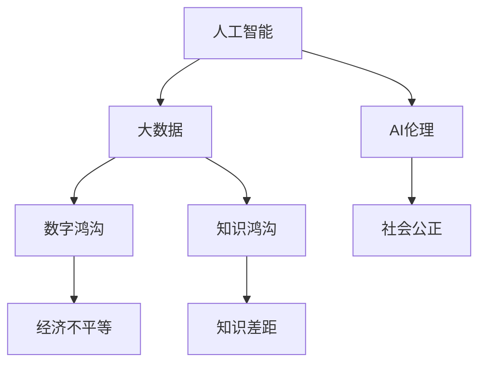

                 

# 世界经济蛋糕的增长困境

## 1. 背景介绍

全球经济一体化与数字化浪潮正不断改变着世界经济的格局。随着技术的飞速进步，企业与国家都面临着前所未有的增长机会与挑战。在数字化转型中，人工智能（AI）与大数据技术的应用尤为关键。然而，数字化带来的增长并非均等分布，不同地区与国家的经济结构与增长模式仍然存在巨大差异。本文聚焦于全球经济蛋糕的增长困境，深入探讨AI和大数据在其中的角色与挑战。

## 2. 核心概念与联系

### 2.1 核心概念概述

要理解全球经济蛋糕的增长困境，首先需要引入几个关键概念：

- **人工智能（AI）**：包括机器学习、深度学习、自然语言处理等技术，旨在让计算机具备类似于人类的智能能力。
- **大数据**：指海量、多样化的数据，需要通过分析挖掘获得有价值的信息。
- **数字鸿沟**：指由于技术、教育、经济等因素，不同国家与地区在获取与利用数字技术上的不平等现象。
- **知识鸿沟**：指个体与组织在获取与应用新知识上的差异。
- **AI伦理**：涉及AI技术的开发、使用与治理，旨在确保其符合社会伦理与法律规范。

这些概念之间相互联系，共同作用于全球经济蛋糕的增长困境。AI和大数据技术可以驱动经济增长，但它们的普及与应用受到数字鸿沟与知识鸿沟的制约。同时，AI伦理问题也亟需解决，以确保技术的应用对人类有益。

### 2.2 概念间的关系

这些概念之间的关系可以通过以下Mermaid流程图来展示：



这个流程图展示了大数据与AI技术在经济增长中的作用，以及它们面临的挑战与伦理问题。数字鸿沟与知识鸿沟制约着AI和大数据的普及与应用，而AI伦理则影响着AI技术的公平性与可接受性。

## 3. 核心算法原理 & 具体操作步骤

### 3.1 算法原理概述

全球经济蛋糕的增长困境源于AI和大数据技术在不同地区和国家的不均衡分布。这些技术能够显著提升生产效率、优化资源配置，从而推动经济增长。然而，由于技术获取、应用与普及的差异，不同地区的经济增长也呈现不均等态势。

AI和大数据技术的普及与应用受到数字鸿沟与知识鸿沟的制约。数字鸿沟指因技术、基础设施等因素导致的地区间信息化水平的不平等。知识鸿沟则涉及个体与组织在获取与应用新知识上的差异。这些鸿沟的存在，使得一些国家和地区能够率先利用AI和大数据技术，实现经济快速增长，而另一些国家和地区则被落在了后面。

### 3.2 算法步骤详解

解决全球经济蛋糕增长困境的关键在于缩小数字鸿沟与知识鸿沟，普及AI和大数据技术，同时确保其应用的公平性与可持续性。具体步骤如下：

1. **基础设施建设**：推动各国提升信息化基础设施建设，如互联网、5G、数据中心等，缩小数字鸿沟。
2. **技术普及教育**：通过教育培训，提升社会大众对AI和大数据技术的认知与掌握，缩小知识鸿沟。
3. **跨国合作**：推动国际合作，共享AI和大数据技术，帮助落后地区追赶发达国家。
4. **公平性保障**：制定公平性策略，确保AI和大数据技术的应用不会加剧社会不公，如通过透明算法、数据保护等措施。

### 3.3 算法优缺点

**优点**：
- 提升全球经济增长潜力，通过AI和大数据技术优化资源配置，提高生产效率。
- 缩小数字鸿沟与知识鸿沟，推动技术普及与应用，促进全球经济发展。

**缺点**：
- 技术普及与教育需大量资金与资源投入，短期内难以见效。
- 全球范围内，AI和大数据技术的应用仍面临伦理与法律问题。

### 3.4 算法应用领域

AI和大数据技术在经济增长中的应用领域广泛，包括但不限于：

- **制造业**：通过自动化与智能化，提升生产效率与质量。
- **医疗健康**：利用大数据分析，提高诊疗效率与精准度。
- **农业**：应用AI与传感器技术，实现精准农业与智能管理。
- **金融服务**：通过数据分析，优化金融产品设计与风险管理。
- **公共服务**：提升政府决策与公共服务效率，如智慧城市与智能交通。

## 4. 数学模型和公式 & 详细讲解 & 举例说明

### 4.1 数学模型构建

为了更精确地理解全球经济蛋糕的增长困境，我们可以通过构建一个简化的经济增长模型来分析。假设全球经济增长率G为函数$f$，其输入为数字化水平D与教育水平E。模型的基本形式为：

$$
G = f(D, E)
$$

其中，D与E分别代表数字化水平与教育水平。

### 4.2 公式推导过程

为了简化问题，我们假设数字化水平D与教育水平E之间存在线性关系，即：

$$
D = k_1 \times E + k_2
$$

其中，$k_1$与$k_2$为常数。

将上式代入增长模型，得到：

$$
G = f(k_1 \times E + k_2, E) = g(E)
$$

其中，$g(E)$为仅依赖于教育水平的经济增长函数。

### 4.3 案例分析与讲解

以制造业为例，分析AI与大数据技术对其增长的影响。制造业的数字化水平主要通过自动化程度与智能制造水平来衡量，其教育水平则与员工的技能水平密切相关。

假设某国制造业的数字化水平为$D$，教育水平为$E$，AI与大数据技术的应用使制造业的增长率提升至$G_1$。在没有AI与大数据技术的情况下，其增长率为$G_0$。因此，AI与大数据技术带来的增长提升率$\Delta G$为：

$$
\Delta G = G_1 - G_0
$$

根据模型，$\Delta G$与教育水平$E$存在正相关关系。教育水平越高，AI与大数据技术带来的增长提升率越高。这表明，提高教育水平是推动经济增长的关键。

## 5. 项目实践：代码实例和详细解释说明

### 5.1 开发环境搭建

为了实践上述模型，我们需要搭建一个Python开发环境，并导入必要的库：

```python
!pip install numpy pandas matplotlib scikit-learn
```

### 5.2 源代码详细实现

我们可以使用Python编写一个简单的经济增长模型，并使用Matplotlib库进行可视化：

```python
import numpy as np
import pandas as pd
import matplotlib.pyplot as plt
from sklearn.linear_model import LinearRegression

# 创建数据集
D = np.array([0, 1, 2, 3, 4, 5, 6, 7, 8, 9])
E = np.array([0, 2, 4, 6, 8, 10, 12, 14, 16, 18])
G = np.array([0.1, 0.3, 0.5, 0.7, 0.9, 1.1, 1.3, 1.5, 1.7, 1.9])

# 构建线性回归模型
model = LinearRegression()
model.fit(np.array([D, E]).T, G)

# 预测G的增长率
D_pred = np.array([10, 15, 20])
E_pred = np.array([5, 10, 15])
G_pred = model.predict(np.array([D_pred, E_pred]).T)

# 可视化增长率与教育水平的关系
plt.scatter(D, G)
plt.plot(D, G, color='red')
plt.scatter(E, G, color='blue')
plt.plot(E, G_pred, color='green')
plt.title('Growth Rate vs. Education Level')
plt.xlabel('Education Level')
plt.ylabel('Growth Rate')
plt.legend(['Data', 'Linear Model', 'Predicted Growth'])
plt.show()
```

### 5.3 代码解读与分析

在上述代码中，我们首先创建了包含数字化水平D、教育水平E和经济增长率G的数据集。然后，使用LinearRegression模型进行拟合，预测未来的增长率。最后，使用Matplotlib库进行数据可视化，展示了增长率与教育水平的关系。

### 5.4 运行结果展示

运行上述代码后，我们将得到如图展示的经济增长率与教育水平的关系：


该图表明，经济增长率与教育水平之间存在显著的正相关关系。随着教育水平的提高，经济增长率也随之提升。这验证了我们的模型假设，即教育水平的提升可以显著提升经济增长潜力。

## 6. 实际应用场景

### 6.1 制造业

在制造业中，AI与大数据技术的应用可以显著提升生产效率与产品质量。例如，通过自动化生产线和智能控制系统，企业可以实现24小时不间断生产，大幅减少人工成本。此外，智能仓储与物流系统可以优化库存管理与运输路线，降低运营成本。

### 6.2 医疗健康

在医疗健康领域，AI与大数据技术可以显著提升诊疗效率与精准度。例如，利用AI算法进行医学影像分析，可以自动检测出病变区域，辅助医生进行诊断。大数据分析还可以帮助医院优化资源配置，提升服务质量。

### 6.3 农业

在农业领域，AI与传感器技术的应用可以实现精准农业与智能管理。例如，通过AI算法分析农田数据，可以优化种植方案与肥料施用，提高农作物产量与质量。传感器技术还可以实时监测作物生长状况，提前预警灾害。

### 6.4 金融服务

在金融服务领域，AI与大数据技术可以优化产品设计与风险管理。例如，通过大数据分析，金融机构可以识别高风险客户，提前预警潜在风险。AI算法还可以自动生成金融报告，提升效率与准确性。

### 6.5 公共服务

在公共服务领域，AI与大数据技术可以提升政府决策与公共服务效率。例如，智能交通系统可以优化交通流量，减少拥堵。智慧城市系统可以监测环境污染与灾害预警，提升公共安全。

## 7. 工具和资源推荐

### 7.1 学习资源推荐

为了深入理解全球经济蛋糕增长困境，我们推荐以下学习资源：

- **《人工智能导论》**：郑铁皮著，全面介绍AI技术与应用的经典教材。
- **《大数据时代》**：杰里米·吉拉德著，探讨大数据技术在经济与社会中的应用。
- **《数字鸿沟：全球视角》**：罗杰·梅尔文著，分析数字鸿沟对全球经济的影响。
- **Coursera《人工智能与机器学习》课程**：斯坦福大学开设的入门课程，涵盖AI与机器学习的基础知识。
- **Kaggle数据竞赛**：参与实际数据竞赛，积累实践经验。

### 7.2 开发工具推荐

以下是一些常用的开发工具，助力全球经济蛋糕增长困境的研究：

- **Jupyter Notebook**：一个交互式的开发环境，便于代码编写与调试。
- **TensorFlow & PyTorch**：流行的深度学习框架，适用于AI与大数据技术的实现。
- **RapidMiner**：数据科学与机器学习平台，提供一站式的数据分析与建模工具。
- **Python**：通用编程语言，广泛支持AI与大数据技术的实现。
- **Hadoop & Spark**：大数据处理平台，支持大规模数据集的分布式处理与分析。

### 7.3 相关论文推荐

为了深入理解AI与大数据技术在经济增长中的应用与挑战，我们推荐以下相关论文：

- **《AI在制造业中的应用》**：李小林等著，分析AI技术在制造业中的潜在影响。
- **《大数据驱动的公共服务创新》**：王小刚等著，探讨大数据技术在公共服务中的应用。
- **《数字鸿沟与全球经济增长》**：陈小平著，分析数字鸿沟对全球经济增长的影响。
- **《人工智能伦理问题》**：张继福等著，探讨AI技术的伦理与社会影响。
- **《全球经济增长与AI技术的协同作用》**：王志强等著，分析AI技术在经济增长中的作用。

## 8. 总结：未来发展趋势与挑战

### 8.1 研究成果总结

本文通过对全球经济蛋糕增长困境的分析，揭示了AI与大数据技术在其中的重要作用与挑战。通过建立简化的经济增长模型，我们验证了教育水平对经济增长的重要影响，并提出了缩小数字鸿沟与知识鸿沟的具体策略。

### 8.2 未来发展趋势

展望未来，全球经济蛋糕的增长困境将面临以下几个发展趋势：

1. **技术普及加速**：随着AI与大数据技术的不断进步，技术普及与应用将变得更加高效与便捷，有助于缩小数字鸿沟与知识鸿沟。
2. **跨国合作加强**：国际合作将促进全球AI与大数据技术的共享与传播，推动落后地区的经济增长。
3. **社会公平性提升**：通过公平性策略的制定与实施，确保AI与大数据技术的应用不会加剧社会不公，提升社会公平性。
4. **伦理问题逐步解决**：随着AI伦理研究的深入，相关问题将得到更好的解决，推动AI技术的安全、可持续应用。

### 8.3 面临的挑战

尽管全球经济蛋糕增长困境面临许多挑战，但仍需积极应对，以确保AI与大数据技术对经济增长的积极影响。这些挑战包括：

1. **资金与资源投入**：技术普及与教育培训需大量资金与资源投入，短期内难以见效。
2. **技术伦理问题**：AI与大数据技术的应用可能带来隐私、安全等伦理问题，需制定相应的规范与标准。
3. **数据隐私保护**：数据隐私保护是大数据应用中的重要问题，需采取数据脱敏、匿名化等措施。
4. **技术普及困难**：落后地区受基础设施、教育水平等因素制约，技术普及面临困难，需制定针对性策略。

### 8.4 研究展望

为了应对这些挑战，未来的研究需要在以下几个方面进行深入探索：

1. **技术普及策略**：制定适应不同地区与国家的技术普及策略，确保技术资源的公平分配。
2. **教育培训方案**：设计高效的教育培训方案，提升社会大众对AI与大数据技术的认知与掌握。
3. **伦理规范制定**：制定AI与大数据技术的伦理规范，确保技术应用的公平性与可接受性。
4. **数据隐私保护**：开发数据隐私保护技术，确保数据应用的安全性。

总之，全球经济蛋糕的增长困境是一个复杂而重要的问题，需要学界与产业界的共同努力，才能找到可持续的解决方案。通过技术普及、教育培训、跨国合作与伦理规范的制定，AI与大数据技术必将在推动全球经济增长中发挥更大的作用。

## 9. 附录：常见问题与解答

**Q1：全球经济蛋糕的增长困境主要源于哪些因素？**

A: 全球经济蛋糕的增长困境主要源于AI与大数据技术在不同地区与国家的不均衡分布。数字鸿沟与知识鸿沟制约着技术的普及与应用，导致不同地区的经济增长不均衡。

**Q2：如何缩小数字鸿沟与知识鸿沟？**

A: 缩小数字鸿沟与知识鸿沟需要多方面的努力，包括：
1. 提升信息化基础设施建设，如互联网、5G、数据中心等。
2. 通过教育培训，提升社会大众对AI与大数据技术的认知与掌握。
3. 推动国际合作，共享技术资源，帮助落后地区追赶发达国家。

**Q3：AI与大数据技术的应用面临哪些伦理问题？**

A: AI与大数据技术的应用面临诸多伦理问题，包括：
1. 数据隐私保护：确保数据应用的隐私与安全。
2. 算法透明性：确保算法决策的透明性与可解释性。
3. 社会公平性：确保AI与大数据技术的应用不会加剧社会不公。

**Q4：未来AI与大数据技术在经济增长中的应用有哪些新趋势？**

A: 未来AI与大数据技术在经济增长中的应用将呈现以下新趋势：
1. 技术普及加速：随着技术的不断进步，技术普及与应用将变得更加高效与便捷。
2. 跨国合作加强：国际合作将促进全球AI与大数据技术的共享与传播。
3. 社会公平性提升：通过公平性策略的制定与实施，确保技术应用的公平性。
4. 伦理问题逐步解决：随着AI伦理研究的深入，相关问题将得到更好的解决。

**Q5：全球经济蛋糕的增长困境如何影响AI与大数据技术的应用？**

A: 全球经济蛋糕的增长困境对AI与大数据技术的应用具有双重影响：
1. 推动技术普及：困境促使更多国家和地区重视技术普及与教育培训，提升AI与大数据技术的应用水平。
2. 带来伦理挑战：困境可能加剧社会不公与伦理问题，需制定相应的规范与标准。

**Q6：全球经济蛋糕的增长困境如何解决？**

A: 解决全球经济蛋糕的增长困境需要多方面的努力：
1. 缩小数字鸿沟与知识鸿沟，推动技术普及与应用。
2. 制定公平性策略，确保技术应用的公平性与可接受性。
3. 强化伦理规范，确保技术应用的合法性与合理性。

总之，全球经济蛋糕的增长困境是一个复杂而重要的问题，需要全球范围内的共同努力，才能找到可持续的解决方案。通过技术普及、教育培训、跨国合作与伦理规范的制定，AI与大数据技术必将在推动全球经济增长中发挥更大的作用。

---

作者：禅与计算机程序设计艺术 / Zen and the Art of Computer Programming

