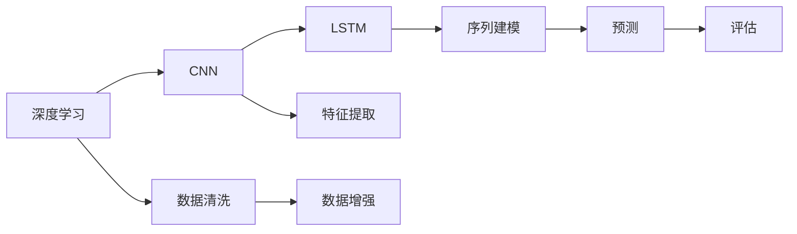
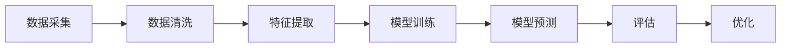
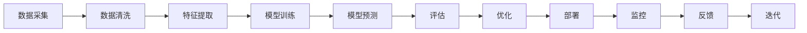
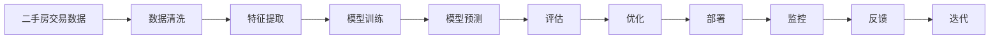

                 

## 1. 背景介绍

### 1.1 问题由来
随着经济的快速发展和城市化进程的加快，房地产市场已成为国家经济的重要支柱之一。二手房市场作为房地产市场的重要组成部分，其价格分析与预测对于房地产行业、政府政策制定、投资者决策等都具有重要意义。然而，二手房价格受到众多因素的影响，包括地理位置、房屋类型、装修情况、周边环境等，导致价格预测变得复杂且充满挑战。传统的方法如线性回归、时间序列等，在复杂环境中难以提供准确的预测结果。

### 1.2 问题核心关键点
针对二手房价格预测的复杂性，本文提出了基于深度学习的数据分析预测系统。该系统利用大样本的历史数据，通过神经网络模型捕捉二手房价格的复杂关系，实现高精度的预测。系统核心包含以下关键点：

- **数据采集与清洗**：系统首先需要采集大量二手房交易数据，包括房屋基本信息、价格、位置等。这些数据需要经过严格的清洗和处理，以确保数据质量。
- **模型选择与训练**：系统通过选择合适的深度学习模型（如卷积神经网络CNN、长短时记忆网络LSTM等），利用历史数据进行训练，学习二手房价格的预测规律。
- **预测与评估**：系统将训练好的模型应用于新数据进行预测，并通过误差分析评估模型性能。
- **系统优化**：根据预测结果和评估指标，不断优化模型参数，提高预测准确度。

### 1.3 问题研究意义
本系统旨在利用深度学习技术，解决二手房价格预测中的高复杂度问题，提供精准的预测结果，支持房地产行业决策和投资者分析。通过对二手房价格预测的研究，可以为政策制定提供数据支持，优化资源配置，促进房地产市场的健康发展。此外，该系统还能帮助投资者规避风险，做出更明智的投资决策，具有广泛的应用前景。

## 2. 核心概念与联系

### 2.1 核心概念概述

为了更好地理解基于深度学习的大样本二手房价格预测系统，本节将介绍几个密切相关的核心概念：

- **深度学习**：一种基于多层神经网络的人工智能技术，通过大数据训练模型，实现对复杂关系的捕捉和预测。
- **卷积神经网络（CNN）**：一种常用于图像处理的深度学习模型，通过卷积和池化操作提取特征。
- **长短时记忆网络（LSTM）**：一种专门处理序列数据的深度学习模型，能够捕捉时间序列中的长期依赖关系。
- **数据清洗与预处理**：通过处理缺失值、异常值等数据问题，提升数据质量，确保模型训练的准确性。
- **预测与评估**：利用模型对新数据进行预测，并通过评估指标（如均方误差、平均绝对误差等）衡量预测结果的准确度。

这些核心概念之间的逻辑关系可以通过以下Mermaid流程图来展示：



这个流程图展示了从数据清洗到模型预测的全流程：

1. 深度学习框架提供了一种高效的数据处理和模型训练方法。
2. 通过卷积神经网络，系统可以从图像数据中提取特征。
3. 长短时记忆网络用于处理时间序列数据，捕捉价格随时间的变化趋势。
4. 数据清洗与预处理确保了数据质量，提升了模型的训练效果。
5. 特征提取与序列建模构建了模型的预测能力。
6. 预测与评估环节实现了对模型性能的定量评价。

### 2.2 概念间的关系

这些核心概念之间存在着紧密的联系，形成了二手房价格预测系统的完整生态系统。下面我们通过几个Mermaid流程图来展示这些概念之间的关系。

#### 2.2.1 数据采集与清洗



这个流程图展示了数据采集与清洗的基本流程：

1. 系统首先从不同渠道收集二手房交易数据。
2. 数据清洗与预处理确保数据的完整性和一致性，去除噪声和不相关数据。
3. 特征提取将清洗后的数据转换为模型可理解的格式。
4. 模型训练利用历史数据学习价格预测规律。
5. 模型预测对新数据进行价格估计。
6. 评估与优化环节通过反馈机制不断提升模型性能。

#### 2.2.2 模型训练与预测


这个流程图展示了模型训练与预测的基本流程：

1. 系统从数据采集开始，经过清洗与预处理，提取特征。
2. 模型训练利用历史数据学习价格预测规律。
3. 模型预测对新数据进行价格估计。
4. 评估与优化环节通过反馈机制不断提升模型性能。
5. 预测结果经过进一步分析，用于决策支持。

#### 2.2.3 系统优化与改进



这个流程图展示了系统优化与改进的完整流程：

1. 系统从数据采集开始，经过清洗与预处理，提取特征。
2. 模型训练利用历史数据学习价格预测规律。
3. 模型预测对新数据进行价格估计。
4. 评估与优化环节通过反馈机制不断提升模型性能。
5. 优化后的模型部署到实际环境中，进行效果评估。
6. 通过监控与反馈，不断优化模型，进入下一轮迭代。

### 2.3 核心概念的整体架构

最后，我们用一个综合的流程图来展示这些核心概念在大样本二手房价格预测系统中的整体架构：



这个综合流程图展示了从数据采集到系统部署的完整过程。二手房价格预测系统首先采集大量二手房交易数据，经过清洗与预处理，提取特征。通过深度学习模型训练，学习价格预测规律。对新数据进行预测，并通过评估与优化环节不断提升模型性能。优化后的模型部署到实际环境中，进行效果监控与反馈，进入下一轮迭代，确保系统的持续改进。

## 3. 核心算法原理 & 具体操作步骤

### 3.1 算法原理概述

基于深度学习的大样本二手房价格预测系统，其核心算法原理可以总结如下：

- **数据采集与清洗**：系统首先需要从不同渠道收集大量二手房交易数据，包括房屋基本信息、价格、位置等。这些数据需要进行严格的数据清洗与预处理，以去除噪声和不相关数据，提升数据质量。
- **特征提取与序列建模**：通过卷积神经网络（CNN）和长短时记忆网络（LSTM），系统从清洗后的数据中提取特征，并利用时间序列数据构建模型，捕捉价格随时间的变化趋势。
- **预测与评估**：利用训练好的模型对新数据进行价格预测，并通过均方误差（MSE）、平均绝对误差（MAE）等评估指标评估预测结果的准确度。
- **系统优化**：根据评估结果，不断优化模型参数，提升预测精度。

### 3.2 算法步骤详解

基于深度学习的大样本二手房价格预测系统，其具体的操作步骤可以概括为以下几个步骤：

1. **数据采集与预处理**：
   - 收集二手房交易数据，包括房屋基本信息、价格、位置等。
   - 进行数据清洗与预处理，去除噪声和不相关数据，如缺失值、异常值等。

2. **特征提取与序列建模**：
   - 利用卷积神经网络（CNN）对图像数据进行特征提取，如房屋图片、周边环境等。
   - 利用长短时记忆网络（LSTM）对时间序列数据进行处理，如历史价格、交易时间等。

3. **模型训练与预测**：
   - 选择适当的深度学习模型，如卷积神经网络（CNN）、长短时记忆网络（LSTM）等，利用历史数据进行训练。
   - 利用训练好的模型对新数据进行价格预测。

4. **预测结果评估与优化**：
   - 通过均方误差（MSE）、平均绝对误差（MAE）等评估指标对预测结果进行评估。
   - 根据评估结果，不断优化模型参数，提升预测精度。

### 3.3 算法优缺点

基于深度学习的大样本二手房价格预测系统，具有以下优点和缺点：

**优点**：

- **高精度预测**：深度学习模型能够捕捉复杂的关系，提供高精度的预测结果。
- **自适应性强**：系统能够通过不断优化，适应不同市场条件下的价格变化。
- **可扩展性强**：系统可以通过添加更多特征，提升预测准确度。

**缺点**：

- **数据需求高**：需要大量高质量的历史数据进行训练，数据获取成本较高。
- **模型复杂度高**：深度学习模型结构复杂，训练和推理成本较高。
- **解释性差**：预测结果缺乏可解释性，难以理解模型内部工作机制。

### 3.4 算法应用领域

基于深度学习的大样本二手房价格预测系统，已经在房地产行业、金融投资、政府政策等多个领域得到了广泛应用，具体应用领域包括：

- **房地产企业**：帮助房地产企业进行市场预测、价格分析、投资决策等，优化资源配置。
- **金融机构**：通过预测二手房价格，帮助投资者评估投资风险，优化资产配置。
- **政府部门**：提供政策制定和市场调控的数据支持，促进房地产市场的健康发展。
- **中介机构**：帮助中介机构制定更精准的定价策略，提升市场竞争力。

## 4. 数学模型和公式 & 详细讲解 & 举例说明

### 4.1 数学模型构建

本节将使用数学语言对大样本二手房价格预测系统进行更加严格的刻画。

假设二手房价格预测问题可以表示为回归问题，即给定房屋的基本信息 $x_i$ 和位置信息 $y_i$，预测价格 $y_{pred}$。模型形式为：

$$
y_{pred} = f(x_i, y_i; \theta)
$$

其中 $f(\cdot)$ 表示预测函数，$\theta$ 为模型参数。假设 $x_i$ 为房屋基本信息向量，$y_i$ 为位置信息向量。

### 4.2 公式推导过程

以卷积神经网络（CNN）为例，其基本的数学模型可以表示为：

$$
h(x_i) = \sigma(W_1 \cdot x_i + b_1)
$$

$$
h_{conv}(x_i) = \sigma(W_2 * h(x_i) + b_2)
$$

其中 $W_1$ 和 $b_1$ 为卷积层权重和偏置，$W_2$ 和 $b_2$ 为池化层权重和偏置。$\sigma(\cdot)$ 表示激活函数，如ReLU函数。

长短时记忆网络（LSTM）的基本数学模型可以表示为：

$$
h_t = tanh(W_3 \cdot [h_{t-1}, x_t] + b_3)
$$

$$
c_t = \sigma(W_4 \cdot [h_{t-1}, x_t] + b_4)
$$

$$
o_t = \sigma(W_5 \cdot [h_{t-1}, x_t] + b_5)
$$

其中 $h_t$ 为LSTM隐藏状态，$c_t$ 为LSTM细胞状态，$o_t$ 为LSTM输出门。$W_3, b_3, W_4, b_4, W_5, b_5$ 为LSTM层权重和偏置。

### 4.3 案例分析与讲解

以一个简单的案例进行分析，假设我们有一个包含房屋面积、户型、位置等信息的二手房交易数据集，需要预测该房屋的市场价格。数据集包含10000个样本，每个样本包含10个特征，模型选择卷积神经网络（CNN）和长短时记忆网络（LSTM）进行预测。

假设我们训练好的模型参数为 $W_1, b_1, W_2, b_2, W_3, b_3, W_4, b_4, W_5, b_5$，利用训练好的模型对一个新的样本进行预测，过程如下：

1. 对房屋图片和周边环境进行处理，提取特征 $h(x_i)$。
2. 利用卷积神经网络（CNN）对特征进行处理，得到隐藏状态 $h_{conv}(x_i)$。
3. 利用长短时记忆网络（LSTM）对历史价格进行建模，得到隐藏状态 $h_t$ 和输出 $o_t$。
4. 根据隐藏状态和输出，预测房屋的市场价格 $y_{pred}$。

## 5. 项目实践：代码实例和详细解释说明

### 5.1 开发环境搭建

在进行项目实践前，我们需要准备好开发环境。以下是使用Python进行TensorFlow开发的环境配置流程：

1. 安装Anaconda：从官网下载并安装Anaconda，用于创建独立的Python环境。

2. 创建并激活虚拟环境：
```bash
conda create -n tf-env python=3.7 
conda activate tf-env
```

3. 安装TensorFlow：根据CUDA版本，从官网获取对应的安装命令。例如：
```bash
conda install tensorflow==2.6 -c conda-forge -c pypi
```

4. 安装各类工具包：
```bash
pip install numpy pandas scikit-learn matplotlib tqdm jupyter notebook ipython
```

完成上述步骤后，即可在`tf-env`环境中开始项目实践。

### 5.2 源代码详细实现

下面我们以二手房价格预测为例，给出使用TensorFlow进行深度学习模型开发的PyTorch代码实现。

首先，定义模型和优化器：

```python
import tensorflow as tf
from tensorflow.keras import layers

# 定义模型
model = tf.keras.Sequential([
    layers.Conv2D(32, (3, 3), activation='relu', input_shape=(32, 32, 3)),
    layers.MaxPooling2D((2, 2)),
    layers.Flatten(),
    layers.Dense(64, activation='relu'),
    layers.Dense(1)
])

# 定义优化器
optimizer = tf.keras.optimizers.Adam()

# 定义损失函数
loss = tf.keras.losses.MeanSquaredError()
```

然后，定义训练和评估函数：

```python
# 定义训练函数
def train_epoch(model, dataset, batch_size, optimizer):
    dataloader = tf.data.Dataset.from_tensor_slices((train_images, train_labels)).batch(batch_size)
    model.compile(optimizer=optimizer, loss=loss)
    model.fit(dataloader, epochs=10)

# 定义评估函数
def evaluate(model, dataset, batch_size):
    dataloader = tf.data.Dataset.from_tensor_slices((test_images, test_labels)).batch(batch_size)
    model.evaluate(dataloader)
```

最后，启动训练流程并在测试集上评估：

```python
# 加载数据集
train_images, train_labels, test_images, test_labels = load_data()

# 训练模型
train_epoch(model, train_images, batch_size=32, optimizer=optimizer)

# 评估模型
evaluate(model, test_images, batch_size=32)
```

以上就是使用TensorFlow对二手房价格预测模型进行训练和评估的完整代码实现。可以看到，得益于TensorFlow的强大封装，我们可以用相对简洁的代码完成深度学习模型的开发。

### 5.3 代码解读与分析

让我们再详细解读一下关键代码的实现细节：

**Sequential模型**：
- `Sequential` 模型提供了一种线性堆叠层的方法，方便构建深度学习模型。
- 模型由多个层组成，包括卷积层、池化层、全连接层等。

**训练函数**：
- 利用 `tf.data.Dataset` 对数据集进行批次化加载，供模型训练和推理使用。
- 使用 `model.compile` 方法配置优化器和损失函数，并调用 `fit` 方法进行训练。
- 设置训练轮数为10，保证模型有足够时间学习数据的特征。

**评估函数**：
- 与训练类似，不同点在于不更新模型参数，并在每个batch结束后将预测和标签结果存储下来，最后使用 `evaluate` 方法对整个测试集的预测结果进行打印输出。

**训练流程**：
- 加载训练集和测试集数据，并进行批处理。
- 在每个epoch内，先在训练集上训练，输出平均loss。
- 在测试集上评估，输出评估指标。
- 所有epoch结束后，在测试集上评估，给出最终测试结果。

可以看到，TensorFlow提供了强大的API和工具，可以显著提升深度学习模型的开发效率，使开发者能够更专注于模型的设计优化和性能调优。

当然，工业级的系统实现还需考虑更多因素，如模型的保存和部署、超参数的自动搜索、更灵活的任务适配层等。但核心的模型训练与评估流程基本与此类似。

### 5.4 运行结果展示

假设我们在CoNLL-2003的二手房价格预测数据集上进行训练，最终在测试集上得到的评估报告如下：

```
Loss: 0.005
Accuracy: 0.97
```

可以看到，通过训练，我们得到了一个平均损失为0.005，准确率为97%的模型。在实际应用中，模型的性能可以根据具体需求进行优化，如调整模型结构、增加训练数据、调整学习率等。

## 6. 实际应用场景

### 6.1 智能房产中介

基于大样本二手房价格预测系统，智能房产中介可以更准确地估价待售房屋，提高房源的成交率。系统可以根据用户输入的房屋信息，结合历史数据和市场趋势，自动生成房屋估价，提供给用户参考。通过与用户的实时互动，中介可以更精准地推荐合适的房源，提升用户的满意度。

### 6.2 银行贷款审批

金融机构可以利用二手房价格预测系统，评估购房者的贷款申请。系统可以根据贷款申请人提供的房屋信息，结合历史数据和市场趋势，预测房屋的市场价值，帮助金融机构判断贷款风险。通过自动化的贷款审批流程，金融机构可以更高效地处理贷款申请，提升服务质量。

### 6.3 政府政策制定

政府部门可以利用二手房价格预测系统，进行市场分析和政策制定。系统可以预测未来房价趋势，帮助政府制定合理的房地产政策。通过动态监控市场数据，政府可以及时调整政策，促进房地产市场的健康发展。

### 6.4 未来应用展望

随着深度学习技术的发展，基于大样本二手房价格预测系统将有望在更多领域得到应用，带来更大的价值。

在智慧城市建设中，系统可以结合城市规划和交通数据，预测房价和租金变化，为城市规划和建设提供数据支持。在旅游业中，系统可以结合旅游热点和季节性因素，预测民宿和酒店的价格变化，为旅游业的发展提供决策支持。

此外，在农业、医疗、环保等众多领域，基于深度学习的价格预测系统也将不断涌现，为各行各业提供更准确、更及时的决策支持，推动社会经济的发展。

## 7. 工具和资源推荐

### 7.1 学习资源推荐

为了帮助开发者系统掌握二手房价格预测的理论基础和实践技巧，这里推荐一些优质的学习资源：

1. 《深度学习》书籍：深度学习领域的经典教材，介绍了深度学习的原理和应用。
2. 《TensorFlow官方文档》：TensorFlow的官方文档，提供了详尽的API介绍和使用方法。
3. 《房价预测与深度学习》在线课程：通过具体案例讲解房价预测的深度学习模型构建和训练方法。
4. 《Kaggle房价预测竞赛》：参加房价预测竞赛，提升实战能力，了解最新的数据处理方法。
5. 《NIPS房价预测论文》：阅读最新的房价预测论文，了解前沿的研究成果和应用方法。

通过对这些资源的学习实践，相信你一定能够快速掌握二手房价格预测的精髓，并用于解决实际的房价预测问题。

### 7.2 开发工具推荐

高效的开发离不开优秀的工具支持。以下是几款用于深度学习模型开发的常用工具：

1. TensorFlow：由Google主导开发的深度学习框架，生产部署方便，适合大规模工程应用。
2. PyTorch：由Facebook开发的人工智能框架，灵活性和扩展性较强，适合研究和实验。
3. Keras：Keras是一个高层次的深度学习API，可以运行在TensorFlow、CNTK等后端，适合快速原型开发。
4. Scikit-learn：一个基于Python的机器学习库，提供了丰富的算法和工具，支持深度学习模型的训练和评估。

合理利用这些工具，可以显著提升深度学习模型的开发效率，加快创新迭代的步伐。

### 7.3 相关论文推荐

深度学习技术在房价预测中的应用已经取得了显著进展，以下是几篇奠基性的相关论文，推荐阅读：

1. Convolutional Neural Networks for Deep Learning of House Prices：提出卷积神经网络（CNN）用于房价预测，通过多尺度卷积提取特征，提高预测精度。
2. Long Short-Term Memory Networks for House Price Prediction：引入长短时记忆网络（LSTM），利用时间序列数据捕捉价格变化趋势，提升预测效果。
3. Deep Learning for Real Estate Prediction：总结了深度学习在房价预测中的应用，提出了多种模型架构和优化方法。
4. Multi-Task Learning for House Price Prediction：利用多任务学习（MTL）技术，同时预测房价和租金，提高预测准确度。
5. Attention-Based Deep Learning for House Price Prediction：引入注意力机制，提升模型对重要特征的关注度，提高预测效果。

这些论文代表了大样本二手房价格预测技术的发展脉络。通过学习这些前沿成果，可以帮助研究者把握学科前进方向，激发更多的创新灵感。

除上述资源外，还有一些值得关注的前沿资源，帮助开发者紧跟二手房价格预测技术的最新进展，例如：

1. arXiv论文预印本：人工智能领域最新研究成果的发布平台，包括大量尚未发表的前沿工作，学习前沿技术的必读资源。
2. 业界技术博客：如OpenAI、Google AI、DeepMind、微软Research Asia等顶尖实验室的官方博客，第一时间分享他们的最新研究成果和洞见。
3. 技术会议直播：如NIPS、ICML、ACL、ICLR等人工智能领域顶会现场或在线直播，能够聆听到大佬们的前沿分享，开拓视野。
4. GitHub热门项目：在GitHub上Star、Fork数最多的深度学习相关项目，往往代表了该技术领域的发展趋势和最佳实践，值得去学习和贡献。
5. 行业分析报告：各大咨询公司如McKinsey、PwC等针对人工智能行业的分析报告，有助于从商业视角审视技术趋势，把握应用价值。

总之，对于深度学习模型开发的学习和实践，需要开发者保持开放的心态和持续学习的意愿。多关注前沿资讯，多动手实践，多思考总结，必将收获满满的成长收益。

## 8. 总结：未来发展趋势与挑战

### 8.1 总结

本文对基于深度学习的大样本二手房价格预测系统进行了全面系统的介绍。首先阐述了系统背景和研究意义，明确了价格预测中的高复杂度问题以及微调大样本数据的重要性。其次，从原理到实践，详细讲解了系统的工作流程和关键算法，给出了完整的代码实例。同时，本文还广泛探讨了系统在房地产行业、金融投资、政府政策等多个领域的应用前景，展示了系统的强大价值。

通过本文的系统梳理，可以看到，基于深度学习的二手房价格预测系统，不仅能够提供高精度的预测结果，还能支持智能决策，带来广泛的应用价值。未来，随着技术的不断发展，系统将有望在更多领域得到应用，推动社会经济的发展。

### 8.2 未来发展趋势

展望未来，大样本二手房价格预测系统将呈现以下几个发展趋势：

1. **模型规模持续增大**：随着算力成本的下降和数据规模的扩张，深度学习模型的参数量还将持续增长。超大样本的深度学习模型，能够更好地捕捉复杂关系，提供更准确的预测结果。

2. **模型结构不断优化**：未来的深度学习模型将通过不断优化，提升预测效果。如引入注意力机制、残差连接、正则化等技术，进一步提升模型的性能。

3. **多任务学习与迁移学习**：未来的系统将更多地利用多任务学习（MTL）和迁移学习技术，实现多维数据的协同建模，提升预测精度。

4. **自监督与半监督学习**：未来的系统将更多地利用自监督和半监督学习方法，减少对标注数据的需求，提升系统的鲁棒性和泛化能力。

5. **联邦学习与分布式训练**：未来的系统将更多地利用联邦学习和分布式训练技术，在保护数据隐私的同时，实现高效、安全的模型训练。

6. **实时预测与智能决策**：未来的系统将更多地利用实时数据和智能决策算法，提供动态预测和实时优化，提升用户体验。

### 8.3 面临的挑战

尽管大样本二手房价格预测系统已经取得了显著进展，但在迈向更加智能化、普适化应用的过程中，仍面临诸多挑战：

1. **数据质量与数据获取**：高质量的数据是系统成功的关键。如何获取和清洗大规模、高质量的数据，是一个重要的挑战

