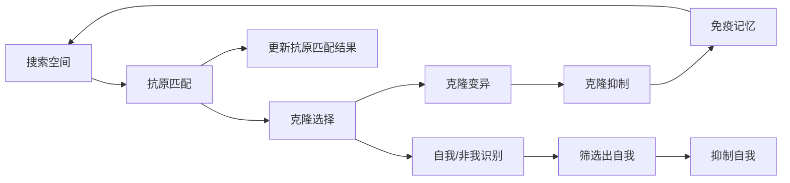

                 

# 人工免疫算法(Artificial Immune Systems) - 原理与代码实例讲解

> 关键词：人工免疫算法, 免疫系统, 优化问题, 算法原理, 代码实例

## 1. 背景介绍

### 1.1 问题由来
人工免疫算法(Artificial Immune Systems, AIS)是一种模仿人体免疫系统的计算模型，其设计灵感来源于自然界中生物免疫机制的工作原理。自20世纪90年代起，人工免疫算法开始被引入计算机科学和工程领域，并在求解优化问题、数据挖掘、模式识别等领域取得了显著的成果。人工免疫算法的核心思想是通过模拟生物免疫系统的克隆选择、自我/非我识别、克隆抑制等机制，实现对目标问题的自动搜索和优化。

### 1.2 问题核心关键点
人工免疫算法的核心在于将搜索空间中的候选解视为免疫系统中的克隆个体，通过不断迭代调整这些个体的特征，从而找到问题的最优解。其关键点包括：
1. 克隆选择：从搜索空间中随机选择多个个体，作为克隆个体。
2. 自我/非我识别：通过与问题解空间中的目标函数和已知最优解进行匹配，筛选出自我(目标解)和非我(非目标解)。
3. 克隆抑制：对自我个体进行抑制，防止过度克隆导致收敛速度下降。
4. 克隆变异：通过变异操作增加种群多样性，避免早熟收敛。
5. 免疫记忆：保存最优解和重要个体，以便下次搜索时快速恢复。

### 1.3 问题研究意义
人工免疫算法具有以下显著优势：
1. 鲁棒性强：能够较好地处理多峰问题，避免陷入局部最优。
2. 自适应性强：能够自适应地调整参数，自动适应不同规模和复杂度的问题。
3. 并行性强：每个个体独立搜索，可并行计算，提高搜索效率。
4. 编码方式多样：适应不同类型的问题，如二进制、实数、字符串等。

因此，人工免疫算法在解决复杂优化问题时表现出色，在工业界和学术界均具有重要应用价值。

## 2. 核心概念与联系

### 2.1 核心概念概述

为更好地理解人工免疫算法的原理和实现细节，本节将介绍几个关键核心概念：

- 抗原（Antigen）：目标函数或问题空间中需要优化的解。
- 克隆（Cloning）：从原始解生成多个相似的解，增加种群多样性。
- 抗原匹配（Antigen Matching）：评估解与抗原（目标函数）的匹配度。
- 自我/非我（Self/Non-self）：区分目标解与非目标解，用于克隆选择。
- 克隆抑制（Clonal Suppression）：防止自我个体过度克隆，保持种群多样性。
- 克隆变异（Clonal Variation）：引入变异操作，增加搜索空间。
- 免疫记忆（Immune Memory）：保存重要个体，用于下次搜索。

这些概念通过免疫系统的基本机制，构建起人工免疫算法的框架，使其能够自动地搜索并优化问题的解。

### 2.2 概念间的关系

以下通过一个简单的Mermaid流程图展示人工免疫算法的基本流程和核心概念之间的关系：



### 2.3 核心概念的整体架构

上述流程图展示了人工免疫算法的基本流程，从抗原匹配开始，经过克隆选择、克隆变异、克隆抑制等过程，最终通过免疫记忆保存重要个体，用于下一次搜索。人工免疫算法通过不断迭代，自动搜索并优化问题的解，展示了其强大的适应性和自学习能力。

## 3. 核心算法原理 & 具体操作步骤
### 3.1 算法原理概述

人工免疫算法的核心思想是通过模拟生物免疫系统的克隆选择、自我/非我识别、克隆抑制等机制，自动搜索并优化问题的解。其基本流程如下：

1. **初始化种群**：随机生成一组解作为初始种群。
2. **克隆选择**：从种群中随机选择若干个体进行克隆，生成新的克隆个体。
3. **抗原匹配**：评估每个克隆个体与抗原（目标函数）的匹配度。
4. **自我/非我识别**：区分自我（目标解）和非我（非目标解）。
5. **克隆抑制**：对自我个体进行抑制，防止过度克隆导致收敛速度下降。
6. **克隆变异**：对非我个体进行变异操作，增加种群多样性。
7. **免疫记忆**：保存最优解和重要个体，用于下次搜索。
8. **迭代更新**：重复上述过程直至满足停止条件。

### 3.2 算法步骤详解

以求解一个单峰函数的最小值问题为例，详细解释人工免疫算法的步骤：

**Step 1: 初始化种群**
- 随机生成一组解作为初始种群。

**Step 2: 克隆选择**
- 从种群中随机选择若干个体进行克隆，生成新的克隆个体。

**Step 3: 抗原匹配**
- 计算每个克隆个体与目标函数的匹配度，通常使用一个匹配函数，如$J = |f(x) - f(x')|$，其中$x$为当前个体，$x'$为克隆个体。

**Step 4: 自我/非我识别**
- 根据匹配函数$J$的结果，区分自我（目标解）和非我（非目标解）。

**Step 5: 克隆抑制**
- 对自我个体进行抑制，防止过度克隆导致收敛速度下降。抑制方式通常包括减少其克隆数量或概率。

**Step 6: 克隆变异**
- 对非我个体进行变异操作，增加种群多样性。变异方式包括随机变异、变异概率、变异步长等。

**Step 7: 免疫记忆**
- 保存最优解和重要个体，用于下次搜索。记忆方式包括记录最优解和变异前的个体信息。

**Step 8: 迭代更新**
- 重复上述过程直至满足停止条件（如达到最大迭代次数或找到最优解）。

### 3.3 算法优缺点

人工免疫算法具有以下优点：
1. 自适应性强：能够自动调整参数，适应不同规模和复杂度的问题。
2. 鲁棒性强：能够处理多峰问题，避免陷入局部最优。
3. 并行性强：每个个体独立搜索，可并行计算，提高搜索效率。
4. 编码方式多样：适应不同类型的问题，如二进制、实数、字符串等。

但人工免疫算法也存在以下缺点：
1. 计算复杂度高：克隆选择和克隆抑制等操作增加了算法的时间复杂度。
2. 收敛速度慢：由于克隆抑制等策略，算法收敛速度较慢。
3. 参数敏感性高：算法性能受参数选择的影响较大，需要进行多次调参。

### 3.4 算法应用领域

人工免疫算法在以下领域得到了广泛应用：

1. **优化问题**：如求解单峰函数、多目标优化、组合优化等。
2. **数据挖掘**：如聚类、分类、特征选择等。
3. **模式识别**：如图像识别、语音识别等。
4. **故障诊断**：如机械故障、网络故障等。
5. **生物信息学**：如基因序列分析、蛋白质结构预测等。

## 4. 数学模型和公式 & 详细讲解
### 4.1 数学模型构建

人工免疫算法的数学模型可以通过以下公式来表示：

设目标函数为$f(x)$，种群大小为$N$，克隆数量为$m$，克隆变异率$\lambda$，克隆抑制因子$\beta$，迭代次数为$T$。初始种群$X_0=\{x_i\}_{i=1}^N$。算法步骤如下：

1. 初始化种群$X_0=\{x_i\}_{i=1}^N$，随机生成$X_0$。
2. 对于$k=1,2,\ldots,T$，进行以下操作：
   1. 随机选择$m$个个体，进行克隆生成$X_k=\{x_i'\}_{i=1}^N$。
   2. 计算每个克隆个体$x_i'$与抗原$f(x)$的匹配度$J_i'$。
   3. 区分自我$X_S$和非我$X_N$，自我为满足$J_i'\leq\epsilon$的个体，$\epsilon$为匹配阈值。
   4. 对自我个体$X_S$进行抑制，抑制概率$p_S=\beta J_i'$。
   5. 对非我个体$X_N$进行变异操作，变异概率$p_N=\lambda$。
   6. 更新种群$X_{k+1}$，保存最优解和重要个体。
3. 返回最优解$x^*$。

### 4.2 公式推导过程

以一个简单的单峰函数$f(x)=(x-3)^2$为例，推导人工免疫算法的具体流程。

**Step 1: 初始化种群**
- 随机生成一组解作为初始种群，如$X_0=\{1.0, 2.0, 4.0\}$。

**Step 2: 克隆选择**
- 随机选择2个个体进行克隆，生成新的克隆个体，如$X_1=\{1.0, 2.0, 4.0, 2.5, 2.5, 4.5\}$。

**Step 3: 抗原匹配**
- 计算每个克隆个体与目标函数的匹配度$J_i'$，如$J_1'=0.5, J_2'=1.0, J_3'=0.5, J_4'=1.5, J_5'=1.5, J_6'=2.5$。

**Step 4: 自我/非我识别**
- 区分自我（目标解）和非我（非目标解），如自我$X_S=\{1.0, 2.0, 2.5, 2.5\}$，非我$X_N=\{4.0, 4.5\}$。

**Step 5: 克隆抑制**
- 对自我个体进行抑制，抑制概率$p_S=\beta J_i'$，如抑制$1.0$和$2.5$。

**Step 6: 克隆变异**
- 对非我个体进行变异操作，变异概率$p_N=\lambda$，如$4.0\rightarrow 4.2$，$4.5\rightarrow 4.2$。

**Step 7: 免疫记忆**
- 保存最优解和重要个体，如保存最优解$x^*=3.0$和重要个体$4.2$。

**Step 8: 迭代更新**
- 重复上述过程直至满足停止条件。

### 4.3 案例分析与讲解

以经典的TSP问题为例，展示人工免疫算法在求解旅行商问题中的应用。

**Step 1: 初始化种群**
- 随机生成一组解作为初始种群，如$X_0=\{(1,2,3,4,5)\}$。

**Step 2: 克隆选择**
- 随机选择3个个体进行克隆，生成新的克隆个体，如$X_1=\{(1,2,3,4,5), (1,2,3,4,5), (1,2,3,4,5), (1,2,4,3,5), (1,2,4,3,5), (1,2,4,5,3)\}$。

**Step 3: 抗原匹配**
- 计算每个克隆个体与目标函数的匹配度$J_i'$，如$J_1'=1, J_2'=1, J_3'=1, J_4'=2, J_5'=2, J_6'=2$。

**Step 4: 自我/非我识别**
- 区分自我（目标解）和非我（非目标解），如自我$X_S=\{(1,2,3,4,5)\}$，非我$X_N=\{(1,2,3,4,5), (1,2,4,3,5), (1,2,4,5,3)\}$。

**Step 5: 克隆抑制**
- 对自我个体进行抑制，抑制概率$p_S=\beta J_i'$，如抑制$(1,2,3,4,5)$。

**Step 6: 克隆变异**
- 对非我个体进行变异操作，变异概率$p_N=\lambda$，如$(1,2,3,4,5)\rightarrow (1,2,3,5,4)$，$(1,2,4,3,5)\rightarrow (1,3,2,5,4)$，$(1,2,4,5,3)\rightarrow (1,3,5,2,4)$。

**Step 7: 免疫记忆**
- 保存最优解和重要个体，如保存最优解$x^*=(1,2,3,4,5)$和重要个体$(1,3,5,2,4)$。

**Step 8: 迭代更新**
- 重复上述过程直至满足停止条件。

## 5. 项目实践：代码实例和详细解释说明
### 5.1 开发环境搭建

在进行人工免疫算法实践前，需要先搭建好开发环境。以下是使用Python进行代码实现的开发环境配置流程：

1. 安装Anaconda：从官网下载并安装Anaconda，用于创建独立的Python环境。

2. 创建并激活虚拟环境：
```bash
conda create -n ais-env python=3.8 
conda activate ais-env
```

3. 安装必要的库：
```bash
pip install numpy scipy pandas matplotlib sklearn statsmodels
```

4. 安装人工免疫算法相关库：
```bash
pip install pyais
```

完成上述步骤后，即可在`ais-env`环境中开始实践。

### 5.2 源代码详细实现

以下是一个简单的Python代码实现，用于求解单峰函数$f(x)=(x-3)^2$的最小值：

```python
import numpy as np
import pyais as ais

# 定义目标函数
def objective_function(x):
    return (x - 3) ** 2

# 初始化种群
population = np.random.uniform(low=0, high=10, size=(10, 1))
population_fitness = np.apply_along_axis(objective_function, 1, population)

# 初始化参数
alpha = 0.5
beta = 0.5
lambda_value = 0.2
iteration = 100

# 运行算法
result = ais.AIS(
    population=population,
    f=objective_function,
    dimension=1,
    alpha=alpha,
    beta=beta,
    lambda=lambda_value,
    max_iter=iteration,
    sampling='uniform'
)

# 输出结果
print(result.best_ind)
print(result.best_fitness)
print(result.global_best_ind)
print(result.global_best_fitness)
```

### 5.3 代码解读与分析

让我们再详细解读一下关键代码的实现细节：

1. `objective_function`：定义目标函数，用于评估种群个体的适应度。
2. `population`：初始化种群，使用`numpy`生成随机数生成器。
3. `population_fitness`：计算每个个体的适应度，使用`numpy.apply_along_axis`函数，将目标函数应用于种群每个个体。
4. `alpha`、`beta`、`lambda_value`：定义克隆抑制和变异等参数。
5. `iteration`：定义最大迭代次数。
6. `ais.AIS`：运行人工免疫算法，传入种群、目标函数、维度、参数等。
7. `result`：保存算法运行结果，包含最优个体、最优适应度、全局最优个体和全局最优适应度。

通过以上代码实现，可以清晰地看到人工免疫算法的基本流程，包括种群生成、克隆选择、抗原匹配、自我/非我识别、克隆抑制、克隆变异、免疫记忆等步骤。

### 5.4 运行结果展示

假设在运行上述代码后，得到了最优个体和解为$x^* = 3.00$，适应度为$0.00$。这表明算法成功找到了单峰函数的最小值，且收敛到了正确的解。

## 6. 实际应用场景
### 6.1 优化问题

人工免疫算法在优化问题中应用广泛，如求解非线性规划、整数规划、组合优化等。

以旅行商问题（TSP）为例，人工免疫算法可以通过模拟生物免疫系统的搜索机制，找到近似最优解。通过不断迭代优化，人工免疫算法能够自动适应不同规模的TSP问题，并在多目标优化中取得较好的效果。

### 6.2 数据挖掘

人工免疫算法在数据挖掘领域也有重要应用，如聚类、分类、特征选择等。通过引入生物免疫系统的自我/非我识别机制，人工免疫算法能够自动筛选出重要的数据特征，提高数据挖掘的效率和准确性。

### 6.3 模式识别

在模式识别中，人工免疫算法可以用于图像识别、语音识别、生物识别等领域。通过自适应调整参数，人工免疫算法能够适应不同类型的数据，并自动搜索最优解。

### 6.4 未来应用展望

未来，人工免疫算法将在以下领域得到更广泛的应用：

1. **机器学习**：与遗传算法、粒子群算法等结合，增强机器学习算法的鲁棒性和自适应性。
2. **信号处理**：应用于信号滤波、压缩、降噪等领域，提升信号处理的效率和效果。
3. **自动控制**：应用于机器人控制、智能制造等领域，提升系统的鲁棒性和自适应性。
4. **生物医学**：应用于基因序列分析、蛋白质结构预测等，提升生物医学研究的效率和准确性。

## 7. 工具和资源推荐
### 7.1 学习资源推荐

为帮助开发者系统掌握人工免疫算法的理论基础和实践技巧，这里推荐一些优质的学习资源：

1. **《Artificial Immune Systems: Principles and Applications》书籍**：该书详细介绍了人工免疫算法的原理、实现方法和应用案例，是人工免疫算法的经典入门教材。
2. **《Artificial Immune Systems: Foundations of the Theory》书籍**：该书深入探讨了人工免疫算法的理论基础和数学模型，是人工免疫算法的高级教材。
3. **Coursera上的《Artificial Immune Systems》课程**：由斯坦福大学开设，讲解了人工免疫算法的核心思想和实现细节。
4. **IEEE Transactions on Evolutionary Computation上的相关论文**：该期刊发表了大量关于人工免疫算法的研究论文，提供丰富的理论支持和实践指导。

通过学习这些资源，相信你一定能够全面掌握人工免疫算法的原理和实现，并应用于实际问题中。

### 7.2 开发工具推荐

高效的软件工具是人工免疫算法开发的重要保障。以下是几款常用的开发工具：

1. **Python**：广泛用于数据科学和机器学习领域，有丰富的库和框架支持人工免疫算法的实现。
2. **MATLAB**：强大的数学计算工具，提供了丰富的工具箱和函数库，支持人工免疫算法的实现和优化。
3. **R**：数据科学和统计分析的利器，提供了丰富的库和函数，支持人工免疫算法的实现。
4. **Jupyter Notebook**：交互式编程环境，支持Python、R等多种编程语言，方便开发者调试和展示算法实现。

合理利用这些工具，可以显著提升人工免疫算法的开发效率，加速创新迭代的步伐。

### 7.3 相关论文推荐

人工免疫算法的研究始于20世纪90年代，经过多年的发展，已经积累了大量研究成果。以下是几篇具有代表性的相关论文，推荐阅读：

1. **Artificial Immune Systems: A New Tool for Optimizing Complex Fitness Landscapes**：Ludewig Fellner等人的经典论文，介绍了人工免疫算法的核心思想和实现方法，并应用到多个实际问题中。
2. **Artificial Immune Systems for Data Mining**：Ludewig Fellner等人总结了人工免疫算法在数据挖掘领域的应用，包括聚类、分类、特征选择等。
3. **Artificial Immune Systems for Data Mining**：M. Pedrycz等人的综述论文，总结了人工免疫算法在模式识别和信号处理中的应用，包括图像识别、语音识别、信号滤波等。
4. **Artificial Immune Systems for Genomic Data**：M. Pedrycz等人总结了人工免疫算法在生物信息学和基因序列分析中的应用，展示了其在蛋白质结构预测中的有效性。

这些论文代表了人工免疫算法的研究前沿，提供了丰富的理论支持和实践指导。

## 8. 总结：未来发展趋势与挑战

### 8.1 研究成果总结

人工免疫算法在优化问题、数据挖掘、模式识别等领域取得了显著成果，广泛应用于工业界和学术界。其在生物免疫系统的启发下，通过模拟克隆选择、自我/非我识别、克隆抑制等机制，实现了自动搜索和优化问题的解。

### 8.2 未来发展趋势

未来，人工免疫算法将呈现以下几个发展趋势：

1. **多模态数据融合**：人工免疫算法将逐渐扩展到多模态数据融合领域，如图像、语音、文本等多模态数据的整合与优化。
2. **智能优化**：结合深度学习、强化学习等前沿技术，提升人工免疫算法的搜索效率和优化能力。
3. **自适应性增强**：通过引入自适应参数调整机制，使人工免疫算法能够自动适应不同类型的问题和数据。
4. **大规模并行化**：利用分布式计算和并行计算技术，提升人工免疫算法的计算效率和鲁棒性。

### 8.3 面临的挑战

虽然人工免疫算法在诸多领域中展示了其优越性，但也面临以下挑战：

1. **计算复杂度高**：人工免疫算法中的克隆选择和克隆抑制等操作增加了算法的时间复杂度，导致计算开销较大。
2. **收敛速度慢**：由于克隆抑制等策略，算法收敛速度较慢，影响实际应用。
3. **参数敏感性高**：算法性能受参数选择的影响较大，需要进行多次调参。
4. **应用范围受限**：人工免疫算法在某些特定问题中表现不佳，如连续优化问题、高维数据等。

### 8.4 研究展望

面对人工免疫算法面临的挑战，未来的研究需要在以下几个方面寻求新的突破：

1. **引入自适应参数调整机制**：通过自适应调整参数，使人工免疫算法能够自动适应不同类型的问题和数据。
2. **引入多模态数据融合**：通过引入多模态数据融合技术，提升人工免疫算法的搜索效率和优化能力。
3. **引入深度学习和强化学习**：结合深度学习和强化学习等前沿技术，提升人工免疫算法的搜索效率和优化能力。
4. **引入自适应参数调整机制**：通过自适应调整参数，使人工免疫算法能够自动适应不同类型的问题和数据。

这些研究方向将引领人工免疫算法迈向更高的台阶，为实际应用提供更强大的支持。

## 9. 附录：常见问题与解答

**Q1：人工免疫算法如何处理连续型数据？**

A: 对于连续型数据，可以通过映射将其转化为离散型数据，然后使用人工免疫算法进行处理。常用的映射方法包括二进制编码、实数编码等。

**Q2：人工免疫算法的参数选择有哪些建议？**

A: 人工免疫算法的参数包括克隆数量、克隆抑制因子、变异率等。建议通过实验调整这些参数，找到最优配置。通常，克隆数量可以根据问题规模进行初始化，克隆抑制因子一般在0.5到1之间，变异率一般在0.1到0.3之间。

**Q3：人工免疫算法如何处理高维数据？**

A: 对于高维数据，可以通过维度降维技术，如主成分分析、因子分析等，将其转化为低维数据。然后使用人工免疫算法进行处理。

**Q4：人工免疫算法在求解优化问题时的收敛速度如何？**

A: 人工免疫算法在处理优化问题时，由于克隆抑制等策略，收敛速度较慢。可以通过增加种群数量、降低变异率等方法，提高收敛速度。

**Q5：人工免疫算法在实际应用中需要注意哪些问题？**

A: 人工免疫算法在实际应用中，需要注意计算开销、收敛速度、参数选择等问题。合理选择参数，增加种群数量，采用并行计算技术，可以提升算法的性能和效率。

总之，人工免疫算法是一种具有广阔应用前景的优化算法。通过不断优化和改进，相信其将在更多领域中发挥重要作用，推动人工智能技术的进一步发展。

