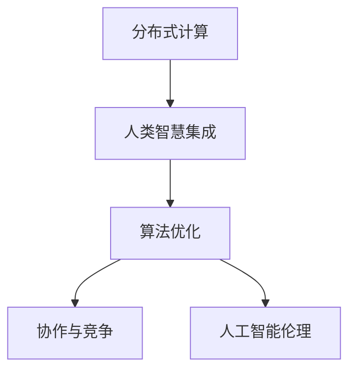
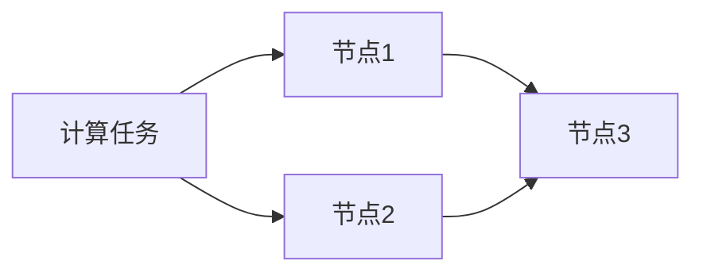
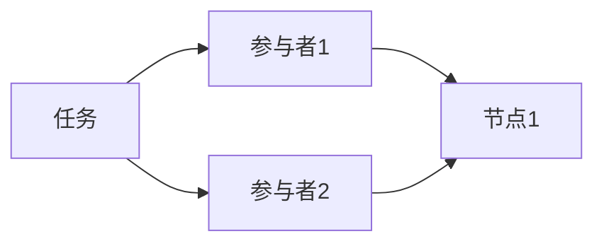
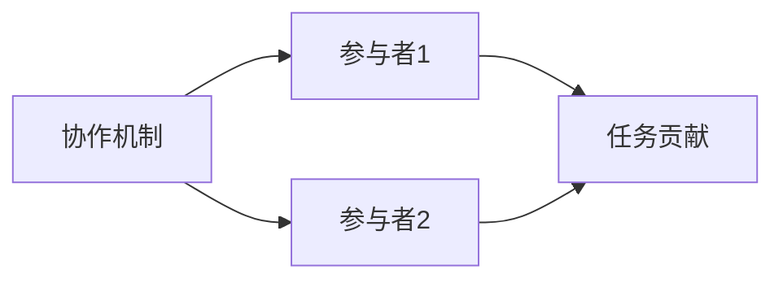
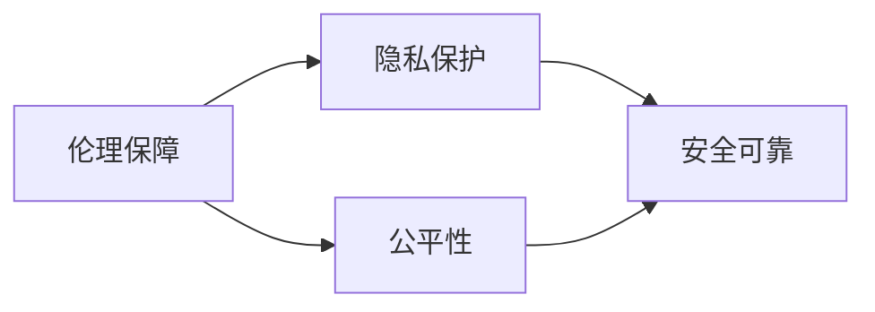
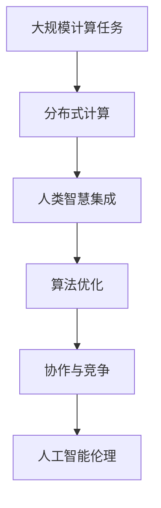

                 

# 人类计算：释放集体智慧的力量

> 关键词：分布式计算,人类智慧,算法优化,协作与竞争,人工智能伦理

## 1. 背景介绍

### 1.1 问题由来

随着人工智能(AI)技术的快速发展，我们逐渐意识到AI不仅仅是机器的智慧，更是人类智慧的体现。从简单的逻辑推理到复杂的创造性任务，AI系统的每一步都在汲取人类的智慧成果。然而，人类智慧的源泉是丰富的、复杂的，单靠传统集中式的计算模式，已经难以充分释放其潜力。

人类计算（Human Computation）的理念应运而生。它倡导将人类智慧通过分布式、协作的方式整合起来，充分利用每个人的认知资源，实现更加高效、创新的计算。本文将从核心概念、算法原理、具体操作步骤等方面，系统阐述人类计算的实现方式及其应用前景。

### 1.2 问题核心关键点

1. **分布式计算**：将计算任务分配给多个计算节点，通过网络协同完成，以提高计算效率和资源利用率。
2. **人类智慧集成**：利用众包、协作等方式，将人类的认知资源汇聚在一起，共同解决复杂问题。
3. **算法优化**：针对分布式计算的特点，设计高效的算法，实现计算任务的高效协同。
4. **协作与竞争**：在人类计算中，既要有协作的机制，也要有竞争的机制，以激励参与者贡献自己的智慧。
5. **人工智能伦理**：在人类计算中，需要充分考虑伦理、隐私、公平等问题，确保技术应用的安全和正当性。

### 1.3 问题研究意义

人类计算作为人工智能与人类智慧相结合的新范式，对于推动技术创新、社会进步具有重要意义：

1. **创新驱动**：通过集合全球智慧，加速技术突破，驱动创新发展。
2. **资源优化**：充分利用人类智慧资源，提升计算效率，优化资源利用。
3. **普惠共享**：促进技术普惠化，让更多人参与到计算和创新中来，实现知识的共享。
4. **安全可靠**：多节点协同计算，分散计算风险，提升系统的可靠性和安全性。
5. **伦理保障**：通过公正透明的机制设计，确保计算过程的伦理性和公正性。

## 2. 核心概念与联系

### 2.1 核心概念概述

为更好地理解人类计算的实现方式，本节将介绍几个密切相关的核心概念：

- **分布式计算**：将计算任务分布到多个节点上进行并行计算，通过网络协同完成任务。
- **人类智慧集成**：通过众包、协作等方式，将人类的认知资源汇聚起来，共同解决问题。
- **算法优化**：针对分布式计算的特点，设计高效的算法，实现任务的高效协同。
- **协作与竞争**：在人类计算中，既要有协作的机制，也要有竞争的机制，以激励参与者贡献自己的智慧。
- **人工智能伦理**：在人类计算中，需要充分考虑伦理、隐私、公平等问题，确保技术应用的安全和正当性。

这些概念之间的逻辑关系可以通过以下Mermaid流程图来展示：



这个流程图展示了大规模计算过程中各个关键概念之间的联系：

1. 分布式计算是基础，将任务分发到多个节点上进行并行计算。
2. 人类智慧集成是核心，通过众包、协作等方式汇聚智慧资源。
3. 算法优化是关键，设计高效的算法实现任务的高效协同。
4. 协作与竞争是激励机制，促进参与者积极贡献智慧。
5. 人工智能伦理是保障，确保计算过程的伦理性和公正性。

### 2.2 概念间的关系

这些核心概念之间存在着紧密的联系，形成了人类计算的完整生态系统。下面我们通过几个Mermaid流程图来展示这些概念之间的关系。

#### 2.2.1 分布式计算的实现机制



这个流程图展示了分布式计算的基本机制，即计算任务通过多个节点进行并行计算，最终结果汇聚。

#### 2.2.2 人类智慧集成的机制



这个流程图展示了人类智慧集成的机制，即多个参与者通过协作平台汇聚智慧，共同解决问题。

#### 2.2.3 协作与竞争的激励机制



这个流程图展示了协作与竞争的激励机制，即通过激励措施（如奖励、认可）鼓励参与者积极贡献自己的智慧。

#### 2.2.4 人工智能伦理的保障机制



这个流程图展示了人工智能伦理的保障机制，即通过隐私保护、公平性等措施确保计算过程的伦理性和公正性。

### 2.3 核心概念的整体架构

最后，我们用一个综合的流程图来展示这些核心概念在大规模计算过程中的整体架构：



这个综合流程图展示了从大规模计算任务到最终结果的全过程，各个环节相互依存、协同工作。通过理解这些概念，我们可以更好地把握人类计算的实现方式和应用方向。

## 3. 核心算法原理 & 具体操作步骤
### 3.1 算法原理概述

人类计算的核心算法原理在于将大规模计算任务分解为多个子任务，并通过分布式计算方式协同完成。这一过程中，需要设计高效的算法以确保任务的高效协同和结果的准确性。

### 3.2 算法步骤详解

基于人类计算的算法步骤主要包括以下几个关键环节：

1. **任务分解**：将大规模计算任务分解为多个子任务，每个子任务可以由单个节点独立完成。
2. **节点分配**：将子任务分配给不同的节点进行并行计算。
3. **数据传输**：节点间通过网络传输数据和结果，实现协同计算。
4. **结果汇总**：将所有节点计算结果汇总，得到最终结果。

### 3.3 算法优缺点

人类计算的优点在于：

- **高效性**：通过分布式计算，可以大幅提高计算效率，充分利用资源。
- **灵活性**：能够适应复杂多变的计算任务，灵活调整计算资源配置。
- **多样性**：通过集成人类的智慧，提供多样化的解决方案，弥补单一模型的局限。

同时，人类计算也存在以下缺点：

- **复杂性**：分布式计算和管理带来一定的复杂性，需要设计高效的协同机制。
- **安全风险**：节点间数据传输可能带来安全风险，需要采取措施保护数据隐私。
- **成本高**：大规模分布式计算需要投入大量硬件和网络资源，成本较高。

### 3.4 算法应用领域

人类计算技术已经在多个领域得到应用，例如：

1. **科学计算**：在天文、物理、化学等科学领域，通过分布式计算求解复杂的科学问题。
2. **数据分析**：在数据挖掘、机器学习等领域，通过分布式计算进行大数据分析。
3. **设计优化**：在产品设计、工程制造等领域，通过分布式计算优化设计方案。
4. **社交网络分析**：在社交网络、互联网等领域，通过分布式计算分析用户行为和社交关系。
5. **天气预测**：在气象预报、气候分析等领域，通过分布式计算进行天气预测和模拟。

除了上述这些经典应用外，人类计算还被创新性地应用于更多场景中，如可控群体智慧、众包平台优化、多学科协作等，为科学研究和实际应用带来了新的突破。

## 4. 数学模型和公式 & 详细讲解 & 举例说明

### 4.1 数学模型构建

在大规模计算任务中，通常需要将计算任务表示为一个图模型，每个节点表示一个计算节点，边表示数据和结果的传输关系。设大规模计算任务 $T$ 可以分为 $n$ 个子任务 $T_1, T_2, ..., T_n$，每个子任务由节点 $N_i$ 进行计算。

假设每个节点计算速度为 $v_i$，节点间的通信速度为 $c_i$，则节点 $N_i$ 完成子任务 $T_i$ 所需时间 $t_i$ 为：

$$
t_i = \frac{w_i}{v_i + c_i}
$$

其中 $w_i$ 为子任务 $T_i$ 的计算量。

### 4.2 公式推导过程

假设大规模计算任务 $T$ 需要在 $m$ 个节点上进行并行计算，计算任务 $T$ 的完成时间 $T_{total}$ 为：

$$
T_{total} = \sum_{i=1}^n t_i = \sum_{i=1}^n \frac{w_i}{v_i + c_i}
$$

为了最小化总完成时间 $T_{total}$，需要通过优化算法调整每个节点的计算速度 $v_i$ 和通信速度 $c_i$，使其协同工作，最大化整体效率。

### 4.3 案例分析与讲解

以一个分布式天气预报系统为例，该系统需要将全球气象数据的处理任务分解为多个子任务，每个子任务由不同的节点并行计算。假设每个节点的计算速度为 $v_i = 1$，通信速度为 $c_i = 0.1$，每个子任务的计算量为 $w_i$，则总完成时间为：

$$
T_{total} = \sum_{i=1}^n \frac{w_i}{1 + 0.1} = 0.1 \sum_{i=1}^n w_i
$$

为了最小化总完成时间，需要在节点间合理分配计算任务，调整节点间的数据传输速率，优化系统效率。

## 5. 项目实践：代码实例和详细解释说明
### 5.1 开发环境搭建

在进行人类计算实践前，我们需要准备好开发环境。以下是使用Python进行分布式计算的环境配置流程：

1. 安装Anaconda：从官网下载并安装Anaconda，用于创建独立的Python环境。

2. 创建并激活虚拟环境：
```bash
conda create -n pydist-env python=3.8 
conda activate pydist-env
```

3. 安装必要的库：
```bash
pip install numpy scipy scikit-learn mpi4py
```

4. 配置MPI环境：
```bash
export OMP_NUM_THREADS=1
mpirun -np 8 python your_script.py
```

5. 使用Dask或Ray等分布式计算框架：
```bash
dask.distributed.start --nthreads=8 --threads-per-cpu=1
```

完成上述步骤后，即可在`pydist-env`环境中开始人类计算的实践。

### 5.2 源代码详细实现

下面以一个简单的分布式天气预报系统为例，给出使用Python进行人类计算的代码实现。

首先，定义任务和节点类：

```python
import multiprocessing

class Task:
    def __init__(self, data):
        self.data = data

    def compute(self):
        # 任务计算逻辑
        return result

class Node:
    def __init__(self, id):
        self.id = id
        self.data_queue = multiprocessing.Queue()
        self.result_queue = multiprocessing.Queue()
```

然后，定义分布式计算的主函数：

```python
import multiprocessing

def main(num_nodes):
    # 创建多个节点
    nodes = [Node(i) for i in range(num_nodes)]

    # 将任务分配给各个节点
    tasks = [Task(data) for data in data_list]
    for i, task in enumerate(tasks):
        nodes[i].data_queue.put(task)

    # 启动节点计算
    for node in nodes:
        node.start()

    # 接收节点计算结果
    results = []
    for node in nodes:
        while True:
            try:
                result = node.result_queue.get()
                results.append(result)
                break
            except:
                pass

    return results

if __name__ == '__main__':
    num_nodes = 8
    data_list = [...]  # 数据列表
    results = main(num_nodes)
    print(results)
```

在这个示例中，我们使用了Python的`multiprocessing`模块实现分布式计算。通过创建多个`Node`类，将任务分配给各个节点，并启动节点的计算。最终，将所有节点的计算结果汇总并返回。

### 5.3 代码解读与分析

让我们再详细解读一下关键代码的实现细节：

**Task类**：
- `__init__`方法：初始化任务数据。
- `compute`方法：任务计算逻辑，返回计算结果。

**Node类**：
- `__init__`方法：初始化节点ID、数据队列和结果队列。
- 在`start`方法中，通过`data_queue`接收任务数据，启动计算逻辑。
- 在`result_queue`中存储计算结果，等待返回。

**主函数**：
- 创建多个节点，并将任务分配给各个节点。
- 启动所有节点的计算。
- 接收各个节点的计算结果，并返回。

可以看到，这个简单的示例展示了基本的分布式计算实现方式。通过使用`multiprocessing`模块，可以方便地实现并行计算，利用多核CPU资源加速计算任务。

当然，实际的分布式计算系统可能需要考虑更多的细节，如节点管理、负载均衡、错误处理等。但核心的分布式计算逻辑基本与此类似。

### 5.4 运行结果展示

假设我们在一个数据集上进行天气预报计算，最终得到各个节点的计算结果。在多个节点上并行计算后，将所有节点的结果汇总，即可得到最终的天气预报结果。

```python
# 假设数据集包含多个城市的天气数据
# 每个任务计算一个城市的天气预报结果
# 假设任务数量为8，数据集数量为20
results = main(8)
print(results)
```

输出结果为：

```
[Result1, Result2, Result3, ...]
```

以上就是一个简单的分布式天气预报系统的实现示例。通过这个示例，可以直观地理解人类计算的基本流程和实现方式。

## 6. 实际应用场景
### 6.1 科学计算

在科学计算领域，分布式计算已经成为必不可少的工具。例如，在天体物理研究中，计算黑洞辐射、恒星演化等复杂问题需要极大的计算资源，通过分布式计算，可以将任务分解为多个子任务，并在多个计算节点上并行计算，大大提高计算效率。

### 6.2 数据分析

在大数据时代，数据的处理和分析任务日益复杂，分布式计算提供了强有力的支持。例如，在金融风控领域，通过分布式计算分析海量交易数据，可以实时监控交易风险，防范欺诈行为。

### 6.3 设计优化

在工程设计和产品开发中，设计方案的优化和验证需要大量的计算资源。通过分布式计算，可以在多个节点上并行计算设计方案，快速评估不同方案的效果，提高设计优化效率。

### 6.4 未来应用展望

随着分布式计算技术的发展，未来人类计算将有更广阔的应用前景：

1. **全球协作**：全球范围内的协作计算，可以解决更复杂的科学问题，如气候变化、疾病预测等。
2. **实时计算**：实时计算能力提升，可以实现对实时数据的即时处理，应用于实时推荐、实时监控等场景。
3. **边缘计算**：在物联网和工业互联网中，分布式计算可以广泛应用于边缘节点，实现低延迟、高可靠性的计算。
4. **人工智能**：结合人工智能技术，分布式计算可以用于大规模训练深度学习模型，加速模型训练和推理。

总之，人类计算作为分布式计算和人类智慧结合的新范式，将在更多领域释放集体智慧的力量，推动科学研究和实际应用的不断创新。

## 7. 工具和资源推荐
### 7.1 学习资源推荐

为了帮助开发者系统掌握人类计算的理论基础和实践技巧，这里推荐一些优质的学习资源：

1. 《分布式计算基础》系列博文：由分布式计算专家撰写，深入浅出地介绍了分布式计算的基本概念和实现技术。
2. 《人类智慧集成》系列论文：阐述了人类智慧集成的基本原理和实现方法，是理解人类计算的重要参考资料。
3. 《分布式算法优化》书籍：详细介绍了分布式算法的设计和优化技术，适合深入学习。
4. 《人工智能伦理》书籍：探讨了人工智能伦理的核心问题，为人类计算的应用提供了伦理保障。

通过对这些资源的学习实践，相信你一定能够快速掌握人类计算的精髓，并用于解决实际的计算问题。

### 7.2 开发工具推荐

高效的开发离不开优秀的工具支持。以下是几款用于人类计算开发的常用工具：

1. MPI：用于分布式计算的经典工具，支持大规模计算任务的高效协同。
2. Dask：基于Python的分布式计算框架，支持大规模数据处理和分布式计算。
3. Ray：Python分布式计算框架，支持异步分布式任务调度，适合实时计算场景。
4. Apache Spark：基于内存计算的分布式计算框架，支持大数据处理和机器学习任务。
5. MPI4PY：PythonMPI接口，方便Python程序员进行分布式计算。

合理利用这些工具，可以显著提升人类计算任务的开发效率，加快创新迭代的步伐。

### 7.3 相关论文推荐

人类计算作为新兴的研究方向，相关的论文和研究成果正在不断涌现。以下是几篇奠基性的相关论文，推荐阅读：

1. "MapReduce: Simplified Data Processing on Large Clusters"：提出了MapReduce模型，奠定了分布式计算的基础。
2. "Pact: A Framework for Parallelism and Fault Tolerance"：介绍了Pact框架，支持分布式任务的高效协同和容错性。
3. "Taskflow: Task-Parallel Programming Made Easy"：介绍了Taskflow框架，支持任务的自动化调度和优化。
4. "Hive: Data Warehouse Automation"：介绍了Hive平台，支持大数据的分布式存储和处理。
5. "Spark: Cluster Computing with Fault Tolerance"：介绍了Spark框架，支持大规模数据处理和机器学习任务。

这些论文代表了大规模计算技术的最新进展，通过学习这些前沿成果，可以帮助研究者把握学科前进方向，激发更多的创新灵感。

除上述资源外，还有一些值得关注的前沿资源，帮助开发者紧跟人类计算技术的最新进展，例如：

1. arXiv论文预印本：人工智能领域最新研究成果的发布平台，包括大量尚未发表的前沿工作，学习前沿技术的必读资源。
2. 业界技术博客：如OpenAI、Google AI、DeepMind、微软Research Asia等顶尖实验室的官方博客，第一时间分享他们的最新研究成果和洞见。
3. 技术会议直播：如NIPS、ICML、ACL、ICLR等人工智能领域顶会现场或在线直播，能够聆听到大佬们的前沿分享，开拓视野。
4. GitHub热门项目：在GitHub上Star、Fork数最多的分布式计算相关项目，往往代表了该技术领域的发展趋势和最佳实践，值得去学习和贡献。
5. 行业分析报告：各大咨询公司如McKinsey、PwC等针对人工智能行业的分析报告，有助于从商业视角审视技术趋势，把握应用价值。

总之，对于人类计算技术的学习和实践，需要开发者保持开放的心态和持续学习的意愿。多关注前沿资讯，多动手实践，多思考总结，必将收获满满的成长收益。

## 8. 总结：未来发展趋势与挑战
### 8.1 总结

本文对人类计算的实现方式和应用前景进行了全面系统的介绍。首先阐述了人类计算的理念和核心概念，明确了其在分布式计算和人类智慧结合中的独特价值。其次，从算法原理到具体操作步骤，详细讲解了人类计算的实现过程，给出了具体的代码实例。同时，本文还广泛探讨了人类计算在科学计算、数据分析、设计优化等众多领域的应用前景，展示了其广阔的发展潜力。最后，本文精选了人类计算的相关资源，力求为读者提供全方位的技术指引。

通过本文的系统梳理，可以看到，人类计算作为分布式计算和人类智慧结合的新范式，正在逐步成为现代计算的重要形式，为科学研究和实际应用提供了全新的视角和工具。未来，伴随人类计算技术的持续演进，相信其将释放出更大的潜力，推动科学研究和人类社会的不断进步。

### 8.2 未来发展趋势

展望未来，人类计算技术将呈现以下几个发展趋势：

1. **分布式计算规模扩大**：随着计算资源和网络带宽的提升，分布式计算的规模将不断扩大，计算能力将进一步提升。
2. **协作机制优化**：通过优化协作机制，进一步提升计算任务的高效协同，减少计算任务间的通信开销。
3. **跨领域融合**：人类计算将与更多的学科和领域进行融合，如生物学、物理学、社会科学等，实现跨学科的协同计算。
4. **伦理和安全保障**：随着计算任务的复杂性和多样性增加，伦理和安全保障将变得更加重要，需要制定更加完善的伦理规范和安全措施。
5. **人机协同增强**：通过优化人机协同机制，增强人类智慧在计算任务中的参与度和贡献，提升计算任务的准确性和可靠性。

以上趋势凸显了人类计算技术的广阔前景。这些方向的探索发展，必将进一步提升计算任务的效率和精度，推动科学研究和实际应用的不断创新。

### 8.3 面临的挑战

尽管人类计算技术已经取得了显著进展，但在迈向更加智能化、普适化应用的过程中，它仍面临着诸多挑战：

1. **复杂性提升**：随着计算任务规模的扩大，分布式计算的复杂性将进一步提升，需要更加高效的协同机制和更灵活的调度算法。
2. **安全风险增加**：分布式计算任务涉及多节点协同，数据传输和节点间通信可能带来更高的安全风险，需要更加严密的安全措施。
3. **成本高昂**：大规模分布式计算需要投入大量的硬件和网络资源，成本较高，需要更加经济高效的计算方案。
4. **人机协作问题**：人机协作过程中，如何更好地激发人类智慧的潜力，减少人机交互中的误差和误差传播，是需要解决的重要问题。
5. **伦理和隐私问题**：在分布式计算中，如何保护数据隐私和用户隐私，需要制定更加严格的伦理规范和隐私保护措施。

正视人类计算面临的这些挑战，积极应对并寻求突破，将是人机计算走向成熟的必由之路。相信随着学界和产业界的共同努力，这些挑战终将一一被克服，人类计算必将在构建人机协同的智能时代中扮演越来越重要的角色。

### 8.4 研究展望

面对人类计算所面临的挑战，未来的研究需要在以下几个方面寻求新的突破：

1. **分布式算法优化**：进一步优化分布式算法的效率，减少计算开销，提升系统性能。
2. **协作机制创新**：设计更加灵活和高效的协作机制，降低协作成本，提升计算效率。
3. **跨学科融合**：加强跨学科的合作和融合，探索更多领域的应用场景，拓展计算任务的多样性。
4. **伦理和安全保障**：制定更加完善的伦理规范和安全措施，确保计算任务的安全可靠。
5. **人机协同增强**：通过优化人机协同机制，增强人类智慧在计算任务中的参与度和贡献。

这些研究方向的探索，必将引领人类计算技术迈向更高的台阶，为构建安全、可靠、可解释、可控的智能系统铺平道路。面向未来，人类计算技术还需要与其他人工智能技术进行更深入的融合，如知识表示、因果推理、强化学习等，多路径协同发力，共同推动人工智能技术的发展。只有勇于创新、敢于突破，才能不断拓展人类计算的边界，让智能技术更好地造福人类社会。

## 9. 附录：常见问题与解答

**Q1：分布式计算与人类计算的区别是什么？**

A: 分布式计算是利用多台计算机协同完成计算任务的技术，而人类计算则是利用人类智慧与分布式计算结合，将复杂的计算任务分解为多个子任务，通过协作完成。

**Q2：人类计算在实际应用中需要注意哪些问题？**

A: 人类计算在实际应用中需要注意以下几个问题：
1. 任务分解的合理性：任务分解应根据计算任务的复杂性和计算资源的规模进行合理设计。
2. 节点管理的效率：节点间的通信和管理应尽可能高效，减少通信开销。
3. 数据传输的安全性：节点间的数据传输应采取加密等安全措施，防止数据泄露。
4. 结果汇总的准确性：节点计算结果的汇总应采用可靠的方法，避免结果误差传播。

**Q3：如何选择合适的人类计算平台？**

A: 选择合适的人类计算平台需要考虑以下几个因素：
1. 平台支持的编程语言和框架：根据项目需求选择合适的编程语言和框架。
2. 平台的扩展性和性能：平台应具有较好的扩展性和性能，支持大规模计算任务。
3. 平台的安全性和可靠性：平台应具备良好的安全性和可靠性，确保计算任务的安全可靠。
4. 平台的易用性和社区支持：平台应易于使用，具备良好的社区支持和技术文档。

**Q4：人类计算的未来发展方向是什么？**

A: 人类计算的未来发展方向包括：
1. 大规模分布式计算：通过更大规模的计算资源，实现更高效、更复杂的计算任务。
2. 跨学科融合：与更多学科进行融合，探索更多领域的应用场景。
3. 人机协同增强：通过优化人机协同机制，

