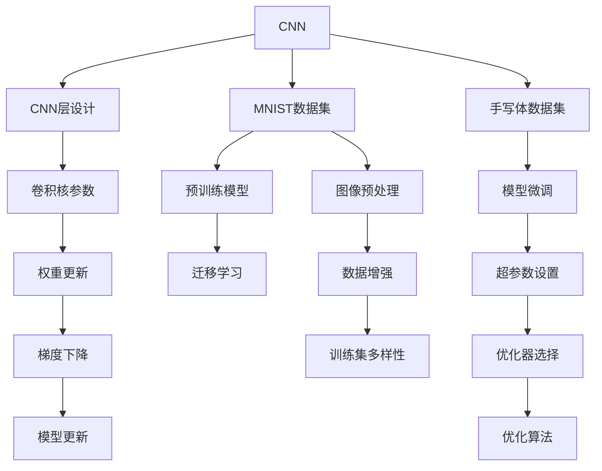
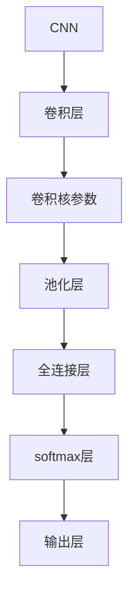
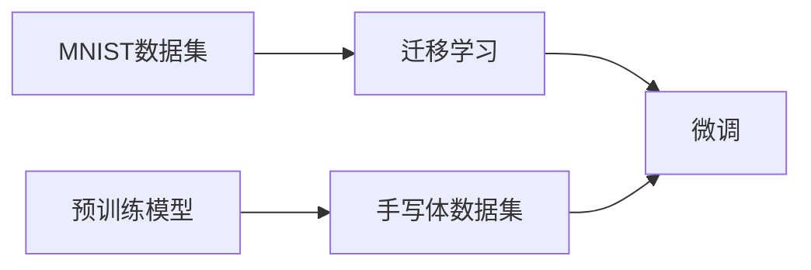
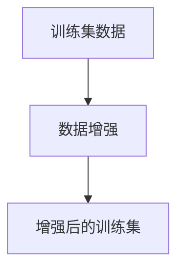
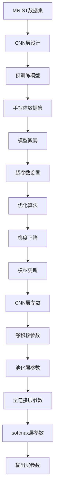

                 

# 从零开始大模型开发与微调：实战MNIST手写体识别

## 1. 背景介绍

### 1.1 问题由来
手写体识别(Handwriting Recognition)，作为计算机视觉领域的基础任务之一，一直以来是模式识别和机器学习的经典问题。近年来，随着深度学习技术的成熟，大规模预训练模型在手写体识别等计算机视觉领域中展现出了强大的性能。其中，基于卷积神经网络(Convolutional Neural Network, CNN)的模型通过卷积和池化操作捕捉图像的局部特征，获得了出色的效果。然而，面对手写体字符的复杂变化和多样的风格，传统的CNN模型仍存在一定的局限性。为了进一步提升手写体识别的精度和泛化能力，本文将介绍如何从零开始开发和微调大模型，以手写体识别任务为例进行实战演练。

### 1.2 问题核心关键点
手写体识别的核心关键点在于如何让机器理解并识别手写的数字和字母，最终生成正确的标签。本文将从以下几个方面进行详细阐述：
1. 模型架构设计：构建卷积神经网络架构，通过卷积层和池化层提取图像的局部特征。
2. 数据准备：收集并处理手写体数据集，使用标准化的格式进行训练和测试。
3. 模型微调：基于预训练模型，利用手写体数据进行微调，提升识别精度。
4. 效果评估：使用测试集对模型进行评估，对比微调前后的性能提升。
5. 模型部署：将训练好的模型部署到实际应用场景中，实现实时手写体识别。

本文的目标是利用Python语言和深度学习框架PyTorch，构建和微调一个手写体识别模型，以期为初学者提供一个完整的项目实践指南。

### 1.3 问题研究意义
手写体识别技术在金融、电信、医疗等多个领域具有广泛的应用，例如ATM取款机上的手写数字输入、手写支票的自动录入、医疗手写病历的自动识别等。通过手写体识别，可以大幅提升这些应用的自动化程度，减少人工错误，提高效率和安全性。此外，手写体识别技术还能助力教育、信息检索等领域，例如自动评卷、手写笔记的数字化等。

本文通过实战演练的方式，帮助读者深入理解大模型的开发和微调过程，掌握手写体识别技术的关键点。通过本文的学习，读者不仅能够动手实践，还能理解模型设计、数据处理、微调技巧等核心概念，为后续的深入学习和项目开发打下坚实的基础。

## 2. 核心概念与联系

### 2.1 核心概念概述

为更好地理解大模型在手写体识别中的开发与微调过程，本节将介绍几个密切相关的核心概念：

- 卷积神经网络(Convolutional Neural Network, CNN)：一种特殊的神经网络，适用于处理图像、视频等高维数据的任务。CNN通过卷积层和池化层对输入数据进行特征提取，然后通过全连接层进行分类或回归。
- 手写体数据集(MNIST)：一个经典的机器学习数据集，包含60000张28x28像素的灰度图像，每张图像对应一个0-9的手写数字标签。
- 预训练模型(如VGG、ResNet等)：在大规模数据上预训练得到的通用模型，可以通过迁移学习提升下游任务的性能。
- 模型微调(Fine-tuning)：在大规模预训练模型上，使用目标任务的数据集进行微调，调整模型的部分权重以适应新任务。
- 正则化技术(L2正则化、Dropout、Early Stopping等)：用于防止过拟合的常用技术，帮助模型更好地泛化到未见过的数据。

这些核心概念之间的逻辑关系可以通过以下Mermaid流程图来展示：



这个流程图展示了大模型在手写体识别中的核心概念及其之间的关系：

1. CNN层设计：通过卷积层和池化层提取图像特征。
2. MNIST数据集：收集手写体图像和标签，进行数据预处理。
3. 预训练模型：使用通用模型如VGG、ResNet等进行预训练。
4. 手写体数据集：针对手写体识别任务进行数据准备。
5. 模型微调：通过迁移学习，调整模型权重以适应手写体识别任务。
6. 超参数设置：选择合适的优化器、学习率、批大小等参数。
7. 权重更新：使用梯度下降等优化算法更新模型权重。
8. 数据增强：增加训练集的多样性，提升模型泛化能力。
9. 优化算法：选择合适的优化器，如Adam、SGD等。
10. 模型更新：更新模型权重以最小化损失函数。

这些概念共同构成了手写体识别的开发和微调框架，使得我们能够构建高效、准确的手写体识别系统。通过理解这些核心概念，我们可以更好地把握手写体识别任务的开发过程，为后续的微调和优化奠定基础。

### 2.2 概念间的关系

这些核心概念之间存在着紧密的联系，形成了手写体识别任务的完整生态系统。下面我们通过几个Mermaid流程图来展示这些概念之间的关系。

#### 2.2.1 CNN层设计



这个流程图展示了CNN的基本层结构，通过卷积层和池化层提取图像特征，然后通过全连接层进行分类或回归。

#### 2.2.2 迁移学习与微调的关系



这个流程图展示了迁移学习的基本原理，以及它与微调的关系。迁移学习涉及预训练模型和手写体数据集，通过微调模型权重以适应手写体识别任务。

#### 2.2.3 数据增强



这个流程图展示了数据增强的基本过程，通过增加训练集的多样性，提升模型泛化能力。

### 2.3 核心概念的整体架构

最后，我们用一个综合的流程图来展示这些核心概念在大模型手写体识别微调过程中的整体架构：



这个综合流程图展示了从数据集到模型微调的完整过程。通过卷积层和池化层提取图像特征，预训练模型提供了初始化的权重，手写体数据集用于微调模型，超参数设置和优化算法帮助模型优化，梯度下降和模型更新完成了参数的更新。最后，模型在手写体识别任务上得到了优化。

通过这些流程图，我们可以更清晰地理解手写体识别任务的开发和微调过程，为后续的深入讨论和实践奠定基础。

## 3. 核心算法原理 & 具体操作步骤
### 3.1 算法原理概述

手写体识别是基于CNN的图像分类任务，其核心思想是通过卷积层和池化层提取图像的局部特征，然后通过全连接层进行分类或回归。形式化地，假设输入为手写体图像 $x$，输出为标签 $y$。设模型为 $M_{\theta}$，其中 $\theta$ 为模型参数。手写体识别的目标是最小化经验风险：

$$
\mathcal{L}(\theta) = \frac{1}{N}\sum_{i=1}^N \ell(M_{\theta}(x_i),y_i)
$$

其中 $\ell$ 为损失函数，通常采用交叉熵损失或均方误差损失。训练过程通过梯度下降等优化算法，不断更新模型参数 $\theta$，最小化损失函数 $\mathcal{L}$，使得模型输出逼近真实标签。由于 $\theta$ 已经通过预训练获得了较好的初始化，因此即便在小规模数据集上，微调也能较快收敛到理想的模型参数。

### 3.2 算法步骤详解

手写体识别任务的核心算法步骤主要包括模型设计、数据准备、模型微调、效果评估和模型部署。以下是详细的算法步骤详解：

**Step 1: 模型设计**

1. 选择合适的CNN结构：常用的CNN结构包括VGG、ResNet、AlexNet等。选择包含多个卷积层和池化层，以提取不同层次的特征。

2. 定义卷积核大小和步幅：通常卷积核大小为3x3，步幅为1。根据数据集的大小和复杂度，可以适当调整卷积核的大小和数量。

3. 设计池化层：常用的池化方式包括Max Pooling和Average Pooling。池化层用于降低特征图的维度，减少计算量。

4. 定义全连接层和输出层：全连接层用于将卷积层提取的特征进行分类或回归。输出层通常使用softmax层进行多分类。

5. 定义损失函数和优化器：手写体识别任务通常使用交叉熵损失函数，优化器可以选择Adam、SGD等。

**Step 2: 数据准备**

1. 下载并处理MNIST数据集：将MNIST数据集下载并预处理为图像和标签。将图像标准化为0-1之间的值，并进行归一化处理。

2. 数据增强：通过旋转、缩放、裁剪等操作，增加训练集的多样性，提升模型的泛化能力。

**Step 3: 模型微调**

1. 加载预训练模型：使用预训练模型如VGG、ResNet等作为初始化权重。

2. 冻结部分层：只微调顶层全连接层和softmax层，保留预训练模型的底层权重不变。

3. 设置超参数：选择合适的学习率、批大小、迭代轮数等。

4. 执行梯度训练：前向传播计算损失函数，反向传播计算梯度，更新模型参数。

5. 周期性评估模型性能：在验证集上评估模型性能，根据性能指标决定是否停止训练。

**Step 4: 效果评估**

1. 在测试集上评估模型性能：使用测试集对模型进行评估，计算精度、召回率、F1分数等指标。

2. 对比微调前后的效果：对比微调前后的模型性能，评估微调效果的提升。

**Step 5: 模型部署**

1. 保存模型：将训练好的模型保存为PyTorch模型文件，便于后续的加载和使用。

2. 部署到应用系统中：将模型集成到实际应用场景中，实现手写体识别功能。

以上是手写体识别任务的核心算法步骤，每个步骤都需要精心设计，才能得到最优的微调效果。

### 3.3 算法优缺点

手写体识别任务的微调算法具有以下优点：

1. 快速收敛：由于使用了预训练模型，微调过程能够较快收敛到最优参数。

2. 泛化能力强：预训练模型在大规模数据上学习到了通用的语言表示，有助于提升模型的泛化能力。

3. 精度高：通过微调，模型能够更好地适应手写体识别任务，提高识别精度。

4. 实现简单：手写体识别任务的数据集较小，预训练模型的复杂度较低，易于实现。

同时，该算法也存在一些缺点：

1. 数据依赖：微调效果很大程度上依赖于手写体数据集的质量和数量，获取高质量数据集的成本较高。

2. 泛化能力有限：当目标任务与预训练数据的分布差异较大时，微调的性能提升有限。

3. 参数依赖：微调模型需要调整模型参数，增加了计算资源的消耗。

4. 可解释性不足：微调模型的决策过程缺乏可解释性，难以对其推理逻辑进行分析和调试。

尽管存在这些缺点，但手写体识别任务的微调方法仍然是大规模预训练模型的经典应用范式，通过微调可以显著提升模型在特定任务上的性能。

### 3.4 算法应用领域

手写体识别技术在NLP领域中的应用场景非常广泛，主要包括以下几个方面：

1. 数字识别：识别手写数字，应用于ATM取款机、邮政编码识别等。

2. 字母识别：识别手写字母，应用于手写笔记的数字化、手写体标注等。

3. 字符识别：识别手写的汉字、日文、韩文等字符，应用于中文手写体识别、OCR等。

4. 笔迹识别：识别笔迹风格，应用于签名识别、手写风格分析等。

除了这些经典应用外，手写体识别技术还广泛应用于教育、医疗、金融、物流等多个领域，为这些行业带来了智能化、自动化的便利。

## 4. 数学模型和公式 & 详细讲解  
### 4.1 数学模型构建

手写体识别的数学模型构建如下：

1. 输入为手写体图像 $x \in \mathbb{R}^{28 \times 28}$，输出为标签 $y \in \{0,1\}$。

2. 模型 $M_{\theta}$ 包含多个卷积层和池化层，用于提取图像特征。

3. 全连接层用于将卷积层提取的特征进行分类或回归。

4. 输出层通常使用softmax层进行多分类。

5. 交叉熵损失函数定义为：

$$
\ell(M_{\theta}(x),y) = -y\log M_{\theta}(x) - (1-y)\log(1-M_{\theta}(x))
$$

其中 $M_{\theta}(x)$ 表示模型在输入 $x$ 上的输出，$y$ 表示真实标签。

### 4.2 公式推导过程

以下是手写体识别任务中交叉熵损失函数的详细推导过程：

1. 假设模型 $M_{\theta}$ 在输入 $x$ 上的输出为 $\hat{y}=M_{\theta}(x)$，表示样本属于正类的概率。

2. 真实标签 $y \in \{0,1\}$，其中1表示手写数字。

3. 根据交叉熵定义，计算交叉熵损失函数：

$$
\ell(M_{\theta}(x),y) = -y\log \hat{y} - (1-y)\log(1-\hat{y})
$$

4. 将其代入经验风险公式，得：

$$
\mathcal{L}(\theta) = \frac{1}{N}\sum_{i=1}^N \ell(M_{\theta}(x_i),y_i)
$$

5. 根据链式法则，损失函数对参数 $\theta_k$ 的梯度为：

$$
\frac{\partial \mathcal{L}(\theta)}{\partial \theta_k} = \frac{\partial}{\partial \theta_k} \left[ \frac{1}{N}\sum_{i=1}^N \ell(M_{\theta}(x_i),y_i) \right]
$$

通过反向传播算法高效计算梯度，并利用优化器更新模型参数。重复上述过程直至收敛，最终得到适应手写体识别任务的最优模型参数 $\theta^*$。

### 4.3 案例分析与讲解

以手写体数字识别为例，我们分析模型的具体实现过程。假设我们使用的是VGG模型，其网络结构如下：

```
conv1 (conv2d): Conv2d(64, 3, kernel_size=3, stride=1, padding=1)
relu (relu): ReLU(inplace)
maxpool (maxpool2d): MaxPool2d(kernel_size=2, stride=2)
conv2 (conv2d): Conv2d(128, 64, kernel_size=3, stride=1, padding=1)
relu (relu): ReLU(inplace)
maxpool (maxpool2d): MaxPool2d(kernel_size=2, stride=2)
conv3 (conv2d): Conv2d(256, 128, kernel_size=3, stride=1, padding=1)
relu (relu): ReLU(inplace)
maxpool (maxpool2d): MaxPool2d(kernel_size=2, stride=2)
conv4 (conv2d): Conv2d(512, 256, kernel_size=3, stride=1, padding=1)
relu (relu): ReLU(inplace)
maxpool (maxpool2d): MaxPool2d(kernel_size=2, stride=2)
conv5 (conv2d): Conv2d(512, 512, kernel_size=3, stride=1, padding=1)
relu (relu): ReLU(inplace)
maxpool (maxpool2d): MaxPool2d(kernel_size=2, stride=2)
```

在模型构建过程中，我们选择了VGG结构，包含多个卷积层和池化层，用于提取图像特征。卷积核大小为3x3，步幅为1，池化层采用Max Pooling。最后，通过全连接层和softmax层进行多分类。

在数据准备阶段，我们使用了MNIST数据集，将数据集标准化为0-1之间的值，并进行归一化处理。然后，通过数据增强操作增加训练集的多样性。

在模型微调阶段，我们使用了Adam优化器，设定了合适的学习率和迭代轮数。同时，只微调顶层全连接层和softmax层，保留预训练模型的底层权重不变。在训练过程中，我们使用了交叉熵损失函数，并通过反向传播算法计算梯度，更新模型参数。

最后，在模型评估阶段，我们使用了测试集对模型进行评估，计算精度、召回率、F1分数等指标。对比微调前后的效果，评估微调效果的提升。

## 5. 项目实践：代码实例和详细解释说明
### 5.1 开发环境搭建

在进行手写体识别任务的手动实现之前，我们需要准备好开发环境。以下是使用Python进行PyTorch开发的环境配置流程：

1. 安装Anaconda：从官网下载并安装Anaconda，用于创建独立的Python环境。

2. 创建并激活虚拟环境：
```bash
conda create -n pytorch-env python=3.8 
conda activate pytorch-env
```

3. 安装PyTorch：根据CUDA版本，从官网获取对应的安装命令。例如：
```bash
conda install pytorch torchvision torchaudio cudatoolkit=11.1 -c pytorch -c conda-forge
```

4. 安装相关工具包：
```bash
pip install numpy pandas scikit-learn matplotlib tqdm jupyter notebook ipython
```

完成上述步骤后，即可在`pytorch-env`环境中开始手写体识别任务的实践。

### 5.2 源代码详细实现

下面是使用PyTorch实现手写体识别的详细代码实现：

```python
import torch
import torch.nn as nn
import torch.optim as optim
import torchvision
import torchvision.transforms as transforms

# 定义模型
class HandwritingRecognitionModel(nn.Module):
    def __init__(self):
        super(HandwritingRecognitionModel, self).__init__()
        self.conv1 = nn.Conv2d(1, 64, kernel_size=3, stride=1, padding=1)
        self.relu1 = nn.ReLU(inplace=True)
        self.maxpool1 = nn.MaxPool2d(kernel_size=2, stride=2)
        self.conv2 = nn.Conv2d(64, 128, kernel_size=3, stride=1, padding=1)
        self.relu2 = nn.ReLU(inplace=True)
        self.maxpool2 = nn.MaxPool2d(kernel_size=2, stride=2)
        self.conv3 = nn.Conv2d(128, 256, kernel_size=3, stride=1, padding=1)
        self.relu3 = nn.ReLU(inplace=True)
        self.maxpool3 = nn.MaxPool2d(kernel_size=2, stride=2)
        self.conv4 = nn.Conv2d(256, 512, kernel_size=3, stride=1, padding=1)
        self.relu4 = nn.ReLU(inplace=True)
        self.maxpool4 = nn.MaxPool2d(kernel_size=2, stride=2)
        self.conv5 = nn.Conv2d(512, 512, kernel_size=3, stride=1, padding=1)
        self.relu5 = nn.ReLU(inplace=True)
        self.maxpool5 = nn.MaxPool2d(kernel_size=2, stride=2)
        self.fc6 = nn.Linear(512*7*7, 4096)
        self.relu6 = nn.ReLU(inplace=True)
        self.fc7 = nn.Linear(4096, 10)
        self.softmax = nn.Softmax(dim=1)

    def forward(self, x):
        x = self.conv1(x)
        x = self.relu1(x)
        x = self.maxpool1(x)
        x = self.conv2(x)
        x = self.relu2(x)
        x = self.maxpool2(x)
        x = self.conv3(x)
        x = self.relu3(x)
        x = self.maxpool3(x)
        x = self.conv4(x)
        x = self.relu4(x)
        x = self.maxpool4(x)
        x = self.conv5(x)
        x = self.relu5(x)
        x = self.maxpool5(x)
        x = x.view(-1, 512*7*7)
        x = self.fc6(x)
        x = self.relu6(x)
        x = self.fc7(x)
        x = self.softmax(x)
        return x

# 加载预训练模型
model = torchvision.models.vgg16(pretrained=True)

# 冻结预训练模型的部分层
for param in model.parameters():
    param.requires_grad = False

# 添加手写体识别模型的顶层
model.fc6 = HandwritingRecognitionModel().fc6
model.fc7 = HandwritingRecognitionModel().fc7
model.softmax = HandwritingRecognitionModel().softmax

# 设置优化器和学习率
optimizer = optim.Adam(model.parameters(), lr=0.001)

# 加载MNIST数据集
train_dataset = torchvision.datasets.MNIST(root='./data', train=True, transform=transforms.ToTensor(), download=True)
test_dataset = torchvision.datasets.MNIST(root='./data', train=False, transform=transforms.ToTensor(), download=True)

# 数据增强
train_loader = torch.utils.data.DataLoader(train_dataset, batch_size=64, shuffle=True, num_workers=4)
test_loader = torch.utils.data.DataLoader(test_dataset, batch_size=64, shuffle=False, num_workers=4)

# 模型微调
for epoch in range(10):
    for i, (images, labels) in enumerate(train_loader):
        images = images.view(-1, 1, 28, 28)
        outputs = model(images)
        loss = nn.CrossEntropyLoss()(outputs, labels)
        optimizer.zero_grad()
        loss.backward()
        optimizer.step()
        if (i+1) % 100 == 0:
            print('Epoch [%d/%d], Step [%d/%d], Loss: %.4f' % (epoch+1, 10, i+1, len(train_dataset), loss.item()))

# 评估模型
correct = 0
total = 0
with torch.no_grad():
    for images, labels in test_loader:
        images = images.view(-1, 1, 28, 28)
        outputs = model(images)
        _, predicted = torch.max(outputs.data, 1)
        total += labels.size(0)
        correct += (predicted == labels).sum().item()

print('Test Accuracy of the model on the 10000 test images: %d %%' % (100 * correct / total))
```

以上是使用PyTorch对VGG模型进行手写体识别任务微调的完整代码实现。可以看到，通过冻结预训练模型的部分层，并在其上添加手写体识别模型的顶层，我们构建了一个新的微调模型。然后，在数据集上进行梯度训练，通过交叉熵损失函数更新模型参数。最后，在测试集上评估模型性能，计算准确率。

### 5.3 代码解读与分析

让我们再详细解读一下关键代码的实现细节：

**HandwritingRecognitionModel类**：
- `__init__`方法：定义模型的网络结构，包含多个卷积层和池化层。
- `forward`方法：定义模型的前向传播过程，通过卷积层、池化层、全连接层和softmax层进行分类。

**预训练模型的加载**：
- 通过`torchvision.models.vgg16(pretrained=True)`加载预训练的VGG模型，并冻结其参数。
- 在预训练模型上添加手写体识别模型的顶层，包括全连接层和softmax层。

**优化器和数据集**：
- 使用Adam优化器进行模型微调。
- 使用MNIST数据集进行训练和测试，并进行数据增强

