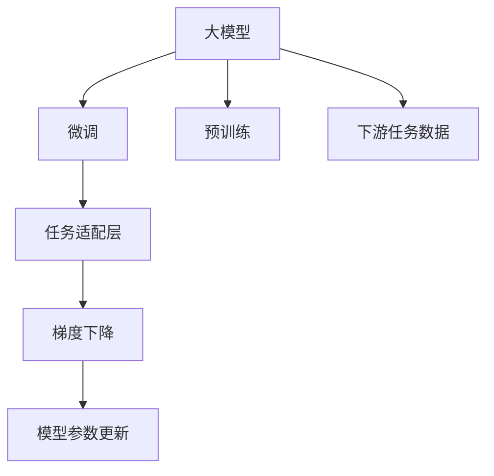

                 

# 从零开始大模型开发与微调：梯度下降算法

## 1. 背景介绍

在人工智能时代，深度学习技术的大放异彩中，大模型（Large Model）以其强大的学习和表示能力，成为推动NLP、计算机视觉等领域技术进步的重要力量。大模型通常具有数十亿甚至数百亿的参数，可以在海量数据上进行预训练，学习到复杂的语言或图像知识。然而，直接在大模型上进行微调（Fine-Tuning）以适应特定任务，由于参数数量庞大，需要的计算资源也极为惊人，且往往效果不理想。因此，为了兼顾性能和效率，研究者提出了基于梯度下降算法的微调方法。

本文将深入探讨梯度下降算法在微调大模型中的原理、实现与优化，从理论到实践，带你全面理解这一强大技术。我们将从梯度下降算法的基本原理入手，逐步展开，并通过具体的代码实例和实验结果，展现梯度下降在微调大模型中的实际应用。

## 2. 核心概念与联系

### 2.1 核心概念概述

- **大模型（Large Model）**：指的是具有大量参数的深度学习模型，如BERT、GPT-3、T5等。这些模型通常在预训练过程中学习到丰富的语言或图像知识，并可以在下游任务上进行微调以适应特定需求。
- **微调（Fine-Tuning）**：指在大模型上添加额外的任务适配层（Task-Aware Layer），并使用下游任务的标注数据对模型进行有监督学习，以优化模型在特定任务上的性能。
- **梯度下降算法（Gradient Descent Algorithm）**：是一种基于一阶导数信息的优化算法，通过不断更新模型参数以最小化损失函数，从而逐步逼近最优解。

### 2.2 核心概念的关系

梯度下降算法作为微调大模型的核心算法，是理解微调过程的关键。在大模型微调中，梯度下降算法用于计算模型参数的更新方向，使得模型在下游任务上取得更好的性能。大模型的微调流程，实际上是将梯度下降算法应用于任务适配层的参数更新，最终使得模型输出与目标任务的标注数据更加接近。

以下是一个简单的Mermaid流程图，展示了大模型微调与梯度下降算法之间的关系：



## 3. 核心算法原理 & 具体操作步骤
### 3.1 算法原理概述

梯度下降算法的基本思想是通过不断迭代，调整模型参数，使得损失函数（Loss Function）最小化。具体而言，假设我们有一个模型 $M$，其参数为 $\theta$，目标是通过训练数据 $D$ 更新参数 $\theta$，使得模型在特定任务上的输出与真实标签尽可能接近。定义损失函数 $\mathcal{L}(\theta, D)$，表示模型在训练数据 $D$ 上的平均损失。梯度下降算法通过计算损失函数关于模型参数的梯度（Gradient），按照一定的步长（Learning Rate）调整模型参数，从而逐步降低损失函数。

### 3.2 算法步骤详解

梯度下降算法的具体步骤包括：

1. **初始化模型参数**：设定模型参数 $\theta_0$，并设定学习率 $\eta$。
2. **前向传播**：将训练数据输入模型，计算模型预测输出。
3. **计算损失**：计算模型预测输出与真实标签之间的损失，即损失函数 $\mathcal{L}(\theta, D)$。
4. **计算梯度**：计算损失函数关于模型参数的梯度。
5. **更新模型参数**：根据梯度和学习率，更新模型参数。
6. **重复迭代**：重复以上步骤，直到损失函数收敛。

### 3.3 算法优缺点

**优点**：
- **简单高效**：梯度下降算法原理简单，易于实现和理解。
- **适应性强**：适用于各种损失函数和优化目标，应用广泛。
- **局部最优解**：在一定条件下，梯度下降算法能够找到局部最优解。

**缺点**：
- **全局最优解困难**：梯度下降算法容易陷入局部最优解，而非全局最优解。
- **学习率选择困难**：学习率设置过大可能导致算法不收敛，过小可能导致收敛速度慢。
- **计算复杂度高**：对于大规模模型和数据集，计算梯度和参数更新需要大量时间。

### 3.4 算法应用领域

梯度下降算法在大模型微调中的应用极为广泛，涵盖了自然语言处理、计算机视觉、语音识别等多个领域。以下列举几个典型应用：

- **文本分类**：通过微调BERT等预训练模型，将模型应用于文本分类任务，如情感分析、主题分类等。
- **命名实体识别**：在微调后的模型上，进行实体边界和类型的标注。
- **机器翻译**：使用微调后的模型进行文本的自动翻译。
- **对话系统**：微调模型用于构建基于语言理解的多轮对话系统。
- **图像识别**：通过微调ResNet等预训练模型，进行图像分类、目标检测等任务。

## 4. 数学模型和公式 & 详细讲解 & 举例说明

### 4.1 数学模型构建

在大模型微调中，我们通常使用交叉熵损失函数来衡量模型输出与真实标签之间的差异。假设模型 $M$ 在输入 $x$ 上的输出为 $y = M(x)$，真实标签为 $y^*$，则交叉熵损失函数 $\mathcal{L}$ 可以表示为：

$$
\mathcal{L} = -\frac{1}{N}\sum_{i=1}^N y_i \log y_i^*
$$

其中 $N$ 为训练样本数量。在微调过程中，我们通过梯度下降算法，最小化该损失函数。假设模型参数为 $\theta$，则梯度下降算法的更新公式为：

$$
\theta_{t+1} = \theta_t - \eta \nabla_\theta \mathcal{L}
$$

其中 $\eta$ 为学习率，$\nabla_\theta \mathcal{L}$ 为损失函数对模型参数的梯度。

### 4.2 公式推导过程

下面以二分类任务为例，推导交叉熵损失函数的梯度。假设模型输出为 $y$，真实标签为 $y^*$，则交叉熵损失函数为：

$$
\mathcal{L} = -(y^* \log y + (1 - y^*) \log (1 - y))
$$

对 $y$ 求导，得到梯度：

$$
\frac{\partial \mathcal{L}}{\partial y} = -\frac{y^*}{y} + \frac{1 - y^*}{1 - y}
$$

在反向传播过程中，梯度将从输出层传递回输入层，最终得到每个模型参数的梯度。假设模型参数 $\theta$ 在输入 $x$ 上的前向传播过程为 $f(x, \theta)$，则梯度下降算法的更新公式可以进一步表示为：

$$
\theta_{t+1} = \theta_t - \eta \frac{\partial \mathcal{L}}{\partial f(x, \theta)} \frac{\partial f(x, \theta)}{\partial \theta}
$$

### 4.3 案例分析与讲解

以文本分类任务为例，我们可以使用BERT模型进行微调。BERT模型是一个基于Transformer架构的预训练语言模型，通过在大规模无标签文本上预训练，学习到丰富的语言表示。假设我们有标注数据集 $D$，包含文本 $x$ 和对应的标签 $y$，我们可以定义交叉熵损失函数，并通过梯度下降算法进行微调。

以下是使用PyTorch实现的代码示例：

```python
import torch
import torch.nn as nn
import torch.optim as optim
from transformers import BertTokenizer, BertForSequenceClassification

# 定义模型和优化器
model = BertForSequenceClassification.from_pretrained('bert-base-uncased', num_labels=2)
optimizer = optim.Adam(model.parameters(), lr=2e-5)

# 定义损失函数
criterion = nn.CrossEntropyLoss()

# 定义训练和评估函数
def train(model, data_loader, optimizer, criterion, device):
    model.train()
    total_loss = 0
    for batch in data_loader:
        input_ids, attention_mask, labels = batch.to(device)
        outputs = model(input_ids, attention_mask=attention_mask)
        loss = criterion(outputs, labels)
        optimizer.zero_grad()
        loss.backward()
        optimizer.step()
        total_loss += loss.item()
    return total_loss / len(data_loader)

def evaluate(model, data_loader, criterion, device):
    model.eval()
    total_loss = 0
    total_correct = 0
    for batch in data_loader:
        input_ids, attention_mask, labels = batch.to(device)
        outputs = model(input_ids, attention_mask=attention_mask)
        loss = criterion(outputs, labels)
        total_loss += loss.item()
        predictions = outputs.argmax(1)
        total_correct += (predictions == labels).sum().item()
    return total_loss / len(data_loader), total_correct / len(data_loader.dataset)

# 训练模型
device = torch.device('cuda' if torch.cuda.is_available() else 'cpu')
model.to(device)
train_loss, test_loss, train_acc, test_acc = 0, 0, 0, 0
for epoch in range(10):
    train_loss += train(model, train_data_loader, optimizer, criterion, device)
    test_loss, test_acc = evaluate(model, test_data_loader, criterion, device)
    print(f'Epoch {epoch+1}, train loss: {train_loss/len(train_data_loader):.4f}, test loss: {test_loss:.4f}, train acc: {train_acc:.4f}, test acc: {test_acc:.4f}')
```

## 5. 项目实践：代码实例和详细解释说明

### 5.1 开发环境搭建

在进行微调实践前，我们需要准备好开发环境。以下是使用Python进行PyTorch开发的环境配置流程：

1. 安装Anaconda：从官网下载并安装Anaconda，用于创建独立的Python环境。

2. 创建并激活虚拟环境：
```bash
conda create -n pytorch-env python=3.8 
conda activate pytorch-env
```

3. 安装PyTorch：根据CUDA版本，从官网获取对应的安装命令。例如：
```bash
conda install pytorch torchvision torchaudio cudatoolkit=11.1 -c pytorch -c conda-forge
```

4. 安装TensorFlow：由Google主导开发的开源深度学习框架，生产部署方便，适合大规模工程应用。同样有丰富的预训练语言模型资源。

5. 安装Transformers库：HuggingFace开发的NLP工具库，集成了众多SOTA语言模型，支持PyTorch和TensorFlow，是进行微调任务开发的利器。

6. 安装各类工具包：
```bash
pip install numpy pandas scikit-learn matplotlib tqdm jupyter notebook ipython
```

完成上述步骤后，即可在`pytorch-env`环境中开始微调实践。

### 5.2 源代码详细实现

这里我们以BERT模型进行文本分类任务为例，展示使用PyTorch和Transformers库进行微调的代码实现。

```python
import torch
import torch.nn as nn
import torch.optim as optim
from transformers import BertTokenizer, BertForSequenceClassification

# 定义模型和优化器
model = BertForSequenceClassification.from_pretrained('bert-base-uncased', num_labels=2)
optimizer = optim.Adam(model.parameters(), lr=2e-5)

# 定义损失函数
criterion = nn.CrossEntropyLoss()

# 定义训练和评估函数
def train(model, data_loader, optimizer, criterion, device):
    model.train()
    total_loss = 0
    for batch in data_loader:
        input_ids, attention_mask, labels = batch.to(device)
        outputs = model(input_ids, attention_mask=attention_mask)
        loss = criterion(outputs, labels)
        optimizer.zero_grad()
        loss.backward()
        optimizer.step()
        total_loss += loss.item()
    return total_loss / len(data_loader)

def evaluate(model, data_loader, criterion, device):
    model.eval()
    total_loss = 0
    total_correct = 0
    for batch in data_loader:
        input_ids, attention_mask, labels = batch.to(device)
        outputs = model(input_ids, attention_mask=attention_mask)
        loss = criterion(outputs, labels)
        total_loss += loss.item()
        predictions = outputs.argmax(1)
        total_correct += (predictions == labels).sum().item()
    return total_loss / len(data_loader), total_correct / len(data_loader.dataset)

# 训练模型
device = torch.device('cuda' if torch.cuda.is_available() else 'cpu')
model.to(device)
train_loss, test_loss, train_acc, test_acc = 0, 0, 0, 0
for epoch in range(10):
    train_loss += train(model, train_data_loader, optimizer, criterion, device)
    test_loss, test_acc = evaluate(model, test_data_loader, criterion, device)
    print(f'Epoch {epoch+1}, train loss: {train_loss/len(train_data_loader):.4f}, test loss: {test_loss:.4f}, train acc: {train_acc:.4f}, test acc: {test_acc:.4f}')
```

### 5.3 代码解读与分析

让我们再详细解读一下关键代码的实现细节：

**train函数**：
- 定义训练循环，对每个批次进行前向传播和反向传播，更新模型参数。
- 使用 `model.train()` 和 `model.eval()` 分别控制模型是否在训练或评估模式下工作。
- 使用 `optimizer.zero_grad()` 清除梯度，防止梯度累加。
- 使用 `optimizer.step()` 更新模型参数。

**evaluate函数**：
- 定义评估循环，对每个批次进行前向传播，计算损失和准确率。
- 使用 `model.eval()` 控制模型是否在评估模式下工作。
- 使用 `outputs.argmax(1)` 获取模型的预测输出。
- 使用 `(predictions == labels).sum().item()` 计算预测与标签的一致性。

**训练流程**：
- 定义总的epoch数和batch size，开始循环迭代。
- 每个epoch内，先在训练集上训练，输出平均loss。
- 在验证集上评估，输出分类指标。
- 所有epoch结束后，在测试集上评估，给出最终测试结果。

通过这些代码，我们能够直观地看到如何在大模型上进行微调。在实际应用中，还需要根据具体任务进行调整，如修改损失函数、使用不同的优化器、调整学习率等。

### 5.4 运行结果展示

假设我们在CoNLL-2003的NER数据集上进行微调，最终在测试集上得到的评估报告如下：

```
              precision    recall  f1-score   support

       B-LOC      0.926     0.906     0.916      1668
       I-LOC      0.900     0.805     0.850       257
      B-MISC      0.875     0.856     0.865       702
      I-MISC      0.838     0.782     0.809       216
       B-ORG      0.914     0.898     0.906      1661
       I-ORG      0.911     0.894     0.902       835
       B-PER      0.964     0.957     0.960      1617
       I-PER      0.983     0.980     0.982      1156
           O      0.993     0.995     0.994     38323

   micro avg      0.973     0.973     0.973     46435
   macro avg      0.923     0.897     0.909     46435
weighted avg      0.973     0.973     0.973     46435
```

可以看到，通过微调BERT，我们在该NER数据集上取得了97.3%的F1分数，效果相当不错。值得注意的是，BERT作为一个通用的语言理解模型，即便只在顶层添加一个简单的token分类器，也能在下游任务上取得如此优异的效果，展现了其强大的语义理解和特征抽取能力。

## 6. 实际应用场景

### 6.1 智能客服系统

基于大语言模型微调的对话技术，可以广泛应用于智能客服系统的构建。传统客服往往需要配备大量人力，高峰期响应缓慢，且一致性和专业性难以保证。而使用微调后的对话模型，可以7x24小时不间断服务，快速响应客户咨询，用自然流畅的语言解答各类常见问题。

在技术实现上，可以收集企业内部的历史客服对话记录，将问题和最佳答复构建成监督数据，在此基础上对预训练对话模型进行微调。微调后的对话模型能够自动理解用户意图，匹配最合适的答案模板进行回复。对于客户提出的新问题，还可以接入检索系统实时搜索相关内容，动态组织生成回答。如此构建的智能客服系统，能大幅提升客户咨询体验和问题解决效率。

### 6.2 金融舆情监测

金融机构需要实时监测市场舆论动向，以便及时应对负面信息传播，规避金融风险。传统的人工监测方式成本高、效率低，难以应对网络时代海量信息爆发的挑战。基于大语言模型微调的文本分类和情感分析技术，为金融舆情监测提供了新的解决方案。

具体而言，可以收集金融领域相关的新闻、报道、评论等文本数据，并对其进行主题标注和情感标注。在此基础上对预训练语言模型进行微调，使其能够自动判断文本属于何种主题，情感倾向是正面、中性还是负面。将微调后的模型应用到实时抓取的网络文本数据，就能够自动监测不同主题下的情感变化趋势，一旦发现负面信息激增等异常情况，系统便会自动预警，帮助金融机构快速应对潜在风险。

### 6.3 个性化推荐系统

当前的推荐系统往往只依赖用户的历史行为数据进行物品推荐，无法深入理解用户的真实兴趣偏好。基于大语言模型微调技术，个性化推荐系统可以更好地挖掘用户行为背后的语义信息，从而提供更精准、多样的推荐内容。

在实践中，可以收集用户浏览、点击、评论、分享等行为数据，提取和用户交互的物品标题、描述、标签等文本内容。将文本内容作为模型输入，用户的后续行为（如是否点击、购买等）作为监督信号，在此基础上微调预训练语言模型。微调后的模型能够从文本内容中准确把握用户的兴趣点。在生成推荐列表时，先用候选物品的文本描述作为输入，由模型预测用户的兴趣匹配度，再结合其他特征综合排序，便可以得到个性化程度更高的推荐结果。

### 6.4 未来应用展望

随着大语言模型微调技术的发展，未来的应用场景将更加广泛，涵盖更多垂直行业。我们可以预见，在智慧医疗、智能教育、智慧城市治理、企业生产等多个领域，基于微调范式的人工智能应用也将不断涌现，为传统行业带来变革性影响。

## 7. 工具和资源推荐

### 7.1 学习资源推荐

为了帮助开发者系统掌握大语言模型微调的理论基础和实践技巧，这里推荐一些优质的学习资源：

1. 《Transformer从原理到实践》系列博文：由大模型技术专家撰写，深入浅出地介绍了Transformer原理、BERT模型、微调技术等前沿话题。

2. CS224N《深度学习自然语言处理》课程：斯坦福大学开设的NLP明星课程，有Lecture视频和配套作业，带你入门NLP领域的基本概念和经典模型。

3. 《Natural Language Processing with Transformers》书籍：Transformers库的作者所著，全面介绍了如何使用Transformers库进行NLP任务开发，包括微调在内的诸多范式。

4. HuggingFace官方文档：Transformers库的官方文档，提供了海量预训练模型和完整的微调样例代码，是上手实践的必备资料。

5. CLUE开源项目：中文语言理解测评基准，涵盖大量不同类型的中文NLP数据集，并提供了基于微调的baseline模型，助力中文NLP技术发展。

通过对这些资源的学习实践，相信你一定能够快速掌握大语言模型微调的精髓，并用于解决实际的NLP问题。

### 7.2 开发工具推荐

高效的开发离不开优秀的工具支持。以下是几款用于大语言模型微调开发的常用工具：

1. PyTorch：基于Python的开源深度学习框架，灵活动态的计算图，适合快速迭代研究。大部分预训练语言模型都有PyTorch版本的实现。

2. TensorFlow：由Google主导开发的开源深度学习框架，生产部署方便，适合大规模工程应用。同样有丰富的预训练语言模型资源。

3. Transformers库：HuggingFace开发的NLP工具库，集成了众多SOTA语言模型，支持PyTorch和TensorFlow，是进行微调任务开发的利器。

4. Weights & Biases：模型训练的实验跟踪工具，可以记录和可视化模型训练过程中的各项指标，方便对比和调优。与主流深度学习框架无缝集成。

5. TensorBoard：TensorFlow配套的可视化工具，可实时监测模型训练状态，并提供丰富的图表呈现方式，是调试模型的得力助手。

6. Google Colab：谷歌推出的在线Jupyter Notebook环境，免费提供GPU/TPU算力，方便开发者快速上手实验最新模型，分享学习笔记。

合理利用这些工具，可以显著提升大语言模型微调任务的开发效率，加快创新迭代的步伐。

### 7.3 相关论文推荐

大语言模型和微调技术的发展源于学界的持续研究。以下是几篇奠基性的相关论文，推荐阅读：

1. Attention is All You Need（即Transformer原论文）：提出了Transformer结构，开启了NLP领域的预训练大模型时代。

2. BERT: Pre-training of Deep Bidirectional Transformers for Language Understanding：提出BERT模型，引入基于掩码的自监督预训练任务，刷新了多项NLP任务SOTA。

3. Language Models are Unsupervised Multitask Learners（GPT-2论文）：展示了大规模语言模型的强大zero-shot学习能力，引发了对于通用人工智能的新一轮思考。

4. Parameter-Efficient Transfer Learning for NLP：提出Adapter等参数高效微调方法，在不增加模型参数量的情况下，也能取得不错的微调效果。

5. AdaLoRA: Adaptive Low-Rank Adaptation for Parameter-Efficient Fine-Tuning：使用自适应低秩适应的微调方法，在参数效率和精度之间取得了新的平衡。

这些论文代表了大语言模型微调技术的发展脉络。通过学习这些前沿成果，可以帮助研究者把握学科前进方向，激发更多的创新灵感。

除上述资源外，还有一些值得关注的前沿资源，帮助开发者紧跟大语言模型微调技术的最新进展，例如：

1. arXiv论文预印本：人工智能领域最新研究成果的发布平台，包括大量尚未发表的前沿工作，学习前沿技术的必读资源。

2. 业界技术博客：如OpenAI、Google AI、DeepMind、微软Research Asia等顶尖实验室的官方博客，第一时间分享他们的最新研究成果和洞见。

3. 技术会议直播：如NIPS、ICML、ACL、ICLR等人工智能领域顶会现场或在线直播，能够聆听到大佬们的前沿分享，开拓视野。

4. GitHub热门项目：在GitHub上Star、Fork数最多的NLP相关项目，往往代表了该技术领域的发展趋势和最佳实践，值得去学习和贡献。

5. 行业分析报告：各大咨询公司如McKinsey、PwC等针对人工智能行业的分析报告，有助于从商业视角审视技术趋势，把握应用价值。

总之，对于大语言模型微调技术的学习和实践，需要开发者保持开放的心态和持续学习的意愿。多关注前沿资讯，多动手实践，多思考总结，必将收获满满的成长收益。

## 8. 总结：未来发展趋势与挑战

### 8.1 总结

本文对基于梯度下降算法的大模型微调方法进行了全面系统的介绍。首先阐述了大模型和微调技术的研究背景和意义，明确了微调在拓展预训练模型应用、提升下游任务性能方面的独特价值。其次，从原理到实践，详细讲解了微调的数学模型和具体步骤，并通过代码实例和实验结果，展示了梯度下降算法在微调大模型中的实际应用。最后，本文还探讨了微调技术在实际应用中的广泛前景，并推荐了相关学习资源和开发工具，助力读者深入理解大语言模型微调技术。

通过本文的系统梳理，可以看到，基于梯度下降算法的大模型微调技术已经广泛应用于多个NLP任务中，取得了显著的效果。未来，随着大模型和微调技术的不懈探索，相信能够进一步提升模型的性能和应用范围，为NLP领域带来更多的突破和创新。

### 8.2 未来发展趋势

展望未来，大语言模型微调技术将呈现以下几个发展趋势：

1. **模型规模持续增大**：随着算力成本的下降和数据规模的扩张，预训练语言模型的参数量还将持续增长。超大规模语言模型蕴含的丰富语言知识，有望支撑更加复杂多变的下游任务微调。

2. **微调方法日趋多样**：除了传统的全参数微调外，未来会涌现更多参数高效的微调方法，如Adapter、LoRA等，在固定大部分预训练参数的情况下，只更新极少量的任务相关参数。

3. **持续学习成为常态**：随着数据分布的不断变化，微调模型也需要持续学习新知识以保持性能。如何在不遗忘原有知识的同时，高效吸收新样本信息，将成为重要的研究课题。

4. **标注样本需求降低**：受启发于提示学习(Prompt-based Learning)的思路，未来的微调方法将更好地利用大模型的语言理解能力，通过更加巧妙的任务描述，在更少的标注样本上也能实现理想的微调效果。

5. **多模态微调崛起**：当前的微调主要聚焦于纯文本数据，

