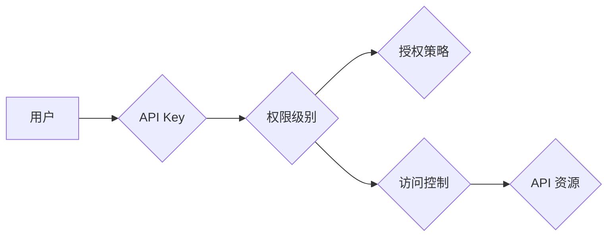

# 分级 API Key 的使用案例

> 关键词：API Key, 分级访问控制, 接口权限管理, 安全性, 可扩展性, 授权策略

## 1. 背景介绍

随着互联网服务的快速发展，API（应用程序编程接口）已经成为连接不同系统和应用程序的重要桥梁。API Key 作为一种身份验证和授权机制，广泛应用于各种在线服务中。然而，随着 API 使用者数量的增加和业务需求的多样化，单一的 API Key 策略已经难以满足不同用户和场景的需求。因此，分级 API Key 应运而生，它通过不同级别的权限控制，实现了更精细化的访问管理和安全性保障。

### 1.1 问题的由来

传统的 API Key 策略通常只提供两种角色：开发者或用户。这种二元角色划分在许多场景下难以满足需求，例如：

- 不同用户对 API 的访问权限不同，需要区分高级用户和普通用户。
- 企业内部不同团队对 API 的访问需求不同，需要控制权限以避免误操作或数据泄露。
- 需要对 API 使用进行计费，根据使用量或功能模块进行收费。

### 1.2 研究现状

为了解决上述问题，分级 API Key 策略被提出并广泛应用。这种策略将 API Key 分为不同的级别，每个级别对应不同的权限和功能。通过这种方式，可以实现对 API 资源的精细化管理，提高系统的安全性和可扩展性。

### 1.3 研究意义

研究分级 API Key 的使用案例，对于以下方面具有重要意义：

- 提高系统的安全性，通过权限控制减少数据泄露和滥用风险。
- 提升用户体验，满足不同用户的需求，提供个性化的服务。
- 降低运维成本，通过自动化授权策略减少人工干预。
- 促进业务发展，通过灵活的授权机制支持多样化的商业模式。

## 2. 核心概念与联系

### 2.1 核心概念原理

分级 API Key 的核心概念包括：

- **API Key**：一个唯一的标识符，用于验证用户的身份。
- **权限级别**：定义了用户或用户组可以访问的 API 资源和功能。
- **授权策略**：决定如何分配和更新权限级别。
- **访问控制**：根据用户的权限级别控制对 API 资源的访问。

### 2.2 核心概念架构

以下是一个基于 Mermaid 流程图的核心概念架构：



在这个架构中，用户通过 API Key 获取相应的权限级别，授权策略定义了权限的分配规则，访问控制确保用户只能访问其权限范围内的资源。

## 3. 核心算法原理 & 具体操作步骤

### 3.1 算法原理概述

分级 API Key 的核心算法原理是，根据用户的角色、组织结构或使用情况，动态分配不同的权限级别，并通过访问控制机制确保用户只能访问其授权的资源。

### 3.2 算法步骤详解

分级 API Key 的具体操作步骤如下：

1. **用户注册**：用户注册时，系统为其分配一个 API Key。
2. **权限分配**：根据用户角色或组织结构，系统为 API Key 分配不同的权限级别。
3. **权限验证**：用户请求 API 时，系统验证 API Key 的有效性，并检查其权限级别。
4. **访问控制**：根据 API Key 的权限级别，系统决定用户是否可以访问请求的资源。
5. **权限更新**：根据用户行为或组织变化，系统可以更新 API Key 的权限级别。

### 3.3 算法优缺点

**优点**：

- **安全性**：通过权限控制，减少数据泄露和滥用风险。
- **灵活性**：支持多种授权策略，适应不同业务场景。
- **可扩展性**：方便添加新的权限级别和授权规则。

**缺点**：

- **复杂性**：需要设计复杂的权限管理和授权机制。
- **维护成本**：需要定期更新权限级别和授权规则。

### 3.4 算法应用领域

分级 API Key 可应用于以下领域：

- **企业内部 API**：控制不同部门对敏感数据的访问。
- **第三方服务**：根据用户级别提供不同功能的 API 服务。
- **支付系统**：根据用户信用等级提供不同额度的支付接口。
- **内容管理系统**：控制不同用户对内容的发布和修改权限。

## 4. 数学模型和公式 & 详细讲解 & 举例说明

### 4.1 数学模型构建

分级 API Key 的数学模型可以表示为：

$$
P = f(A, R, S, T)
$$

其中，$P$ 表示用户的权限级别，$A$ 表示用户身份，$R$ 表示资源类型，$S$ 表示服务提供商的授权策略，$T$ 表示时间因素。

### 4.2 公式推导过程

权限级别 $P$ 的计算过程如下：

1. 根据用户身份 $A$ 和资源类型 $R$，确定初始权限级别 $P_0$。
2. 根据服务提供商的授权策略 $S$，调整权限级别 $P_0$，得到 $P_1$。
3. 考虑时间因素 $T$，根据当前时间调整权限级别 $P_1$，得到最终权限级别 $P$。

### 4.3 案例分析与讲解

假设有一个在线文档编辑服务，提供以下功能：

- 普通用户：查看和编辑文档。
- 管理员：查看、编辑和删除文档。
- 编辑：编辑和发布文档。

服务提供商的授权策略如下：

- 普通用户只能访问其创建的文档。
- 管理员可以访问所有文档。
- 编辑可以访问所有文档，并在编辑完成后提交发布申请。

以下是一个简单的权限计算示例：

- 用户 Alice 是普通用户，想要编辑文档 "文档1"。
- 系统根据 Alice 的身份和文档类型，确定初始权限级别 $P_0 = 普通用户$。
- 根据服务提供商的授权策略，权限级别 $P_1 = 编辑$。
- 因为当前时间未达到文档发布时间，最终权限级别 $P = 编辑$。

因此，系统允许 Alice 编辑文档 "文档1"。

## 5. 项目实践：代码实例和详细解释说明

### 5.1 开发环境搭建

以下是一个使用 Python 和 Flask 框架实现分级 API Key 的示例。

1. 安装 Flask：
```bash
pip install Flask
```

2. 创建 Flask 应用程序：
```python
from flask import Flask, request, jsonify

app = Flask(__name__)

# 权限级别映射
permissions = {
    '普通用户': {'read': True, 'write': True, 'delete': False},
    '管理员': {'read': True, 'write': True, 'delete': True},
    '编辑': {'read': True, 'write': True, 'delete': True}
}

# 模拟数据库
api_keys = {
    'key1': {'user': 'Alice', 'role': '普通用户'},
    'key2': {'user': 'Bob', 'role': '管理员'},
    'key3': {'user': 'Charlie', 'role': '编辑'}
}

@app.route('/api/v1/resource', methods=['GET'])
def get_resource():
    api_key = request.headers.get('API-Key')
    if api_key not in api_keys:
        return jsonify({'error': 'Invalid API Key'}), 401
    
    user_info = api_keys[api_key]
    user_role = user_info['role']
    
    if not permissions[user_role]['read']:
        return jsonify({'error': 'Insufficient permissions'}), 403
    
    # 模拟获取资源
    resource = {'data': 'This is a sample resource.'}
    return jsonify(resource)

if __name__ == '__main__':
    app.run()
```

### 5.2 源代码详细实现

在上面的代码中，我们创建了一个简单的 Flask 应用程序，实现了以下功能：

1. 定义了一个模拟数据库 `api_keys`，存储 API Key 和用户信息。
2. 定义了一个权限映射 `permissions`，存储不同角色的权限信息。
3. 创建了一个 `/api/v1/resource` 路由，用于处理资源获取请求。
4. 在路由处理函数中，首先验证 API Key 的有效性，然后根据用户角色和资源类型检查权限。
5. 如果用户具有读取权限，则返回资源数据；否则返回错误信息。

### 5.3 代码解读与分析

- `api_keys` 变量存储了 API Key 和用户信息，模拟了数据库的功能。
- `permissions` 变量存储了不同角色的权限信息，可以根据实际需求进行扩展。
- `/api/v1/resource` 路由处理函数负责验证 API Key 和权限，并根据权限返回资源数据或错误信息。

### 5.4 运行结果展示

运行 Flask 应用程序后，可以通过以下命令访问资源：

```bash
curl -H "API-Key: key1" http://localhost:5000/api/v1/resource
```

如果 API Key 有效且用户具有读取权限，则会返回资源数据：

```
{
  "data": "This is a sample resource."
}
```

如果 API Key 无效或用户没有权限，则会返回错误信息：

```
{
  "error": "Invalid API Key"
}
```

## 6. 实际应用场景

### 6.1 在线教育平台

在线教育平台可以使用分级 API Key 控制对课程资源、作业和考试数据的访问权限。例如，普通用户只能查看课程内容和作业，教师和教务人员可以查看所有内容，并进行评分和审核。

### 6.2 云服务提供商

云服务提供商可以使用分级 API Key 控制对不同云资源的访问权限。例如，普通用户只能访问公共云资源，企业客户可以访问私有云资源，管理员可以访问所有资源。

### 6.3 媒体内容平台

媒体内容平台可以使用分级 API Key 控制对视频、音频和文字内容的访问权限。例如，普通用户只能访问免费内容，付费用户可以访问更多内容，VIP 用户可以访问所有内容。

## 7. 工具和资源推荐

### 7.1 学习资源推荐

- 《RESTful API 设计最佳实践》
- 《OAuth 2.0身份验证与授权》
- 《Flask Web开发：快速构建网络应用》

### 7.2 开发工具推荐

- Flask：Python Web 开发框架
- OAuth 2.0：开放授权框架
- JSON Web Token (JWT)：安全令牌标准

### 7.3 相关论文推荐

- 《OAuth 2.0 Authorization Framework》
- 《JSON Web Token (JWT)》
- 《RESTful API 设计指南》

## 8. 总结：未来发展趋势与挑战

### 8.1 研究成果总结

本文介绍了分级 API Key 的概念、原理和应用案例，展示了其在提高安全性、灵活性和可扩展性方面的优势。通过实际代码示例，展示了如何使用 Flask 框架实现分级 API Key 功能。

### 8.2 未来发展趋势

随着技术的发展，分级 API Key 将呈现以下发展趋势：

- **自动化授权**：通过自动化流程动态分配和管理权限。
- **多因素认证**：结合多种认证方式，提高安全性。
- **区块链技术**：利用区块链技术保障 API Key 的不可篡改性和可追溯性。

### 8.3 面临的挑战

分级 API Key 也面临着以下挑战：

- **复杂性**：需要设计复杂的权限管理和授权机制。
- **安全性**：需要确保 API Key 的安全性，防止泄露和滥用。
- **可扩展性**：需要确保系统可扩展，以适应不断增长的用户和业务需求。

### 8.4 研究展望

未来，分级 API Key 将在以下方面进行深入研究：

- **权限细粒度控制**：实现更精细的权限控制，满足更复杂的业务需求。
- **智能权限管理**：利用人工智能技术自动评估和调整权限。
- **跨域授权**：实现跨不同服务和平台的权限管理。

通过不断的技术创新和应用探索，分级 API Key 将在保护数据安全、提高用户体验和推动业务发展方面发挥更大的作用。

## 9. 附录：常见问题与解答

**Q1：分级 API Key 和 OAuth 2.0 有何区别？**

A：OAuth 2.0 是一种授权框架，用于授权第三方应用访问受保护的资源。分级 API Key 是一种基于 OAuth 2.0 的权限控制机制，通过不同级别的 API Key 实现更细粒度的访问控制。

**Q2：如何确保 API Key 的安全性？**

A：为确保 API Key 的安全性，可以采取以下措施：

- 使用HTTPS协议进行通信。
- 对 API Key 进行加密存储。
- 定期更换 API Key。
- 限制 API Key 的使用范围和有效期限。

**Q3：如何实现多因素认证？**

A：多因素认证通常包括以下步骤：

1. 用户输入用户名和密码。
2. 系统验证用户名和密码。
3. 系统发送验证码到用户手机或邮箱。
4. 用户输入验证码。
5. 系统验证验证码，确认用户身份。

**Q4：如何实现智能权限管理？**

A：智能权限管理可以通过以下方式实现：

- 利用机器学习算法分析用户行为，识别异常访问行为。
- 根据用户行为和风险评估，动态调整权限级别。
- 利用人工智能技术，自动识别和评估用户的风险等级。

作者：禅与计算机程序设计艺术 / Zen and the Art of Computer Programming