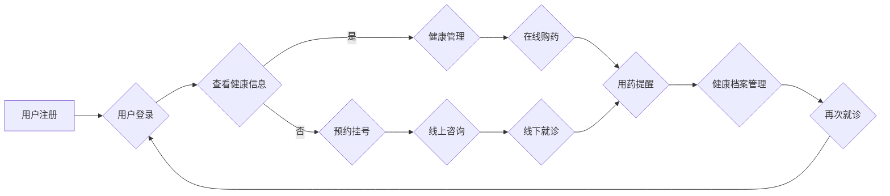

# 创业型互联网医疗平台搭建方案

> 关键词：互联网医疗，平台搭建，医疗信息化，远程医疗，健康管理，用户体验

## 1. 背景介绍

随着互联网技术的飞速发展，医疗健康行业迎来了前所未有的变革。互联网医疗作为一种新型的医疗服务模式，正逐步改变着传统医疗服务的格局。创业型互联网医疗平台应运而生，旨在通过技术创新，提升医疗服务效率，改善患者就医体验，降低医疗成本。本文将详细介绍创业型互联网医疗平台的搭建方案，从核心概念、技术架构、实施步骤到未来展望，为创业者和从业者提供全方位的指导。

### 1.1 问题的由来

传统医疗体系存在诸多痛点，如就医难、就医贵、医疗资源分布不均、信息孤岛等。互联网医疗的出现，有望解决这些问题，推动医疗行业的转型升级。

### 1.2 研究现状

目前，我国互联网医疗行业呈现出以下发展趋势：

- 政策支持力度加大，为互联网医疗发展提供良好环境。
- 移动医疗APP、远程医疗、健康管理、医药电商等模式蓬勃发展。
- 技术创新不断涌现，人工智能、大数据、云计算等技术在医疗领域的应用日益广泛。

### 1.3 研究意义

搭建创业型互联网医疗平台，对促进医疗行业变革、提升医疗服务质量、满足人民群众健康需求具有重要意义。

### 1.4 本文结构

本文将从以下方面展开论述：

- 核心概念与联系
- 核心算法原理与具体操作步骤
- 数学模型与公式
- 项目实践
- 实际应用场景
- 工具和资源推荐
- 总结：未来发展趋势与挑战
- 附录：常见问题与解答

## 2. 核心概念与联系

### 2.1 核心概念

以下是搭建创业型互联网医疗平台涉及的核心概念：

- 医疗信息化：利用信息技术提升医疗服务效率和质量，实现医疗资源的优化配置。
- 远程医疗：通过互联网实现医生与患者之间的远程诊断、咨询、治疗等服务。
- 健康管理：对个体或群体的健康状况进行监测、评估、干预和指导。
- 用户体验：用户在使用平台过程中所感受到的愉悦程度。
- 安全合规：确保平台数据安全、隐私保护以及符合国家相关法律法规。

### 2.2 Mermaid 流程图

以下为创业型互联网医疗平台核心流程的Mermaid流程图：



## 3. 核心算法原理 & 具体操作步骤

### 3.1 算法原理概述

创业型互联网医疗平台的核心算法包括：

- 用户身份认证算法：保障平台用户信息安全。
- 医疗知识图谱算法：构建疾病、症状、药物等医疗知识图谱，为用户提供智能推荐。
- 自然语言处理算法：实现医患之间自然流畅的对话。
- 医疗影像识别算法：辅助医生进行疾病诊断。
- 数据挖掘算法：分析用户数据，为健康管理提供依据。

### 3.2 算法步骤详解

以下为创业型互联网医疗平台搭建的核心步骤：

1. **需求分析**：明确平台功能、目标用户、市场需求等。
2. **系统设计**：设计系统架构、数据库结构、接口定义等。
3. **技术选型**：选择合适的开发语言、框架、数据库等。
4. **开发与测试**：编写代码、进行单元测试、集成测试等。
5. **上线与运营**：部署平台、进行推广、收集用户反馈、持续优化。

### 3.3 算法优缺点

**优点**：

- 提高医疗服务效率，降低就医成本。
- 优化患者就医体验，提升患者满意度。
- 拓展医疗服务范围，满足更多用户需求。
- 促进医疗资源均衡分配，缓解医疗资源紧张问题。

**缺点**：

- 技术门槛较高，需要专业的技术团队。
- 遵守国家相关政策和法规，确保数据安全。
- 需要持续投入，保持技术领先和产品创新。
- 面临市场竞争，需要不断提升产品竞争力。

### 3.4 算法应用领域

创业型互联网医疗平台算法主要应用于以下领域：

- 在线问诊
- 预约挂号
- 健康管理
- 在线购药
- 医疗影像诊断
- 医疗知识图谱
- 自然语言处理
- 数据挖掘

## 4. 数学模型和公式

### 4.1 数学模型构建

以下为创业型互联网医疗平台中常见的一些数学模型：

- 用户行为分析：通过分析用户行为数据，预测用户需求，实现个性化推荐。
- 疾病预测：利用医疗知识图谱和用户数据，预测用户患病的风险。
- 医疗影像识别：使用深度学习算法对医学影像进行分类、分割、标注等。

### 4.2 公式推导过程

由于篇幅限制，本文不再详细推导相关公式的推导过程。读者可参考相关数学书籍和学术论文。

### 4.3 案例分析与讲解

以用户行为分析为例，介绍一种常见的数学模型——协同过滤算法：

$$
\text{预测评分} = \text{用户相似度} \times \text{物品相似度} \times \text{历史评分}
$$

其中，用户相似度、物品相似度和历史评分分别为：

- 用户相似度：根据用户行为数据，计算两个用户之间的相似程度。
- 物品相似度：根据物品属性数据，计算两个物品之间的相似程度。
- 历史评分：用户对物品的历史评分。

## 5. 项目实践：代码实例和详细解释说明

### 5.1 开发环境搭建

以下是搭建创业型互联网医疗平台的开发环境：

- 操作系统：Linux/Windows/Mac
- 开发语言：Python、Java、PHP等
- 框架：Django、Flask、Spring Boot等
- 数据库：MySQL、MongoDB、Redis等
- 云服务：阿里云、腾讯云、华为云等

### 5.2 源代码详细实现

由于篇幅限制，本文无法提供完整的源代码。以下以Django框架为例，展示一个简单的用户注册功能的实现：

```python
# models.py
from django.db import models

class User(models.Model):
    username = models.CharField(max_length=50, unique=True)
    password = models.CharField(max_length=128)
    email = models.EmailField(unique=True)

# views.py
from django.shortcuts import render, redirect
from django.contrib.auth import login
from .models import User

def register(request):
    if request.method == 'POST':
        username = request.POST['username']
        password = request.POST['password']
        email = request.POST['email']
        user = User(username=username, password=password, email=email)
        user.save()
        login(request, user)
        return redirect('home')
    return render(request, 'register.html')
```

### 5.3 代码解读与分析

以上代码实现了一个简单的用户注册功能。用户通过填写表单提交用户名、密码和邮箱，系统将这些信息保存到数据库中，并完成用户登录。

### 5.4 运行结果展示

运行上述代码，访问注册页面，填写用户信息，即可完成注册。

## 6. 实际应用场景

### 6.1 在线问诊

在线问诊是创业型互联网医疗平台的核心功能之一。用户可以通过平台与医生进行实时沟通，获取专业医疗咨询服务。

### 6.2 预约挂号

用户可以通过平台预约挂号，选择合适的医院、科室和医生，避免排队等候。

### 6.3 健康管理

健康管理功能可以帮助用户监测自身健康状况，提供个性化健康建议。

### 6.4 在线购药

用户可以通过平台购买处方药和非处方药，享受送货上门服务。

### 6.5 医疗影像诊断

医生可以通过平台对医疗影像进行远程诊断，提高诊断效率。

### 6.6 医疗知识图谱

医疗知识图谱可以帮助医生快速找到相关疾病、症状、药物等信息，提高诊疗水平。

### 6.7 自然语言处理

自然语言处理技术可以实现医患之间的自然流畅的对话，提高用户体验。

### 6.8 数据挖掘

数据挖掘技术可以帮助医疗机构分析用户数据，为健康管理、疾病预防等提供依据。

## 7. 工具和资源推荐

### 7.1 学习资源推荐

- 《Python编程：从入门到实践》
- 《深入理解计算机系统》
- 《数据挖掘：概念与技术》
- 《机器学习实战》

### 7.2 开发工具推荐

- Django
- Flask
- Spring Boot
- MySQL
- MongoDB
- Redis

### 7.3 相关论文推荐

- 《Deep Learning for Healthcare》
- 《Healthcare Informatics》
- 《Journal of Medical Internet Research》

## 8. 总结：未来发展趋势与挑战

### 8.1 研究成果总结

本文对创业型互联网医疗平台搭建方案进行了全面介绍，从核心概念、技术架构、实施步骤到未来展望，为创业者和从业者提供了有益的参考。

### 8.2 未来发展趋势

- 人工智能、大数据、云计算等技术在医疗领域的应用将更加深入。
- 平台将向个性化、智能化、场景化方向发展。
- 医疗资源将进一步优化配置，提升医疗服务质量。

### 8.3 面临的挑战

- 技术门槛高，需要专业的技术团队。
- 遵守国家相关政策和法规，确保数据安全。
- 面临市场竞争，需要不断提升产品竞争力。
- 需要持续投入，保持技术领先和产品创新。

### 8.4 研究展望

未来，创业型互联网医疗平台将在以下几个方面取得突破：

- 构建更加完善的医疗知识图谱，实现更加精准的疾病预测和诊断。
- 开发更加智能的诊疗机器人，辅助医生进行诊疗工作。
- 推动医疗资源均衡分配，解决医疗资源紧张问题。
- 提高患者就医体验，降低就医成本。

## 9. 附录：常见问题与解答

**Q1：创业型互联网医疗平台有哪些盈利模式？**

A: 创业型互联网医疗平台的盈利模式主要包括：

- 挂号费、咨询费等医疗服务收费。
- 药品销售分成。
- 广告收入。
- 数据服务收入。
- 健康管理服务收费。
- 企业合作收入。

**Q2：如何确保创业型互联网医疗平台的数据安全？**

A: 确保创业型互联网医疗平台的数据安全，需要从以下几个方面入手：

- 采用加密技术，保护用户数据隐私。
- 建立数据备份机制，防止数据丢失。
- 加强网络安全防护，防止黑客攻击。
- 遵守国家相关法律法规，确保数据合规。

**Q3：创业型互联网医疗平台如何应对市场竞争？**

A: 创业型互联网医疗平台应对市场竞争可以从以下几个方面入手：

- 提升产品竞争力，提供优质的服务和功能。
- 加强品牌建设，提高品牌知名度。
- 建立良好的口碑，吸引更多用户。
- 加强市场推广，扩大用户规模。

**Q4：创业型互联网医疗平台如何与医疗机构合作？**

A: 创业型互联网医疗平台与医疗机构合作可以从以下几个方面入手：

- 提供技术支持，帮助医疗机构实现信息化建设。
- 共同开发医疗服务产品，拓展服务范围。
- 共享用户数据，为医疗机构提供精准服务。
- 建立良好的合作关系，实现互利共赢。

---

作者：禅与计算机程序设计艺术 / Zen and the Art of Computer Programming