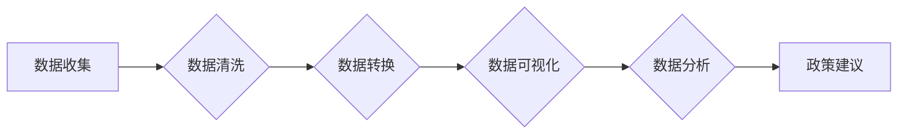

# 基于农村和城镇的人民生活数据可视化分析

> 关键词：数据可视化，人民生活，农村，城镇，数据分析，可视化工具，统计图表

## 1. 背景介绍

随着信息技术的飞速发展，数据已经成为现代社会最重要的资源之一。人民生活数据作为反映社会经济发展和民生改善的重要指标，其重要性不言而喻。通过对人民生活数据的深入分析和可视化呈现，我们可以更好地了解城乡发展的现状和趋势，为政策制定者和研究者提供科学依据。本文将探讨如何利用数据可视化技术，对农村和城镇的人民生活数据进行深入分析，揭示城乡发展中的不平衡现象，并提出相应的解决方案。

### 1.1 数据来源

人民生活数据主要包括以下几类：

- **经济数据**：如城乡居民收入、消费水平、物价指数等。
- **教育数据**：如教育普及率、教育经费投入、学校数量等。
- **卫生数据**：如医疗资源分布、居民健康状况、疾病发生率等。
- **社会保障数据**：如养老保险、医疗保险、失业保险等覆盖率。
- **基础设施数据**：如交通设施、供电供水、通讯设施等。

这些数据通常来源于国家统计局、地方统计局、政府部门、学术研究机构等。

### 1.2 可视化工具

数据可视化工具是进行数据分析和呈现的重要手段。常见的可视化工具包括：

- **Excel**：适合小规模数据分析和图表制作。
- **Tableau**：功能强大的商业智能工具，支持多种图表类型和交互功能。
- **Power BI**：微软推出的商业智能工具，与Office系列软件集成良好。
- **Python的Matplotlib、Seaborn**：开源的数据可视化库，功能丰富，可定制性强。
- **R语言的ggplot2**：统计图表制作专家，以优雅的语法和丰富的功能著称。

### 1.3 研究意义

通过对人民生活数据进行可视化分析，我们可以：

- 了解城乡发展现状和趋势。
- 发现城乡发展中的不平衡现象。
- 为政策制定者提供决策依据。
- 提高公众对民生问题的认识。

## 2. 核心概念与联系

### 2.1 核心概念

- **数据可视化**：将数据以图形或图像的形式展现，帮助人们更好地理解和分析数据。
- **人民生活**：指城乡居民在经济、文化、教育、卫生、社会保障等方面的生活质量。
- **农村**：指居住在农村地区的居民及其生活状态。
- **城镇**：指居住在城镇地区的居民及其生活状态。

### 2.2 架构流程图



### 2.3 关系

数据可视化是数据分析的前置步骤，通过可视化可以直观地展现数据特征，为数据分析提供方向。人民生活数据可视化分析旨在揭示城乡发展中的不平衡现象，为政策制定提供依据。

## 3. 核心算法原理 & 具体操作步骤

### 3.1 算法原理概述

数据可视化分析的基本原理包括：

- **数据预处理**：包括数据清洗、转换等，确保数据质量。
- **图表设计**：选择合适的图表类型和布局，使数据可视化效果最佳。
- **数据解读**：分析图表，提取有价值的信息。
- **结论呈现**：根据分析结果提出结论和建议。

### 3.2 算法步骤详解

1. **数据收集**：收集相关的人民生活数据，如经济、教育、卫生、社会保障、基础设施等方面的数据。
2. **数据清洗**：检查数据完整性、准确性，处理缺失值、异常值等。
3. **数据转换**：将数据转换为适合可视化的格式，如将数值型数据转换为图表所需的指标。
4. **图表设计**：选择合适的图表类型，如柱状图、折线图、饼图、地图等，并进行布局设计。
5. **数据解读**：分析图表，提取有价值的信息，如城乡收入差距、教育资源分布不均等。
6. **结论呈现**：根据分析结果提出结论和建议，为政策制定提供依据。

### 3.3 算法优缺点

**优点**：

- 直观易懂：通过图表展示数据，易于理解和分析。
- 提高效率：快速发现数据中的规律和趋势。
- 数据驱动：基于数据进行分析，客观性强。

**缺点**：

- 简单图表难以展示复杂关系。
- 可视化效果受主观影响较大。
- 难以展示数据的因果关系。

### 3.4 算法应用领域

数据可视化分析在以下领域有广泛应用：

- **政府决策**：为政策制定提供数据支持。
- **学术研究**：帮助研究者发现研究现象和趋势。
- **企业管理**：帮助企业管理者了解企业运营状况。
- **市场营销**：帮助市场分析者了解市场趋势。

## 4. 数学模型和公式 & 详细讲解 & 举例说明

### 4.1 数学模型构建

数据可视化分析中常用的数学模型包括：

- **描述性统计**：如均值、中位数、标准差等。
- **回归分析**：如线性回归、逻辑回归等。
- **聚类分析**：如K-means、层次聚类等。
- **关联规则挖掘**：如Apriori算法、FP-growth算法等。

### 4.2 公式推导过程

以线性回归为例，假设有 $n$ 个样本 $(x_i, y_i)$，其中 $x_i$ 是自变量，$y_i$ 是因变量。线性回归模型为：

$$
y_i = \beta_0 + \beta_1 x_i + \epsilon_i
$$

其中 $\beta_0$ 是截距，$\beta_1$ 是斜率，$\epsilon_i$ 是误差项。

通过最小化误差平方和，可以得到模型参数 $\beta_0$ 和 $\beta_1$ 的估计值。

### 4.3 案例分析与讲解

假设我们收集了某地区农村和城镇居民的收入数据，如下表所示：

| 居民类型 | 收入（元/年） |
| :-------: | :----------: |
| 农村居民 |  30000      |
| 城镇居民 |  50000      |

我们可以使用散点图来展示这两组数据的分布情况：

```python
import matplotlib.pyplot as plt

x = [30000, 50000]
y = [1, 1]

plt.scatter(x, y)
plt.xlabel('收入（元/年）')
plt.ylabel('居民类型')
plt.title('农村和城镇居民收入分布')
plt.show()
```

从散点图中可以看出，城镇居民的平均收入明显高于农村居民，这反映了城乡收入差距的问题。

## 5. 项目实践：代码实例和详细解释说明

### 5.1 开发环境搭建

1. 安装Python环境：从官网下载并安装Python，建议使用Python 3.8及以上版本。
2. 安装数据可视化库：使用pip安装Matplotlib、Pandas等库。

### 5.2 源代码详细实现

```python
import pandas as pd
import matplotlib.pyplot as plt

# 加载数据
data = pd.DataFrame({
    '居民类型': ['农村', '城镇'],
    '收入': [30000, 50000]
})

# 绘制散点图
plt.scatter(data['收入'], [1, 1], color=['red', 'blue'])
plt.xlabel('收入（元/年）')
plt.ylabel('居民类型')
plt.title('农村和城镇居民收入分布')
plt.show()
```

### 5.3 代码解读与分析

上述代码首先导入了pandas和matplotlib.pyplot库，然后创建了一个包含居民类型和收入数据的DataFrame。接着，使用scatter函数绘制了散点图，并通过plt.xlabel、plt.ylabel、plt.title等函数设置了图表的标题、坐标轴标签和标题。

### 5.4 运行结果展示

运行上述代码后，会显示一个散点图，其中红色点表示农村居民，蓝色点表示城镇居民。从图中可以看出，城镇居民的平均收入明显高于农村居民，这反映了城乡收入差距的问题。

## 6. 实际应用场景

### 6.1 政府决策

政府可以通过数据可视化分析，了解城乡发展中的不平衡现象，为制定相关政策提供依据。例如，通过分析教育数据，可以发现教育资源在城乡之间的分布不均，从而提出优化教育资源配置的政策。

### 6.2 学术研究

学者可以通过数据可视化分析，揭示人民生活领域的规律和趋势，为学术研究提供新的方向。例如，通过分析卫生数据，可以发现某些地区居民的健康状况存在明显问题，从而开展针对性的研究。

### 6.3 企业管理

企业可以通过数据可视化分析，了解自身运营状况，为优化管理提供参考。例如，通过分析销售数据，可以发现产品在不同地区的销售情况，从而调整营销策略。

## 7. 工具和资源推荐

### 7.1 学习资源推荐

- 《数据可视化：设计与展示》
- 《Python数据可视化与数据分析》
- 《Tableau实战：商业智能分析》

### 7.2 开发工具推荐

- Python的Matplotlib、Seaborn
- R语言的ggplot2
- Tableau
- Power BI

### 7.3 相关论文推荐

- “数据可视化在公共管理中的应用研究”
- “数据可视化在学术研究中的价值”
- “数据可视化在企业决策中的作用”

## 8. 总结：未来发展趋势与挑战

### 8.1 研究成果总结

通过对农村和城镇的人民生活数据进行可视化分析，我们可以：

- 了解城乡发展现状和趋势。
- 发现城乡发展中的不平衡现象。
- 为政策制定者提供决策依据。
- 提高公众对民生问题的认识。

### 8.2 未来发展趋势

- 数据可视化技术将更加智能化，能够自动识别数据特征和趋势。
- 可视化工具将更加多样化，满足不同领域的需求。
- 数据可视化将与人工智能技术深度融合，实现更智能的数据分析。

### 8.3 面临的挑战

- 数据质量参差不齐，需要提高数据质量。
- 可视化结果受主观影响较大，需要提高可视化的客观性。
- 数据可视化技术需要与不同领域的专业知识相结合。

### 8.4 研究展望

未来，数据可视化分析将在以下方面得到进一步发展：

- 开发更加智能的数据可视化工具，提高可视化效果。
- 将数据可视化与人工智能技术深度融合，实现更智能的数据分析。
- 探索数据可视化在更多领域的应用，为社会发展提供更多价值。

## 9. 附录：常见问题与解答

**Q1：数据可视化有什么作用？**

A1：数据可视化可以帮助人们更好地理解和分析数据，提高数据洞察力。

**Q2：如何选择合适的图表类型？**

A2：选择图表类型需要根据数据类型、分析目的和呈现效果等因素综合考虑。

**Q3：如何提高数据可视化的客观性？**

A3：提高数据可视化的客观性需要采用科学的图表设计方法，并遵循一定的可视化原则。

**Q4：数据可视化与人工智能技术如何结合？**

A4：数据可视化与人工智能技术可以结合，通过可视化分析结果，帮助人工智能模型更好地理解和学习数据。

**Q5：数据可视化有哪些应用场景？**

A5：数据可视化在政府决策、学术研究、企业管理、市场营销等领域都有广泛应用。

作者：禅与计算机程序设计艺术 / Zen and the Art of Computer Programming