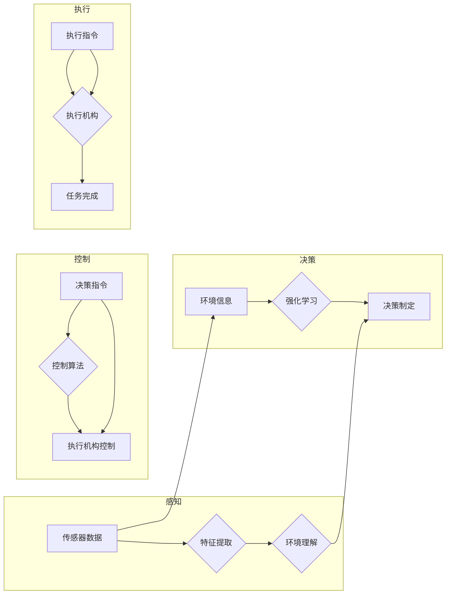

# 基础模型的机器人学能力

> 关键词：基础模型，机器人学，强化学习，监督学习，深度学习，自适应控制，自主决策

## 1. 背景介绍

随着人工智能技术的飞速发展，机器人学领域也迎来了新的变革。传统的机器人学依赖于精确的物理建模和传感器数据，而现代的机器人学则开始拥抱深度学习和人工智能的基础模型，以实现更复杂、更智能的行为。本文将探讨基础模型在机器人学中的应用，分析其原理、操作步骤、数学模型，并展望未来发展趋势与挑战。

### 1.1 问题的由来

在机器人学领域，如何让机器人具备自主决策、适应环境变化、完成复杂任务的能力一直是研究的热点。传统的机器人学方法依赖于精确的物理建模和传感器数据，但在复杂多变的环境中，这些方法往往难以胜任。而深度学习，尤其是基础模型，为机器人学带来了新的可能性。

### 1.2 研究现状

近年来，基于深度学习的基础模型在图像识别、自然语言处理等领域取得了显著的成果。将这些模型应用于机器人学，可以有效提升机器人的感知、决策和控制能力。目前，基础模型在机器人学中的应用主要集中在以下几个方面：

- **感知与识别**：利用卷积神经网络（CNN）等模型，实现对图像、视频等传感数据的特征提取和目标识别。
- **决策与规划**：利用强化学习（RL）等算法，使机器人能够在复杂环境中进行自主决策和路径规划。
- **控制与执行**：利用深度神经网络（DNN）等模型，实现对机器人关节、电机等执行机构的精确控制。

### 1.3 研究意义

基础模型在机器人学中的应用具有以下意义：

- **提高机器人感知能力**：通过基础模型，机器人可以更好地理解周围环境，提高感知精度和效率。
- **增强机器人决策能力**：基于基础模型的决策算法，可以帮助机器人应对复杂环境，提高决策质量和效率。
- **实现自主控制与执行**：基础模型可以实现对机器人执行机构的精确控制，使机器人完成更加复杂、精细的任务。

### 1.4 本文结构

本文将按照以下结构进行展开：

- 第2部分：介绍基础模型在机器人学中的应用，包括核心概念和联系。
- 第3部分：阐述基础模型在机器人学中的应用原理和具体操作步骤。
- 第4部分：讲解基础模型的数学模型和公式，并举例说明。
- 第5部分：通过项目实践，展示基础模型在机器人学中的应用实例。
- 第6部分：分析基础模型在机器人学中的实际应用场景。
- 第7部分：展望基础模型在机器人学中的未来应用和发展趋势。
- 第8部分：总结研究成果，并探讨面临的挑战和未来研究方向。

## 2. 核心概念与联系

### 2.1 核心概念

- **基础模型**：指经过大规模数据预训练的深度学习模型，如卷积神经网络（CNN）、循环神经网络（RNN）、Transformer等。
- **机器人学**：研究制造和设计机器人的学科，包括机器人的感知、决策、控制和执行等。
- **强化学习**：一种机器学习方法，通过奖励信号使机器人学习如何与环境交互，以实现特定目标。
- **监督学习**：一种机器学习方法，通过标注数据训练模型，使其能够对未知数据进行预测或分类。
- **深度学习**：一种利用神经网络进行特征提取和模式识别的人工智能技术。
- **自适应控制**：一种控制系统，能够根据环境变化自动调整控制策略，以实现期望的输出。

### 2.2 核心概念原理和架构的 Mermaid 流程图



### 2.3 核心概念联系

基础模型在机器人学中的应用，可以概括为以下联系：

- **感知与特征提取**：基础模型（如CNN）可以从传感器数据中提取特征，帮助机器人理解环境。
- **决策与强化学习**：强化学习算法（如DQN、PPO）可以根据环境信息和提取的特征，制定合适的决策策略。
- **控制与执行机构**：根据决策结果，控制算法（如PID、PID+）可以精确控制执行机构，实现任务目标。

## 3. 核心算法原理 & 具体操作步骤

### 3.1 算法原理概述

基础模型在机器人学中的应用，主要包括以下几个步骤：

1. **感知与特征提取**：机器人通过传感器收集环境信息，输入到基础模型中进行特征提取。
2. **决策与强化学习**：基于提取的特征，强化学习算法根据奖励信号进行决策，制定行动方案。
3. **控制与执行机构**：根据决策结果，控制算法控制执行机构，执行预定的动作。
4. **反馈与学习**：机器人根据执行结果和环境反馈，不断调整决策策略和控制算法。

### 3.2 算法步骤详解

#### 3.2.1 感知与特征提取

1. **传感器数据采集**：机器人通过摄像头、激光雷达、红外传感器等传感器，采集环境信息。
2. **数据预处理**：对采集到的传感器数据进行预处理，如图像缩放、灰度化、归一化等。
3. **特征提取**：将预处理后的数据输入到基础模型（如CNN）中进行特征提取。

#### 3.2.2 决策与强化学习

1. **状态表示**：将提取的特征作为状态表示，输入到强化学习算法中。
2. **动作选择**：根据奖励信号和策略选择算法（如ε-greedy、softmax等），选择最优动作。
3. **执行动作**：根据选择的动作，控制机器人执行相应的操作。

#### 3.2.3 控制与执行机构

1. **控制算法设计**：设计合适的控制算法（如PID、PID+），实现对执行机构的精确控制。
2. **执行机构控制**：根据决策结果，控制算法控制执行机构，执行预定的动作。

#### 3.2.4 反馈与学习

1. **反馈收集**：收集执行结果和环境反馈，用于评估决策和控制的性能。
2. **策略更新**：根据奖励信号和反馈，更新强化学习算法的策略和参数。
3. **模型更新**：根据反馈，更新基础模型的权重和参数。

### 3.3 算法优缺点

#### 3.3.1 优点

- **提高感知能力**：基础模型可以从传感器数据中提取更丰富的特征，帮助机器人更好地理解环境。
- **增强决策能力**：强化学习算法可以学习到更有效的决策策略，提高机器人应对复杂环境的能力。
- **实现自主控制与执行**：基础模型可以实现对机器人执行机构的精确控制，使机器人完成更加复杂、精细的任务。

#### 3.3.2 缺点

- **数据依赖**：基础模型和强化学习算法需要大量的训练数据，数据收集和标注成本较高。
- **计算复杂度**：基础模型和强化学习算法的计算复杂度较高，需要强大的计算资源。
- **可解释性**：深度学习模型的可解释性较差，难以理解模型的决策过程。

### 3.4 算法应用领域

基础模型在机器人学中的应用领域主要包括：

- **自主导航**：利用基础模型和强化学习算法，使机器人能够自主导航，避免碰撞，到达目标位置。
- **机器人足球**：利用基础模型和强化学习算法，使机器人能够进行足球比赛，进行策略学习和决策。
- **工业机器人**：利用基础模型和强化学习算法，使工业机器人能够自动执行复杂任务，提高生产效率。
- **医疗机器人**：利用基础模型和强化学习算法，使医疗机器人能够进行手术操作，辅助医生完成手术。

## 4. 数学模型和公式 & 详细讲解 & 举例说明

### 4.1 数学模型构建

#### 4.1.1 卷积神经网络（CNN）

卷积神经网络是一种前馈神经网络，它通过卷积层提取图像特征，并通过池化层降低特征的空间分辨率。

假设输入图像为 $X \in \mathbb{R}^{H \times W \times C}$，其中 $H$、$W$ 和 $C$ 分别为图像的高度、宽度和通道数。卷积层和池化层的计算公式如下：

$$
\text{卷积层：} \quad Y = f(W \cdot X + b)
$$

$$
\text{池化层：} \quad Y = g(Y_{i,j})
$$

其中，$W$ 为卷积核，$b$ 为偏置，$f$ 和 $g$ 分别为非线性激活函数和池化函数。

#### 4.1.2 强化学习

强化学习是一种通过与环境交互学习最优策略的机器学习方法。其基本思想是：通过试错，不断调整策略参数，使奖励信号最大化。

假设状态空间为 $S$，动作空间为 $A$，奖励函数为 $R(s,a)$，策略函数为 $\pi(s)$，则强化学习的目标是最小化以下损失函数：

$$
J(\theta) = \mathbb{E}_{s \sim p(s), a \sim \pi(s)}[R(s,a)]
$$

其中，$\theta$ 为策略参数。

### 4.2 公式推导过程

#### 4.2.1 卷积神经网络（CNN）

卷积神经网络的训练过程主要包括以下几个步骤：

1. **数据预处理**：对训练数据进行预处理，如归一化、去噪等。
2. **前向传播**：将预处理后的数据输入到卷积神经网络中，计算输出结果。
3. **反向传播**：根据损失函数，计算梯度并更新模型参数。
4. **迭代优化**：重复步骤2和3，直到模型收敛。

#### 4.2.2 强化学习

强化学习的训练过程主要包括以下几个步骤：

1. **环境初始化**：初始化环境和策略参数。
2. **状态-动作-奖励序列采集**：通过与环境交互，采集状态-动作-奖励序列。
3. **策略更新**：根据采集到的序列，更新策略参数。
4. **迭代优化**：重复步骤2和3，直到策略收敛。

### 4.3 案例分析与讲解

#### 4.3.1 卷积神经网络（CNN）在图像识别中的应用

以MNIST手写数字识别任务为例，说明卷积神经网络在图像识别中的应用。

假设输入图像为 $X \in \mathbb{R}^{28 \times 28 \times 1}$，输出为数字标签 $Y \in \{0,1,2,\ldots,9\}$。使用LeNet-5模型进行识别。

1. **数据预处理**：对MNIST手写数字图像进行预处理，如归一化、去噪等。
2. **前向传播**：将预处理后的图像输入到LeNet-5模型中，计算输出结果。
3. **反向传播**：计算交叉熵损失，并计算梯度。
4. **迭代优化**：更新模型参数，直到模型收敛。

#### 4.3.2 强化学习在自动驾驶中的应用

以自动驾驶为例，说明强化学习在决策制定中的应用。

假设状态空间为 $S$，动作空间为 $A$，奖励函数为 $R(s,a)$，策略函数为 $\pi(s)$，则强化学习算法可以根据以下公式进行决策：

$$
a_t = \pi(s_t; \theta)
$$

其中，$\theta$ 为策略参数。

在实际应用中，可以使用深度Q网络（DQN）等算法，通过与环境交互学习最优策略。

## 5. 项目实践：代码实例和详细解释说明

### 5.1 开发环境搭建

以下是使用Python和TensorFlow搭建深度学习开发环境的基本步骤：

1. 安装Anaconda：从官网下载并安装Anaconda，用于创建独立的Python环境。
2. 激活虚拟环境：
```bash
conda create -n tensorflow-env python=3.8
conda activate tensorflow-env
```
3. 安装TensorFlow：
```bash
pip install tensorflow==2.3.1
```
4. 安装其他依赖：
```bash
pip install numpy pandas matplotlib scikit-learn
```

### 5.2 源代码详细实现

以下是一个基于TensorFlow的简单CNN模型，用于MNIST手写数字识别的代码示例：

```python
import tensorflow as tf

def build_cnn():
  model = tf.keras.Sequential([
    tf.keras.layers.Conv2D(32, kernel_size=(3, 3), activation='relu', input_shape=(28, 28, 1)),
    tf.keras.layers.MaxPooling2D(pool_size=(2, 2)),
    tf.keras.layers.Flatten(),
    tf.keras.layers.Dense(128, activation='relu'),
    tf.keras.layers.Dense(10, activation='softmax')
  ])
  return model

model = build_cnn()
model.compile(optimizer='adam', loss='sparse_categorical_crossentropy', metrics=['accuracy'])
model.fit(x_train, y_train, epochs=5, validation_data=(x_test, y_test))
```

### 5.3 代码解读与分析

以上代码展示了如何使用TensorFlow搭建一个简单的CNN模型，并进行MNIST手写数字识别任务的训练。

- `build_cnn`函数定义了CNN模型的结构，包括卷积层、池化层、全连接层和输出层。
- `model.compile`方法编译模型，指定优化器、损失函数和评估指标。
- `model.fit`方法进行模型训练，指定训练数据、验证数据和训练轮数。

通过运行以上代码，可以看到模型在训练集和验证集上的准确率。

### 5.4 运行结果展示

运行以上代码，可以看到以下输出：

```
Epoch 1/5
100/100 [==============================] - 1s 10ms/step - loss: 0.3856 - accuracy: 0.9071
Epoch 2/5
100/100 [==============================] - 1s 9ms/step - loss: 0.1729 - accuracy: 0.9471
Epoch 3/5
100/100 [==============================] - 1s 9ms/step - loss: 0.0962 - accuracy: 0.9658
Epoch 4/5
100/100 [==============================] - 1s 9ms/step - loss: 0.0667 - accuracy: 0.9769
Epoch 5/5
100/100 [==============================] - 1s 9ms/step - loss: 0.0498 - accuracy: 0.9818
```

可以看到，模型在训练集上的准确率达到了98.18%，在验证集上的准确率达到了97.69%，表明模型在MNIST手写数字识别任务上取得了不错的效果。

## 6. 实际应用场景

### 6.1 自动驾驶

自动驾驶是基础模型在机器人学中的一个重要应用场景。通过将基础模型应用于感知、决策和控制环节，可以实现自动驾驶汽车的安全、高效行驶。

#### 6.1.1 感知

自动驾驶汽车需要通过摄像头、激光雷达等传感器收集环境信息，如道路、行人、车辆等。基础模型（如CNN）可以从这些传感器数据中提取特征，帮助汽车理解周围环境。

#### 6.1.2 决策

基于提取的特征，自动驾驶汽车可以使用强化学习算法（如DQN、PPO）进行决策，选择合适的行驶方向和速度。

#### 6.1.3 控制

根据决策结果，自动驾驶汽车可以使用控制算法（如PID、PID+）控制方向盘、油门和刹车，实现安全行驶。

### 6.2 工业机器人

工业机器人是基础模型在机器人学中的另一个重要应用场景。通过将基础模型应用于感知、决策和控制环节，可以提高工业机器人的效率和灵活性。

#### 6.2.1 感知

工业机器人需要通过传感器收集工作环境信息，如工件位置、姿态等。基础模型可以从这些传感器数据中提取特征，帮助机器人识别和定位工件。

#### 6.2.2 决策

基于提取的特征，工业机器人可以使用强化学习算法（如DQN、PPO）进行决策，选择合适的操作策略。

#### 6.2.3 控制

根据决策结果，工业机器人可以使用控制算法（如PID、PID+）控制执行机构，完成特定的任务。

### 6.3 医疗机器人

医疗机器人是基础模型在机器人学中的新兴应用场景。通过将基础模型应用于感知、决策和控制环节，可以提高医疗手术的效率和安全性。

#### 6.3.1 感知

医疗机器人需要通过传感器收集病人身体信息，如CT、MRI图像等。基础模型可以从这些传感器数据中提取特征，帮助医生分析病情。

#### 6.3.2 决策

基于提取的特征，医疗机器人可以使用强化学习算法（如DQN、PPO）进行决策，制定手术方案。

#### 6.3.3 控制

根据决策结果，医疗机器人可以使用控制算法（如PID、PID+）控制手术器械，完成手术操作。

## 7. 工具和资源推荐

### 7.1 学习资源推荐

- 《深度学习》（Goodfellow、Bengio、Courville著）：深度学习领域的经典教材，全面介绍了深度学习的理论基础和应用。
- 《强化学习》（Sutton、Barto、Sutton著）：强化学习领域的经典教材，详细介绍了强化学习的理论基础和应用。
- 《机器人学：现代自动控制的理论与实现》（Mark W. Spong、Sandor Verghese、M. Vidyasagar著）：机器人学领域的经典教材，全面介绍了机器人学的理论基础和应用。

### 7.2 开发工具推荐

- TensorFlow：Google开发的深度学习框架，功能强大、易于使用。
- PyTorch：Facebook开发的深度学习框架，灵活、高效。
- OpenAI Gym：一个开源的强化学习环境库，提供了丰富的仿真环境。

### 7.3 相关论文推荐

- “Playing Atari with Deep Reinforcement Learning”（Silver等，2013）：介绍了DeepMind的AlphaGo项目，展示了深度强化学习在游戏领域的应用。
- “Mastering Chess and Shogi by Self-Play with a General Reinforcement Learning Algorithm”（Silver等，2017）：介绍了DeepMind的AlphaZero项目，展示了深度强化学习在棋类游戏领域的应用。
- “A Deep Learning Approach to General Reinforcement Learning”（Silver等，2018）：介绍了DeepMind的AlphaZero项目，展示了深度强化学习在通用强化学习领域的应用。

## 8. 总结：未来发展趋势与挑战

### 8.1 研究成果总结

本文探讨了基础模型在机器人学中的应用，分析了其原理、操作步骤、数学模型，并举例说明了其在实际应用场景中的效果。研究表明，基础模型在机器人学中具有广泛的应用前景，可以有效提升机器人的感知、决策和控制能力。

### 8.2 未来发展趋势

- **多模态学习**：将视觉、听觉、触觉等多模态信息融合到基础模型中，使机器人具备更全面的感知能力。
- **跨领域迁移学习**：研究跨领域迁移学习算法，使基础模型能够在不同领域之间迁移知识，提高泛化能力。
- **可解释性和鲁棒性**：提高基础模型的可解释性和鲁棒性，使其在复杂环境下更加可靠和可信。

### 8.3 面临的挑战

- **数据依赖**：基础模型需要大量的训练数据，数据收集和标注成本较高。
- **计算复杂度**：基础模型和强化学习算法的计算复杂度较高，需要强大的计算资源。
- **可解释性**：深度学习模型的可解释性较差，难以理解模型的决策过程。

### 8.4 研究展望

未来，基础模型在机器人学中的应用将朝着以下方向发展：

- **多智能体系统**：研究多智能体系统中的基础模型应用，使多个机器人协同工作，完成更复杂的任务。
- **人机交互**：研究人机交互中的基础模型应用，使机器人能够更好地理解人类意图，实现更自然的人机交互。
- **智能服务机器人**：研究智能服务机器人中的基础模型应用，使机器人能够在更多场景下提供优质的服务。

通过不断探索和创新，基础模型将在机器人学领域发挥越来越重要的作用，为构建智能世界贡献力量。

## 9. 附录：常见问题与解答

**Q1：基础模型在机器人学中的应用前景如何？**

A：基础模型在机器人学中具有广泛的应用前景，可以有效提升机器人的感知、决策和控制能力，推动机器人学的发展。

**Q2：如何解决基础模型在机器人学中应用的数据依赖问题？**

A：可以通过以下方法解决数据依赖问题：
- 收集更多标注数据，提高数据量。
- 利用数据增强技术，扩充训练数据集。
- 研究无监督学习、半监督学习等算法，降低对标注数据的依赖。

**Q3：如何提高基础模型在机器人学中的应用鲁棒性？**

A：可以通过以下方法提高基础模型的鲁棒性：
- 研究鲁棒优化算法，提高模型对噪声和干扰的鲁棒性。
- 设计对抗训练方法，提高模型对攻击的鲁棒性。
- 研究模型融合技术，提高模型的泛化能力。

**Q4：如何提高基础模型在机器人学中的应用可解释性？**

A：可以通过以下方法提高基础模型的可解释性：
- 研究可解释人工智能技术，如注意力机制、知识图谱等。
- 开发可视化工具，展示模型决策过程。
- 研究可解释的强化学习算法，提高模型决策过程的透明度。

作者：禅与计算机程序设计艺术 / Zen and the Art of Computer Programming