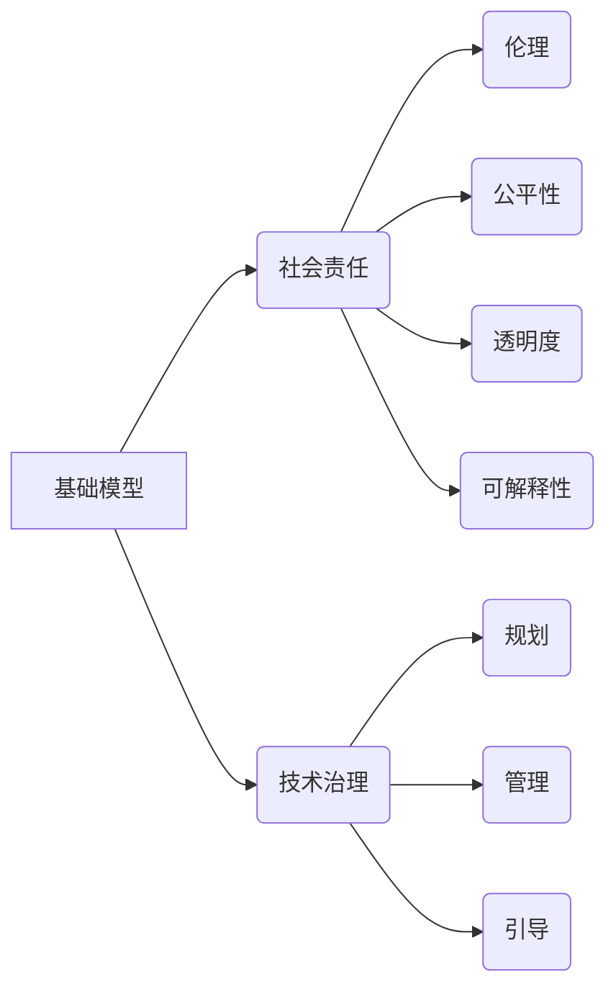

> 基础模型，社会责任，技术治理，伦理，公平性，透明度，可解释性，算法歧视，数据安全，人工智能伦理

# 基础模型的社会责任与技术治理

基础模型，作为人工智能领域的基石，正日益成为推动社会进步的关键技术。然而，随着基础模型的应用范围不断扩大，其对社会的影响也日益深远，涉及伦理、公平性、透明度和可解释性等多个方面。本文将深入探讨基础模型的社会责任与技术治理，分析其面临的挑战和未来的发展趋势。

## 1. 背景介绍

### 1.1 技术发展与社会变革

近年来，人工智能技术取得了长足的进步，特别是深度学习在图像识别、自然语言处理等领域取得了显著成果。基础模型作为深度学习的关键组成部分，其性能的提升直接推动了人工智能技术的应用落地。

### 1.2 社会影响的扩大

随着基础模型在医疗、金融、交通等领域的应用，其对社会的直接影响日益显著。然而，这些模型在决策过程中可能存在偏见、歧视和不透明等问题，引发了社会对基础模型社会责任的广泛关注。

### 1.3 技术治理的必要性

为了确保基础模型健康发展，维护社会公平正义，技术治理成为了一个亟待解决的问题。本文将从社会责任和技术治理两个方面，对基础模型的发展进行深入探讨。

## 2. 核心概念与联系

### 2.1 核心概念

**基础模型**：指经过大规模数据预训练，具备一定通用性的深度学习模型，如BERT、GPT等。

**社会责任**：企业或组织在创造经济价值的同时，对社会和环境所应承担的责任。

**技术治理**：对技术发展进行规划、管理和引导，以确保技术发展符合社会利益和伦理道德。

### 2.2 Mermaid 流程图



### 2.3 关系分析

基础模型的发展与社会责任和技术治理密切相关。基础模型的伦理、公平性、透明度和可解释性等问题，是技术治理的核心内容。而技术治理则通过规划、管理和引导，确保基础模型健康发展，符合社会利益。

## 3. 核心算法原理 & 具体操作步骤

### 3.1 算法原理概述

基础模型的算法原理主要基于深度学习，通过多层神经网络结构对数据进行学习，从而实现对数据的特征提取和建模。

### 3.2 算法步骤详解

1. 数据收集：收集大规模无标签或标注数据，用于模型的预训练。
2. 预训练：使用无标签或标注数据，对模型进行预训练，使其具备一定的通用性。
3. 微调：针对特定任务，在预训练模型的基础上进行微调，提高模型在特定任务上的性能。
4. 部署应用：将微调后的模型部署到实际应用场景，进行预测或决策。

### 3.3 算法优缺点

**优点**：

- 高效：基础模型能够快速学习大量数据，提高数据处理效率。
- 通用性：基础模型具备一定的通用性，可应用于多种任务。
- 灵活性：基础模型易于微调，可适应不同的任务需求。

**缺点**：

- 数据依赖：基础模型的学习效果高度依赖于数据质量，数据偏差可能导致模型产生偏见。
- 不透明：基础模型的决策过程不透明，难以解释其决策依据。
- 安全性：基础模型可能存在安全漏洞，如对抗样本攻击。

### 3.4 算法应用领域

基础模型在以下领域得到了广泛应用：

- 自然语言处理：文本分类、情感分析、机器翻译等。
- 计算机视觉：图像识别、目标检测、图像生成等。
- 语音识别：语音转文本、语音合成等。
- 医疗诊断：疾病检测、药物发现等。
- 金融风控：欺诈检测、信用评分等。

## 4. 数学模型和公式 & 详细讲解 & 举例说明

### 4.1 数学模型构建

基础模型的数学模型主要基于深度学习，以下以卷积神经网络（CNN）为例进行说明。

$$
y = f(W \cdot x + b)
$$

其中，$y$ 为模型的输出，$x$ 为输入数据，$W$ 为权重矩阵，$b$ 为偏置，$f$ 为激活函数。

### 4.2 公式推导过程

以CNN为例，其基本原理是通过卷积操作提取图像特征，然后通过全连接层进行分类。

1. 卷积层：使用卷积核在图像上滑动，提取局部特征。
2. 池化层：对卷积层输出的特征进行降采样，减少参数量和计算量。
3. 全连接层：将池化层输出的特征进行线性组合，得到最终的分类结果。

### 4.3 案例分析与讲解

以BERT模型为例，其核心思想是自注意力机制（Self-Attention）和Transformer架构。

1. 自注意力机制：通过计算输入序列中每个元素与所有其他元素的相关性，实现全局信息传递。
2. Transformer架构：由多个编码器和解码器层堆叠而成，通过自注意力机制和前馈神经网络，实现端到端的序列建模。

## 5. 项目实践：代码实例和详细解释说明

### 5.1 开发环境搭建

以PyTorch框架为例，搭建基础模型的开发环境如下：

1. 安装PyTorch：```bash
pip install torch torchvision torchaudio
```

2. 安装深度学习库：```bash
pip install transformers
```

### 5.2 源代码详细实现

以下使用PyTorch实现一个简单的CNN模型：

```python
import torch
import torch.nn as nn

class SimpleCNN(nn.Module):
    def __init__(self):
        super(SimpleCNN, self).__init__()
        self.conv1 = nn.Conv2d(1, 16, kernel_size=3, padding=1)
        self.relu = nn.ReLU()
        self.fc1 = nn.Linear(16 * 28 * 28, 10)

    def forward(self, x):
        x = self.conv1(x)
        x = self.relu(x)
        x = x.view(x.size(0), -1)
        x = self.fc1(x)
        return x

# 实例化模型
model = SimpleCNN()
```

### 5.3 代码解读与分析

以上代码定义了一个简单的CNN模型，包括一个卷积层、ReLU激活函数、全连接层。通过这个简单的模型，我们可以理解CNN的基本结构和原理。

### 5.4 运行结果展示

通过训练和测试，我们可以得到模型的性能指标，如准确率、召回率等。

## 6. 实际应用场景

### 6.1 医疗领域

基础模型在医疗领域的应用主要包括疾病诊断、药物发现等。例如，通过分析医学影像，基础模型可以帮助医生进行疾病诊断，提高诊断准确率。

### 6.2 金融领域

基础模型在金融领域的应用主要包括信用评分、欺诈检测等。例如，通过分析用户的消费行为，基础模型可以帮助金融机构识别欺诈行为，降低风险。

### 6.3 交通领域

基础模型在交通领域的应用主要包括自动驾驶、交通流量预测等。例如，通过分析交通数据，基础模型可以帮助预测交通流量，优化交通信号灯控制。

## 7. 工具和资源推荐

### 7.1 学习资源推荐

1. 《深度学习》系列书籍：介绍了深度学习的基本原理和应用，适合初学者入门。
2. Hugging Face官网：提供了丰富的预训练模型和开源代码，方便开发者进行研究和实践。
3. arXiv预印本平台：提供了大量人工智能领域的最新研究成果。

### 7.2 开发工具推荐

1. PyTorch：开源的深度学习框架，易于学习和使用。
2. TensorFlow：由Google开发的深度学习框架，功能强大，适用于大规模数据处理。
3. Jupyter Notebook：一款强大的交互式计算环境，方便开发者进行实验和记录。

### 7.3 相关论文推荐

1. "Attention is All You Need"：提出了Transformer架构，是自注意力机制的经典论文。
2. "BERT: Pre-training of Deep Bidirectional Transformers for Language Understanding"：提出了BERT模型，是自然语言处理领域的里程碑之作。
3. "Generative Adversarial Nets"：提出了生成对抗网络（GAN），是深度学习领域的经典论文。

## 8. 总结：未来发展趋势与挑战

### 8.1 研究成果总结

本文从社会责任和技术治理两个方面，对基础模型进行了深入探讨。通过分析基础模型的原理、优缺点和应用场景，以及对相关资源和工具的介绍，本文为读者提供了全面的基础模型知识。

### 8.2 未来发展趋势

1. 模型小型化：为了适应移动设备和边缘计算等场景，基础模型将朝着小型化方向发展。
2. 可解释性增强：为了提高模型的透明度和可信度，基础模型的可解释性将得到重视。
3. 跨模态融合：基础模型将融合多模态数据，实现更全面的感知和理解。
4. 伦理和安全：随着基础模型应用领域的扩大，伦理和安全问题将得到更多关注。

### 8.3 面临的挑战

1. 数据偏见：基础模型的学习效果高度依赖于数据，数据偏差可能导致模型产生偏见。
2. 不透明：基础模型的决策过程不透明，难以解释其决策依据。
3. 安全性：基础模型可能存在安全漏洞，如对抗样本攻击。
4. 伦理和道德：如何确保基础模型的应用符合伦理和道德标准，是一个重要挑战。

### 8.4 研究展望

未来，基础模型的研究将更加注重社会责任和技术治理，努力克服挑战，推动基础模型的健康发展，为社会创造更大的价值。

## 9. 附录：常见问题与解答

**Q1：基础模型的社会责任包括哪些方面？**

A：基础模型的社会责任包括伦理、公平性、透明度、可解释性、数据安全和人工智能伦理等方面。

**Q2：如何解决基础模型的偏见问题？**

A：解决基础模型偏见问题需要从数据、算法和模型设计等方面入手。例如，使用无偏数据、改进算法和模型设计，以及引入外部知识等。

**Q3：基础模型的可解释性如何提高？**

A：提高基础模型的可解释性可以通过以下方法：可视化模型结构、使用注意力机制、引入解释性模型等。

**Q4：如何确保基础模型的安全性和可靠性？**

A：确保基础模型的安全性和可靠性需要从以下几个方面入手：使用安全的训练方法、进行安全测试、建立安全评估标准等。

**Q5：基础模型的应用前景如何？**

A：基础模型的应用前景广阔，有望在医疗、金融、交通、教育等多个领域发挥重要作用，推动社会进步。

---

作者：禅与计算机程序设计艺术 / Zen and the Art of Computer Programming