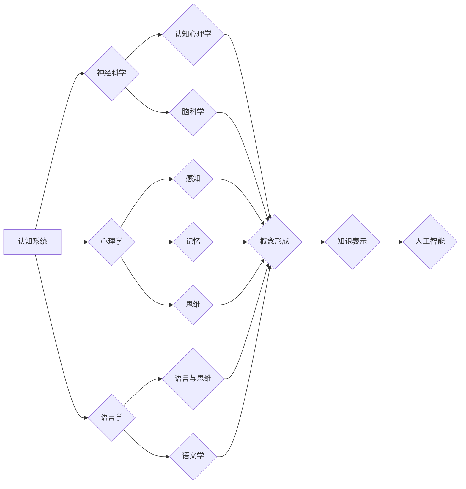

# 复杂思想的形成：概念的基础

> 关键词：复杂系统，概念形成，认知科学，思维进化，知识表示，人工智能

## 1. 背景介绍

在人类文明的进程中，复杂思想的形成是人类智能发展的里程碑。从简单的语言符号到复杂的科学理论，人类的概念形成能力推动了科技进步和社会发展。本文旨在探讨复杂思想形成的理论基础，分析其内在机制，并展望人工智能领域在概念形成方面的应用前景。

### 1.1 问题的由来

复杂思想的形成是一个复杂的过程，涉及到认知科学、心理学、语言学、哲学等多个学科。在计算机科学领域，如何模拟和实现复杂思想的形成机制，一直是人工智能研究的难点和热点问题。随着深度学习、自然语言处理等技术的发展，人工智能在理解人类语言和思维方面取得了显著进展，为研究复杂思想的形成提供了新的视角和方法。

### 1.2 研究现状

近年来，国内外学者对复杂思想形成的研究主要集中在以下几个方面：

- 认知科学领域：从神经科学、心理学角度探讨大脑如何形成和加工概念。
- 语言学领域：研究语言与思维的关系，以及语言如何影响概念的形成和发展。
- 人工智能领域：利用机器学习、自然语言处理等技术模拟和实现概念形成。

### 1.3 研究意义

研究复杂思想的形成，有助于我们更好地理解人类智能的本质，推动人工智能技术的发展，并为教育、认知治疗等领域提供理论指导。

### 1.4 本文结构

本文将首先介绍复杂思想形成的相关概念和理论，然后探讨概念形成的内在机制，接着分析人工智能在概念形成方面的应用，最后展望未来发展趋势与挑战。

## 2. 核心概念与联系

### 2.1 核心概念

- **复杂系统**：由多个相互作用的子系统组成的系统，具有整体大于部分之和的特性。
- **概念**：对事物本质属性的概括和抽象，是思维的基本单位。
- **认知科学**：研究大脑如何产生、处理和利用信息，以及如何形成知识、语言和思维。
- **思维进化**：人类思维能力的不断发展和进步。
- **知识表示**：将知识以某种形式存储和表示，以便于计算机处理和应用。

### 2.2 Mermaid 流程图



### 2.3 核心概念之间的联系

- 认知系统是形成复杂思想的基础，包括神经科学、心理学、语言学等领域。
- 神经科学和心理学共同研究认知过程，如感知、记忆和思维。
- 语言学研究语言与思维的关系，以及语义学等。
- 概念形成是认知过程的重要组成部分，需要神经科学、心理学和语言学的共同作用。
- 知识表示是概念形成的结果，为人工智能提供知识基础。
- 人工智能利用知识表示实现智能应用。

## 3. 核心算法原理 & 具体操作步骤

### 3.1 算法原理概述

复杂思想的形成涉及多个认知过程，包括感知、记忆、思维和语言等。以下是一些核心算法原理：

- **感知算法**：通过传感器收集外部信息，如视觉、听觉等。
- **记忆算法**：将感知到的信息存储在记忆中，包括短期记忆和长期记忆。
- **思维算法**：对记忆中的信息进行加工和推理，形成新的知识。
- **语言算法**：将思维结果转化为语言表达。

### 3.2 算法步骤详解

1. **感知阶段**：通过视觉、听觉等传感器收集外部信息。
2. **记忆阶段**：将感知到的信息存储在记忆中，包括短期记忆和长期记忆。
3. **思维阶段**：对记忆中的信息进行加工和推理，形成新的知识。
4. **语言阶段**：将思维结果转化为语言表达。

### 3.3 算法优缺点

**优点**：

- 模拟人类认知过程，具有一定的合理性。
- 可应用于各种认知任务，如自然语言处理、图像识别等。

**缺点**：

- 算法复杂度高，计算量大。
- 难以解释算法的决策过程。

### 3.4 算法应用领域

- 自然语言处理
- 图像识别
- 智能问答
- 医疗诊断

## 4. 数学模型和公式 & 详细讲解 & 举例说明

### 4.1 数学模型构建

复杂思想形成的数学模型通常涉及以下方面：

- **感知模型**：描述传感器如何收集和处理外部信息。
- **记忆模型**：描述信息在记忆中的存储和检索过程。
- **思维模型**：描述思维过程的推理和计算。
- **语言模型**：描述语言生成和理解的数学模型。

### 4.2 公式推导过程

以下是一个简单的记忆模型公式示例：

$$
\text{记忆} = \text{感知} \times \text{权重}
$$

其中，感知代表外部信息，权重代表信息在记忆中的重要性。

### 4.3 案例分析与讲解

以自然语言处理中的词向量模型为例，说明数学模型在概念形成中的应用。

- **词向量模型**：将词语表示为高维空间中的向量，通过词语的上下文信息学习词语的语义表示。
- **公式**：假设词语 $w_i$ 的向量表示为 $\mathbf{v}_i$，则词语 $w_i$ 与词语 $w_j$ 之间的相似度可以用余弦相似度计算：

$$
\text{similarity}(w_i, w_j) = \frac{\mathbf{v}_i \cdot \mathbf{v}_j}{|\mathbf{v}_i| \cdot |\mathbf{v}_j|}
$$

通过词向量模型，我们可以将词语的概念表示为高维空间中的点，从而进行语义理解和推理。

## 5. 项目实践：代码实例和详细解释说明

### 5.1 开发环境搭建

以Python为例，介绍开发环境的搭建过程：

1. 安装Anaconda：从Anaconda官网下载并安装Anaconda。
2. 创建虚拟环境：`conda create -n nlp_env python=3.8`。
3. 激活虚拟环境：`conda activate nlp_env`。
4. 安装必要的库：`pip install transformers torch sklearn numpy pandas matplotlib jupyter notebook ipython`。

### 5.2 源代码详细实现

以下是一个简单的词向量模型示例：

```python
import torch
import torch.nn as nn

class WordEmbedding(nn.Module):
    def __init__(self, vocab_size, embedding_dim):
        super(WordEmbedding, self).__init__()
        self.embedding = nn.Embedding(vocab_size, embedding_dim)

    def forward(self, x):
        return self.embedding(x)

# 示例：创建词向量模型
vocab_size = 1000  # 词汇表大小
embedding_dim = 50  # 嵌入维度
word_embedding = WordEmbedding(vocab_size, embedding_dim)
```

### 5.3 代码解读与分析

- `WordEmbedding` 类：定义了一个简单的词向量模型，使用PyTorch的 `nn.Embedding` 层来表示词汇表中的词语。
- `vocab_size`：表示词汇表大小，即模型中嵌入层的输出维度。
- `embedding_dim`：表示词向量的维度，即每个词语的嵌入表示的维度。
- `forward` 方法：将输入的词语索引转换为词向量。

### 5.4 运行结果展示

运行上述代码，创建一个简单的词向量模型，并打印模型结构：

```python
print(word_embedding)
```

输出结果：

```
WordEmbedding(
  (embedding): Embedding(1000, 50)
)
```

## 6. 实际应用场景

### 6.1 自然语言处理

词向量模型在自然语言处理领域有广泛的应用，如：

- 文本分类
- 命名实体识别
- 机器翻译
- 文本摘要

### 6.2 图像识别

词向量模型可以扩展到图像领域，如：

- 图像分类
- 目标检测
- 人脸识别

### 6.3 智能问答

词向量模型可以用于构建问答系统，如：

- 知识图谱问答
- 智能客服
- 问答机器人

## 7. 工具和资源推荐

### 7.1 学习资源推荐

- 《认知科学导论》
- 《认知心理学》
- 《语言与思维》
- 《人工智能：一种现代的方法》

### 7.2 开发工具推荐

- Python
- PyTorch
- TensorFlow
- Transformers库

### 7.3 相关论文推荐

- Word2Vec: Vector Representations of Words
- GloVe: Global Vectors for Word Representation
- FastText: A Bag of Tricks for Effective Text Representation

## 8. 总结：未来发展趋势与挑战

### 8.1 研究成果总结

本文从认知科学、语言学和人工智能等多个角度探讨了复杂思想形成的理论基础，分析了概念形成的内在机制，并介绍了人工智能在概念形成方面的应用。

### 8.2 未来发展趋势

- 深度学习与认知科学融合，构建更加真实的认知模型。
- 人工智能在概念形成方面的应用将更加广泛。
- 可解释人工智能的发展，提高模型的可信度和可靠性。

### 8.3 面临的挑战

- 复杂思想形成的机理尚未完全清楚，需要进一步研究。
- 人工智能在概念形成方面的应用仍处于初级阶段，需要持续探索。
- 可解释人工智能的发展面临诸多挑战，需要突破技术瓶颈。

### 8.4 研究展望

未来，研究复杂思想的形成将为人工智能领域带来新的突破，推动人工智能技术向更高层次发展。

## 9. 附录：常见问题与解答

**Q1：什么是复杂系统？**

A：复杂系统是由多个相互作用的子系统组成的系统，具有整体大于部分之和的特性。

**Q2：什么是概念？**

A：概念是对事物本质属性的概括和抽象，是思维的基本单位。

**Q3：人工智能在概念形成方面有哪些应用？**

A：人工智能在概念形成方面的应用主要包括自然语言处理、图像识别、智能问答等。

**Q4：如何构建词向量模型？**

A：可以使用PyTorch或TensorFlow等深度学习框架构建词向量模型，如Word2Vec、GloVe等。

**Q5：复杂思想形成的机理是什么？**

A：复杂思想形成的机理涉及到神经科学、心理学、语言学等多个学科，需要进一步研究。

作者：禅与计算机程序设计艺术 / Zen and the Art of Computer Programming