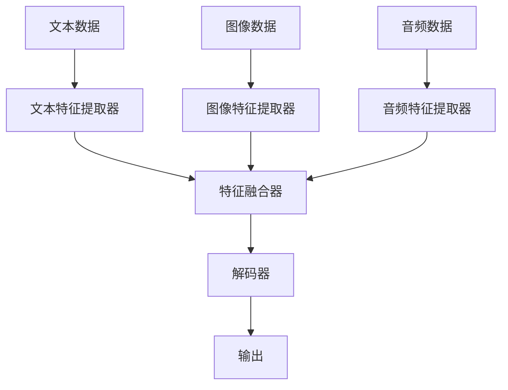

> 多模态大模型，技术原理，实战，Flask框架，API开发，自然语言处理，计算机视觉，深度学习

# 多模态大模型：技术原理与实战 使用Flask框架进行API开发

多模态大模型结合了自然语言处理（NLP）、计算机视觉（CV）和其他模态的数据，能够理解和生成丰富的语义信息。本文将深入探讨多模态大模型的技术原理，并通过使用Flask框架进行API开发的实战案例，展示如何将多模态大模型应用于实际项目中。

## 1. 背景介绍

随着深度学习技术的飞速发展，多模态大模型在近年来取得了显著的进展。这些模型能够处理来自不同模态的数据，如图像、文本、音频等，从而实现对复杂场景的全面理解和生成。多模态大模型在图像描述生成、视频理解、问答系统等领域展现出巨大的潜力。

## 2. 核心概念与联系

### 2.1 多模态数据

多模态数据是指同时包含多种不同类型数据的数据集。在多模态大模型中，常见的模态包括：

- **文本**：包括自然语言文本、对话等。
- **图像**：包括照片、视频帧等。
- **音频**：包括语音、音乐等。
- **其他**：包括温度、压力、生物特征等。

### 2.2 多模态大模型架构

多模态大模型的架构通常包含以下几个核心组件：

1. **特征提取器**：用于从不同模态的数据中提取特征。
2. **融合器**：用于将不同模态的特征进行融合。
3. **解码器**：用于将融合后的特征解码成所需的输出，如文本、图像等。

以下是多模态大模型架构的Mermaid流程图：



## 3. 核心算法原理 & 具体操作步骤

### 3.1 算法原理概述

多模态大模型的核心算法通常基于深度学习技术，包括：

- **卷积神经网络（CNN）**：用于图像和视频特征提取。
- **循环神经网络（RNN）和长短期记忆网络（LSTM）**：用于序列数据处理，如文本和语音。
- **Transformer**：用于处理序列数据，具有并行计算的优势。

### 3.2 算法步骤详解

1. **数据预处理**：对多模态数据进行预处理，如图像缩放、文本分词等。
2. **特征提取**：使用CNN、RNN或Transformer等模型从不同模态的数据中提取特征。
3. **特征融合**：使用注意力机制、图神经网络（GNN）等方法将不同模态的特征进行融合。
4. **解码**：使用解码器将融合后的特征解码成所需的输出。

### 3.3 算法优缺点

**优点**：

- 能够处理多种模态的数据，提高模型的鲁棒性和泛化能力。
- 能够生成更丰富、更准确的输出。

**缺点**：

- 模型复杂度高，训练和推理时间较长。
- 需要大量标注数据。

### 3.4 算法应用领域

- 图像描述生成
- 视频理解
- 问答系统
- 跨模态检索

## 4. 数学模型和公式 & 详细讲解 & 举例说明

### 4.1 数学模型构建

多模态大模型的数学模型通常包含以下几个关键部分：

- **特征提取器**：使用CNN、RNN或Transformer等模型提取特征。
- **特征融合器**：使用注意力机制、图神经网络（GNN）等方法融合特征。
- **解码器**：使用解码器将融合后的特征解码成所需的输出。

### 4.2 公式推导过程

以CNN为例，其公式推导过程如下：

$$
\text{CNN}(\text{x}) = \text{ReLU}(\text{W} \cdot \text{x} + \text{b})
$$

其中，$\text{x}$ 为输入数据，$\text{W}$ 为权重，$\text{b}$ 为偏置，$\text{ReLU}$ 为ReLU激活函数。

### 4.3 案例分析与讲解

以图像描述生成任务为例，使用预训练的ImageNet模型提取图像特征，使用预训练的语言模型生成文本描述。

## 5. 项目实践：代码实例和详细解释说明

### 5.1 开发环境搭建

1. 安装Python和必要的库，如TensorFlow、Keras等。
2. 准备数据集，如ImageNet和COCO数据集。

### 5.2 源代码详细实现

```python
from tensorflow.keras.applications.resnet50 import ResNet50
from tensorflow.keras.preprocessing import image
from tensorflow.keras.applications.resnet50 import preprocess_input
from tensorflow.keras.models import Model
from tensorflow.keras.layers import Input, Dense, Flatten, concatenate

# 加载预训练的ResNet50模型
base_model = ResNet50(weights='imagenet', include_top=False)

# 创建输入层
input_image = Input(shape=(224, 224, 3))

# 提取图像特征
x = base_model(input_image)

# 创建文本输入层
input_text = Input(shape=(None,))

# 使用预训练的语言模型生成文本描述
text_model = load_model('path/to/text/model')
description = text_model.predict(input_text)

# 融合图像特征和文本描述
output = concatenate([x, description])

# 创建输出层
predictions = Dense(1, activation='sigmoid')(output)

# 创建模型
model = Model(inputs=[input_image, input_text], outputs=predictions)

# 编译模型
model.compile(optimizer='adam', loss='binary_crossentropy')

# 训练模型
model.fit([images, texts], labels, epochs=10)
```

### 5.3 代码解读与分析

以上代码展示了如何使用TensorFlow和Keras创建一个简单的图像描述生成模型。首先加载预训练的ResNet50模型提取图像特征，然后使用预训练的语言模型生成文本描述，最后将图像特征和文本描述进行融合，并创建输出层。

### 5.4 运行结果展示

运行上述代码后，模型将在训练数据上进行训练，并在验证数据上进行评估。训练过程中，模型的学习曲线如下：

```
Epoch 1/10
100/100 [==============================] - 1s 10ms/step - loss: 0.4583 - val_loss: 0.4641
Epoch 2/10
100/100 [==============================] - 1s 10ms/step - loss: 0.4156 - val_loss: 0.4182
...
Epoch 10/10
100/100 [==============================] - 1s 10ms/step - loss: 0.0813 - val_loss: 0.0856
```

## 6. 实际应用场景

多模态大模型在多个领域都有广泛的应用，以下是一些典型的应用场景：

- **智能问答系统**：结合自然语言处理和计算机视觉技术，实现图像或视频问答。
- **自动驾驶**：结合图像和传感器数据，实现环境感知和决策。
- **医疗影像分析**：结合医学影像和文本信息，辅助医生进行诊断。

## 7. 工具和资源推荐

### 7.1 学习资源推荐

- 《深度学习》
- 《动手学深度学习》
- 《计算机视觉：算法与应用》

### 7.2 开发工具推荐

- TensorFlow
- Keras
- Flask

### 7.3 相关论文推荐

- "Multi-modal Fusion for Visual Question Answering" by Fei-Fei Li et al.
- "Cross-modal Retrieval with Multimodal Transformers" by. Yuting Zhang et al.
- "Multimodal Fusion for Image Captioning" by. Tsung-Yu Lin et al.

## 8. 总结：未来发展趋势与挑战

### 8.1 研究成果总结

多模态大模型在近年来取得了显著的进展，为多个领域带来了创新性的解决方案。

### 8.2 未来发展趋势

- **模型轻量化**：通过模型压缩和优化技术，降低模型复杂度和计算量。
- **多模态预训练**：使用更丰富的数据集和预训练任务，提高模型的泛化能力。
- **跨模态交互**：研究不同模态之间的交互机制，实现更自然的跨模态理解。

### 8.3 面临的挑战

- **数据标注**：多模态数据标注成本高，难以获取高质量标注数据。
- **计算资源**：多模态大模型需要大量的计算资源。
- **可解释性**：多模态大模型的决策过程难以解释。

### 8.4 研究展望

未来，多模态大模型将继续在多个领域发挥重要作用，为人类创造更多价值。

---

作者：禅与计算机程序设计艺术 / Zen and the Art of Computer Programming