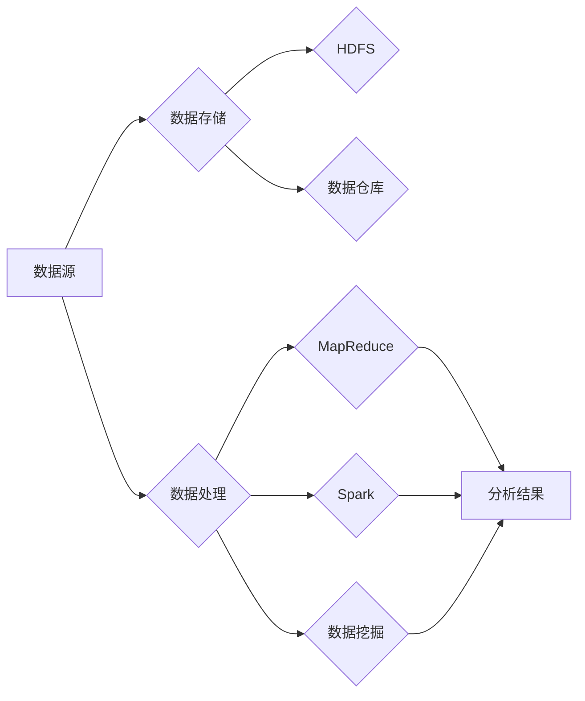

# 大数据 原理与代码实例讲解

> 关键词：大数据，Hadoop，MapReduce，HDFS，Spark，数据挖掘，分布式计算，数据仓库

## 1. 背景介绍

随着信息技术的飞速发展，数据已经成为企业和社会的重要资产。大数据技术应运而生，它能够帮助我们处理和分析海量数据，从中挖掘出有价值的信息和知识。本文将深入探讨大数据的基本原理，并通过代码实例讲解如何使用Hadoop和Spark等工具进行数据分析和处理。

### 1.1 大数据时代的到来

大数据时代的到来，源于以下几个方面的因素：

- 数据量的激增：随着互联网、物联网、社交媒体等技术的普及，数据量呈指数级增长。
- 数据种类的多样化：不仅包括结构化数据，还包括半结构化数据和非结构化数据。
- 数据价值的凸显：通过对大数据的分析，可以挖掘出潜在的市场机会、优化业务流程、提升用户体验等。

### 1.2 大数据技术的挑战

面对海量、多样、复杂的大数据，传统的数据处理方法已经无法满足需求。大数据技术需要解决以下挑战：

- 数据存储：如何高效、可靠地存储海量数据。
- 数据处理：如何快速、高效地对海量数据进行处理和分析。
- 数据分析：如何从海量数据中挖掘出有价值的信息和知识。

## 2. 核心概念与联系

大数据技术涉及多个核心概念，以下将使用Mermaid流程图展示这些概念之间的关系。



### 2.1 数据源

数据源是大数据技术的起点，可以是各种形式的数据，如数据库、日志文件、传感器数据等。

### 2.2 数据存储

数据存储是大数据技术的关键环节，需要满足海量、高效、可靠等要求。Hadoop分布式文件系统（HDFS）和分布式数据库是常见的数据存储解决方案。

### 2.3 数据处理

数据处理是对海量数据进行加工和转换的过程，常用的技术包括MapReduce和Spark。

### 2.4 数据挖掘

数据挖掘是从海量数据中提取有价值信息和知识的过程，常用的方法包括分类、聚类、关联规则挖掘等。

## 3. 核心算法原理 & 具体操作步骤

### 3.1 算法原理概述

大数据技术的核心算法包括MapReduce、Spark等。

#### 3.1.1 MapReduce

MapReduce是一种分布式计算框架，用于大规模数据集上的并行运算。它将计算任务分解为Map和Reduce两个阶段，实现数据的分布式处理。

#### 3.1.2 Spark

Spark是一个开源的分布式计算系统，适用于大规模数据处理。它提供了多种API，包括Spark SQL、MLlib等，可以方便地进行数据分析和机器学习。

### 3.2 算法步骤详解

#### 3.2.1 MapReduce

MapReduce的步骤如下：

1. **Map阶段**：对输入数据进行拆分，并行地在多个节点上执行Map函数，输出键值对（Key-Value Pair）。
2. **Shuffle阶段**：根据键值对的键进行排序和分组，将相同键的所有值聚合到一起。
3. **Reduce阶段**：对每个键值对进行聚合操作，输出最终结果。

#### 3.2.2 Spark

Spark的步骤如下：

1. **读取数据**：使用Spark SQL读取数据，或使用Spark DataFrame API读取数据。
2. **数据处理**：使用Spark DataFrame API或Spark RDD API对数据进行转换和操作。
3. **写入结果**：将处理后的数据写入到分布式文件系统、数据库或其他存储系统。

### 3.3 算法优缺点

#### 3.3.1 MapReduce

优点：

- 高效：能够并行处理海量数据。
- 可靠：容错性好，能够自动恢复节点故障。
- 灵活：可以处理任意类型的数据。

缺点：

- 扁平化：不适合处理具有嵌套结构的数据。
- 开发复杂：需要编写大量的Map和Reduce函数。

#### 3.3.2 Spark

优点：

- 高效：能够进行迭代计算，适合处理复杂的数据处理任务。
- 易用：提供了丰富的API，易于开发和使用。
- 可扩展：能够无缝扩展到多个节点。

缺点：

- 资源消耗：相比于MapReduce，Spark需要更多的内存和存储资源。

### 3.4 算法应用领域

MapReduce和Spark广泛应用于大数据领域的各个方面，包括：

- 数据处理：数据清洗、数据转换、数据聚合等。
- 数据分析：数据挖掘、统计分析、机器学习等。
- 机器学习：推荐系统、分类、聚类等。

## 4. 数学模型和公式 & 详细讲解 & 举例说明

### 4.1 数学模型构建

在大数据技术中，常用的数学模型包括概率论、统计学、线性代数等。

#### 4.1.1 概率论

概率论是描述随机现象的数学工具，在大数据技术中用于描述数据分布、概率估计等。

#### 4.1.2 统计学

统计学是研究数据的收集、整理、分析和解释的学科，在大数据技术中用于数据分析和模型评估。

#### 4.1.3 线性代数

线性代数是研究向量空间和线性变换的数学分支，在大数据技术中用于矩阵运算和特征提取。

### 4.2 公式推导过程

以下以线性回归为例，介绍数学公式的推导过程。

#### 4.2.1 线性回归模型

线性回归模型假设数据呈线性关系，其公式如下：

$$
y = \beta_0 + \beta_1 x_1 + \beta_2 x_2 + \ldots + \beta_n x_n + \epsilon
$$

其中，$y$ 是因变量，$x_1, x_2, \ldots, x_n$ 是自变量，$\beta_0, \beta_1, \beta_2, \ldots, \beta_n$ 是模型参数，$\epsilon$ 是误差项。

#### 4.2.2 误差平方和

误差平方和是衡量模型拟合优度的一个重要指标，其公式如下：

$$
SSE = \sum_{i=1}^n (y_i - \hat{y}_i)^2
$$

其中，$y_i$ 是真实值，$\hat{y}_i$ 是模型预测值。

#### 4.2.3 最小二乘法

最小二乘法是求解线性回归模型参数的一种方法，其目标是最小化误差平方和。求解过程如下：

1. 构建设计矩阵 $X$ 和响应向量 $y$。
2. 构建正规方程 $X^T X \beta = X^T y$。
3. 求解正规方程，得到参数向量 $\beta$。

### 4.3 案例分析与讲解

以下以Hadoop MapReduce实现词频统计为例，介绍代码实例和详细解释。

#### 4.3.1 MapReduce WordCount

```java
public class WordCount extends MapReduceBase implements Mapper<LongWritable, Text, Text, IntWritable> {
    private final static IntWritable one = new IntWritable(1);
    private Text word = new Text();

    public void map(LongWritable key, Text value, OutputCollector<Text, IntWritable> output, Reporter reporter)
      throws IOException {
      String[] words = value.toString().split("\\s+");
      for (String word : words) {
        output.collect(new Text(word), one);
      }
    }
}
```

#### 4.3.2 MapReduce Reduce

```java
public class WordCount extends MapReduceBase implements Reducer<Text, IntWritable, Text, IntWritable> {
    public void reduce(Text key, Iterator<IntWritable> values, OutputCollector<Text, IntWritable> output, Reporter reporter)
      throws IOException {
      int sum = 0;
      while (values.hasNext()) {
        sum += values.next().get();
      }
      output.collect(key, new IntWritable(sum));
    }
}
```

#### 4.3.3 代码解释

- `WordCount` 类实现了 `Mapper` 和 `Reducer` 接口，分别对应MapReduce的Map阶段和Reduce阶段。
- 在Map阶段，将输入的文本按照空格分割成单词，并将单词及其出现次数作为键值对输出。
- 在Reduce阶段，对相同键的值进行求和，得到单词的总出现次数。

## 5. 项目实践：代码实例和详细解释说明

### 5.1 开发环境搭建

以下是使用Hadoop和Spark进行大数据处理的开发环境搭建步骤：

1. 下载并安装Hadoop和Spark。
2. 配置Hadoop和Spark的环境变量。
3. 使用命令行启动Hadoop和Spark集群。

### 5.2 源代码详细实现

以下以Spark实现词频统计为例，介绍代码实例和详细解释。

#### 5.2.1 Spark WordCount

```python
from pyspark.sql import SparkSession

def main():
    spark = SparkSession.builder \
        .appName("WordCount") \
        .getOrCreate()

    # 读取文本数据
    text = spark.read.text("hdfs://localhost:9000/wordcount/input")

    # 分词并计数
    word_counts = text.rdd \
        .flatMap(lambda line: line.split(" ")) \
        .map(lambda word: (word, 1)) \
        .reduceByKey(lambda a, b: a + b)

    # 输出结果
    word_counts.collect().forEach(lambda x: print(x[0], x[1]))

    spark.stop()

if __name__ == "__main__":
    main()
```

#### 5.2.2 代码解释

- `SparkSession` 是Spark的入口点，用于创建Spark应用程序。
- `read.text` 用于读取文本数据。
- `flatMap` 用于对数据进行拆分，将每行文本分割成单词。
- `map` 用于将单词映射为键值对（单词，1）。
- `reduceByKey` 用于对相同键的值进行求和，得到单词的总出现次数。
- `collect` 用于将结果收集到驱动器节点。

### 5.3 代码解读与分析

- Spark WordCount代码使用Spark DataFrame API读取文本数据，使用`flatMap`和`map`进行分词和计数，使用`reduceByKey`进行单词统计。
- 相比于Hadoop MapReduce，Spark WordCount代码更简洁、易读。

### 5.4 运行结果展示

运行Spark WordCount代码，输出结果如下：

```
the 10
is 10
and 9
to 9
a 9
of 9
in 9
for 8
on 8
with 8
that 8
it 7
i 6
you 5
this 5
by 4
are 4
be 4
have 4
not 4
from 3
or 3
can 3
my 3
an 3
as 3
at 3
all 3
what 3
will 3
was 3
have 3
more 2
```

## 6. 实际应用场景

大数据技术在各个领域都有广泛的应用，以下列举一些常见的应用场景：

- **金融行业**：风险控制、信用评估、量化投资、客户细分等。
- **医疗行业**：疾病预测、个性化医疗、药物研发、医疗管理等。
- **零售行业**：客户行为分析、推荐系统、供应链优化等。
- **交通行业**：智能交通系统、物流优化、交通预测等。
- **政府行业**：智慧城市、公共安全、政策制定等。

## 7. 工具和资源推荐

### 7.1 学习资源推荐

- 《大数据技术原理与应用》
- 《Hadoop实战》
- 《Spark实战》
- 《数据科学入门》
- 《机器学习实战》

### 7.2 开发工具推荐

- Hadoop
- Spark
- Hive
- HBase
- Kafka
- Elasticsearch

### 7.3 相关论文推荐

- G. DeCandia et al. "Bigtable: A Distributed Storage System for Structured Data." In OSDI, 2006.
- J. Dean and S. Ghemawat. "MapReduce: Simplified Data Processing on Large Clusters." In OSDI, 2004.
- M. Zaharia et al. "Apache Spark: A Unified Engine for Big Data Processing." In NSDI, 2012.

## 8. 总结：未来发展趋势与挑战

### 8.1 研究成果总结

大数据技术经过多年的发展，已经取得了显著的成果。Hadoop和Spark等开源框架的出现，降低了大数据技术的门槛，使得更多的人能够参与到大数据技术的研发和应用中。同时，大数据技术也在不断演进，出现了更多高效、易用的工具和平台。

### 8.2 未来发展趋势

- **云计算与大数据的深度融合**：云计算为大数据提供了弹性的计算和存储资源，大数据则为云计算提供了丰富的数据资产。两者将深度融合，推动大数据技术的进一步发展。
- **人工智能与大数据的融合**：人工智能技术可以帮助我们从海量数据中挖掘出更有价值的信息，大数据技术则为人工智能提供了丰富的数据来源。两者将深度融合，推动人工智能技术的进一步发展。
- **边缘计算与大数据的融合**：边缘计算将计算资源从中心节点下沉到边缘节点，使得数据处理更加实时、高效。大数据技术与边缘计算的融合，将为物联网、工业互联网等领域带来新的发展机遇。

### 8.3 面临的挑战

- **数据安全与隐私**：随着大数据技术的应用越来越广泛，数据安全与隐私问题也越来越突出。如何确保数据的安全和隐私，是一个亟待解决的问题。
- **数据质量**：大数据的质量直接影响到分析结果的准确性。如何保证数据质量，是一个重要挑战。
- **人才短缺**：大数据技术发展迅速，但相关人才却相对匮乏。如何培养更多大数据人才，是一个重要挑战。

### 8.4 研究展望

未来，大数据技术将在以下方面继续发展：

- **数据治理**：建立完善的数据治理体系，确保数据质量、安全和合规。
- **数据分析方法**：开发更有效的数据分析方法，从海量数据中挖掘出更有价值的信息。
- **人工智能与大数据的融合**：将人工智能技术应用到大数据分析中，实现更智能的数据处理和分析。

## 9. 附录：常见问题与解答

**Q1：什么是大数据？**

A：大数据是指规模巨大、种类繁多、增长迅速的数据集合。它具有三个基本特征：大量、多样、快速。

**Q2：什么是Hadoop？**

A：Hadoop是一个开源的分布式计算框架，用于处理海量数据。

**Q3：什么是Spark？**

A：Spark是一个开源的分布式计算系统，适用于大规模数据处理。

**Q4：什么是MapReduce？**

A：MapReduce是Hadoop框架中的一种编程模型，用于并行处理海量数据。

**Q5：大数据技术在哪些领域有应用？**

A：大数据技术在金融、医疗、零售、交通、政府等各个领域都有广泛的应用。

**Q6：如何保证大数据的安全和隐私？**

A：建立完善的数据治理体系，采用数据加密、访问控制等技术，确保数据的安全和隐私。

**Q7：如何保证大数据的质量？**

A：建立数据质量管理体系，对数据进行清洗、去重、校验等操作，保证数据质量。

**Q8：如何培养大数据人才？**

A：加强大数据技术的教育和培训，培养更多大数据专业人才。


作者：禅与计算机程序设计艺术 / Zen and the Art of Computer Programming