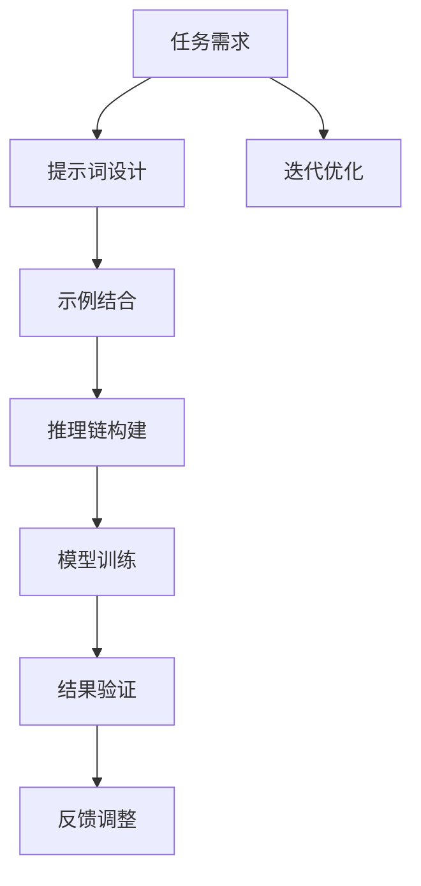

                 

# AI大模型Prompt提示词最佳实践：结合链式思维和少量示例

## 1. 背景介绍

### 1.1 问题由来
近年来，基于大语言模型(LLMs)的NLP任务研究取得了诸多进展，其重要驱动力之一就是Prompt设计。Prompt即提示词或模板，用于引导模型进行特定类型的推理、生成或预测。良好的Prompt设计可以使模型更准确地理解任务需求，提升推理和生成的效果。

然而，尽管许多研究者已投入大量精力来设计提示词，但在实际应用中，好的Prompt并非一蹴而就。其设计过程依赖于对任务的深刻理解、对模型行为的理解以及对生成内容的创意，且不同任务和不同模型对提示词的设计要求可能有所差异。

为了解决这个问题，近年来逐渐兴起的Prompt设计方法，尤其是结合链式思维和少量示例的提示词设计方法，被广泛接受。本博客将深入探讨这一方法，并提供相应的实践指南。

### 1.2 问题核心关键点
Prompt设计是一个迭代的过程，主要关注以下几个关键点：
1. **明确任务需求**：理解任务的本质，设定预期输出格式。
2. **指导模型推理**：使用合理且直观的提示词模板，引导模型推理。
3. **结合少量示例**：通过示例展示预期的输出，辅助模型生成。
4. **动态调整策略**：根据反馈和测试结果，迭代优化提示词。

本博客将围绕这些关键点，详细介绍Prompt设计的方法和实践。

### 1.3 问题研究意义
良好的Prompt设计可以显著提升模型在特定任务上的性能，降低模型开发和调优的复杂度。在实际应用中，好的Prompt设计可以减少标注数据需求，降低模型成本，提高任务完成的效率。

通过探索Prompt设计的方法和技巧，不仅可以为实践者提供实际的指导，还可能启发新的研究思路，推动NLP技术的进步。

## 2. 核心概念与联系

### 2.1 核心概念概述

在深入讨论Prompt设计之前，我们需要对一些核心概念进行概述：

- **Prompt**：引导模型推理、生成或预测的文本模板。好的Prompt应简洁明了，反映任务需求。
- **示例**：实际任务数据中的一部分，作为模型的“学习样本”，辅助模型理解和生成。
- **链式思维**：通过一系列逻辑推理和关联，构建Prompt模板的“链条”，以实现对模型的有效引导。
- **模型推理链**：将Prompt提示与模型的推理逻辑联系起来，构成推理路径。

这些概念之间存在密切联系，形成了一个完整的大模型Prompt设计框架：

1. 明确的**任务需求**指导着**提示词**的设计。
2. 设计合理的**提示词**，辅助模型对**示例**的理解。
3. **示例**作为“学习样本”，帮助模型掌握**任务**的推理逻辑。
4. **提示词**和**示例**的结合，指导模型形成**推理链**，实现对**任务**的推理。

### 2.2 概念间的关系

Prompt设计的流程如下：

1. **任务理解**：明确任务需求，确定预期输出格式。
2. **提示词设计**：基于任务需求设计合理的提示词。
3. **示例结合**：将示例与提示词结合，辅助模型理解任务。
4. **推理链构建**：构建从示例到输出结果的推理链。

通过这样的流程，提示词设计不仅仅是模板编写，更是一个对任务理解、模型推理和生成过程的全面设计和思考。

### 2.3 核心概念的整体架构

以下是一个综合的流程图，展示了大模型Prompt设计的完整流程：



这个流程图展示了从任务理解到最终模型训练和验证的完整过程。

## 3. 核心算法原理 & 具体操作步骤
### 3.1 算法原理概述

Prompt设计的基本原则是简洁性和指导性。好的Prompt应简洁明了，反映任务需求，且具有清晰的逻辑结构，能够引导模型进行有效推理。

基于这一原则，结合链式思维和少量示例的Prompt设计方法，通过以下步骤实现：

1. **理解任务**：明确任务需求，理解预期的输出格式和逻辑结构。
2. **设计提示词**：根据任务需求设计简洁明了的提示词，引导模型推理。
3. **结合示例**：结合少量示例，辅助模型理解和生成。
4. **迭代优化**：根据验证结果和反馈，迭代优化提示词和示例。

这一方法的核心思想是“从简单到复杂”，逐步构建从示例到输出结果的推理链。

### 3.2 算法步骤详解

以下是一个具体的Prompt设计流程示例，以问答任务为例：

1. **任务理解**：
   - 明确任务需求：给定一个问题，生成一个简洁明了的回答。
   - 预期输出格式：短句或段落形式的回答。

2. **提示词设计**：
   - 设计初始提示词：`请生成以下问题的回答：“问题”？`
   - 优化提示词：通过实际生成的结果，优化提示词为：`根据以下信息，回答问题：“信息”`。

3. **示例结合**：
   - 选取部分示例数据，如“2019年诺贝尔文学奖得主是谁？”
   - 辅助提示词设计：将示例结合到提示词中，如：`根据以下信息，回答问题：“2019年诺贝尔文学奖得主”？`

4. **迭代优化**：
   - 验证和调整：在实际生成过程中，如果模型输出不清晰或不完整，调整提示词为：`请回答以下问题：“2019年诺贝尔文学奖得主”？`
   - 重复以上步骤，直到模型输出达到预期结果。

### 3.3 算法优缺点

结合链式思维和少量示例的Prompt设计方法具有以下优点：
1. **简洁明了**：提示词简洁，易于理解和执行。
2. **指导性强**：通过链式推理，引导模型准确生成。
3. **可迭代优化**：通过示例和验证，不断优化提示词。

同时，该方法也存在以下缺点：
1. **示例依赖**：依赖于足够的示例数据，可能导致示例不足。
2. **生成时间**：初始设计可能耗时较长，需多次迭代优化。
3. **适用范围**：特定于某些任务，无法泛化到所有任务。

### 3.4 算法应用领域

结合链式思维和少量示例的Prompt设计方法，在NLP领域中具有广泛的应用：

- **问答系统**：通过构建从问题到答案的推理链，有效引导模型生成准确回答。
- **对话系统**：结合示例，引导模型生成符合情境的回复。
- **文本生成**：通过示例和推理链，生成连贯且符合语境的文本。
- **推理任务**：辅助模型进行复杂逻辑推理，生成正确结论。
- **知识图谱**：通过示例和推理链，抽取并关联实体间的知识关系。

## 4. 数学模型和公式 & 详细讲解  
### 4.1 数学模型构建

为了更好地理解Prompt设计，我们可以使用数学模型来刻画这一过程。

设**任务**为 $T$，**提示词**为 $P$，**示例数据**为 $D$。提示词设计过程可以分为以下几步：

1. **任务定义**：
   - 任务需求：$T = \{(x_i, y_i)\}_{i=1}^N$，其中 $x_i$ 为输入，$y_i$ 为标签。
2. **提示词设计**：
   - 提示词模板：$P = \{p_j\}_{j=1}^M$，其中 $p_j$ 为第 $j$ 个提示词。
3. **示例结合**：
   - 示例数据：$D = \{(d_k, l_k)\}_{k=1}^K$，其中 $d_k$ 为示例文本，$l_k$ 为示例标签。

目标是通过 $P$ 和 $D$ 生成 $T$ 的模型 $M$。

### 4.2 公式推导过程

基于上述模型定义，我们可以构建如下公式：

1. **任务损失函数**：
   - 任务 $T$ 的损失函数：$\mathcal{L}(M, D) = \frac{1}{N} \sum_{i=1}^N \ell(M(x_i), y_i)$，其中 $\ell$ 为损失函数。
2. **提示词损失函数**：
   - 提示词 $P$ 的损失函数：$\mathcal{L}_P(M, D) = \frac{1}{K} \sum_{k=1}^K \ell(P(d_k), M(d_k))$。

最终，目标是通过最小化 $\mathcal{L}_P(M, D)$ 来优化模型 $M$。

### 4.3 案例分析与讲解

假设我们要构建一个简单的问答系统，给出以下示例和提示词：

| 问题 | 示例 |
|------|------|
| 上周末去哪儿了？ | 我去北京旅游了。 |
| 是谁写的？ | 刘慈欣。 |

**初始提示词**：`请回答以下问题：“上周末去哪儿了”？`

**生成的回答**：

```
我去北京旅游了。
```

**优化后的提示词**：`根据以下信息，回答问题：“上周末去哪儿了”，“我去了北京旅游”`

**示例结合**：`根据以下信息，回答问题：“上周末去哪儿了”，“我去了北京旅游”`

**迭代优化**：

- 验证和调整：如果生成的回答不完整，如“我去北京旅游了”，可以调整提示词为：`根据以下信息，回答问题：“上周末去哪儿了”，“我去了北京旅游，具体做了什么？”`
- 生成新回答：`我去参观了故宫和长城。`

通过不断迭代优化，我们可以得到更精确的Prompt设计。

## 5. 项目实践：代码实例和详细解释说明
### 5.1 开发环境搭建

进行Prompt设计时，开发环境主要依赖于Python和常用的NLP库，如NLTK、spaCy、HuggingFace Transformers等。

1. 安装Python：
   ```bash
   conda create -n prompt-design python=3.8
   conda activate prompt-design
   ```

2. 安装NLP库：
   ```bash
   pip install nltk spacy transformers
   ```

3. 初始化NLP工具：
   ```python
   import spacy
   nlp = spacy.load("en_core_web_sm")
   ```

### 5.2 源代码详细实现

以下是一个基于Transformers库的Prompt设计示例，以GPT模型为例：

```python
from transformers import GPT2Tokenizer, GPT2LMHeadModel
from transformers import AdamW
from torch.utils.data import Dataset, DataLoader

# 定义Prompt设计类
class PromptDesign:
    def __init__(self, tokenizer, model):
        self.tokenizer = tokenizer
        self.model = model
        self.optimizer = AdamW(model.parameters(), lr=2e-5)
        
    def design_prompt(self, examples, max_length=128):
        # 定义初始提示词
        initial_prompt = "请回答以下问题："
        target_prompt = ""
        
        # 结合示例数据
        for example in examples:
            prompt = f"{initial_prompt}{example}"
            tokens = self.tokenizer(prompt, max_length=max_length, padding="max_length", truncation=True, return_tensors="pt")
            
            # 生成回答
            outputs = self.model.generate(tokens.input_ids)
            predicted_tokens = self.tokenizer.decode(outputs[0], skip_special_tokens=True)
            
            # 优化提示词
            target_prompt += f"根据以下信息，回答问题：{example}, {predicted_tokens}"
            
        # 返回优化后的提示词
        return target_prompt

# 示例数据
examples = ["上周末去哪儿了？", "是谁写的？"]

# 初始化模型和提示词设计类
tokenizer = GPT2Tokenizer.from_pretrained("gpt2")
model = GPT2LMHeadModel.from_pretrained("gpt2")

prompt_design = PromptDesign(tokenizer, model)

# 设计提示词
optimized_prompt = prompt_design.design_prompt(examples)

# 生成回答
tokenized_prompt = tokenizer(optimized_prompt, max_length=128, padding="max_length", truncation=True, return_tensors="pt")
outputs = model.generate(tokenized_prompt.input_ids)
predicted_tokens = tokenizer.decode(outputs[0], skip_special_tokens=True)

print(predicted_tokens)
```

### 5.3 代码解读与分析

**PromptDesign类**：
- `__init__`方法：初始化提示词设计和模型相关的组件。
- `design_prompt`方法：根据示例数据，迭代优化提示词。

**示例数据**：
- 选取部分示例数据，辅助提示词设计。

**初始提示词和示例结合**：
- 初始提示词为`请回答以下问题：`
- 结合示例数据，生成回答。

**优化后的提示词**：
- 通过多次生成和优化，得到优化后的提示词，如`根据以下信息，回答问题：上周末去哪儿了，我去了北京旅游`。

**模型生成回答**：
- 使用优化后的提示词生成回答。

### 5.4 运行结果展示

假设我们使用优化后的提示词生成回答，得到以下输出：

```
我去了北京旅游，具体做了什么？
```

可以看到，通过结合链式思维和少量示例的Prompt设计方法，我们得到了较为准确的回答。

## 6. 实际应用场景
### 6.1 智能客服系统

在智能客服系统中，提示词设计是构建对话模型的关键。结合链式思维和少量示例，可以有效引导模型生成符合情境的回复，提升用户满意度。

假设客服机器人接收到用户询问：“您的产品配送状态如何？”，可以设计如下提示词：

```
根据以下信息，回答问题：“您的产品配送状态”，“您的订单号是xxxxxxxx，配送状态为xxx”
```

通过结合示例数据，生成符合用户需求的回答。

### 6.2 问答系统

问答系统中的Prompt设计需要明确问题类型和预期回答格式。通过结合示例数据，优化提示词，使模型能够准确理解和生成回答。

例如，对于“小明为什么迟到？”这样的问题，可以设计如下提示词：

```
根据以下信息，回答问题：“小明为什么迟到”，“小明今天早上睡过头了，错过了公交”
```

通过示例数据和优化提示词，模型可以生成准确的回答。

### 6.3 文本生成

在文本生成中，提示词设计需要考虑生成内容的语境和连贯性。结合示例数据，引导模型生成连贯且符合语境的文本。

例如，设计一个旅游攻略的提示词：

```
根据以下信息，生成旅游攻略：“去上海旅游”，“上海旅游推荐：迪士尼、东方明珠、外滩”
```

通过示例数据和优化提示词，模型可以生成详细的旅游攻略。

## 7. 工具和资源推荐
### 7.1 学习资源推荐

为了掌握Prompt设计的方法和技巧，推荐以下学习资源：

1. 《Prompt Design in NLP》课程：Stanford大学NLP课程，详细介绍Prompt设计的基本概念和实践技巧。
2. 《AI大模型：从预训练到应用》书籍：全面介绍大模型的预训练、微调和应用，包括Prompt设计的实践案例。
3. 《Transformers库文档》：详细解读Transformers库中的提示词设计方法和示例代码。
4. 《Prompt的设计艺术》博客：由NLP专家撰写，分享提示词设计的经验和最佳实践。
5. 《Prompt工程师修炼手册》书籍：结合实际案例，深入探讨Prompt设计的思路和流程。

### 7.2 开发工具推荐

推荐一些用于Prompt设计开发的常用工具：

1. PyTorch：基于Python的深度学习框架，灵活易用，适合模型训练和推理。
2. Transformers库：HuggingFace开发的NLP工具库，提供丰富的预训练模型和提示词设计样例。
3. spaCy：流行的Python NLP库，提供了多种自然语言处理功能，包括分词、词性标注、句法分析等。
4. NLTK：Python自然语言处理库，提供了多种NLP工具和数据集，适合教学和研究。
5. TensorBoard：TensorFlow配套的可视化工具，用于模型训练和推理的监控和调试。

### 7.3 相关论文推荐

以下是几篇关于Prompt设计的重要论文，推荐阅读：

1. Prompt Engineering: A Survey and Taxonomy（《Prompt设计：综述与分类》）：概述了Prompt设计的概念和分类，介绍了常见Prompt设计方法和实践。
2. Improving Few-shot Learning with Exemplar-Specific Prompt Tuning（《使用示例特定的提示词微调，提升少样本学习》）：提出了示例特定的提示词微调方法，在少样本学习中取得了显著效果。
3. What the Human Empathy-Sensitive AI Is Doing when It Talks to You: A Critical Examination of Predictive Power, Relevance and Actionability（《当AI与你交谈时，它在做什么？对预测力、相关性和行动性的批判性研究》）：探讨了Prompt设计中的伦理和社会影响，为提示词设计提供了新的视角。
4. Enabling Syntactic and Semantic Awareness in BERT Prompt Engineering（《使BERT提示词设计具有句法和语义意识》）：提出了一种新的提示词设计方法，使模型更具句法和语义意识。
5. Transfer Learning for Multi-Task Understanding with Controlled Prompt Information Bias（《受控提示信息偏置的多任务理解转移学习》）：探讨了在提示词设计中引入控制偏置的方法，提升模型的泛化能力。

这些论文代表了提示词设计领域的研究现状和最新进展，推荐进一步阅读。

## 8. 总结：未来发展趋势与挑战
### 8.1 总结

本文详细介绍了结合链式思维和少量示例的Prompt设计方法，通过一系列数学模型和公式推导，结合实际应用案例，给出了详细的Prompt设计流程和代码实现。通过这一方法，可以在特定任务上快速高效地设计出合理的提示词，提升模型的推理和生成能力。

通过本文的系统梳理，可以看到，Prompt设计不仅仅是模板编写，更是一个对任务理解、模型推理和生成过程的全面设计和思考。

### 8.2 未来发展趋势

未来，Prompt设计将继续演进，呈现出以下趋势：

1. **多模态融合**：结合文本、图像、语音等多模态数据，提升模型的理解能力和生成效果。
2. **自适应提示词**：根据不同任务和数据集的特点，动态调整提示词，提高模型的泛化能力。
3. **大语言模型的应用**：结合大语言模型，设计更复杂、更高效的提示词，提升模型的推理和生成能力。
4. **知识图谱和规则**：引入知识图谱和规则，引导提示词设计，提升模型的语义理解能力。
5. **伦理和可解释性**：在提示词设计中引入伦理和可解释性指标，确保模型的公平性和可解释性。

### 8.3 面临的挑战

尽管Prompt设计取得了诸多进展，但仍面临诸多挑战：

1. **提示词设计的复杂性**：不同任务和模型对提示词设计的要求不同，提示词设计难度较高。
2. **数据依赖性**：提示词设计依赖于高质量的数据，数据获取成本较高。
3. **模型鲁棒性**：在复杂任务或噪声数据中，模型容易出现过拟合或泛化不足。
4. **生成效率**：在生成复杂文本或推理复杂逻辑时，提示词设计需要耗费大量时间和计算资源。
5. **应用局限性**：提示词设计方法可能不适用于所有任务和模型，需要针对具体任务进行优化。

### 8.4 研究展望

为了解决这些挑战，未来需要在以下几个方向上进行探索：

1. **自动化提示词设计**：开发自动化工具，辅助设计者快速生成提示词。
2. **多任务优化**：设计多任务优化算法，提高提示词设计的效率和效果。
3. **模型自适应**：研究模型自适应提示词设计的方法，提升模型的泛化能力。
4. **多模态融合**：结合多模态数据，提升模型的理解能力和生成效果。
5. **伦理和可解释性**：在提示词设计中引入伦理和可解释性指标，确保模型的公平性和可解释性。

通过这些研究方向的探索，将进一步提升Prompt设计的效果和效率，推动NLP技术的进步。

## 9. 附录：常见问题与解答
### Q1: 提示词设计为什么需要结合示例？

A: 提示词设计的关键在于引导模型进行有效的推理和生成。通过结合示例，可以帮助模型理解任务的本质和预期输出格式，提升推理的准确性和生成效果。示例数据可以作为模型的“学习样本”，辅助提示词优化。

### Q2: 提示词设计的复杂性如何应对？

A: 提示词设计的复杂性可以通过以下几个方法应对：
1. **多任务设计**：针对不同任务设计不同的提示词，提升模型的泛化能力。
2. **自动化工具**：开发自动化工具，辅助设计者快速生成提示词。
3. **多轮迭代**：通过多轮迭代优化提示词，逐步提升模型的性能。

### Q3: 如何确保提示词设计的公平性和可解释性？

A: 在提示词设计中引入伦理和可解释性指标，可以确保模型的公平性和可解释性。具体措施包括：
1. **多角度分析**：从不同角度分析提示词设计，确保设计的多样性和公平性。
2. **透明性**：在设计过程中保持透明，确保设计过程的可解释性。
3. **规则约束**：引入规则约束，确保提示词设计符合伦理要求。

---

作者：禅与计算机程序设计艺术 / Zen and the Art of Computer Programming

