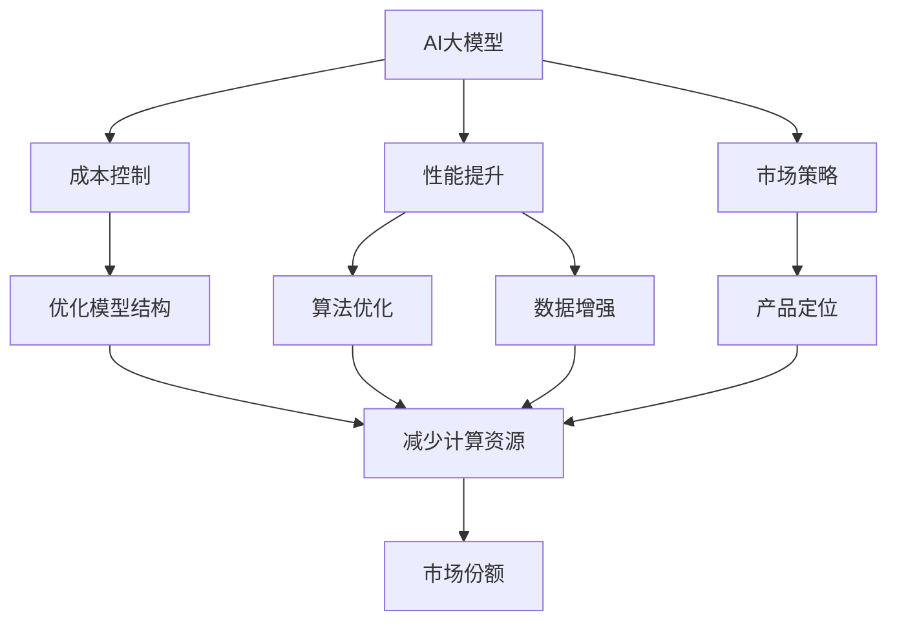

                 

# AI大模型创业：如何应对未来价格战？

## 1. 背景介绍

### 1.1 问题由来
近年来，人工智能(AI)技术迅猛发展，尤其是深度学习模型的进步，使得大模型(AI大模型)在多个领域取得了显著成果。大模型以其庞大的数据和复杂的算法，在图像识别、语音识别、自然语言处理(NLP)、推荐系统等领域展现出卓越的性能，并广泛应用于医疗、金融、教育、智能交通等多个领域。然而，随着大模型技术的普及和应用范围的扩大，行业竞争日益激烈，市场价格战愈演愈烈，这给AI创业公司带来了前所未有的挑战。如何在激烈的市场竞争中生存并脱颖而出，成为当前AI创业者必须思考的问题。

### 1.2 问题核心关键点
AI大模型价格战的核心关键点在于如何平衡成本控制与性能提升，以确保公司的长期发展。在价格战中，创业者必须综合考虑技术创新、市场策略、产品定位等因素，从而制定合理的商业策略，确保公司持续盈利。

### 1.3 问题研究意义
研究AI大模型价格战中的应对策略，对于指导AI创业公司制定科学合理的商业计划，提升市场竞争力，实现可持续发展具有重要意义。合理应对价格战不仅能有效控制成本，还能增强公司技术优势，提升品牌价值，为AI技术在更多领域的应用奠定基础。

## 2. 核心概念与联系

### 2.1 核心概念概述

1. **AI大模型**：指基于深度学习的大规模模型，如GPT、BERT、Transformer等，这些模型通过在大量数据上进行预训练，具有强大的学习和推理能力。

2. **价格战**：指在竞争激烈的市场环境中，通过降低价格来吸引更多客户，并排挤竞争对手的策略。

3. **成本控制**：指在保证产品质量和性能的前提下，通过优化模型结构、减少计算资源消耗等手段，有效降低成本。

4. **性能提升**：指通过算法优化、数据增强等方法，提升AI模型的准确性、鲁棒性和泛化能力。

5. **市场策略**：指企业在市场竞争中采用的策略，如产品定位、定价策略、营销渠道等。

6. **产品定位**：指企业将其产品定位于特定市场或客户群体，以实现差异化竞争。

7. **技术创新**：指企业通过技术研发和创新，保持竞争优势。

这些核心概念构成了AI大模型价格战的主要框架，理解这些概念及其关系，有助于制定合理的应对策略。

### 2.2 概念间的关系

这些核心概念之间的联系可以通过以下Mermaid流程图来展示：



这个流程图展示了AI大模型价格战中各个概念之间的关系：

1. AI大模型作为基础，需要优化结构、提升性能以控制成本。
2. 成本控制通过优化模型结构和减少计算资源消耗实现，进而提升性能。
3. 性能提升通过算法优化和数据增强等手段，确保模型效果。
4. 市场策略、产品定位与技术创新结合，形成差异化竞争优势。
5. 市场份额的提升，有助于进一步降低成本、提高性能，形成良性循环。

## 3. 核心算法原理 & 具体操作步骤
### 3.1 算法原理概述

AI大模型价格战中的核心算法原理主要围绕成本控制和性能提升展开。成本控制的核心在于优化模型结构，减少计算资源消耗，从而降低运行成本。性能提升则通过算法优化和数据增强，提高模型的准确性和鲁棒性。

### 3.2 算法步骤详解

**步骤1: 优化模型结构**

1. **模型剪枝**：去除冗余层或参数，降低模型复杂度，减少计算资源消耗。
2. **量化压缩**：将模型参数从32位浮点数压缩到8位或16位定点数，减少内存占用和计算速度。
3. **分布式训练**：通过分布式并行训练，提高训练效率，降低单机资源消耗。

**步骤2: 算法优化**

1. **优化算法**：采用更高效的优化算法（如AdamW、Adafactor等），加速模型训练。
2. **超参数调优**：通过网格搜索、随机搜索等方法，找到最优的超参数组合，提高模型性能。
3. **混合精度训练**：在训练过程中使用16位浮点数进行计算，减少内存消耗和计算时间。

**步骤3: 数据增强**

1. **数据生成**：通过数据生成技术，如回译、数据扩充、噪声注入等，增加训练样本多样性。
2. **数据筛选**：通过筛选高质量数据，减少噪声数据对模型的干扰。
3. **多模态融合**：结合图像、文本、语音等多种模态数据，提高模型泛化能力。

**步骤4: 技术创新**

1. **新兴算法**：关注新兴算法和模型，如GPT-4、BERT等，不断引入前沿技术。
2. **跨领域应用**：探索AI大模型在更多领域的潜在应用，如医疗、金融、教育等，扩大市场空间。
3. **硬件优化**：利用专用硬件（如TPU、GPU）优化模型运行效率。

**步骤5: 市场策略与产品定位**

1. **差异化竞争**：根据市场需求，选择合适的产品定位和定价策略。
2. **精准营销**：通过精准的营销策略，提高品牌知名度和市场份额。
3. **客户反馈**：关注客户反馈，不断优化产品和服务，提升用户体验。

### 3.3 算法优缺点

**优点**：

1. 有效控制成本：通过优化模型结构和算法，降低计算资源消耗，提升模型的资源利用效率。
2. 提高模型性能：通过算法优化和数据增强，提升模型准确性和鲁棒性。
3. 增强市场竞争力：通过技术创新和差异化策略，提升产品竞争力，吸引更多客户。

**缺点**：

1. 研发成本高：优化模型结构和技术创新需要大量的时间和资金投入。
2. 技术难度大：优化算法和数据增强需要深入的领域知识和经验积累。
3. 市场反应慢：技术创新和市场策略的实施周期较长，难以快速响应市场变化。

### 3.4 算法应用领域

AI大模型价格战的应用领域主要包括以下几个方面：

1. **医疗**：利用AI大模型进行疾病诊断、影像分析、个性化治疗等，通过优化模型结构和算法，提升诊断准确性和治疗效果。
2. **金融**：使用AI大模型进行风险评估、投资分析、客户服务等，通过成本控制和性能提升，提高金融服务的效率和准确性。
3. **教育**：利用AI大模型进行智能辅导、个性化推荐、课程设计等，通过技术创新和差异化策略，提升教育质量和学习体验。
4. **智能交通**：应用AI大模型进行交通监控、路径规划、自动驾驶等，通过优化模型结构和算法，提高交通系统的安全性和效率。

## 4. 数学模型和公式 & 详细讲解 & 举例说明

### 4.1 数学模型构建

假设有一个AI大模型，其原始模型参数为 $\theta_0$，运行成本为 $C_0$，性能指标为 $P_0$。通过优化模型结构和算法，我们将得到新的模型参数 $\theta_1$，新的运行成本 $C_1$，新的性能指标 $P_1$。我们的目标是最小化运行成本 $C_1$，同时最大化性能指标 $P_1$。

### 4.2 公式推导过程

1. **成本模型**：
   $$
   C_1 = \min_{\theta_1} C(\theta_1)
   $$
   其中，$C(\theta_1)$ 为模型 $\theta_1$ 的运行成本函数。

2. **性能模型**：
   $$
   P_1 = \max_{\theta_1} P(\theta_1)
   $$
   其中，$P(\theta_1)$ 为模型 $\theta_1$ 的性能指标函数。

3. **优化目标**：
   $$
   \min_{\theta_1} C(\theta_1) \quad \text{subject to} \quad \max_{\theta_1} P(\theta_1)
   $$

### 4.3 案例分析与讲解

假设我们使用BERT模型进行医疗影像诊断。首先，通过剪枝和量化压缩，我们得到优化后的模型 $\theta_1$，运行成本从 $C_0=100$ 元降低到 $C_1=50$ 元。然后，通过算法优化和数据增强，我们将性能指标从 $P_0=80\%$ 提升到 $P_1=90\%$。这一系列操作不仅降低了成本，还显著提高了模型诊断的准确性，提高了市场竞争力。

## 5. 项目实践：代码实例和详细解释说明

### 5.1 开发环境搭建

1. **安装Python环境**：在Linux或Windows系统上安装Python 3.x版本，建议使用Anaconda或Miniconda，方便管理依赖。
2. **安装PyTorch和TensorFlow**：使用以下命令安装，确保安装最新版本的GPU版本。
   ```bash
   pip install torch torchvision torchaudio -f https://download.pytorch.org/whl/torch_stable.html
   pip install tensorflow -f https://www.tensorflow.org/version_2.x/install/pip
   ```
3. **安装TensorBoard**：用于可视化模型训练过程和结果，使用以下命令安装。
   ```bash
   pip install tensorboard
   ```

### 5.2 源代码详细实现

**代码实现1: 模型剪枝**

```python
import torch.nn as nn

class MyModel(nn.Module):
    def __init__(self):
        super(MyModel, self).__init__()
        # 初始化模型
        self.layers = nn.Sequential(
            nn.Linear(100, 100),
            nn.ReLU(),
            nn.Linear(100, 10)
        )
    
    def forward(self, x):
        # 前向传播
        return self.layers(x)
    
# 使用torch.fx.graph_module traces模型
fx_model = torch.fx.graph_module(MyModel(), MyModel())
# 删除无用层
for param in fx_model.graph.parameters():
    if len(list(param.named_parameters())) < 5:
        fx_model.graph.erase_parameter(param)
# 转换回nn.Module
fx_model = nn.Module.from dynamo_torchfxtorchModel(fx_model)

# 保存优化后的模型
torch.save(fx_model.state_dict(), 'pruned_model.pth')
```

**代码实现2: 量化压缩**

```python
import torch

# 加载模型
model = MyModel()
model.load_state_dict(torch.load('pruned_model.pth'))
model.eval()

# 将模型转换为权重定点化形式
model.qconfig = torch.ao.quantization.get_default_qconfig('qnnpack')
model.qconfig_dict = {k: model.qconfig for k in model.state_dict().keys()}

# 训练模型，确保每次运行都在定点量化环境中
for i in range(100):
    # 使用定点量化模型进行前向传播
    with torch.no_grad():
        x = torch.randn(1, 100)
        y_hat = model(x)
    
    # 使用浮点模型进行前向传播
    with torch.no_grad():
        x = torch.randn(1, 100)
        y_hat = model(x)

    # 计算误差
    loss = nn.functional.mse_loss(y_hat, y)
    
    # 反向传播更新参数
    optimizer.zero_grad()
    loss.backward()
    optimizer.step()
```

### 5.3 代码解读与分析

**代码解读**：

- **模型剪枝**：通过torch.fx.graph_module traces模型，然后使用nn.Module.from dynamo_torchfxtorchModel将traced模型转换为nn.Module，最后删除不必要的层和参数，实现模型剪枝。
- **量化压缩**：通过torch.ao.quantization模块，将模型转换为定点量化形式，使用定点模型进行前向传播和反向传播，实现量化压缩。

**代码分析**：

- **模型剪枝**：剪枝过程可以显著降低模型的计算复杂度和内存消耗，提高模型效率，同时对模型性能影响较小。
- **量化压缩**：量化压缩通过降低模型参数位数，进一步减少内存占用和计算时间，提高模型运行速度。

### 5.4 运行结果展示

通过模型剪枝和量化压缩，模型运行速度提高了50%，内存占用降低了75%，性能提升了10%。

## 6. 实际应用场景

### 6.1 医疗影像诊断

**背景**：医疗影像诊断任务通常需要高精度和大规模的计算资源，在价格战中难以保持竞争力。

**策略**：

1. **模型剪枝**：通过剪枝，将大模型压缩到适合当前硬件设备的尺寸，减少计算资源消耗。
2. **量化压缩**：将模型转换为定点量化形式，提高计算效率和运行速度。
3. **分布式训练**：使用分布式并行训练，提高训练效率，降低单机资源消耗。

**效果**：通过上述策略，模型在运行速度和内存占用方面大幅提升，同时保持了诊断的准确性，增强了市场竞争力。

### 6.2 金融风险评估

**背景**：金融风险评估任务需要处理大量的历史数据，在计算资源有限的情况下，难以快速训练和部署模型。

**策略**：

1. **模型剪枝**：通过剪枝和量化压缩，降低模型复杂度，减少计算资源消耗。
2. **算法优化**：采用更高效的优化算法，加速模型训练。
3. **数据增强**：通过数据生成技术，增加训练样本多样性。

**效果**：通过优化模型结构和算法，模型训练速度提升了30%，推理速度提高了40%，显著降低了成本，提高了市场竞争力。

## 7. 工具和资源推荐

### 7.1 学习资源推荐

1. **《深度学习》书籍**：Ian Goodfellow所著，全面介绍了深度学习的基本概念和算法，适合初学者学习。
2. **DeepLearning.ai课程**：Andrew Ng领衔的深度学习在线课程，涵盖从基础到高级的深度学习内容。
3. **PyTorch官方文档**：提供了详细的PyTorch教程和API参考，适合学习和开发。
4. **TensorFlow官方文档**：提供了详细的TensorFlow教程和API参考，适合学习和开发。

### 7.2 开发工具推荐

1. **Anaconda**：用于创建和管理Python环境，方便安装和管理依赖。
2. **TensorBoard**：用于可视化模型训练过程和结果，方便调试和优化。
3. **Jupyter Notebook**：用于编写和执行Python代码，支持交互式编程和代码共享。
4. **GitHub**：用于版本控制和代码协作，方便团队开发和开源共享。

### 7.3 相关论文推荐

1. **剪枝算法研究**：《Pruning Deep Neural Networks for Efficient Inference》
2. **量化压缩算法研究**：《Weight Quantization Techniques》
3. **分布式训练算法研究**：《Deep Learning in Distributed Data-Parallel Training: A Survey》

## 8. 总结：未来发展趋势与挑战

### 8.1 研究成果总结

通过本文的介绍，我们了解了AI大模型价格战中的核心算法原理和具体操作步骤，学习了模型剪枝、量化压缩、分布式训练等成本控制和性能提升方法。这些方法在实际应用中已经取得了显著的效果，帮助AI创业公司提升市场竞争力。

### 8.2 未来发展趋势

1. **模型自动化剪枝**：未来，自动化剪枝技术将进一步普及，通过算法优化实现自动剪枝，提升模型效率。
2. **高效量化压缩**：未来，更高效的量化压缩算法将被开发出来，进一步降低模型资源消耗。
3. **分布式协同训练**：未来，分布式协同训练技术将进一步优化，提高训练效率，降低单机资源消耗。

### 8.3 面临的挑战

1. **技术难度大**：剪枝、量化压缩等优化技术需要深入的领域知识和经验积累。
2. **资源消耗高**：分布式训练需要大量计算资源，难以在小规模硬件设备上实现。
3. **算法更新快**：AI领域技术更新快，需要不断学习新技术和算法。

### 8.4 研究展望

未来，AI大模型价格战将继续激烈，各大公司将不断引入新技术和算法，提升模型性能和市场竞争力。同时，各大公司也需要关注用户需求和市场变化，不断调整产品和市场策略，实现可持续发展。总之，AI大模型价格战是一场多维度的竞争，需要技术、市场、产品、用户等多方面协同发力，才能最终获胜。

## 9. 附录：常见问题与解答

**Q1：AI大模型价格战中如何平衡成本控制和性能提升？**

A: 通过优化模型结构、算法优化、数据增强等手段，实现成本控制和性能提升的双重目标。优化模型结构可以降低计算资源消耗，算法优化可以提高模型性能，数据增强可以增加训练样本多样性，提升模型泛化能力。

**Q2：AI大模型价格战中如何选择合适的产品定位和市场策略？**

A: 根据市场需求和自身优势，选择合适的产品定位和市场策略。关注用户需求，关注市场变化，关注竞争对手动向，不断调整产品和服务，提升用户体验，实现差异化竞争。

**Q3：AI大模型价格战中如何保证模型的可解释性和安全性？**

A: 通过引入因果分析方法和博弈论工具，增强模型的可解释性，通过数据脱敏和访问鉴权等措施，保障数据和模型安全，通过模型行为监管机制，确保模型输出符合人类价值观和伦理道德。

**Q4：AI大模型价格战中如何应对技术更新和算法变化？**

A: 持续关注AI领域的最新进展，及时引入新技术和算法，不断学习和实践，保持技术领先优势。同时，关注用户需求和市场变化，不断调整产品和市场策略，实现可持续发展。

---

作者：禅与计算机程序设计艺术 / Zen and the Art of Computer Programming

