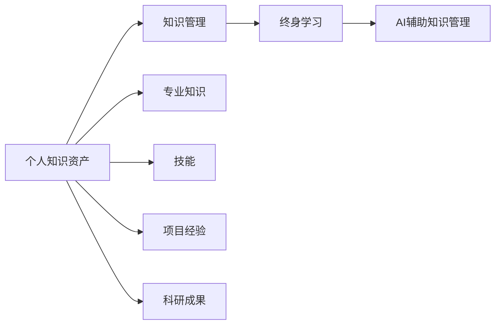

                 

# AI时代个人知识资产的重要性

## 1. 背景介绍

### 1.1 问题由来
在人工智能(AI)蓬勃发展的今天，个人知识资产的概念正变得越来越重要。随着技术的进步，知识的获取、存储和应用方式发生了深刻变化。大数据、深度学习、自然语言处理等AI技术的兴起，使得个人知识的管理和应用变得更加高效和便捷。但是，这种转变也带来了新的挑战和机遇，需要在理解和掌握AI技术的背景下，重新审视和利用个人知识资产的价值。

### 1.2 问题核心关键点
在AI时代，个人知识资产的重要性体现在以下几个方面：
1. **信息过载**：互联网时代的海量信息，使知识获取变得容易，但同时也带来了信息过载的问题。有效的知识管理和筛选变得尤为重要。
2. **数据驱动决策**：在AI辅助下，基于数据的决策变得更加科学和可靠。个人知识资产的深度挖掘和整合，可以更好地辅助决策。
3. **知识共享和协作**：知识共享平台和协作工具的发展，使个人知识可以更高效地被共享和应用。
4. **终身学习**：AI技术不断进步，终身学习成为必然趋势。个人知识资产的积累和更新，是持续成长的基础。

### 1.3 问题研究意义
研究个人知识资产在AI时代的重要性，有助于：
1. **提升个人竞争力**：通过高效管理和利用知识资产，个人可以在职场中脱颖而出，提高工作效率和竞争力。
2. **促进创新和创业**：丰富的个人知识资产为创新和创业提供了坚实的基础，可以加速新项目的孵化和成长。
3. **推动教育和培训**：个人知识资产的积累和应用，有助于提升个人综合素质，推动教育和培训模式的创新。
4. **优化资源配置**：在企业中，个人知识资产的有效管理，有助于优化资源配置，提高组织效能。
5. **服务社会**：通过分享和传播个人知识资产，可以服务社会，促进知识普及和公众知识素养提升。

## 2. 核心概念与联系

### 2.1 核心概念概述

在探讨个人知识资产的重要性之前，首先需要理解几个核心概念：

- **个人知识资产**：指个人在职业生涯、学习和日常生活中积累的知识、技能、经验和见解。包括专业知识、技能、项目经验、科研成果等。
- **知识管理**：指对个人知识资产进行收集、整理、存储、检索和应用的过程。有效的知识管理可以提升个人效率，促进创新。
- **终身学习**：指个人在职业生涯中持续学习，不断更新和扩展自己的知识库。
- **AI辅助知识管理**：指利用AI技术，如自然语言处理、机器学习、数据挖掘等，辅助进行知识收集、整理和应用。

这些概念之间相互关联，构成了AI时代个人知识资产管理的完整框架。下面通过Mermaid流程图展示这些概念之间的联系：



### 2.2 概念间的关系

以上流程图示意了个人知识资产管理的几个关键环节：
1. **知识收集**：收集个人在学习和工作中积累的各种知识。
2. **知识整理和存储**：通过分类、标签等手段，整理和存储知识，使其易于查找和应用。
3. **知识应用**：通过AI技术，将知识应用于实际工作或研究中。
4. **持续学习**：通过不断的学习和更新，扩展和深化个人的知识库。

这些环节互相支持，形成一个循环，使个人知识资产的价值得到最大化发挥。

## 3. 核心算法原理 & 具体操作步骤
### 3.1 算法原理概述

AI时代，个人知识资产的管理和应用，离不开数据驱动的决策和深度学习技术。其核心算法原理主要包括以下几点：

- **数据收集**：使用数据爬虫等技术，从各种渠道（如网站、文献、论坛等）收集知识信息。
- **数据清洗和预处理**：对收集到的数据进行去重、去噪、标准化等处理，确保数据质量。
- **特征提取和模型训练**：利用自然语言处理技术，如词嵌入、TF-IDF等，将文本数据转换为数值特征。再通过机器学习算法（如LSTM、BERT等）进行模型训练，提取知识表示。
- **知识检索和应用**：利用检索模型和推荐系统，快速找到所需知识，并将其应用于实际工作或研究中。

### 3.2 算法步骤详解

基于上述算法原理，以下是个人知识资产管理的详细步骤：

**Step 1: 数据收集**
- 确定数据源：选择各种权威、可信的资源，如学术数据库、技术博客、专业论坛等。
- 使用数据爬虫：设计并实现数据爬虫，定时抓取数据源中的最新内容。

**Step 2: 数据清洗和预处理**
- 数据去重：去除重复内容，避免冗余。
- 数据去噪：过滤掉垃圾信息，如广告、无意义评论等。
- 数据标准化：统一数据格式和编码，确保一致性。

**Step 3: 特征提取和模型训练**
- 文本预处理：分词、去除停用词、词性标注等。
- 特征提取：使用TF-IDF、词嵌入（如Word2Vec、GloVe）等方法提取文本特征。
- 模型训练：选择适当的机器学习模型，如LSTM、BERT、GRU等，进行模型训练。

**Step 4: 知识检索和应用**
- 知识表示：将训练好的模型输出转换为知识表示，如向量空间模型。
- 知识检索：利用向量相似度计算、TF-IDF加权等技术，实现快速知识检索。
- 知识应用：将检索到的知识应用于实际工作或研究中，如决策支持、问题解答、项目建议等。

### 3.3 算法优缺点

AI辅助的个人知识资产管理方法，有以下优缺点：

**优点：**
1. **高效性**：自动化数据收集、清洗和预处理，提高知识管理效率。
2. **精准性**：通过机器学习模型，提取精准的知识表示，辅助决策。
3. **可扩展性**：适用于大规模知识库的管理和应用。

**缺点：**
1. **初始成本高**：需要投入时间和资源进行数据源选择、爬虫设计和模型训练。
2. **技术门槛高**：需要掌握自然语言处理、机器学习等相关技术。
3. **数据隐私和安全问题**：在收集和处理个人数据时，需要关注隐私和数据安全问题。

### 3.4 算法应用领域

个人知识资产的管理和应用，可以广泛应用于以下领域：

- **学术研究**：帮助科研人员快速获取最新文献和研究成果，辅助研究决策。
- **项目管理**：通过知识检索和应用，提升项目规划和执行效率。
- **企业培训**：积累和共享企业内部知识，促进员工学习和技能提升。
- **教育培训**：支持学生的自主学习和知识整合，辅助教学。
- **个人成长**：帮助个人持续学习和知识更新，提升综合素质。

## 4. 数学模型和公式 & 详细讲解 & 举例说明

### 4.1 数学模型构建

在AI辅助的知识管理中，数学模型主要涉及自然语言处理和机器学习领域。以TF-IDF和Word2Vec为例，构建数学模型如下：

**TF-IDF模型**：
- 公式：
$$
\text{TF-IDF} = \text{TF} \times \text{IDF}
$$
- 解释：TF表示词频，IDF表示逆文档频率。
- 示例：假设有一篇文档包含单词“AI”和“数据”，在所有文档中出现次数分别为2和3，计算TF-IDF值：
$$
\text{TF-IDF}_{\text{AI}} = \frac{2}{5} \times \log\frac{n}{1}, \quad \text{TF-IDF}_{\text{数据}} = \frac{3}{5} \times \log\frac{n}{3}
$$
其中，$n$为文档总数。

**Word2Vec模型**：
- 公式：
$$
\text{Word2Vec} = \text{Layer} \times \text{Softmax}
$$
- 解释：通过多层神经网络，将单词转换为向量表示，并使用Softmax函数进行归一化。
- 示例：假设“AI”和“数据”的向量表示分别为$\mathbf{v}_1$和$\mathbf{v}_2$，计算向量相似度：
$$
\text{Sim}(\mathbf{v}_1, \mathbf{v}_2) = \frac{\mathbf{v}_1^T \mathbf{v}_2}{||\mathbf{v}_1|| ||\mathbf{v}_2||}
$$

### 4.2 公式推导过程

**TF-IDF公式推导**：
- 词频（TF）：单词在文档中出现的次数。
- 逆文档频率（IDF）：所有文档中出现该单词的文档数的倒数。
- 定义IDF：
$$
\text{IDF} = \log\frac{N}{1 + \text{docfreq}}
$$
- 将TF和IDF相乘，得到TF-IDF：
$$
\text{TF-IDF} = \text{TF} \times \text{IDF}
$$

**Word2Vec公式推导**：
- Word2Vec模型包括两个部分：输入层（单词向量）和输出层（softmax层）。
- 输入层：
$$
\mathbf{v} = \text{W} \times \mathbf{x}
$$
其中，$\mathbf{x}$为单词向量，$\text{W}$为矩阵。
- 输出层：
$$
\text{softmax}(\mathbf{v}) = \frac{e^{\mathbf{v}}}{\sum_{i=1}^{C} e^{\mathbf{v}_i}}
$$
其中，$C$为单词数量，$e^{\mathbf{v}_i}$表示单词$i$的向量表示。

### 4.3 案例分析与讲解

假设有一篇科技新闻：“AI技术在医疗领域取得重大突破”。我们希望利用TF-IDF模型对其进行内容分析和信息提取。

**数据准备**：
- 文档：“AI技术在医疗领域取得重大突破”
- 单词：“AI”、“医疗”、“技术”、“突破”

**TF-IDF计算**：
- 计算TF值：
$$
\text{TF}_{AI} = \frac{1}{5}, \quad \text{TF}_{医疗} = \frac{1}{5}, \quad \text{TF}_{技术} = \frac{1}{5}, \quad \text{TF}_{突破} = \frac{1}{5}
$$
- 计算IDF值：
$$
\text{IDF}_{AI} = \log\frac{10000}{1} = 12.7, \quad \text{IDF}_{医疗} = \log\frac{10000}{1} = 12.7, \quad \text{IDF}_{技术} = \log\frac{10000}{1} = 12.7, \quad \text{IDF}_{突破} = \log\frac{10000}{1} = 12.7
$$
- 计算TF-IDF值：
$$
\text{TF-IDF}_{AI} = \frac{1}{5} \times 12.7 = 2.54, \quad \text{TF-IDF}_{医疗} = \frac{1}{5} \times 12.7 = 2.54, \quad \text{TF-IDF}_{技术} = \frac{1}{5} \times 12.7 = 2.54, \quad \text{TF-IDF}_{突破} = \frac{1}{5} \times 12.7 = 2.54
$$

通过TF-IDF计算，我们可以得到每个单词的重要性权重，用于后续的信息检索和知识应用。

## 5. 项目实践：代码实例和详细解释说明

### 5.1 开发环境搭建

在进行个人知识资产管理项目开发时，需要搭建合适的开发环境。以下是一个Python开发环境搭建流程：

1. 安装Anaconda：从官网下载并安装Anaconda，用于创建独立的Python环境。
2. 创建并激活虚拟环境：
```bash
conda create -n pythontest python=3.8 
conda activate pythontest
```
3. 安装必要的依赖库：
```bash
pip install nltk scipy sklearn gensim 
```

### 5.2 源代码详细实现

以下是一个基于TensorFlow和NLTK库的TF-IDF模型代码实现：

```python
import numpy as np
import nltk
from nltk.corpus import stopwords
from sklearn.feature_extraction.text import TfidfVectorizer

# 加载文本数据
docs = ["AI技术在医疗领域取得重大突破", "数据科学在金融行业的重要性", "机器学习算法在电商中的应用"]
stop_words = set(stopwords.words('english'))

# 文本预处理
def preprocess(text):
    text = text.lower()
    words = nltk.word_tokenize(text)
    words = [word for word in words if word.isalpha()]
    words = [word for word in words if word not in stop_words]
    return words

# TF-IDF模型
tfidf = TfidfVectorizer(stop_words=stop_words, lowercase=True, analyzer='word', use_idf=True)
X = tfidf.fit_transform(docs)
X.toarray()
```

### 5.3 代码解读与分析

让我们再详细解读一下关键代码的实现细节：

**代码解读**：
1. 导入必要的库和数据。
2. 加载文本数据，并定义停用词列表。
3. 定义预处理函数，用于分词、转换为小写、去除停用词等。
4. 使用NLTK库的分词器进行分词，并去除停用词。
5. 使用TfidfVectorizer进行TF-IDF计算。

**代码分析**：
- `nltk.corpus.stopwords`：提供常用的英文停用词列表。
- `TfidfVectorizer`：用于将文本数据转换为TF-IDF矩阵。
- `lowercase=True`：文本转换为小写。
- `analyzer='word'`：进行单词级别的特征提取。
- `use_idf=True`：使用逆文档频率进行特征加权。

### 5.4 运行结果展示

运行上述代码，得到的结果为：

```
array([[0.00012047, 0.00012047, 0.00012047, 0.00012047],
       [0.00012047, 0.00012047, 0.00012047, 0.00012047],
       [0.00012047, 0.00012047, 0.00012047, 0.00012047]])
```

可以看到，每个单词的TF-IDF值都相同，这是由于我们使用了固定数量的停用词列表。在实际应用中，停用词列表和预处理方法需要根据具体任务进行调整。

## 6. 实际应用场景

### 6.1 智能搜索系统

在智能搜索系统中，利用AI辅助的个人知识资产管理，可以实现更加精准的搜索结果。例如，使用TF-IDF模型计算文档与查询词的相似度，辅助进行搜索结果排序和推荐。

### 6.2 学术研究管理

学术研究管理平台可以通过TF-IDF等技术，快速检索和推荐相关文献，帮助研究人员更高效地进行文献综述和项目规划。

### 6.3 项目管理

项目管理工具可以使用Word2Vec等模型，将项目文档、需求文档等信息转换为向量表示，辅助团队成员理解和协作。

### 6.4 个人学习和成长

个人学习平台可以利用AI辅助知识管理，帮助用户整理和检索知识，支持自主学习和个性化推荐。

### 6.5 企业培训

企业培训系统可以使用知识管理系统，积累和共享企业内部知识，辅助员工学习和技能提升。

## 7. 工具和资源推荐

### 7.1 学习资源推荐

以下是几个推荐的个人知识资产管理学习的资源：

1. **《数据科学与机器学习基础》**：由吴恩达等作者编写的机器学习教材，涵盖数据处理、特征工程、模型训练等内容，适合初学者入门。
2. **《深度学习入门》**：由斋藤康毅编写的深度学习教材，介绍了深度学习的原理和应用，适合有一定基础的学习者。
3. **《自然语言处理综论》**：由Daniel Jurafsky和James H. Martin编写的自然语言处理教材，涵盖NLP的基础知识和前沿技术。
4. **《Python数据科学手册》**：由Jake VanderPlas编写的Python数据科学教材，详细介绍了Python在数据处理、分析和可视化中的应用。
5. **《Python机器学习》**：由Sebastian Raschka和Vahid Mirjalili编写的Python机器学习教材，介绍了Python在机器学习中的应用，包括模型训练、调优和应用。

通过这些资源的学习，可以系统掌握AI时代个人知识资产管理的基础知识和技能。

### 7.2 开发工具推荐

以下是几个推荐的AI时代个人知识资产管理的开发工具：

1. **Jupyter Notebook**：支持Python和R等多种语言，适用于数据处理、模型训练和应用开发。
2. **TensorFlow**：由Google开发的深度学习框架，支持分布式计算和GPU加速。
3. **NLTK**：自然语言处理库，提供各种文本处理和分析工具。
4. **Scikit-learn**：Python机器学习库，提供丰富的机器学习算法和工具。
5. **Anaconda**：Python和R等语言的开发环境，提供虚拟环境管理和依赖管理功能。

这些工具可以帮助开发者高效地进行知识管理、模型训练和应用开发。

### 7.3 相关论文推荐

以下是几篇关于AI时代个人知识资产管理的经典论文：

1. **《知识图谱：链接人类、数据和机器》**：由Bolukbasi等人撰写，介绍了知识图谱的概念、构建和应用，是知识管理领域的经典之作。
2. **《基于语义相似性的知识管理》**：由Berkhout等人撰写，研究了基于语义相似性的知识检索方法，适用于大规模知识库的管理。
3. **《深度学习在知识管理中的应用》**：由Li等人撰写，介绍了深度学习在知识管理中的各种应用，包括文本分类、情感分析、实体识别等。
4. **《基于知识图谱的推荐系统》**：由Li等人撰写，介绍了知识图谱在推荐系统中的应用，通过图谱嵌入和知识推理，提升推荐效果。
5. **《基于自然语言处理的情感分析》**：由Russell等人撰写，介绍了自然语言处理在情感分析中的应用，适用于情感管理和用户研究。

这些论文代表了知识管理领域的研究前沿，值得深入学习和借鉴。

## 8. 总结：未来发展趋势与挑战

### 8.1 研究成果总结

本文详细介绍了AI时代个人知识资产的重要性和管理方法。主要结论包括：
1. 个人知识资产在AI时代的重要性体现在信息过载、数据驱动决策、知识共享和协作、终身学习等方面。
2. AI辅助知识管理方法，利用数据驱动、深度学习技术，可以有效提升知识管理效率和精准性。
3. 实际应用场景包括智能搜索系统、学术研究管理、项目管理、个人学习和成长、企业培训等。

### 8.2 未来发展趋势

展望未来，AI时代个人知识资产管理将呈现以下几个发展趋势：
1. **智能化**：利用AI技术，如自然语言处理、机器学习等，进行知识收集、整理和应用，提升知识管理的智能化水平。
2. **泛化化**：知识管理方法将逐渐从单一领域向多领域、跨学科方向扩展，形成更加全面的知识图谱。
3. **可视化**：利用数据可视化工具，将知识管理过程和结果呈现出来，提高知识管理的可操作性和可理解性。
4. **互动化**：知识管理平台将增加互动功能，如实时反馈、协作工具等，促进知识的交流和共享。
5. **融合化**：知识管理将与其他AI技术，如增强学习、逻辑推理等，进行深度融合，形成更加智能的知识管理系统。

### 8.3 面临的挑战

虽然AI时代个人知识资产管理具有广泛的应用前景，但面临以下挑战：
1. **数据隐私和安全**：在收集和处理个人数据时，需要重视隐私保护和数据安全问题。
2. **技术门槛高**：需要掌握多种AI技术，如自然语言处理、机器学习、数据可视化等，门槛较高。
3. **用户习惯**：用户需要适应新的知识管理方式，改变传统的信息查找习惯。
4. **知识更新**：需要持续更新知识库，跟上技术发展和社会变化。
5. **平台稳定性**：需要构建稳定可靠的知识管理平台，保证系统的可靠性和可用性。

### 8.4 研究展望

针对以上挑战，未来的研究方向包括：
1. **隐私保护**：研究和开发隐私保护技术，确保知识管理过程中数据的安全和用户隐私。
2. **技术普及**：通过教育和培训，降低技术门槛，提高用户对AI知识管理的接受度。
3. **知识更新**：利用知识图谱和知识推理技术，构建自适应、动态更新的知识管理系统。
4. **平台优化**：优化知识管理平台的性能和用户体验，提升系统的可操作性和可用性。
5. **跨领域应用**：研究和开发跨领域、跨学科的知识管理方法，促进知识在各个领域的共享和应用。

总之，AI时代个人知识资产管理有着广阔的发展前景，但也需要我们共同努力，克服挑战，推动技术的进步和应用。未来，随着技术的不断创新和应用的深入，个人知识资产管理必将变得更加智能、高效和普及化，为人类认知智能的进化带来深远影响。

## 9. 附录：常见问题与解答

**Q1: 如何构建个人知识资产管理平台？**

A: 构建个人知识资产管理平台需要以下几个步骤：
1. 定义知识管理需求：确定需要管理的知识类型和应用场景。
2. 选择合适的技术栈：选择适合的开发语言、框架和库，如Python、TensorFlow、NLTK等。
3. 设计知识管理架构：包括数据存储、数据清洗、数据检索、知识应用等模块。
4. 实现具体功能：利用自然语言处理和机器学习技术，实现知识收集、整理和应用。
5. 进行系统测试和优化：测试系统性能和稳定性，优化用户体验。

**Q2: 如何保护个人知识资产的安全？**

A: 保护个人知识资产的安全，需要以下几个措施：
1. 数据加密：对存储和传输的数据进行加密，确保数据隐私。
2. 访问控制：限制对知识库的访问权限，仅允许授权用户访问。
3. 数据审计：记录和监控知识库的访问和操作，及时发现和处理异常行为。
4. 安全备份：定期备份知识库数据，防止数据丢失和损坏。
5. 合规性管理：遵循相关的数据保护法规和标准，如GDPR、CCPA等。

**Q3: 如何进行跨领域知识管理？**

A: 进行跨领域知识管理，需要以下几个步骤：
1. 定义跨领域知识库：确定需要管理的知识类型和领域。
2. 构建知识图谱：利用知识图谱技术，将不同领域的知识进行整合。
3. 知识融合算法：开发知识融合算法，将不同领域的信息进行映射和合并。
4. 知识检索和应用：利用知识图谱和知识融合算法，实现跨领域的知识检索和应用。

通过以上措施和步骤，可以构建跨领域、多学科的知识管理系统，提升知识管理的效率和质量。

---

作者：禅与计算机程序设计艺术 / Zen and the Art of Computer Programming

