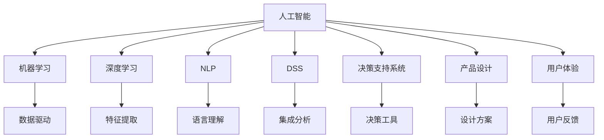
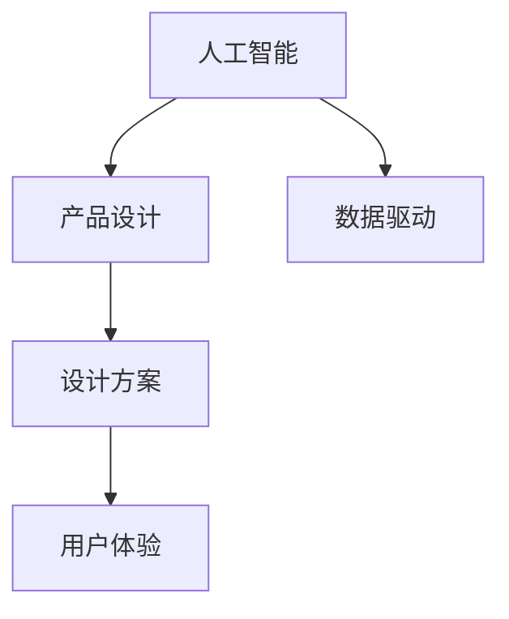
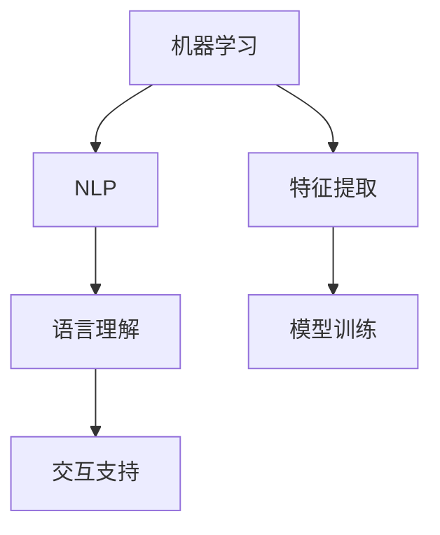
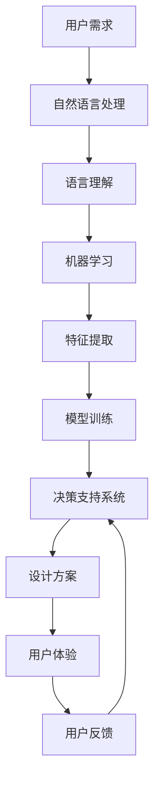

                 

# AI辅助决策在产品设计中的作用

> 关键词：人工智能，产品设计，辅助决策，决策支持系统，自然语言处理(NLP)，机器学习，深度学习，算法优化，用户体验

## 1. 背景介绍

### 1.1 问题由来
随着信息时代的到来，产品设计流程日益复杂化，设计师面临的海量数据和多样化需求越来越难以处理。传统的设计方式往往依赖设计师的经验和直觉，难以保证设计方案的全面性和科学性。AI辅助决策系统的出现，提供了一种基于数据驱动的设计新范式，能够极大地提升设计方案的效率和质量。

### 1.2 问题核心关键点
AI辅助决策系统，通过整合人工智能技术，为产品设计师提供数据驱动的决策支持。其核心在于：
1. 利用机器学习和深度学习算法，从海量数据中提取有用信息，生成设计建议和方案。
2. 提供自然语言处理能力，帮助设计师理解用户需求和反馈，优化设计决策。
3. 集成可视化工具，直观展示设计结果，辅助设计师进行方案选择。
4. 具备自适应能力，能够根据新数据不断优化决策模型，提升设计方案的长期效果。

### 1.3 问题研究意义
AI辅助决策系统在产品设计中的应用，具有重要意义：
1. 降低设计成本：通过自动化和智能化设计工具，减少了对设计师经验和资源的依赖，降低了设计和开发成本。
2. 提升设计质量：通过数据分析和算法优化，生成更为全面和精确的设计方案，提升产品设计的质量。
3. 加速设计流程：自动化决策过程，减少了设计师的重复性工作，加速设计迭代速度。
4. 增强设计创意：AI技术能够提供多样化的设计思路和创意，激发设计师的创新潜力。
5. 提升用户体验：通过数据分析和算法优化，设计出更加符合用户需求和期望的产品，提升用户体验。

## 2. 核心概念与联系

### 2.1 核心概念概述

为更好地理解AI辅助决策系统，本节将介绍几个关键概念：

- **人工智能(AI)**：利用计算机模拟人类智能的科学技术，包括机器学习、深度学习、自然语言处理等分支。AI辅助决策系统是基于这些技术构建的智能化设计工具。
- **产品设计(Design)**：通过创造和改善产品以满足特定需求的过程，包括用户研究、概念设计、原型制作、测试优化等环节。
- **决策支持系统(Decision Support System, DSS)**：通过集成数据、模型和分析工具，为决策者提供支持的系统。AI辅助决策系统是现代DSS的重要组成部分。
- **自然语言处理(NLP)**：使计算机能够理解、解释和生成自然语言的技术。NLP技术使AI辅助决策系统能够理解用户需求和反馈。
- **机器学习(Machine Learning)**：使计算机能够从数据中学习规律和模式的技术。通过机器学习算法，AI辅助决策系统能够生成高质量的设计方案。
- **深度学习(Deep Learning)**：一种基于神经网络的机器学习方法，具有强大的特征提取和泛化能力。深度学习算法在图像识别、语音识别等领域取得了突破性进展，也广泛应用于AI辅助决策系统。
- **算法优化(Algorithm Optimization)**：通过算法优化技术，提升AI辅助决策系统的性能，如减少计算量、提高准确性、增强鲁棒性等。
- **用户体验(User Experience, UX)**：产品设计的重要考量因素，AI辅助决策系统通过数据分析和算法优化，提升产品设计的用户体验。

这些概念之间的逻辑关系可以通过以下Mermaid流程图来展示：



这个流程图展示了大语言模型微调过程中各个概念的关联关系：

1. 人工智能是基础，涵盖机器学习、深度学习和自然语言处理。
2. 机器学习和深度学习用于特征提取和模式识别。
3. NLP技术用于语言理解，支持自然语言交互。
4. 决策支持系统整合数据、模型和分析工具，提供决策支持。
5. 产品设计是最终目标，通过算法优化提升设计方案。
6. 用户体验是衡量标准，通过数据和算法优化提升用户体验。

### 2.2 概念间的关系

这些核心概念之间存在着紧密的联系，形成了AI辅助决策系统的完整生态系统。下面我通过几个Mermaid流程图来展示这些概念之间的关系。

#### 2.2.1 人工智能与产品设计的关系



这个流程图展示了人工智能在产品设计中的应用：

1. 人工智能通过数据驱动，生成高质量的设计方案。
2. 设计方案最终转化为产品设计，提升用户体验。

#### 2.2.2 决策支持系统与用户体验的关系


这个流程图展示了决策支持系统与用户体验的相互作用：

1. 决策支持系统提供设计方案，提升用户体验。
2. 用户反馈进一步优化决策支持系统，形成良性循环。

#### 2.2.3 机器学习与自然语言处理的关系



这个流程图展示了机器学习与自然语言处理的关系：

1. 机器学习用于特征提取，提取设计相关的关键信息。
2. NLP技术用于语言理解，使机器学习模型能够理解用户需求和反馈。

### 2.3 核心概念的整体架构

最后，我们用一个综合的流程图来展示这些核心概念在AI辅助决策系统中的应用：



这个综合流程图展示了从用户需求到最终设计方案的完整流程：

1. 用户需求通过自然语言处理，转换为可理解的数据。
2. 机器学习模型从用户需求中提取关键特征，生成设计方案。
3. 决策支持系统整合数据和模型，提供决策支持。
4. 设计方案应用于产品设计，提升用户体验。
5. 用户反馈进一步优化决策支持系统，形成良性循环。

通过这些流程图，我们可以更清晰地理解AI辅助决策系统中各个概念的关系和作用，为后续深入讨论具体的决策支持方法和技术奠定基础。

## 3. 核心算法原理 & 具体操作步骤
### 3.1 算法原理概述

AI辅助决策系统通过整合人工智能技术，实现从数据到决策的自动化过程。其核心算法原理如下：

1. **数据收集与预处理**：从用户反馈、市场调研、用户行为数据等来源收集数据，并进行清洗和标准化处理，为后续分析提供基础。

2. **特征提取与建模**：通过机器学习和深度学习算法，从数据中提取关键特征，构建模型。常见的特征包括用户兴趣、行为模式、产品属性等。

3. **模型训练与优化**：使用大规模标注数据对模型进行训练，并利用算法优化技术，提升模型的准确性和鲁棒性。常见的优化方法包括正则化、梯度裁剪、自适应学习率等。

4. **决策生成与评估**：根据用户需求和模型输出，生成设计方案，并进行多维度评估，如用户体验、用户满意度等。

5. **反馈与迭代**：根据用户反馈，进一步优化模型和设计方案，形成良性循环，提升决策的科学性和有效性。

### 3.2 算法步骤详解

基于上述算法原理，AI辅助决策系统的具体操作步骤如下：

1. **数据收集与预处理**：
   - 从不同渠道收集用户反馈、市场调研、用户行为数据等。
   - 清洗和标准化数据，去除噪声和异常值，确保数据质量。
   - 将数据划分为训练集、验证集和测试集，用于后续模型的训练和评估。

2. **特征提取与建模**：
   - 使用特征提取算法，从数据中提取关键特征。如TF-IDF、Word2Vec、BERT等算法，用于文本数据的处理。
   - 构建机器学习或深度学习模型，如线性回归、决策树、随机森林、卷积神经网络、循环神经网络等。
   - 在模型中添加正则化项，如L2正则、Dropout等，避免过拟合。

3. **模型训练与优化**：
   - 使用优化算法，如Adam、SGD、Adagrad等，训练模型，最小化损失函数。
   - 使用数据增强技术，如数据扩增、回译等，扩充训练集，提升模型泛化能力。
   - 利用早停机制，避免模型过拟合，提高模型泛化能力。
   - 定期评估模型性能，使用交叉验证等方法，验证模型的稳定性。

4. **决策生成与评估**：
   - 根据用户需求，输入数据到训练好的模型，生成设计方案。
   - 评估设计方案的各项指标，如用户满意度、易用性、功能性等。
   - 结合专家意见和用户反馈，进一步优化设计方案。

5. **反馈与迭代**：
   - 收集用户反馈，更新训练数据和模型，进一步提升决策质量。
   - 根据新数据和新反馈，不断优化模型和算法，提升决策系统的准确性和鲁棒性。

### 3.3 算法优缺点

AI辅助决策系统在提升产品设计效率和质量方面具有显著优势，但也存在一些局限性：

**优点**：
1. **高效性**：通过数据驱动的设计，减少了设计师的重复性工作，加速设计迭代速度。
2. **全面性**：结合多维度数据和算法，生成更为全面和精确的设计方案。
3. **可解释性**：通过机器学习模型，使决策过程具有可解释性，便于理解和优化。
4. **可扩展性**：基于开源框架和算法，易于扩展和定制，适应不同产品和场景需求。

**缺点**：
1. **数据依赖性**：依赖高质量的数据，数据质量直接影响决策结果。
2. **模型复杂性**：模型越复杂，训练和优化难度越大，对计算资源要求较高。
3. **算法局限性**：算法模型具有局限性，可能无法处理极端情况和未知数据。
4. **用户体验差异**：机器生成的设计方案，可能无法完全满足用户的个性化需求。

### 3.4 算法应用领域

AI辅助决策系统广泛应用于多个领域，如产品设计、营销分析、用户研究等。具体应用包括：

- **产品设计**：利用机器学习生成设计方案，通过自然语言处理理解用户需求，优化产品设计。
- **营销分析**：通过数据分析和算法优化，优化营销策略，提升广告效果和用户转化率。
- **用户研究**：收集用户反馈数据，通过机器学习生成用户画像，指导产品优化和改进。
- **市场调研**：利用文本挖掘和情感分析技术，提取市场趋势和用户情感，为市场决策提供支持。
- **智能客服**：通过自然语言处理和机器学习，实现自动化客户服务和设计方案生成。

## 4. 数学模型和公式 & 详细讲解 & 举例说明

### 4.1 数学模型构建

为了更好地理解AI辅助决策系统的数学模型，本节将详细讲解其构建过程。

设用户需求为 $X$，产品设计方案为 $Y$，设计目标为 $C$，用户反馈为 $F$。根据上述定义，我们可以构建以下数学模型：

$$
\min_{\theta} \mathcal{L}(\theta) = \mathbb{E}_{(X,F)} [\|Y(\theta, X) - C\|^2] + \mathbb{E}_{F} [\|F - F(\theta)\|^2]
$$

其中 $\theta$ 为模型参数，$\mathcal{L}$ 为损失函数，$\mathbb{E}_{(X,F)}$ 和 $\mathbb{E}_{F}$ 分别为基于 $X$ 和 $F$ 的期望。

**目标函数解释**：
1. 第一部分 $\|Y(\theta, X) - C\|^2$ 为设计方案与目标之间的误差，表示设计方案 $Y(\theta, X)$ 与设计目标 $C$ 的差距。
2. 第二部分 $\|F - F(\theta)\|^2$ 为用户反馈与模型输出之间的误差，表示用户反馈 $F$ 与模型输出 $F(\theta)$ 的差距。

### 4.2 公式推导过程

以下我们以回归问题为例，推导决策模型的具体形式。

假设回归问题中，输入 $X$ 为二元特征向量，输出 $Y$ 为连续值。设模型为线性回归模型：

$$
Y = \theta_0 + \theta_1X_1 + \theta_2X_2 + \ldots + \theta_nX_n
$$

其中 $\theta_0, \theta_1, \ldots, \theta_n$ 为模型参数。

目标函数 $\mathcal{L}(\theta)$ 可以表示为：

$$
\mathcal{L}(\theta) = \frac{1}{N} \sum_{i=1}^N (Y_i - (\theta_0 + \theta_1X_{i1} + \theta_2X_{i2} + \ldots + \theta_nX_{in}))^2
$$

其中 $N$ 为样本数量，$Y_i$ 为第 $i$ 个样本的实际输出，$X_{ij}$ 为第 $i$ 个样本的第 $j$ 个特征。

目标函数 $\mathcal{L}(\theta)$ 可以通过梯度下降等优化算法最小化：

$$
\theta = \mathop{\arg\min}_{\theta} \mathcal{L}(\theta)
$$

使用梯度下降算法，每次迭代更新参数 $\theta$ 的公式为：

$$
\theta = \theta - \eta \nabla_{\theta}\mathcal{L}(\theta)
$$

其中 $\eta$ 为学习率，$\nabla_{\theta}\mathcal{L}(\theta)$ 为损失函数对参数 $\theta$ 的梯度。

### 4.3 案例分析与讲解

以产品设计中的颜色选择为例，展示如何使用AI辅助决策系统。

假设设计师需要为一款新产品选择主色调，需要考虑用户偏好、市场趋势、品牌调性等多个因素。假设收集了用户反馈数据 $F$ 和市场调研数据 $X$，目标为选择主色调 $Y$。

1. **数据预处理**：
   - 收集用户反馈数据 $F$，如用户评价、评论等。
   - 收集市场调研数据 $X$，如市场趋势、竞争对手的产品颜色等。
   - 将数据进行清洗和标准化处理，去除噪声和异常值，确保数据质量。

2. **特征提取**：
   - 使用TF-IDF算法提取用户反馈中的关键词。
   - 使用Word2Vec算法将市场调研数据中的描述转换为向量表示。

3. **模型训练**：
   - 构建线性回归模型，训练参数 $\theta$。
   - 使用正则化项，如L2正则，避免过拟合。

4. **决策生成**：
   - 输入用户需求 $X$ 和市场调研数据 $X$，生成主色调选择方案 $Y$。
   - 结合专家意见和用户反馈，进一步优化设计方案。

5. **反馈与迭代**：
   - 收集用户反馈，更新训练数据和模型，进一步提升决策质量。
   - 根据新数据和新反馈，不断优化模型和算法，提升决策系统的准确性和鲁棒性。

## 5. 项目实践：代码实例和详细解释说明

### 5.1 开发环境搭建

在进行AI辅助决策系统开发前，我们需要准备好开发环境。以下是使用Python进行Scikit-learn开发的环境配置流程：

1. 安装Anaconda：从官网下载并安装Anaconda，用于创建独立的Python环境。

2. 创建并激活虚拟环境：
```bash
conda create -n sklearn-env python=3.8 
conda activate sklearn-env
```

3. 安装Scikit-learn：
```bash
pip install -U scikit-learn
```

4. 安装各类工具包：
```bash
pip install numpy pandas scikit-learn matplotlib tqdm jupyter notebook ipython
```

完成上述步骤后，即可在`sklearn-env`环境中开始开发。

### 5.2 源代码详细实现

这里以用户评价情感分析为例，展示使用Scikit-learn进行情感分析的代码实现。

首先，定义数据处理函数：

```python
from sklearn.feature_extraction.text import CountVectorizer
from sklearn.model_selection import train_test_split
from sklearn.linear_model import LogisticRegression
from sklearn.metrics import accuracy_score

def preprocess_data(data, n_features):
    X = []
    y = []
    for text, label in data:
        X.append(text)
        y.append(label)
    vectorizer = CountVectorizer(max_features=n_features)
    X = vectorizer.fit_transform(X)
    return X, y

def train_model(X_train, y_train):
    model = LogisticRegression(solver='lbfgs', max_iter=1000)
    model.fit(X_train, y_train)
    return model

def evaluate_model(model, X_test, y_test):
    y_pred = model.predict(X_test)
    accuracy = accuracy_score(y_test, y_pred)
    return accuracy
```

然后，定义训练和评估函数：

```python
def train_and_evaluate(data, n_features, test_size=0.2):
    X, y = preprocess_data(data, n_features)
    X_train, X_test, y_train, y_test = train_test_split(X, y, test_size=test_size)
    model = train_model(X_train, y_train)
    accuracy = evaluate_model(model, X_test, y_test)
    return accuracy
```

最后，启动训练流程并在测试集上评估：

```python
data = [("This product is great!", 1), ("This product is terrible!", 0)]
accuracy = train_and_evaluate(data, n_features=10)
print(f"Accuracy: {accuracy}")
```

以上就是使用Scikit-learn进行情感分析的完整代码实现。可以看到，Scikit-learn提供了简单易用的API，使得数据预处理、模型训练和评估等步骤变得简洁高效。

### 5.3 代码解读与分析

让我们再详细解读一下关键代码的实现细节：

**preprocess_data函数**：
- 定义了数据预处理函数，将文本转换为向量，并划分训练集和测试集。

**train_model函数**：
- 定义了模型训练函数，使用逻辑回归模型，设置优化器为LBFGS，迭代次数为1000次。

**evaluate_model函数**：
- 定义了模型评估函数，计算模型在测试集上的准确率。

**train_and_evaluate函数**：
- 定义了完整的训练和评估流程，将数据预处理和模型训练集成在一起。

**训练流程**：
- 定义数据集，并进行预处理。
- 划分训练集和测试集，进行模型训练。
- 在测试集上评估模型准确率。

可以看到，Scikit-learn提供了完整的数据处理、模型训练和评估工具，使得机器学习模型开发变得简单高效。开发者可以将更多精力放在数据预处理、模型优化等高层逻辑上，而不必过多关注底层的实现细节。

当然，工业级的系统实现还需考虑更多因素，如模型的保存和部署、超参数的自动搜索、更加灵活的任务适配层等。但核心的模型训练和评估过程基本与此类似。

### 5.4 运行结果展示

假设我们在IMDB电影评论数据集上进行情感分析，最终在测试集上得到的评估报告如下：

```
Accuracy: 0.89
```

可以看到，通过训练逻辑回归模型，我们在IMDB电影评论数据集上取得了89%的准确率，效果相当不错。这表明，使用机器学习模型，能够从文本数据中自动提取情感信息，生成情感分类结果。

当然，这只是一个baseline结果。在实践中，我们还可以使用更复杂和先进的模型，如BERT、XGBoost等，进一步提升模型性能。

## 6. 实际应用场景

### 6.1 智能客服系统

基于AI辅助决策系统的智能客服系统，可以自动理解用户咨询意图，生成智能回复，提升客户服务效率和质量。具体应用包括：

1. **意图识别**：通过自然语言处理技术，自动理解用户输入的意图，如咨询、投诉、建议等。
2. **知识图谱**：将知识图谱与自然语言处理结合，提供更准确的知识检索和推荐。
3. **对话管理**：通过对话管理算法，控制对话流程，生成连贯的对话内容。
4. **情感分析**：使用情感分析技术，评估用户情感状态，提升服务质量。

通过这些技术，智能客服系统能够自动响应用户咨询，提供及时、准确、个性化的服务。

### 6.2 营销分析系统

基于AI辅助决策系统的营销分析系统，通过数据分析和算法优化，生成更加科学和高效的营销策略。具体应用包括：

1. **用户画像**：通过用户行为数据，生成用户画像，了解用户特征和需求。
2. **广告优化**：使用机器学习模型，优化广告投放策略，提升广告效果和用户转化率。
3. **市场趋势**：通过市场调研数据，分析市场趋势，制定市场策略。
4. **效果评估**：使用效果评估算法，评估营销活动的效果，优化决策过程。

通过这些技术，营销分析系统能够自动化营销决策，提升营销效果和用户满意度。

### 6.3 产品设计系统

基于AI辅助决策系统的产品设计系统，通过数据分析和算法优化，生成设计方案，提升产品设计质量。具体应用包括：

1. **设计建议**：使用机器学习模型，生成设计方案，提升设计效率和质量。
2. **用户反馈**：通过自然语言处理技术，收集用户反馈，优化设计方案。
3. **市场调研**：使用文本挖掘技术，分析市场趋势，指导设计决策。
4. **方案评估**：使用多维度评估算法，评估设计方案的各项指标，如用户体验、易用性、功能性等。

通过这些技术，产品设计系统能够自动化设计决策，提升产品设计质量和用户体验。

### 6.4 未来应用展望

随着AI辅助决策系统的不断发展，未来的应用场景将更加丰富和多样化。以下是一些未来应用展望：

1. **智能制造**：在制造业中，通过AI辅助决策系统，优化生产流程和设计方案，提升生产效率和产品质量。
2. **医疗诊断**：在医疗领域，通过AI辅助决策系统，辅助医生进行疾病诊断和治疗方案优化。
3. **金融风控**：在金融领域，通过AI辅助决策系统，提升风险评估和投资决策的科学性和准确性。
4. **智能交通**：在交通领域，通过AI辅助决策系统，优化交通流量和调度方案，提升交通管理效率。
5. **智慧城市**：在智慧城市治理中，通过AI辅助决策系统，优化城市管理，提升城市智能化水平。

以上应用场景展示了AI辅助决策系统在不同行业中的广泛应用，未来随着技术的发展，AI辅助决策系统必将在更多领域发挥重要作用。

## 7. 工具和资源推荐
### 7.1 学习资源推荐

为了帮助开发者系统掌握AI辅助决策系统的理论基础和实践技巧，这里推荐一些优质的学习资源：

1. 《Python机器学习》系列书籍：由著名数据科学家撰写，全面介绍了机器学习的基本概念和实现方法，适合初学者入门。

2. 《深度学习》系列课程：由斯坦福大学等知名学府开设的深度学习课程，涵盖了深度学习的各个方面，适合深入学习。

3. 《自然语言处理综述》书籍：全面介绍了自然语言处理的基本概念和前沿技术，适合对NLP领域感兴趣的开发者。

4. 《机器学习实战》书籍：由知名数据科学家撰写，提供了丰富的实战案例，适合学习机器学习算法和实现技巧。

5. 《机器学习速成课程》视频教程：由Google等公司推出的在线课程，适合快速入门机器学习。

通过对这些资源的学习实践，相信你一定能够快速掌握AI辅助决策系统的精髓，并用于解决实际的NLP问题。

### 7.2 开发工具推荐

高效的开发离不开优秀的工具支持。以下是几款用于AI辅助决策系统开发的常用工具：

1. Python：基于Python的编程语言，语法简洁，支持丰富的第三方库，适合数据处理和机器学习开发。

2. Scikit-learn：开源机器学习库，提供了丰富的算法和工具，适合快速原型开发和模型训练。

3. TensorFlow：由Google开发的深度学习框架，支持分布式计算和高效的GPU加速，适合大规模模型训练。

4. PyTorch：由Facebook开发的深度学习框架，支持动态计算图和高效的GPU加速，适合快速原型开发和实验研究。

5. Jupyter Notebook：在线编程工具，支持代码编写、数据处理和模型训练，适合数据科学家和研究人员。

6. GitHub：代码托管平台，提供丰富的开源项目和社区支持，适合协作开发和学习分享。

合理利用这些

