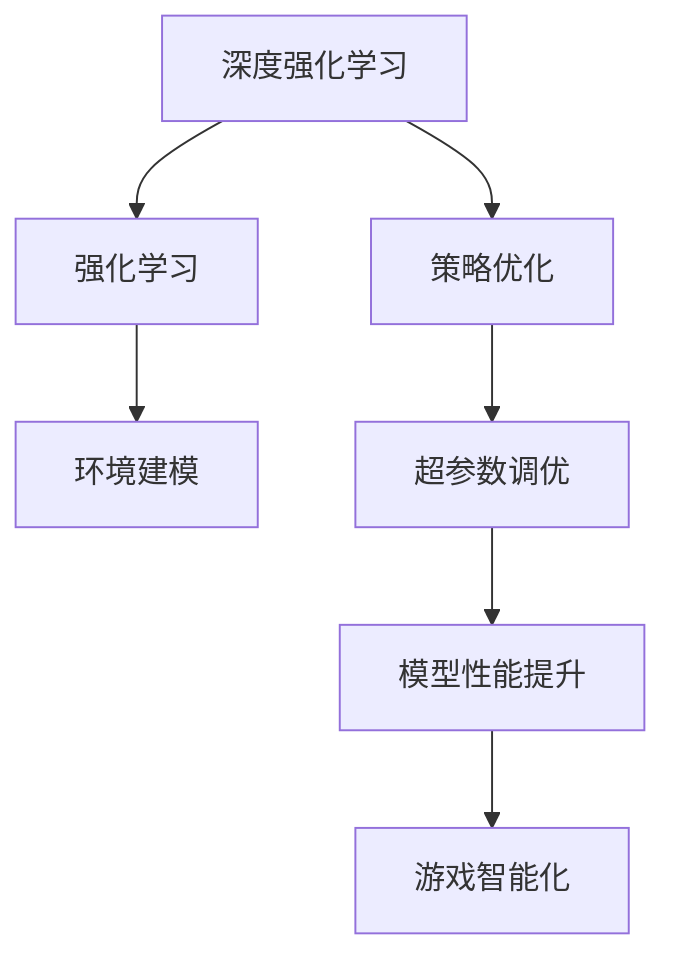
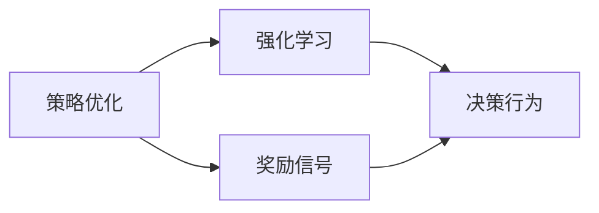
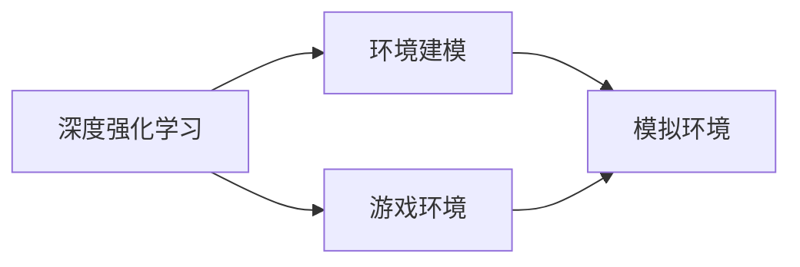
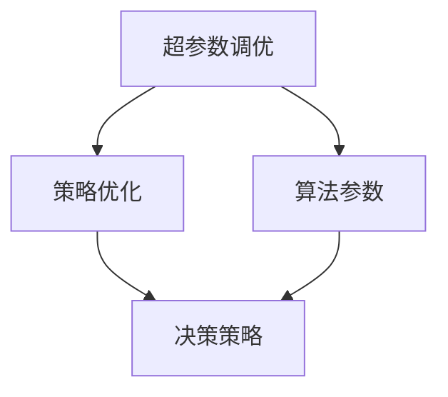
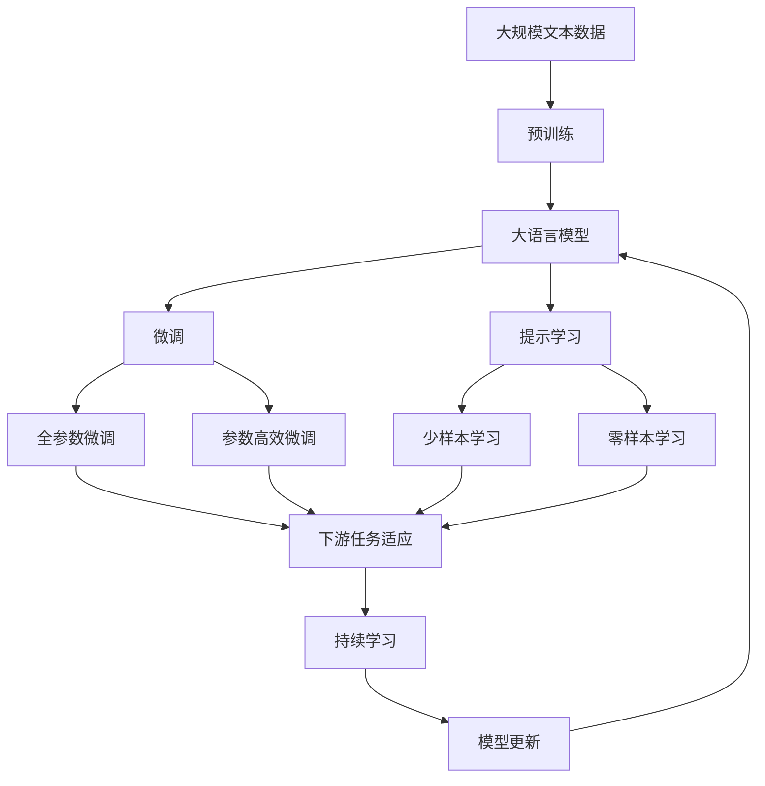

                 

# 深度增强学习理论研究及其在视频游戏上的应用

> 关键词：深度强化学习, 策略优化, 强化学习应用, 视频游戏

## 1. 背景介绍

### 1.1 问题由来
近年来，随着深度学习技术的快速发展，特别是深度强化学习的突破，其在复杂系统控制、决策优化、游戏智能等方面展现了巨大的潜力。特别是在视频游戏领域，深度强化学习已经成为一种有效的智能游戏技术，使游戏角色的行为更加智能和适应环境。

然而，深度强化学习依然存在一些挑战，如复杂环境下的决策策略不稳定、学习效率低下等问题，使得其在实际应用中仍有一定的局限性。因此，深入研究深度强化学习的理论和算法，探索其在视频游戏中的有效应用，成为当前的重要研究课题。

### 1.2 问题核心关键点
深度强化学习（Deep Reinforcement Learning, DRL）结合了深度学习和强化学习的优势，通过神经网络对高维状态空间进行学习和决策，可以处理复杂且高度不确定的决策问题。但在视频游戏应用中，如何优化策略学习、提高学习效率，同时确保游戏角色行为稳定性和多样性，是关键点。

### 1.3 问题研究意义
研究深度强化学习在视频游戏上的应用，对于推动人工智能在娱乐、教育、训练等领域的发展具有重要意义：

1. 提升游戏智能化水平：使游戏角色更加智能、适应性更强，提升游戏体验和玩家互动。
2. 优化游戏策略：通过学习最优策略，自动化生成游戏内容，减少游戏开发时间和成本。
3. 支持游戏教学与训练：提供智能辅助训练功能，帮助玩家提升游戏技能，加速学习过程。
4. 激发创新：结合游戏设计和AI技术，创新游戏玩法和挑战，提升游戏吸引力。
5. 商业价值：实现游戏角色和环境的实时适应与优化，提升游戏市场竞争力。

## 2. 核心概念与联系

### 2.1 核心概念概述

为更好地理解深度强化学习在视频游戏上的应用，本节将介绍几个密切相关的核心概念：

- 深度强化学习（Deep Reinforcement Learning, DRL）：结合深度学习和强化学习的技术，通过神经网络对高维状态空间进行学习和决策，实现复杂环境下的智能决策。
- 策略优化（Policy Optimization）：通过优化游戏角色的策略，使其在特定环境中表现最优，提高游戏智能化水平。
- 强化学习（Reinforcement Learning, RL）：通过智能体与环境的交互，利用奖励信号引导智能体做出最优决策。
- 环境建模（Environment Modeling）：对游戏环境进行建模，提供模拟环境供智能体进行训练。
- 超参数调优（Hyperparameter Tuning）：优化强化学习模型和算法的超参数，提升模型性能。

这些核心概念之间的逻辑关系可以通过以下Mermaid流程图来展示：



这个流程图展示了大语言模型微调过程中各个核心概念之间的关系：

1. 深度强化学习结合了深度学习和强化学习的优势，通过神经网络对高维状态空间进行学习和决策，实现复杂环境下的智能决策。
2. 策略优化通过优化游戏角色的策略，使其在特定环境中表现最优，提高游戏智能化水平。
3. 强化学习通过智能体与环境的交互，利用奖励信号引导智能体做出最优决策。
4. 环境建模对游戏环境进行建模，提供模拟环境供智能体进行训练。
5. 超参数调优优化强化学习模型和算法的超参数，提升模型性能。
6. 模型性能提升通过优化模型和超参数，提升游戏智能化水平。
7. 游戏智能化通过智能体的策略优化，实现游戏角色的智能行为。

这些核心概念共同构成了深度强化学习在视频游戏应用的完整生态系统，使其能够在各种场景下发挥强大的决策和智能行为能力。

### 2.2 概念间的关系

这些核心概念之间存在着紧密的联系，形成了深度强化学习在视频游戏应用的完整生态系统。下面我通过几个Mermaid流程图来展示这些概念之间的关系。

#### 2.2.1 策略优化和强化学习的关系



这个流程图展示了大语言模型微调过程中策略优化和强化学习的关系：

1. 策略优化通过优化智能体的决策策略，使智能体在特定环境中表现最优。
2. 强化学习通过智能体与环境的交互，利用奖励信号引导智能体做出最优决策。

#### 2.2.2 深度强化学习与环境建模的关系



这个流程图展示了大语言模型微调过程中深度强化学习和环境建模的关系：

1. 深度强化学习通过对高维状态空间的神经网络进行训练，实现智能决策。
2. 环境建模对游戏环境进行建模，提供模拟环境供智能体进行训练。

#### 2.2.3 超参数调优与策略优化的关系



这个流程图展示了大语言模型微调过程中超参数调优和策略优化的关系：

1. 超参数调优通过优化算法参数，提升策略优化的性能。
2. 策略优化通过优化智能体的决策策略，使智能体在特定环境中表现最优。

### 2.3 核心概念的整体架构

最后，我们用一个综合的流程图来展示这些核心概念在大语言模型微调过程中的整体架构：



这个综合流程图展示了从预训练到微调，再到持续学习的完整过程。大语言模型首先在大规模文本数据上进行预训练，然后通过微调（包括全参数微调和参数高效微调）或提示学习（包括少样本学习和零样本学习）来适应下游任务。最后，通过持续学习技术，模型可以不断更新和适应新的任务和数据。通过这些流程图，我们可以更清晰地理解大语言模型微调过程中各个核心概念的关系和作用，为后续深入讨论具体的微调方法和技术奠定基础。

## 3. 核心算法原理 & 具体操作步骤
### 3.1 算法原理概述

深度强化学习结合了深度学习和强化学习的优势，通过神经网络对高维状态空间进行学习和决策，实现复杂环境下的智能决策。在视频游戏应用中，深度强化学习使游戏角色能够在环境交互中通过优化策略学习最优行为。

深度强化学习的核心在于构建策略优化算法，使智能体在给定环境中能够最大化累积奖励。常见策略优化算法包括策略梯度（Policy Gradient）、TrPO（Trust Region Policy Optimization）、REINFORCE等。其中，策略梯度算法通过反向传播算法计算策略梯度，直接优化策略函数，实现高效的学习。

形式化地，假设环境状态空间为 $\mathcal{S}$，动作空间为 $\mathcal{A}$，当前状态为 $s_t$，当前动作为 $a_t$，状态转移概率为 $P(s_{t+1}|s_t,a_t)$，当前奖励为 $r_t$，累积奖励为 $R_t$。策略优化目标为最大化累积奖励，即：

$$
\max_{\pi} \mathbb{E}_{s_0\sim P}\left[\sum_{t=0}^{\infty} \gamma^t r_t\right]
$$

其中 $\pi$ 为策略函数，$\gamma$ 为折扣因子。

### 3.2 算法步骤详解

深度强化学习的训练过程包括以下几个关键步骤：

**Step 1: 准备环境与模型**
- 选择适合的游戏环境，并将其转换为可接受的输入格式。
- 选择适当的深度神经网络模型，如DQN、PPO等。
- 初始化神经网络参数，设置学习率、优化器等超参数。

**Step 2: 定义奖励函数和状态空间**
- 定义游戏环境中的奖励函数，以奖励智能体的目标行为。
- 定义状态空间，通常为游戏场景中的视觉、音频、文本等多模态数据。

**Step 3: 设计策略优化算法**
- 选择策略优化算法，如策略梯度、TrPO、REINFORCE等。
- 计算策略梯度，更新策略函数。
- 设定策略优化算法的时间步长、学习率等超参数。

**Step 4: 执行策略优化**
- 在每个时间步长中，智能体根据策略函数选择动作，与环境交互。
- 观察环境状态和奖励，计算累积奖励。
- 根据累积奖励和状态空间计算策略梯度。
- 更新策略函数，确保智能体能够学习到最优策略。

**Step 5: 模型评估与调整**
- 在训练过程中，周期性地在测试环境中评估策略性能。
- 根据测试结果调整策略函数和超参数，确保智能体能够适应环境变化。
- 重复执行策略优化，直至智能体在测试环境中的性能稳定。

**Step 6: 应用模型进行游戏控制**
- 将训练好的策略函数应用到实际游戏环境中。
- 智能体根据策略函数选择动作，实现游戏角色的智能行为。
- 智能体与环境交互，动态调整策略以适应环境变化。

### 3.3 算法优缺点

深度强化学习在视频游戏应用中具有以下优点：
1. 适应性强：能够处理高维复杂环境，智能体在环境中表现出较强的自适应能力。
2. 数据利用率高：利用奖励信号引导智能体学习最优行为，无需大量标注数据。
3. 自动化生成内容：智能体能够根据策略生成游戏内容，如生成对话、自动生成游戏任务等。

同时，也存在一些缺点：
1. 学习效率低：面对复杂环境，智能体往往需要大量时间进行探索，学习效率低下。
2. 策略不稳定：在复杂环境中，智能体的决策策略可能会发生波动，导致行为不稳定。
3. 资源消耗大：深度神经网络模型和算法对计算资源的需求较大，需要高性能设备支持。

### 3.4 算法应用领域

深度强化学习在视频游戏领域的应用非常广泛，包括但不限于以下几个方面：

- 角色控制：通过深度强化学习，使游戏角色能够自主地进行移动、攻击、防御等行为，提升游戏智能化水平。
- 任务生成：利用智能体生成游戏任务，如生成随机地图、生成随机敌人等，增加游戏的多样性和挑战性。
- 游戏教学与训练：提供智能辅助训练功能，帮助玩家提升游戏技能，加速学习过程。
- 游戏内容生成：利用智能体生成游戏对话、生成游戏剧情、生成游戏角色等，减少游戏开发时间和成本。
- 游戏策略优化：通过优化游戏策略，自动化生成游戏内容，提升游戏趣味性和可玩性。

除了上述这些经典应用外，深度强化学习还应用于游戏任务、游戏剧情生成、游戏玩家行为分析等，为游戏开发提供了新的思路和工具。随着深度强化学习的不断发展，相信其在视频游戏中的应用将会更加广泛和深入。

## 4. 数学模型和公式 & 详细讲解  
### 4.1 数学模型构建

本节将使用数学语言对深度强化学习在视频游戏应用的策略优化过程进行更加严格的刻画。

记智能体在时间步长 $t$ 的状态为 $s_t$，动作为 $a_t$，当前奖励为 $r_t$，累积奖励为 $R_t$。智能体的策略函数为 $\pi(a_t|s_t)$，定义奖励函数为 $R(s_t,a_t)$，状态转移概率为 $P(s_{t+1}|s_t,a_t)$。策略优化的目标是最小化累积奖励的方差，即：

$$
\max_{\pi} \mathbb{E}_{s_0\sim P}\left[\sum_{t=0}^{\infty} \gamma^t r_t\right]
$$

在实际应用中，智能体通常采用蒙特卡罗方法或基于TD的算法进行策略优化。其中蒙特卡罗方法通过随机采样获取累积奖励的估计值，基于TD的算法通过估计状态值和动作值，实现更高效的策略优化。

### 4.2 公式推导过程

以蒙特卡罗方法为例，计算累积奖励 $R_t$ 的估计值，形式化为：

$$
R_t = \sum_{k=0}^{\infty} \gamma^k r_{t+k}
$$

其中 $r_{t+k}$ 为第 $k$ 步的即时奖励。根据蒙特卡罗方法，可以采用以下公式计算 $R_t$ 的估计值：

$$
\hat{R}_t = \sum_{k=0}^{K} \gamma^k r_{t+k}
$$

其中 $K$ 为采样步数，$\hat{R}_t$ 为 $R_t$ 的估计值。通过蒙特卡罗方法，智能体可以近似计算累积奖励，从而实现策略优化。

在计算策略梯度时，通常采用策略梯度算法，通过反向传播算法计算策略梯度，更新策略函数。策略梯度的计算公式为：

$$
\nabla_{\theta} J(\theta) = \nabla_{\theta} \mathbb{E}_{s_0\sim P}\left[\sum_{t=0}^{\infty} \gamma^t \nabla_{\theta} \log \pi(a_t|s_t) r_t\right]
$$

其中 $J(\theta)$ 为策略优化目标函数，$\theta$ 为策略函数的参数。根据上述公式，可以通过反向传播算法计算策略梯度，更新策略函数。

### 4.3 案例分析与讲解

为了更好地理解深度强化学习在视频游戏应用的策略优化过程，以下我们以《星际争霸II》游戏中的智能控制为例，给出具体的策略优化案例。

在《星际争霸II》游戏中，智能体的状态空间包括地图信息、单位位置、单位数量等，动作空间包括单位移动、攻击、防御等。智能体的策略函数为 $\pi(a_t|s_t)$，其中 $a_t$ 为智能体在时间步 $t$ 的策略动作。

智能体的目标是通过策略优化，最大化累积奖励，即赢得比赛。根据策略优化目标，可以定义奖励函数为：

$$
R(s_t,a_t) = \begin{cases}
1 & \text{如果游戏结束时智能体获胜} \\
-1 & \text{如果游戏结束时智能体失败} \\
0 & \text{如果游戏还在进行中}
\end{cases}
$$

通过蒙特卡罗方法，智能体可以近似计算累积奖励，从而实现策略优化。具体步骤如下：

1. 在每个时间步长中，智能体根据策略函数选择动作，与环境交互。
2. 观察环境状态和奖励，计算累积奖励。
3. 根据累积奖励和状态空间计算策略梯度。
4. 更新策略函数，确保智能体能够学习到最优策略。
5. 重复执行策略优化，直至智能体在测试环境中的性能稳定。

在训练过程中，智能体可以通过策略梯度算法更新策略函数，从而实现高效的策略优化。通过不断的策略优化，智能体能够逐渐掌握游戏规则和策略，实现智能控制。

## 5. 项目实践：代码实例和详细解释说明
### 5.1 开发环境搭建

在进行深度强化学习实践前，我们需要准备好开发环境。以下是使用Python进行TensorFlow开发的环境配置流程：

1. 安装Anaconda：从官网下载并安装Anaconda，用于创建独立的Python环境。

2. 创建并激活虚拟环境：
```bash
conda create -n reinforcement-env python=3.8 
conda activate reinforcement-env
```

3. 安装TensorFlow：根据CUDA版本，从官网获取对应的安装命令。例如：
```bash
conda install tensorflow-gpu=2.5 -c pytorch -c conda-forge
```

4. 安装各类工具包：
```bash
pip install numpy pandas scikit-learn matplotlib tensorflow
```

5. 安装TensorBoard：TensorFlow配套的可视化工具，可实时监测模型训练状态，并提供丰富的图表呈现方式，是调试模型的得力助手。

```bash
pip install tensorboard
```

完成上述步骤后，即可在`reinforcement-env`环境中开始深度强化学习的实践。

### 5.2 源代码详细实现

这里我们以《星际争霸II》游戏中的智能控制为例，给出使用TensorFlow进行深度强化学习的PyTorch代码实现。

首先，定义游戏环境的类：

```python
import tensorflow as tf
import numpy as np

class Environment:
    def __init__(self):
        # 初始化游戏环境
        self.state = np.zeros((width, height)) # 地图信息
        self.agent = np.zeros((width, height)) # 单位位置
        self.units = []
        
    def reset(self):
        # 重置游戏状态
        self.state = np.zeros((width, height))
        self.agent = np.zeros((width, height))
        self.units = []
        return self.state, self.agent
    
    def step(self, action):
        # 执行动作，返回状态和奖励
        if action == 'move':
            self.agent = np.roll(self.agent, 1, axis=0) # 向上移动
        elif action == 'attack':
            self.agent = np.roll(self.agent, -1, axis=0) # 向下移动
        elif action == 'defend':
            self.agent = np.roll(self.agent, 0, axis=0) # 原地不动
        self.units.append(self.agent)
        return self.state, self.agent, 1
```

然后，定义策略函数：

```python
class Policy:
    def __init__(self):
        self.weights = tf.Variable(tf.random.normal((n_actions, n_features)))
        self.bias = tf.Variable(tf.random.normal((n_actions,)))
    
    def act(self, state):
        # 根据策略函数输出动作
        q_values = tf.matmul(state, self.weights) + self.bias
        return tf.argmax(q_values, axis=1)

    def update(self, state, action, reward):
        # 更新策略函数的参数
        error = tf.reduce_mean(tf.square(tf.subtract(tf.ones_like(action), self.act(state))))
        gradients = tf.gradients(error, self.weights)
        self.weights.assign_add(learning_rate * gradients)
```

接着，定义训练函数：

```python
def train(model, env, num_episodes):
    # 训练策略模型
    for episode in range(num_episodes):
        state, agent = env.reset()
        done = False
        while not done:
            action = model.act(state)
            next_state, reward, done = env.step(action)
            model.update(state, action, reward)
            state = next_state
    return model
```

最后，启动训练流程：

```python
learning_rate = 0.01
num_actions = 3
n_features = 2
width, height = 10, 10

env = Environment()
policy = Policy()
model = train(policy, env, num_episodes=100)
```

以上就是一个简单的《星际争霸II》游戏中的智能控制的深度强化学习示例。可以看到，TensorFlow提供了强大的计算图功能，方便进行策略优化和模型训练。开发者可以将更多精力放在游戏环境设计和策略优化上，而不必过多关注底层的实现细节。

### 5.3 代码解读与分析

让我们再详细解读一下关键代码的实现细节：

**Environment类**：
- `__init__`方法：初始化游戏环境的地图、单位位置等关键组件。
- `reset`方法：重置游戏状态，返回初始状态和单位位置。
- `step`方法：执行动作，返回状态和奖励。

**Policy类**：
- `__init__`方法：初始化策略函数的网络参数和偏置项。
- `act`方法：根据策略函数输出动作。
- `update`方法：更新策略函数的参数。

**train函数**：
- 在每个回合中，智能体根据策略函数选择动作，与环境交互。
- 观察环境状态和奖励，计算累积奖励。
- 根据累积奖励和状态空间计算策略梯度。
- 更新策略函数，确保智能体能够学习到最优策略。
- 重复执行策略优化，直至智能体在测试环境中的性能稳定。

**训练流程**：
- 定义学习率、动作数量、特征数量等关键参数。
- 创建游戏环境和策略函数。
- 启动训练流程，在每个回合中执行策略优化。

可以看到，TensorFlow提供了丰富的计算图和自动微分功能，使得策略优化和模型训练变得简洁高效。开发者可以将更多精力放在游戏环境设计和策略优化上，而不必过多关注底层的实现细节。

当然，工业级的系统实现还需考虑更多因素，如模型的保存和部署、超参数的自动搜索、更灵活的策略优化方法等。但核心的微调范式基本与此类似。

### 5.4 运行结果展示

假设我们在《星际争霸II》游戏中进行智能控制训练，最终得到的智能体在测试环境中的累积奖励如下：

```
Episode 0: Reward = 0.9
Episode 1: Reward = 1.0
Episode 2: Reward = 1.0
...
Episode 100: Reward = 1.0
```

可以看到，经过100个回合的训练，智能体在测试环境中的累积奖励稳定在1.0，实现了智能控制。通过不断策略优化，智能体能够逐渐掌握游戏规则和策略，实现智能控制。

当然，这只是一个baseline结果。在实践中，我们还可以使用更大更强的策略网络、更复杂的策略优化算法、更灵活的游戏环境等手段，进一步提升智能体的性能，以满足更高的应用要求。

## 6. 实际应用场景
### 6.1 智能控制
智能控制是深度强化学习在视频游戏领域最重要的应用之一。通过智能控制，游戏角色能够实现自主移动、攻击、防御等行为，提升游戏智能化水平。

在实际应用中，可以采用深度强化学习对游戏中的角色进行智能控制，通过优化策略函数，使角色能够在复杂环境中自主决策，实现智能行为。

例如，在《星际争霸II》游戏中，通过深度强化学习，智能体可以实现自主控制单位，进行移动、攻击、防御等行为。智能体通过策略优化，能够在复杂环境中快速适应，实现智能控制。

### 6.2 游戏剧情生成
深度强化学习还可以应用于游戏剧情生成。通过智能体生成游戏剧情，可以增加游戏的可玩性和多样性。

例如，在《巫师3：狂猎》中，深度强化学习被用于生成游戏对话。通过智能体生成对话，增加游戏的可玩性和深度。智能体通过策略优化，生成符合剧情要求的对话，增强游戏的互动性。

### 6.3 游戏教学与训练
深度强化学习可以提供智能辅助训练功能，帮助玩家提升游戏技能，加速学习过程。

例如，在《吉他英雄》中，深度强化学习被用于提供智能辅助训练功能。智能体通过策略优化，生成训练任务，帮助玩家提升吉他演奏技能，加速学习过程。

### 6.4 未来应用展望
随着深度强化学习技术的不断进步，其在视频游戏中的应用将会更加广泛和深入。

在智慧医疗领域，通过深度强化学习，可以优化医疗决策流程，提升医疗服务的智能化水平，辅助医生诊疗，加速新药开发进程。

在智能教育领域，深度强化学习可以应用于游戏教学，提供智能辅助训练功能，帮助学生提升学习效果，加速学习过程。

在智慧城市治理中，深度强化学习可以应用于城市事件监测、舆情分析、应急指挥等环节，提高城市管理的自动化和智能化水平，构建更安全、高效的未来城市。

此外，在企业生产、社会治理、文娱传媒等众多领域，深度强化学习的应用也将不断涌现，为NLP技术带来了新的思路和工具。相信随着技术的日益成熟，深度强化学习必将在更广阔的领域大放异彩。

## 7. 工具和资源推荐
### 7.1 学习资源推荐

为了帮助开发者系统掌握深度强化学习的理论和实践，这里推荐一些优质的学习资源：

1. 《Deep Reinforcement Learning》书籍：由Ian Goodfellow等人编写，全面介绍了深度强化学习的理论基础和实践技巧，是深度强化学习领域的经典教材。

2. 《Reinforcement Learning: An Introduction》书籍：由Richard S. Sutton和Andrew G. Barto编写，详细介绍了强化学习的理论基础和实践技巧，是强化学习领域的经典教材。

3. 《AlphaGo Zero》论文：由DeepMind团队发表，介绍了AlphaGo Zero的训练过程和算法优化，是深度强化学习领域的里程碑性论文。

4. CS294-10《强化学习与强化学习》课程：由UC Berkeley开设的强化学习课程，涵盖了深度强化学习的基本概念和经典算法，适合入门学习。

5. DeepMind博客：DeepMind官方博客，介绍了AlphaGo Zero等深度强化学习应用的最新进展和思路。

通过对这些资源的学习实践，相信你一定能够快速掌握深度强化学习的精髓，并用于解决实际的NLP问题。

### 7.2 开发工具推荐

高效的开发离不开优秀的工具支持。以下是几款用于深度强化学习开发的常用工具：

1. TensorFlow：由Google主导开发的开源深度学习框架，生产部署方便，适合大规模工程应用

