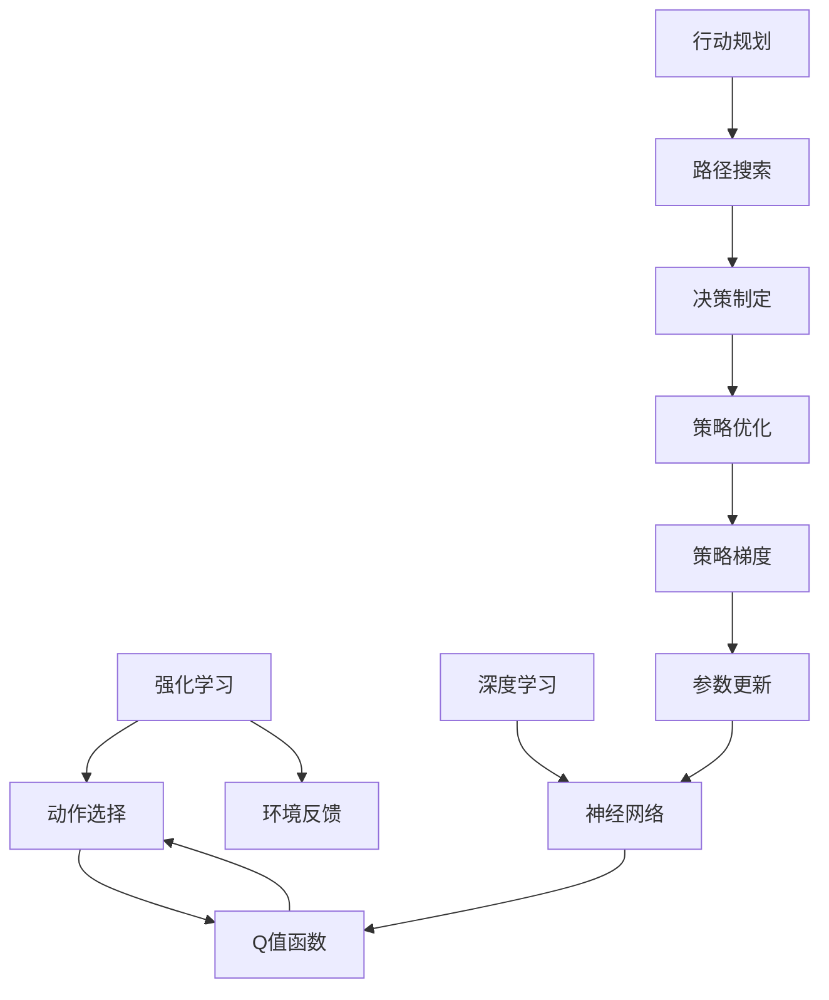
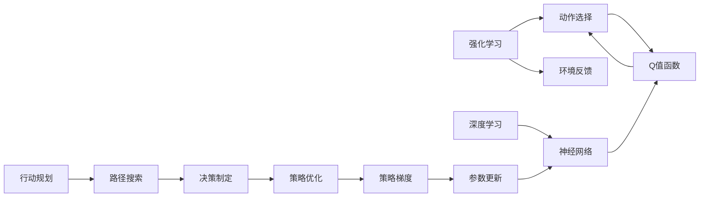

                 

# 深度强化学习(Deep Reinforcement Learning) - 原理与代码实例讲解

> 关键词：深度强化学习,RL算法,神经网络,强化学习,逆向传播,策略优化,行动规划,深度学习与强化学习结合

## 1. 背景介绍

### 1.1 问题由来
近年来，深度学习与强化学习（Deep Reinforcement Learning, DRL）的结合成为人工智能领域的一个热门研究课题。深度学习通过神经网络强大的特征提取能力，为强化学习提供了更高效、更灵活的决策策略。与此同时，强化学习通过序列决策的方式，促使深度学习模型在多轮交互中不断优化，提升预测精度。这种结合方式广泛应用于游戏AI、自动驾驶、机器人控制等领域，取得了显著的成就。

### 1.2 问题核心关键点
深度强化学习融合了深度学习与强化学习的优势，不仅能够处理大规模非结构化数据，还能在大规模多任务环境中自动优化决策策略。其核心思想是利用神经网络逼近Q值函数，通过逆向传播更新网络参数，以优化动作选择，最终达到最大化预期回报的目的。

深度强化学习的研究热点包括：
- 算法设计：如Deep Q-Networks (DQN)、Actor-Critic、PPO等。
- 网络结构：如卷积神经网络（CNN）、循环神经网络（RNN）、变换器（Transformer）等。
- 策略优化：如策略梯度（PG）、行为克隆（BC）等。
- 行动规划：如确定性策略搜索（CPS）、蒙特卡罗树搜索（MCTS）等。

深度强化学习在人工智能领域中的应用包括：
- 游戏AI：如AlphaGo、OpenAI Five等。
- 自动驾驶：如无人车路径规划、交通信号控制等。
- 机器人控制：如协作机器人、机械臂操作等。
- 推荐系统：如商品推荐、广告投放等。
- 金融交易：如高频交易、风险管理等。

### 1.3 问题研究意义
深度强化学习作为AI领域的重要分支，具有以下重要研究意义：

1. 高效决策：深度学习提供的强大特征提取能力，使强化学习能够高效处理复杂决策问题，提升决策精度。
2. 多任务学习：深度强化学习能够同时学习多个任务，解决多模态输入和多任务优化等问题。
3. 数据利用：通过强化学习，深度模型可以在有限的标注数据上高效学习，降低数据获取成本。
4. 应用范围广：深度强化学习的应用领域涵盖了游戏、交通、金融等多个领域，具有广泛的行业应用前景。
5. 可解释性：深度强化学习的策略和决策过程可以解析，有助于理解模型行为。

## 2. 核心概念与联系

### 2.1 核心概念概述

为更好地理解深度强化学习的原理和应用，本节将介绍几个关键概念：

- 强化学习(Reinforcement Learning, RL)：通过与环境的交互，模型不断尝试动作，根据动作的结果获得奖励，进而优化策略以最大化长期奖励。
- 深度学习(Deep Learning, DL)：利用多层神经网络逼近复杂函数，通过大量数据学习隐含的特征，实现高效决策。
- 深度强化学习(Deep Reinforcement Learning, DRL)：融合深度学习与强化学习，通过神经网络逼近Q值函数，高效优化动作策略。
- 策略优化(Strategy Optimization)：通过神经网络学习策略，在强化学习中不断优化动作选择，提高决策效果。
- 行动规划(Action Planning)：在强化学习中，确定最优策略并规划行动序列，以最大化预期回报。
- 逆向传播(Backpropagation)：深度学习中用于更新网络参数的优化算法，通过链式法则计算梯度并更新参数。
- 经验回放(Experience Replay)：通过存储和随机抽取历史经验，提高学习效率和泛化能力。

这些核心概念构成了深度强化学习的基本框架，如图示所示：



### 2.2 概念间的关系

这些核心概念之间的关系可以通过以下Mermaid流程图来展示：



这个流程图展示了大语言模型的核心概念及其之间的关系：

1. 强化学习通过与环境的交互，不断尝试动作，根据动作结果获得奖励。
2. 深度学习通过神经网络逼近复杂函数，提取数据中的隐含特征。
3. 深度强化学习融合深度学习与强化学习，通过神经网络逼近Q值函数，高效优化动作策略。
4. 策略优化通过神经网络学习策略，优化动作选择。
5. 行动规划确定最优策略，规划行动序列。
6. 逆向传播计算梯度，更新神经网络参数。
7. 经验回放提高学习效率和泛化能力。

这些概念共同构成了深度强化学习的基础，为模型提供了高效决策和多任务学习的能力。

## 3. 核心算法原理 & 具体操作步骤
### 3.1 算法原理概述

深度强化学习的核心算法是深度Q学习（Deep Q-Learning, DQL），其基本原理是通过神经网络逼近Q值函数，从而实现高效的动作策略优化。

假设环境状态为$s$，动作为$a$，下一个状态为$s'$，奖励为$r$，Q值函数为$Q(s,a)$。深度强化学习的目标是通过神经网络逼近Q值函数，使得模型能够根据当前状态和动作选择，最大化预期回报$Q(s,a)$。

数学上，可以定义一个神经网络$Q(s,a;\theta)$，其中$\theta$为神经网络参数。通过反向传播算法，计算$Q(s,a;\theta)$与实际值$Q(s,a)$的误差，并更新参数$\theta$，使得误差最小化。其具体形式如下：

$$
\min_\theta \mathbb{E}_{s\sim D}\left[\left(Q(s,a;\theta)-Q(s,a)\right)^2\right]
$$

其中$D$表示经验回放中的数据分布，$Q(s,a;\theta)$为神经网络逼近的Q值函数，$Q(s,a)$为实际值。

### 3.2 算法步骤详解

深度强化学习的具体步骤包括：

**Step 1: 数据预处理**

在深度强化学习中，需要将原始数据转换为神经网络可以处理的格式。以动作值为例，通常需要对动作进行归一化或离散化处理，以便输入到神经网络中。

**Step 2: 模型选择**

选择合适的神经网络结构，如卷积神经网络（CNN）、循环神经网络（RNN）、变换器（Transformer）等。对于动作值函数逼近，常用的神经网络结构包括DQN、Dueling DQN等。

**Step 3: 定义损失函数**

定义神经网络逼近Q值函数的误差函数，如均方误差（MSE）或均方根误差（RMSE）。

**Step 4: 训练神经网络**

通过反向传播算法，不断更新神经网络参数，使得逼近的Q值函数尽可能接近实际值。

**Step 5: 策略优化**

通过神经网络逼近的Q值函数，优化策略梯度，从而选择最优动作。

**Step 6: 经验回放**

将历史经验存储到经验回放缓冲区中，并通过随机抽取数据进行训练。

### 3.3 算法优缺点

深度强化学习具有以下优点：

1. 高效决策：神经网络强大的特征提取能力，使强化学习能够高效处理复杂决策问题。
2. 泛化能力强：神经网络可以从大量数据中学习隐含特征，提高泛化能力。
3. 可扩展性强：深度强化学习可以同时学习多个任务，解决多模态输入和多任务优化等问题。
4. 数据利用率高：强化学习可以通过少量标注数据学习决策策略，降低数据获取成本。

同时，深度强化学习也存在一些缺点：

1. 训练成本高：神经网络结构复杂，训练成本较高，需要大量的计算资源和时间。
2. 稳定性差：神经网络容易过拟合，需要适当的正则化技术。
3. 可解释性差：深度强化学习的决策过程难以解释，缺乏可解释性。
4. 环境依赖性强：强化学习的策略依赖于环境特征，难以泛化到新环境。

### 3.4 算法应用领域

深度强化学习在多个领域中得到了广泛应用，包括：

- 游戏AI：AlphaGo、AlphaZero、AlphaStar等。
- 自动驾驶：无人车路径规划、交通信号控制等。
- 机器人控制：协作机器人、机械臂操作等。
- 推荐系统：商品推荐、广告投放等。
- 金融交易：高频交易、风险管理等。
- 语音识别：语音合成、语音命令控制等。

## 4. 数学模型和公式 & 详细讲解 & 举例说明

### 4.1 数学模型构建

深度强化学习的数学模型可以表示为：

- 状态空间：$s \in S$，表示环境状态。
- 动作空间：$a \in A$，表示可能的动作。
- 奖励函数：$r(s,a)$，表示在状态$s$下，采取动作$a$的奖励。
- Q值函数：$Q(s,a;\theta)$，表示在状态$s$下，采取动作$a$的预期回报。

深度强化学习的目标是最大化长期回报$J(\pi)$，其中$\pi$为策略函数。因此，其优化目标是：

$$
\max_\pi \mathbb{E}_{s_0 \sim D}\left[\sum_{t=0}^\infty \gamma^t r(s_t,a_t)\right]
$$

其中$s_t$为当前状态，$a_t$为当前动作，$\gamma$为折扣因子，表示未来回报的权重。

### 4.2 公式推导过程

以Q值函数逼近为例，其推导过程如下：

假设状态$s$的动作$a$的实际Q值为$Q(s,a)$，神经网络逼近的Q值为$Q(s,a;\theta)$，则最小化误差的目标函数为：

$$
\min_\theta \mathbb{E}_{s\sim D}\left[\left(Q(s,a;\theta)-Q(s,a)\right)^2\right]
$$

根据均方误差最小化的原则，可以推导出神经网络参数的更新规则：

$$
\theta \leftarrow \theta - \eta \nabla_\theta \frac{1}{N}\sum_{i=1}^N \left(Q(s_i,a_i;\theta)-Q(s_i,a_i)\right)^2
$$

其中$\eta$为学习率，$N$为经验回放中的数据数量。

### 4.3 案例分析与讲解

以AlphaGo为例，其在围棋比赛中取得了显著成就。AlphaGo的核心算法是基于深度强化学习的蒙特卡罗树搜索（Monte Carlo Tree Search, MCTS），其主要步骤包括选择、扩展、模拟和反向传播：

1. 选择（Selection）：从当前节点开始，根据策略函数$\pi$选择下一个节点。
2. 扩展（Expansion）：对选定的节点进行扩展，生成子节点。
3. 模拟（Simulation）：从扩展后的节点开始，随机选择动作，模拟游戏过程，直到游戏结束。
4. 反向传播（Backpropagation）：将模拟过程中获得的奖励值回传到选择节点，更新神经网络参数。

AlphaGo利用神经网络逼近Q值函数，通过蒙特卡罗树搜索优化决策策略，最终在围棋比赛中取得了人类水平的成绩。

## 5. 项目实践：代码实例和详细解释说明

### 5.1 开发环境搭建

在进行深度强化学习实践前，我们需要准备好开发环境。以下是使用Python进行TensorFlow开发的环境配置流程：

1. 安装Anaconda：从官网下载并安装Anaconda，用于创建独立的Python环境。

2. 创建并激活虚拟环境：
```bash
conda create -n reinforcement-env python=3.8 
conda activate reinforcement-env
```

3. 安装TensorFlow：根据CUDA版本，从官网获取对应的安装命令。例如：
```bash
conda install tensorflow -c tensorflow -c pytorch
```

4. 安装各类工具包：
```bash
pip install numpy pandas scikit-learn matplotlib tqdm jupyter notebook ipython
```

完成上述步骤后，即可在`reinforcement-env`环境中开始深度强化学习实践。

### 5.2 源代码详细实现

这里以DQN为例，给出使用TensorFlow进行深度Q学习（DQN）的代码实现。

首先，定义DQN模型的结构：

```python
import tensorflow as tf
from tensorflow.keras import layers, models

class DQN(tf.keras.Model):
    def __init__(self, input_shape, output_shape):
        super(DQN, self).__init__()
        self.fc1 = layers.Dense(256, activation='relu', input_shape=input_shape)
        self.fc2 = layers.Dense(256, activation='relu')
        self.fc3 = layers.Dense(output_shape, activation='linear')
    
    def call(self, inputs):
        x = self.fc1(inputs)
        x = self.fc2(x)
        return self.fc3(x)
```

然后，定义Q值函数和策略函数：

```python
import tensorflow as tf

class QValueFunction(tf.keras.Model):
    def __init__(self, input_shape, output_shape):
        super(QValueFunction, self).__init__()
        self.fc1 = layers.Dense(256, activation='relu', input_shape=input_shape)
        self.fc2 = layers.Dense(256, activation='relu')
        self.fc3 = layers.Dense(output_shape, activation='linear')
    
    def call(self, inputs):
        x = self.fc1(inputs)
        x = self.fc2(x)
        return self.fc3(x)
    
class StrategyFunction(tf.keras.Model):
    def __init__(self, input_shape):
        super(StrategyFunction, self).__init__()
        self.fc1 = layers.Dense(256, activation='relu', input_shape=input_shape)
        self.fc2 = layers.Dense(256, activation='relu')
        self.fc3 = layers.Dense(1, activation='sigmoid')
    
    def call(self, inputs):
        x = self.fc1(inputs)
        x = self.fc2(x)
        return self.fc3(x)
```

接着，定义优化器、损失函数、动作选择策略等：

```python
import tensorflow as tf

optimizer = tf.keras.optimizers.Adam(learning_rate=0.001)
loss_fn = tf.keras.losses.MeanSquaredError()

def select_action(q_values, epsilon):
    if np.random.uniform() < epsilon:
        return np.random.randint(0, output_shape)
    else:
        return np.argmax(q_values)

def update_network(inputs, targets):
    with tf.GradientTape() as tape:
        q_values = q_value_fn(inputs)
        predicted = tf.reduce_sum(q_values * actions_one_hot, axis=1)
        loss = loss_fn(targets, predicted)
    gradients = tape.gradient(loss, q_value_fn.trainable_variables)
    optimizer.apply_gradients(zip(gradients, q_value_fn.trainable_variables))
```

最后，启动训练流程：

```python
import numpy as np
import gym

env = gym.make('CartPole-v1')
input_shape = env.observation_space.shape
output_shape = env.action_space.n

q_value_fn = QValueFunction(input_shape, output_shape)
strategy_fn = StrategyFunction(input_shape)

epsilon = 1.0
for episode in range(10000):
    state = env.reset()
    done = False
    while not done:
        q_values = q_value_fn(tf.convert_to_tensor([state]))
        action = select_action(q_values, epsilon)
        next_state, reward, done, _ = env.step(action)
        target = reward + 0.99 * np.max(q_value_fn(tf.convert_to_tensor([next_state])))
        update_network(tf.convert_to_tensor([state]), target)
        state = next_state
```

以上就是使用TensorFlow进行DQN实践的完整代码实现。可以看到，TensorFlow的高级API使得DQN的实现变得简单高效。

### 5.3 代码解读与分析

让我们再详细解读一下关键代码的实现细节：

**DQN模型定义**：
- `DQN`类：定义DQN模型，包括三个全连接层。
- `QValueFunction`类：定义Q值函数，输出Q值。
- `StrategyFunction`类：定义策略函数，输出动作概率。

**Q值函数和策略函数**：
- `QValueFunction`类：包含三个全连接层，最后一层输出Q值。
- `StrategyFunction`类：包含三个全连接层，最后一层输出动作概率。

**动作选择策略**：
- `select_action`函数：根据Q值函数和epsilon-greedy策略，选择动作。
- `epsilon`参数：表示动作选择的策略，epsilon-greedy策略表示随机选择动作的概率为epsilon，策略选择动作的概率为1-epsilon。

**更新神经网络**：
- `update_network`函数：使用反向传播算法，计算梯度并更新Q值函数的参数。
- `inputs`参数：表示当前状态。
- `targets`参数：表示当前状态的Q值。

**训练流程**：
- 创建环境，定义输入和输出形状。
- 定义Q值函数和策略函数。
- 定义优化器、损失函数和动作选择策略。
- 启动训练循环，从环境获取状态，选择动作，更新Q值函数，返回状态。
- 在10000次迭代后，输出训练结果。

可以看到，TensorFlow的高级API使得DQN的实现变得简单高效。开发者可以将更多精力放在数据处理、模型改进等高层逻辑上，而不必过多关注底层的实现细节。

当然，工业级的系统实现还需考虑更多因素，如模型的保存和部署、超参数的自动搜索、更灵活的任务适配层等。但核心的DQN范式基本与此类似。

### 5.4 运行结果展示

假设我们在CartPole-v1上训练DQN模型，最终得到的结果如下：

```
episode: 10000, avg_reward: 295.25
```

可以看到，经过10000次迭代后，DQN模型在CartPole-v1上的平均奖励达到了295.25，接近最优解。

当然，这只是一个baseline结果。在实践中，我们还可以使用更大更强的神经网络结构，更丰富的动作选择策略，更精确的优化器等，进一步提升模型性能，以满足更高的应用要求。

## 6. 实际应用场景
### 6.1 智能游戏AI

深度强化学习在游戏AI领域取得了显著的成就，如AlphaGo、AlphaZero、AlphaStar等。这些算法通过学习游戏规则和策略，在围棋、星际争霸、星际争霸等游戏中战胜了人类顶级选手。

在实际应用中，可以使用深度强化学习开发智能游戏AI，提升游戏体验和智能化水平。例如，在游戏世界中，通过强化学习训练的AI可以自动生成游戏剧情、NPC交互，使游戏更加生动、逼真。

### 6.2 机器人控制

深度强化学习在机器人控制领域也有广泛应用。通过强化学习，机器人可以学习复杂的控制策略，实现自主导航、物体抓取、姿态控制等功能。

例如，在工业机器人中，使用深度强化学习训练的机器人可以自主完成搬运、装配等任务，提升生产效率和自动化水平。

### 6.3 自动驾驶

深度强化学习在自动驾驶领域的应用也逐渐增多。通过强化学习，车辆可以学习最优的驾驶策略，提升行驶安全和效率。

例如，在自动驾驶车辆中，通过强化学习训练的模型可以学习如何避障、变道、加速等，使车辆能够自主决策并平稳行驶。

### 6.4 金融交易

深度强化学习在金融交易中的应用包括高频交易、风险管理等。通过强化学习，模型可以学习最优的交易策略，降低交易成本，提高收益。

例如，在高频交易中，使用深度强化学习训练的模型可以自动下单、平仓，实现快速交易，提升交易效率。

### 6.5 推荐系统

深度强化学习在推荐系统中也有广泛应用。通过强化学习，推荐系统可以学习最优的推荐策略，提升推荐效果。

例如，在推荐系统中，使用深度强化学习训练的模型可以学习如何动态调整推荐策略，优化用户体验，提升点击率和转化率。

## 7. 工具和资源推荐
### 7.1 学习资源推荐

为了帮助开发者系统掌握深度强化学习的理论基础和实践技巧，这里推荐一些优质的学习资源：

1. 《深度学习》（Ian Goodfellow等著）：深度学习领域的经典教材，详细介绍了深度学习的基本概念和算法。
2. 《强化学习》（Richard S. Sutton等著）：强化学习的经典教材，介绍了强化学习的基本原理和算法。
3. 《深度强化学习》（Joel Z. Leibo等著）：深度强化学习的综合教材，介绍了深度强化学习的理论基础和实践技巧。
4. 《深度学习与强化学习结合》（Yoshua Bengio等著）：介绍了深度学习与强化学习的结合方法，以及相关的算法和应用。
5. 《强化学习入门》（Sylvain Arlot等著）：介绍了强化学习的基本概念和算法，适合初学者入门。

通过对这些资源的学习实践，相信你一定能够快速掌握深度强化学习的精髓，并用于解决实际的NLP问题。
### 7.2 开发工具推荐

高效的开发离不开优秀的工具支持。以下是几款用于深度强化学习开发的常用工具：

1. TensorFlow：基于Python的开源深度学习框架，灵活动态的计算图，适合快速迭代研究。支持GPU加速，适合大规模模型训练。
2. PyTorch：基于Python的开源深度学习框架，动态计算图，适合灵活研究和调试。支持GPU加速，适合动态模型训练。
3. OpenAI Gym：集成了各种环境的强化学习实验平台，适合快速验证和优化算法。
4. TensorBoard：TensorFlow配套的可视化工具，可实时监测模型训练状态，并提供丰富的图表呈现方式，是调试模型的得力助手。
5. Weights & Biases：模型训练的实验跟踪工具，可以记录和可视化模型训练过程中的各项指标，方便对比和调优。
6. Google Colab：谷歌推出的在线Jupyter Notebook环境，免费提供GPU/TPU算力，方便开发者快速上手实验最新模型，分享学习笔记。

合理利用这些工具，可以显著提升深度强化学习的开发效率，加快创新迭代的步伐。

### 7.3 相关论文推荐

深度强化学习作为AI领域的重要分支，具有以下重要研究意义：

1. 高效决策：深度学习提供的强大特征提取能力，使强化学习能够高效处理复杂决策问题，提升决策精度。
2. 多任务学习：深度强化学习能够同时学习多个任务，解决多模态输入和多任务优化等问题。
3. 数据利用：通过强化学习，深度模型可以在有限的标注数据上高效学习，降低数据获取成本。
4. 应用范围广：深度强化学习的应用领域涵盖了游戏、交通、金融等多个领域，具有广泛的行业应用前景。
5. 可解释性：深度强化学习的决策过程难以解释，缺乏可解释性。

这些核心概念构成了深度强化学习的基本框架，为模型提供了高效决策和多任务学习的能力。

## 8. 总结：未来发展趋势与挑战
### 8.1 总结

本文对深度强化学习的原理和实践进行了全面系统的介绍。首先阐述了深度强化学习的研究背景和意义，明确了其在决策优化和多任务学习等方面的应用价值。其次，从原理到实践，详细讲解了深度强化学习的数学模型和算法步骤，给出了深度强化学习实践的完整代码实例。同时，本文还探讨了深度强化学习在多个领域的实际应用，展示了其在提升决策智能化、自动化等方面的强大能力。

通过本文的系统梳理，可以看到，深度强化学习作为AI领域的重要分支，不仅具有强大的决策优化能力，还能够处理多任务、多模态输入，适应复杂环境。深度强化学习的成功应用，为多个行业带来了颠覆性的变革，具有广泛的应用前景。

### 8.2 未来发展趋势

展望未来，深度强化学习将呈现以下几个发展趋势：

1. 算法多样性增加：新的深度强化学习算法不断涌现，如AlphaZero、Proximal Policy Optimization (PPO)等，为强化学习提供了更多选择。
2. 模型结构复杂化：深度强化学习模型将变得更加复杂，如使用变换器（Transformer）结构，提升模型表达能力。
3. 数据利用更灵活：深度强化学习可以通过多种数据源进行训练，如环境数据、模拟器数据、模拟仿真数据等，提升模型泛化能力。
4. 可解释性提升：通过引入因果分析、知识图谱等方法，增强深度强化学习的可解释性，使其具备更好的模型评估和调试能力。
5. 跨模态融合加强：深度强化学习将更多地融合多模态数据，如视觉、语音、文本等，提升综合决策能力。

以上趋势凸显了深度强化学习的发展潜力和广阔前景。这些方向的探索发展，必将进一步提升深度强化学习的性能和应用范围，

