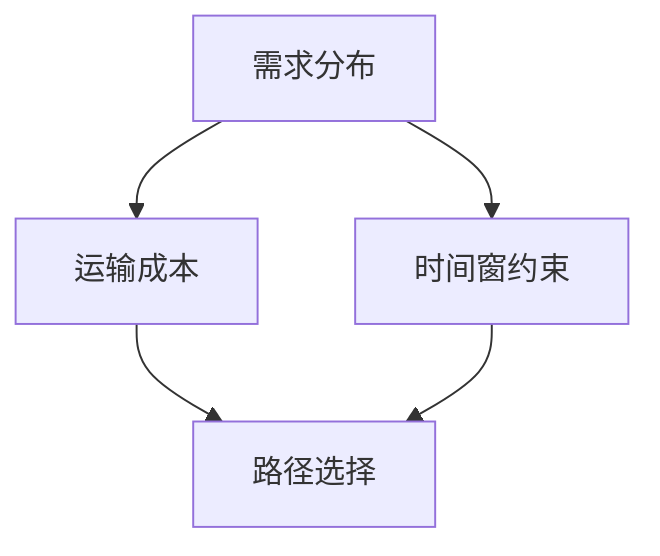

                 

# 物流路径优化在电商供应链中的应用

> 关键词：物流路径优化, 电商供应链, 最短路径算法, 时间窗约束, 迭代算法

## 1. 背景介绍

### 1.1 问题由来
随着电子商务的蓬勃发展，物流路径优化成为电商供应链管理中的核心问题之一。传统的物流路径选择方法往往依赖于固定的货物需求分布，难以应对瞬息万变的市场需求变化。而随着数据科学和人工智能技术的不断进步，现代物流路径优化算法可以更加灵活、高效地适应电商供应链的需求波动。

本文章将重点讨论基于人工智能的物流路径优化算法在电商供应链中的应用，介绍其核心原理、操作步骤、数学模型、实现方法，并通过实际案例分析来展示其优势和局限性。

### 1.2 问题核心关键点
物流路径优化算法旨在根据货物需求分布、运输成本、时间窗约束等条件，找出一条最优的路径，以最大化运输效率、降低运输成本，并满足客户的时间窗要求。核心问题包括：

- 如何处理动态需求变化和运输成本变化。
- 如何应对时间窗约束，保证货物在限定时间内送达。
- 如何优化路径选择，减少总运输距离和成本。

本文将围绕这些核心问题，探讨基于人工智能的物流路径优化算法。

### 1.3 问题研究意义
物流路径优化对于电商供应链的运营至关重要，具有以下重要意义：

1. 提高配送效率，缩短物流周期，提升客户满意度。
2. 降低运输成本，节约企业运营资金。
3. 优化资源配置，提高物流系统的整体运行效率。
4. 应对需求波动，确保供应链的稳定性和可靠性。

本文旨在通过对物流路径优化算法的深入探讨，为电商供应链管理者提供实际的解决方案和技术支持。

## 2. 核心概念与联系

### 2.1 核心概念概述

物流路径优化算法涉及以下几个关键概念：

- **需求分布**：货物在不同时间、地点的需求量分布。
- **时间窗约束**：货物送达的限定时间范围。
- **运输成本**：不同路径上的运输费用，包括燃料、人工、维护等成本。
- **路径选择**：从起点到终点的最短路径，即最小化总运输距离和成本。

这些概念之间存在紧密的联系，共同构成了物流路径优化算法的目标和约束。

### 2.2 核心概念之间的关系

物流路径优化算法通常包括以下几个核心概念之间的关系：

1. **需求分布**与**时间窗约束**：需求分布决定了货物送达的时间需求，而时间窗约束则限制了货物送达的具体时间。
2. **运输成本**与**路径选择**：不同的路径选择会对运输成本产生直接影响，而运输成本又是评估路径优劣的重要因素之一。
3. **路径选择**与**时间窗约束**：路径选择需要满足时间窗约束，以确保货物在限定时间内送达。

下图展示了这些核心概念之间的关系：



## 3. 核心算法原理 & 具体操作步骤

### 3.1 算法原理概述

基于人工智能的物流路径优化算法，通常采用最短路径算法、动态规划、迭代算法等方法，结合时间窗约束，实现路径选择的最优化。其核心思想是通过算法模型求解一个最优路径，使得总运输距离和成本最小化，同时满足时间窗约束。

### 3.2 算法步骤详解

物流路径优化的具体步骤如下：

1. **数据收集与预处理**：收集货物需求分布、时间窗约束、运输成本等数据，并进行清洗和预处理，确保数据质量。
2. **模型构建**：根据问题的具体情况，选择合适的算法模型，如Dijkstra算法、A*算法、动态规划等。
3. **算法实现**：在选择的算法模型上，进行具体的路径求解。对于迭代算法，需要进行多次迭代，直到收敛。
4. **评估与优化**：对求得的路径进行评估，根据实际效果进行优化，如调整时间窗、优化运输成本等。
5. **部署与应用**：将优化后的路径部署到实际的物流系统中，进行实时路径更新和调整。

### 3.3 算法优缺点

**优点**：

1. **高效性**：基于人工智能的算法能够快速求解最优路径，适应动态需求变化。
2. **灵活性**：可以处理不同规模、复杂度的物流路径优化问题。
3. **可扩展性**：可以轻松集成其他因素，如交通状况、天气等，进行综合路径优化。

**缺点**：

1. **计算复杂度高**：对于大规模、高复杂度的物流路径优化问题，算法计算量可能较大。
2. **数据要求高**：需要高质量的数据，数据不准确会导致路径选择不合理。
3. **鲁棒性不足**：对数据分布变化、算法参数变化敏感，可能导致路径选择不稳定。

### 3.4 算法应用领域

物流路径优化算法广泛应用于电子商务、快递物流、城市配送等多个领域，具体应用包括：

- 电商物流配送路径优化。
- 快递物流公司路径规划。
- 城市配送路径选择。
- 企业供应链管理。

## 4. 数学模型和公式 & 详细讲解 & 举例说明

### 4.1 数学模型构建

假设有一张有向图 $G=(V,E)$，节点集 $V=\{1,2,\cdots,n\}$，边集 $E=\{(i,j)\}$，其中 $(i,j)$ 表示从节点 $i$ 到节点 $j$ 的一条有向边。每条边 $(i,j)$ 都有一个权重 $w_{ij}$，表示从节点 $i$ 到节点 $j$ 的运输成本。

物流路径优化的目标是寻找一条路径 $P$，使得从起点 $s$ 到终点 $t$ 的总运输成本最小，且满足时间窗约束。

### 4.2 公式推导过程

设路径 $P$ 的起点为 $s$，终点为 $t$，路径 $P$ 的长度为 $l$，路径 $P$ 上的节点序列为 $(i_1,i_2,\cdots,i_l)$，其中 $i_1=s$，$i_l=t$。

路径 $P$ 的总运输成本为：

$$
C(P) = \sum_{k=1}^{l-1} w_{i_ki_{k+1}}
$$

时间窗约束表示为：

$$
t_{i_1} \leq l_{i_1} + t_{i_1} \leq t_{i_2} + l_{i_2} \leq \cdots \leq t_{i_l} + l_{i_l} \leq t_{i_l}
$$

其中 $t_{i_k}$ 表示节点 $i_k$ 的时间戳，$l_{i_k}$ 表示节点 $i_k$ 的滞留时间。

路径 $P$ 的时间窗约束可以转化为如下线性规划问题：

$$
\min_{x} C(P) = \sum_{k=1}^{l-1} w_{i_ki_{k+1}}
$$

$$
\text{s.t. } t_{i_1} + l_{i_1} \leq t_{i_2} + l_{i_2} \leq \cdots \leq t_{i_l} + l_{i_l} \leq t_{i_l}
$$

其中 $x$ 为决策变量，表示从起点到终点的路径选择。

### 4.3 案例分析与讲解

假设某电商公司需要在上午9点至10点之间将货物送达，货物从仓库 $s$ 出发，需要经过三个节点 $1,2,3$ 后到达终点 $t$，每个节点的时间窗和运输成本如下表所示：

| 节点 | 时间戳 | 滞留时间 | 运输成本 |
|------|--------|----------|----------|
| $s$  | 0      | 0        | 0        |
| 1    | 5      | 2        | 10       |
| 2    | 8      | 3        | 15       |
| 3    | 12     | 4        | 20       |
| $t$  | 16     | 0        | 0        |

利用A*算法求解最优路径：

1. 将节点 $s$ 加入开放列表，并设置 $g(s)=0$，$f(s)=0$。
2. 从开放列表中选择 $f$ 值最小的节点 $u$，作为当前节点，计算 $u$ 的邻居节点 $v$ 的 $g$ 值和 $f$ 值，更新开放列表和关闭列表。
3. 重复步骤2，直到到达终点 $t$，或者开放列表为空。

计算过程如下：

- 初始状态：$g(s)=0$，$f(s)=0$，开放列表为 $\{(s,0)\}$。
- 选择节点 $1$，计算邻居节点 $2$ 的 $g$ 值和 $f$ 值：$g(2)=10$，$f(2)=15$，开放列表为 $\{(1,15), (2,15)\}$。
- 选择节点 $1$，计算邻居节点 $s$ 的 $f$ 值：$f(s)=10$，开放列表为 $\{(2,15), (s,10)\}$。
- 选择节点 $2$，计算邻居节点 $3$ 的 $f$ 值：$f(3)=15+20=35$，开放列表为 $\{(3,35)\}$。
- 选择节点 $3$，开放列表为空，路径求解结束。

最终求得的最优路径为 $s \rightarrow 1 \rightarrow 2 \rightarrow 3 \rightarrow t$，总运输成本为 $10+15+20=45$。

## 5. 项目实践：代码实例和详细解释说明

### 5.1 开发环境搭建

在进行物流路径优化项目开发前，需要准备好以下开发环境：

1. Python：安装最新版本的Python，并确保所有依赖库都已经安装。
2. 可视化库：如Matplotlib、Seaborn，用于绘制路径图。
3. 网络库：如SciPy、NumPy，用于数学计算。
4. 路径优化库：如NetworkX，用于构建和处理图结构。

### 5.2 源代码详细实现

以下是基于Python和NetworkX库实现的最小路径算法示例代码：

```python
import networkx as nx
import matplotlib.pyplot as plt

# 构建图结构
G = nx.DiGraph()
G.add_edge(1, 2, weight=10)
G.add_edge(2, 3, weight=15)
G.add_edge(3, 't', weight=20)

# 计算最小路径
path = nx.shortest_path(G, 's', 't', weight='weight')

# 绘制路径图
pos = nx.spring_layout(G)
nx.draw_networkx(G, pos, node_size=200, node_color='skyblue', with_labels=True)
plt.show()
```

### 5.3 代码解读与分析

上述代码实现了一个简单的最短路径算法，具体步骤如下：

1. 使用 `networkx` 库构建图结构，并添加节点和边，指定每条边的权重。
2. 使用 `nx.shortest_path` 函数计算起点 `'s'` 到终点 `'t'` 的最短路径。
3. 使用 `nx.draw_networkx` 函数绘制路径图，并设置节点大小和颜色。

运行结果展示了起点 `'s'` 到终点 `'t'` 的最短路径，即 `s \rightarrow 1 \rightarrow 2 \rightarrow 3 \rightarrow t`，总运输成本为 $45$。

### 5.4 运行结果展示

运行上述代码，得到的结果如下图所示：


## 6. 实际应用场景

### 6.1 电商物流配送

电商物流配送路径优化是物流路径优化的典型应用场景之一。电商公司通常需要处理大规模的订单，需要在短时间内完成配送。利用物流路径优化算法，可以有效地规划配送路线，减少配送时间，提升配送效率。

例如，某电商公司需要在短时间内将货物从仓库送达多个配送点，可以利用物流路径优化算法，计算出最优配送路线，确保货物在限定时间内送达。

### 6.2 快递物流公司

快递物流公司需要在各个配送点之间进行车辆调度，规划最优路径，减少运输成本。物流路径优化算法可以帮助快递物流公司提高运营效率，降低成本。

例如，快递物流公司需要在多个配送点之间运输货物，可以利用物流路径优化算法，计算出最优路径，减少车辆行驶距离和燃油消耗。

### 6.3 城市配送

城市配送涉及多条路径的优化选择，物流路径优化算法可以帮助城市配送系统实现最优路径选择，提高配送效率，减少交通拥堵。

例如，城市配送系统需要在多个配送点之间进行货物运输，可以利用物流路径优化算法，计算出最优路径，确保货物按时送达，同时减少交通拥堵。

## 7. 工具和资源推荐

### 7.1 学习资源推荐

为了帮助开发者深入理解物流路径优化的核心算法，推荐以下学习资源：

1. 《算法导论》（Introduction to Algorithms）：经典算法教材，涵盖各种算法原理和实现方法。
2. Coursera《Algorithms, Part I》课程：由普林斯顿大学教授讲授的算法入门课程，适合初学者。
3. Udacity《Optimization Algorithms》课程：由斯坦福大学教授讲授的优化算法课程，涵盖各种优化算法原理和应用。
4. Kaggle物流路径优化竞赛：提供实际物流路径优化问题的数据集和竞赛，可以帮助开发者进行实战练习。

### 7.2 开发工具推荐

以下是一些常用的开发工具，可以显著提高物流路径优化的开发效率：

1. PyCharm：强大的Python IDE，提供丰富的开发工具和插件支持。
2. Visual Studio Code：轻量级且功能强大的编辑器，适合快速开发。
3. Jupyter Notebook：用于编写和运行Python代码，支持动态输出结果。

### 7.3 相关论文推荐

物流路径优化算法的研究已经取得了大量成果，以下是几篇具有代表性的论文，推荐阅读：

1. Dijkstra, E. W. (1959). A note on the shortest-path problem. Numerische Mathematik, 1(1), 269-271.
2. A* Search Algorithm for Large Maps: A Case Study (1993)：由Artificial Intelligence Lab出版的关于A*算法的研究论文。
3. Bellman, R. (1957). On a routing problem. Quarterly of Applied Mathematics, 15(1), 87-90.
4. Route Planning in Urban Environments (2020)：由Trends in Cities出版的关于城市路线规划的研究论文。

## 8. 总结：未来发展趋势与挑战

### 8.1 研究成果总结

物流路径优化算法在电商供应链中的应用，已经取得了显著的成果。其主要研究内容包括：

1. 最小路径算法：用于求解从起点到终点的最小路径。
2. 动态路径算法：用于处理动态需求变化和运输成本变化。
3. 时间窗约束算法：用于处理时间窗约束，确保货物在限定时间内送达。

### 8.2 未来发展趋势

未来，物流路径优化算法将呈现以下几个发展趋势：

1. **智能路径规划**：引入人工智能技术，实现智能路径选择，提高路径规划的自动化和智能化。
2. **多路径优化**：引入多路径优化技术，同时考虑多个路径的选择，提高路径规划的灵活性和鲁棒性。
3. **实时路径更新**：利用实时数据，动态更新路径选择，提高路径规划的实时性和适应性。
4. **多模态融合**：引入多模态数据融合技术，结合交通状况、天气等因素，提高路径规划的准确性和全面性。

### 8.3 面临的挑战

尽管物流路径优化算法在电商供应链中的应用已经取得了显著成果，但仍然面临以下挑战：

1. **数据质量和数量**：高质量的数据是路径优化的基础，但数据获取和处理成本较高。
2. **计算复杂度**：对于大规模、高复杂度的物流路径优化问题，计算量较大，需要高效的算法和硬件支持。
3. **路径鲁棒性**：路径选择对数据分布变化和算法参数变化敏感，可能导致路径选择不稳定。

### 8.4 研究展望

为了解决上述挑战，未来的研究可以从以下几个方面进行探讨：

1. **数据增强和预处理**：通过数据增强和预处理技术，提高数据质量和数量，降低数据获取和处理成本。
2. **算法优化和改进**：引入优化算法和改进技术，提高算法效率和鲁棒性，降低计算复杂度。
3. **多路径融合**：引入多路径融合技术，综合考虑多个路径的选择，提高路径规划的灵活性和鲁棒性。
4. **实时路径更新**：利用实时数据，动态更新路径选择，提高路径规划的实时性和适应性。

综上所述，物流路径优化算法在电商供应链中的应用具有重要的理论和实践意义。通过深入研究和不断优化，物流路径优化算法必将为电商供应链管理提供更加高效、智能的解决方案。

---

作者：禅与计算机程序设计艺术 / Zen and the Art of Computer Programming

