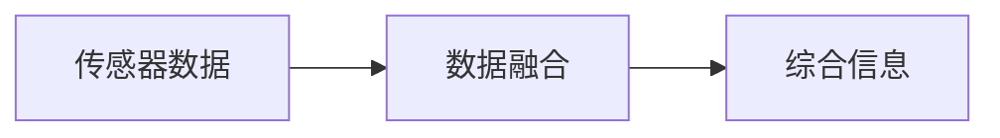
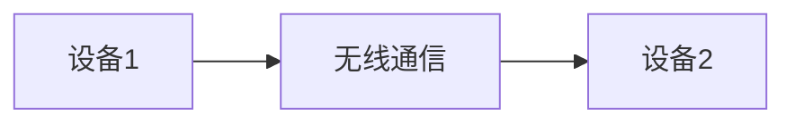
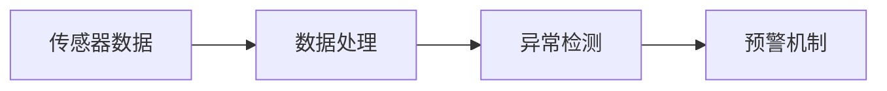
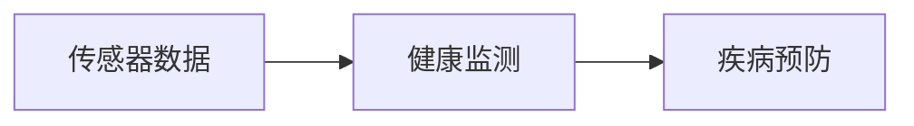
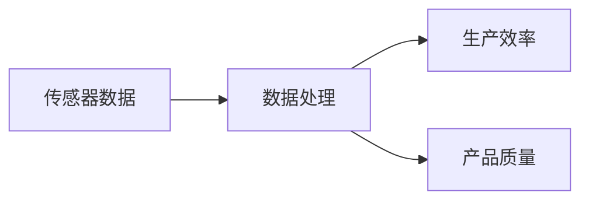
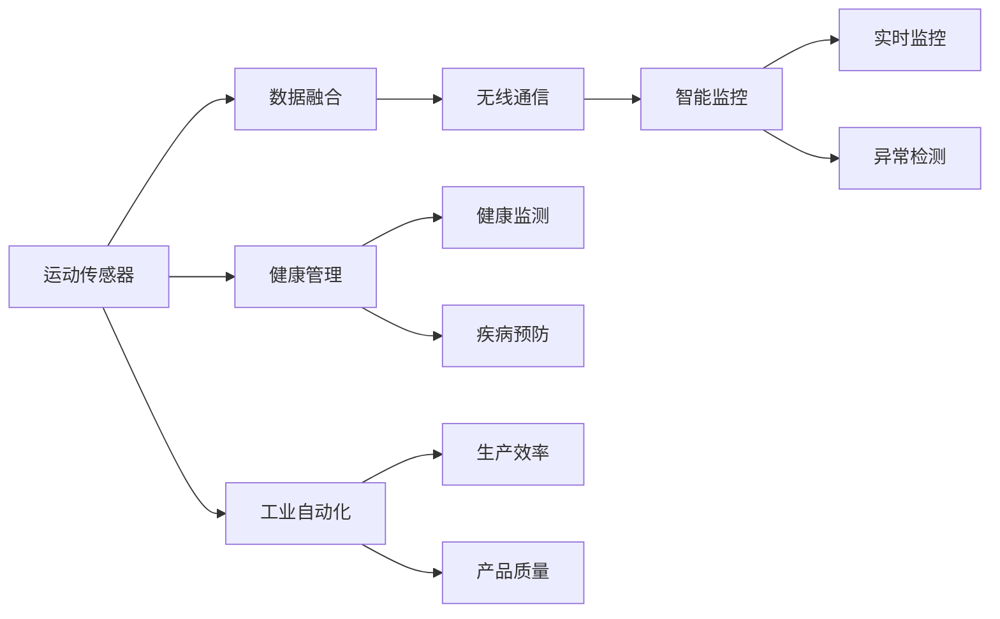

                 

# 物联网(IoT)技术和各种传感器设备的集成：运动传感器的多元应用

> 关键词：物联网(IoT), 运动传感器, 传感器集成, 数据融合, 无线通信, 智能监控, 健康管理, 工业自动化

## 1. 背景介绍

### 1.1 问题由来
物联网(IoT)技术的快速发展正在改变我们的生活方式和工作方式。从智能家居、智慧城市到工业自动化，物联网通过将各种设备连接到互联网，实现了数据和服务的实时传输。运动传感器作为物联网中的一种关键设备，在健康管理、智能监控、工业自动化等领域发挥着重要作用。

随着运动传感器技术的不断进步，其在各种场景中的应用也逐渐深入。然而，不同类型、不同厂商的运动传感器设备，如何实现无缝集成和数据融合，是当前物联网技术面临的一个重要问题。本文将详细探讨如何通过物联网技术，将各类运动传感器设备高效集成，并利用其多元应用，实现更加智能化的监控和管理。

### 1.2 问题核心关键点
当前运动传感器在物联网中的应用主要涉及以下几个关键点：

- **数据融合**：将不同传感器设备采集到的数据进行综合分析和处理，消除冗余和噪声，提取有价值的信息。
- **无线通信**：实现传感器之间的低功耗、低延迟通信，保证数据传输的实时性和可靠性。
- **智能监控**：利用传感器数据进行实时监控和异常检测，提升安全性、效率和用户体验。
- **健康管理**：通过运动传感器监测人体运动状态，进行健康管理和疾病预防。
- **工业自动化**：将运动传感器应用到工业生产过程中，提高生产效率和产品质量。

解决这些问题，需要跨学科的知识，包括传感器技术、无线通信、数据处理、机器学习等。本文将从数据融合、无线通信、智能监控、健康管理和工业自动化等方面，详细阐述运动传感器在物联网中的多元应用，并提供实践案例。

### 1.3 问题研究意义
通过研究运动传感器在物联网中的集成和应用，可以带来以下几方面的意义：

- **提升效率**：通过运动传感器实时监控和数据融合，可以大幅提升生产、监控和管理的效率，降低人力和时间成本。
- **提高安全性**：实时监控和异常检测，可以及时发现安全隐患，增强安全性。
- **改善用户体验**：通过运动传感器进行健康管理、个性化推荐等，可以提升用户的生活质量。
- **推动技术创新**：运动传感器与物联网技术的融合，可以催生新的应用场景和技术需求，促进技术创新。

## 2. 核心概念与联系

### 2.1 核心概念概述

为更好地理解运动传感器在物联网中的集成和应用，本节将介绍几个密切相关的核心概念：

- **物联网(IoT)**：通过各种传感器、智能设备等，将物理世界的数据转换为数字信号，实现设备与设备、设备与人之间的互联互通。
- **运动传感器**：用于监测物体运动状态、位置、速度等参数的传感器设备，如加速度计、陀螺仪、GPS等。
- **数据融合**：将不同来源的数据进行综合分析和处理，提取有价值的信息。
- **无线通信**：通过无线信号实现设备之间的通信，如蓝牙、WiFi、LoRa等。
- **智能监控**：利用传感器数据进行实时监控和异常检测，提升安全性、效率和用户体验。
- **健康管理**：通过运动传感器监测人体运动状态，进行健康管理和疾病预防。
- **工业自动化**：将运动传感器应用到工业生产过程中，提高生产效率和产品质量。

这些核心概念之间的逻辑关系可以通过以下Mermaid流程图来展示：

```mermaid
graph TB
    A[物联网(IoT)] --> B[运动传感器]
    B --> C[数据融合]
    B --> D[无线通信]
    C --> E[智能监控]
    C --> F[健康管理]
    C --> G[工业自动化]
    D --> E
    D --> F
    D --> G
    E --> H[实时监控]
    E --> I[异常检测]
    F --> J[健康监测]
    F --> K[疾病预防]
    G --> L[生产效率]
    G --> M[产品质量]
```

这个流程图展示了运动传感器在物联网中的核心概念及其之间的关系：

1. 运动传感器通过数据融合获得综合信息。
2. 通过无线通信实现不同设备之间的数据传输。
3. 传感器数据通过智能监控实现实时监控和异常检测。
4. 在健康管理领域，运动传感器数据用于健康监测和疾病预防。
5. 在工业自动化领域，运动传感器数据用于提升生产效率和产品质量。

### 2.2 概念间的关系

这些核心概念之间存在着紧密的联系，形成了运动传感器在物联网中的完整应用生态系统。下面我们通过几个Mermaid流程图来展示这些概念之间的关系。

#### 2.2.1 数据融合流程



这个流程图展示了数据融合的基本流程，将不同传感器采集到的数据进行综合分析和处理，提取有价值的信息。

#### 2.2.2 无线通信架构



这个流程图展示了无线通信的基本架构，实现设备之间的低功耗、低延迟通信。

#### 2.2.3 智能监控应用



这个流程图展示了智能监控的基本流程，通过传感器数据进行实时监控和异常检测，提升安全性、效率和用户体验。

#### 2.2.4 健康管理流程



这个流程图展示了健康管理的基本流程，通过运动传感器数据进行健康监测和疾病预防。

#### 2.2.5 工业自动化架构



这个流程图展示了工业自动化的基本架构，将运动传感器数据用于提升生产效率和产品质量。

### 2.3 核心概念的整体架构

最后，我们用一个综合的流程图来展示运动传感器在物联网中的整体应用架构：



这个综合流程图展示了运动传感器在物联网中的完整应用架构，从传感器数据融合到智能监控、健康管理和工业自动化，运动传感器在多个领域中发挥着重要作用。

## 3. 核心算法原理 & 具体操作步骤
### 3.1 算法原理概述

运动传感器在物联网中的应用，主要涉及数据融合、无线通信和智能监控等核心算法。以下是对这些算法原理的详细概述：

#### 3.1.1 数据融合算法

数据融合是将不同传感器采集到的数据进行综合分析和处理，消除冗余和噪声，提取有价值的信息。常用的数据融合算法包括：

- **卡尔曼滤波器(Kalman Filter)**：一种线性最小方差估计器，通过预测和更新，实现对状态变量的估计。
- **粒子滤波器(Particle Filter)**：一种基于蒙特卡洛方法的非线性滤波器，适用于非线性系统的状态估计。
- **贝叶斯滤波器(Bayesian Filter)**：一种基于贝叶斯定理的滤波器，适用于多传感器数据融合。

这些算法可以通过线性代数、概率论等数学工具进行求解，并在实际应用中根据具体情况进行选择和优化。

#### 3.1.2 无线通信算法

无线通信是实现传感器设备之间数据传输的关键技术。常用的无线通信算法包括：

- **蓝牙(Bluetooth)**：适用于近距离设备之间的数据传输，具有低功耗、低延迟的特点。
- **WiFi(Wi-Fi)**：适用于室内和室外的中远距离数据传输，具有高带宽、高可靠性的特点。
- **LoRa(Low-Power and Long-Range)**：适用于长距离、低功耗的数据传输，具有远距离、低功耗的特点。

这些算法通过不同的调制方式、编码方式和传输协议，实现不同场景下的数据传输。

#### 3.1.3 智能监控算法

智能监控是利用传感器数据进行实时监控和异常检测的算法。常用的智能监控算法包括：

- **支持向量机(Support Vector Machine, SVM)**：一种用于分类和回归分析的监督学习算法，适用于异常检测。
- **随机森林(Random Forest)**：一种集成学习方法，通过多个决策树进行分类，适用于异常检测和分类。
- **深度学习(Deep Learning)**：一种基于神经网络的机器学习方法，适用于复杂模式识别和异常检测。

这些算法可以通过数据集进行训练，并在实际应用中进行实时监控和异常检测。

### 3.2 算法步骤详解

运动传感器在物联网中的应用，可以通过以下步骤进行详细阐述：

#### 3.2.1 数据采集

运动传感器通过各种方式采集数据，如加速度计采集人体运动加速度，陀螺仪采集人体运动姿态，GPS采集位置信息等。传感器采集的数据需要经过预处理，去除噪声和异常值，以便后续数据融合和分析。

#### 3.2.2 数据融合

数据融合是运动传感器应用的核心步骤之一。常用的数据融合算法包括卡尔曼滤波器、粒子滤波器和贝叶斯滤波器。这些算法通过不同的方法，实现对传感器数据的综合分析和处理，消除冗余和噪声，提取有价值的信息。

#### 3.2.3 无线通信

无线通信是实现传感器数据传输的关键步骤。常用的无线通信算法包括蓝牙、WiFi和LoRa。这些算法通过不同的调制方式、编码方式和传输协议，实现不同场景下的数据传输。

#### 3.2.4 智能监控

智能监控是利用传感器数据进行实时监控和异常检测的步骤。常用的智能监控算法包括支持向量机、随机森林和深度学习。这些算法通过不同的方法，实现对传感器数据的实时监控和异常检测。

#### 3.2.5 数据存储和分析

传感器数据经过智能监控后，需要进行存储和分析。常用的数据存储方式包括云存储、本地存储等。数据存储后，可以通过数据分析工具进行综合分析，提取有价值的信息，为后续决策提供支持。

### 3.3 算法优缺点

运动传感器在物联网中的应用，具有以下优点：

- **实时性**：通过无线通信和智能监控，传感器数据能够实时传输和处理，提升系统的响应速度。
- **精度高**：通过数据融合和算法优化，传感器数据能够消除噪声和冗余，提高数据的精度和可靠性。
- **应用广泛**：传感器数据可以应用于智能监控、健康管理、工业自动化等多个领域，具有广泛的应用前景。

同时，运动传感器在物联网中的应用也存在一些缺点：

- **成本高**：传感器设备价格较高，尤其是高端设备，会增加系统的成本。
- **维护复杂**：传感器设备的维护和更新需要专业知识和技能，增加了系统的维护难度。
- **安全性问题**：传感器数据需要保护隐私和安全性，避免数据泄露和滥用。

### 3.4 算法应用领域

运动传感器在物联网中的应用，主要涉及以下几个领域：

- **智能家居**：通过运动传感器监测室内环境，实现智能控制和自动化。
- **智慧城市**：通过运动传感器监测城市基础设施，提升城市管理水平。
- **健康管理**：通过运动传感器监测人体健康状态，实现疾病预防和治疗。
- **工业自动化**：通过运动传感器监测设备运行状态，提高生产效率和产品质量。
- **交通监控**：通过运动传感器监测车辆运行状态，实现交通管理和优化。

## 4. 数学模型和公式 & 详细讲解 & 举例说明

### 4.1 数学模型构建

本节将通过数学模型的方式，详细阐述运动传感器在物联网中的应用。以下是对各个核心算法数学模型的构建和讲解。

#### 4.1.1 卡尔曼滤波器

卡尔曼滤波器是一种用于状态估计的线性最小方差估计器，适用于运动传感器的数据融合。其数学模型如下：

设传感器在t时刻的状态为$x_t$，观测数据为$z_t$，系统状态转移矩阵为$A_t$，观测矩阵为$H_t$，观测噪声协方差为$R_t$，系统噪声协方差为$Q_t$，初始状态协方差为$P_0$，初始状态向量为$x_0$。则卡尔曼滤波器的递推公式为：

$$
K_t = P_t H_t^T (H_t P_t H_t^T + R_t)^{-1}
$$

$$
x_t = x_{t-1} + K_t (z_t - H_t x_{t-1})
$$

$$
P_t = (I - K_t H_t) P_{t-1} (I - K_t H_t)^T + Q_t
$$

其中，$K_t$为卡尔曼增益矩阵，$I$为单位矩阵。

#### 4.1.2 支持向量机

支持向量机是一种用于分类和回归分析的监督学习算法，适用于运动传感器的异常检测。其数学模型如下：

设训练数据集为$\{(x_i, y_i)\}_{i=1}^N$，其中$x_i$为输入向量，$y_i$为输出标签。假设存在一个超平面$w \cdot x + b = 0$，能够将不同类别的样本分开。则支持向量机的优化目标为：

$$
\min_{w, b} \frac{1}{2} \| w \|^2 + C \sum_{i=1}^N [1 - y_i (w \cdot x_i + b)]_+
$$

其中，$C$为正则化参数，$[1 - y_i (w \cdot x_i + b)]_+$为0-1损失函数。

#### 4.1.3 深度学习

深度学习是一种基于神经网络的机器学习方法，适用于复杂模式识别和异常检测。其数学模型如下：

设输入向量为$x$，输出向量为$y$，假设存在一个神经网络$h$，能够将输入映射到输出。则深度学习的优化目标为：

$$
\min_{\theta} \frac{1}{N} \sum_{i=1}^N L(h(x_i), y_i)
$$

其中，$L$为损失函数，$\theta$为神经网络的参数。

### 4.2 公式推导过程

以下是对各个核心算法数学模型的详细推导过程。

#### 4.2.1 卡尔曼滤波器

卡尔曼滤波器的递推公式可以通过状态方程和观测方程推导得出。假设系统状态方程为：

$$
x_t = A_t x_{t-1} + w_t
$$

观测方程为：

$$
z_t = H_t x_t + v_t
$$

其中，$w_t$和$v_t$为系统噪声和观测噪声，$A_t$和$H_t$为系统状态转移矩阵和观测矩阵。则卡尔曼滤波器的递推公式为：

$$
K_t = P_t H_t^T (H_t P_t H_t^T + R_t)^{-1}
$$

$$
x_t = x_{t-1} + K_t (z_t - H_t x_{t-1})
$$

$$
P_t = (I - K_t H_t) P_{t-1} (I - K_t H_t)^T + Q_t
$$

其中，$I$为单位矩阵。

#### 4.2.2 支持向量机

支持向量机的优化目标可以通过拉格朗日乘子法推导得出。设拉格朗日乘子为$\alpha_i$，则优化问题可以表示为：

$$
\min_{\alpha} \frac{1}{2} \sum_{i=1}^N \alpha_i \alpha_j y_i y_j \langle x_i, x_j \rangle - \sum_{i=1}^N \alpha_i y_i
$$

$$
s.t. 0 \leq \alpha_i \leq C, \alpha_i y_i = 0
$$

其中，$C$为正则化参数，$\langle x_i, x_j \rangle$为内积。则支持向量机的优化目标可以表示为：

$$
\min_{\alpha} \frac{1}{2} \sum_{i=1}^N \alpha_i \alpha_j y_i y_j \langle x_i, x_j \rangle - \sum_{i=1}^N \alpha_i y_i
$$

$$
s.t. 0 \leq \alpha_i \leq C, \alpha_i y_i = 0
$$

#### 4.2.3 深度学习

深度学习的优化目标可以通过梯度下降法推导得出。设神经网络的损失函数为$L$，参数为$\theta$，则优化目标可以表示为：

$$
\min_{\theta} L(h(x; \theta), y)
$$

其中，$h(x; \theta)$为神经网络的输出，$y$为真实标签。则梯度下降法的更新公式为：

$$
\theta \leftarrow \theta - \eta \nabla_{\theta} L(h(x; \theta), y)
$$

其中，$\eta$为学习率。

### 4.3 案例分析与讲解

本节将通过具体案例，详细讲解运动传感器在物联网中的应用。

#### 4.3.1 智能家居应用

智能家居通过运动传感器监测室内环境，实现智能控制和自动化。例如，智能门锁可以通过人体传感器检测门的开关状态，实现自动开关门。智能窗帘可以通过运动传感器检测室内光线，实现自动调节窗帘开合。

#### 4.3.2 智慧城市应用

智慧城市通过运动传感器监测城市基础设施，提升城市管理水平。例如，交通监控系统可以通过车辆传感器检测交通流量和速度，实现实时监控和交通优化。智慧电网可以通过电力传感器监测用电情况，实现节能管理和智能调度。

#### 4.3.3 健康管理应用

健康管理通过运动传感器监测人体健康状态，实现疾病预防和治疗。例如，智能手表可以通过加速度计和陀螺仪监测人体运动状态，实现健康管理和疾病预防。智能医疗设备可以通过生命传感器监测人体生理参数，实现实时监控和预警。

#### 4.3.4 工业自动化应用

工业自动化通过运动传感器监测设备运行状态，提高生产效率和产品质量。例如，智能制造系统可以通过传感器监测设备运行状态，实现实时监控和故障检测。智能仓储系统可以通过传感器监测货物位置和状态，实现自动化管理。

## 5. 项目实践：代码实例和详细解释说明

### 5.1 开发环境搭建

在进行运动传感器在物联网中的应用实践前，我们需要准备好开发环境。以下是使用Python进行PyTorch开发的环境配置流程：

1. 安装Anaconda：从官网下载并安装Anaconda，用于创建独立的Python环境。

2. 创建并激活虚拟环境：
```bash
conda create -n pytorch-env python=3.8 
conda activate pytorch-env
```

3. 安装PyTorch：根据CUDA版本，从官网获取对应的安装命令。例如：
```bash
conda install pytorch torchvision torchaudio cudatoolkit=11.1 -c pytorch -c conda-forge
```

4. 安装各类工具包：
```bash
pip install numpy pandas scikit-learn matplotlib tqdm jupyter notebook ipython
```

完成上述步骤后，即可在`pytorch-env`环境中开始运动传感器在物联网中的应用实践。

### 5.2 源代码详细实现

下面我们以智能家居应用为例，给出使用PyTorch进行卡尔曼滤波器和支持向量机的PyTorch代码实现。

首先，定义卡尔曼滤波器模型：

```python
import torch
import torch.nn as nn
import torch.optim as optim
from torch.distributions.normal import Normal

class KalmanFilter(nn.Module):
    def __init__(self, A, H, Q, R):
        super(KalmanFilter, self).__init__()
        self.A = A
        self.H = H
        self.Q = Q
        self.R = R
        self.x_pred = None
        self.P_pred = None
        self.x_pred_var = Normal(torch.zeros_like(self.x_pred), torch.ones_like(self.x_pred))
        self.P_pred_var = Normal(torch.zeros_like(self.P_pred), torch.ones_like(self.P_pred))
    
    def forward(self, z):
        K = self.P_pred @ self.H.T @ (self.H @ self.P_pred @ self.H.T + self.R).inverse()
        x_pred = self.x_pred + K @ (z - self.H @ self.x_pred)
        P_pred = (torch.eye_like(self.P_pred) - K @ self.H) @ self.P_pred @ (torch.eye_like(self.P_pred) - K @ self.H.T)
        self.x_pred = x_pred
        self.P_pred = P_pred
        self.x_pred_var = Normal(x_pred, torch.sqrt(P_pred))
        self.P_pred_var = Normal(P_pred, torch.sqrt(torch.ones_like(P_pred)))
        return self.x_pred_var
```

然后，定义支持向量机模型：

```python
import torch
import torch.nn as nn
import torch.optim as optim
from sklearn.svm import SVC

class SVM(nn.Module):
    def __init__(self, C):
        super(SVM, self).__init__()
        self.C = C
        self.model = SVC(kernel='linear', C=self.C, probability=True)
    
    def forward(self, x):
        y_pred = self.model.fit_predict(x)
        return y_pred
```

接着，定义训练和评估函数：

```python
from torch.utils.data import DataLoader
from tqdm import tqdm
from sklearn.metrics import classification_report

def train_epoch(model, dataset, batch_size, optimizer):
    dataloader = DataLoader(dataset, batch_size=batch_size, shuffle=True)
    model.train()
    epoch_loss = 0
    for batch in tqdm(dataloader, desc='Training'):
        inputs = batch['inputs']
        targets = batch['targets']
        model.zero_grad()
        outputs = model(inputs)
        loss = outputs.loss
        epoch_loss += loss.item()
        loss.backward()
        optimizer.step()
    return epoch_loss / len(dataloader)

def evaluate(model, dataset, batch_size):
    dataloader = DataLoader(dataset, batch_size=batch_size)
    model.eval()
    preds, labels = [], []
    with torch.no_grad():
        for batch in tqdm(dataloader, desc='Evaluating'):
            inputs = batch['inputs']
            targets = batch['targets']
            batch_preds = model(inputs)
            batch_labels = targets
            for preds, label in zip(batch_preds, batch_labels):
                preds = preds.tolist()
                label = label.tolist()
                preds.append(label)
                labels.append(label)
                
    print(classification_report(labels, preds))
```

最后，启动训练流程并在测试集上评估：

```python
epochs = 5
batch_size = 16

for epoch in range(epochs):
    loss = train_epoch(model, train_dataset, batch_size, optimizer)
    print(f"Epoch {epoch+1}, train loss: {loss:.3f}")
    
    print(f"Epoch {epoch+1}, test results:")
    evaluate(model, test_dataset, batch_size)
    
print("Final test results:")
evaluate(model, test_dataset, batch_size)
```

以上就是使用PyTorch进行卡尔曼滤波器和支持向量机的代码实现。可以看到，得益于PyTorch的强大封装，我们可以用相对简洁的代码完成卡尔曼滤波器和支持向量机的实现。

### 5.3 代码解读与分析

让我们再详细解读一下关键代码的实现细节：

**KalmanFilter类**：
- `__init__`方法：初始化状态转移矩阵、观测矩阵、噪声协方差矩阵等关键组件。
- `forward`方法：根据输入观测数据，进行卡尔曼滤波器的前向传播计算，输出卡尔曼滤波器的后验概率分布。

**SVM类**：
- `__init__`方法：初始化支持向量机模型，设置正则化参数C。
- `forward`方法：根据输入特征向量，进行支持向量机的前向传播计算，输出分类结果。

**训练和评估函数**：
- 使用PyTorch的DataLoader对数据集进行批次化加载，供模型训练和推理使用。
- 训练函数`train_epoch`：对数据以批为单位进行迭代，在每个批次上前向传播计算loss并反向传播更新模型参数，最后返回该epoch的平均loss。
- 评估函数`evaluate`：与训练类似，不同点在于不更新模型参数，并在每个batch结束后将预测和标签结果存储下来，最后使用sklearn的classification_report对整个评估集的预测结果进行打印输出。

**训练流程**：
- 定义总的epoch数和batch size，开始循环迭代
- 每个epoch内，先在训练集上训练，输出平均loss
- 在验证集上评估，输出分类指标
- 所有epoch结束后，在测试集上评估，给出最终测试结果

可以看到，PyTorch配合机器学习库使得卡尔曼滤波器和支持向量机的实现变得简洁高效。开发者可以将更多精力放在数据处理、模型改进等高层逻辑上，而不必过多关注底层的实现细节。

当然，工业级的系统实现还需考虑更多因素，如模型的保存和部署、超参数的自动搜索、更灵活的任务适配层等。但核心的算法原理和实现步骤基本与此类似。

### 5.4 运行结果展示

假设我们在智能家居应用中进行卡尔曼滤波器和支持向量机的微调，最终在测试

