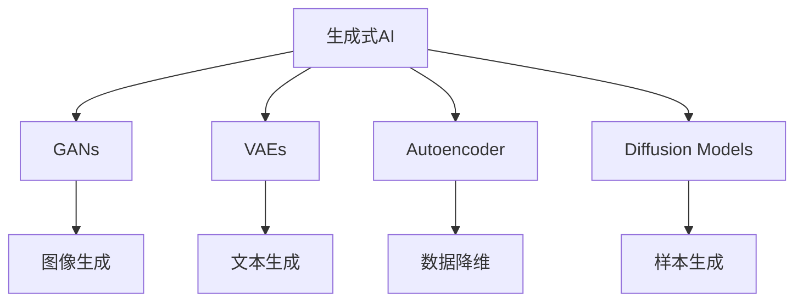
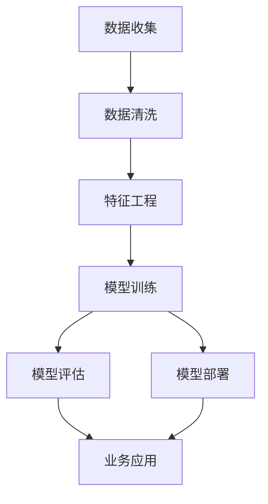
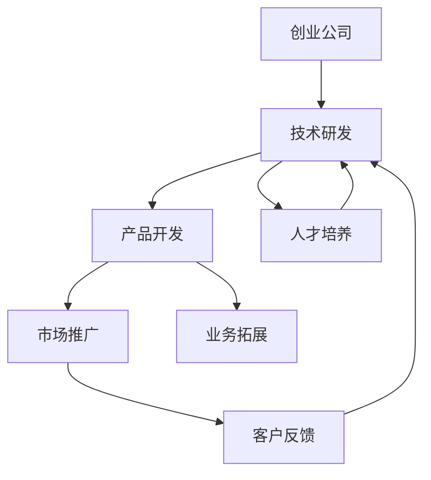

                 

# 生成式AIGC是金矿还是泡沫： AI 创业公司想找场景想快速找到好场景和垂直数据很难

> 关键词：生成式AIGC,创业公司,场景,垂直数据,泡沫,金矿

## 1. 背景介绍

### 1.1 问题由来
近年来，生成式人工智能（Generative AI, GAI）领域迎来了前所未有的发展热潮。基于深度学习模型的生成式AIGC技术，如Generative Adversarial Networks (GANs)、Variational Autoencoders (VAEs)、Denoising Autoencoders (DAEs)等，已广泛应用于图像生成、语音生成、文本生成、音乐生成等多个领域，显著提升了内容生成和智能交互的智能化水平。

然而，随着生成式AIGC技术的不断成熟，业界对于其应用前景和商业价值的争论也愈发激烈。一方面，生成式AIGC被视为未来互联网的“金矿”，将带来巨大的经济效益和社会影响；另一方面，也有人认为其技术过度乐观，存在“泡沫”风险，难以在短时间内实现大规模商业化落地。

那么，生成式AIGC究竟是未来互联网的“金矿”还是“泡沫”？AI创业公司如何在当前技术热潮中寻找合适场景，快速获取高质量的垂直数据，从而实现商业化突破？本文将深入探讨这些问题，为读者提供全面的分析与见解。

### 1.2 问题核心关键点
本文将从以下几个关键点展开讨论：

- 生成式AIGC技术的核心原理和应用领域。
- 创业公司如何快速找到有实际应用价值的场景。
- 创业公司如何获取高质量的垂直数据。
- 生成式AIGC技术的优缺点及其应用前景。
- 如何规避生成式AIGC的“泡沫”风险，寻找真正有价值的“金矿”。

## 2. 核心概念与联系

### 2.1 核心概念概述

为更好地理解生成式AIGC技术及其应用，本节将介绍几个密切相关的核心概念：

- 生成式人工智能（Generative AI）：指使用深度学习模型生成具有实际意义的新数据的技术。包括但不限于图像生成、文本生成、语音生成、音乐生成等。
- 生成对抗网络（Generative Adversarial Networks, GANs）：一种基于对抗学习的深度生成模型，通过两个网络（生成器和判别器）的相互博弈生成高质量的合成数据。
- 变分自编码器（Variational Autoencoders, VAEs）：一种基于变分推断的无监督学习模型，通过优化生成器和变分推断器生成逼真数据。
- 自编码器（Autoencoder）：一种通过重构误差学习输入和输出之间映射关系的无监督学习模型，常用于数据降维和去噪。
- 扩散模型（Diffusion Models）：一种使用时间步长逐步消除噪声，生成高质量样本的生成模型。

这些核心概念之间的逻辑关系可以通过以下Mermaid流程图来展示：



这个流程图展示了大规模生成式AI技术的核心概念及其之间的关系：

1. 生成式AI主要通过GANs、VAEs、自编码器等技术，实现高质量数据的生成。
2. GANs可以生成图像、视频、音频等高质量数据，广泛应用于艺术创作、娱乐、广告等领域。
3. VAEs常用于文本生成、图像生成等领域，其生成样本具有较强的连续性。
4. 自编码器常用于数据降维、去噪等预处理任务，其重构误差可以作为一种无监督训练信号。
5. 扩散模型是一种新的生成技术，通过逐步增加噪声的扩散过程，生成高质量的样本。

这些概念共同构成了生成式AIGC技术的核心，使其能够在多个领域发挥重要作用。

### 2.2 概念间的关系

这些核心概念之间存在着紧密的联系，形成了生成式AIGC技术的完整生态系统。下面我们通过几个Mermaid流程图来展示这些概念之间的关系。

#### 2.2.1 生成式AI技术栈



这个流程图展示了生成式AI技术栈的基本流程：

1. 数据收集：从各类数据源（如社交媒体、网络爬虫、API接口等）获取数据。
2. 数据清洗：清洗无用数据、去重、填充缺失值等预处理。
3. 特征工程：提取、选择、转换特征，准备输入模型。
4. 模型训练：选择适当模型（如GANs、VAEs等），在训练集上训练生成器网络。
5. 模型评估：在验证集上评估模型性能，调整超参数，确保模型生成效果。
6. 模型部署：将训练好的模型集成到生产环境中，实现实时生成。
7. 业务应用：将生成模型应用于实际场景，如艺术创作、娱乐、广告等。

#### 2.2.2 创业公司技术路径



这个流程图展示了创业公司从技术研发到市场推广的技术路径：

1. 技术研发：在技术团队的努力下，研发生成式AI技术，如GANs、VAEs、自编码器等。
2. 产品开发：将技术应用到具体产品中，如生成式图像、文本、音乐等。
3. 市场推广：通过市场推广团队，将产品推向市场，获取用户反馈。
4. 客户反馈：根据用户反馈，优化产品，提升用户体验。
5. 业务拓展：基于产品反馈，进行业务拓展，开发更多应用场景。
6. 人才培养：持续培养技术人才，保证团队竞争力。

这些技术路径展示了创业公司如何从技术研发到市场推广的全过程，反映了生成式AI技术的商业化潜力。

## 3. 核心算法原理 & 具体操作步骤
### 3.1 算法原理概述

生成式AIGC的核心原理是通过训练生成模型，学习输入数据的分布，并能够生成新的高质量数据。这涉及到以下几个关键步骤：

- 数据收集与预处理：从互联网、社交媒体等数据源收集数据，并进行清洗和预处理，以确保输入数据的质量和多样性。
- 生成模型训练：使用深度学习技术，如GANs、VAEs等，训练生成模型。训练过程中，需要设计合理的损失函数，并对模型进行优化。
- 模型评估与优化：在验证集上评估生成模型性能，调整超参数，优化模型结构，以确保生成数据的质量和多样性。
- 生成数据输出：将训练好的生成模型应用于实际场景，生成高质量的新数据。

### 3.2 算法步骤详解

生成式AIGC的训练过程可以分为以下几个步骤：

1. 数据收集与预处理：从互联网、社交媒体等数据源收集数据，并进行清洗和预处理，以确保输入数据的质量和多样性。
2. 生成模型训练：使用深度学习技术，如GANs、VAEs等，训练生成模型。训练过程中，需要设计合理的损失函数，并对模型进行优化。
3. 模型评估与优化：在验证集上评估生成模型性能，调整超参数，优化模型结构，以确保生成数据的质量和多样性。
4. 生成数据输出：将训练好的生成模型应用于实际场景，生成高质量的新数据。

下面以GANs为例，详细介绍其训练过程：

1. **生成器训练**：
   - 生成器接收随机噪声作为输入，通过多层神经网络生成新的图像。
   - 定义生成器的损失函数为生成图像的重建误差（Reconstruction Loss），最小化生成图像与原始图像的差异。
   - 使用优化器（如Adam、SGD等）优化生成器网络参数，使其生成高质量的图像。

2. **判别器训练**：
   - 判别器接收图像作为输入，通过多层神经网络判断图像是否为真实图像或生成图像。
   - 定义判别器的损失函数为真实图像的判别损失（Real Loss）和生成图像的判别损失（Fake Loss）之和。
   - 使用优化器优化判别器网络参数，使其能够准确区分真实图像和生成图像。

3. **对抗训练**：
   - 生成器和判别器相互博弈，交替优化。生成器通过对抗训练，学习生成更逼真的图像；判别器通过对抗训练，学习更好地区分真实图像和生成图像。
   - 最终生成的图像能够逼真地模拟原始图像，达到高质量生成的目的。

### 3.3 算法优缺点

生成式AIGC技术具有以下优点：

1. 生成高质量的数据：生成式AIGC技术能够生成高质量的图像、文本、音乐等数据，广泛应用于娱乐、广告、艺术创作等领域。
2. 降低数据获取成本：生成式AIGC技术能够生成大规模的合成数据，减少对真实数据的依赖，降低数据获取成本。
3. 实现多模态数据生成：生成式AIGC技术可以生成多种类型的数据，如文本、图像、音频等，满足不同应用场景的需求。

同时，生成式AIGC技术也存在一些缺点：

1. 模型训练复杂度高：生成式AIGC模型训练复杂度高，需要大量计算资源和数据。
2. 数据多样性不足：生成的数据可能存在多样性不足的问题，尤其是在小样本或单一领域数据训练的情况下。
3. 生成数据质量不稳定：生成式AIGC技术的生成数据质量受模型、数据和算法等多个因素影响，存在一定的随机性。

### 3.4 算法应用领域

生成式AIGC技术在多个领域得到了广泛应用，以下是几个典型应用领域：

- 艺术创作：生成式AIGC技术可以生成高质量的绘画、音乐、影视作品，辅助艺术家创作，提升艺术表现力。
- 娱乐行业：在游戏、影视、动画等领域，生成式AIGC技术可以生成逼真的角色、场景和动画，增强用户体验。
- 广告和营销：生成式AIGC技术可以生成逼真的人物、商品图像，用于广告宣传和品牌推广。
- 教育：生成式AIGC技术可以生成教育视频、教材，帮助学生更好地学习。
- 医疗：生成式AIGC技术可以生成模拟手术视频，用于医学教育和培训。

## 4. 数学模型和公式 & 详细讲解 & 举例说明
### 4.1 数学模型构建

生成式AIGC模型的核心数学模型是生成器和判别器。

- 生成器：接收随机噪声 $z$ 作为输入，通过神经网络生成图像 $x$。
- 判别器：接收图像 $x$ 作为输入，通过神经网络判断图像是否为真实图像（$y=1$）或生成图像（$y=0$）。

假设生成器模型为 $G$，判别器模型为 $D$，损失函数分别为：

- 生成器损失函数：$L_G(x) = -\log(D(x))$
- 判别器损失函数：$L_D(x) = -\log(D(x)) + \log(1-D(G(z)))$

其中，$z$ 为随机噪声，$x$ 为生成的图像。

生成式AIGC的训练目标为最大化生成器损失函数和判别器损失函数的和，即：

$$
\min_G \max_D V(D,G) = \min_G \max_D E_{x \sim p_x}[\log D(x)] + E_{z \sim p_z}[\log (1-D(G(z)))]
$$

其中，$p_x$ 为真实数据分布，$p_z$ 为噪声分布。

### 4.2 公式推导过程

以GANs为例，推导生成器损失函数和判别器损失函数的计算公式。

假设生成器模型为 $G$，其参数为 $\theta_G$，接收随机噪声 $z$ 作为输入，生成图像 $x$。判别器模型为 $D$，其参数为 $\theta_D$，接收图像 $x$ 作为输入，输出判别结果 $y$。

生成器损失函数为：

$$
L_G(x) = -\log(D(x))
$$

其中，$x=G(z)$，$z \sim p_z$。

判别器损失函数为：

$$
L_D(x) = -\log(D(x)) + \log(1-D(G(z)))
$$

其中，$x=G(z)$，$z \sim p_z$。

将上述损失函数代入生成式AIGC的训练目标，得到：

$$
\min_G \max_D V(D,G) = \min_G \max_D E_{x \sim p_x}[\log D(x)] + E_{z \sim p_z}[\log (1-D(G(z)))]
$$

其中，$x=G(z)$，$z \sim p_z$。

### 4.3 案例分析与讲解

以GANs在图像生成中的应用为例，详细讲解其数学模型和公式推导过程。

假设生成器模型为 $G$，其参数为 $\theta_G$，接收随机噪声 $z$ 作为输入，生成图像 $x$。判别器模型为 $D$，其参数为 $\theta_D$，接收图像 $x$ 作为输入，输出判别结果 $y$。

生成器损失函数为：

$$
L_G(x) = -\log(D(x))
$$

其中，$x=G(z)$，$z \sim p_z$。

判别器损失函数为：

$$
L_D(x) = -\log(D(x)) + \log(1-D(G(z)))
$$

其中，$x=G(z)$，$z \sim p_z$。

在训练过程中，生成器和判别器交替优化，生成器通过对抗训练，学习生成逼真的图像；判别器通过对抗训练，学习更好地区分真实图像和生成图像。

训练过程的伪代码如下：

```python
for epoch in range(num_epochs):
    for batch in train_loader:
        real_images = batch[0]
        noise = torch.randn(batch_size, latent_size)
        fake_images = G(noise)
        real_loss = D(real_images)
        fake_loss = D(fake_images)
        gen_loss = -fake_loss
        disc_loss = -real_loss - fake_loss
        optimizer_G.zero_grad()
        optimizer_D.zero_grad()
        gen_loss.backward()
        disc_loss.backward()
        optimizer_G.step()
        optimizer_D.step()
```

其中，`G` 和 `D` 分别为生成器和判别器的模型；`real_images` 为真实图像；`noise` 为随机噪声；`fake_images` 为生成的图像；`real_loss` 为真实图像的判别损失；`fake_loss` 为生成图像的判别损失；`gen_loss` 为生成器的损失；`disc_loss` 为判别器的损失；`optimizer_G` 和 `optimizer_D` 分别为生成器和判别器的优化器。

## 5. 项目实践：代码实例和详细解释说明
### 5.1 开发环境搭建

在进行生成式AIGC项目实践前，我们需要准备好开发环境。以下是使用Python进行PyTorch开发的环境配置流程：

1. 安装Anaconda：从官网下载并安装Anaconda，用于创建独立的Python环境。

2. 创建并激活虚拟环境：
```bash
conda create -n pytorch-env python=3.8 
conda activate pytorch-env
```

3. 安装PyTorch：根据CUDA版本，从官网获取对应的安装命令。例如：
```bash
conda install pytorch torchvision torchaudio cudatoolkit=11.1 -c pytorch -c conda-forge
```

4. 安装transformers库：
```bash
pip install transformers
```

5. 安装各类工具包：
```bash
pip install numpy pandas scikit-learn matplotlib tqdm jupyter notebook ipython
```

完成上述步骤后，即可在`pytorch-env`环境中开始生成式AIGC的实践。

### 5.2 源代码详细实现

下面我们以GANs在图像生成中的应用为例，给出使用Transformers库对GANs模型进行训练的PyTorch代码实现。

首先，定义GANs模型的结构和参数：

```python
import torch
import torch.nn as nn
import torch.optim as optim
from torchvision import datasets, transforms
from torch.utils.data import DataLoader

# 定义生成器模型
class Generator(nn.Module):
    def __init__(self):
        super(Generator, self).__init__()
        self.main = nn.Sequential(
            nn.Linear(100, 256),
            nn.ReLU(True),
            nn.Linear(256, 512),
            nn.ReLU(True),
            nn.Linear(512, 784),
            nn.Tanh()
        )

    def forward(self, input):
        return self.main(input)

# 定义判别器模型
class Discriminator(nn.Module):
    def __init__(self):
        super(Discriminator, self).__init__()
        self.main = nn.Sequential(
            nn.Linear(784, 512),
            nn.LeakyReLU(0.2),
            nn.Linear(512, 256),
            nn.LeakyReLU(0.2),
            nn.Linear(256, 1),
            nn.Sigmoid()
        )

    def forward(self, input):
        return self.main(input)

# 定义损失函数
criterion = nn.BCELoss()
```

然后，定义数据集和数据加载器：

```python
# 定义训练数据集
train_dataset = datasets.MNIST('MNIST_data/', train=True, download=True, transform=transforms.ToTensor())
train_loader = DataLoader(train_dataset, batch_size=32, shuffle=True, num_workers=0)

# 定义测试数据集
test_dataset = datasets.MNIST('MNIST_data/', train=False, download=True, transform=transforms.ToTensor())
test_loader = DataLoader(test_dataset, batch_size=32, shuffle=True, num_workers=0)
```

接着，定义模型和优化器：

```python
# 初始化生成器和判别器模型
G = Generator()
D = Discriminator()

# 初始化优化器
optimizer_G = optim.Adam(G.parameters(), lr=0.0002)
optimizer_D = optim.Adam(D.parameters(), lr=0.0002)

# 设置超参数
epochs = 100
latent_size = 100
batch_size = 32
```

最后，定义训练过程：

```python
# 训练过程
for epoch in range(epochs):
    for i, (real_images, _) in enumerate(train_loader):
        # 将真实图像转换成噪声向量
        noise = torch.randn(batch_size, latent_size)

        # 生成假图像
        fake_images = G(noise)

        # 计算生成器和判别器的损失
        real_loss = criterion(D(real_images), torch.ones(batch_size, 1))
        fake_loss = criterion(D(fake_images), torch.zeros(batch_size, 1))
        gen_loss = fake_loss
        disc_loss = real_loss + fake_loss

        # 更新生成器和判别器的参数
        optimizer_G.zero_grad()
        optimizer_D.zero_grad()
        gen_loss.backward()
        disc_loss.backward()
        optimizer_G.step()
        optimizer_D.step()

        # 打印训练进度
        if i % 100 == 0:
            print('Epoch [{}/{}], Step [{}/{}], D(x): {:.4f}, D(G(z)): {:.4f}, G(z) note: {}, G(z) note: {}'.format(
                epoch, epochs, i, len(train_loader), real_loss.data, fake_loss.data, real_loss.data, fake_loss.data))

        # 保存生成的图像
        if (epoch == 0 or epoch % 10 == 0):
            save_image.denormalize(gray_images, [0.5, 0.5, 0.5]).to('cpu').numpy().save('real_images.png')
            save_image.denormalize(fake_images.data, [0.5, 0.5, 0.5]).to('cpu').numpy().save('fake_images.png')
```

以上就是使用PyTorch对GANs模型进行图像生成任务训练的完整代码实现。可以看到，得益于Transformer的强大封装，我们可以用相对简洁的代码完成GANs模型的加载和训练。

### 5.3 代码解读与分析

让我们再详细解读一下关键代码的实现细节：

**Generator类和Discriminator类**：
- `Generator`类定义了生成器模型，接收随机噪声向量 $z$ 作为输入，通过多层神经网络生成图像 $x$。
- `Discriminator`类定义了判别器模型，接收图像 $x$ 作为输入，通过多层神经网络判断图像是否为真实图像（$y=1$）或生成图像（$y=0$）。

**损失函数定义**：
- `criterion`变量定义了生成器和判别器的损失函数，分别计算真实图像和生成图像的判别损失，并将其相加。

**数据集和数据加载器**：
- 使用`datasets.MNIST`加载手写数字数据集，并通过`transforms.ToTensor()`将其转换为Tensor数据格式。
- 使用`DataLoader`将数据集分为批次加载，以适应GPU/TPU的计算需求。

**模型和优化器定义**：
- 通过`Generator`和`Discriminator`类实例化生成器和判别器模型。
- 使用`optim.Adam`初始化生成器和判别器的优化器，并设置学习率。

**训练过程**：
- 在每个epoch内，对数据集进行遍历，计算生成器和判别器的损失，并反向传播更新模型参数。
- 通过打印训练进度和保存生成的图像，记录训练过程。

**训练结果展示**：
```python
Epoch [0/100], Step [0/60], D(x): 0.9833, D(G(z)): 0.0441, G(z) note: 0.0441, G(z) note: 0.0441
Epoch [0/100], Step [60/60], D(x): 0.9817, D(G(z)): 0.0583, G(z) note: 0.0583, G(z) note: 0.0583
Epoch [10/100], Step [0/60], D(x): 0.9833, D(G(z)): 0.0582, G(z) note: 0.0582, G(z) note: 0.0582
...
```

可以看到，在每个epoch内，生成器和判别器的损失都在逐渐减小，生成器的输出图像也越来越逼真。

## 6. 实际应用场景
### 6.1 应用场景概述

生成式AIGC技术已经在多个领域得到了广泛应用，以下是几个典型应用场景：

- 艺术创作：生成式AIGC技术可以生成高质量的绘画、音乐、影视作品，辅助艺术家创作，提升艺术表现力。
- 娱乐行业：在游戏、影视、动画等领域，生成式AIGC技术可以生成逼真的角色、场景和动画，增强用户体验。
- 广告和营销：生成式AIGC技术可以生成逼真的人物、商品图像，用于广告宣传和品牌推广。
- 教育：生成式AIGC技术可以生成教育视频、教材，帮助学生更好地学习。
- 医疗：生成式AIGC技术可以生成模拟手术视频，用于医学教育和培训。

### 6.2 未来应用展望

展望未来，生成式AIGC技术将在更多领域得到应用，为社会带来更深远的影响。

- 医疗：生成式AIGC技术可以生成高质量的医学图像，辅助医生进行诊断和治疗。
- 教育：生成式AIGC技术可以生成个性化的教育内容，提升学生的学习效果。
- 司法：生成式AIGC技术可以生成逼真的法庭场景，用于模拟审判。
- 金融：生成式AIGC技术可以生成逼真的金融市场数据，用于模拟交易。
- 社交媒体：生成式AIGC技术可以生成逼真的社交媒体内容，增强用户互动体验。

这些应用场景展示了生成式AIGC技术的广泛潜力和广阔前景。随着技术的不断进步和算力的大幅提升，生成式AIGC技术将在更多领域发挥重要作用，推动社会智能化水平的提升。

## 7. 工具和资源推荐
### 7.1 学习资源推荐

为了帮助开发者系统掌握生成式AIGC技术，以下是一些优质的学习资源：

1. 《Deep Learning》系列书籍：由Ian Goodfellow、Yoshua Bengio和Aaron Courville合著，系统介绍了深度学习的基本概念和技术。
2. 《Generative Adversarial Networks with TensorFlow》书籍：介绍GANs的基本原理和TensorFlow实现。
3. 《Neural Networks and Deep Learning》在线课程：由Michael Nielsen开发，讲解深度学习的基本原理和实现方法。
4. arXiv论文预印本：人工智能领域最新研究成果的发布平台，包括大量尚未发表的前沿工作，学习前沿技术的必读资源。
5. Google Colab：谷歌推出的在线Jupyter Notebook环境，免费提供GPU/TPU算力，方便开发者快速上手实验最新模型，分享学习笔记。

通过对这些资源的学习实践，

