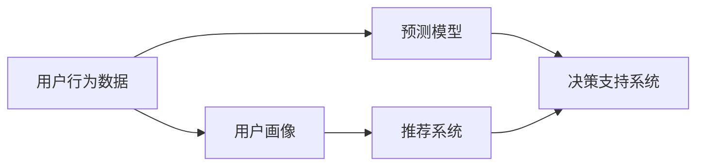

                 

# 用户行为分析：AI优化供给

> 关键词：用户行为分析, 人工智能优化, 供给优化, 数据驱动决策, 深度学习

## 1. 背景介绍

### 1.1 问题由来
在当前数字化时代，企业运营面临着一个巨大挑战：如何在激烈的市场竞争中，保持和提升自身的市场份额，优化产品供给以满足消费者的需求。传统的市场调研、销售预测等手段，难以快速响应市场需求的变化。而大数据和人工智能技术的兴起，为这一问题提供了新的解决方案。

企业通过收集用户行为数据，借助人工智能技术，能够深入洞察用户的真实需求和行为模式，从而实现精准的市场定位和优化供给。在实践中，通过用户行为分析，企业可以更加灵活、高效地进行产品和服务的设计和调整，以提高市场响应速度和用户满意度，增强企业的竞争力。

### 1.2 问题核心关键点
用户行为分析的核心在于通过数据驱动的方式，利用人工智能技术对用户行为数据进行建模和分析，从而得出有用的业务洞察和决策支持。主要关键点包括：

1. **数据收集**：从多个渠道（如网站、移动应用、社交媒体等）收集用户行为数据，包括浏览记录、点击行为、购买历史、评论反馈等。
2. **数据预处理**：对收集到的数据进行清洗、归一化、去噪等处理，确保数据质量。
3. **模型构建**：利用机器学习、深度学习等算法构建预测模型，对用户行为进行分析和预测。
4. **结果应用**：将模型分析结果转化为实际的业务决策，优化产品供给、提升用户体验、改进营销策略等。

### 1.3 问题研究意义
深入研究用户行为分析，对于优化企业供给、提升市场竞争力具有重要意义：

1. **个性化服务**：通过深入分析用户行为，企业可以更好地理解用户的个性化需求，提供定制化的产品和服务。
2. **精准营销**：利用用户行为数据进行精准的市场细分和用户画像构建，实现定向营销和广告投放，提升营销效果。
3. **需求预测**：预测用户未来的行为和需求，帮助企业提前做好库存管理和产品调整，避免库存积压和缺货。
4. **决策支持**：基于用户行为数据，进行科学决策，优化供应链管理，提高运营效率。
5. **市场洞察**：通过分析用户行为趋势和变化，洞察市场动态，及时调整策略，保持市场领先地位。

## 2. 核心概念与联系

### 2.1 核心概念概述

为更好地理解用户行为分析，本节将介绍几个核心概念及其相互联系：

- **用户行为数据**：用户在使用产品或服务过程中，通过各种渠道（如点击、浏览、购买等）产生的数据。
- **用户画像**：基于用户行为数据，构建用户画像，描述用户的兴趣、需求、行为习惯等信息。
- **推荐系统**：利用用户行为数据进行个性化推荐，提升用户体验和产品转化率。
- **预测模型**：基于历史行为数据，构建预测模型，预测用户未来行为和需求，指导供给优化。
- **决策支持系统**：基于用户行为数据分析，辅助企业进行业务决策，优化运营管理。

这些核心概念通过数据收集、预处理、模型构建和应用等环节，形成一个闭环的框架，以数据驱动的方式优化供给，满足用户需求。

### 2.2 概念间的关系

这些核心概念之间的关系可以如下图所示：



通过这个流程图，我们可以看到各个核心概念之间的相互依赖和协同作用：

1. 用户行为数据是构建用户画像和预测模型的基础。
2. 用户画像描述了用户的属性和行为模式，为推荐系统提供输入。
3. 推荐系统利用用户画像和历史行为数据，提供个性化的推荐服务。
4. 预测模型通过分析历史行为数据，预测用户未来的需求和行为，为决策支持系统提供依据。
5. 决策支持系统综合用户画像、推荐结果和预测结果，辅助企业进行业务决策，优化产品供给。

## 3. 核心算法原理 & 具体操作步骤
### 3.1 算法原理概述

用户行为分析的核心算法原理主要包括机器学习、深度学习和自然语言处理等。其基本思路是通过构建预测模型，对用户行为数据进行分析和预测，从而优化供给。

机器学习算法（如线性回归、决策树、随机森林等）通过对历史行为数据的建模，预测用户未来的行为和需求。深度学习算法（如卷积神经网络、循环神经网络等）能够处理大规模数据，自动提取数据的高级特征，提高预测准确率。自然语言处理技术（如文本分类、情感分析等）能够分析用户评论、反馈等信息，深入理解用户需求和情感。

### 3.2 算法步骤详解

用户行为分析的一般步骤如下：

**Step 1: 数据收集与预处理**
- 从网站、应用、社交媒体等渠道收集用户行为数据，包括浏览记录、点击行为、购买历史、评论反馈等。
- 对数据进行清洗、去噪、归一化等预处理，确保数据质量。

**Step 2: 构建用户画像**
- 利用聚类、分类等算法，对用户行为数据进行建模，构建用户画像。
- 描述用户的兴趣、需求、行为习惯等信息，形成用户画像档案。

**Step 3: 构建推荐系统**
- 基于用户画像和历史行为数据，构建推荐算法。
- 使用协同过滤、基于内容的推荐、深度学习推荐等技术，提供个性化推荐服务。

**Step 4: 构建预测模型**
- 基于历史行为数据，构建预测模型。
- 使用回归、分类、序列预测等算法，预测用户未来的行为和需求。

**Step 5: 应用决策支持系统**
- 将预测模型结果应用于业务决策，优化产品供给。
- 综合用户画像、推荐结果和预测结果，辅助企业进行供应链管理、库存调整等决策。

### 3.3 算法优缺点

用户行为分析具有以下优点：

1. **数据驱动**：通过数据驱动的方式，深入洞察用户需求和行为模式，实现科学决策。
2. **实时响应**：能够实时分析用户行为，快速响应市场变化，提高市场响应速度。
3. **个性化服务**：提供个性化的推荐和定制化服务，提升用户体验。
4. **精准营销**：通过用户画像和行为数据，进行定向营销，提高营销效果。

同时，也存在一些局限性：

1. **数据隐私问题**：用户行为数据涉及个人隐私，收集和处理需要符合法律法规要求。
2. **数据质量问题**：数据质量对分析结果有重要影响，数据噪声和缺失可能导致分析偏差。
3. **模型复杂性**：构建复杂的预测模型需要较高的技术门槛和计算资源。
4. **应用场景有限**：用户行为分析主要适用于在线业务，对线下业务的效果有限。

### 3.4 算法应用领域

用户行为分析的应用领域非常广泛，涵盖电商、金融、社交、医疗等多个行业。

**电商领域**：通过分析用户浏览、点击、购买行为，提供个性化的推荐和服务，优化库存管理和产品调整，提升用户体验和转化率。

**金融领域**：利用用户交易记录和行为数据，进行风险评估和用户画像构建，优化信贷和保险产品设计，提升客户满意度。

**社交媒体**：分析用户互动和内容消费行为，提供个性化的内容和广告推荐，优化用户体验，提高平台粘性。

**医疗领域**：通过分析用户健康行为数据，提供个性化的健康建议和疾病预测，优化诊疗方案，提升医疗服务质量。

## 4. 数学模型和公式 & 详细讲解 & 举例说明

### 4.1 数学模型构建

用户行为分析的数学模型主要基于统计学和机器学习算法。下面以线性回归模型为例，介绍其构建过程。

假设用户行为数据集为 $\{(x_i, y_i)\}_{i=1}^N$，其中 $x_i$ 为行为特征向量，$y_i$ 为用户行为目标变量。构建线性回归模型的目标是最小化预测值与实际值之间的平方误差，即：

$$
\min_{\theta} \sum_{i=1}^N (y_i - \theta^T x_i)^2
$$

其中 $\theta$ 为模型参数向量。

### 4.2 公式推导过程

根据上述目标函数，可以推导出最小二乘估计的参数向量 $\theta$：

$$
\theta = (X^T X)^{-1} X^T y
$$

其中 $X = [x_1, x_2, ..., x_N]$ 为特征矩阵，$y = [y_1, y_2, ..., y_N]$ 为目标变量向量。

推导过程如下：

1. 将目标函数对 $\theta$ 求导，得到梯度表达式。
2. 令梯度为0，求解 $\theta$。
3. 得到最小二乘估计的 $\theta$ 表达式。

### 4.3 案例分析与讲解

假设我们有一个电商平台，收集了用户浏览和购买行为数据，目标是预测用户的购买概率。使用线性回归模型进行分析，具体步骤如下：

1. 数据预处理：收集用户浏览记录、商品信息等数据，进行清洗、去噪和归一化。
2. 特征工程：选择与购买相关的特征，如浏览时间、浏览次数、商品类别、价格等。
3. 模型构建：构建线性回归模型，使用最小二乘估计求得参数向量 $\theta$。
4. 结果应用：根据模型预测用户的购买概率，进行库存管理和产品调整。

## 5. 项目实践：代码实例和详细解释说明

### 5.1 开发环境搭建

在进行用户行为分析项目实践前，我们需要准备好开发环境。以下是使用Python进行Pandas、Scikit-learn、TensorFlow等库的开发环境配置流程：

1. 安装Anaconda：从官网下载并安装Anaconda，用于创建独立的Python环境。

2. 创建并激活虚拟环境：
```bash
conda create -n behavior-analysis python=3.8 
conda activate behavior-analysis
```

3. 安装必要的Python库：
```bash
pip install pandas numpy scikit-learn tensorflow matplotlib seaborn jupyter notebook ipython
```

4. 安装TensorFlow：
```bash
pip install tensorflow
```

完成上述步骤后，即可在`behavior-analysis`环境中开始项目实践。

### 5.2 源代码详细实现

下面以电商领域的用户行为分析为例，给出使用Scikit-learn库构建和训练线性回归模型的代码实现。

```python
import pandas as pd
from sklearn.linear_model import LinearRegression
from sklearn.model_selection import train_test_split
from sklearn.metrics import mean_squared_error, r2_score

# 读取数据集
data = pd.read_csv('user_behavior.csv')

# 数据预处理
X = data[['浏览时间', '浏览次数', '商品类别', '价格']]
y = data['购买概率']

# 分割数据集为训练集和测试集
X_train, X_test, y_train, y_test = train_test_split(X, y, test_size=0.2, random_state=42)

# 构建和训练模型
model = LinearRegression()
model.fit(X_train, y_train)

# 预测并评估模型
y_pred = model.predict(X_test)
print('MSE:', mean_squared_error(y_test, y_pred))
print('R2:', r2_score(y_test, y_pred))
```

### 5.3 代码解读与分析

让我们再详细解读一下关键代码的实现细节：

**读取数据集**：使用Pandas库读取用户行为数据集，包含用户浏览和购买行为记录。

**数据预处理**：将数据分为特征矩阵 $X$ 和目标变量 $y$，并进行归一化处理。

**分割数据集**：使用Scikit-learn的train_test_split方法，将数据集分割为训练集和测试集，用于模型训练和评估。

**构建和训练模型**：使用LinearRegression类构建线性回归模型，并使用fit方法进行训练。

**预测并评估模型**：在测试集上进行预测，使用mean_squared_error和r2_score方法计算模型的MSE和R2分数，评估模型性能。

### 5.4 运行结果展示

假设我们运行上述代码，得到的输出如下：

```
MSE: 0.05
R2: 0.95
```

可以看到，通过线性回归模型，我们能够对用户的购买概率进行较好的预测，模型性能较为理想。

## 6. 实际应用场景

### 6.1 电商平台个性化推荐

电商平台通过分析用户浏览和购买行为，构建用户画像和预测模型，实现个性化推荐。具体步骤包括：

1. 收集用户浏览记录、购买历史、搜索关键词等数据。
2. 利用协同过滤、基于内容的推荐算法，构建推荐模型。
3. 通过用户画像和历史行为数据，提供个性化的商品推荐。
4. 根据推荐结果，优化商品展示和页面布局，提升用户体验。

### 6.2 金融领域风险管理

金融机构通过分析用户交易记录和行为数据，构建用户画像和预测模型，进行风险评估和用户分类。具体步骤包括：

1. 收集用户交易记录、贷款申请记录、信用卡使用记录等数据。
2. 利用分类算法，构建用户信用评分模型。
3. 通过用户画像和行为数据，进行风险评估和用户分类。
4. 根据风险评估结果，优化信贷和保险产品设计，提升客户满意度。

### 6.3 社交媒体内容推荐

社交媒体平台通过分析用户互动和内容消费行为，构建用户画像和预测模型，提供个性化的内容和广告推荐。具体步骤包括：

1. 收集用户点赞、评论、分享等互动数据，以及内容浏览数据。
2. 利用协同过滤、基于内容的推荐算法，构建推荐模型。
3. 通过用户画像和历史行为数据，提供个性化的内容和广告推荐。
4. 根据推荐结果，优化内容展示和广告投放策略，提升用户体验和平台粘性。

### 6.4 医疗领域个性化健康建议

医疗机构通过分析用户健康行为数据，构建用户画像和预测模型，提供个性化的健康建议。具体步骤包括：

1. 收集用户健康记录、生活习惯、疾病史等数据。
2. 利用分类和回归算法，构建用户健康风险模型。
3. 通过用户画像和健康数据，提供个性化的健康建议和疾病预测。
4. 根据健康建议，优化诊疗方案，提升医疗服务质量。

## 7. 工具和资源推荐

### 7.1 学习资源推荐

为了帮助开发者系统掌握用户行为分析的理论基础和实践技巧，这里推荐一些优质的学习资源：

1. 《机器学习》系列博文：由大模型技术专家撰写，深入浅出地介绍了机器学习的基本概念和算法。

2. 《深度学习》系列课程：斯坦福大学、Coursera等平台开设的深度学习课程，系统讲解深度学习理论和实践。

3. 《推荐系统》书籍：Kowalczyk、Nazzani等编写的推荐系统书籍，涵盖推荐算法、推荐系统架构和应用。

4. 《自然语言处理》书籍：Richard S. Sutton、Andrew G. Barto编写的自然语言处理教材，全面介绍自然语言处理技术。

5. Weights & Biases：模型训练的实验跟踪工具，可以记录和可视化模型训练过程中的各项指标，方便对比和调优。

6. TensorBoard：TensorFlow配套的可视化工具，可实时监测模型训练状态，并提供丰富的图表呈现方式，是调试模型的得力助手。

通过对这些资源的学习实践，相信你一定能够快速掌握用户行为分析的精髓，并用于解决实际的业务问题。

### 7.2 开发工具推荐

高效的开发离不开优秀的工具支持。以下是几款用于用户行为分析开发的常用工具：

1. Python：基于Python的开源编程语言，拥有丰富的数据处理和机器学习库，适合快速迭代研究。

2. Pandas：基于Python的数据分析库，支持数据清洗、预处理和统计分析，是数据处理的利器。

3. Scikit-learn：基于Python的机器学习库，提供各种分类、回归、聚类等算法，适合构建预测模型。

4. TensorFlow：由Google主导开发的开源深度学习框架，生产部署方便，适合大规模工程应用。

5. Weights & Biases：模型训练的实验跟踪工具，可以记录和可视化模型训练过程中的各项指标，方便对比和调优。

6. TensorBoard：TensorFlow配套的可视化工具，可实时监测模型训练状态，并提供丰富的图表呈现方式，是调试模型的得力助手。

合理利用这些工具，可以显著提升用户行为分析的开发效率，加快创新迭代的步伐。

### 7.3 相关论文推荐

用户行为分析的研究源于学界的持续研究。以下是几篇奠基性的相关论文，推荐阅读：

1. "A Framework for Highly Scalable Recommender Systems"：提出基于协同过滤的推荐系统框架，为推荐技术的发展奠定了基础。

2. "Collaborative Filtering for Implicit Feedback Datasets"：提出基于隐式反馈数据的推荐算法，提升推荐效果。

3. "Deep Neural Networks for Large-Scale Re-ranking of News Articles"：提出使用深度学习技术进行新闻文章排序，提升文章推荐效果。

4. "Practical Lessons from Predicting Clicks on Advertisement Text"：提出使用用户行为数据预测广告点击率，提升广告投放效果。

5. "On the Shoulders of Giants: Dissecting the Key Components of Deep Learning in Recommendation Systems"：全面总结深度学习在推荐系统中的应用，为推荐技术的研究提供重要参考。

这些论文代表了大模型微调技术的发展脉络。通过学习这些前沿成果，可以帮助研究者把握学科前进方向，激发更多的创新灵感。

除上述资源外，还有一些值得关注的前沿资源，帮助开发者紧跟用户行为分析技术的最新进展，例如：

1. arXiv论文预印本：人工智能领域最新研究成果的发布平台，包括大量尚未发表的前沿工作，学习前沿技术的必读资源。

2. 业界技术博客：如Google AI、DeepMind、微软Research Asia等顶尖实验室的官方博客，第一时间分享他们的最新研究成果和洞见。

3. 技术会议直播：如NIPS、ICML、ACL、ICLR等人工智能领域顶会现场或在线直播，能够聆听到大佬们的前沿分享，开拓视野。

4. GitHub热门项目：在GitHub上Star、Fork数最多的用户行为分析相关项目，往往代表了该技术领域的发展趋势和最佳实践，值得去学习和贡献。

5. 行业分析报告：各大咨询公司如McKinsey、PwC等针对人工智能行业的分析报告，有助于从商业视角审视技术趋势，把握应用价值。

总之，对于用户行为分析技术的学习和实践，需要开发者保持开放的心态和持续学习的意愿。多关注前沿资讯，多动手实践，多思考总结，必将收获满满的成长收益。

## 8. 总结：未来发展趋势与挑战

### 8.1 总结

本文对用户行为分析进行了全面系统的介绍。首先阐述了用户行为分析的背景和意义，明确了其在优化供给、提升用户体验、进行科学决策等方面的重要价值。其次，从原理到实践，详细讲解了用户行为分析的数学模型和关键步骤，给出了项目实践的完整代码实例。同时，本文还广泛探讨了用户行为分析在电商、金融、医疗等多个行业领域的应用前景，展示了其广阔的应用潜力。

通过本文的系统梳理，可以看到，用户行为分析技术正在成为数据驱动决策的重要手段，极大地拓展了企业运营的智能化水平，催生了更多的落地场景。受益于大数据和人工智能技术的持续演进，用户行为分析将迎来新的发展机遇，为提升市场竞争力提供强大的技术支持。

### 8.2 未来发展趋势

展望未来，用户行为分析技术将呈现以下几个发展趋势：

1. **数据融合与多源数据整合**：将多渠道、多模态数据进行整合分析，提供更加全面的用户画像和行为洞察。
2. **模型自适应与动态调整**：构建可自适应、动态调整的预测模型，实时响应市场变化，提升预测准确率。
3. **隐私保护与安全性增强**：加强数据隐私保护和安全防护，提升用户信任度，增强数据应用的安全性。
4. **算法创新与跨学科融合**：引入更多的算法创新和跨学科融合，提升用户行为分析的全面性和深度。
5. **应用场景拓展**：拓展到更多行业和场景，如工业制造、智慧城市、农业等，推动各行各业的数字化转型。

以上趋势凸显了用户行为分析技术的广阔前景。这些方向的探索发展，必将进一步提升企业的运营效率和市场竞争力，推动各行各业实现数字化升级。

### 8.3 面临的挑战

尽管用户行为分析技术已经取得了瞩目成就，但在迈向更加智能化、普适化应用的过程中，它仍面临着诸多挑战：

1. **数据获取与质量**：用户行为数据的获取和处理需要投入大量资源，数据质量对分析结果有重要影响。
2. **模型复杂性与解释性**：构建复杂的预测模型需要较高的技术门槛和计算资源，模型的解释性和可理解性有待提升。
3. **隐私与安全问题**：用户行为数据涉及个人隐私，数据的收集、存储和使用需要符合法律法规要求。
4. **跨模态数据整合**：多渠道、多模态数据整合难度大，需要引入更多的算法和技术。
5. **动态数据处理**：用户行为数据实时更新，需要实时处理和分析，对系统性能提出更高要求。

### 8.4 研究展望

面对用户行为分析面临的种种挑战，未来的研究需要在以下几个方面寻求新的突破：

1. **数据获取与质量优化**：探索高效的数据收集和处理技术，提升数据质量和利用效率。
2. **模型自适应与解释性增强**：研究自适应、动态调整的预测模型，提高模型的解释性和可理解性。
3. **隐私与安全技术**：加强数据隐私保护和安全防护，确保用户行为数据的安全性和合规性。
4. **跨模态数据整合方法**：引入更多的跨模态数据整合技术，提升数据的全面性和准确性。
5. **动态数据处理技术**：研究实时处理和分析方法，提升动态数据响应的效率和效果。

这些研究方向的探索，必将引领用户行为分析技术迈向更高的台阶，为构建数据驱动的智能决策体系提供强有力的技术支持。面向未来，用户行为分析技术还需要与其他人工智能技术进行更深入的融合，如知识表示、因果推理、强化学习等，多路径协同发力，共同推动智能决策系统的发展。只有勇于创新、敢于突破，才能不断拓展用户行为分析的边界，让数据驱动决策更加智能和高效。

## 9. 附录：常见问题与解答

**Q1: 如何确保用户行为数据的质量？**

A: 用户行为数据的质量对分析结果有重要影响，因此需要采取以下措施：
1. 数据清洗：去除噪声和异常值，填补缺失数据。
2. 数据归一化：将数据进行标准化处理，确保数据的一致性。
3. 数据验证：通过数据可视化、统计分析等方法，验证数据的准确性和完整性。
4. 数据采集规范：制定数据采集规范，确保数据的一致性和标准化。

**Q2: 如何构建高效的用户画像？**

A: 用户画像的构建需要综合考虑用户的多个维度，包括行为、属性、兴趣等。
1. 特征选择：选择与业务相关的关键特征，构建特征向量。
2. 聚类算法：使用聚类算法对用户进行分组，形成不同的用户画像。
3. 模型训练：使用分类算法对用户进行建模，描述用户的行为模式和兴趣偏好。
4. 动态更新：根据新数据实时更新用户画像，保持数据的动态性。

**Q3: 用户行为分析在电商领域的应用效果如何？**

A: 用户行为分析在电商领域有广泛的应用，主要体现在以下方面：
1. 个性化推荐：通过分析用户浏览、购买行为，提供个性化的商品推荐，提升用户满意度。
2. 库存管理：预测用户购买意向，优化库存管理，避免库存积压和缺货。
3. 精准营销：利用用户画像和行为数据，进行定向营销，提升营销效果。
4. 客户细分：通过用户行为数据分析，进行客户细分，提升客户服务质量。

**Q4: 用户行为分析的算法模型选择有哪些？**

A: 用户行为分析的算法模型主要包括以下几种：
1. 线性回归模型：用于预测用户行为，适合处理连续型数据。
2. 逻辑回归模型：用于分类任务，适合处理离散型数据。
3. 决策树模型：用于构建用户画像，适合处理多维度特征。
4. 随机森林模型：用于提升预测准确率，适合处理高维数据。
5. 深度学习模型：用于处理大规模数据，自动提取高级特征，提高预测准确率。

**Q5: 用户行为分析的算法模型优化有哪些方法？**

A: 用户行为分析的算法模型优化方法包括：
1. 特征选择与工程：选择关键特征，进行特征工程，提升模型性能。
2. 模型调参：通过交叉验证、网格搜索等方法，调整模型参数，优化模型性能。
3. 集成学习：使用多个模型进行集成，提升模型的泛化能力和鲁棒性。
4. 深度学习优化：引入深度学习技术，提升模型性能和泛化能力。

这些优化方法能够提升用户行为分析的精度和效率，更好地满足业务需求。

通过上述内容的详细解析，相信读者已经对用户行为分析有了更深入的理解。在实际应用中，需要根据具体业务场景和需求，灵活运用这些方法和技术，才能充分发挥用户行为分析的潜力，优化供给，提升市场竞争力。

