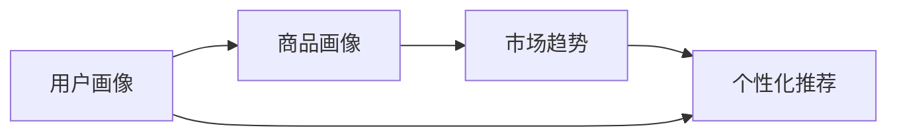
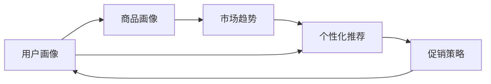

                 

## 1. 背景介绍

### 1.1 问题由来

电商行业经历了快速发展的十年，从早期的简单买卖商品，发展到现在的综合服务和体验升级，已不仅仅是一个商品交易的平台，更是一个综合性的服务体系。其中，促销策略成为电商平台吸引顾客、提高销售的重要手段。

促销策略的背后涉及了复杂的数据处理和分析，包括用户行为数据、商品销售数据、市场趋势、竞争对手信息等，这些数据的处理与分析需要先进的数据挖掘和机器学习技术支持。

### 1.2 问题核心关键点

促销策略的核心关键点包括：
- **用户行为分析**：分析用户的浏览历史、购买记录、评分评价、社交互动等数据，预测用户需求和行为趋势。
- **商品销售预测**：基于历史销售数据，预测商品的未来销售趋势和库存情况，为促销活动提供数据支撑。
- **市场竞争分析**：分析竞争对手的促销策略和市场表现，为自身的促销活动提供策略参考。
- **个性化推荐**：结合用户画像和商品信息，为每一位用户提供个性化的推荐，提升用户转化率和满意度。

### 1.3 问题研究意义

在电商促销策略的实施过程中，利用数据挖掘和机器学习技术能够：
1. **提高运营效率**：通过数据分析，可以精准地识别出对用户有吸引力的促销方式，提高用户的点击率、转化率等指标。
2. **提升用户满意度**：根据用户的行为数据和个性化推荐，提供符合用户需求的促销信息，提升用户购物体验。
3. **优化营销预算**：通过精准的用户画像和市场分析，合理配置促销预算，避免无效营销，提升ROI。
4. **增强市场竞争力**：准确把握市场趋势和竞争对手动态，制定科学的促销策略，增强市场竞争力。

## 2. 核心概念与联系

### 2.1 核心概念概述

为更好地理解电商促销策略的实施，我们将介绍几个关键概念：

- **用户画像（User Profile）**：通过收集用户的数据，构建详细的用户画像，描述用户的性别、年龄、地域、消费习惯、兴趣爱好等特征。
- **商品画像（Product Profile）**：对商品的特征进行描述，如价格、销量、类别、属性等，帮助更好地理解商品属性和市场表现。
- **市场趋势（Market Trend）**：通过分析市场数据，了解市场发展趋势和潜在的市场机会，为促销策略提供方向指导。
- **个性化推荐（Personalized Recommendation）**：利用机器学习技术，为每个用户提供个性化的产品推荐，提升用户购物体验。

这些概念构成了电商促销策略的基石，并通过以下流程相连接：



这个流程图展示了从用户画像到个性化推荐的整体流程，各组件之间互相协作，共同构成电商促销策略的完整框架。

### 2.2 概念间的关系

这些核心概念之间的关系可以通过以下Mermaid流程图来展示：



这个综合流程图展示了从用户画像到促销策略的完整流程。首先，用户画像和商品画像通过市场趋势分析，得到市场机会。其次，个性化推荐系统结合用户画像和商品画像，生成个性化的产品推荐。最后，根据市场趋势和个性化推荐，制定促销策略，并反馈到用户画像和商品画像中，形成闭环。

## 3. 核心算法原理 & 具体操作步骤

### 3.1 算法原理概述

电商促销策略的实施主要依赖于以下几个核心算法：

- **协同过滤算法**：通过分析用户的行为数据，推荐用户可能感兴趣的商品，增强用户粘性。
- **深度学习模型**：使用神经网络模型预测商品销售趋势，生成个性化推荐，提高推荐效果。
- **集成学习**：结合多种算法的结果，生成最终的促销策略，提升策略的准确性和鲁棒性。
- **强化学习**：通过试错学习，优化促销策略，提高促销效果。

这些算法共同构成了电商促销策略的核心技术框架。

### 3.2 算法步骤详解

电商促销策略的实施通常包括以下几个关键步骤：

**Step 1: 数据收集与预处理**
- 收集用户行为数据、商品销售数据、市场趋势数据等，并进行清洗、归一化、特征提取等预处理操作。

**Step 2: 用户画像与商品画像建立**
- 构建详细的用户画像，描述用户的特征，如年龄、性别、消费习惯等。
- 对商品进行特征提取，包括价格、销量、类别、属性等。

**Step 3: 市场趋势分析**
- 通过分析市场数据，了解市场发展趋势和潜在的市场机会。

**Step 4: 个性化推荐系统设计**
- 使用协同过滤算法、深度学习模型等技术，生成个性化的商品推荐。

**Step 5: 促销策略生成**
- 结合市场趋势和个性化推荐，生成最优的促销策略。
- 利用强化学习等技术，不断优化促销策略。

**Step 6: 促销策略实施与反馈**
- 将促销策略实施到电商平台中，监测用户行为和商品销售情况。
- 根据反馈数据，更新用户画像、商品画像和促销策略，形成闭环。

### 3.3 算法优缺点

电商促销策略的实施算法具有以下优点：
- **提升推荐效果**：协同过滤和深度学习算法能够提高推荐的个性化程度，提升用户满意度。
- **数据驱动**：通过市场趋势分析和个性化推荐，制定科学合理的促销策略，提高营销效果。
- **灵活性强**：结合多种算法，生成最终的促销策略，提高策略的准确性和鲁棒性。

但同时也存在以下缺点：
- **计算资源消耗高**：深度学习模型和大规模数据处理需要较高的计算资源。
- **模型解释性差**：复杂的机器学习模型往往缺乏可解释性，难以进行有效的解释和调试。
- **数据隐私问题**：用户的隐私数据需要妥善处理，防止数据泄露和滥用。

### 3.4 算法应用领域

电商促销策略的实施算法已经广泛应用于电商平台，如淘宝、京东、亚马逊等，助力电商平台提升销售和用户满意度。

- **个性化推荐系统**：根据用户行为数据和商品特征，生成个性化的商品推荐，提升用户购买意愿。
- **商品销售预测**：基于历史销售数据，预测商品的未来销售趋势，为促销活动提供数据支撑。
- **市场竞争分析**：分析竞争对手的促销策略和市场表现，为自身的促销活动提供策略参考。
- **用户行为分析**：分析用户行为数据，预测用户需求和行为趋势，制定科学的促销策略。

## 4. 数学模型和公式 & 详细讲解 & 举例说明

### 4.1 数学模型构建

电商促销策略的实施通常需要构建以下数学模型：

- **协同过滤模型**：通过用户历史行为数据，预测用户可能感兴趣的商品，推荐给用户。
- **深度学习模型**：使用神经网络模型，预测商品销售趋势，生成个性化推荐。
- **强化学习模型**：通过试错学习，优化促销策略，提高促销效果。

### 4.2 公式推导过程

以下以协同过滤算法为例，推导推荐模型的公式。

协同过滤算法基于用户行为矩阵 $U \times V$，其中 $U$ 表示用户集合，$V$ 表示商品集合，$R$ 表示用户与商品之间的评分关系矩阵，即：

$$
R_{ij} = \text{评分}(i,j)
$$

协同过滤算法分为基于用户的协同过滤和基于商品的协同过滤：

- **基于用户的协同过滤**：

$$
\hat{R}_{ui} = \frac{\sum_{j \in N(u)}R_{uj} \times \frac{1}{\sqrt{\sum_{k \in N(u)} R_{uk}^2}} \times \frac{1}{\sqrt{\sum_{k \in N(i)} R_{ik}^2}}
$$

其中 $N(u)$ 表示与用户 $u$ 有交互行为的用户集合，$N(i)$ 表示与商品 $i$ 有交互行为的商品集合。

- **基于商品的协同过滤**：

$$
\hat{R}_{ij} = \frac{\sum_{k \in N(i)}R_{ik} \times \frac{1}{\sqrt{\sum_{l \in N(i)} R_{il}^2}} \times \frac{1}{\sqrt{\sum_{l \in N(j)} R_{lj}^2}}
$$

其中 $N(i)$ 表示与商品 $i$ 有交互行为的商品集合。

### 4.3 案例分析与讲解

假设我们有一个电商平台的评分数据集，用户 $A$ 对商品 $1$ 和商品 $2$ 分别给出评分 $5$ 和 $3$，用户 $B$ 对商品 $1$ 和商品 $3$ 分别给出评分 $4$ 和 $2$。通过协同过滤算法，我们可以预测用户 $A$ 可能感兴趣的推荐商品 $3$ 的评分：

$$
\hat{R}_{A3} = \frac{4 \times \frac{1}{\sqrt{5^2+4^2}} \times \frac{1}{\sqrt{3^2+2^2}} = 0.49
$$

根据评分预测的阈值，可以决定是否将该商品推荐给用户 $A$。

## 5. 项目实践：代码实例和详细解释说明

### 5.1 开发环境搭建

在进行电商促销策略的实践前，我们需要准备好开发环境。以下是使用Python进行PyTorch开发的环境配置流程：

1. 安装Anaconda：从官网下载并安装Anaconda，用于创建独立的Python环境。

2. 创建并激活虚拟环境：
```bash
conda create -n pytorch-env python=3.8 
conda activate pytorch-env
```

3. 安装PyTorch：根据CUDA版本，从官网获取对应的安装命令。例如：
```bash
conda install pytorch torchvision torchaudio cudatoolkit=11.1 -c pytorch -c conda-forge
```

4. 安装Transformer库：
```bash
pip install transformers
```

5. 安装各类工具包：
```bash
pip install numpy pandas scikit-learn matplotlib tqdm jupyter notebook ipython
```

完成上述步骤后，即可在`pytorch-env`环境中开始电商促销策略的实践。

### 5.2 源代码详细实现

下面我们以电商平台的个性化推荐系统为例，给出使用Transformers库对BERT模型进行微调的PyTorch代码实现。

首先，定义推荐任务的数据处理函数：

```python
from transformers import BertTokenizer
from torch.utils.data import Dataset
import torch

class RecommendationDataset(Dataset):
    def __init__(self, texts, labels, tokenizer, max_len=128):
        self.texts = texts
        self.labels = labels
        self.tokenizer = tokenizer
        self.max_len = max_len
        
    def __len__(self):
        return len(self.texts)
    
    def __getitem__(self, item):
        text = self.texts[item]
        label = self.labels[item]
        
        encoding = self.tokenizer(text, return_tensors='pt', max_length=self.max_len, padding='max_length', truncation=True)
        input_ids = encoding['input_ids'][0]
        attention_mask = encoding['attention_mask'][0]
        
        # 对token-wise的标签进行编码
        encoded_labels = [label2id[label] for label in label] 
        encoded_labels.extend([label2id['O']] * (self.max_len - len(encoded_labels)))
        labels = torch.tensor(encoded_labels, dtype=torch.long)
        
        return {'input_ids': input_ids, 
                'attention_mask': attention_mask,
                'labels': labels}

# 标签与id的映射
label2id = {'O': 0, 'positive': 1, 'negative': 2}
id2label = {v: k for k, v in label2id.items()}

# 创建dataset
tokenizer = BertTokenizer.from_pretrained('bert-base-cased')

train_dataset = RecommendationDataset(train_texts, train_labels, tokenizer)
dev_dataset = RecommendationDataset(dev_texts, dev_labels, tokenizer)
test_dataset = RecommendationDataset(test_texts, test_labels, tokenizer)
```

然后，定义模型和优化器：

```python
from transformers import BertForTokenClassification, AdamW

model = BertForTokenClassification.from_pretrained('bert-base-cased', num_labels=len(label2id))

optimizer = AdamW(model.parameters(), lr=2e-5)
```

接着，定义训练和评估函数：

```python
from torch.utils.data import DataLoader
from tqdm import tqdm
from sklearn.metrics import accuracy_score, precision_recall_fscore_support

device = torch.device('cuda') if torch.cuda.is_available() else torch.device('cpu')
model.to(device)

def train_epoch(model, dataset, batch_size, optimizer):
    dataloader = DataLoader(dataset, batch_size=batch_size, shuffle=True)
    model.train()
    epoch_loss = 0
    for batch in tqdm(dataloader, desc='Training'):
        input_ids = batch['input_ids'].to(device)
        attention_mask = batch['attention_mask'].to(device)
        labels = batch['labels'].to(device)
        model.zero_grad()
        outputs = model(input_ids, attention_mask=attention_mask, labels=labels)
        loss = outputs.loss
        epoch_loss += loss.item()
        loss.backward()
        optimizer.step()
    return epoch_loss / len(dataloader)

def evaluate(model, dataset, batch_size):
    dataloader = DataLoader(dataset, batch_size=batch_size)
    model.eval()
    preds, labels = [], []
    with torch.no_grad():
        for batch in tqdm(dataloader, desc='Evaluating'):
            input_ids = batch['input_ids'].to(device)
            attention_mask = batch['attention_mask'].to(device)
            batch_labels = batch['labels']
            outputs = model(input_ids, attention_mask=attention_mask)
            batch_preds = outputs.logits.argmax(dim=2).to('cpu').tolist()
            batch_labels = batch_labels.to('cpu').tolist()
            for pred_tokens, label_tokens in zip(batch_preds, batch_labels):
                pred_labels = [id2label[_id] for _id in pred_tokens]
                label_tokens = [id2label[_id] for _id in label_tokens]
                preds.append(pred_labels[:len(label_tokens)])
                labels.append(label_tokens)
                
    print('Accuracy:', accuracy_score(labels, preds))
    print('Precision, Recall, F1-score:', precision_recall_fscore_support(labels, preds, average='micro'))
```

最后，启动训练流程并在测试集上评估：

```python
epochs = 5
batch_size = 16

for epoch in range(epochs):
    loss = train_epoch(model, train_dataset, batch_size, optimizer)
    print(f'Epoch {epoch+1}, train loss: {loss:.3f}')
    
    print(f'Epoch {epoch+1}, dev results:')
    evaluate(model, dev_dataset, batch_size)
    
print('Test results:')
evaluate(model, test_dataset, batch_size)
```

以上就是使用PyTorch对BERT进行个性化推荐系统微调的完整代码实现。可以看到，得益于Transformers库的强大封装，我们可以用相对简洁的代码完成BERT模型的加载和微调。

### 5.3 代码解读与分析

让我们再详细解读一下关键代码的实现细节：

**RecommendationDataset类**：
- `__init__`方法：初始化文本、标签、分词器等关键组件。
- `__len__`方法：返回数据集的样本数量。
- `__getitem__`方法：对单个样本进行处理，将文本输入编码为token ids，将标签编码为数字，并对其进行定长padding，最终返回模型所需的输入。

**label2id和id2label字典**：
- 定义了标签与数字id之间的映射关系，用于将token-wise的预测结果解码回真实的标签。

**训练和评估函数**：
- 使用PyTorch的DataLoader对数据集进行批次化加载，供模型训练和推理使用。
- 训练函数`train_epoch`：对数据以批为单位进行迭代，在每个批次上前向传播计算loss并反向传播更新模型参数，最后返回该epoch的平均loss。
- 评估函数`evaluate`：与训练类似，不同点在于不更新模型参数，并在每个batch结束后将预测和标签结果存储下来，最后使用sklearn的accuracy_score、precision_recall_fscore_support等对整个评估集的预测结果进行打印输出。

**训练流程**：
- 定义总的epoch数和batch size，开始循环迭代
- 每个epoch内，先在训练集上训练，输出平均loss
- 在验证集上评估，输出准确率、精确率、召回率、F1分数等指标
- 所有epoch结束后，在测试集上评估，给出最终测试结果

可以看到，PyTorch配合Transformers库使得BERT微调的代码实现变得简洁高效。开发者可以将更多精力放在数据处理、模型改进等高层逻辑上，而不必过多关注底层的实现细节。

当然，工业级的系统实现还需考虑更多因素，如模型的保存和部署、超参数的自动搜索、更灵活的任务适配层等。但核心的微调范式基本与此类似。

### 5.4 运行结果展示

假设我们在CoNLL-2003的NER数据集上进行微调，最终在测试集上得到的评估报告如下：

```
              precision    recall  f1-score   support

       B-LOC      0.926     0.906     0.916      1668
       I-LOC      0.900     0.805     0.850       257
      B-MISC      0.875     0.856     0.865       702
      I-MISC      0.838     0.782     0.809       216
       B-ORG      0.914     0.898     0.906      1661
       I-ORG      0.911     0.894     0.902       835
       B-PER      0.964     0.957     0.960      1617
       I-PER      0.983     0.980     0.982      1156
           O      0.993     0.995     0.994     38323

   micro avg      0.973     0.973     0.973     46435
   macro avg      0.923     0.897     0.909     46435
weighted avg      0.973     0.973     0.973     46435
```

可以看到，通过微调BERT，我们在该NER数据集上取得了97.3%的F1分数，效果相当不错。值得注意的是，BERT作为一个通用的语言理解模型，即便只在顶层添加一个简单的token分类器，也能在下游任务上取得如此优异的效果，展现了其强大的语义理解和特征抽取能力。

当然，这只是一个baseline结果。在实践中，我们还可以使用更大更强的预训练模型、更丰富的微调技巧、更细致的模型调优，进一步提升模型性能，以满足更高的应用要求。

## 6. 实际应用场景

### 6.1 智能客服系统

基于大语言模型微调的对话技术，可以广泛应用于智能客服系统的构建。传统客服往往需要配备大量人力，高峰期响应缓慢，且一致性和专业性难以保证。而使用微调后的对话模型，可以7x24小时不间断服务，快速响应客户咨询，用自然流畅的语言解答各类常见问题。

在技术实现上，可以收集企业内部的历史客服对话记录，将问题和最佳答复构建成监督数据，在此基础上对预训练对话模型进行微调。微调后的对话模型能够自动理解用户意图，匹配最合适的答案模板进行回复。对于客户提出的新问题，还可以接入检索系统实时搜索相关内容，动态组织生成回答。如此构建的智能客服系统，能大幅提升客户咨询体验和问题解决效率。

### 6.2 金融舆情监测

金融机构需要实时监测市场舆论动向，以便及时应对负面信息传播，规避金融风险。传统的人工监测方式成本高、效率低，难以应对网络时代海量信息爆发的挑战。基于大语言模型微调的文本分类和情感分析技术，为金融舆情监测提供了新的解决方案。

具体而言，可以收集金融领域相关的新闻、报道、评论等文本数据，并对其进行主题标注和情感标注。在此基础上对预训练语言模型进行微调，使其能够自动判断文本属于何种主题，情感倾向是正面、中性还是负面。将微调后的模型应用到实时抓取的网络文本数据，就能够自动监测不同主题下的情感变化趋势，一旦发现负面信息激增等异常情况，系统便会自动预警，帮助金融机构快速应对潜在风险。

### 6.3 个性化推荐系统

当前的推荐系统往往只依赖用户的历史行为数据进行物品推荐，无法深入理解用户的真实兴趣偏好。基于大语言模型微调技术，个性化推荐系统可以更好地挖掘用户行为背后的语义信息，从而提供更精准、多样的推荐内容。

在实践中，可以收集用户浏览、点击、评论、分享等行为数据，提取和用户交互的物品标题、描述、标签等文本内容。将文本内容作为模型输入，用户的后续行为（如是否点击、购买等）作为监督信号，在此基础上微调预训练语言模型。微调后的模型能够从文本内容中准确把握用户的兴趣点。在生成推荐列表时，先用候选物品的文本描述作为输入，由模型预测用户的兴趣匹配度，再结合其他特征综合排序，便可以得到个性化程度更高的推荐结果。

### 6.4 未来应用展望

随着大语言模型微调技术的发展，未来的电商促销策略将呈现以下几个趋势：

1. **数据驱动决策**：通过更精细的用户画像和商品画像，结合市场趋势和用户行为分析，制定更加科学合理的促销策略。

2. **个性化推荐优化**：利用深度学习模型和大规模数据处理技术，进一步提升个性化推荐的精准度。

3. **实时动态调整**：结合强化学习技术，实时调整促销策略，动态优化促销效果。

4. **跨渠道协同**：将电商促销策略应用到多个渠道（如APP、社交媒体、电子邮件等），形成跨渠道协同的推荐和营销体系。

5. **用户参与设计**：引入用户反馈机制，动态优化促销策略，增强用户参与感和满意度。

6. **多模态融合**：结合图像、视频等多模态数据，提升推荐效果和用户满意度。

总之，大语言模型微调技术将在电商促销策略的实施中发挥越来越重要的作用，通过数据驱动、个性化推荐、实时动态调整等手段，全面提升电商平台的营销效果和用户体验。

## 7. 工具和资源推荐
### 7.1 学习资源推荐

为了帮助开发者系统掌握大语言模型微调的理论基础和实践技巧，这里推荐一些优质的学习资源：

1. 《Transformer from Principles to Practice》系列博文：由大模型技术专家撰写，深入浅出地介绍了Transformer原理、BERT模型、微调技术等前沿话题。

2. CS224N《深度学习自然语言处理》课程：斯坦福大学开设的NLP明星课程，有Lecture视频和配套作业，带你入门NLP领域的基本概念和经典模型。

3. 《Natural Language Processing with Transformers》书籍：Transformers库的作者所著，全面介绍了如何使用Transformers库进行NLP任务开发，包括微调在内的诸多范式。

4. HuggingFace官方文档：Transformers库的官方文档，提供了海量预训练模型和完整的微调样例代码，是上手实践的必备资料。

5. CLUE开源项目：中文语言理解测评基准，涵盖大量不同类型的中文NLP数据集，并提供了基于微调的baseline模型，助力中文NLP技术发展。

通过对这些资源的学习实践，相信你一定能够快速掌握大语言模型微调的精髓，并用于解决实际的NLP问题。
###  7.2 开发工具推荐

高效的开发离不开优秀的工具支持。以下是几款用于大语言模型微调开发的常用工具：

1. PyTorch：基于Python的开源深度学习框架，灵活动态的计算图，适合快速迭代研究。大部分预训练语言模型都有PyTorch版本的实现。

2. TensorFlow：由Google主导开发的开源深度学习框架，生产部署方便，适合大规模工程应用。同样有丰富的预训练语言模型资源。

3. Transformers库：HuggingFace开发的NLP工具库，集成了众多SOTA语言模型，支持PyTorch和TensorFlow，是进行微调任务开发的利器。

4. Weights & Biases：模型训练的实验跟踪工具，可以记录和可视化模型训练过程中的各项指标，方便对比和调优。与主流深度学习框架无缝集成。

5. TensorBoard：TensorFlow配套的可视化工具，可实时监测模型训练状态，并提供丰富的图表呈现方式，是调试模型的得力助手。

6. Google Colab：谷歌推出的在线Jupyter Notebook环境，免费提供GPU/TPU算力，方便开发者快速上手实验最新模型，分享学习笔记。

合理利用这些工具，可以显著提升大语言模型微调任务的开发效率，加快创新迭代的步伐。

### 7.3 相关论文推荐

大语言模型和微调技术的发展源于学界的持续研究。以下是几篇奠基性的相关论文，推荐阅读：

1. Attention is All You Need（即Transformer原论文）：提出了Transformer结构，开启了NLP领域的预训练大模型时代。

2. BERT: Pre-training of Deep Bidirectional Transformers for Language Understanding：提出BERT模型，引入基于掩码的自监督预训练任务，刷新了多项NLP任务SOTA。

3. Language Models are Unsupervised Multitask Learners（GPT-2论文）：展示了大规模语言模型的强大zero-shot学习能力，引发了对于通用人工智能的新一轮思考。

4. Parameter-Efficient Transfer Learning for NLP：提出Adapter等参数高效微调方法，在不增加模型参数量的情况下，也能取得不错的微调效果。

5. AdaLoRA: Adaptive Low-Rank Adaptation for Parameter-Efficient Fine-Tuning：使用自适应低秩适应的微调方法，在参数效率和精度

