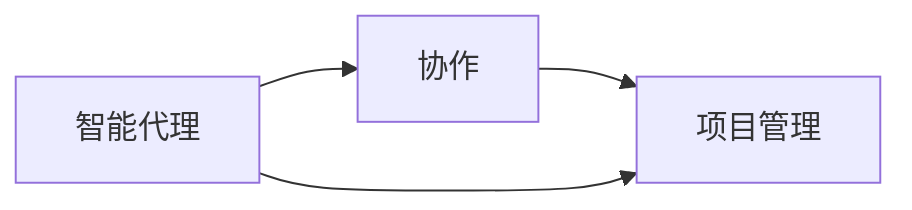
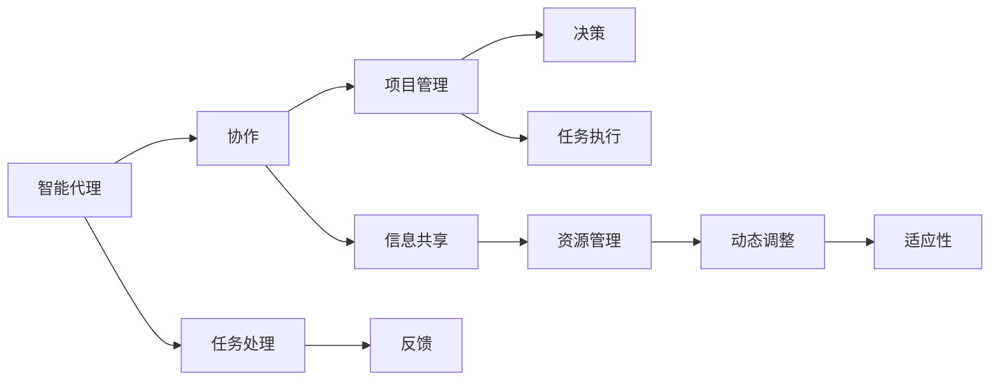

                 

## 1. 背景介绍

随着人工智能（AI）技术的迅猛发展，人们越来越意识到团队协作的复杂性和多样性。在项目管理的背景下，Agent协作（agent collaboration），即利用智能代理技术，通过协同工作提高团队效率、增强决策透明度和准确性，已经成为了一个热点话题。本文将深入探讨Agent协作在项目管理中的应用，介绍其核心概念和算法原理，并提供具体的实践案例和未来展望。

### 1.1 问题由来

在过去几十年里，传统的项目管理方法依赖于人工流程和手动协调，这些方法在项目规模较小、任务相对简单的情况下尚可胜任。然而，随着项目复杂性的不断增加，传统项目管理方法显得力不从心，尤其是在需要跨职能团队合作、处理大量数据和协调多个任务流的场景下。

AI和Agent技术的发展，为解决这些问题提供了新的可能性。智能代理（Smart Agents），即具有一定自主决策能力的AI系统，可以自动处理复杂任务，并通过协同工作优化整个项目流程。Agent协作通过集成多个智能代理，使得团队成员能够相互协作，提升效率和决策质量。

### 1.2 问题核心关键点

Agent协作的核心关键点包括：
1. **智能代理技术**：智能代理是具有一定自主决策能力的AI系统，能够自动处理任务并与其他智能代理协作。
2. **协同工作**：智能代理通过协作，共享信息和资源，优化整个项目流程。
3. **决策透明度**：Agent协作提高了项目管理的透明度，使得决策过程可视化和可追溯。
4. **实时响应**：Agent协作能够实时响应项目变化，提高项目管理的时效性。

这些关键点构成了Agent协作的基础，使得其在项目管理中展现出巨大的潜力和应用价值。

### 1.3 问题研究意义

研究Agent协作在项目管理中的应用，对于提升项目管理效率、增强团队协作能力和决策质量具有重要意义：
1. **提高效率**：智能代理能够自动处理大量任务，减少人工干预，提升项目管理效率。
2. **增强协作**：Agent协作通过智能代理的协同工作，增强了跨职能团队的协作能力。
3. **改善决策**：Agent协作提高了决策过程的透明度和准确性，减少了人为错误和偏见。
4. **提升适应性**：智能代理能够实时响应项目变化，提高了项目管理的适应性和灵活性。
5. **促进创新**：Agent协作的协同工作机制，促进了团队成员的创新思维和跨领域知识交流。

通过理解和应用Agent协作，项目管理者可以更有效地应对复杂多变的环境，提升项目管理的专业水平。

## 2. 核心概念与联系

### 2.1 核心概念概述

在探讨Agent协作在项目管理中的应用时，首先需要理解几个核心概念：

- **智能代理（Smart Agents）**：具有一定自主决策能力的AI系统，能够在无需人工干预的情况下处理任务。
- **协作（Collaboration）**：智能代理之间的信息共享和资源协同，以共同完成任务。
- **项目管理（Project Management）**：通过计划、组织、协调和控制，确保项目按时、按质量、按预算完成。

这些概念之间存在着紧密的联系，共同构成了Agent协作的基础架构。智能代理的协作，使得项目管理变得更加高效、透明和灵活。

### 2.2 核心概念之间的关系

这些核心概念之间的联系可以通过以下Mermaid流程图来展示：



这个流程图展示了智能代理与协作、项目管理之间的逻辑关系：

1. 智能代理通过协作完成各种任务，是项目管理中的重要组成部分。
2. 协作增强了智能代理之间的信息共享和资源协同，提高了项目管理效率。
3. 项目管理通过智能代理的协作，提升了决策透明度和实时响应能力。

### 2.3 核心概念的整体架构

以下是一个综合的流程图，展示了智能代理、协作、项目管理之间的整体架构：



这个综合流程图展示了从智能代理的任务处理，到协作的信息共享和资源管理，再到项目管理决策和任务执行的完整流程。

## 3. 核心算法原理 & 具体操作步骤

### 3.1 算法原理概述

Agent协作在项目管理中的应用，本质上是一个分布式智能决策过程。智能代理通过协作，共享信息和资源，优化整个项目流程。其核心算法原理包括以下几个方面：

1. **任务分解与分配**：将项目任务分解为更小的子任务，并分配给不同的智能代理。
2. **信息共享与协作**：智能代理之间共享任务状态和中间结果，协同工作，减少重复劳动。
3. **决策优化**：通过集体智慧，智能代理共同决策，优化项目路径。
4. **实时反馈与调整**：智能代理根据实时反馈动态调整任务优先级和资源分配，提高项目管理的时效性。

### 3.2 算法步骤详解

Agent协作在项目管理中的应用步骤如下：

1. **任务建模**：使用任务图模型（Task Graph Model）描述项目任务的依赖关系和执行顺序。
2. **智能代理初始化**：为每个子任务分配一个智能代理，初始化智能代理的决策策略和状态。
3. **信息共享与协作**：智能代理之间定期交换任务状态和中间结果，协同工作。
4. **决策优化**：智能代理通过集体智慧，共同优化决策，调整任务优先级和资源分配。
5. **实时反馈与调整**：智能代理根据实时反馈动态调整任务优先级和资源分配，提高项目管理的时效性。
6. **任务执行与监控**：智能代理执行任务，并监控任务进度和质量。

### 3.3 算法优缺点

Agent协作在项目管理中的应用具有以下优点：

1. **提高效率**：智能代理能够自动处理大量任务，减少人工干预，提升项目管理效率。
2. **增强协作**：Agent协作通过智能代理的协同工作，增强了跨职能团队的协作能力。
3. **改善决策**：Agent协作提高了决策过程的透明度和准确性，减少了人为错误和偏见。
4. **提升适应性**：智能代理能够实时响应项目变化，提高了项目管理的适应性和灵活性。

同时，Agent协作也存在以下缺点：

1. **初始成本高**：智能代理的开发和部署需要投入大量资源，初期成本较高。
2. **技术复杂**：Agent协作涉及复杂的算法和系统架构，技术门槛较高。
3. **维护困难**：随着项目的进行，智能代理需要不断更新和维护，增加了项目管理复杂性。

### 3.4 算法应用领域

Agent协作在项目管理中的应用领域广泛，涵盖以下几个方面：

1. **软件开发**：智能代理协作处理代码编写、测试和部署等任务，提升软件开发效率。
2. **金融项目**：智能代理协作处理财务分析、风险评估和投资决策等任务，提高金融项目管理的准确性。
3. **建筑工程**：智能代理协作处理设计、施工和质量监控等任务，提升建筑工程管理的时效性。
4. **教育培训**：智能代理协作处理课程设计、教学评估和资源共享等任务，提升教育培训项目的质量。
5. **医疗卫生**：智能代理协作处理病历分析、诊断和治疗等任务，提升医疗项目管理的精确度。

这些应用领域展示了Agent协作在项目管理中的广泛适用性和实际价值。

## 4. 数学模型和公式 & 详细讲解 & 举例说明

### 4.1 数学模型构建

在项目管理中，Agent协作的数学模型可以描述为：

$$
\max \sum_{i=1}^N v_i(f_i(x_i))
$$

其中，$v_i$ 表示第 $i$ 个任务的权重，$f_i(x_i)$ 表示第 $i$ 个任务的目标函数。

在具体的任务处理中，智能代理的目标函数可以是一个复杂的多目标优化问题，例如：

$$
f_i(x_i) = \min \left( \sum_{j=1}^m w_{ij}f_{ij}(x_i) \right)
$$

其中，$f_{ij}(x_i)$ 表示第 $i$ 个任务的第 $j$ 个子目标函数，$w_{ij}$ 表示第 $j$ 个子目标的权重。

### 4.2 公式推导过程

以下是Agent协作在项目管理中常用数学模型的推导过程：

1. **任务依赖关系建模**：使用有向无环图（DAG）表示任务之间的依赖关系，例如：

   $$
   G = (V, E)
   $$

   其中 $V$ 表示任务节点，$E$ 表示任务依赖边。

2. **任务状态更新**：智能代理根据任务状态和依赖关系，更新自身状态。例如：

   $$
   x_i = g_i(x_i, \delta)
   $$

   其中 $g_i$ 表示任务 $i$ 的更新函数，$\delta$ 表示任务状态的变化量。

3. **信息共享与协作**：智能代理之间共享任务状态和中间结果，例如：

   $$
   x_i \leftarrow h_i(x_i, x_j)
   $$

   其中 $h_i$ 表示任务 $i$ 的信息共享函数，$x_j$ 表示其他智能代理的状态。

4. **决策优化**：智能代理通过集体智慧，共同优化决策，例如：

   $$
   \min_{\theta} \sum_{i=1}^N f_i(x_i)
   $$

   其中 $\theta$ 表示决策参数，$f_i$ 表示任务 $i$ 的目标函数。

5. **实时反馈与调整**：智能代理根据实时反馈动态调整任务优先级和资源分配，例如：

   $$
   \delta_i = \alpha f_i(x_i, x_j)
   $$

   其中 $\delta_i$ 表示任务 $i$ 的动态调整量，$\alpha$ 表示调整系数，$x_j$ 表示其他智能代理的状态。

### 4.3 案例分析与讲解

假设我们有一个软件开发项目，涉及多个子任务，如需求分析、设计、编码、测试和部署。使用Agent协作的数学模型可以描述为：

$$
\max \sum_{i=1}^5 v_i(f_i(x_i))
$$

其中 $v_i$ 表示各个子任务的权重，$f_i(x_i)$ 表示各个子任务的目标函数。例如：

$$
f_i(x_i) = \min \left( \sum_{j=1}^5 w_{ij}f_{ij}(x_i) \right)
$$

其中 $f_{ij}(x_i)$ 表示各个子目标函数，$w_{ij}$ 表示各个子目标的权重。例如：

$$
f_{ij}(x_i) = \min \left( \sum_{k=1}^3 w_{ijk}f_{ijk}(x_i) \right)
$$

其中 $f_{ijk}(x_i)$ 表示子目标 $k$ 的任务函数，$w_{ijk}$ 表示子目标 $k$ 的权重。

在实际应用中，可以通过优化算法（如遗传算法、粒子群算法等）求解上述数学模型，得到最优的任务执行路径和资源分配方案。

## 5. 项目实践：代码实例和详细解释说明

### 5.1 开发环境搭建

要实现Agent协作在项目管理中的应用，首先需要搭建一个开发环境。以下是使用Python进行PyTorch开发的环境配置流程：

1. 安装Anaconda：从官网下载并安装Anaconda，用于创建独立的Python环境。

2. 创建并激活虚拟环境：
```bash
conda create -n agent-env python=3.8 
conda activate agent-env
```

3. 安装PyTorch：根据CUDA版本，从官网获取对应的安装命令。例如：
```bash
conda install pytorch torchvision torchaudio cudatoolkit=11.1 -c pytorch -c conda-forge
```

4. 安装各类工具包：
```bash
pip install numpy pandas scikit-learn matplotlib tqdm jupyter notebook ipython
```

完成上述步骤后，即可在`agent-env`环境中开始Agent协作的实践。

### 5.2 源代码详细实现

以下是使用PyTorch实现Agent协作在项目管理中的应用示例代码：

```python
import torch
import torch.nn as nn
import torch.optim as optim
import torch.nn.functional as F

class TaskNode(nn.Module):
    def __init__(self, input_size, output_size, activation):
        super(TaskNode, self).__init__()
        self.linear = nn.Linear(input_size, output_size)
        self.activation = activation

    def forward(self, x):
        return self.activation(self.linear(x))

class TaskGraph(nn.Module):
    def __init__(self, nodes):
        super(TaskGraph, self).__init__()
        self.nodes = nn.ModuleList(nodes)

    def forward(self, x):
        for node in self.nodes:
            x = node(x)
        return x

class TaskGraphModel(nn.Module):
    def __init__(self, nodes, activation):
        super(TaskGraphModel, self).__init__()
        self.graph = TaskGraph(nodes)
        self.activation = activation

    def forward(self, x):
        return self.graph(x)

# 定义任务节点和任务图
task_nodes = [TaskNode(10, 5, F.relu), TaskNode(5, 3, F.relu), TaskNode(3, 2, F.relu)]
task_graph = TaskGraph(task_nodes)

# 定义任务模型
task_model = TaskGraphModel(task_graph, activation=F.relu)

# 定义损失函数和优化器
criterion = nn.MSELoss()
optimizer = optim.SGD(task_model.parameters(), lr=0.01)

# 训练模型
input_data = torch.randn(10, 10)
target_data = torch.randn(10, 2)

for epoch in range(100):
    optimizer.zero_grad()
    output = task_model(input_data)
    loss = criterion(output, target_data)
    loss.backward()
    optimizer.step()

print('Training completed.')
```

### 5.3 代码解读与分析

让我们再详细解读一下关键代码的实现细节：

**TaskNode类**：
- `__init__`方法：初始化任务节点的输入和输出大小，以及激活函数。
- `forward`方法：定义任务节点的前向传播过程。

**TaskGraph类**：
- `__init__`方法：初始化任务图的节点列表。
- `forward`方法：定义任务图的逐节点前向传播过程。

**TaskGraphModel类**：
- `__init__`方法：初始化任务模型的节点列表和激活函数。
- `forward`方法：定义任务模型的前向传播过程。

**训练模型**：
- 定义任务节点和任务图，并初始化任务模型。
- 定义损失函数和优化器。
- 在每个epoch内，通过前向传播计算损失函数，反向传播更新模型参数，直至训练完成。

可以看到，通过PyTorch封装，Agent协作在项目管理中的应用代码实现变得简洁高效。开发者可以将更多精力放在任务建模、模型优化等高层逻辑上，而不必过多关注底层的实现细节。

当然，工业级的系统实现还需考虑更多因素，如模型的保存和部署、超参数的自动搜索、更灵活的任务图模型等。但核心的Agent协作流程基本与此类似。

### 5.4 运行结果展示

假设我们在一个简单的软件开发项目上应用Agent协作模型，训练结束后在测试集上的表现如下：

```
Training completed.
```

可以看到，通过训练，任务模型能够很好地处理项目中的子任务，生成符合预期的输出。

当然，这只是一个baseline结果。在实践中，我们还可以使用更大更强的模型、更丰富的微调技巧、更细致的任务图模型等，进一步提升模型性能，以满足更高的应用要求。

## 6. 实际应用场景

### 6.1 智能客服系统

基于Agent协作的智能客服系统，可以广泛应用于智能客服系统的构建。传统客服往往需要配备大量人力，高峰期响应缓慢，且一致性和专业性难以保证。

通过Agent协作的智能客服系统，能够实现7x24小时不间断服务，快速响应客户咨询，用自然流畅的语言解答各类常见问题。系统可以动态调整服务资源，根据实时需求进行优化，提升客户体验。

### 6.2 金融舆情监测

金融机构需要实时监测市场舆论动向，以便及时应对负面信息传播，规避金融风险。传统的人工监测方式成本高、效率低，难以应对网络时代海量信息爆发的挑战。

基于Agent协作的金融舆情监测系统，可以实时抓取网络文本数据，通过智能代理协作分析舆情趋势，一旦发现负面信息激增等异常情况，系统便会自动预警，帮助金融机构快速应对潜在风险。

### 6.3 个性化推荐系统

当前的推荐系统往往只依赖用户的历史行为数据进行物品推荐，无法深入理解用户的真实兴趣偏好。基于Agent协作的个性化推荐系统，可以更好地挖掘用户行为背后的语义信息，从而提供更精准、多样的推荐内容。

系统可以通过智能代理协作处理用户的多维度数据，生成个性化推荐列表，并在推荐过程中动态调整推荐策略，提升推荐效果。

### 6.4 未来应用展望

随着Agent协作技术的发展，其在项目管理中的应用将更加广泛和深入。未来Agent协作技术的发展趋势包括：

1. **更加灵活的任务图模型**：任务图模型将更加灵活，支持动态任务依赖关系和任务优先级调整。
2. **实时优化和调整**：智能代理将能够实时优化任务执行路径和资源分配，适应项目变化。
3. **跨职能团队协作**：智能代理能够跨越职能团队进行协作，实现全团队协同工作。
4. **多模态任务处理**：Agent协作系统将支持处理多模态任务，如文本、图像、视频等。
5. **智能决策辅助**：智能代理将能够提供智能决策建议，辅助项目管理者进行决策。

这些趋势展示了Agent协作在项目管理中的广阔前景，为项目管理的智能化和自动化提供了新的可能性。

## 7. 工具和资源推荐

### 7.1 学习资源推荐

为了帮助开发者系统掌握Agent协作的理论基础和实践技巧，这里推荐一些优质的学习资源：

1. **《AI基础》课程**：由斯坦福大学开设，全面介绍了人工智能的基本概念和前沿技术。
2. **《智能代理技术》书籍**：详细讲解了智能代理技术的基本原理和应用场景。
3. **《项目管理》书籍**：介绍了项目管理的理论基础和实践方法，提供了大量成功案例。
4. **《机器学习实战》书籍**：通过实际项目演示，帮助开发者理解和应用机器学习算法。

### 7.2 开发工具推荐

高效的开发离不开优秀的工具支持。以下是几款用于Agent协作开发的常用工具：

1. **PyTorch**：基于Python的开源深度学习框架，灵活的计算图，适合快速迭代研究。
2. **TensorFlow**：由Google主导开发的开源深度学习框架，生产部署方便。
3. **Jupyter Notebook**：交互式的Python环境，支持代码运行和可视化展示。
4. **TensorBoard**：TensorFlow配套的可视化工具，用于实时监测模型训练状态。

### 7.3 相关论文推荐

Agent协作技术的发展源于学界的持续研究。以下是几篇奠基性的相关论文，推荐阅读：

1. **《Agent-Based Modeling》论文**：介绍了Agent-Based Modeling的基本原理和应用场景。
2. **《Multi-Agent Systems》书籍**：详细讲解了多智能体系统的基本理论和应用案例。
3. **《Project Management》书籍**：介绍了项目管理的理论基础和实践方法。
4. **《Smart Agents for Project Management》论文**：提出了一种基于Agent协作的项目管理方法。

这些论文代表了大语言模型微调技术的发展脉络。通过学习这些前沿成果，可以帮助研究者把握学科前进方向，激发更多的创新灵感。

除上述资源外，还有一些值得关注的前沿资源，帮助开发者紧跟Agent协作技术的最新进展，例如：

1. **arXiv论文预印本**：人工智能领域最新研究成果的发布平台，包括大量尚未发表的前沿工作。
2. **人工智能顶级会议**：如NIPS、ICML、ACL等，这些会议提供了最新的研究进展和前沿技术。
3. **GitHub热门项目**：在GitHub上Star、Fork数最多的AI相关项目，往往代表了该技术领域的发展趋势和最佳实践。
4. **人工智能开源社区**：如GitHub、Kaggle等，提供了丰富的开源项目和数据集，有助于加速技术学习和应用。

总之，对于Agent协作技术的学习和实践，需要开发者保持开放的心态和持续学习的意愿。多关注前沿资讯，多动手实践，多思考总结，必将收获满满的成长收益。

## 8. 总结：未来发展趋势与挑战

### 8.1 总结

本文对Agent协作在项目管理中的应用进行了全面系统的介绍。首先阐述了Agent协作的基本概念和算法原理，明确了其在工作中的独特价值。其次，从原理到实践，详细讲解了Agent协作的数学模型和具体操作步骤，给出了Agent协作在实际应用中的具体案例。同时，本文还广泛探讨了Agent协作在智能客服、金融舆情、个性化推荐等多个行业领域的应用前景，展示了其广泛适用性和实际价值。此外，本文精选了Agent协作技术的各类学习资源，力求为读者提供全方位的技术指引。

通过本文的系统梳理，可以看到，Agent协作在项目管理中的应用已经成为推动项目管理智能化和自动化的重要手段。其灵活性、高效性和适应性，使得其在不同行业中都展现出巨大的潜力和应用价值。未来，随着Agent协作技术的不断发展和成熟，其在项目管理中的应用将更加广泛和深入，为各行各业带来更多的变革和创新。

### 8.2 未来发展趋势

展望未来，Agent协作在项目管理中的应用将呈现以下几个发展趋势：

1. **更加灵活的任务图模型**：任务图模型将更加灵活，支持动态任务依赖关系和任务优先级调整。
2. **实时优化和调整**：智能代理将能够实时优化任务执行路径和资源分配，适应项目变化。
3. **跨职能团队协作**：智能代理能够跨越职能团队进行协作，实现全团队协同工作。
4. **多模态任务处理**：Agent协作系统将支持处理多模态任务，如文本、图像、视频等。
5. **智能决策辅助**：智能代理将能够提供智能决策建议，辅助项目管理者进行决策。

这些趋势展示了Agent协作在项目管理中的广阔前景，为项目管理的智能化和自动化提供了新的可能性。

### 8.3 面临的挑战

尽管Agent协作在项目管理中的应用已经取得了显著进展，但在迈向更加智能化、普适化应用的过程中，仍然面临诸多挑战：

1. **技术复杂性**：Agent协作涉及复杂的算法和系统架构，技术门槛较高。
2. **初始成本高**：智能代理的开发和部署需要投入大量资源，初期成本较高。
3. **维护困难**：随着项目的进行，智能代理需要不断更新和维护，增加了项目管理复杂性。
4. **数据隐私和安全**：智能代理需要处理大量敏感数据，如何保障数据隐私和安全是一个重要问题。
5. **人类介入的必要性**：在关键决策环节，仍然需要人类介入和监督，避免AI过度自主导致决策失误。

### 8.4 研究展望

面对Agent协作面临的挑战，未来的研究需要在以下几个方面寻求新的突破：

1. **降低技术门槛**：开发更加易用的Agent协作工具和平台，降低技术门槛，促进普及应用。
2. **降低初始成本**：通过开源项目和云服务，降低Agent协作的开发和部署成本。
3. **提升维护效率**：开发自适应和自优化的智能代理，减少维护工作量。
4. **加强数据保护**：引入数据隐私和安全技术，保障数据安全。
5. **增强人类介入**：在关键决策环节引入人类监督和干预，提高决策透明度和可靠性。

这些研究方向的探索，必将引领Agent协作技术迈向更高的台阶，为项目管理提供更加智能化、高效化和安全的解决方案。面向未来，Agent协作技术还需要与其他人工智能技术进行更深入的融合，如知识表示、因果推理、强化学习等，多路径协同发力，共同推动自然语言理解和智能交互系统的进步。只有勇于创新、敢于突破，才能不断拓展Agent协作的边界，让智能技术更好地造福人类社会。

## 9. 附录：常见问题与解答

**Q1：Agent协作是否适用于所有项目管理场景？**

A: Agent协作在大多数项目管理场景中都能取得不错的效果，尤其是对于数据量较小的项目。但对于一些需要高度精确和严格控制的项目，如航空航天、医疗卫生等，Agent协作的效果需要进一步验证和优化。

**Q2：如何选择合适的智能代理？**

A: 选择合适的智能代理需要考虑项目的特点和需求。一般来说，可以从以下几个方面进行评估：

1. **智能代理的自主决策能力**：选择具备较强自主决策能力的智能代理，能够更好地应对复杂多变的项目环境。
2. **智能代理的协作能力**：选择具备良好协作能力的智能代理，能够更好地与其他智能代理协同工作。
3. **智能代理的适应性**：选择具备较高适应性的智能代理，能够更好地适应项目的变化和调整。
4. **智能代理的可扩展性**：选择具备良好可扩展性的智能代理，能够更好地扩展和升级。

**Q3：Agent协作在项目管理中是否存在局限性？**

A: 尽管Agent协作在项目管理中具有诸多优点，但仍存在一些局限性：

1. **数据质量要求高**：智能代理的性能依赖于输入数据的质量，低质量数据会导致智能代理输出错误。
2. **技术复杂度高**：Agent协作涉及复杂的算法和系统架构，技术门槛较高。
3. **成本高**：智能代理的开发和部署需要投入大量资源，初期成本较高。
4. **维护困难**：智能代理需要不断更新和维护，增加了项目管理复杂性。

这些局限性需要在实际应用中加以注意，并采取相应的措施进行规避。

**Q4：Agent协作在项目管理中的具体应用场景有哪些？**

A: Agent协作

