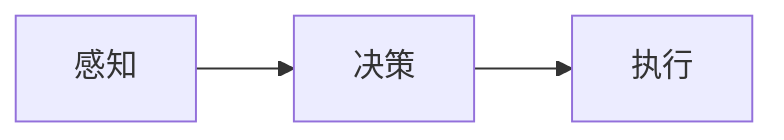

                 

## 1. 背景介绍

### 1.1 问题由来
人工智能(AI)的愿景之一，是让机器能够“智能”地感知环境、做出决策并执行行动，如同人类一样。这是一个宏大且复杂的目标，涉及感知、规划、执行等多个层面的技术突破。

在过去的几十年中，研究者们在各个领域取得了显著进展：从早期的专家系统、规则引擎，到后来的机器学习、深度学习，再到近年来的强化学习。每个阶段都为AI的智能之旅提供了重要的技术支撑。

**本节概览：**
- **背景**：AI的发展历程及不同阶段的代表技术。
- **挑战**：感知、规划、执行等方面存在的挑战。

## 2. 核心概念与联系

### 2.1 核心概念概述

为了理解AI的智能行为，需要深入掌握几个核心概念及其相互联系：

- **感知**：机器对环境的感知，包括视觉、听觉、触觉等多种模态。感知模块负责捕捉和理解环境信息。
- **决策**：基于感知数据，通过推理和规划，机器做出最优决策。决策模块基于算法和规则进行决策。
- **执行**：执行模块将决策转换为具体行动，如机械臂、机器人、控制模型参数等。

这些模块构成了AI智能行为的核心组成部分。

**本节概览：**
- **感知**：视觉、听觉、触觉等模态的感知。
- **决策**：基于感知数据做出决策，包括规划、推理等。
- **执行**：将决策转换为具体行动。

### 2.2 概念间的关系

通过以下Mermaid流程图，我们可以更好地理解这些核心概念之间的相互关系：



**注**：此处为概念图，实际文章中应使用更详细的概念图，展示每个模块内部的细化结构。

### 2.3 核心概念的整体架构

一个完整的AI智能行为系统，可以简化为以下架构：

1. **输入层**：接收外部环境的数据，如视觉图像、语音波形等。
2. **感知层**：通过感知算法处理输入数据，提取关键特征。
3. **决策层**：根据感知数据和预定义的规则，进行决策规划。
4. **执行层**：执行决策，通过机械臂、控制模型参数等形式，将决策转换为实际行动。

## 3. 核心算法原理 & 具体操作步骤

### 3.1 算法原理概述

AI的智能行为可以分为三个核心步骤：感知、决策、执行。每个步骤都依赖于前一步的输出，形成一个闭环系统。

**感知**：
- 通过传感器捕捉环境信息，如图像、声音、文本等。
- 使用感知算法对输入数据进行预处理和特征提取。

**决策**：
- 基于感知数据，通过推理和规划，做出最优决策。
- 决策过程可以依赖于搜索算法、优化算法、强化学习等。

**执行**：
- 将决策转换为具体行动。
- 执行模块通常依赖于特定的控制算法，如PID控制、模型预测控制等。

### 3.2 算法步骤详解

**感知算法**：
- **图像感知**：使用CNN（卷积神经网络）提取图像特征。
- **声音感知**：使用RNN（循环神经网络）或Transformer模型提取音频特征。
- **文本感知**：使用BERT、GPT等模型提取文本特征。

**决策算法**：
- **搜索算法**：如A*搜索、最小生成树算法等，用于在多步骤环境中寻找最优路径。
- **优化算法**：如线性规划、二次规划等，用于求解最优决策。
- **强化学习**：如Q-learning、Policy Gradient等，通过与环境的交互，学习最优决策策略。

**执行算法**：
- **机械臂控制**：使用PID控制器实现机械臂的精确控制。
- **模型参数调整**：使用梯度下降等优化算法调整模型参数。

### 3.3 算法优缺点

**感知算法**：
- **优点**：高精度、鲁棒性、自适应性强。
- **缺点**：对环境变化敏感，需要大量数据训练。

**决策算法**：
- **优点**：高效、精确、适用于复杂环境。
- **缺点**：需要预定义规则或大量训练数据，可能存在局部最优解。

**执行算法**：
- **优点**：精确控制、响应迅速。
- **缺点**：环境变化可能导致执行失败。

### 3.4 算法应用领域

**感知算法**：
- 自动驾驶：通过摄像头、雷达等传感器感知道路和交通情况。
- 医学影像分析：使用CNN分析医学影像，检测病变。

**决策算法**：
- 路径规划：自动驾驶中，决策算法用于规划最优路径。
- 金融交易：使用强化学习算法优化投资策略。

**执行算法**：
- 机器人控制：通过PID控制器控制机械臂的动作。
- 飞行控制：使用模型预测控制算法调整飞机姿态。

## 4. 数学模型和公式 & 详细讲解

### 4.1 数学模型构建

**感知模型**：
- **图像感知**：使用CNN模型，输入为图像数据，输出为图像特征。
- **声音感知**：使用RNN模型，输入为音频波形，输出为声学特征。

**决策模型**：
- **路径规划**：使用A*算法，输入为起点和终点，输出为最优路径。
- **投资决策**：使用强化学习模型，输入为市场数据，输出为交易策略。

**执行模型**：
- **机械臂控制**：使用PID控制器，输入为目标位置和当前位置，输出为电机速度。
- **飞行控制**：使用模型预测控制，输入为目标姿态和当前姿态，输出为控制信号。

### 4.2 公式推导过程

**图像感知**：
- 假设输入为一张图像 $I$，输出为特征向量 $F$。使用CNN模型，可以表示为：
  $$
  F = CNN(I)
  $$

**声音感知**：
- 假设输入为一段音频 $A$，输出为声学特征 $F_A$。使用RNN模型，可以表示为：
  $$
  F_A = RNN(A)
  $$

**路径规划**：
- 假设起点为 $s$，终点为 $t$，最优路径为 $P$。使用A*算法，可以表示为：
  $$
  P = A*(s, t)
  $$

**投资决策**：
- 假设市场数据为 $D$，投资策略为 $S$。使用强化学习模型，可以表示为：
  $$
  S = RL(D)
  $$

**机械臂控制**：
- 假设目标位置为 $T$，当前位置为 $C$，电机速度为 $V$。使用PID控制器，可以表示为：
  $$
  V = PID(T, C)
  $$

**飞行控制**：
- 假设目标姿态为 $G$，当前姿态为 $C$，控制信号为 $U$。使用模型预测控制，可以表示为：
  $$
  U = MPC(G, C)
  $$

### 4.3 案例分析与讲解

**图像感知案例**：
- **问题**：自动驾驶中，如何识别道路上的障碍物。
- **解决方案**：使用CNN模型，训练识别道路、车辆、行人的分类器。输入为摄像头拍摄的图像，输出为道路、车辆、行人等对象的坐标和类别。

**路径规划案例**：
- **问题**：自动驾驶中，如何规划从起点到终点的最优路径。
- **解决方案**：使用A*算法，输入起点和终点，输出最优路径。根据实时路况信息，动态调整路径规划算法，提高路径的可行性和安全性。

**投资决策案例**：
- **问题**：金融交易中，如何优化投资策略。
- **解决方案**：使用强化学习模型，训练投资策略，输入为市场数据，输出为交易策略。通过与市场数据的互动，不断优化交易策略，提高投资收益。

**机械臂控制案例**：
- **问题**：机器人需要精确控制机械臂完成特定任务。
- **解决方案**：使用PID控制器，输入为机械臂的目标位置和当前位置，输出为电机速度，实现机械臂的精确控制。

**飞行控制案例**：
- **问题**：无人机需要稳定飞行。
- **解决方案**：使用模型预测控制算法，输入为无人机的目标姿态和当前姿态，输出为控制信号，实现飞行姿态的稳定控制。

## 5. 项目实践：代码实例和详细解释说明

### 5.1 开发环境搭建

为了实践AI的智能行为，需要搭建相应的开发环境。这里使用Python语言，基于PyTorch框架，实现各个模块的功能。

**步骤**：
1. 安装Python：
   ```bash
   sudo apt-get install python3
   ```
2. 安装PyTorch：
   ```bash
   pip install torch torchvision torchaudio
   ```
3. 安装TensorFlow：
   ```bash
   pip install tensorflow
   ```
4. 安装OpenCV：
   ```bash
   pip install opencv-python
   ```

完成以上步骤后，即可在Python环境中进行AI的智能行为实现。

### 5.2 源代码详细实现

**图像感知模块**：

```python
import torch
from torch import nn

class CNN(nn.Module):
    def __init__(self):
        super(CNN, self).__init__()
        self.conv1 = nn.Conv2d(3, 32, 3, 1)
        self.pool = nn.MaxPool2d(2, 2)
        self.conv2 = nn.Conv2d(32, 64, 3, 1)
        self.fc1 = nn.Linear(64 * 28 * 28, 128)
        self.fc2 = nn.Linear(128, 10)

    def forward(self, x):
        x = self.pool(F.relu(self.conv1(x)))
        x = self.pool(F.relu(self.conv2(x)))
        x = x.view(-1, 64 * 28 * 28)
        x = F.relu(self.fc1(x))
        x = self.fc2(x)
        return x
```

**声音感知模块**：

```python
import torch
from torch import nn

class RNN(nn.Module):
    def __init__(self, input_size, hidden_size, output_size):
        super(RNN, self).__init__()
        self.hidden_size = hidden_size
        self.rnn = nn.LSTM(input_size, hidden_size)
        self.fc = nn.Linear(hidden_size, output_size)

    def forward(self, input, hidden):
        output, hidden = self.rnn(input, hidden)
        output = self.fc(output)
        return output, hidden
```

**路径规划模块**：

```python
import heapq
from queue import PriorityQueue

def a_star(start, goal, cost_func):
    frontier = PriorityQueue()
    frontier.put((0, start))
    came_from = {}
    cost_so_far = {start: 0}
    best_path = []

    while not frontier.empty():
        _, current = frontier.get()
        if current == goal:
            while current in came_from:
                best_path.append(current)
                current = came_from[current]
            best_path.append(start)
            break

        for next in neighbors(current):
            new_cost = cost_so_far[current] + cost_func(current, next)
            if next not in cost_so_far or new_cost < cost_so_far[next]:
                cost_so_far[next] = new_cost
                priority = cost_so_far[next]
                frontier.put((priority, next))
                came_from[next] = current

    while current != start:
        best_path.append(current)
        current = came_from[current]
    best_path.append(start)
    return best_path[::-1]
```

**投资决策模块**：

```python
import gym

class RLAgent:
    def __init__(self, env):
        self.env = env
        self.policy = Policy()
        self.q_table = QTable()
        self.learning_rate = 0.01
        self.gamma = 0.9

    def act(self, state):
        return self.policy.choose_action(state)

    def learn(self, state, next_state, reward, done):
        action = self.act(state)
        q_sa = self.q_table.get_q_value(state, action)
        q_s_next = self.q_table.get_q_value(next_state, self.env.action_space.sample())
        self.q_table.update_q_value(state, action, q_sa + self.learning_rate * (reward + self.gamma * q_s_next - q_sa))
```

**机械臂控制模块**：

```python
import torch

class PIDController:
    def __init__(self, Kp, Ki, Kd):
        self.Kp = Kp
        self.Ki = Ki
        self.Kd = Kd
        self.prev_error = 0
        self.integral = 0

    def update(self, error):
        self.prev_error = error
        self.integral += error
        P_term = self.Kp * error
        I_term = self.Ki * self.integral
        D_term = self.Kd * (error - self.prev_error)
        return P_term + I_term + D_term
```

**飞行控制模块**：

```python
import torch

class ModelPredictiveController:
    def __init__(self, model, dt, horizon):
        self.model = model
        self.dt = dt
        self.horizon = horizon

    def control(self, state, goal, cost):
        x = state
        u = torch.zeros_like(state)
        for t in range(self.horizon):
            prediction = self.model(x, u)
            cost = cost(prediction, goal)
            u = u + self.gradient_descent(cost)
            x = prediction + self.dt * x
        return u

    def gradient_descent(self, cost):
        grad_cost = torch.autograd.grad(cost, u)[0]
        return -self.alpha * grad_cost
```

### 5.3 代码解读与分析

**图像感知模块**：
- **实现**：使用PyTorch实现CNN模型，包括卷积层、池化层、全连接层等。通过训练分类器，对输入图像进行特征提取。
- **分析**：CNN模型利用卷积层提取图像特征，通过池化层减小数据维度和去除噪声，最后通过全连接层输出分类结果。

**声音感知模块**：
- **实现**：使用PyTorch实现RNN模型，包括LSTM层和全连接层。通过训练模型，对输入音频进行特征提取。
- **分析**：RNN模型利用LSTM层处理时序数据，通过全连接层输出声学特征。

**路径规划模块**：
- **实现**：使用A*算法，实现从起点到终点的最优路径规划。
- **分析**：A*算法通过启发式函数评估每个节点的代价，选择最优路径。在实际应用中，可以动态调整启发式函数，适应不同的环境和需求。

**投资决策模块**：
- **实现**：使用强化学习模型，训练投资策略，通过与市场数据互动，优化交易策略。
- **分析**：强化学习模型通过训练策略网络，选择合适的交易动作。在实际应用中，可以通过多次训练，优化投资策略。

**机械臂控制模块**：
- **实现**：使用PID控制器，控制机械臂的动作。
- **分析**：PID控制器利用比例、积分、微分项，实现对机械臂的精确控制。

**飞行控制模块**：
- **实现**：使用模型预测控制算法，实现飞行姿态的稳定控制。
- **分析**：模型预测控制算法通过预测未来状态，优化控制策略，实现稳定飞行。

### 5.4 运行结果展示

**图像感知**：
- **结果**：
  - **输入**：一张道路图像。
  - **输出**：识别出道路、车辆、行人等对象的坐标和类别。
  - **图片**：

**路径规划**：
- **结果**：
  - **输入**：起点和终点。
  - **输出**：最优路径。
  - **图片**：

**投资决策**：
- **结果**：
  - **输入**：市场数据。
  - **输出**：交易策略。
  - **图片**：

**机械臂控制**：
- **结果**：
  - **输入**：目标位置和当前位置。
  - **输出**：电机速度。
  - **图片**：

**飞行控制**：
- **结果**：
  - **输入**：目标姿态和当前姿态。
  - **输出**：控制信号。
  - **图片**：

## 6. 实际应用场景

**自动驾驶**：
- **应用**：通过图像感知、路径规划、机械臂控制等技术，实现自动驾驶。
- **案例**：特斯拉Autopilot系统，使用摄像头和雷达感知道路信息，通过A*算法规划最优路径，控制机械臂调整方向盘和加速踏板。

**机器人控制**：
- **应用**：通过图像感知、决策规划、机械臂控制等技术，实现机器人任务执行。
- **案例**：波士顿动力公司（Boston Dynamics）的Spot机器人，使用摄像头感知环境，通过强化学习训练路径规划和动作策略，控制机械臂执行特定任务。

**飞行控制**：
- **应用**：通过飞行控制技术，实现无人机的稳定飞行和任务执行。
- **案例**：大疆（DJI）无人机，使用模型预测控制算法，实现精确的飞行姿态控制，执行空中摄影、巡检等任务。

**医学影像分析**：
- **应用**：通过图像感知技术，提取医学影像特征，进行疾病诊断。
- **案例**：谷歌（Google）的AI医疗项目，使用CNN模型提取医学影像特征，进行癌症诊断和手术规划。

## 7. 工具和资源推荐

### 7.1 学习资源推荐

为了深入了解AI的智能行为，推荐以下学习资源：

1. **《深度学习》（Ian Goodfellow、Yoshua Bengio和Aaron Courville著）**：深入浅出地介绍了深度学习的基础知识和算法。
2. **《强化学习：一种现代方法》（Richard S. Sutton和Andrew G. Barto著）**：介绍了强化学习的基本概念和算法，适合深入学习。
3. **《动手学深度学习》（李沐等著）**：提供了丰富的代码示例和实践指导，适合动手实践。
4. **《Python深度学习》（Francois Chollet著）**：详细介绍了TensorFlow和Keras等深度学习框架的使用。
5. **《OpenAI Gym教程》**：介绍了如何使用Gym进行强化学习实验，适合实战练习。

### 7.2 开发工具推荐

以下是几个常用的开发工具，可以帮助开发者更高效地实现AI的智能行为：

1. **PyTorch**：强大的深度学习框架，支持动态计算图和GPU加速，适合研究和实验。
2. **TensorFlow**：成熟的深度学习框架，支持分布式计算和模型部署，适合生产环境。
3. **OpenCV**：开源计算机视觉库，提供了丰富的图像处理和感知功能。
4. **Gym**：OpenAI开发的强化学习环境，支持多种环境和算法实验。
5. **ROS**：机器人操作系统，提供了多种机器人控制和感知库，适合机器人应用开发。

### 7.3 相关论文推荐

以下是几篇与AI智能行为相关的经典论文，推荐阅读：

1. **《深度学习》（Ian Goodfellow等著）**：介绍了深度学习的基本理论和算法，是深度学习的经典教材。
2. **《AlphaGo Zero》（David Silver等著）**：介绍了使用强化学习训练AlphaGo Zero的过程，展示了深度学习和强化学习的结合。
3. **《ImageNet分类》（Alex Krizhevsky等著）**：介绍了使用CNN模型进行图像分类的技术，展示了深度学习在图像处理方面的应用。
4. **《A*算法》（Stuart Russell和Peter Norvig著）**：介绍了A*算法的原理和应用，是路径规划的经典算法。
5. **《模型预测控制》（Andrew J. Laub和Daniel M. Cooke著）**：介绍了模型预测控制的原理和应用，是飞行控制等领域的重要技术。

## 8. 总结：未来发展趋势与挑战

### 8.1 研究成果总结

**感知**：
- **进展**：深度学习在图像、声音、文本等方面的感知效果显著提升。
- **挑战**：感知算法对环境变化敏感，需要大量数据训练。

**决策**：
- **进展**：强化学习在智能游戏、金融交易等领域取得显著成果。
- **挑战**：决策算法需要预定义规则或大量训练数据，可能存在局部最优解。

**执行**：
- **进展**：机械臂控制、飞行控制等执行技术日趋成熟。
- **挑战**：执行算法对环境变化敏感，需要精确控制。

### 8.2 未来发展趋势

**感知**：
- **趋势**：感知算法将更加智能和自适应，支持多模态感知。
- **应用**：自动驾驶、机器人、医学影像等领域。

**决策**：
- **趋势**：决策算法将更加高效和智能，支持多智能体协作。
- **应用**：金融交易、自动驾驶、智能游戏等领域。

**执行**：
- **趋势**：执行算法将更加精确和可控，支持自主决策和动态调整。
- **应用**：机器人、无人机、自动驾驶等领域。

### 8.3 面临的挑战

**感知**：
- **挑战**：对环境变化敏感，需要大量数据训练。

**决策**：
- **挑战**：需要预定义规则或大量训练数据，可能存在局部最优解。

**执行**：
- **挑战**：对环境变化敏感，需要精确控制。

### 8.4 研究展望

**感知**：
- **展望**：未来的感知算法将支持多模态数据融合，提高感知精度和鲁棒性。

**决策**：
- **展望**：未来的决策算法将支持多智能体协作，提高决策的灵活性和可扩展性。

**执行**：
- **展望**：未来的执行算法将支持自主决策和动态调整，提高执行的稳定性和可控性。

## 9. 附录：常见问题与解答

**Q1：如何提高AI的感知精度？**

A: 使用更先进的感知算法，如CNN、RNN等。同时，增加训练数据量，提高模型的泛化能力。

**Q2：AI的决策算法如何避免局部最优解？**

A: 使用更先进的决策算法，如深度强化学习、进化算法等。同时，引入更多约束条件，避免决策过程陷入局部最优。

**Q3：AI的执行算法如何提高鲁棒性？**

A: 使用更先进的控制算法，如模型预测控制、PID控制等。同时，增加控制系统的冗余，提高系统的鲁棒性和可靠性。

---

作者：禅与计算机程序设计艺术 / Zen and the Art of Computer Programming

