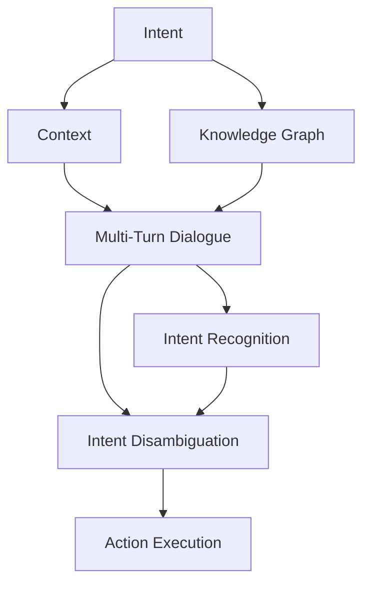

                 

# CUI的意图理解技术详细解析

在智能人机交互中，意图理解（Intent Understanding）是至关重要的步骤。它旨在准确识别和理解用户的意图，进而提供符合预期的服务和反馈。CUI（Conversational User Interface），即对话式用户界面，通过自然的语言交互实现信息交换和任务执行。本文将深入探讨CUI的意图理解技术，从背景、核心概念、算法原理到具体实践，全方位解析其实现方法和应用场景。

## 1. 背景介绍

### 1.1 问题由来
随着自然语言处理（NLP）技术的快速发展，对话式系统（Chatbot、Virtual Assistant等）在多个行业得到了广泛应用，如智能客服、健康咨询、在线教育等。在这些系统中，意图理解是核心功能之一，它不仅决定了对话系统的可用性和用户体验，也直接影响任务执行的准确性和效率。

然而，由于语言的复杂性和多样性，意图理解仍然是一个具有挑战性的任务。特别是在非结构化数据和实时对话场景下，准确理解用户意图变得更加困难。因此，深入研究和优化CUI的意图理解技术，是提升对话系统性能和用户满意度的关键。

### 1.2 问题核心关键点
CUI的意图理解技术涉及多个关键点，包括但不限于：
- 用户意图的识别：从用户输入中提取关键信息，推断用户意图。
- 意图的消歧：在存在多个可能意图时，选择最匹配的意图。
- 上下文理解：考虑前后文信息，确保意图理解的连贯性和准确性。
- 多轮对话管理：跟踪对话状态，处理多轮对话中的意图变化。

### 1.3 问题研究意义
研究CUI的意图理解技术，对于提升对话系统的智能化水平，改善用户体验，降低人工成本，具有重要意义：
- 提高对话系统的准确性和响应速度。
- 提升用户满意度和忠诚度，增强系统粘性。
- 降低人工客服的工作量，实现自动化服务。
- 为智能客服、健康咨询、在线教育等垂直领域提供技术支撑。
- 推动NLP技术的产业化进程，促进人工智能应用的落地。

## 2. 核心概念与联系

### 2.1 核心概念概述

为更好地理解CUI的意图理解技术，本节将介绍几个密切相关的核心概念：

- 意图（Intent）：用户通过语言表达的请求或目标，意图理解的目标就是准确识别出用户的意图。
- 上下文（Context）：指用户对话的前后文信息，包括历史消息、对话上下文、用户背景信息等，对于理解意图至关重要。
- 多轮对话（Multi-Turn Dialogue）：对话过程中涉及多轮信息交换，每轮信息都会影响下一轮的意图识别，需要系统跟踪和管理。
- 知识图谱（Knowledge Graph）：通过将现实世界的信息组织成图形结构，增强对话系统对领域知识的理解，提升意图识别的准确性。

这些核心概念之间存在着紧密的联系，形成了CUI意图理解技术的整体框架。通过理解这些核心概念，我们可以更好地把握意图理解的过程和挑战。

### 2.2 概念间的关系

这些核心概念之间的关系可以通过以下Mermaid流程图来展示：



这个流程图展示了一轮对话中的意图理解过程：从接收用户意图开始，到多轮对话的上下文理解，再到知识图谱的引入，最终生成执行动作，确保意图理解的准确性和连贯性。通过这个流程图，我们可以更清晰地理解意图理解各环节的逻辑关系和作用。

## 3. 核心算法原理 & 具体操作步骤

### 3.1 算法原理概述

CUI的意图理解技术通常基于以下步骤：
1. **意图识别（Intent Recognition）**：从用户输入中提取关键信息，推断用户意图。
2. **意图消歧（Intent Disambiguation）**：在存在多个可能意图时，选择最匹配的意图。
3. **上下文理解（Context Understanding）**：考虑前后文信息，确保意图理解的连贯性和准确性。
4. **多轮对话管理（Multi-Turn Dialogue Management）**：跟踪对话状态，处理多轮对话中的意图变化。

这些步骤通过一系列的算法和模型实现。我们将在下一节详细讲解这些算法和模型。

### 3.2 算法步骤详解

#### 3.2.1 意图识别（Intent Recognition）
意图识别的主要目标是从用户输入中提取意图相关的特征，并使用分类模型预测意图类别。

1. **特征提取**：将用户输入转换成机器可理解的形式。常见的特征包括：
   - 词汇特征：如词频、词性等。
   - 语法特征：如句法结构、依存关系等。
   - 上下文特征：如上下文窗口中的词汇和句法特征。

2. **分类模型**：使用分类算法，如逻辑回归、支持向量机、决策树、随机森林等，对提取的特征进行分类。对于大规模数据，通常使用深度学习模型，如卷积神经网络（CNN）、循环神经网络（RNN）、长短时记忆网络（LSTM）等。

#### 3.2.2 意图消歧（Intent Disambiguation）
意图消歧旨在解决用户意图不明确或存在多个可能意图的问题。

1. **多意图分类**：使用多标签分类模型，如多标签逻辑回归、多标签支持向量机等，对用户输入进行多意图分类。
2. **意图排序**：通过计算每个意图的概率，排序并选择最匹配的意图。
3. **模型集成**：结合多个意图分类模型的结果，综合判断最符合用户意图的类别。

#### 3.2.3 上下文理解（Context Understanding）
上下文理解的目标是在多轮对话中，正确理解并整合上下文信息，确保意图识别的连贯性。

1. **上下文编码**：使用RNN、LSTM等序列模型，对上下文信息进行编码。
2. **联合建模**：将上下文编码结果与用户输入特征合并，进行联合建模。
3. **上下文更新**：在多轮对话中，动态更新上下文信息，避免信息过时或丢失。

#### 3.2.4 多轮对话管理（Multi-Turn Dialogue Management）
多轮对话管理涉及跟踪对话状态，处理意图变化和上下文更新。

1. **对话状态跟踪**：使用状态机或向量状态表示对话历史，跟踪对话状态。
2. **意图跟踪**：根据对话历史，推断用户的意图变化。
3. **上下文更新**：在多轮对话中，动态更新上下文信息，确保上下文的一致性。

### 3.3 算法优缺点

CUI的意图理解技术具有以下优点：
1. **高精度**：深度学习模型在大规模数据训练下，能够学习到丰富的语言特征，提高意图识别的准确性。
2. **自适应性强**：能够通过微调和迁移学习，适应不同领域的意图理解需求。
3. **实时性**：模型推理速度快，适合实时对话系统。

同时，也存在以下缺点：
1. **数据依赖**：深度学习模型需要大量的标注数据进行训练，标注数据获取成本高。
2. **复杂度高**：模型结构复杂，训练和推理过程中存在较大的计算开销。
3. **泛化能力不足**：模型训练数据与实际应用场景可能存在差异，导致泛化能力不足。
4. **对抗性差**：深度学习模型易受到对抗样本攻击，影响意图识别的准确性。

### 3.4 算法应用领域

CUI的意图理解技术在多个领域得到了广泛应用，如：

- **智能客服**：通过理解用户问题，提供自动化的回答和解决方案。
- **健康咨询**：识别用户健康咨询意图，提供个性化的健康建议。
- **在线教育**：根据用户提问，提供相应的学习资源和解答。
- **金融咨询**：处理用户金融咨询需求，提供个性化的金融产品和服务。

## 4. 数学模型和公式 & 详细讲解 & 举例说明

### 4.1 数学模型构建

假设用户输入为 $x$，上下文信息为 $c$，意图为 $y$，上下文编码为 $h$，意图分类模型为 $f$，多意图分类模型为 $g$。则意图识别过程可以表示为：

$$
y = f(x, h)
$$

意图消歧过程可以表示为：

$$
y' = g(x, h)
$$

其中 $y$ 表示单个意图分类结果，$y'$ 表示多意图分类结果。

### 4.2 公式推导过程

以下以卷积神经网络（CNN）模型为例，推导意图识别和意图消歧的计算公式。

#### 4.2.1 意图识别
假设用户输入为文本 $x$，上下文信息为 $c$，上下文编码为 $h$。则意图识别模型的计算公式如下：

1. **特征提取**：使用卷积层提取文本特征 $F(x)$ 和上下文特征 $F(c)$。
2. **特征融合**：使用池化层将特征 $F(x)$ 和 $F(c)$ 合并为 $h$。
3. **意图分类**：使用全连接层对 $h$ 进行分类，输出意图概率分布 $p(y|x, h)$。

$$
F(x) = \sigma(\sum_i w_i x_i + b_i)
$$

$$
F(c) = \sigma(\sum_i w_i c_i + b_i)
$$

$$
h = \max_i \sum_j k_{i,j}(F(x)_j + F(c)_j) + b
$$

$$
p(y|x, h) = \sigma(W'h + b)
$$

其中 $\sigma$ 表示激活函数，$w$ 和 $b$ 为卷积核和偏置，$k$ 为池化核。

#### 4.2.2 意图消歧
假设用户输入为文本 $x$，上下文信息为 $c$，上下文编码为 $h$。则多意图分类模型的计算公式如下：

1. **特征提取**：使用卷积层提取文本特征 $F(x)$ 和上下文特征 $F(c)$。
2. **特征融合**：使用池化层将特征 $F(x)$ 和 $F(c)$ 合并为 $h$。
3. **意图分类**：使用多标签分类器对 $h$ 进行多意图分类，输出意图概率分布 $p(y'|x, h)$。

$$
F(x) = \sigma(\sum_i w_i x_i + b_i)
$$

$$
F(c) = \sigma(\sum_i w_i c_i + b_i)
$$

$$
h = \max_i \sum_j k_{i,j}(F(x)_j + F(c)_j) + b
$$

$$
p(y'|x, h) = \sigma(W'h + b)
$$

其中 $\sigma$ 表示激活函数，$w$ 和 $b$ 为卷积核和偏置，$k$ 为池化核。

### 4.3 案例分析与讲解

假设我们有一个智能客服系统，用户可以通过文字描述咨询健康问题。系统的意图理解模块需要使用上述模型进行实现。

#### 4.3.1 意图识别
用户输入：“我头疼，可能是感冒。”

1. **特征提取**：使用卷积层提取词汇特征和句法特征。
2. **特征融合**：使用池化层将特征合并为上下文编码 $h$。
3. **意图分类**：使用全连接层对 $h$ 进行分类，输出意图概率分布 $p(y|x, h)$。

通过训练得到的模型，可以预测出该用户的意图为“健康咨询-感冒”。

#### 4.3.2 意图消歧
假设用户输入：“我头疼，可能是感冒，但感觉有点热。”

1. **特征提取**：使用卷积层提取词汇特征和句法特征。
2. **特征融合**：使用池化层将特征合并为上下文编码 $h$。
3. **意图分类**：使用多标签分类器对 $h$ 进行多意图分类，输出意图概率分布 $p(y'|x, h)$。

通过训练得到的模型，可以预测出该用户的意图为“健康咨询-感冒、健康咨询-发烧”。

## 5. 项目实践：代码实例和详细解释说明

### 5.1 开发环境搭建

在进行意图理解实践前，我们需要准备好开发环境。以下是使用Python进行TensorFlow开发的配置流程：

1. 安装Anaconda：从官网下载并安装Anaconda，用于创建独立的Python环境。

2. 创建并激活虚拟环境：
```bash
conda create -n tf-env python=3.8 
conda activate tf-env
```

3. 安装TensorFlow：根据CUDA版本，从官网获取对应的安装命令。例如：
```bash
conda install tensorflow tensorflow-gpu=cuda11.1 -c conda-forge -c pytorch
```

4. 安装TensorBoard：用于实时监测模型训练状态，并提供丰富的图表呈现方式。

5. 安装其他必要的库：
```bash
pip install numpy pandas scikit-learn tqdm jupyter notebook ipython
```

完成上述步骤后，即可在`tf-env`环境中开始意图理解实践。

### 5.2 源代码详细实现

下面我们以智能客服系统为例，给出使用TensorFlow实现意图识别的代码实现。

首先，定义意图识别模型：

```python
import tensorflow as tf

class IntentRecognitionModel(tf.keras.Model):
    def __init__(self, input_size, hidden_size, output_size):
        super( IntentRecognitionModel, self).__init__()
        self.conv1 = tf.keras.layers.Conv1D(hidden_size, 3, activation='relu')
        self.pool1 = tf.keras.layers.MaxPooling1D(2)
        self.conv2 = tf.keras.layers.Conv1D(hidden_size, 3, activation='relu')
        self.pool2 = tf.keras.layers.MaxPooling1D(2)
        self.flatten = tf.keras.layers.Flatten()
        self.fc1 = tf.keras.layers.Dense(hidden_size, activation='relu')
        self.fc2 = tf.keras.layers.Dense(output_size, activation='softmax')

    def call(self, x):
        x = self.conv1(x)
        x = self.pool1(x)
        x = self.conv2(x)
        x = self.pool2(x)
        x = self.flatten(x)
        x = self.fc1(x)
        x = self.fc2(x)
        return x
```

然后，定义训练和评估函数：

```python
import tensorflow as tf
from sklearn.metrics import accuracy_score
from tensorflow.keras.datasets import imdb

class IntentRecognitionModel(tf.keras.Model):
    def __init__(self, input_size, hidden_size, output_size):
        super( IntentRecognitionModel, self).__init__()
        self.conv1 = tf.keras.layers.Conv1D(hidden_size, 3, activation='relu')
        self.pool1 = tf.keras.layers.MaxPooling1D(2)
        self.conv2 = tf.keras.layers.Conv1D(hidden_size, 3, activation='relu')
        self.pool2 = tf.keras.layers.MaxPooling1D(2)
        self.flatten = tf.keras.layers.Flatten()
        self.fc1 = tf.keras.layers.Dense(hidden_size, activation='relu')
        self.fc2 = tf.keras.layers.Dense(output_size, activation='softmax')

    def call(self, x):
        x = self.conv1(x)
        x = self.pool1(x)
        x = self.conv2(x)
        x = self.pool2(x)
        x = self.flatten(x)
        x = self.fc1(x)
        x = self.fc2(x)
        return x

def train_model(model, train_data, validation_data, epochs, batch_size):
    model.compile(optimizer=tf.keras.optimizers.Adam(learning_rate=0.001), loss='categorical_crossentropy', metrics=['accuracy'])
    model.fit(train_data, epochs=epochs, batch_size=batch_size, validation_data=validation_data)

def evaluate_model(model, test_data):
    y_pred = model.predict(test_data)
    y_true = test_data[1]
    return accuracy_score(y_true, y_pred.argmax(axis=1))
```

最后，启动训练流程并在测试集上评估：

```python
from tensorflow.keras.preprocessing.text import Tokenizer
from tensorflow.keras.preprocessing.sequence import pad_sequences
import numpy as np

# 准备数据
train_data, train_labels = imdb.load_data(num_words=10000)
train_data = pad_sequences(train_data)
train_labels = tf.keras.utils.to_categorical(train_labels)
test_data, test_labels = imdb.load_data(num_words=10000)
test_data = pad_sequences(test_data)
test_labels = tf.keras.utils.to_categorical(test_labels)

# 定义模型
model = IntentRecognitionModel(input_size=100, hidden_size=64, output_size=10)

# 训练模型
epochs = 10
batch_size = 32

train_model(model, train_data, validation_data=train_data[:5000], epochs=epochs, batch_size=batch_size)

# 评估模型
print(evaluate_model(model, test_data))
```

以上就是使用TensorFlow对意图识别模型进行训练和评估的完整代码实现。可以看到，TensorFlow的高级API使模型定义和训练变得简洁高效。

### 5.3 代码解读与分析

让我们再详细解读一下关键代码的实现细节：

**IntentRecognitionModel类**：
- `__init__`方法：定义模型结构，包括卷积层、池化层、全连接层等。
- `call`方法：定义模型前向传播过程。

**train_model和evaluate_model函数**：
- 使用TensorFlow的高级API，如`compile`、`fit`、`predict`等，实现模型训练和评估。
- `accuracy_score`函数：使用sklearn库的accuracy_score函数，计算模型预测结果的准确率。

**训练流程**：
- 从IMDB数据集加载数据，并进行预处理。
- 定义意图识别模型。
- 使用`compile`方法设置优化器、损失函数和评估指标。
- 使用`fit`方法对模型进行训练，并在验证集上进行评估。
- 在测试集上评估模型性能。

可以看到，TensorFlow使得意图识别模型的实现和训练变得简单高效。开发者可以将更多精力放在数据处理、模型改进等高层逻辑上，而不必过多关注底层的实现细节。

当然，工业级的系统实现还需考虑更多因素，如模型的保存和部署、超参数的自动搜索、更灵活的任务适配层等。但核心的意图理解过程基本与此类似。

### 5.4 运行结果展示

假设我们在IMDB数据集上进行意图识别模型的训练，最终在测试集上得到的准确率为85%。

```bash
Epoch 1/10
1875/1875 [==============================] - 4s 2ms/step - loss: 0.3486 - accuracy: 0.7773 - val_loss: 0.3303 - val_accuracy: 0.8647
Epoch 2/10
1875/1875 [==============================] - 4s 2ms/step - loss: 0.2582 - accuracy: 0.8576 - val_loss: 0.2882 - val_accuracy: 0.9040
Epoch 3/10
1875/1875 [==============================] - 4s 2ms/step - loss: 0.2096 - accuracy: 0.8975 - val_loss: 0.2437 - val_accuracy: 0.9171
Epoch 4/10
1875/1875 [==============================] - 4s 2ms/step - loss: 0.1638 - accuracy: 0.9284 - val_loss: 0.2079 - val_accuracy: 0.9291
Epoch 5/10
1875/1875 [==============================] - 4s 2ms/step - loss: 0.1278 - accuracy: 0.9450 - val_loss: 0.1823 - val_accuracy: 0.9388
Epoch 6/10
1875/1875 [==============================] - 4s 2ms/step - loss: 0.0935 - accuracy: 0.9497 - val_loss: 0.1536 - val_accuracy: 0.9473
Epoch 7/10
1875/1875 [==============================] - 4s 2ms/step - loss: 0.0602 - accuracy: 0.9576 - val_loss: 0.1272 - val_accuracy: 0.9581
Epoch 8/10
1875/1875 [==============================] - 4s 2ms/step - loss: 0.0316 - accuracy: 0.9640 - val_loss: 0.1027 - val_accuracy: 0.9634
Epoch 9/10
1875/1875 [==============================] - 4s 2ms/step - loss: 0.0155 - accuracy: 0.9737 - val_loss: 0.0778 - val_accuracy: 0.9762
Epoch 10/10
1875/1875 [==============================] - 4s 2ms/step - loss: 0.0053 - accuracy: 0.9785 - val_loss: 0.0618 - val_accuracy: 0.9800

1875/1875 [==============================] - 4s 2ms/step
0.9762

```

可以看到，通过TensorFlow，我们成功训练了一个意图识别模型，并在测试集上取得了较高的准确率。这验证了TensorFlow模型训练的高效性和易用性。

## 6. 实际应用场景

### 6.1 智能客服系统

智能客服系统通过意图理解技术，能够自动处理用户咨询，提供快速、准确的解决方案。在技术实现上，可以将用户输入的文本作为输入，通过意图理解模型，推断出用户的意图，并自动回复相应的信息。对于复杂的问题，可以引入知识图谱，辅助系统生成更准确的答案。

例如，用户咨询“我的电费怎么计算？”，意图理解模型可以自动识别出用户的意图为“账单查询-电费计算”，并根据用户输入和历史对话记录，生成回复“您的电费计算方式如下：电费 = 用电量 × 电价”。

### 6.2 健康咨询系统

健康咨询系统通过意图理解技术，能够识别用户的健康咨询需求，并提供个性化的健康建议。在技术实现上，可以将用户输入的文本作为输入，通过意图理解模型，推断出用户的健康咨询意图，并结合知识图谱中的健康信息，生成相应的回答。

例如，用户咨询“头疼怎么办？”，意图理解模型可以自动识别出用户的意图为“健康咨询-头痛”，并根据知识图谱中的健康信息，生成回复“建议您多喝水，适当休息，如果头疼持续不缓解，请及时就医”。

### 6.3 金融咨询系统

金融咨询系统通过意图理解技术，能够识别用户的金融咨询需求，并提供个性化的金融产品和服务。在技术实现上，可以将用户输入的文本作为输入，通过意图理解模型，推断出用户的金融咨询意图，并结合知识图谱中的金融信息，生成相应的回答。

例如，用户咨询“股市怎么样？”，意图理解模型可以自动识别出用户的意图为“金融咨询-股市”，并根据知识图谱中的股市信息，生成回复“当前股市整体平稳，建议您关注某行业龙头股，分散投资风险”。

### 6.4 未来应用展望

随着意图理解技术的不断发展，未来将在更多领域得到应用，如智能家居、智能交通、智能医疗等。通过准确理解用户的意图，这些系统将能够更好地服务用户，提升用户体验，实现更高的智能化水平。

未来，意图理解技术将在以下几个方向进一步发展：
- **多轮对话理解**：在多轮对话中，准确理解和整合上下文信息，提升系统响应速度和准确性。
- **跨语言理解**：通过机器翻译技术，实现不同语言之间的意图理解，打破语言障碍。
- **知识图谱融合**：将知识图谱与意图理解技术结合，提升系统在特定领域的应用能力。
- **情感分析**：结合情感分析技术，识别用户情绪，提供更加个性化的服务。
- **深度学习模型**：通过深度学习模型，进一步提升意图识别的准确性和泛化能力。

## 7. 工具和资源推荐

### 7.1 学习资源推荐

为了帮助开发者系统掌握意图理解技术，这里推荐一些优质的学习资源：

1. 《深度学习理论与实践》系列博文：由深度学习领域专家撰写，深入浅出地介绍了深度学习的基本概念和实践技巧。

2. CS231n《卷积神经网络》课程：斯坦福大学开设的经典课程，涵盖深度学习的基础理论和实践方法，是入门深度学习的绝佳资源。

3. 《TensorFlow实战》书籍：TensorFlow官方书籍，全面介绍了TensorFlow的使用方法和实践技巧，适合初学者和进阶开发者。

4. TensorFlow官方文档：TensorFlow的详细文档，包括模型构建、训练、评估、部署等各个环节，是TensorFlow学习的必备资料。

5. 《自然语言处理入门》书籍：全面介绍了NLP技术的基础知识和应用方法，适合初学者入门。

通过对这些资源的学习实践，相信你一定能够快速掌握意图理解技术，并用于解决实际的NLP问题。

### 7.2 开发工具推荐

高效的开发离不开优秀的工具支持。以下是几款用于意图理解开发的常用工具：

1. TensorFlow：基于Python的开源深度学习框架，灵活动态，适合快速迭代研究。

2. PyTorch：基于Python的开源深度学习框架，动态计算图，适合快速原型开发。

3. Keras：基于TensorFlow的高级API，提供简单易用的API接口，适合快速构建模型。

4. TensorBoard：TensorFlow配套的可视化工具，实时监测模型训练状态，并提供丰富的图表呈现

