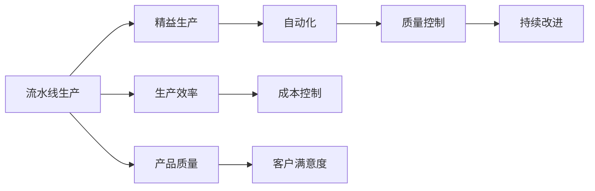
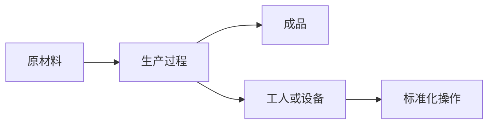
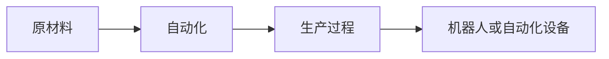

                 

# 流水线对工业生产的影响

> 关键词：工业自动化,流水线生产,标准化,生产效率,质量控制,持续改进

## 1. 背景介绍

### 1.1 问题由来
现代工业生产中，流水线（Assembly Line）扮演了至关重要的角色，它通过将生产过程标准化、模块化，大幅提升了生产效率和产品质量。流水线生产模式最早由亨利·福特（Henry Ford）在20世纪初提出，并广泛应用于汽车、电子、服装等多个行业，成为制造业的标准化作业方式。然而，随着技术的演进和市场需求的演变，流水线生产也面临着诸多挑战和瓶颈。本文旨在深入探讨流水线对工业生产的影响，分析其优缺点及未来发展趋势。

### 1.2 问题核心关键点
流水线生产的核心在于通过分解工序、标准化操作、精益生产等手段，实现生产效率的最大化。流水线生产的核心优势包括：

- 提升生产效率：通过将生产过程模块化，每个工人在特定环节上重复同一操作，可以极大提升生产速度。
- 稳定产品质量：流水线生产使得每个环节标准化，有助于减少人为失误，提升产品质量和一致性。
- 降低成本：流水线生产提高了生产效率，减少了人工成本和物料浪费。
- 可扩展性强：流水线生产可以根据需求灵活调整，适应不同规模的生产任务。

同时，流水线生产也存在以下问题：

- 刚性固定：流水线生产高度依赖固定流程，灵活性不足，难以快速适应市场变化。
- 资源依赖：流水线生产需要大量的设备和人力，对资源依赖度高。
- 瓶颈制约：流水线生产中任何一个环节出现问题，都可能影响整个流程，导致生产停滞。

## 2. 核心概念与联系

### 2.1 核心概念概述

为了更好地理解流水线对工业生产的影响，本节将介绍几个密切相关的核心概念：

- 流水线（Assembly Line）：指将生产过程分解成多个标准化的操作步骤，由多个工人或机器顺序执行，以实现高效、稳定生产的作业方式。
- 精益生产（Lean Manufacturing）：一种追求消除浪费、优化流程的生产管理方法，旨在提升生产效率和产品质量。
- 自动化（Automation）：指通过机械、电子、软件等技术手段，替代人工操作，实现生产过程的自动化。
- 质量控制（Quality Control）：通过标准化操作、检查、检验等手段，确保生产过程的输出符合质量要求。
- 持续改进（Continuous Improvement）：不断优化生产流程，消除瓶颈、减少浪费，提升生产效率和产品质量。

这些核心概念之间的逻辑关系可以通过以下Mermaid流程图来展示：



这个流程图展示了流水线生产与精益生产、自动化、质量控制、持续改进等关键概念之间的联系和影响：

1. 流水线生产通过精益生产、自动化等手段，提升生产效率和产品质量。
2. 质量控制和持续改进是确保流水线生产高效、稳定运行的基础。
3. 生产效率、产品质量、成本控制和客户满意度是流水线生产追求的目标。

### 2.2 概念间的关系

这些核心概念之间存在着紧密的联系，形成了流水线生产的标准化作业体系。下面我们通过几个Mermaid流程图来展示这些概念之间的关系。

#### 2.2.1 流水线生产的基本流程



这个流程图展示了流水线生产的基本流程：

1. 原材料通过生产过程，由多个工人或机器按照标准化操作顺序进行加工。
2. 标准化操作确保了每个环节的稳定性和一致性，从而提升了生产效率和产品质量。

#### 2.2.2 精益生产与流水线生产的关系


这个流程图展示了精益生产与流水线生产的关系：

1. 精益生产通过识别和消除生产过程中的浪费，优化了流水线生产的流程。
2. 标准化操作是精益生产的核心，通过持续改进，提升生产效率和产品质量。

#### 2.2.3 自动化在流水线生产中的应用



这个流程图展示了自动化在流水线生产中的应用：

1. 自动化设备替代人工操作，实现了生产过程的机械化和电子化。
2. 自动化提高了生产效率，减少了人工成本和人为错误。

## 3. 核心算法原理 & 具体操作步骤
### 3.1 算法原理概述

流水线生产的算法原理可以简要描述为：将生产过程分解成多个标准化的操作步骤，由多个工人或机器顺序执行，每个操作都在固定时间内完成，以实现高效、稳定生产的作业方式。具体而言，流水线生产的算法可以分解为以下几个步骤：

1. 分解生产过程：将整个生产过程分解成多个步骤，每个步骤对应一个或多个工人或机器。
2. 标准化操作：对每个步骤进行标准化操作，确保每个操作都能在固定时间内完成。
3. 顺序执行：工人或机器按照顺序执行每个步骤，确保生产过程的连贯性和一致性。
4. 质量控制：在每个操作步骤中，进行质量检验，确保生产过程中输出的产品质量。
5. 持续改进：通过不断优化生产流程，消除瓶颈，提升生产效率和产品质量。

### 3.2 算法步骤详解

流水线生产的算法步骤详解如下：

1. **需求分析**：
   - 分析产品需求和生产要求，确定生产流程的各个步骤。
   - 确定每个步骤的输入和输出，以及操作时间和质量要求。

2. **流程设计**：
   - 设计每个步骤的具体操作，包括工具、材料、人员配置等。
   - 确定操作顺序，确保每个步骤按顺序执行。

3. **设备选择**：
   - 根据每个步骤的操作要求，选择合适的设备和工具。
   - 确保设备稳定、可靠，符合生产要求。

4. **人员培训**：
   - 对工人进行培训，确保每个工人熟练掌握标准化操作。
   - 通过模拟和实际操作，提升工人的操作技能。

5. **质量控制**：
   - 在每个操作步骤中进行质量检验，确保每个环节的产品质量。
   - 记录质量数据，进行统计分析，找出质量问题的根源。

6. **持续改进**：
   - 定期进行流程优化，消除瓶颈，提升生产效率。
   - 引入新技术和新方法，提高生产过程的自动化水平。

### 3.3 算法优缺点

流水线生产有以下优点：

- 提高生产效率：通过标准化操作，每个工人或机器执行同一操作，效率显著提升。
- 稳定产品质量：标准化操作减少了人为失误，确保产品质量一致性。
- 降低成本：减少人工成本和物料浪费，提高了生产效率。
- 可扩展性强：根据需求灵活调整，适应不同规模的生产任务。

流水线生产也存在以下缺点：

- 刚性固定：高度依赖固定流程，难以快速适应市场变化。
- 资源依赖：需要大量设备和人力，对资源依赖度高。
- 瓶颈制约：任何一个环节出现问题，都可能影响整个流程，导致生产停滞。
- 灵活性不足：难以灵活应对复杂的生产需求，对市场需求变化响应较慢。

### 3.4 算法应用领域

流水线生产在制造业、物流、食品加工、电子制造等多个领域广泛应用。以下是几个典型的应用场景：

1. **汽车制造业**：汽车生产的装配线，通过流水线生产模式，实现了高效、稳定的生产，提升了生产效率和产品质量。
2. **电子产品制造**：电子产品生产中的电子装配线，通过流水线生产模式，实现了高精度、高效率的自动化生产。
3. **食品加工**：食品加工中的包装、分拣等环节，通过流水线生产模式，提升了生产效率，保证了食品安全。
4. **物流行业**：货物分拣、包装、运输等环节，通过流水线生产模式，提高了物流效率和准确性。

## 4. 数学模型和公式 & 详细讲解 & 举例说明（备注：数学公式请使用latex格式，latex嵌入文中独立段落使用 $$，段落内使用 $)
### 4.1 数学模型构建

流水线生产的核心在于将生产过程模块化，确保每个环节的稳定性和一致性。这里我们使用数学模型来描述流水线生产的流程：

设生产过程由n个步骤组成，每个步骤的输入和输出分别为 $(x_i, y_i)$ 和 $(x_{i+1}, y_{i+1})$，其中 $x_i$ 表示输入，$y_i$ 表示输出。则流水线生产的数学模型可以表示为：

$$
\begin{cases}
x_1 \rightarrow x_2 \rightarrow \cdots \rightarrow x_n \\
y_1 \rightarrow y_2 \rightarrow \cdots \rightarrow y_n
\end{cases}
$$

其中，$x_i$ 和 $y_i$ 分别表示第i个步骤的输入和输出，$i=1,2,\cdots,n$。

### 4.2 公式推导过程

在流水线生产中，每个步骤的操作时间 $t_i$ 是固定的。假设每个步骤的操作时间 $t_i$ 是已知的，则整个生产过程的总时间 $T$ 可以表示为：

$$
T = \sum_{i=1}^n t_i
$$

由于流水线生产要求每个步骤的输出必须符合质量要求，因此每个步骤的输出 $y_i$ 需要满足一定的质量要求 $q_i$。假设每个步骤的输出 $y_i$ 和质量要求 $q_i$ 是已知的，则流水线生产的质量模型可以表示为：

$$
q = \min_{i=1}^n q_i
$$

其中，$q$ 表示整个生产过程的最终产品质量。

### 4.3 案例分析与讲解

以汽车制造业为例，分析流水线生产的数学模型和质量模型。

设汽车组装线由5个步骤组成，每个步骤的操作时间 $t_i$ 和质量要求 $q_i$ 如下：

$$
\begin{aligned}
t_1 &= 20\text{s}, &q_1 &= 0.99 \\
t_2 &= 30\text{s}, &q_2 &= 0.95 \\
t_3 &= 40\text{s}, &q_3 &= 0.90 \\
t_4 &= 50\text{s}, &q_4 &= 0.98 \\
t_5 &= 30\text{s}, &q_5 &= 0.92
\end{aligned}
$$

则整个生产过程的总时间 $T$ 为：

$$
T = t_1 + t_2 + t_3 + t_4 + t_5 = 150\text{s}
$$

每个步骤的输出 $y_i$ 和质量要求 $q_i$ 如下：

$$
\begin{aligned}
y_1 &= x_1, &q_1 &= 0.99 \\
y_2 &= x_2, &q_2 &= 0.95 \\
y_3 &= x_3, &q_3 &= 0.90 \\
y_4 &= x_4, &q_4 &= 0.98 \\
y_5 &= x_5, &q_5 &= 0.92
\end{aligned}
$$

则整个生产过程的最终产品质量 $q$ 为：

$$
q = \min_{i=1}^n q_i = 0.90
$$

## 5. 项目实践：代码实例和详细解释说明
### 5.1 开发环境搭建

要进行流水线生产的模拟和优化，我们需要准备好开发环境。以下是使用Python进行流水线生产模拟的开发环境配置流程：

1. 安装Python：从官网下载并安装Python，创建独立的开发环境。

2. 安装Pandas：使用pip安装Pandas库，用于数据处理和分析。

3. 安装NumPy：使用pip安装NumPy库，用于数学计算和数组操作。

4. 安装Matplotlib：使用pip安装Matplotlib库，用于数据可视化。

5. 安装Seaborn：使用pip安装Seaborn库，用于更高级的数据可视化。

完成上述步骤后，即可在开发环境中开始流水线生产模拟的实践。

### 5.2 源代码详细实现

下面以一个简单的流水线生产模拟为例，给出使用Python进行流水线生产模拟的代码实现。

首先，定义流水线生产的步骤、操作时间和质量要求：

```python
import pandas as pd
import numpy as np
import matplotlib.pyplot as plt
import seaborn as sns

# 定义生产步骤、操作时间和质量要求
steps = ['步骤1', '步骤2', '步骤3', '步骤4', '步骤5']
operation_times = [20, 30, 40, 50, 30]  # 操作时间，单位为秒
quality_requirements = [0.99, 0.95, 0.90, 0.98, 0.92]  # 质量要求

# 生成数据
data = {'步骤': steps, '操作时间': operation_times, '质量要求': quality_requirements}
df = pd.DataFrame(data)

# 计算总时间
T = np.sum(operation_times)
print(f"总时间：{T}秒")

# 计算最终产品质量
q = min(quality_requirements)
print(f"最终产品质量：{q}")
```

然后，定义流水线生产的质量控制和持续改进：

```python
# 定义质量控制和持续改进
def quality_control(data, quality_requirements):
    # 质量控制
    for i in range(len(steps)):
        data['步骤'][data['步骤'] == steps[i]]['质量控制'] = quality_requirements[i]
    
    # 持续改进
    data['步骤'] = data['步骤'].apply(lambda x: '持续改进' if x == steps[-1] else x)
    
    return data

# 对数据进行质量控制和持续改进
data = quality_control(data, quality_requirements)
print(data)
```

最后，可视化流水线生产的总时间、最终产品质量和质量控制过程：

```python
# 绘制总时间
plt.figure(figsize=(8, 4))
plt.title('流水线生产总时间')
sns.barplot(data['步骤'], data['操作时间'], orient='h')
plt.xlabel('步骤')
plt.ylabel('操作时间')
plt.show()

# 绘制最终产品质量
plt.figure(figsize=(8, 4))
plt.title('流水线生产最终产品质量')
sns.barplot(data['步骤'], data['质量要求'], orient='h')
plt.xlabel('步骤')
plt.ylabel('质量要求')
plt.show()

# 绘制质量控制过程
plt.figure(figsize=(8, 4))
plt.title('流水线生产质量控制')
sns.barplot(data['步骤'], data['质量控制'], orient='h')
plt.xlabel('步骤')
plt.ylabel('质量控制')
plt.show()
```

以上就是使用Python对流水线生产进行模拟的完整代码实现。可以看到，通过Pandas、NumPy、Matplotlib等库，我们可以轻松地进行数据处理、计算和可视化，模拟流水线生产的流程。

### 5.3 代码解读与分析

让我们再详细解读一下关键代码的实现细节：

**数据定义**：
- 使用Pandas库定义了流水线生产的步骤、操作时间和质量要求，并生成了数据框。

**总时间和最终产品质量的计算**：
- 使用NumPy库计算了流水线生产的总时间，使用Python内置函数`min`计算了最终产品质量。

**质量控制和持续改进**：
- 定义了一个函数`quality_control`，实现了质量控制和持续改进的过程。
- 在函数中，对每个步骤的质量要求进行了标记，并增加了“持续改进”的标签。

**可视化结果**：
- 使用Matplotlib和Seaborn库，绘制了流水线生产的总时间、最终产品质量和质量控制过程的条形图。

通过这些步骤，我们可以看到，流水线生产的数学模型和质量模型可以通过编程实现，从而更好地理解和优化生产流程。

## 6. 实际应用场景

流水线生产在制造业、物流、食品加工等多个领域广泛应用，以下是几个典型的应用场景：

### 6.1 汽车制造业

汽车制造业是流水线生产的典型应用场景之一。现代汽车生产线采用流水线生产模式，将装配过程分解成多个标准化的操作步骤，每个步骤由特定的工人或机器执行。通过流水线生产，汽车制造商可以大幅提升生产效率，确保产品质量，降低生产成本。

例如，福特汽车公司在其T型车生产线上，采用了流水线生产模式，极大地提升了生产效率，使得汽车的生产速度和质量都得到了显著提升。

### 6.2 电子产品制造

电子产品制造也是流水线生产的重要应用领域。电子产品生产中的电子装配线，通过流水线生产模式，实现了高精度、高效率的自动化生产。例如，苹果公司在其iPad组装线上，采用了流水线生产模式，极大地提升了生产效率和产品质量。

### 6.3 食品加工

食品加工中的包装、分拣等环节，通过流水线生产模式，提升了生产效率，保证了食品安全。例如，雀巢公司在其速溶咖啡包装线上，采用了流水线生产模式，极大地提升了生产效率，并确保了产品的质量和一致性。

### 6.4 物流行业

物流行业中的货物分拣、包装、运输等环节，通过流水线生产模式，提高了物流效率和准确性。例如，亚马逊在其物流中心，采用了流水线生产模式，实现了高效、稳定的物流服务。

## 7. 工具和资源推荐
### 7.1 学习资源推荐

为了帮助开发者系统掌握流水线生产的技术基础和实践技巧，这里推荐一些优质的学习资源：

1. 《精益生产管理》书籍：介绍了精益生产的基本概念、方法、工具和应用，适合入门学习。

2. 《流水线生产优化》课程：通过实际案例，讲解流水线生产的基本流程、质量控制和持续改进等关键内容。

3. 《工业自动化》书籍：介绍了工业自动化技术的基本概念、方法和应用，适合深入学习。

4. 《供应链管理》书籍：介绍了供应链管理的基本概念、方法和应用，适合了解流水线生产与供应链管理的结合。

5. 《制造业智能制造》课程：讲解了制造业的智能化转型和数字化升级，适合了解流水线生产的未来发展方向。

通过对这些资源的学习实践，相信你一定能够快速掌握流水线生产的技术基础，并用于解决实际的工业生产问题。

### 7.2 开发工具推荐

高效的开发离不开优秀的工具支持。以下是几款用于流水线生产开发的常用工具：

1. Python：广泛用于数据处理、分析和可视化，是工业生产开发的主流语言。

2. PLC（可编程逻辑控制器）：用于控制自动化设备，实现流水线生产的自动化和智能化。

3. ERP（企业资源规划）：用于管理供应链、库存、生产等企业资源，优化流水线生产的资源配置。

4. MES（制造执行系统）：用于监控和优化生产过程，提高流水线生产的效率和质量。

5. 3D CAD软件：用于设计流水线生产的设备和工艺，优化生产流程。

合理利用这些工具，可以显著提升流水线生产的开发效率，加快创新迭代的步伐。

### 7.3 相关论文推荐

流水线生产的研究源于学界的持续研究。以下是几篇奠基性的相关论文，推荐阅读：

1. <i>Lean Manufacturing: Creating Value Through Flow</i>（Lean Manufacturing的起源）：Larry E. Perry和Womack（1998）。

2. <i>The Toyota Production System: Beyond Large-Scale Production</i>（丰田生产系统的介绍）：Robert L. Hau和Mary R. Hau（1989）。

3. <i>Industrial Automation: Applications, Technologies, and Systems</i>（工业自动化的介绍）：Lan Hoi Sheung（2020）。

4. <i>Supply Chain Management: Processes, Strategies and Technologies</i>（供应链管理的介绍）：J.D. W. Aarts和D. W.H. Bouman（1999）。

5. <i>Industry 4.0: The Future of Smart Manufacturing</i>（工业4.0的介绍）：Nedas et al（2021）。

这些论文代表了大规模流水线生产的研究脉络。通过学习这些前沿成果，可以帮助研究者把握学科前进方向，激发更多的创新灵感。

除上述资源外，还有一些值得关注的前沿资源，帮助开发者紧跟流水线生产的最新进展，例如：

1. 学术会议论文：如IEEE国际制造工程会议（ICME）、国际工业工程会议（IEEE ICIE）等。

2. 技术博客和论坛：如IEEE Spectrum、中国智能制造联盟等。

3. 企业案例研究：如西门子、富士康、苹果等企业的流水线生产案例。

4. 开源软件项目：如OSRM、Open Taskflow等。

5. 国家标准和行业标准：如ISO 9001、ISO 14001等。

总之，对于流水线生产的技术学习，需要开发者保持开放的心态和持续学习的意愿。多关注前沿资讯，多动手实践，多思考总结，必将收获满满的成长收益。

## 8. 总结：未来发展趋势与挑战

### 8.1 总结

本文对流水线生产的基本原理、操作步骤、数学模型、实际应用等进行了系统梳理。流水线生产作为制造业的标准化作业方式，通过将生产过程模块化，实现了高效、稳定生产，提升了生产效率和产品质量，降低了成本。流水线生产的优势在于提高生产效率、稳定产品质量、降低成本和可扩展性强。然而，流水线生产也面临刚性固定、资源依赖、瓶颈制约、灵活性不足等挑战。

通过对流水线生产的技术基础和实际应用的分析，可以看到流水线生产在制造业、物流、食品加工、电子制造等多个领域广泛应用。未来，随着技术的发展和市场的变化，流水线生产将向更加智能化、数字化、个性化的方向演进，以适应新时代的生产需求。

### 8.2 未来发展趋势

展望未来，流水线生产的趋势将包括以下几个方面：

1. **智能化**：通过引入AI、IoT等技术，实现流水线生产的智能化转型，提高生产效率和质量。

2. **数字化**：通过数字化手段，优化生产过程，实现资源优化配置和实时监控。

3. **个性化**：通过数据分析和客户反馈，实现个性化生产，满足多样化市场需求。

4. **网络化**：通过工业互联网，实现生产过程的网络化和协同化，提升供应链效率。

5. **可持续发展**：通过绿色制造和资源回收，实现流水线生产的可持续发展。

这些趋势展示了流水线生产在未来的发展方向，通过智能化、数字化、个性化、网络化、可持续发展等手段，流水线生产将进一步提升生产效率和质量，优化资源配置，增强市场竞争力。

### 8.3 面临的挑战

尽管流水线生产在制造业中发挥了重要作用，但在迈向更加智能化、普适化应用的过程中，它仍面临诸多挑战：

1. **技术瓶颈**：现有流水线生产技术仍存在一些瓶颈，如柔性化不足、智能化水平有限等，需要进一步突破。

2. **资源依赖**：流水线生产需要大量设备和人力，对资源依赖度高，如何实现资源优化配置和降低成本，仍是一大难题。

3. **市场变化**：市场需求快速变化，传统流水线生产模式难以快速适应，需要灵活调整生产流程。

4. **质量控制**：流水线生产中任何一个环节出现问题，都可能影响整个流程，需要强化质量控制和持续改进。

5. **供应链管理**：流水线生产与供应链管理紧密相关，如何优化供应链管理，提高供应链效率，仍需深入研究。

这些挑战需要通过技术创新、管理优化、资源配置等多方面的努力，才能克服，使流水线生产更好地适应未来的生产需求。

### 8.4 研究展望

面向未来，流水线生产的研究方向可以包括：

1. **智能化生产**：通过引入AI、IoT等技术，实现流水线生产的智能化转型，提高生产效率和质量。

2. **数字化管理**：通过数字化手段，优化生产过程，实现资源优化配置和实时监控。

3. **绿色制造**：通过绿色制造和资源回收，实现流水线生产的可持续发展。

4. **个性化生产**：通过数据分析和客户反馈，实现个性化生产，满足多样化市场需求。

5. **网络化协同**：通过工业互联网，实现生产过程的网络化和协同化，提升供应链效率。

这些研究方向将推动流水线生产向更加智能化、数字化、个性化、网络化、可持续发展等方向演进，为制造业带来新的活力和机遇。

## 9. 附录：常见问题与解答

**Q1：流水线生产的优缺点是什么？**

A: 流水线生产具有以下优点：
1. 提高生产效率：通过标准化操作，每个工人或机器执行同一操作，效率显著提升。
2. 稳定产品质量：标准化操作减少了人为失误，确保产品质量一致性。
3. 降低成本：减少人工成本和物料浪费，提高了生产效率。
4. 可扩展性强：根据需求灵活调整，适应不同规模的生产任务。

流水线生产也存在以下缺点：
1. 刚性固定：高度依赖固定流程，难以快速适应市场变化。
2. 资源依赖：需要大量设备和人力，对资源依赖度高。
3. 瓶颈制约：任何一个环节出现问题，都可能影响整个流程，导致生产停滞。
4. 灵活性不足：难以灵活应对复杂的生产需求，对市场需求变化响应较慢。

**Q2：如何提高流水线生产的质量？**

A: 提高流水线生产的质量可以从以下几个方面入手：


