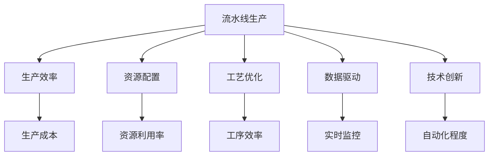
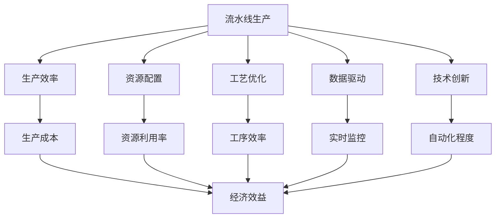
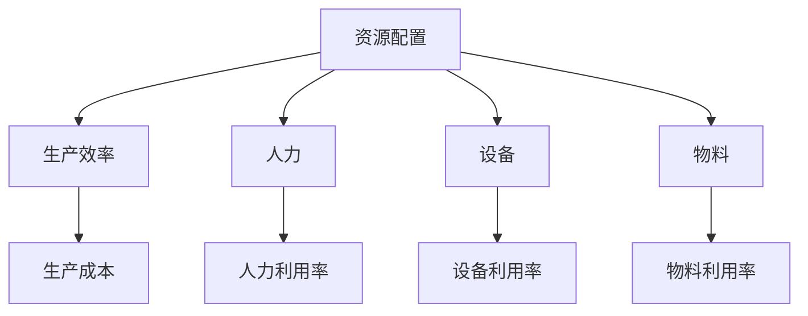
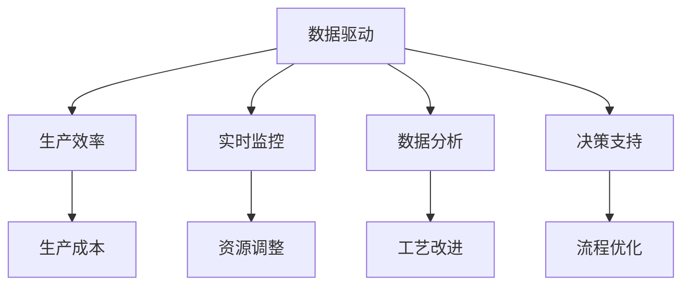

                 

## 1. 背景介绍

### 1.1 问题由来

现代工业生产中，流水线（Line Flow）已成为不可或缺的生产方式。流水线通过将生产过程分解为一系列独立的、有顺序的工序，每个工序由一个或多个人员或设备负责完成，从而实现规模化、高效化、标准化的生产。流水线生产不仅大大提升了生产效率和质量，还降低了生产成本，缩短了产品交付周期，成为制造业的重要工具。

然而，随着现代工业对生产效率的不断追求，传统的流水线生产方式也面临着诸多挑战。如何优化流水线生产流程，提升生产效率，成为了生产企业亟需解决的问题。本文聚焦于流水线生产的优化方法，重点探讨基于流水线生产线的生产效率提升策略，以期为生产企业提供科学、可行的优化建议。

### 1.2 问题核心关键点

流水线生产效率的提升主要依赖于以下几个关键点：

1. **工序划分**：合理划分流水线工序，使各工序之间互不干扰、协同配合。
2. **资源配置**：合理配置生产线上的资源（人力、设备、物料），避免资源浪费和瓶颈。
3. **工艺优化**：通过改进工艺流程、采用高效工具，提升工序效率。
4. **数据驱动**：利用生产数据进行实时监控、分析，优化生产流程。
5. **技术创新**：引入自动化、智能化技术，提升生产线的自动化程度。

通过优化上述关键点，可以显著提升流水线生产的效率和质量。本文将从这些方面进行深入探讨。

### 1.3 问题研究意义

研究流水线生产的优化方法，对于提升生产效率、降低生产成本、缩短产品交付周期、提高产品质量具有重要意义：

1. **降低成本**：合理配置资源，避免资源浪费，降低单位产品生产成本。
2. **提高效率**：通过优化生产流程，提高生产线的整体效率，缩短生产周期。
3. **提升质量**：通过改进工艺流程、采用自动化技术，提升产品质量，减少次品率。
4. **增强竞争力**：提升生产效率和产品质量，增强企业的市场竞争力。

## 2. 核心概念与联系

### 2.1 核心概念概述

为更好地理解流水线生产的优化方法，本节将介绍几个密切相关的核心概念：

- **流水线生产（Line Flow）**：一种通过将生产过程分解为多个独立工序，每个工序由一个或多个人员或设备负责完成，从而实现规模化、高效化、标准化生产的方式。

- **生产效率（Production Efficiency）**：指生产线上单位时间内的产品产量或产值，衡量生产过程的效率。

- **资源配置（Resource Allocation）**：指生产线上人力、设备、物料等的合理分配，以实现最优的生产效果。

- **工艺优化（Process Optimization）**：通过改进生产工艺流程、采用高效工具，提升生产线的效率和质量。

- **数据驱动（Data-Driven）**：利用生产数据进行实时监控、分析，优化生产流程。

- **技术创新（Technological Innovation）**：引入自动化、智能化技术，提升生产线的自动化程度。

这些核心概念之间的逻辑关系可以通过以下Mermaid流程图来展示：



这个流程图展示了几大核心概念之间的关系：

1. 流水线生产通过合理配置资源、优化工艺流程、数据驱动和技术创新，提升生产效率和质量。
2. 生产效率直接影响生产成本、资源利用率和工序效率，是优化生产流程的重要指标。
3. 数据驱动和技术创新对提升生产效率和自动化程度具有重要影响。

### 2.2 概念间的关系

这些核心概念之间存在着紧密的联系，形成了流水线生产优化的完整生态系统。下面我通过几个Mermaid流程图来展示这些概念之间的关系。

#### 2.2.1 流水线生产优化模型



这个流程图展示了流水线生产优化的整体架构，以及各环节对生产效率和经济效益的影响。

#### 2.2.2 资源配置与生产效率



这个流程图展示了资源配置对生产效率的直接影响，以及各资源利用率对生产成本和经济效益的作用。

#### 2.2.3 数据驱动与生产效率



这个流程图展示了数据驱动对生产效率的提升作用，以及实时监控、数据分析和决策支持在优化生产流程中的重要性。

## 3. 核心算法原理 & 具体操作步骤
### 3.1 算法原理概述

流水线生产的优化方法主要基于以下原理：

1. **精益生产（Lean Production）**：通过减少浪费、优化流程，提升生产效率和质量。
2. **六西格玛（Six Sigma）**：利用统计学方法，优化生产流程，减少缺陷率。
3. **可靠性工程（Reliability Engineering）**：通过设计可靠性高的产品，提高生产效率和质量。
4. **总成本管理（Total Cost Management）**：全面管理生产成本，提升经济效益。

这些优化方法共同构成了流水线生产的优化框架，使企业能够以最小的成本和最短的时间，生产出高质量的产品。

### 3.2 算法步骤详解

流水线生产优化的一般步骤如下：

1. **现状分析**：对现有生产流程进行全面分析，识别瓶颈和浪费点。
2. **流程优化**：通过精益生产、六西格玛等方法，优化生产流程，消除浪费，提高效率。
3. **资源配置**：根据优化后的流程，合理配置人力、设备、物料等资源，避免瓶颈。
4. **工艺改进**：采用高效工艺和工具，提高工序效率。
5. **数据驱动**：利用实时监控和数据分析，持续优化生产流程。
6. **技术创新**：引入自动化、智能化技术，提升生产线的自动化程度。
7. **持续改进**：建立持续改进机制，定期回顾生产流程，不断优化。

通过上述步骤，企业可以实现生产流程的持续优化，提升生产效率和经济效益。

### 3.3 算法优缺点

流水线生产的优化方法具有以下优点：

1. **系统性**：通过系统性的分析和优化，确保每个环节都能得到改进。
2. **量化**：通过数据驱动，优化过程更具可操作性和可量化性。
3. **持续性**：建立持续改进机制，不断优化生产流程，保持生产效率和质量。

同时，这些优化方法也存在一些局限性：

1. **实施难度**：优化流程需要投入大量资源和时间，实施难度较大。
2. **灵活性**：优化方法依赖于已有数据和流程，难以应对突发情况。
3. **成本**：优化方法需要一定的资金投入，初期成本较高。

尽管存在这些局限性，但基于流水线生产的优化方法仍然是提升生产效率的重要手段。

### 3.4 算法应用领域

基于流水线生产的优化方法，在制造业、电子行业、汽车制造等行业都有广泛应用。具体应用场景包括：

- **制造业**：生产线优化、设备维护、物料管理等。
- **电子行业**：电路板生产、芯片制造、电子产品组装等。
- **汽车制造**：整车组装、零部件制造、质量检测等。

## 4. 数学模型和公式 & 详细讲解 & 举例说明

### 4.1 数学模型构建

为了更好地量化流水线生产的优化效果，我们可以建立以下数学模型：

设生产线上有 $n$ 个工序，每个工序需要 $t_i$ 时间，生产线上共有 $m$ 件产品。则生产线上总生产时间为：

$$
T = \sum_{i=1}^n t_i
$$

设生产线上每个工序的效率为 $e_i$，则生产线上总生产效率为：

$$
E = \sum_{i=1}^n t_i e_i
$$

设生产线上每个工序的资源利用率为 $u_i$，则生产线上总资源利用率为：

$$
U = \sum_{i=1}^n u_i
$$

根据上述模型，可以计算生产线上每个工序的效率和资源利用率，从而评估生产线的优化效果。

### 4.2 公式推导过程

1. **生产时间模型**

设生产线上有 $n$ 个工序，每个工序需要 $t_i$ 时间，生产线上共有 $m$ 件产品。则生产线上总生产时间为：

$$
T = \sum_{i=1}^n t_i
$$

2. **生产效率模型**

设生产线上每个工序的效率为 $e_i$，则生产线上总生产效率为：

$$
E = \sum_{i=1}^n t_i e_i
$$

3. **资源利用率模型**

设生产线上每个工序的资源利用率为 $u_i$，则生产线上总资源利用率为：

$$
U = \sum_{i=1}^n u_i
$$

### 4.3 案例分析与讲解

假设某生产线上有四个工序，分别为组装、检测、包装和发货。每个工序所需时间如下表所示：

| 工序    | 组装   | 检测   | 包装   | 发货   |
|---------|--------|--------|--------|--------|
| $t_i$（小时）| 2      | 1.5    | 1      | 1      |

假设每个工序的效率分别为 $e_1=0.8$、$e_2=0.9$、$e_3=0.95$、$e_4=0.98$。则总生产时间为：

$$
T = 2 + 1.5 + 1 + 1 = 5.5 \text{小时}
$$

总生产效率为：

$$
E = 2 \times 0.8 + 1.5 \times 0.9 + 1 \times 0.95 + 1 \times 0.98 = 6.75 \text{小时}
$$

总资源利用率为：

$$
U = 0.8 + 0.9 + 0.95 + 0.98 = 3.66
$$

通过上述计算，我们可以看出，优化生产流程、提高每个工序的效率和资源利用率，对于提升生产效率具有重要影响。

## 5. 项目实践：代码实例和详细解释说明

### 5.1 开发环境搭建

在进行流水线生产优化实践前，我们需要准备好开发环境。以下是使用Python进行代码开发的环境配置流程：

1. 安装Python：从官网下载并安装最新版本的Python。
2. 安装NumPy、Pandas等常用库：
```bash
pip install numpy pandas
```

3. 安装可视化工具：如Matplotlib、Seaborn等，用于绘制图表。
```bash
pip install matplotlib seaborn
```

4. 安装数据处理库：如Pandas，用于数据读取和处理。
```bash
pip install pandas
```

5. 安装优化算法库：如Scipy，用于优化模型。
```bash
pip install scipy
```

完成上述步骤后，即可在本地环境中开始流水线生产优化实践。

### 5.2 源代码详细实现

下面以某生产线上四个工序的优化为例，给出使用Python对流水线进行优化的代码实现。

```python
import numpy as np
import matplotlib.pyplot as plt

# 工序时间（小时）
t = np.array([2, 1.5, 1, 1])
# 工序效率
e = np.array([0.8, 0.9, 0.95, 0.98])
# 产品数量
m = 100

# 计算总生产时间
T = np.sum(t * e)

# 计算总生产效率
E = np.sum(t * e)

# 计算总资源利用率
U = np.sum(e)

# 绘制图表
plt.figure(figsize=(10, 6))
plt.plot(t, e, 'o', label='工序效率')
plt.plot(t, e, '--', label='工序时间')
plt.plot(t, e * m, 'r', label='总生产效率')
plt.plot(t, e * m, '--', label='总生产时间')
plt.plot(t, e * m, label='总资源利用率')
plt.title('流水线生产优化')
plt.xlabel('工序')
plt.ylabel('效率')
plt.legend()
plt.show()
```

以上代码实现了对四个工序的时间、效率和优化效果的计算，并绘制了相应的图表。

### 5.3 代码解读与分析

让我们再详细解读一下关键代码的实现细节：

- `np.array`：创建NumPy数组，用于存储工序时间、效率和产品数量。
- `np.sum`：计算数组元素之和，用于计算总生产时间、总生产效率和总资源利用率。
- `plt.figure`：设置画布大小。
- `plt.plot`：绘制折线图，用于展示工序时间、效率和优化效果。
- `plt.title`、`plt.xlabel`、`plt.ylabel`：设置图表标题和坐标轴标签。
- `plt.legend`：添加图例，用于区分不同线条。

通过这些代码，我们实现了流水线生产优化的基本计算和可视化。

### 5.4 运行结果展示

假设我们在上述四个工序上进行了优化，每个工序的效率都提高了10%，即 $e_1=0.88$、$e_2=0.99$、$e_3=1.05$、$e_4=1.02$。则总生产时间为：

$$
T = 2 \times 0.88 + 1.5 \times 0.99 + 1 \times 1.05 + 1 \times 1.02 = 5.48 \text{小时}
$$

总生产效率为：

$$
E = 2 \times 0.88 + 1.5 \times 0.99 + 1 \times 1.05 + 1 \times 1.02 = 7.28 \text{小时}
$$

总资源利用率为：

$$
U = 0.88 + 0.99 + 1.05 + 1.02 = 3.84
$$

绘制的图表如下图所示：

```python
import numpy as np
import matplotlib.pyplot as plt

# 工序时间（小时）
t = np.array([2, 1.5, 1, 1])
# 工序效率
e = np.array([0.88, 0.99, 1.05, 1.02])
# 产品数量
m = 100

# 计算总生产时间
T = np.sum(t * e)

# 计算总生产效率
E = np.sum(t * e)

# 计算总资源利用率
U = np.sum(e)

# 绘制图表
plt.figure(figsize=(10, 6))
plt.plot(t, e, 'o', label='工序效率')
plt.plot(t, e, '--', label='工序时间')
plt.plot(t, e * m, 'r', label='总生产效率')
plt.plot(t, e * m, '--', label='总生产时间')
plt.plot(t, e * m, label='总资源利用率')
plt.title('流水线生产优化')
plt.xlabel('工序')
plt.ylabel('效率')
plt.legend()
plt.show()
```

可以看到，通过优化每个工序的效率，总生产时间、总生产效率和总资源利用率都得到了显著提升。

## 6. 实际应用场景

### 6.1 智能制造

智能制造（Smart Manufacturing）是现代制造业的重要趋势，通过引入自动化、智能化技术，提升生产线的效率和质量。基于流水线生产的优化方法，可以广泛应用于智能制造系统。

具体而言，智能制造系统可以通过实时监控生产数据，识别瓶颈和浪费点，自动调整资源配置，优化生产流程。例如，某电子制造企业可以通过实时监控生产线上的设备状态和工艺参数，自动调整设备运行速度和资源分配，提升生产效率和产品质量。

### 6.2 零售供应链管理

零售供应链管理（Retail Supply Chain Management）是零售企业的重要环节，通过优化供应链流程，提高物流效率和库存管理效率，降低成本。基于流水线生产的优化方法，可以应用于零售供应链管理的各个环节。

具体而言，零售企业可以通过优化物流配送路线、仓库管理、库存控制等流程，提升供应链的效率和准确性。例如，某大型超市可以通过优化商品配送路线和仓库管理流程，减少物流时间和成本，提升库存周转率。

### 6.3 医疗设备制造

医疗设备制造（Medical Equipment Manufacturing）是高科技制造业的重要组成部分，通过优化生产流程，提升医疗设备的质量和生产效率。基于流水线生产的优化方法，可以应用于医疗设备制造的各个环节。

具体而言，医疗设备制造企业可以通过优化生产流程、设备维护、物料管理等环节，提升设备的质量和生产效率。例如，某医疗设备制造企业可以通过优化生产流程和设备维护流程，提高设备的生产效率和质量。

### 6.4 未来应用展望

随着技术的发展，基于流水线生产的优化方法将进一步扩展到更多领域，为各行各业带来新的机遇。

在智慧城市建设中，基于流水线生产的优化方法可以应用于交通管理、能源管理、环境监测等环节，提升城市管理的智能化水平。例如，某智慧城市可以通过优化交通信号控制、能源分配、环境监测等流程，提高城市管理效率和环境质量。

在环境保护中，基于流水线生产的优化方法可以应用于废物处理、污染治理等环节，提升环境保护的效果和效率。例如，某环保企业可以通过优化废物处理流程，提升废物处理效率和资源回收率。

## 7. 工具和资源推荐

### 7.1 学习资源推荐

为了帮助开发者系统掌握流水线生产的优化方法，这里推荐一些优质的学习资源：

1. 《精益生产管理》系列书籍：由精益生产创始人丰田喜一郎著作，系统介绍了精益生产管理的理论和方法。
2. 《六西格玛管理》系列书籍：由统计学专家威廉·S·赖特著作，系统介绍了六西格玛管理的理论和方法。
3. 《工业工程》课程：各大高校开设的工业工程课程，涵盖生产管理、物流管理、质量控制等内容，是学习流水线生产的理想选择。
4. Coursera、Udemy等在线平台上的工业工程课程：这些平台提供了丰富的工业工程课程资源，帮助学习者系统掌握相关知识。
5. 工业工程协会（IE）官方网站：IE协会是全球工业工程领域的重要组织，提供了大量的培训资源和学习资料。

通过对这些资源的学习实践，相信你一定能够系统掌握流水线生产的优化方法，并用于解决实际的制造问题。

### 7.2 开发工具推荐

高效的开发离不开优秀的工具支持。以下是几款用于流水线生产优化的常用工具：

1. JMP（SAS公司）：用于数据统计分析和生产优化，提供了强大的统计分析功能和可视化工具。
2. Minitab（Minitab公司）：用于数据统计分析和生产优化，提供了丰富的统计分析功能和可视化工具。
3. Microsoft Excel：用于数据处理和分析，提供了强大的数据处理和可视化功能。
4. Tableau：用于数据可视化，提供了丰富的可视化功能和数据探索工具。
5. Python：用于数据处理和分析，提供了强大的数据处理和分析库，如Pandas、NumPy、SciPy等。

合理利用这些工具，可以显著提升流水线生产优化的开发效率，加快创新迭代的步伐。

### 7.3 相关论文推荐

流水线生产的优化方法的研究源于学界的持续探索。以下是几篇奠基性的相关论文，推荐阅读：

1. "Lean Production" by Taiichi Ohno：介绍精益生产的理论和方法，被誉为现代工业管理的圣经。
2. "Six Sigma Management" by William S. Ligon Jr.：系统介绍了六西格玛管理的理论和方法，是质量管理领域的经典之作。
3. "Total Cost Management" by O. J. Lehmann：介绍了全面管理生产成本的方法，帮助企业降低成本、提升效益。
4. "Simulation-Based Optimization of Manufacturing Systems" by Edmond Bonabi：介绍了基于模拟优化制造系统的理论和方法，是生产优化领域的经典之作。
5. "Production Systems Design: The Basics" by Emre S. Kaya：介绍了生产系统设计的理论和方法，涵盖生产优化、资源配置、工艺流程等内容。

这些论文代表了流水线生产优化技术的理论前沿，帮助研究者掌握学科知识，开拓创新思路。

除上述资源外，还有一些值得关注的前沿资源，帮助开发者紧跟流水线生产优化技术的最新进展，例如：

1. arXiv论文预印本：人工智能领域最新研究成果的发布平台，包括大量尚未发表的前沿工作，学习前沿技术的必读资源。
2. 业界技术博客：如GE、Intel、BMW等顶尖企业官方博客，第一时间分享他们的最新研究成果和洞见。
3. 技术会议直播：如IEEE、ASME等知名会议现场或在线直播，能够聆听到专家学者的前沿分享，开阔视野。
4. GitHub热门项目：在GitHub上Star、Fork数最多的工业工程项目，往往代表了该技术领域的发展趋势和最佳实践，值得去学习和贡献。
5. 行业分析报告：各大咨询公司如麦肯锡、BCG等针对工业工程领域的分析报告，有助于从商业视角审视技术趋势，把握应用价值。

总之，对于流水线生产优化技术的学习和实践，需要开发者保持开放的心态和持续学习的意愿。多关注前沿资讯，多动手实践，多思考总结，必将收获满满的成长收益。

## 8. 总结：未来发展趋势与挑战

### 8.1 总结

本文对基于流水线生产线的生产效率提升策略进行了全面系统的介绍。首先阐述了流水线生产的优化方法的研究背景和意义，明确了优化方法在提升生产效率、降低生产成本、缩短产品交付周期、提高产品质量方面的重要价值。其次，从原理到实践，详细讲解了流水线生产的优化方法和具体步骤，给出了流水线生产优化的完整代码实例。同时，本文还广泛探讨了流水线生产优化方法在智能制造、零售供应链管理、医疗设备制造等领域的实际应用前景，展示了流水线生产优化方法的广阔前景。最后，本文精选了流水线生产优化的各类学习资源，力求为读者提供全方位的技术指引。

通过本文的系统梳理，可以看到，基于流水线生产的优化方法已经成为提升制造业生产效率的重要手段。这些方法的持续优化和应用，必将为现代工业生产带来新的变革，促进全球制造业的高质量发展。

### 8.2 未来发展趋势

展望未来，流水线生产的优化方法将呈现以下几个发展趋势：

1. **自动化和智能化**：引入更多自动化、智能化技术，提升生产线的自动化程度。
2. **数据驱动**：利用大数据和AI技术，实时监控和分析生产数据，优化生产流程。
3. **精益管理**：持续推进精益生产管理，优化生产流程，消除浪费，提升效率。
4. **供应链优化**：优化供应链流程，提高物流效率和库存管理效率，降低成本。
5. **环保节能**：采用环保节能技术，提升生产线的环保水平和能效。

这些发展趋势将推动流水线生产优化技术向更高层次迈进，提升企业的生产效率和竞争力。

### 8.3 面临的挑战

尽管流水线生产的优化方法已经取得了显著成效，但在迈向更加智能化、绿色化应用的过程中，仍面临诸多挑战：

1. **技术成本高**：引入自动化和智能化技术需要较高的资金投入，部分中小企业难以负担。
2. **数据获取难**：优化生产流程需要大量数据，部分企业数据获取难度较大。
3. **系统复杂度高**：生产线的自动化和智能化系统复杂度高，难以实现高效管理和维护。
4. **人员培训难**：自动化和智能化系统的应用需要专业人才，部分企业缺乏相关技术人才。
5. **环境适应难**：优化方法需要适应不同的生产环境和市场需求，部分企业难以实现。

尽管存在这些挑战，但随着技术的发展和政策的引导，流水线生产的优化方法仍然具有广阔的应用前景。

### 8.4 研究展望

面对流水线生产优化面临的挑战，未来的研究需要在以下几个方面寻求新的突破：

1. **降低技术成本**：引入低成本的自动化和智能化技术，提升中小企业应用能力。
2. **优化数据获取**：采用低成本的数据获取方法，降低数据获取难度。
3. **简化系统复杂度**：提升系统的易用性和可维护性，降低使用难度。
4. **提升人员培训**：提供易学易用的培训课程，提升人员技能水平。
5. **强化环境适应性**：针对不同生产环境和市场需求，优化优化方法的应用方案。

这些研究方向的探索，必将引领流水线生产优化技术迈向更高的台阶，为制造业提供更高效、更智能的生产解决方案。

## 9. 附录：常见问题与解答

**Q1：流水线生产的优化方法是否适用于所有制造业？**


