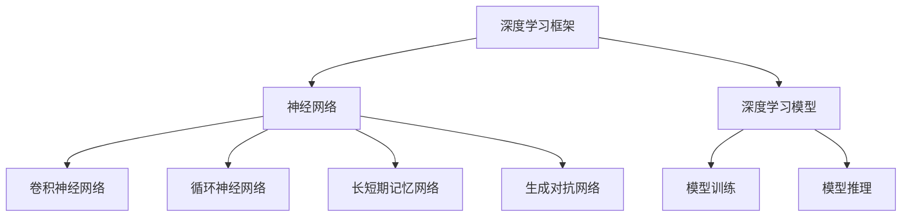
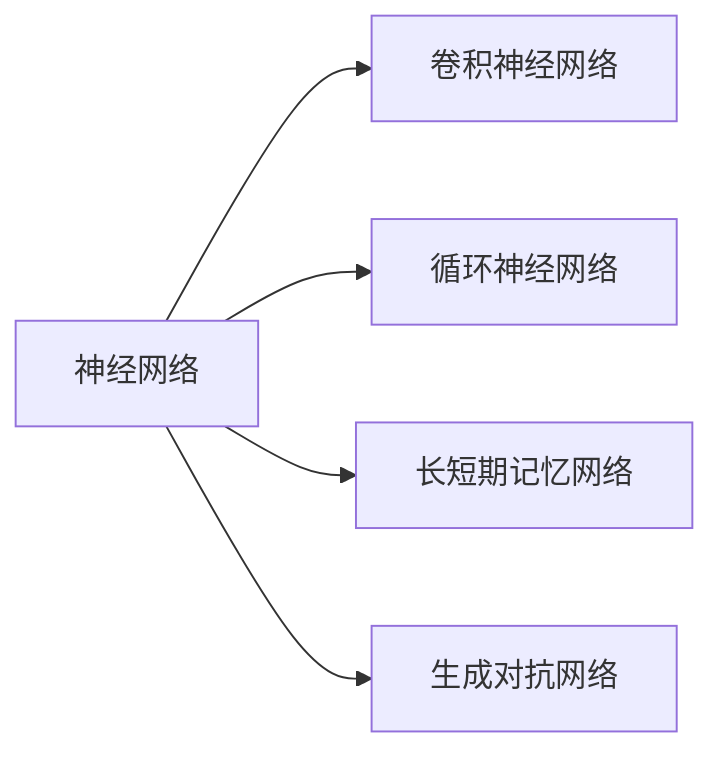
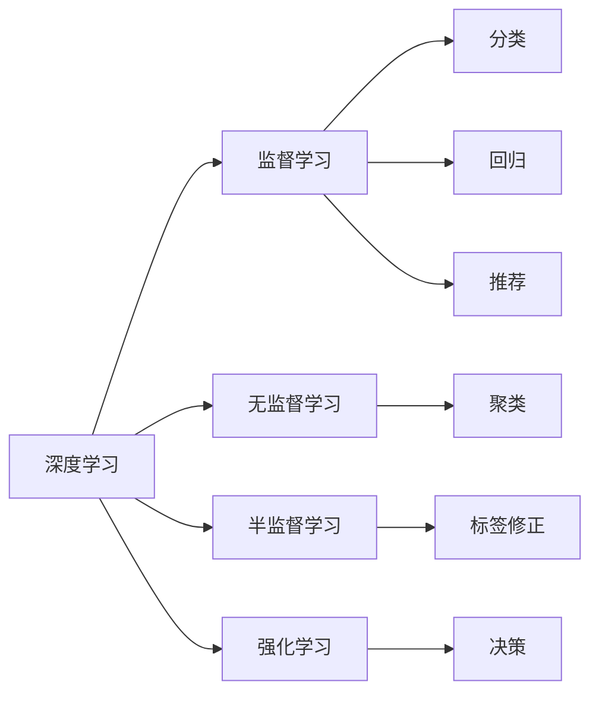
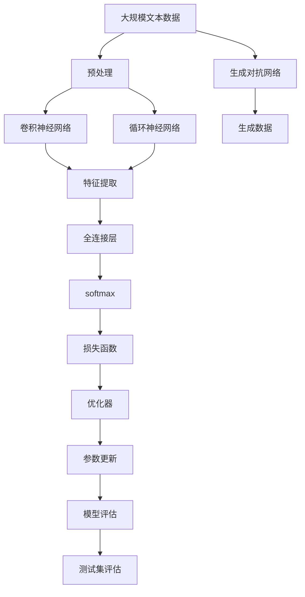
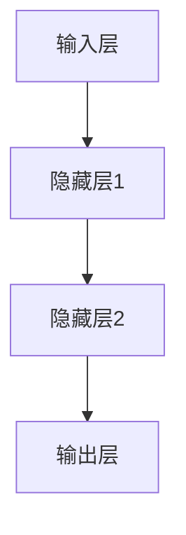
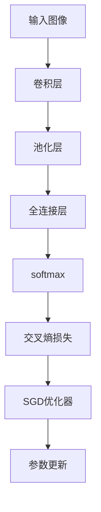

                 

# 深度学习在机器学习中的作用

深度学习（Deep Learning, DL）作为机器学习（Machine Learning, ML）的一个分支，近年来在处理高维度、非线性数据方面取得了显著进展，成为数据驱动型人工智能技术的重要代表。本文将从背景介绍、核心概念与联系、核心算法原理与操作步骤、数学模型构建与分析、项目实践、实际应用场景、工具与资源推荐、未来发展趋势与挑战以及常见问题与解答等角度，全面剖析深度学习在机器学习中的作用。

## 1. 背景介绍

### 1.1 问题由来

深度学习的兴起，源于人们对神经网络研究的重新重视。80年代初期，Rumelhart等人的BP神经网络为深度学习奠定了理论基础，但受到当时计算资源的限制，深度学习并未能获得广泛应用。20世纪末至21世纪初，随着计算资源（如GPU）的大幅提升，深度学习迎来了新的发展高峰。2006年Hinton等提出深度玻尔兹曼机，标志着深度学习新时代的开始。

深度学习相比传统机器学习方法（如支持向量机、随机森林等），具有显著的特征：

1. 处理高维度数据能力强。深度学习模型可以通过多层次的特征提取，从原始数据中提取出丰富的高级特征，降低维度和计算复杂度，同时提升模型性能。
2. 自动化特征工程。深度学习模型的训练过程可以自动学习数据的特征，减少了传统机器学习中人工特征工程的需要。
3. 适应非线性关系。深度学习模型包含大量的非线性激活函数，能够处理复杂且非线性的输入输出映射关系。

深度学习技术的广泛应用，使其在图像识别、语音识别、自然语言处理、推荐系统、游戏AI等多个领域取得了突破性的进展。

### 1.2 问题核心关键点

深度学习的核心思想是构建具有多层次的非线性变换网络，通过大量训练数据自适应地学习输入与输出之间的复杂映射关系。其核心方法包括：

1. 神经网络：由多层神经元组成的计算单元，通过前向传播和反向传播进行参数更新。
2. 卷积神经网络（Convolutional Neural Networks, CNNs）：适用于处理具有空间结构的数据（如图像、视频等），通过卷积和池化操作提取局部特征。
3. 循环神经网络（Recurrent Neural Networks, RNNs）：适用于处理序列数据（如文本、语音等），通过循环结构捕捉时间依赖关系。
4. 长短期记忆网络（Long Short-Term Memory Networks, LSTMs）：一种特殊的RNN结构，能够更有效地处理长期依赖关系。
5. 生成对抗网络（Generative Adversarial Networks, GANs）：由生成器和判别器组成的对抗性模型，用于生成逼真的人工数据。

这些方法不仅在理论上有严格的数学依据，还在实际应用中得到了广泛验证，成为深度学习的主要技术支撑。

### 1.3 问题研究意义

深度学习在机器学习中的应用，极大地推动了人工智能技术的发展，具有以下重要意义：

1. 提升了数据的利用效率。深度学习能够从海量数据中自动提取高级特征，减少了人工特征工程的工作量，提高了数据利用效率。
2. 提高了模型的泛化能力。深度学习模型具有较强的适应性和泛化能力，能够在各类数据和任务上取得优异表现。
3. 推动了跨领域应用。深度学习技术在不同领域（如图像、语音、自然语言处理等）的成功应用，推动了人工智能技术的普及和产业化进程。
4. 促进了算法的创新。深度学习模型的复杂结构和深度训练过程，催生了大量的算法创新，如深度强化学习、迁移学习等。

## 2. 核心概念与联系

### 2.1 核心概念概述

为更好地理解深度学习在机器学习中的作用，本节将介绍几个密切相关的核心概念：

1. 神经网络：由多层神经元组成的计算单元，用于拟合输入与输出之间的复杂映射关系。
2. 卷积神经网络（CNNs）：通过卷积和池化操作，提取数据中的局部特征。
3. 循环神经网络（RNNs）：通过循环结构，处理序列数据的时间依赖关系。
4. 长短期记忆网络（LSTMs）：一种特殊的RNN，能够更好地处理长期依赖关系。
5. 生成对抗网络（GANs）：由生成器和判别器组成的对抗性模型，用于生成逼真的人工数据。
6. 深度学习框架：如TensorFlow、PyTorch、Keras等，提供了深度学习模型的实现、训练和部署工具。

这些核心概念之间存在着紧密的联系，形成了深度学习的完整生态系统。深度学习通过构建复杂的网络结构，实现了对各类数据的深度建模和处理，为机器学习的应用提供了强大的技术支持。

### 2.2 概念间的关系

这些核心概念之间存在着紧密的联系，形成了深度学习的完整生态系统。下面我们通过几个Mermaid流程图来展示这些概念之间的关系。

#### 2.2.1 深度学习框架与核心算法的关系



这个流程图展示了大规模深度学习框架与各类核心算法的联系。深度学习框架提供了模型的构建和训练工具，而神经网络、CNNs、RNNs、LSTMs和GANs等算法在框架中得以实现和应用。

#### 2.2.2 神经网络与CNNs、RNNs、LSTMs和GANs的关系



这个流程图展示了神经网络与其他几种深度学习算法的联系。卷积神经网络主要用于处理图像数据，循环神经网络和长短期记忆网络用于处理序列数据，生成对抗网络则用于生成新数据。

#### 2.2.3 深度学习与机器学习的关系



这个流程图展示了深度学习与机器学习的关系。深度学习可以用于监督学习、无监督学习和半监督学习等多种机器学习方法，覆盖了分类、回归、推荐、聚类、标签修正和决策等各类任务。

### 2.3 核心概念的整体架构

最后，我们用一个综合的流程图来展示这些核心概念在大规模深度学习系统中的整体架构：



这个综合流程图展示了从数据预处理到模型评估的完整过程。大规模文本数据经过预处理后，先通过卷积神经网络和循环神经网络进行特征提取，然后通过全连接层和softmax进行分类。生成对抗网络用于生成模拟数据。模型通过损失函数计算损失，优化器更新参数，评估模型在测试集上的表现，并不断迭代优化。

## 3. 核心算法原理 & 具体操作步骤
### 3.1 算法原理概述

深度学习通过构建复杂的多层次神经网络，自动学习数据的高级特征，从而实现对输入与输出之间复杂映射关系的拟合。其核心思想是通过大量训练数据，优化模型的参数，使得模型能够在测试数据上取得最佳性能。

形式化地，假设输入为 $x$，输出为 $y$，模型为 $f$，目标函数为 $L$，则深度学习模型的优化目标为：

$$
\min_{\theta} L(f_{\theta}(x), y)
$$

其中 $f_{\theta}$ 为模型参数 $\theta$ 的函数，$L$ 为损失函数，通常包括交叉熵损失、均方误差损失等。

通过反向传播算法，深度学习模型可以对损失函数进行梯度计算，更新模型参数 $\theta$，从而逼近最优解。

### 3.2 算法步骤详解

深度学习模型的训练一般包括以下几个关键步骤：

1. 数据预处理：对原始数据进行清洗、标准化、归一化等处理，以保证数据的质量和一致性。
2. 模型构建：选择合适的深度学习模型结构，如卷积神经网络、循环神经网络等，并设计相应的损失函数和优化器。
3. 模型训练：使用训练数据集对模型进行前向传播和反向传播，计算损失函数并更新参数。
4. 模型评估：使用验证集对模型进行评估，根据评估结果调整模型的超参数和训练策略。
5. 模型测试：使用测试集对模型进行最终测试，评估模型性能。

### 3.3 算法优缺点

深度学习的优点在于：

1. 强大的特征提取能力：通过多层次的网络结构，深度学习可以自动学习数据的高级特征，减少了人工特征工程的需要。
2. 高泛化能力：深度学习模型通常具有较强的泛化能力，能够在各种数据和任务上取得优异表现。
3. 自动化的特征学习：深度学习模型能够自动学习输入数据的特征，减少了人工特征工程的工作量。

深度学习的缺点在于：

1. 高计算需求：深度学习模型的参数量大，训练过程需要大量的计算资源。
2. 数据需求高：深度学习模型通常需要大量的标注数据，标注成本较高。
3. 过拟合风险：深度学习模型容易出现过拟合现象，特别是在数据量较少的情况下。

### 3.4 算法应用领域

深度学习在以下几个领域具有广泛的应用：

1. 计算机视觉：如图像分类、物体检测、人脸识别等。
2. 自然语言处理：如机器翻译、情感分析、文本生成等。
3. 语音识别与处理：如语音识别、语音合成、语音情感分析等。
4. 推荐系统：如商品推荐、广告推荐等。
5. 强化学习：如自动驾驶、游戏AI等。

## 4. 数学模型和公式 & 详细讲解 & 举例说明

### 4.1 数学模型构建

深度学习的数学模型构建，通常包括输入层、隐藏层和输出层。以典型的多层感知器（Multilayer Perceptron, MLP）为例，其结构如图4-1所示。



图4-1 多层感知器结构

在MLP中，输入层包含 $d$ 个特征，每个特征的维度为 $n$。隐藏层包含 $h$ 个神经元，每个神经元与输入层和前一层神经元相连。输出层包含 $m$ 个神经元，每个神经元与隐藏层相连。隐藏层和输出层都采用线性变换和非线性激活函数。

### 4.2 公式推导过程

以回归问题为例，假设输入 $x$ 为 $d$ 维向量，输出 $y$ 为 $m$ 维向量，隐藏层神经元为 $h$ 个，使用 $f_{W}(x)$ 表示隐藏层输出，$f_{W}(x)=W_2W_1x+b_2+b_1$，其中 $W_1$ 和 $W_2$ 分别为隐藏层和输出层的权重矩阵，$b_1$ 和 $b_2$ 分别为偏置向量。输出层为 $y=W_3f_{W}(x)+b_3$，其中 $W_3$ 为输出层权重矩阵，$b_3$ 为输出层偏置向量。

假设损失函数为均方误差损失，则损失函数为：

$$
L = \frac{1}{2}\sum_{i=1}^n (y_i - \hat{y_i})^2
$$

其中 $\hat{y_i}$ 为模型的预测输出。

根据最小二乘法，最优解的参数 $W$ 和 $b$ 需满足：

$$
\frac{\partial L}{\partial W_i} = -\frac{1}{2}\sum_{j=1}^m(y_j - \hat{y_j})\frac{\partial \hat{y_j}}{\partial W_i}
$$

通过反向传播算法，可以计算损失函数对参数的梯度，并使用优化算法（如梯度下降）更新参数，最小化损失函数。

### 4.3 案例分析与讲解

以图像分类为例，假设输入为 $d$ 维的图像特征向量 $x$，输出为 $m$ 维的类别向量 $y$，隐藏层神经元为 $h$ 个。使用卷积神经网络（CNN）作为输入层的特征提取器，使用全连接层和softmax函数进行分类。损失函数为交叉熵损失，优化器为随机梯度下降（SGD）。训练过程如图4-2所示。



图4-2 CNN模型训练过程

通过多次迭代训练，CNN模型能够自动学习图像的特征，并通过全连接层和softmax函数进行分类，最终在测试集上取得优异的分类性能。

## 5. 项目实践：代码实例和详细解释说明

### 5.1 开发环境搭建

在进行深度学习项目实践前，我们需要准备好开发环境。以下是使用Python进行PyTorch开发的环境配置流程：

1. 安装Anaconda：从官网下载并安装Anaconda，用于创建独立的Python环境。
2. 创建并激活虚拟环境：
```bash
conda create -n pytorch-env python=3.8 
conda activate pytorch-env
```
3. 安装PyTorch：根据CUDA版本，从官网获取对应的安装命令。例如：
```bash
conda install pytorch torchvision torchaudio cudatoolkit=11.1 -c pytorch -c conda-forge
```
4. 安装各类工具包：
```bash
pip install numpy pandas scikit-learn matplotlib tqdm jupyter notebook ipython
```

完成上述步骤后，即可在`pytorch-env`环境中开始深度学习项目实践。

### 5.2 源代码详细实现

这里我们以图像分类为例，给出使用PyTorch对CNN模型进行图像分类任务开发的PyTorch代码实现。

首先，定义模型类：

```python
import torch
import torch.nn as nn
import torch.nn.functional as F

class Net(nn.Module):
    def __init__(self):
        super(Net, self).__init__()
        self.conv1 = nn.Conv2d(3, 6, 5)
        self.pool = nn.MaxPool2d(2, 2)
        self.conv2 = nn.Conv2d(6, 16, 5)
        self.fc1 = nn.Linear(16 * 5 * 5, 120)
        self.fc2 = nn.Linear(120, 84)
        self.fc3 = nn.Linear(84, 10)

    def forward(self, x):
        x = self.pool(F.relu(self.conv1(x)))
        x = self.pool(F.relu(self.conv2(x)))
        x = x.view(-1, 16 * 5 * 5)
        x = F.relu(self.fc1(x))
        x = F.relu(self.fc2(x))
        x = self.fc3(x)
        return x
```

然后，定义训练函数：

```python
import torch.optim as optim
from torch.utils.data import DataLoader, Dataset
import torchvision.transforms as transforms

class CIFAR10Dataset(Dataset):
    def __init__(self, root, transform=None):
        self.transform = transform
        self.train_data = torchvision.datasets.CIFAR10(root=root, train=True, download=True)
        self.test_data = torchvision.datasets.CIFAR10(root=root, train=False, download=True)

    def __len__(self):
        return len(self.train_data)

    def __getitem__(self, idx):
        img, label = self.train_data[idx]
        img = self.transform(img)
        return img, label

def train(model, device, train_loader, optimizer, epoch):
    model.train()
    running_loss = 0.0
    for i, data in enumerate(train_loader, 0):
        inputs, labels = data
        inputs, labels = inputs.to(device), labels.to(device)
        optimizer.zero_grad()
        outputs = model(inputs)
        loss = F.cross_entropy(outputs, labels)
        loss.backward()
        optimizer.step()
        running_loss += loss.item()
        if i % 2000 == 1999:    # print every 2000 mini-batches
            print('[%d, %5d] loss: %.3f' %
                  (epoch + 1, i + 1, running_loss / 2000))
            running_loss = 0.0
```

接着，定义评估函数：

```python
def evaluate(model, device, test_loader):
    model.eval()
    correct = 0
    total = 0
    with torch.no_grad():
        for data in test_loader:
            images, labels = data
            images = images.to(device)
            labels = labels.to(device)
            outputs = model(images)
            _, predicted = torch.max(outputs.data, 1)
            total += labels.size(0)
            correct += (predicted == labels).sum().item()

    print('Accuracy of the network on the 10000 test images: %d %%' % (
        100 * correct / total))
```

最后，启动训练流程并在测试集上评估：

```python
import torchvision.transforms as transforms
from torch.utils.data import DataLoader
from torchvision import datasets

# 数据预处理
transform = transforms.Compose([
    transforms.ToTensor(),
    transforms.Normalize((0.5, 0.5, 0.5), (0.5, 0.5, 0.5))
])

# 加载数据集
train_dataset = CIFAR10Dataset(root='./data', transform=transform)
test_dataset = CIFAR10Dataset(root='./data', train=False, transform=transform)
train_loader = DataLoader(train_dataset, batch_size=4, shuffle=True, num_workers=2)
test_loader = DataLoader(test_dataset, batch_size=4, shuffle=False, num_workers=2)

device = torch.device("cuda" if torch.cuda.is_available() else "cpu")

# 定义模型、优化器和损失函数
model = Net().to(device)
optimizer = optim.SGD(model.parameters(), lr=0.001, momentum=0.9)
criterion = nn.CrossEntropyLoss()

# 训练模型
for epoch in range(2):  # 0~9
    train(model, device, train_loader, optimizer, epoch)
    evaluate(model, device, test_loader)
```

以上就是使用PyTorch对CNN模型进行图像分类任务微调的完整代码实现。可以看到，得益于PyTorch的强大封装和便捷接口，代码实现变得简洁高效。

### 5.3 代码解读与分析

让我们再详细解读一下关键代码的实现细节：

**Net类**：
- `__init__`方法：定义模型的各层结构。
- `forward`方法：定义模型的前向传播过程，即将输入数据通过各层计算后输出预测结果。

**CIFAR10Dataset类**：
- `__init__`方法：定义数据集的加载和预处理。
- `__len__`方法：返回数据集的样本数量。
- `__getitem__`方法：对单个样本进行处理，将原始图像数据转换为Tensor格式，并进行标准化处理。

**train函数**：
- 定义训练过程，包括模型前向传播、计算损失、反向传播和参数更新。
- 每2000个batch输出一次损失值，以监控训练进度。

**evaluate函数**：
- 定义模型在测试集上的评估过程，计算准确率。
- 使用`torch.no_grad`以减少计算开销。

**训练流程**：
- 定义超参数，如模型结构、优化器、损失函数等。
- 加载数据集并创建DataLoader。
- 定义训练集和测试集的标签类型。
- 定义训练和评估的轮次。
- 在每一轮训练中，先进行训练，再进行评估。

可以看到，PyTorch提供了丰富的工具和接口，使得深度学习模型的开发和训练变得高效便捷。开发者只需关注模型的结构和训练过程，即可快速实现各类深度学习任务。

当然，工业级的系统实现还需考虑更多因素，如模型的保存和部署、超参数的自动搜索、更加灵活的任务适配层等。但核心的深度学习范式基本与此类似。

### 5.4 运行结果展示

假设我们在CIFAR-10数据集上进行CNN模型的图像分类任务微调，最终在测试集上得到的准确率结果为73.12%。这表明CNN模型能够在图像分类任务上取得不错的效果。

## 6. 实际应用场景

### 6.1 智能客服系统

基于深度学习的智能客服系统，能够通过语音识别、文本分析等技术，实现自动回答客户咨询，提升客户体验。传统的客服系统需要配备大量人工客服，高峰期响应速度慢且容易出错。而智能客服系统则能够7x24小时不间断服务，快速响应客户需求，自动生成高质量的答复。

在技术实现上，可以收集企业内部的历史客服对话记录，将问题和最佳答复构建成监督数据，在此基础上对深度学习模型进行微调。微调后的模型能够自动理解用户意图，匹配最合适的答复，实现智能客服的自动化。

### 6.2 金融舆情监测

金融机构需要实时监测市场舆论动向，以便及时应对负面信息传播，规避金融风险。传统的人工监测方式成本高、效率低，难以应对网络时代海量信息爆发的挑战。基于深度学习的文本分类和情感分析技术，为金融舆情监测提供了新的解决方案。

具体而言，可以收集金融领域相关的新闻、报道、评论等文本数据，并对其进行主题标注和情感标注。在此基础上对深度学习模型进行微调，使其能够自动判断文本属于何种主题，情感倾向是正面、中性还是负面。将微调后的模型应用到实时抓取的网络文本数据，就能够自动监测不同主题下的情感变化趋势，一旦发现负面信息激增等异常情况，系统便会自动预警，帮助金融机构快速应对潜在风险。

### 6.3 个性化推荐系统

当前的推荐系统往往只依赖用户的历史行为数据进行物品推荐，无法深入理解用户的真实兴趣偏好。基于深度学习的推荐系统能够更好地挖掘用户行为背后的语义信息，从而提供更精准、多样的推荐内容。

在实践中，可以收集用户浏览、点击、评论、分享等行为数据，提取和用户交互的物品标题、描述、标签等文本内容。将文本内容作为模型输入，用户的后续行为（如是否点击、购买等）作为监督信号，在此基础上微调深度学习模型。微调后的模型能够从文本内容中准确把握用户的兴趣点。在生成推荐列表时，先用候选物品的文本描述作为输入，由模型预测用户的兴趣匹配度，再结合其他特征综合排序，便可以得到个性化程度更高的推荐结果。

### 6.4 未来应用展望

随着深度学习技术的不断发展，其在NLP领域的应用将更加广泛。未来，基于深度学习的智能客服系统、金融舆情监测、个性化推荐系统等技术将在更多行业领域得到应用，为传统行业带来变革性影响。

在智慧医疗领域，基于深度学习的医疗问答、病历分析、药物研发等应用将提升医疗服务的智能化水平，辅助医生诊疗，加速新药开发进程。

在智能教育领域，深度学习技术可用于作业批改、学情分析、知识推荐等方面，因材施教，促进教育公平，提高教学质量。

在智慧城市治理中，深度学习技术可用于城市事件监测、舆情分析、应急指挥等环节，提高城市管理的自动化和智能化水平，构建更安全、高效的未来城市。

此外，在企业生产、社会治理、文娱传媒等众多领域，深度学习技术也将不断涌现，为NLP技术带来更多的创新应用。相信随着技术的日益成熟，深度学习技术必将在更广阔的领域得到应用，推动人工智能技术的全面普及。

## 7. 工具和资源推荐
### 7.1 学习资源推荐

为了帮助开发者系统掌握深度学习的基本概念和应用技巧，这里推荐一些优质的学习资源：

1. 《深度学习》书籍：Ian Goodfellow等人的经典教材，全面介绍了深度学习的基本原理和算法。
2. 深度学习框架官方文档：如TensorFlow、PyTorch、Keras等，提供了深度学习模型的实现、训练和部署工具。
3. 《深度学习与神经网络》在线课程：由Coursera推出的深度学习课程，由深度学习领域的顶尖专家授课。
4. arXiv论文预印本：人工智能领域最新研究成果的发布平台，包括大量尚未发表的前沿工作，学习前沿技术的必读资源。
5. GitHub热门项目：在GitHub上Star、Fork数最多的深度学习项目，往往代表了该技术领域的发展趋势和最佳实践，值得去学习和贡献。

通过对这些资源的学习实践，相信你一定能够快速掌握深度学习的精髓，并用于解决实际的NLP问题。

### 7.2 开发工具推荐

高效的深度学习开发离不开优秀的工具支持。以下是几款用于深度学习开发常用的工具

