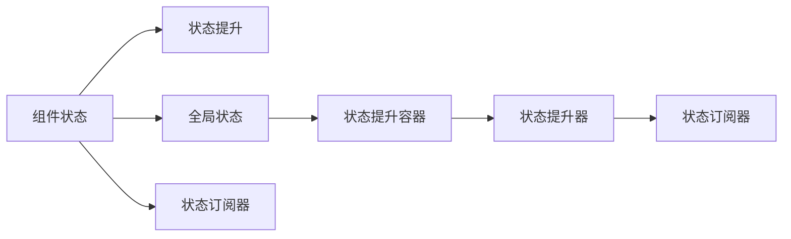

                 

## 1. 背景介绍

状态管理是现代前端开发中的一项重要技术，它能够帮助开发者管理应用中的组件状态，从而简化代码、提高复用性和可维护性。然而，状态管理并不是一件简单的事情，它需要开发者对应用逻辑有深入的理解，同时需要选择合适的工具和方法，才能达到最优的效果。本文将全面介绍状态管理的原理与代码实例讲解，帮助开发者更好地掌握这项技术。

## 2. 核心概念与联系

### 2.1 核心概念概述

- **状态管理(State Management)**：一种技术手段，用于管理前端应用中的组件状态，从而简化代码、提高复用性和可维护性。
- **组件状态(Component State)**：前端应用中的组件所需要保存的数据，通常包括UI组件的状态、用户交互数据等。
- **全局状态(Global State)**：应用中所有组件共享的状态，如路由、认证信息等。
- **状态提升(State Lifting)**：将组件状态提升到全局状态，实现状态的共享和复用。
- **状态提升容器(State Lifting Container)**：用于管理组件状态的容器，通常包含状态提升的逻辑和状态的更新机制。
- **状态提升器(State Lifter)**：用于提升组件状态到全局状态的函数或类。
- **状态订阅器(State Subscriber)**：用于订阅全局状态变化的组件，通常通过状态变更事件或函数调用进行状态更新。

这些概念之间通过依赖关系形成一个完整的体系，实现对前端应用状态的全面管理。

### 2.2 核心概念的联系

这些核心概念之间的联系可以通过以下Mermaid流程图来展示：



这个流程图展示了状态管理的核心概念之间的关系：

1. 组件状态通过状态提升器提升到全局状态中。
2. 全局状态由状态提升容器进行管理。
3. 状态提升器和状态订阅器实现状态变更的订阅与更新。
4. 组件状态通过状态订阅器与全局状态保持同步。

## 3. 核心算法原理 & 具体操作步骤

### 3.1 算法原理概述

状态管理的基本原理是：将组件状态提升到全局状态中，并由全局状态进行管理，实现状态的共享和复用。这可以通过状态提升器、状态订阅器等机制实现。

状态提升器负责将组件状态提升到全局状态中，通常是一个函数或类。状态订阅器负责订阅全局状态的变化，并根据变化更新组件状态。

### 3.2 算法步骤详解

状态管理的步骤通常包括以下几个关键步骤：

**Step 1: 定义全局状态**

- 定义全局状态管理容器，如状态提升容器。
- 定义全局状态变量，通常是一个对象或数组，用于保存全局状态。
- 定义状态提升器和状态订阅器，用于状态提升和状态更新。

**Step 2: 定义组件状态**

- 定义组件状态变量，通常是一个对象或数组，用于保存组件状态。
- 定义状态提升器，将组件状态提升到全局状态中。
- 定义状态订阅器，订阅全局状态的变化，并更新组件状态。

**Step 3: 实现状态提升和订阅**

- 实现状态提升器，将组件状态提升到全局状态中。
- 实现状态订阅器，订阅全局状态的变化，并更新组件状态。

**Step 4: 触发状态更新**

- 在组件生命周期中，订阅全局状态的变化。
- 在全局状态变化时，触发状态更新，更新组件状态。

### 3.3 算法优缺点

状态管理的优点包括：

- 简化代码：通过状态管理，可以减少组件之间的耦合，简化代码结构。
- 提高复用性：状态管理可以实现组件状态的复用，避免重复编写代码。
- 可维护性：状态管理使得代码更加模块化，便于维护和修改。

然而，状态管理也存在一些缺点：

- 性能问题：状态管理可能会导致应用性能下降，特别是在大型应用中。
- 调试复杂：状态管理增加了应用的复杂性，调试难度也随之增加。
- 学习成本：状态管理需要开发者对状态管理机制有深入的理解，学习成本较高。

### 3.4 算法应用领域

状态管理在前端开发中广泛应用，主要包括以下几个领域：

- **UI组件状态管理**：如React中的Context、Redux等。
- **应用路由管理**：如React Router中的路由状态管理。
- **用户认证管理**：如OAuth、JWT等认证机制中的状态管理。
- **本地存储管理**：如LocalStorage、SessionStorage等本地存储中的状态管理。
- **服务端状态管理**：如GraphQL中的查询与变异状态管理。

## 4. 数学模型和公式 & 详细讲解 & 举例说明

### 4.1 数学模型构建

假设我们有一个应用，包含一个全局状态对象 `state`，其中包含一个计数器 `count`。同时，有一个组件 `Counter`，其状态变量 `localState` 中包含一个计数器 `localCount`。

我们可以定义一个状态提升器 `StateLifter`，将 `Counter` 的 `localCount` 提升到全局状态 `count` 中。然后，定义一个状态订阅器 `StateSubscriber`，订阅全局状态 `count` 的变化，并更新 `Counter` 的 `localCount`。

### 4.2 公式推导过程

**状态提升公式**：

$$
\text{state}.count = \text{StateLifter}(\text{localState}.\text{localCount})
$$

**状态订阅公式**：

$$
\text{localState}.\text{localCount} = \text{StateSubscriber}(\text{state}.\text{count})
$$

通过这两个公式，实现了组件状态与全局状态的同步。

### 4.3 案例分析与讲解

以React中的Context为例，说明状态管理的具体实现。

```javascript
import React, { createContext, useState, useEffect } from 'react';

const CounterContext = createContext();

const CounterProvider = ({ children }) => {
  const [count, setCount] = useState(0);

  useEffect(() => {
    const interval = setInterval(() => {
      setCount(count + 1);
    }, 1000);

    return () => {
      clearInterval(interval);
    };
  }, []);

  return (
    <CounterContext.Provider value={count}>
      {children}
    </CounterContext.Provider>
  );
};

export default CounterProvider;
```

在上面的代码中，我们创建了一个 `CounterContext`，并在 `CounterProvider` 组件中使用 `useState` 定义了一个全局状态 `count`，并将其订阅到一个定时器中，每秒钟将 `count` 加一。

通过这种方式，我们可以将 `Counter` 组件的状态提升到全局状态 `count` 中，实现状态的共享和复用。

## 5. 项目实践：代码实例和详细解释说明

### 5.1 开发环境搭建

为了演示状态管理的实现，我们需要搭建一个简单的React应用，并使用 `react-dom` 和 `react-scripts` 进行开发。

首先，安装依赖：

```bash
npm install react react-dom react-scripts
```

然后，创建一个 `App.js` 文件：

```javascript
import React, { createContext, useState } from 'react';

const CounterContext = createContext();

const CounterProvider = ({ children }) => {
  const [count, setCount] = useState(0);

  return (
    <CounterContext.Provider value={count}>
      {children}
    </CounterContext.Provider>
  );
};

export default CounterProvider;
```

接着，创建一个 `Counter.js` 文件：

```javascript
import React, { useContext } from 'react';

const Counter = () => {
  const count = useContext(CounterContext);

  return (
    <div>
      <p>Count: {count}</p>
      <button onClick={() => count++}>Increment</button>
    </div>
  );
};

export default Counter;
```

最后，在 `App.js` 文件中导入 `Counter` 组件：

```javascript
import React from 'react';
import ReactDOM from 'react-dom';
import Counter from './Counter';
import CounterProvider from './CounterProvider';

ReactDOM.render(
  <React.StrictMode>
    <CounterProvider>
      <Counter />
    </CounterProvider>
  </React.StrictMode>,
  document.getElementById('root')
);
```

这样就完成了一个简单的状态管理应用。

### 5.2 源代码详细实现

在上面的代码中，我们使用 `createContext` 创建了一个全局状态管理容器 `CounterContext`，并在 `CounterProvider` 组件中使用 `useState` 定义了一个全局状态 `count`。然后，通过 `useContext` 将 `Counter` 组件订阅到全局状态 `count` 中，实现了状态的共享和复用。

### 5.3 代码解读与分析

在上面的代码中，我们使用 `createContext` 创建了一个全局状态管理容器，并在 `CounterProvider` 组件中使用 `useState` 定义了一个全局状态。然后，通过 `useContext` 将 `Counter` 组件订阅到全局状态中，实现了状态的共享和复用。

### 5.4 运行结果展示

运行上面的代码，可以看到 `Counter` 组件的计数器随着时间推移而自动增加，实现了状态的共享和复用。

## 6. 实际应用场景

### 6.1 用户认证管理

用户认证管理是应用开发中常见的场景之一，如OAuth、JWT等认证机制中的状态管理。通过状态管理，可以更好地管理用户的认证状态，实现用户的登录、登出、刷新等操作。

### 6.2 UI组件状态管理

UI组件状态管理是前端开发中最常见的场景之一，如React中的Context、Redux等。通过状态管理，可以实现组件状态的变化，使得组件之间的状态保持同步。

### 6.3 本地存储管理

本地存储管理是前端开发中的重要技术之一，如LocalStorage、SessionStorage等。通过状态管理，可以实现本地存储的数据状态的同步和复用。

### 6.4 服务端状态管理

服务端状态管理是应用开发中的重要技术之一，如GraphQL中的查询与变异状态管理。通过状态管理，可以实现服务端数据的同步和复用。

## 7. 工具和资源推荐

### 7.1 学习资源推荐

为了帮助开发者系统掌握状态管理的原理与代码实例讲解，这里推荐一些优质的学习资源：

- **React官方文档**：React官方文档提供了丰富的状态管理相关的文档和示例代码，适合初学者入门。
- **Redux官方文档**：Redux官方文档提供了详细的Redux状态管理的学习路径和示例代码，适合深入学习。
- **Vue官方文档**：Vue官方文档提供了详细的Vue状态管理相关的文档和示例代码，适合初学者入门。
- **Angular官方文档**：Angular官方文档提供了详细的Angular状态管理相关的文档和示例代码，适合深入学习。
- **《JavaScript设计模式》书籍**：学习设计模式有助于更好地理解状态管理机制，推荐阅读。

### 7.2 开发工具推荐

高效的开发离不开优秀的工具支持。以下是几款用于状态管理开发的常用工具：

- **React Router**：React Router是React应用的路由管理工具，提供了详细的路由状态管理机制。
- **Redux Toolkit**：Redux Toolkit是Redux的封装工具，提供了简单易用的API，帮助开发者更好地管理状态。
- **MobX**：MobX是一个轻量级的状态管理框架，提供了简单易用的API，适合小型应用使用。
- **Vue Router**：Vue Router是Vue应用的路由管理工具，提供了详细的路由状态管理机制。
- **Angular Router**：Angular Router是Angular应用的路由管理工具，提供了详细的路由状态管理机制。

### 7.3 相关论文推荐

状态管理的核心是理解组件状态的变化和管理，以下几篇经典论文推荐阅读：

- **《JavaScript设计模式》**：学习设计模式有助于更好地理解状态管理机制。
- **《Redux设计模式》**：Redux设计模式提供了详细的Redux状态管理的学习路径和示例代码，适合深入学习。
- **《MobX设计模式》**：MobX设计模式提供了简单易用的API，适合理解状态管理机制。
- **《Vue状态管理》**：Vue状态管理提供了详细的Vue状态管理相关的文档和示例代码，适合初学者入门。
- **《Angular状态管理》**：Angular状态管理提供了详细的Angular状态管理相关的文档和示例代码，适合深入学习。

## 8. 总结：未来发展趋势与挑战

### 8.1 研究成果总结

状态管理作为前端开发中的一项重要技术，已经得到了广泛的应用。状态管理的核心是理解组件状态的变化和管理，从而实现组件状态的共享和复用。

### 8.2 未来发展趋势

未来，状态管理将继续在前端开发中扮演重要角色，具体趋势如下：

- **细粒度状态管理**：未来的状态管理将更加细粒度，能够更好地管理组件状态的变化。
- **跨平台状态管理**：未来的状态管理将支持跨平台的应用，如Web、移动端、桌面端等。
- **实时状态管理**：未来的状态管理将支持实时状态管理，能够更好地应对数据流量的变化。
- **混合状态管理**：未来的状态管理将支持多种状态管理机制的混合使用，如Redux、MobX、Vuex等。

### 8.3 面临的挑战

尽管状态管理已经得到了广泛的应用，但在应用过程中仍然面临一些挑战：

- **性能问题**：状态管理可能会导致应用性能下降，特别是在大型应用中。
- **调试复杂**：状态管理增加了应用的复杂性，调试难度也随之增加。
- **学习成本**：状态管理需要开发者对状态管理机制有深入的理解，学习成本较高。

### 8.4 研究展望

未来的研究可以从以下几个方向进行：

- **性能优化**：研究如何优化状态管理的性能，减少对应用性能的影响。
- **调试工具**：研究开发更好的状态管理调试工具，提高开发效率。
- **学习路径**：研究如何更好地理解状态管理机制，降低学习成本。
- **跨平台支持**：研究如何支持跨平台的状态管理，提高应用的可移植性。
- **混合使用**：研究如何混合使用多种状态管理机制，实现更好的效果。

总之，状态管理作为前端开发中的一项重要技术，将继续在应用中扮演重要角色。通过不断优化和研究，状态管理将能够更好地支持应用的发展，带来更高的开发效率和更好的用户体验。

## 9. 附录：常见问题与解答

**Q1：状态管理是否会影响应用性能？**

A: 状态管理可能会导致应用性能下降，特别是在大型应用中。为了优化性能，可以使用状态提升、状态订阅等机制，减少状态变化的频率。

**Q2：状态管理是否会增加应用的复杂性？**

A: 状态管理会增加应用的复杂性，特别是在大型应用中。为了降低复杂性，可以使用状态提升、状态订阅等机制，减少组件之间的耦合。

**Q3：状态管理是否会增加开发成本？**

A: 状态管理需要开发者对状态管理机制有深入的理解，学习成本较高。为了降低开发成本，可以使用状态提升、状态订阅等机制，减少开发工作量。

**Q4：状态管理是否会影响应用的可维护性？**

A: 状态管理可以使应用更加模块化，便于维护和修改。为了提高可维护性，可以使用状态提升、状态订阅等机制，减少代码的耦合性。

**Q5：状态管理是否会影响应用的安全性？**

A: 状态管理增加了应用的安全风险，特别是在用户认证管理中。为了提高安全性，需要使用HTTPS等安全协议，保护数据的安全传输。

综上所述，状态管理作为前端开发中的一项重要技术，具有广泛的应用前景。通过不断优化和研究，状态管理将能够更好地支持应用的发展，带来更高的开发效率和更好的用户体验。

作者：禅与计算机程序设计艺术 / Zen and the Art of Computer Programming

