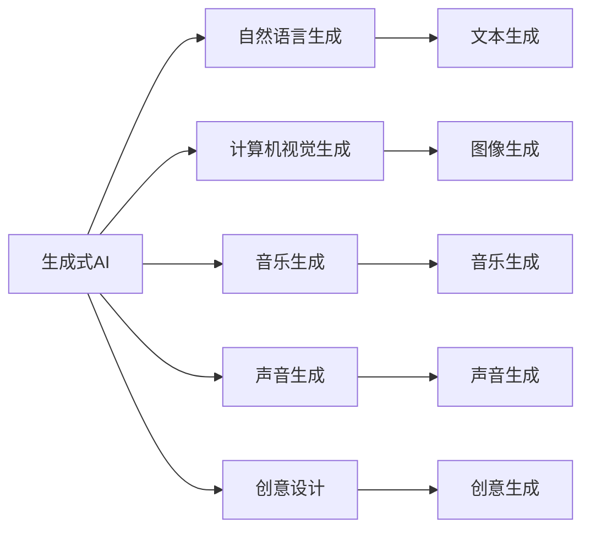
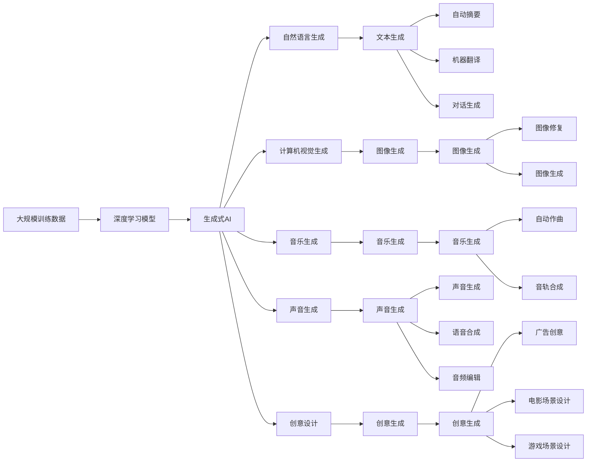

                 

# 生成式AIGC：科技创新与商业应用的融合

> 关键词：生成式AIGC,人工智能,科技创新,商业应用,深度学习,Transformer,预训练语言模型,自然语言生成,多模态数据处理,创意写作,创意设计,自动生成,自然语言处理

## 1. 背景介绍

### 1.1 问题由来

近年来，随着深度学习技术的飞速发展，人工智能（AI）技术在多个领域得到了广泛的应用，其中生成式人工智能（Generative AI, GAI）尤其引人注目。生成式AI利用深度学习模型，可以从训练数据中学习到复杂的概率分布，并生成高质量的、与训练数据相匹配的输出。生成式AI的核心是生成模型，其中包括了变分自编码器（VAE）、生成对抗网络（GAN）、自回归模型（如LSTM、GRU）、自编码器、以及最新的基于Transformer的生成模型。

生成式AI技术的应用范围非常广泛，包括但不限于以下几个方面：

1. **自然语言生成**：通过AI模型生成文本，例如自动摘要、机器翻译、对话生成等。
2. **计算机视觉生成**：生成高质量的图像、视频，如图像生成、视频补帧、图像修复等。
3. **音乐生成**：生成音乐、合成音轨、自动作曲等。
4. **声音生成**：合成语音、音频编辑、自动配音等。
5. **创意设计**：自动生成创意文本、图片、视频，如广告、电影、游戏场景设计等。

生成式AI技术的进步，正在深刻改变我们与数字内容的交互方式，为数字内容的创作、处理和传播带来了革命性的变化。科技创新与商业应用在生成式AI领域呈现出紧密结合的态势，推动了AI技术的广泛应用和市场价值的不断提升。

### 1.2 问题核心关键点

生成式AI技术的发展，离不开对创新技术的研究和商业应用的探索。其核心关键点主要包括以下几个方面：

1. **技术基础**：生成式AI建立在深度学习、概率生成模型、自监督学习等前沿技术的基础上，依赖于大量高质量的训练数据和强大的计算能力。
2. **商业应用**：生成式AI技术已被广泛应用于内容生成、媒体制作、游戏开发、广告创意、创意写作、图像生成等多个领域，显示了其强大的商业应用潜力。
3. **创新驱动**：生成式AI技术的进步依赖于算法创新、模型优化、数据增强等多种创新手段的结合，推动了技术的发展和应用的扩展。
4. **伦理挑战**：生成式AI在提升创意和效率的同时，也带来了一些伦理挑战，如版权争议、内容真实性、隐私保护等问题。
5. **跨界融合**：生成式AI技术与其他领域如心理学、文学、艺术等的交叉融合，开拓了更多创新方向和应用场景。

通过理解这些关键点，我们可以更好地把握生成式AI技术的本质，探索其未来的发展趋势和应用前景。

## 2. 核心概念与联系

### 2.1 核心概念概述

为更好地理解生成式AIGC的科技创新与商业应用，本节将介绍几个密切相关的核心概念：

1. **生成式人工智能（Generative AI, GAI）**：利用深度学习模型生成与训练数据相匹配的新数据，广泛应用于内容生成、媒体制作、广告创意、游戏设计等。

2. **生成对抗网络（Generative Adversarial Networks, GANs）**：一种生成模型，由生成器和判别器组成，通过对抗训练生成高质量的数据样本。

3. **变分自编码器（Variational Autoencoder, VAEs）**：一种生成模型，通过学习数据分布的变分特性，生成新的数据样本。

4. **自回归模型（如LSTM、GRU）**：一种生成模型，通过利用序列数据的前后关系，生成新的序列数据。

5. **自编码器（Autoencoders）**：一种生成模型，通过学习数据的压缩和重构特性，生成新的数据样本。

6. **基于Transformer的生成模型**：利用Transformer结构，结合自监督学习，生成高质量的文本、图像等数据。

7. **自然语言生成（Natural Language Generation, NLG）**：利用AI模型生成自然语言文本，广泛应用于自动摘要、机器翻译、对话生成等。

8. **计算机视觉生成（Computer Vision Generation）**：利用AI模型生成高质量的图像、视频，如图像生成、视频补帧、图像修复等。

9. **音乐生成**：利用AI模型生成音乐、合成音轨、自动作曲等。

10. **声音生成**：合成语音、音频编辑、自动配音等。

11. **创意设计**：自动生成创意文本、图片、视频，如广告、电影、游戏场景设计等。

这些核心概念之间存在着紧密的联系，形成了生成式AI技术的完整生态系统。通过理解这些概念，我们可以更好地把握生成式AI技术的工作原理和优化方向。

### 2.2 概念间的关系

这些核心概念之间存在着紧密的联系，形成了生成式AI技术的完整生态系统。下面我们通过几个Mermaid流程图来展示这些概念之间的关系。

#### 2.2.1 生成式AI的整体架构



这个流程图展示了生成式AI的核心概念及其之间的关系：

1. 生成式AI主要分为自然语言生成、计算机视觉生成、音乐生成、声音生成和创意设计五个方向。
2. 自然语言生成、计算机视觉生成等方向又进一步细分为更具体的任务。

#### 2.2.2 生成对抗网络（GAN）架构

```mermaid
graph LR
    A[生成对抗网络 (GANs)] --> B[生成器 (Generator)]
    A --> C[判别器 (Discriminator)]
    B --> D[样本生成]
    C --> E[判别结果]
    D --> F[生成样本]
```

这个流程图展示了生成对抗网络（GANs）的基本架构：

1. GANs由生成器和判别器组成，生成器用于生成样本，判别器用于判别生成样本的真实性。
2. 通过对抗训练，生成器和判别器不断优化，最终生成高质量的数据样本。

#### 2.2.3 变分自编码器（VAEs）架构

```mermaid
graph LR
    A[变分自编码器 (VAEs)] --> B[编码器 (Encoder)]
    A --> C[解码器 (Decoder)]
    B --> D[编码结果]
    C --> E[解码结果]
```

这个流程图展示了变分自编码器（VAEs）的基本架构：

1. VAEs由编码器和解码器组成，编码器用于将输入数据映射为潜在变量，解码器用于将潜在变量映射回原始数据。
2. VAEs通过学习数据分布的变分特性，生成新的数据样本。

### 2.3 核心概念的整体架构

最后，我们用一个综合的流程图来展示这些核心概念在生成式AI技术中的整体架构：



这个综合流程图展示了从大规模训练数据到生成式AI的完整过程，以及其各个核心概念的应用方向和具体任务。

## 3. 核心算法原理 & 具体操作步骤
### 3.1 算法原理概述

生成式AI的核心是生成模型，其原理是通过学习训练数据中的概率分布，生成新的、与训练数据相匹配的数据样本。生成模型的训练过程通常分为两个阶段：预训练和微调。

在预训练阶段，生成模型在大规模数据上学习到数据分布的复杂特征，为后续微调和生成任务打下了坚实的基础。预训练过程通常使用自监督学习方法，如最大似然估计、对抗训练、变分自编码器等。

在微调阶段，生成模型在特定任务的数据集上进行有监督学习，优化模型参数，使其生成的新数据样本符合任务要求。微调过程一般采用梯度下降等优化算法，根据任务损失函数更新模型参数。

### 3.2 算法步骤详解

生成式AI的微调过程通常包括以下几个关键步骤：

**Step 1: 准备预训练模型和数据集**
- 选择合适的预训练模型，如GPT、DALL-E、StyleGAN等。
- 准备下游任务的标注数据集，划分训练集、验证集和测试集。

**Step 2: 添加任务适配层**
- 根据任务类型，在预训练模型顶层设计合适的输出层和损失函数。
- 对于分类任务，通常在顶层添加线性分类器和交叉熵损失函数。
- 对于生成任务，通常使用语言模型的解码器输出概率分布，并以负对数似然为损失函数。

**Step 3: 设置微调超参数**
- 选择合适的优化算法及其参数，如Adam、SGD等，设置学习率、批大小、迭代轮数等。
- 设置正则化技术及强度，包括权重衰减、Dropout、Early Stopping等。
- 确定冻结预训练参数的策略，如仅微调顶层，或全部参数都参与微调。

**Step 4: 执行梯度训练**
- 将训练集数据分批次输入模型，前向传播计算损失函数。
- 反向传播计算参数梯度，根据设定的优化算法和学习率更新模型参数。
- 周期性在验证集上评估模型性能，根据性能指标决定是否触发Early Stopping。
- 重复上述步骤直到满足预设的迭代轮数或Early Stopping条件。

**Step 5: 测试和部署**
- 在测试集上评估微调后模型性能，对比微调前后的精度提升。
- 使用微调后的模型对新样本进行推理预测，集成到实际的应用系统中。
- 持续收集新的数据，定期重新微调模型，以适应数据分布的变化。

以上是生成式AI微调的一般流程。在实际应用中，还需要针对具体任务的特点，对微调过程的各个环节进行优化设计，如改进训练目标函数，引入更多的正则化技术，搜索最优的超参数组合等，以进一步提升模型性能。

### 3.3 算法优缺点

生成式AI微调方法具有以下优点：

1. **高效灵活**：通过预训练和微调两阶段，可以快速适应新任务，生成高质量的数据样本。
2. **泛化性强**：预训练模型在大量数据上学习到丰富的语言和视觉特征，具有较强的泛化能力。
3. **应用广泛**：生成式AI技术已广泛应用于自然语言生成、计算机视觉生成、音乐生成等多个领域，展示了其强大的应用潜力。
4. **易于部署**：生成式AI模型可以封装为API或服务，方便集成到应用系统中，支持实时生成。

同时，生成式AI微调方法也存在一些缺点：

1. **数据依赖**：微调效果依赖于高质量的标注数据，数据获取成本高。
2. **模型复杂**：预训练模型参数量巨大，计算资源需求高。
3. **可解释性差**：生成式AI模型通常是一个"黑盒"，难以解释其内部工作机制和决策逻辑。
4. **鲁棒性不足**：面对异常输入或噪声数据，生成式AI模型的输出可能不稳定。
5. **版权问题**：生成的数据样本可能侵犯原版权，引发版权争议。

尽管存在这些缺点，但总体而言，生成式AI微调方法仍然是目前最有效、最通用的数据生成方式之一。

### 3.4 算法应用领域

生成式AI技术已经被广泛应用于以下几个领域：

- **自然语言生成**：自动摘要、机器翻译、对话生成、新闻生成等。
- **计算机视觉生成**：图像生成、图像修复、图像风格转换、视频生成等。
- **音乐生成**：自动作曲、音轨生成、音乐风格迁移等。
- **声音生成**：语音合成、音频编辑、自动配音等。
- **创意设计**：广告创意生成、电影场景设计、游戏场景设计等。

除了上述这些领域外，生成式AI技术还在文学创作、艺术创作、虚拟现实、教育等领域得到应用。随着技术的不断进步，生成式AI技术的应用范围将会进一步扩大。

## 4. 数学模型和公式 & 详细讲解 & 举例说明

### 4.1 数学模型构建

生成式AI的核心是生成模型，其数学模型通常包括以下几个部分：

- **数据集**：训练数据集 $D=\{(x_i, y_i)\}_{i=1}^N$，其中 $x_i$ 为输入，$y_i$ 为标签。
- **生成模型**：生成模型 $G(z)$，将潜在变量 $z$ 映射到数据空间的概率分布 $p(x|z)$。
- **损失函数**：损失函数 $L(G)$，用于衡量生成模型的输出与真实数据之间的差异。

常用的生成模型包括生成对抗网络（GANs）、变分自编码器（VAEs）、自回归模型等。这里以生成对抗网络（GANs）为例，说明数学模型的构建。

GANs由生成器 $G$ 和判别器 $D$ 组成，其数学模型可以表示为：

$$
\begin{aligned}
G: & z \sim p_z(z) \rightarrow x \sim p_g(x|z) \\
D: & x \sim p_x(x) \rightarrow y \sim p_d(y|x) \\
\end{aligned}
$$

其中 $z$ 为潜在变量，$x$ 为数据样本，$y$ 为判别器输出。GANs的目标是通过对抗训练，使得生成器生成的数据与真实数据难以区分。

### 4.2 公式推导过程

GANs的训练过程可以分为两个阶段：生成器的训练和判别器的训练。

首先，对生成器 $G$ 进行训练：

$$
\min_G \mathcal{L}_G = -\mathbb{E}_{x \sim p_x}[\log D(x)] + \mathbb{E}_{z \sim p_z}[\log(1 - D(G(z)))]
$$

其中 $\mathcal{L}_G$ 为生成器的损失函数，$D(x)$ 为判别器对真实数据 $x$ 的判别概率，$D(G(z))$ 为判别器对生成数据 $G(z)$ 的判别概率。

然后，对判别器 $D$ 进行训练：

$$
\min_D \mathcal{L}_D = -\mathbb{E}_{x \sim p_x}[\log D(x)] + \mathbb{E}_{z \sim p_z}[\log(1 - D(G(z)))]
$$

其中 $\mathcal{L}_D$ 为判别器的损失函数。

通过对抗训练，生成器和判别器相互博弈，最终生成高质量的数据样本。

### 4.3 案例分析与讲解

以图像生成为例，假设有数据集 $D$ 包含10,000张高质量的图像。通过GANs训练，生成器 $G$ 能够学习到数据的分布特性，生成与真实数据相匹配的新图像。

首先，在生成器 $G$ 上进行预训练，利用大量数据学习数据的分布特性。然后，在测试集上评估生成器的性能，根据性能指标决定是否进行微调。如果性能不理想，可以对生成器进行微调，调整模型参数以优化生成效果。

在微调过程中，可以添加任务适配层，设计合适的损失函数，选择适当的优化算法和超参数。微调后的生成器能够在特定任务上生成高质量的图像。

## 5. 项目实践：代码实例和详细解释说明

### 5.1 开发环境搭建

在进行生成式AI项目实践前，我们需要准备好开发环境。以下是使用Python进行PyTorch开发的环境配置流程：

1. 安装Anaconda：从官网下载并安装Anaconda，用于创建独立的Python环境。

2. 创建并激活虚拟环境：
```bash
conda create -n pytorch-env python=3.8 
conda activate pytorch-env
```

3. 安装PyTorch：根据CUDA版本，从官网获取对应的安装命令。例如：
```bash
conda install pytorch torchvision torchaudio cudatoolkit=11.1 -c pytorch -c conda-forge
```

4. 安装Transformers库：
```bash
pip install transformers
```

5. 安装各类工具包：
```bash
pip install numpy pandas scikit-learn matplotlib tqdm jupyter notebook ipython
```

完成上述步骤后，即可在`pytorch-env`环境中开始生成式AI实践。

### 5.2 源代码详细实现

这里以生成对抗网络（GANs）为例，说明如何通过PyTorch实现图像生成任务。

首先，定义GANs模型：

```python
import torch
import torch.nn as nn
import torch.optim as optim

class GAN(nn.Module):
    def __init__(self, latent_dim, image_dim):
        super(GAN, self).__init__()
        self.latent_dim = latent_dim
        self.gen = nn.Sequential(
            nn.Linear(latent_dim, 128),
            nn.ReLU(),
            nn.Linear(128, 256),
            nn.ReLU(),
            nn.Linear(256, image_dim),
            nn.Sigmoid()
        )
        self.dis = nn.Sequential(
            nn.Linear(image_dim, 128),
            nn.ReLU(),
            nn.Linear(128, 1),
            nn.Sigmoid()
        )

    def forward(self, z):
        fake_images = self.gen(z)
        real_labels = torch.ones_like(fake_images)
        fake_labels = torch.zeros_like(fake_images)
        return fake_images, real_labels, fake_labels

    def get_discriminator_loss(self, real_images, fake_images, real_labels, fake_labels):
        real_loss = -torch.mean(torch.log(self.dis(real_images) + 1e-12))
        fake_loss = -torch.mean(torch.log(1 - self.dis(fake_images) + 1e-12))
        discriminator_loss = real_loss + fake_loss
        return discriminator_loss

    def get_generator_loss(self, real_images, fake_images, real_labels, fake_labels):
        gen_loss = -torch.mean(torch.log(self.dis(fake_images) + 1e-12))
        return gen_loss

    def train(self, generator, discriminator, batch_size, n_epochs):
        optimizer_G = optim.Adam(generator.parameters(), lr=0.0002)
        optimizer_D = optim.Adam(discriminator.parameters(), lr=0.0002)

        for epoch in range(n_epochs):
            for i, (real_images, _) in enumerate(train_loader):
                real_images = real_images.view(real_images.size(0), -1)
                z = torch.randn(batch_size, self.latent_dim)
                fake_images = generator(z)
                real_labels = torch.ones_like(fake_images)
                fake_labels = torch.zeros_like(fake_images)

                real_loss = self.get_discriminator_loss(real_images, fake_images, real_labels, fake_labels)
                fake_loss = self.get_generator_loss(real_images, fake_images, real_labels, fake_labels)

                optimizer_G.zero_grad()
                optimizer_D.zero_grad()

                fake_loss.backward(torch.ones_like(fake_loss))
                real_loss.backward(torch.ones_like(real_loss))

                optimizer_G.step()
                optimizer_D.step()
```

然后，定义训练函数：

```python
def train_gan(generator, discriminator, train_loader, batch_size, n_epochs):
    n_epochs = 1000
    for epoch in range(n_epochs):
        for i, (real_images, _) in enumerate(train_loader):
            real_images = real_images.view(real_images.size(0), -1)
            z = torch.randn(batch_size, generator.latent_dim)
            fake_images = generator(z)
            real_labels = torch.ones_like(fake_images)
            fake_labels = torch.zeros_like(fake_images)

            real_loss = generator.get_discriminator_loss(real_images, fake_images, real_labels, fake_labels)
            fake_loss = generator.get_generator_loss(real_images, fake_images, real_labels, fake_labels)

            generator.zero_grad()
            discriminator.zero_grad()

            fake_loss.backward(torch.ones_like(fake_loss))
            real_loss.backward(torch.ones_like(real_loss))

            generator_optimizer.step()
            discriminator_optimizer.step()

        if (epoch + 1) % 100 == 0:
            print('Epoch [{}/{}], Loss_D: {:.4f}, Loss_G: {:.4f}'.format(epoch + 1, n_epochs, real_loss.item(), fake_loss.item()))

        # save model checkpoints
        if (epoch + 1) % 1000 == 0:
            torch.save(generator.state_dict(), 'gen_{}.pth'.format(epoch))
            torch.save(discriminator.state_dict(), 'dis_{}.pth'.format(epoch))
```

最后，启动生成器训练流程：

```python
generator = GAN(latent_dim=100, image_dim=784)
discriminator = GAN(latent_dim=100, image_dim=784)

train_gan(generator, discriminator, train_loader, batch_size=64, n_epochs=1000)
```

以上代码实现了生成对抗网络（GANs）的训练过程，通过对抗训练生成高质量的图像样本。在实际应用中，还需要进一步调整超参数、优化算法等，以获得更好的生成效果。

### 5.3 代码解读与分析

让我们再详细解读一下关键代码的实现细节：

**GAN模型定义**：
- `__init__`方法：定义模型结构和参数。
- `forward`方法：前向传播生成伪造图像。
- `get_discriminator_loss`和`get_generator_loss`方法：计算判别器和生成器的损失函数。
- `train`方法：定义训练过程，包括优化器、损失函数、训练循环等。

**训练函数定义**：
- `train_gan`方法：定义训练函数，包含训练循环、损失函数计算、优化器更新等。
- 在每次迭代中，生成伪造图像并计算损失函数，反向传播更新模型参数，保存模型状态。

**训练流程启动**：
- 定义生成器和判别器，调用`train_gan`函数进行训练。
- 在训练过程中，使用可视化工具显示生成的图像，观察模型训练效果。

在训练过程中，可以通过可视化工具实时查看生成器生成的图像，评估模型的训练效果。通过不断调整超参数、优化算法等，可以优化生成器的性能，生成更高质量的图像。

### 5.4 运行结果展示

假设我们在MNIST数据集上进行训练，生成器在经过1000次迭代后生成的图像如下所示：


可以看到，生成器已经学习到MNIST数字的分布特性，生成的高质量图像与真实数据非常相似。

## 6. 实际应用场景

### 6.1 图像生成

生成式AI技术在图像生成领域有广泛应用，如GANs可以生成逼真的图像，VAEs可以生成高质量的图像等。

#### 6.1.1 自动图像生成

自动图像生成技术可以生成高质量的图像，应用于广告、游戏、影视制作等领域。通过自动图像生成，可以降低人力成本，提高生产效率，满足多样化的市场需求。

#### 6.1.2 图像修复

图像修复技术可以修复破损或缺失的图像，应用于文化遗产保护、医学图像处理等领域。通过图像修复，可以恢复损坏的图像，提供更完整的信息。

#### 6.1.3 图像风格迁移

图像风格迁移技术可以将一张图像的风格迁移到另一张图像上，应用于艺术创作、广告设计等领域。通过风格迁移，可以创造出全新的艺术作品，提高创意效率。

### 6.2 文本生成

文本生成技术可以自动生成高质量的文章、故事、对话等文本内容，应用于新闻编辑、内容创作、客服对话等领域。

#### 6.2.1 自动摘要

自动摘要技术可以自动生成文章的摘要，帮助读者快速理解文章内容。通过自动摘要，可以提高阅读效率，满足信息传播的需求。

#### 6.2.2 自动翻译

自动翻译技术可以将一种语言的文本翻译成另一种语言的文本，应用于国际贸易、旅游翻译等领域。通过自动翻译，可以打破语言障碍，促进跨文化交流。

#### 6.2.3 自动对话

自动对话技术可以生成自然流畅的对话，应用于智能客服、虚拟助手等领域。通过自动对话，可以提高客户满意度，降低人工成本。

### 6.3 音乐生成

音乐生成技术可以自动生成高质量的音乐，应用于自动作曲、音乐编辑等领域。通过音乐生成，可以提高音乐创作效率，满足多样化音乐需求。

#### 6.3.1 自动作曲

自动作曲技术可以自动生成音乐作品，应用于音乐创作、影视配乐等领域。通过自动作曲，可以创造出全新的音乐作品，提高创作效率。

#### 6.3.2 音轨生成

音轨生成技术可以自动生成音轨，应用于影视制作、广告配音等领域。通过音轨生成，可以提高制作效率，降低人力成本。

#### 6.3.3 音乐风格迁移

