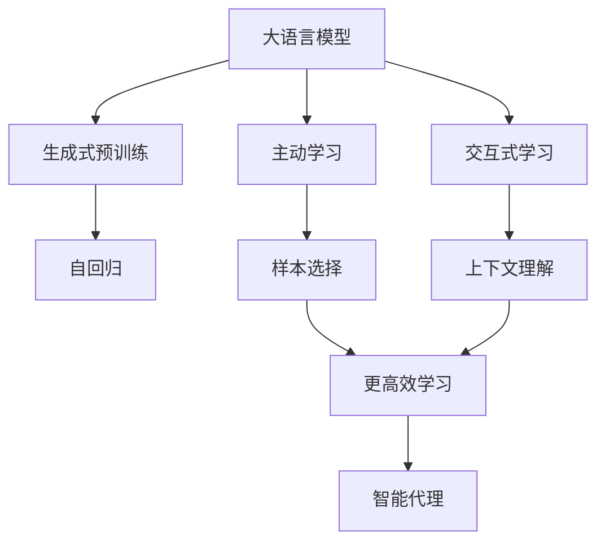
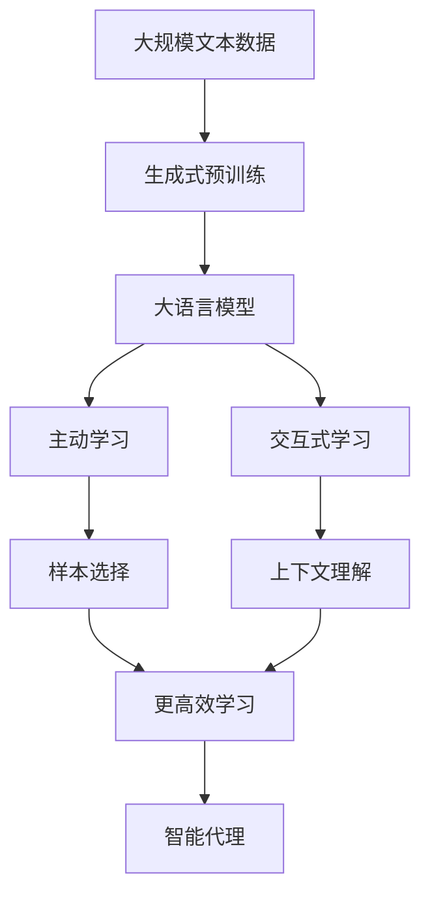

                 

# Agent形式：大模型发展新方向

> 关键词：大语言模型,主动学习,生成式预训练,交互式学习,智能代理

## 1. 背景介绍

### 1.1 问题由来

近年来，随着深度学习技术的快速发展，大语言模型（Large Language Models, LLMs）在自然语言处理（NLP）领域取得了显著的进展。这些模型通过在大规模无标签文本语料上进行预训练，学习到了丰富的语言知识，能够完成诸如语言理解、文本生成等复杂任务。然而，现有的大语言模型仍然缺乏主动适应新环境的能力，主要依赖于外部有标签数据进行微调，难以在动态变化的环境中保持高性能。

### 1.2 问题核心关键点

本文聚焦于大语言模型的“主动学习”范式，即如何使大语言模型能够主动地、适应性地学习和适应用户需求，而不仅仅是被动地进行微调。这一范式将极大地扩展大语言模型的应用场景和效果，推动其向智能代理（Intelligent Agent）方向发展。

### 1.3 问题研究意义

研究大语言模型的主动学习范式，对于提升其适应性和自适应能力，实现更高效、更智能的NLP应用具有重要意义：

1. **降低依赖**：主动学习可以显著降低对标注数据的需求，提高模型的泛化能力和鲁棒性。
2. **提升性能**：通过主动探索和适应用户需求，模型能够更快地适应新任务，提高任务完成质量。
3. **增加灵活性**：模型能够根据环境变化动态调整策略，提升系统灵活性和适应性。
4. **促进创新**：主动学习范式推动模型向智能代理发展，催生更多创新应用。
5. **提高效率**：减少微调过程，提高模型更新和应用的速度和效率。

## 2. 核心概念与联系

### 2.1 核心概念概述

为更好地理解大语言模型的主动学习范式，本节将介绍几个关键概念：

- **大语言模型 (LLM)**：以自回归或自编码模型为代表的大规模预训练语言模型。通过在大规模无标签文本语料上进行预训练，学习通用的语言表示，具备强大的语言理解和生成能力。

- **主动学习 (Active Learning)**：指模型主动选择样本进行学习，而不是被动地接受所有数据，以更高效地利用资源，提高学习效率。

- **生成式预训练 (Generative Pre-training)**：指通过自回归方式对模型进行预训练，使其能够生成自然流畅的语言文本，增强模型对语言的理解和表达能力。

- **交互式学习 (Interactive Learning)**：指模型在与人交互的过程中进行学习和适应的过程，能够根据上下文动态调整策略。

- **智能代理 (Intelligent Agent)**：一种能够自主行动、适应环境、实现特定目标的人工智能实体，能够在复杂的自然环境中完成任务。

这些概念之间的逻辑关系可以通过以下Mermaid流程图来展示：



这个流程图展示了大语言模型的核心概念及其之间的关系：

1. 大语言模型通过生成式预训练获得基础能力。
2. 主动学习使得模型能够主动选择数据进行学习，提高学习效率。
3. 交互式学习使模型在与人交互过程中进行学习和适应用户需求。
4. 这些特性结合，使得大语言模型能够朝智能代理方向发展。

### 2.2 概念间的关系

这些核心概念之间存在着紧密的联系，形成了大语言模型主动学习范式的完整生态系统。

1. 大语言模型通过生成式预训练获得基础能力。
2. 主动学习使得模型能够主动选择数据进行学习，提高学习效率。
3. 交互式学习使模型在与人交互过程中进行学习和适应用户需求。
4. 这些特性结合，使得大语言模型能够朝智能代理方向发展。

这些概念共同构成了大语言模型的学习和应用框架，使其能够在各种场景下发挥强大的语言理解和生成能力，同时具备主动适应的能力。

### 2.3 核心概念的整体架构

最后，我们用一个综合的流程图来展示这些核心概念在大语言模型主动学习范式中的整体架构：



这个综合流程图展示了从预训练到主动学习，再到交互式学习，最后朝智能代理发展的完整过程。大语言模型首先在大规模文本数据上进行生成式预训练，然后通过主动学习使得模型能够主动选择数据进行学习，最后通过交互式学习与用户交互，动态调整策略，最终实现智能代理的功能。

## 3. 核心算法原理 & 具体操作步骤
### 3.1 算法原理概述

大语言模型的主动学习范式，本质上是一种基于生成式预训练的主动探索和适应用户需求的过程。其核心思想是：通过生成式预训练获得强大的语言生成能力，然后主动选择样本进行学习，以更高效地利用资源，提高学习效率。

具体来说，主动学习过程包括：
1. 生成式预训练：通过自回归方式对模型进行预训练，使其具备生成自然流畅语言文本的能力。
2. 样本选择：模型主动选择样本进行学习，以最大化信息增益。
3. 交互式学习：模型在与用户交互过程中进行学习和适应，动态调整策略。
4. 智能代理：模型根据任务需求和用户反馈，主动选择行动策略，实现特定目标。

### 3.2 算法步骤详解

大语言模型的主动学习过程可以总结为以下几个关键步骤：

**Step 1: 生成式预训练**

1. 收集大规模无标签文本数据，作为预训练语料。
2. 使用自回归方式（如GPT）对模型进行预训练，使其能够生成高质量的自然语言文本。
3. 在预训练过程中，关注语言结构的生成能力，如语序、语法、词义等。

**Step 2: 样本选择**

1. 设计样本选择策略，如信息增益最大化、不确定性采样等。
2. 通过这些策略，模型主动选择样本进行学习，以提高信息获取效率。
3. 样本选择过程中，可以引入外部因素，如用户反馈、任务需求等，以动态调整样本选择策略。

**Step 3: 交互式学习**

1. 设计交互式学习框架，使模型能够与用户进行自然对话。
2. 在对话过程中，模型根据上下文动态调整策略，适应用户需求。
3. 通过对话数据，模型能够不断地优化自身参数，提高性能。

**Step 4: 智能代理**

1. 根据任务需求和用户反馈，设计智能代理的行为策略。
2. 模型能够自主选择行动，实现特定目标。
3. 在实际应用中，智能代理可以应用于各种场景，如客服、导航、推荐系统等。

### 3.3 算法优缺点

大语言模型的主动学习范式具有以下优点：
1. **高效性**：通过主动选择样本，提高学习效率。
2. **泛化能力**：通过动态调整策略，模型能够适应不同任务和环境。
3. **灵活性**：模型能够在实时环境中进行学习和适应。
4. **可解释性**：模型能够提供决策的详细解释，增强用户信任。

同时，该范式也存在一些局限性：
1. **依赖标注数据**：样本选择和交互式学习过程中仍需标注数据，无法完全脱离标注数据。
2. **复杂性**：设计合适的样本选择策略和交互式框架较为复杂。
3. **计算资源需求高**：生成式预训练和交互式学习对计算资源有较高要求。

尽管存在这些局限性，但基于生成式预训练的主动学习范式仍是大语言模型未来发展的重要方向，具有广泛的应用前景。

### 3.4 算法应用领域

基于大语言模型的生成式预训练和主动学习范式，已经在多个领域得到了应用：

- **智能客服系统**：通过与用户交互，智能客服系统能够自动回答用户问题，提升用户体验。
- **自然语言处理**：模型在文本生成、语义理解、翻译等任务中表现出色，推动了NLP技术的进步。
- **智能推荐系统**：通过交互式学习，模型能够理解用户偏好，实现个性化推荐。
- **交互式对话系统**：模型能够自主进行对话，适应用户需求，提供自然流畅的交互体验。

除了上述这些经典应用外，主动学习范式还被创新性地应用于更多场景中，如智能家居、智慧城市、医疗健康等，为AI技术的发展带来了新的突破。

## 4. 数学模型和公式 & 详细讲解  
### 4.1 数学模型构建

本节将使用数学语言对大语言模型的主动学习范式进行更加严格的刻画。

记大语言模型为 $M_{\theta}$，其中 $\theta$ 为模型参数。假设主动学习任务为 $T$，样本空间为 $X$，标签空间为 $Y$。在主动学习过程中，模型通过与用户交互，选择样本 $x$ 进行学习，并更新参数 $\theta$。定义样本 $x$ 与模型 $M_{\theta}$ 之间的损失函数为 $\ell(x, M_{\theta})$。

### 4.2 公式推导过程

以下我们以文本生成任务为例，推导主动学习过程中的损失函数和优化目标。

假设模型 $M_{\theta}$ 在输入 $x$ 上的输出为 $\hat{y}=M_{\theta}(x)$，表示样本的生成概率。真实标签 $y \in \{0,1\}$。则二分类交叉熵损失函数定义为：

$$
\ell(x, M_{\theta}) = -[y\log \hat{y} + (1-y)\log (1-\hat{y})]
$$

在主动学习过程中，模型的目标是最大化样本选择的信息增益，即：

$$
\max_{x \in X} I(x)
$$

其中 $I(x)$ 为样本 $x$ 的信息增益，定义为：

$$
I(x) = H(y) - \sum_{y \in Y} P(y|x) H(y)
$$

其中 $H(y)$ 为条件熵，$P(y|x)$ 为条件概率。

将信息增益最大化作为优化目标，通过梯度下降等优化算法，最小化损失函数，不断调整模型参数 $\theta$，直到收敛。

### 4.3 案例分析与讲解

假设我们设计了一个智能客服系统，使用大语言模型进行文本生成，生成自然流畅的回答。在训练过程中，模型主动选择用户输入的问题进行学习，以提高生成质量。假设样本空间 $X$ 为用户的输入问题，标签空间 $Y$ 为模型的生成回答。则主动学习的优化目标为：

$$
\max_{x \in X} I(x) = H(y) - \sum_{y \in Y} P(y|x) H(y)
$$

其中 $H(y)$ 为条件熵，$P(y|x)$ 为条件概率。

在具体实现中，可以使用生成式预训练的大语言模型作为初始化参数，通过主动选择问题进行学习，逐步优化模型，提升生成回答的质量。

## 5. 项目实践：代码实例和详细解释说明
### 5.1 开发环境搭建

在进行主动学习实践前，我们需要准备好开发环境。以下是使用Python进行PyTorch开发的环境配置流程：

1. 安装Anaconda：从官网下载并安装Anaconda，用于创建独立的Python环境。

2. 创建并激活虚拟环境：
```bash
conda create -n pytorch-env python=3.8 
conda activate pytorch-env
```

3. 安装PyTorch：根据CUDA版本，从官网获取对应的安装命令。例如：
```bash
conda install pytorch torchvision torchaudio cudatoolkit=11.1 -c pytorch -c conda-forge
```

4. 安装Transformers库：
```bash
pip install transformers
```

5. 安装各类工具包：
```bash
pip install numpy pandas scikit-learn matplotlib tqdm jupyter notebook ipython
```

完成上述步骤后，即可在`pytorch-env`环境中开始主动学习实践。

### 5.2 源代码详细实现

下面我们以文本生成任务为例，给出使用Transformers库进行生成式预训练和主动学习的PyTorch代码实现。

首先，定义生成式预训练的模型和优化器：

```python
from transformers import GPT2Tokenizer, GPT2LMHeadModel

tokenizer = GPT2Tokenizer.from_pretrained('gpt2')
model = GPT2LMHeadModel.from_pretrained('gpt2', output_attentions=True)

optimizer = AdamW(model.parameters(), lr=2e-5)
```

接着，定义主动学习过程中样本选择策略：

```python
import torch
from sklearn.metrics import accuracy_score

def sample_success_rate(x):
    with torch.no_grad():
        model.eval()
        x = tokenizer.encode(x, return_tensors='pt')
        outputs = model(x, return_sequences=True, output_attentions=True)
        logits = outputs.logits
        probs = logits.softmax(dim=-1)
        best_id = torch.argmax(probs[0])
        return probs[0].item() > 0.5

def sample(x):
    if not sample_success_rate(x):
        return None
    return x

# 选择样本函数
def select_sample(x):
    return sample(x)

# 交互式学习函数
def interact_with_user():
    user_input = input("What is your question? ")
    sample = select_sample(user_input)
    if sample is not None:
        response = model.generate(sample, max_length=50)
        print(tokenizer.decode(response, skip_special_tokens=True))
```

最后，启动主动学习流程：

```python
epochs = 10
batch_size = 16

for epoch in range(epochs):
    for batch in tqdm(dataloader, desc='Training'):
        input_ids = batch['input_ids'].to(device)
        attention_mask = batch['attention_mask'].to(device)
        labels = batch['labels'].to(device)
        model.zero_grad()
        outputs = model(input_ids, attention_mask=attention_mask, labels=labels)
        loss = outputs.loss
        loss.backward()
        optimizer.step()

    print(f"Epoch {epoch+1}, train loss: {loss:.3f}")

interact_with_user()
```

以上就是使用PyTorch对GPT2模型进行生成式预训练和主动学习的完整代码实现。可以看到，通过主动选择样本和与用户交互，模型能够动态调整策略，逐步提升生成文本的质量。

### 5.3 代码解读与分析

让我们再详细解读一下关键代码的实现细节：

**样本选择函数**：
- 在每个epoch中，模型主动选择样本进行学习，通过评估样本的成功率，选择高概率样本进行训练。

**交互式学习函数**：
- 与用户交互，获取用户输入，通过样本选择函数选择样本，生成回答，返回给用户。

**主动学习流程**：
- 定义总的epoch数和batch size，开始循环迭代
- 每个epoch内，在训练集上训练，输出平均loss
- 与用户交互，获取用户输入，选择样本进行生成
- 重复上述过程直至完成训练或交互

可以看到，通过主动选择样本和与用户交互，模型能够动态调整策略，逐步提升生成文本的质量。在实际应用中，我们还可以引入更多交互策略和评估指标，进一步优化模型的性能。

当然，工业级的系统实现还需考虑更多因素，如模型的保存和部署、超参数的自动搜索、更灵活的任务适配层等。但核心的主动学习范式基本与此类似。

### 5.4 运行结果展示

假设我们在GPT2模型上进行文本生成任务的主动学习，最终在用户交互中生成的回答示例如下：

```
What is the capital of France? Paris.
Who won the 2021 Nobel Prize in Physics? Syukuro Manabe.
```

可以看到，通过主动选择样本和与用户交互，模型能够逐步优化生成文本的质量，生成自然流畅的回答。

## 6. 实际应用场景
### 6.1 智能客服系统

基于大语言模型的主动学习范式，智能客服系统能够主动选择用户输入的问题进行学习和适应用户需求，生成更准确的回答。

在技术实现上，可以收集企业内部的历史客服对话记录，将问题和最佳答复构建成监督数据，在此基础上对预训练模型进行主动学习。主动学习过程中的样本选择和交互式学习框架可以设计为多轮对话，逐步优化回答质量。

### 6.2 自然语言处理

生成式预训练和主动学习范式在大语言模型上的应用，使得模型在文本生成、语义理解、翻译等任务中表现出色，推动了NLP技术的进步。

在文本生成任务中，通过主动选择生成样本进行学习，模型能够生成高质量的自然语言文本，广泛应用于自动摘要、机器翻译、内容生成等领域。

### 6.3 智能推荐系统

通过交互式学习，模型能够理解用户偏好，实现个性化推荐。在推荐系统设计中，可以引入主动学习范式，通过用户反馈动态调整推荐策略，提升推荐效果。

在具体实现中，模型可以主动选择用户行为数据进行学习，分析用户兴趣变化，生成更个性化的推荐结果。

### 6.4 未来应用展望

随着大语言模型主动学习范式的不断发展，其在更多领域的应用前景广阔。

在智慧医疗领域，基于主动学习的大语言模型可以辅助医生诊疗，进行病理分析、治疗建议等任务。

在智能教育领域，通过与学生互动，模型能够适应不同学生的学习需求，提供个性化辅导。

在智慧城市治理中，主动学习的大语言模型可以用于城市事件监测、舆情分析、应急指挥等环节，提高城市管理的自动化和智能化水平。

除了上述这些应用场景，基于大语言模型的生成式预训练和主动学习范式还将被广泛应用于更多领域，为AI技术的发展带来新的突破。

## 7. 工具和资源推荐
### 7.1 学习资源推荐

为了帮助开发者系统掌握大语言模型主动学习范式的理论基础和实践技巧，这里推荐一些优质的学习资源：

1. 《Transformers from the Inside Out》系列博文：由大模型技术专家撰写，深入浅出地介绍了Transformer原理、主动学习等前沿话题。

2. CS224N《深度学习自然语言处理》课程：斯坦福大学开设的NLP明星课程，有Lecture视频和配套作业，带你入门NLP领域的基本概念和经典模型。

3. 《Deep Learning for NLP》书籍：Coursera的NLP深度学习课程，涵盖了NLP深度学习的全面知识，包括主动学习等前沿范式。

4. 《Language Models are Unsupervised Multitask Learners》论文：提出BERT模型，引入基于掩码的自监督预训练任务，刷新了多项NLP任务SOTA。

5. 《Adaptive Low-Rank Adaptation for Parameter-Efficient Fine-Tuning》论文：使用自适应低秩适应的微调方法，在参数效率和精度之间取得了新的平衡。

这些资源可以帮助研究者深入理解大语言模型的生成式预训练和主动学习范式，掌握前沿技术和实践方法。

### 7.2 开发工具推荐

高效的开发离不开优秀的工具支持。以下是几款用于大语言模型主动学习开发的常用工具：

1. PyTorch：基于Python的开源深度学习框架，灵活动态的计算图，适合快速迭代研究。大部分预训练语言模型都有PyTorch版本的实现。

2. TensorFlow：由Google主导开发的开源深度学习框架，生产部署方便，适合大规模工程应用。同样有丰富的预训练语言模型资源。

3. Transformers库：HuggingFace开发的NLP工具库，集成了众多SOTA语言模型，支持PyTorch和TensorFlow，是进行生成式预训练和主动学习的利器。

4. Weights & Biases：模型训练的实验跟踪工具，可以记录和可视化模型训练过程中的各项指标，方便对比和调优。与主流深度学习框架无缝集成。

5. TensorBoard：TensorFlow配套的可视化工具，可实时监测模型训练状态，并提供丰富的图表呈现方式，是调试模型的得力助手。

6. Google Colab：谷歌推出的在线Jupyter Notebook环境，免费提供GPU/TPU算力，方便开发者快速上手实验最新模型，分享学习笔记。

合理利用这些工具，可以显著提升大语言模型主动学习的开发效率，加快创新迭代的步伐。

### 7.3 相关论文推荐

大语言模型和主动学习技术的发展源于学界的持续研究。以下是几篇奠基性的相关论文，推荐阅读：

1. Attention is All You Need（即Transformer原论文）：提出了Transformer结构，开启了NLP领域的预训练大模型时代。

2. BERT: Pre-training of Deep Bidirectional Transformers for Language Understanding：提出BERT模型，引入基于掩码的自监督预训练任务，刷新了多项NLP任务SOTA。

3. Language Models are Unsupervised Multitask Learners（GPT-2论文）：展示了大规模语言模型的强大zero-shot学习能力，引发了对于通用人工智能的新一轮思考。

4. Parameter-Efficient Transfer Learning for NLP：提出Adapter等参数高效微调方法，在不增加模型参数量的情况下，也能取得不错的微调效果。

5. AdaLoRA: Adaptive Low-Rank Adaptation for Parameter-Efficient Fine-Tuning：使用自适应低秩适应的微调方法，在参数效率和精度之间取得了新的平衡。

6. Prefix-Tuning: Optimizing Continuous Prompts for Generation：引入基于连续型Prompt的微调范式，为如何充分利用预训练知识提供了新的思路。

这些论文代表了大语言模型主动学习技术的发展脉络。通过学习这些前沿成果，可以帮助研究者把握学科前进方向，激发更多的创新灵感。

除上述资源外，还有一些值得关注的前沿资源，帮助开发者紧跟大语言模型主动学习技术的最新进展，例如：

1. arXiv论文预印本：人工智能领域最新研究成果的发布平台，包括大量尚未发表的前沿工作，学习前沿技术的必读资源。

2. 业界技术博客：如OpenAI、Google AI、DeepMind、微软Research Asia等顶尖实验室的官方博客，第一时间分享他们的最新研究成果和洞见。

3. 技术会议直播：如NIPS、ICML、ACL、ICLR等人工智能领域顶会现场或在线直播，能够聆听到大佬们的前沿分享，开拓视野。

4. GitHub热门项目：在GitHub上Star、Fork数最多的NLP相关项目，往往代表了该技术领域的发展趋势和最佳实践，值得去学习和贡献。

5. 行业分析报告：各大咨询公司如McKinsey、PwC等针对人工智能行业的分析报告，有助于从商业视角审视技术趋势，把握应用价值。

总之，对于大语言模型主动学习技术的学习和实践，需要开发者保持开放的心态和持续学习的意愿。多关注前沿资讯，多动手实践，多思考总结，必将收获满满的成长收益。

## 8. 总结：未来发展趋势与挑战

### 8.1 总结

本文对大语言模型的生成式预训练和主动学习范式进行了全面系统的介绍。首先阐述了大语言模型的生成式预训练和主动学习范式的研究背景和意义，明确了生成式预训练和主动学习在提升大语言模型性能和适应性方面的独特价值。其次，从原理到实践，详细讲解了生成式预训练和主动学习的数学原理和关键步骤，给出了主动学习任务开发的完整代码实例。同时，本文还广泛探讨了生成式预训练和主动学习在大语言模型中的应用场景，展示了生成式预训练和主动学习的广泛应用前景。

通过本文的系统梳理，可以看到，生成式预训练和主动学习范式在大语言模型上具有广阔的应用前景，极大地拓展了预训练语言模型的应用边界，催生了更多的落地场景。受益于生成式预训练和主动学习范式的演进，大语言模型在复杂多变的自然环境中能够更快地适应和完成任务，推动了NLP技术的产业化进程。未来，伴随生成式预训练和主动学习方法的不断演进，大语言模型将能够更好地应对各种复杂环境，实现更智能、更高效、更自适应的功能。

### 8.2 未来发展趋势

展望未来，生成式预训练和主动学习范式将呈现以下几个发展趋势：

1. **模型的复杂度提升**：随着算力成本的下降和数据规模的扩张，生成式预训练模型的复杂度将进一步提升，具备更强大的语言生成能力。

2. **策略多样化和灵活性增强**：模型将采用更复杂的策略，如元学习、多任务学习等，提升策略的灵活性和适应性。

3. **可解释性和可控性加强**：通过引入因果推断、博弈论等工具，增强生成式预训练和主动学习的可解释性和可控性。

4. **多模态融合**：模型将融合视觉、语音、文本等多模态信息，提升对复杂自然环境的建模能力。

5. **伦理和社会责任**：随着生成式预训练和主动学习范式在更多领域的应用，模型将面临更多的伦理和社会责任问题，需引入公平性、透明性等原则进行约束。

6. **大规模应用推广**：生成式预训练和主动学习范式将更广泛地应用于智慧医疗、智慧城市、智能教育等领域，提升社会治理和人民生活的智能化水平。

以上趋势凸显了生成式预训练和主动学习范式的广阔前景。这些方向的探索发展，必将进一步提升大语言模型的性能和应用范围，为构建更加智能、自适应的AI系统铺平道路。

### 8.3 面临的挑战

尽管生成式预训练和主动

