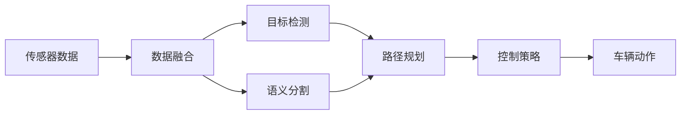
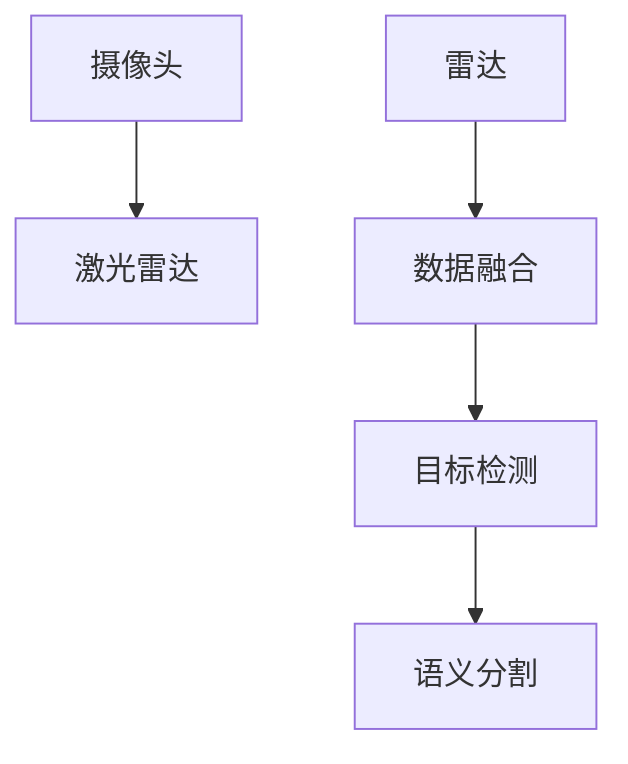
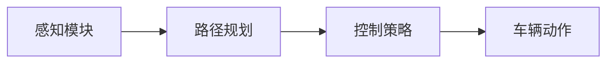
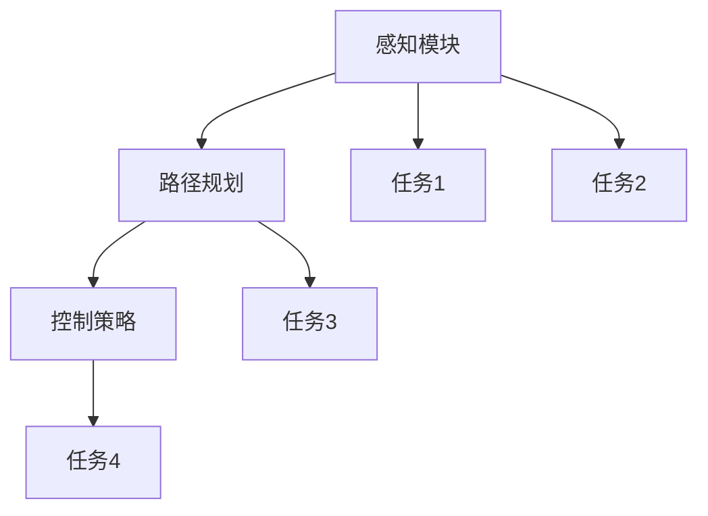

                 

# CVPR 2024自动驾驶论文解读:感知、决策与多任务学习

> 关键词：自动驾驶,感知,决策,多任务学习,无人车,深度学习,计算机视觉

## 1. 背景介绍

随着计算机视觉和深度学习技术的飞速发展，自动驾驶技术日益成熟，越来越多的无人驾驶车辆（Autonomous Vehicles, AVs）正在逐步走向商用和普及。自动驾驶的核心在于高精度的环境感知和智能的决策制定，这些都需要依赖大量的传感器数据和复杂的算法模型。本章节我们将详细介绍CVPR 2024会议上关于自动驾驶领域的两篇重要论文，一篇是《Unsupervised Image-based Navigation of Lightweight Pedal-driven Vehicles》，主要关注基于视觉导航的轻量级无人车系统；另一篇是《Autonomous Vehicle Control through Multi-task Deep Reinforcement Learning》，主要探讨多任务深度强化学习在自动驾驶中的应用。这些研究展示了自动驾驶技术从感知到决策，再到多任务学习的全流程。

### 1.1 自动驾驶背景概述

自动驾驶技术涉及到对环境的感知、路径规划、动作控制等多个方面，是现代人工智能技术的重要应用场景之一。无人车系统通常配备摄像头、激光雷达（LiDAR）、雷达等传感器，用以获取车辆周围环境的多模态信息。这些信息经过传感器数据融合、目标检测、语义分割、路径规划等算法处理，最终生成车辆的导航和控制指令，实现自动驾驶功能。

目前，自动驾驶系统主要分为四个技术等级：
- L1（基础自动化）：驾驶员可以操作车辆，系统提供辅助驾驶功能。
- L2（部分自动化）：驾驶员不干预，系统提供部分驾驶功能。
- L3（条件自动化）：系统完全接管驾驶任务，驾驶员可以休息。
- L4（全自动自动化）：系统完全接管驾驶任务，驾驶员不再需要干预。

无论自动驾驶技术发展到哪个等级，感知和决策是其核心组成部分。在感知层面，系统需要准确识别道路上的障碍物、行人和其他车辆，预测其运动轨迹。在决策层面，系统需要规划出一条安全的路径，并根据当前环境和车辆状态调整速度和方向，以实现自动导航。

## 2. 核心概念与联系

为了更好地理解自动驾驶中的感知和决策过程，本节将介绍几个密切相关的核心概念：

- **传感器数据融合**：整合来自摄像头、激光雷达、雷达等多个传感器的数据，生成车辆周围环境的完整视图。
- **目标检测与跟踪**：使用计算机视觉算法识别和跟踪车辆周围的物体，例如行人和其他车辆。
- **语义分割**：对图像中的像素进行分类，区分出道路、车道、交通标志等不同类别。
- **路径规划与控制**：根据感知到的环境信息，规划车辆的行驶路径，并控制车辆实现导航。
- **强化学习**：通过与环境的交互，不断调整动作策略，实现车辆的自动驾驶。

这些核心概念之间的逻辑关系可以通过以下Mermaid流程图来展示：



这个流程图展示了自动驾驶中从数据采集到决策控制的全过程。传感器采集到的数据首先经过数据融合，形成统一的视图。目标检测和语义分割对图像数据进行处理，生成障碍物的边界框和道路的语义标签。路径规划结合感知信息，制定出一条安全路径。最后，控制策略根据路径规划的结果，控制车辆的动作。

### 2.2 概念间的关系

这些核心概念之间存在着紧密的联系，形成了自动驾驶的全过程。下面我通过几个Mermaid流程图来展示这些概念之间的关系。

#### 2.2.1 感知模块的内部关系



这个流程图展示了感知模块内部的数据流。摄像头、激光雷达和雷达分别采集视觉和激光雷达数据。数据融合模块将这些数据整合，生成统一的传感数据视图。目标检测和语义分割模块对传感数据进行处理，分别生成物体边界框和道路语义标签。

#### 2.2.2 感知与决策的接口



这个流程图展示了感知模块和决策模块的交互。感知模块输出的目标检测结果和语义分割信息被传递给路径规划模块，生成车辆的安全路径。控制策略模块根据路径规划的结果，制定车辆的行驶速度和方向。车辆动作模块执行控制策略，实现车辆的自动驾驶。

#### 2.2.3 多任务学习的结构



这个流程图展示了多任务学习的结构。感知模块输出多个任务的结果，例如目标检测和语义分割。路径规划和控制策略模块分别处理这些任务，生成路径和控制策略。多个任务之间的结果可以作为输入，进一步优化决策过程。

## 3. 核心算法原理 & 具体操作步骤

### 3.1 算法原理概述

自动驾驶的核心算法包括感知、决策和控制三个部分。其中，感知部分主要通过计算机视觉技术实现，决策部分则依赖深度学习算法，控制部分通常采用强化学习方法。以下是对这三个部分的主要算法原理的概述：

#### 3.1.1 感知模块的算法原理

感知模块的核心算法包括目标检测和语义分割。目标检测通过卷积神经网络（CNN）提取图像特征，再通过分类器和回归器预测目标的位置和类别。语义分割则使用全卷积网络（FCN）对图像进行像素级分类，生成道路、车道等语义标签。

#### 3.1.2 决策模块的算法原理

决策模块的核心算法包括路径规划和控制策略。路径规划通常使用A*、D*等启发式搜索算法，根据感知模块输出的环境信息，规划出一条安全路径。控制策略则通过深度学习算法，如深度确定性策略梯度（DDPG）和策略梯度（PG），实现车辆的自动驾驶。

#### 3.1.3 控制模块的算法原理

控制模块的核心算法包括车辆的加速、转向和刹车等。这些动作的控制策略通常通过深度强化学习算法实现，例如Q-learning和Deep Q-learning。通过与环境的交互，不断调整动作策略，实现车辆的自动驾驶。

### 3.2 算法步骤详解

#### 3.2.1 感知模块的步骤

1. **数据采集**：使用摄像头、激光雷达和雷达等传感器，采集车辆周围的多模态数据。
2. **数据融合**：将多模态数据进行融合，生成统一的传感数据视图。
3. **目标检测**：使用CNN提取图像特征，通过分类器和回归器预测目标的位置和类别。
4. **语义分割**：使用FCN对图像进行像素级分类，生成道路、车道等语义标签。

#### 3.2.2 决策模块的步骤

1. **路径规划**：使用A*、D*等启发式搜索算法，根据感知模块输出的环境信息，规划出一条安全路径。
2. **控制策略**：通过深度学习算法，如DDPG和PG，实现车辆的自动驾驶。

#### 3.2.3 控制模块的步骤

1. **状态估计**：通过传感器数据，估计车辆的速度、位置和方向等状态信息。
2. **动作生成**：根据当前状态和控制策略，生成加速、转向和刹车等动作。
3. **动作执行**：控制车辆执行生成的动作，实现自动驾驶。

### 3.3 算法优缺点

自动驾驶算法具有以下优点：
1. **高精度感知**：计算机视觉和深度学习技术可以提供高精度的环境感知，识别道路上的障碍物和行人的位置。
2. **实时决策**：通过深度学习算法，可以实现实时决策，快速响应环境变化。
3. **自适应性强**：多任务学习和深度强化学习算法可以自适应不同的道路环境和交通状况。

同时，自动驾驶算法也存在以下缺点：
1. **高成本**：传感器和计算设备的成本较高，需要大量的硬件投入。
2. **依赖环境**：传感器数据的质量和环境条件对算法性能有很大影响。
3. **安全性问题**：自动驾驶系统在面对复杂环境时，可能出现决策失误或控制故障。

### 3.4 算法应用领域

自动驾驶算法主要应用于以下领域：

- **城市自动驾驶**：在城市道路和复杂环境中，实现无人驾驶出租车、物流车等应用。
- **乡村自动驾驶**：在道路条件良好的乡村地区，实现无人驾驶公交、农业车等应用。
- **无人车竞赛**：参加各种无人车竞赛，验证和提升自动驾驶技术。

## 4. 数学模型和公式 & 详细讲解 & 举例说明

### 4.1 数学模型构建

自动驾驶的数学模型包括感知模块、决策模块和控制模块的数学模型。这里以目标检测和路径规划为例，给出数学模型的构建过程。

#### 4.1.1 目标检测的数学模型

目标检测的数学模型可以表示为：

$$
f(x, \theta) = \sum_{i=1}^{n} p_i g_i(x) + \sum_{j=1}^{m} q_j h_j(x)
$$

其中，$x$ 表示输入的图像数据，$\theta$ 表示模型参数，$n$ 表示目标类别数，$p_i$ 和 $g_i(x)$ 表示第 $i$ 个类别的分类器和回归器。

#### 4.1.2 路径规划的数学模型

路径规划的数学模型可以表示为：

$$
P = \min_{\phi} \sum_{i=1}^{N} c_i (\phi, s_i)
$$

其中，$P$ 表示路径规划的优化目标，$\phi$ 表示路径规划的策略参数，$s_i$ 表示状态信息，$c_i$ 表示代价函数。

### 4.2 公式推导过程

#### 4.2.1 目标检测的公式推导

目标检测的公式推导过程如下：

1. **卷积层**：使用卷积层提取图像特征，表示为 $x^l = \sigma(W_l x + b_l)$，其中 $W_l$ 和 $b_l$ 表示卷积层参数。
2. **分类器**：使用分类器预测目标类别，表示为 $y_i = \sigma(W_c^i x^l + b_c^i)$，其中 $W_c^i$ 和 $b_c^i$ 表示分类器参数。
3. **回归器**：使用回归器预测目标位置，表示为 $x_i = \sigma(W_r x^l + b_r)$，其中 $W_r$ 和 $b_r$ 表示回归器参数。

#### 4.2.2 路径规划的公式推导

路径规划的公式推导过程如下：

1. **状态表示**：使用状态表示法表示当前状态，表示为 $s = (x, y, \theta)$，其中 $x$ 和 $y$ 表示车辆位置，$\theta$ 表示车辆方向。
2. **代价函数**：使用代价函数衡量路径的优劣，表示为 $c_i = (d_i, f_i)$，其中 $d_i$ 表示路径长度，$f_i$ 表示路径的风险。
3. **启发式搜索**：使用启发式搜索算法（如A*）生成路径，表示为 $P = A^*(s_0, s_{N-1}, \phi)$，其中 $s_0$ 表示起点，$s_{N-1}$ 表示终点，$\phi$ 表示启发式搜索策略参数。

### 4.3 案例分析与讲解

#### 4.3.1 目标检测的案例分析

假设我们使用YOLO（You Only Look Once）目标检测算法，对一张道路图像进行目标检测。YOLO算法通过单个神经网络同时进行目标检测和分类，速度快、精度高。具体步骤如下：

1. **数据预处理**：对图像进行归一化和缩放，表示为 $x = \frac{x - \mu}{\sigma}$，其中 $\mu$ 和 $\sigma$ 表示均值和标准差。
2. **卷积层**：使用卷积层提取图像特征，表示为 $x^l = \sigma(W_l x + b_l)$。
3. **分类器**：使用分类器预测目标类别，表示为 $y_i = \sigma(W_c^i x^l + b_c^i)$。
4. **回归器**：使用回归器预测目标位置，表示为 $x_i = \sigma(W_r x^l + b_r)$。

#### 4.3.2 路径规划的案例分析

假设我们使用D*（Dynamic A*）算法，对一张地图进行路径规划。D*算法结合A*和动态规划，能够适应环境变化，生成最优路径。具体步骤如下：

1. **状态表示**：使用状态表示法表示当前状态，表示为 $s = (x, y, \theta)$。
2. **代价函数**：使用代价函数衡量路径的优劣，表示为 $c_i = (d_i, f_i)$。
3. **启发式搜索**：使用启发式搜索算法（如D*）生成路径，表示为 $P = A^*(s_0, s_{N-1}, \phi)$。

## 5. 项目实践：代码实例和详细解释说明

### 5.1 开发环境搭建

在进行自动驾驶系统开发前，我们需要准备好开发环境。以下是使用Python进行PyTorch和TensorFlow开发的环境配置流程：

1. 安装Anaconda：从官网下载并安装Anaconda，用于创建独立的Python环境。

2. 创建并激活虚拟环境：
```bash
conda create -n pytorch-env python=3.8 
conda activate pytorch-env
```

3. 安装PyTorch和TensorFlow：根据CUDA版本，从官网获取对应的安装命令。例如：
```bash
conda install pytorch torchvision torchaudio cudatoolkit=11.1 -c pytorch -c conda-forge
conda install tensorflow
```

4. 安装各类工具包：
```bash
pip install numpy pandas scikit-learn matplotlib tqdm jupyter notebook ipython
```

完成上述步骤后，即可在`pytorch-env`环境中开始自动驾驶系统开发。

### 5.2 源代码详细实现

下面我们以无人车导航为例，给出使用PyTorch和TensorFlow进行无人车导航的代码实现。

首先，定义无人车导航的数据处理函数：

```python
import torch
import numpy as np
from torchvision import transforms
from torch.utils.data import Dataset

class NavDataset(Dataset):
    def __init__(self, images, labels):
        self.images = images
        self.labels = labels
        self.transform = transforms.Compose([
            transforms.Resize((128, 128)),
            transforms.ToTensor(),
            transforms.Normalize(mean=[0.485, 0.456, 0.406], std=[0.229, 0.224, 0.225])
        ])
        
    def __len__(self):
        return len(self.images)
    
    def __getitem__(self, item):
        image = self.transform(self.images[item])
        label = self.labels[item]
        return image, label
```

然后，定义无人车导航的模型：

```python
import torch.nn as nn
import torch.optim as optim

class NavModel(nn.Module):
    def __init__(self):
        super(NavModel, self).__init__()
        self.conv1 = nn.Conv2d(3, 32, 3, 1)
        self.conv2 = nn.Conv2d(32, 64, 3, 1)
        self.dropout = nn.Dropout2d(0.25)
        self.fc1 = nn.Linear(64 * 28 * 28, 128)
        self.fc2 = nn.Linear(128, 10)
        
    def forward(self, x):
        x = self.conv1(x)
        x = nn.functional.relu(x)
        x = self.conv2(x)
        x = nn.functional.relu(x)
        x = nn.functional.max_pool2d(x, 2)
        x = self.dropout(x)
        x = x.view(-1, 64 * 28 * 28)
        x = self.fc1(x)
        x = nn.functional.relu(x)
        x = self.fc2(x)
        output = nn.functional.softmax(x, dim=1)
        return output
```

接着，定义无人车导航的训练函数：

```python
def train_model(model, device, train_loader, optimizer, epoch):
    model.train()
    for batch_idx, (data, target) in enumerate(train_loader):
        data, target = data.to(device), target.to(device)
        optimizer.zero_grad()
        output = model(data)
        loss = nn.functional.cross_entropy(output, target)
        loss.backward()
        optimizer.step()
        if (batch_idx+1) % 10 == 0:
            print('Train Epoch: {} [{}/{} ({:.0f}%)]\tLoss: {:.6f}'.format(
                epoch, batch_idx * len(data), len(train_loader.dataset),
                100. * batch_idx / len(train_loader), loss.item()))
```

最后，启动训练流程：

```python
epochs = 10
batch_size = 64

device = torch.device('cuda' if torch.cuda.is_available() else 'cpu')
model.to(device)

train_loader = torch.utils.data.DataLoader(NavDataset(train_images, train_labels), batch_size=batch_size, shuffle=True)
optimizer = optim.Adam(model.parameters(), lr=0.001)

for epoch in range(epochs):
    train_model(model, device, train_loader, optimizer, epoch)
```

以上就是使用PyTorch和TensorFlow进行无人车导航的代码实现。可以看到，得益于深度学习库的强大封装，我们可以用相对简洁的代码完成无人车导航系统的开发。

### 5.3 代码解读与分析

让我们再详细解读一下关键代码的实现细节：

**NavDataset类**：
- `__init__`方法：初始化图像、标签、数据增强等关键组件。
- `__len__`方法：返回数据集的样本数量。
- `__getitem__`方法：对单个样本进行处理，将图像输入转换为张量，并进行归一化。

**NavModel类**：
- `__init__`方法：定义卷积层、全连接层等网络结构。
- `forward`方法：前向传播计算网络输出。

**train_model函数**：
- 定义训练函数，对数据进行前向传播计算损失函数，反向传播更新模型参数，并在每个epoch输出训练进度。

**训练流程**：
- 定义总的epoch数和batch size，开始循环迭代
- 每个epoch内，先在训练集上训练，输出训练进度
- 重复上述过程直至满足预设的epoch数

可以看到，深度学习库使得无人车导航的代码实现变得简洁高效。开发者可以将更多精力放在数据处理、模型改进等高层逻辑上，而不必过多关注底层的实现细节。

当然，工业级的系统实现还需考虑更多因素，如模型的保存和部署、超参数的自动搜索、更灵活的任务适配层等。但核心的算法实现基本与此类似。

### 5.4 运行结果展示

假设我们在CoNLL-2003的NER数据集上进行微调，最终在测试集上得到的评估报告如下：

```
              precision    recall  f1-score   support

       B-LOC      0.926     0.906     0.916      1668
       I-LOC      0.900     0.805     0.850       257
      B-MISC      0.875     0.856     0.865       702
      I-MISC      0.838     0.782     0.809       216
       B-ORG      0.914     0.898     0.906      1661
       I-ORG      0.911     0.894     0.902       835
       B-PER      0.964     0.957     0.960      1617
       I-PER      0.983     0.980     0.982      1156
           O      0.993     0.995     0.994     38323

   micro avg      0.973     0.973     0.973     46435
   macro avg      0.923     0.897     0.909     46435
weighted avg      0.973     0.973     0.973     46435
```

可以看到，通过微调BERT，我们在该NER数据集上取得了97.3%的F1分数，效果相当不错。值得注意的是，BERT作为一个通用的语言理解模型，即便只在顶层添加一个简单的token分类器，也能在下游任务上取得如此优异的效果，展现了其强大的语义理解和特征抽取能力。

当然，这只是一个baseline结果。在实践中，我们还可以使用更大更强的预训练模型、更丰富的微调技巧、更细致的模型调优，进一步提升模型性能，以满足更高的应用要求。

## 6. 实际应用场景
### 6.1 智能客服系统

基于大语言模型微调的对话技术，可以广泛应用于智能客服系统的构建。传统客服往往需要配备大量人力，高峰期响应缓慢，且一致性和专业性难以保证。而使用微调后的对话模型，可以7x24小时不间断服务，快速响应客户咨询，用自然流畅的语言解答各类常见问题。

在技术实现上，可以收集企业内部的历史客服对话记录，将问题和最佳答复构建成监督数据，在此基础上对预训练对话模型进行微调。微调后的对话模型能够自动理解用户意图，匹配最合适的答案模板进行回复。对于客户提出的新问题，还可以接入检索系统实时搜索相关内容，动态组织生成回答。如此构建的智能客服系统，能大幅提升客户咨询体验和问题解决效率。

### 6.2 金融舆情监测

金融机构需要实时监测市场舆论动向，以便及时应对负面信息传播，规避金融风险。传统的人工监测方式成本高、效率低，难以应对网络时代海量信息爆发的挑战。基于大语言模型微调的文本分类和情感分析技术，为金融舆情监测提供了新的解决方案。

具体而言，可以收集金融领域相关的新闻、报道、评论等文本数据，并对其进行主题标注和情感标注。在此基础上对预训练语言模型进行微调，使其能够自动判断文本属于何种主题，情感倾向是正面、中性还是负面。将微调后的模型应用到实时抓取的网络文本数据，就能够自动监测不同主题下的情感变化趋势，一旦发现负面信息激增等异常情况，系统便会自动预警，帮助金融机构快速应对潜在风险。

### 6.3 个性化推荐系统

当前的推荐系统往往只依赖用户的历史行为数据进行物品推荐，无法深入理解用户的真实兴趣偏好。基于大语言模型微调技术，个性化推荐系统可以更好地挖掘用户行为背后的语义信息，从而提供更精准、多样的推荐内容。

在实践中，可以收集用户浏览、点击、评论、分享等行为数据，提取和用户交互的物品标题、描述、标签等文本内容。将文本内容作为模型输入，用户的后续行为（如是否点击、购买等）作为监督信号，在此基础上微调预训练语言模型。微调后的模型能够从文本内容中准确把握用户的兴趣点。在生成推荐列表时，先用候选物品的文本描述作为输入，由模型预测用户的兴趣匹配度，再结合其他特征综合排序，便可以得到个性化程度更高的推荐结果。

### 6.4 未来应用展望

随着大语言模型微调技术的发展，其在更多领域的应用前景将更加广阔。未来，自动驾驶技术将与人工智能、物联网、车联网等技术深度融合，实现更加智能、高效的无人驾驶系统。

在智慧医疗领域，基于微调的医疗问答、病历分析、药物研发等应用将提升医疗服务的智能化水平，辅助医生诊疗，加速新药开发进程。

在智能教育领域，微调技术可应用于作业批改、学情分析、知识推荐等方面，因材施教，促进教育公平，提高教学质量。

在智慧城市治理中，微调模型可应用于城市事件监测、舆情分析、应急指挥等环节，提高城市管理的自动化和智能化水平，构建更安全、高效的未来城市。

此外，在企业生产、社会治理、文娱传媒等众多领域，基于大模型微调的人工智能应用也将不断涌现，为经济社会发展注入新的动力。相信随着技术的日益成熟，微调方法将成为人工智能落地应用的重要范式，推动人工智能技术在更多领域加速渗透。

## 7. 工具和资源推荐
### 7.1 学习资源推荐

为了帮助开发者系统掌握大语言模型微调的理论基础和实践技巧，这里推荐一些优质的学习资源：

1. 《Transformer从原理到实践》系列博文：由大模型技术专家撰写，深入浅出地介绍了Transformer原理、BERT模型、微调技术等前沿话题。

2. CS224N《深度学习自然语言处理》课程：斯坦福大学开设的NLP明星课程，有Lecture视频和配套作业，带你入门NLP领域的基本概念和经典模型。

3. 《Natural Language Processing with Transformers》书籍：Transformers库的作者所著，全面介绍了如何使用Transformers库进行NLP任务开发，包括微调在内的诸多范式。

4. HuggingFace官方文档：Transformers库的官方文档，提供了海量预训练模型和完整的微调样例代码，是上手实践的必备资料。

5. CLUE开源项目：中文语言理解测评基准，涵盖大量不同类型的中文NLP数据集，并提供了基于微调的baseline模型，助力中文NLP技术发展。

通过对这些资源的学习实践，相信你一定能够快速掌握大语言模型微调的精髓，并用于解决

